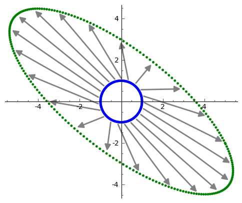

Przekształcenia liniowe, jądro i obraz, interpretacja geometryczna
------------------------------------------------------------------

Matematyczne wprowadzenie znajduje się w pliku  `pdf. <data/iCSE_MAlg02_z43_przek_lin_WSTEP.pdf>`_

.. code-block:: python

    sage: %auto 
    sage: var('x y z')
    sage: # funkcje pomocnicze wizualizujące macierze i efekty działania przekształceń liniowych
    sage: def show_2d_transf(T,typ='face',connect=None,npoints=100,**reszta):
    ...       """
    ...       Wizualizacja przekształcenia (niekoniecznie) liniowego w dwóch wymiarach.
    ...       """
    ...       
    ...       from math import sin,cos
    ...       if typ=='face':
    ...           punkty=[vector([cos(x),1.0+sin(x)]) for x in srange(0,2*pi,0.03)]
    ...           punkty+=[vector([0.3+.2*cos(x),1+0.2+.2*sin(x)]) for x in srange(0,2*pi,0.1)]
    ...           punkty+=[vector([-0.3+.1*cos(x),1+0.2+.1*sin(x)]) for x in srange(0,2*pi,0.1)]
    ...           punkty+=[vector([.5*cos(x),1+.5*sin(x)]) for x in srange(pi.n()+.5,2*pi.n()-.5,0.04)]
    ...           punktyA=map(T,punkty)
    ...       if typ=='circle':
    ...           punkty=[vector([cos(x),sin(x)]) for x in srange(0,2*pi,n(2*pi/npoints))]
    ...           
    ...       punktyA=map(T,punkty)
    ...       plt=points(punkty,**reszta)+points(punktyA,color='red',aspect_ratio=1,**reszta)
    ...       if connect=='lines':
    ...           lines=sum( [line([punkty[i],punktyA[i]],color='gray') for i in range(0,len(punkty),len(punkty)/10)]    )
    ...           plt=plt+lines
    ...       if connect=='arrows':
    ...           lines=sum( [arrow(punkty[i],punktyA[i],color='gray',width=1,arrowshorten=False) for i in range(0,len(punkty),1)]    )
    ...           plt=plt+lines
    ...       return (plt)
    sage: def show_2d_column_vectors(A):
    ...       """
    ...       Funkcja rysująca kolumny macierzy A (2x2) jako wektory 
    ...       """
    ...       p=[]
    ...       for a in A.columns():
    ...           p.append( arrow((0,0),a,color='red') )
    ...       sum(p).show(xmin=min(A.list()),xmax=max(A.list()),ymin=min(A.list()),ymax=max(A.list()),aspect_ratio=1)
    sage: print "Wczytano funkcje pomocnicze..."
    Wczytano funkcje pomocnicze...

.. end of output

.. code-block:: python

    sage: %auto
    sage: def show_transform(T1,krzywe=None,Nframes=2,**reszta):
    ...       """
    ...       Pokazuje iteracje transformacji 2D na zbiorze krzywych
    ...       """    
    ...       var('t')
    ...       if krzywe==None:
    ...           k1=vector((cos(t),sin(t)+1+0.1))/2.1
    ...           k2=vector((.2*cos(t)+.4, .2*sin(t)+1.4))/2.1
    ...           k3=vector((.2*cos(t)-.4, .2*sin(t)+1.4) )/2.1
    ...           k4=vector((.5*cos(t),    .2*sin(t)+.5) )/2.1
    ...           ks=[k1,k4,k2,k3]
    ...       pltlist=[]
    ...       colors=['gray','red','blue','green']
    ...       for j in range(Nframes):
    ...           p=[\
    ...           parametric_plot(k,(t,0,2*pi),\
    ...           fill=True,fillcolor=colors[i%len(colors)]\
    ...           ,color=colors[i%len(colors)],**reszta) \
    ...           for i,k in enumerate(ks)\
    ...           ]
    ...           ks = map(T1,ks)
    ...           pltlist.append(sum(p))
    ...       return pltlist                                               
    sage: print "Wczytano funkcje pomocnicze II..."
    Wczytano funkcje pomocnicze II...

.. end of output

Odwzrorowanie nieliniowe:
~~~~~~~~~~~~~~~~~~~~~~~~~

Można zauważyć przecinanie się krzywych oraz niejednorodne "rozciądanie" obszarów.

.. sagecellserver::

   sage: def show_transform(T1,krzywe=None,Nframes=2,**reszta):
   ...       """
   ...       Pokazuje iteracje transformacji 2D na zbiorze krzywych
   ...       """
   ...       var('t')
   ...       if krzywe==None:
   ...           k1=vector((cos(t),sin(t)+1+0.1))/2.1
   ...           k2=vector((.2*cos(t)+.4, .2*sin(t)+1.4))/2.1
   ...           k3=vector((.2*cos(t)-.4, .2*sin(t)+1.4) )/2.1
   ...           k4=vector((.5*cos(t),    .2*sin(t)+.5) )/2.1
   ...           ks=[k1,k4,k2,k3]
   ...       pltlist=[]
   ...       colors=['gray','red','blue','green']
   ...       for j in range(Nframes):
   ...           p=[\
   ...           parametric_plot(k,(t,0,2*pi),\
   ...           fill=True,fillcolor=colors[i%len(colors)]\
   ...           ,color=colors[i%len(colors)],**reszta) \
   ...           for i,k in enumerate(ks)\
   ...           ]
   ...           ks = map(T1,ks)
   ...           pltlist.append(sum(p))
   ...       return pltlist

   sage: Tnonlin=lambda (x,y):vector(((x + 0.1*x/(x^2 + y^2),y - 0.1*y/(x^2 + y^2))))
   sage: pltlist=show_transform(Tnonlin,Nframes=4,figsize=(3,3),frame=True,axes=False)
   sage: for plt in pltlist:
   ...       plt.axes_range(-2,2,-1,1.1)
   sage: html.table([pltlist])
    

.. end of output

Symetria osiowa
~~~~~~~~~~~~~~~

Rozważmy odwzorowanie liniowe :math:`:S\colon  \mathbf R^2\to \mathbf R^2` określone na wektorach bazowych  :math:`\mathbf e_1,\mathbf e_2`  wzorami :math:`S(1,0)=(-1,0)`, :math:`\,S(0,1)=(0,1)`. Wtedy :math:`S` jest symetrią osiową względem prostej :math:`x=0`.

.. sagecellserver::

    sage: Tlin=lambda (x,y):vector((-x,y))
    sage: pltlist=show_transform(Tlin,Nframes=2,figsize=(3,3),frame=True)
    sage: pltlist.append(show_2d_transf(Tlin,typ='circle',connect='arrows',npoints=40,figsize=(3,3)))
    sage: html.table([["Orginał","Obraz","Obraz  okręgu" ],pltlist])
    <html>...</html>

.. end of output

Symetria względem punktu :math:`(0,0)`
~~~~~~~~~~~~~~~~~~~~~~~~~~~~~~~~~~~~~~

Rozważmy odwzorowanie liniowe :math:`:S\colon \mathbf R^2\to \mathbf R^2` określone wzorami :math:`S(1,0)=(-1,0)`, :math:`\,S(0,1)=(0,-1)`. Wtedy :math:`S` jest symetrią względem punktu :math:`(0,0)`.

.. sagecellserver::

    sage: Tlin=lambda (x,y):vector((-x,-y))
    sage: pltlist=show_transform(Tlin,Nframes=2,figsize=(3,3),frame=False,axes=True)
    sage: pltlist.append(show_2d_transf(Tlin,typ='circle',connect='arrows',npoints=40,figsize=(3,3)))
    sage: for plt in pltlist:
    ...       plt.axes_range(-1.1,1.1,-1.1,1.1)
    sage: html.table([["Orginał","Obraz","Obraz  okręgu" ],pltlist])
    <html>...</html>

.. end of output

Obrót
~~~~~

Niech :math:`\alpha` będzie ustalonym kątem. Wtedy odwzorowanie liniowe :math:`:S\colon \mathbf R^2\to \mathbf R^2` określone wzorami :math:`S(1,0)=(\cos \alpha,\sin\alpha)`, :math:`S(0,1)=(-\sin\alpha,\cos\alpha)` jest obrotem względem początku układu współrzędnych o kąt :math:`\alpha` przeciwnie do ruchu wskazówek zegara.

.. sagecellserver::

    sage: phi=pi/5
    sage: Tlin=lambda (x,y):vector((cos(phi)*x+sin(phi)*y,\
    ...                        -sin(phi)*x+cos(phi)*y ))
    ...                      
    sage: pltlist=show_transform(Tlin,Nframes=2,figsize=(3,3),frame=True,axes=False)
    sage: pltlist.append(show_2d_transf(Tlin,typ='circle',connect='arrows',npoints=10,figsize=(3,3)))
    sage: html.table([["Orginał","Obraz","Obraz  okręgu" ],pltlist])
    <html>...</html>

.. end of output

Jednokładność
~~~~~~~~~~~~~

Ustalmy :math:`k&gt;0`.  Wtedy odwzorowanie liniowe :math:`:S\colon \mathbf R^n\to  \mathbf R^n` określone wzorem :math:`S\mathbf x=k\mathbf x` jest  jednokładnością w skali :math:`k` względem początku układu współrzędnych.

.. sagecellserver::

    sage: k=0.5
    sage: Tlin=lambda (x,y):vector((k*x,k*y))
    sage: pltlist=show_transform(Tlin,Nframes=2,figsize=(3,3),frame=True,axes=False)
    sage: pltlist.append(show_2d_transf(Tlin,typ='circle',connect='arrows',npoints=40,figsize=(3,3)))
    sage: for plt in pltlist:
    ...       plt.axes_range(-1,1,0,1.2)
    sage: html.table([["Orginał","Obraz","Obraz  okręgu" ],pltlist])
    <html>...</html>

.. end of output

Rzut
~~~~

Niech :math:`S\colon \mathbf R^2\to \mathbf R^1` będzie odwzorowaniem danym wzorem :math:`S(x_1,x_2)=(x_1)`.  Wtedy :math:`S` jest rzutem prostopadłym z :math:`\mathbf R^2` na :math:`\mathbf R^1`.

.. sagecellserver::

    sage: Tlin=lambda (x,y):vector((x,0))
    sage: pltlist=show_transform(Tlin,Nframes=2,thickness=5,figsize=(3,3),frame=True,axes=False)
    sage: pltlist.append(show_2d_transf(Tlin,typ='circle',connect='arrows',npoints=40,figsize=(3,3)))
    sage: for plt in pltlist:
    ...       plt.axes_range(-1,1,0,1.2)
    sage: html.table([["Orginał","Obraz","Obraz  okręgu" ],pltlist])
    <html>...</html>

.. end of output

Liniowość iloczynu skalarnego
~~~~~~~~~~~~~~~~~~~~~~~~~~~~~

.. sagecellserver::

    sage: var('y1 y2 c x1 x2 a1 a2')
    sage: x=vector([x1,x2])
    sage: y=vector([y1,y2])
    sage: a=vector([a1,a2])
    sage: wlasnosci=[(x+y).dot_product(a)==x.dot_product(a)+y.dot_product(a)\
    ...    , (c*x).dot_product(a)==c*x.dot_product(a)]

.. end of output

.. sagecellserver::

    sage: html.table([["Własność I","Własność II"],wlasnosci,map(bool,wlasnosci)],header=True)
    <html>...</html>

.. end of output

Jądro i obraz przekształcenia liniowego
~~~~~~~~~~~~~~~~~~~~~~~~~~~~~~~~~~~~~~~

.. sagecellserver::

    sage: var('x y',domain='real')
    sage: T=lambda (x,y):(x+y, 2*x+2*y)
    sage: jadro=solve( T((x,y)),(x,y) ) 
    sage: jadro[0]
    [x == -r1, y == r1]

.. end of output

.. sagecellserver::

    sage: jadroplt=arrow((0,0),(-1.2,1.2),color='green')+arrow((0,0),(1.2,-1.2),color='green')

.. end of output

.. sagecellserver::

    sage: pltlist=show_transform(T,Nframes=2,figsize=(4,3),frame=True,axes=False)
    sage: pltlist.append(show_2d_transf(T,typ='circle',connect='arrows',npoints=40,figsize=(3,3))+jadroplt)
    sage: for plt in pltlist:
    ...       plt.axes_range(-1.1,1.1,-2.1,2.1)
    ...     
    sage: html.table([["Orginał","Obraz","Obraz  okręgu" ],pltlist])
    <html>...</html>

.. end of output

Wizualizacja działania przekształceń liniowych 2d
-------------------------------------------------

Cel:

 #. Zbudowanie intuicji działania operatorów liniowych w :math:`R^n`.

 #. Sage: mapowanie funkcji na liste map(), funkcje lambda, tworzenie list, techniki wizualizacyjne.

Utwórzmy zbiór wektorów w przestrzeni :math:`R^2`,  taki by jego reprezetacja na płaszczyźnie Euklidesowej tworzyła rozpoznawalny dla oka wzór:

.. sagecellserver::

    sage: from math import sin, cos
    sage: punkty=[vector([cos(x),1+sin(x)]) for x in srange(0,2*pi,0.03)]
    sage: punkty+=[vector([0.3+.2*cos(x),1+0.2+.2*sin(x)]) for x in srange(0,2*pi,0.1)]
    sage: punkty+=[vector([-0.3+.1*cos(x),1+0.2+.1*sin(x)]) for x in srange(0,2*pi,0.1)]
    sage: punkty+=[vector([.5*cos(x),1+.5*sin(x)]) for x in srange(pi+.5,2*pi-.5,0.04)]
    sage: reset('sin')
    sage: reset('cos')

.. end of output

.. sagecellserver::

    sage: points(punkty).show(aspect_ratio=1,figsize=4)

.. end of output

Każdy z tych punktów  możemy przetransformować operatorem liniowym :math:`A`. Wybieramy taki operator by wartości własne były rzeczywiste (np :math:`A^T A`):

.. sagecellserver::

    sage: # lepiej jest uzyc funkcji pythonowych,operujacych na float64 niz z algebraicznych sage 
    sage: from math import sin, cos
    sage: A=random_matrix(QQ,2)
    sage: A=A*A.transpose() 
    sage: punktyA=map(lambda w:A*w,punkty)
    sage: pkts=points(punkty)+points(punktyA,color='green')
    sage: pkts.show(aspect_ratio=1,figsize=(6,6))
    sage: reset('sin')
    sage: reset('cos')

.. end of output

Możemy też zobaczyć jak transformuje się okrąg:

.. sagecellserver::

    sage: # lepiej jest uzyc funkcji pythonowych,operujacych na float64 niz z algebraicznych sage 
    sage: from math import sin, cos
    sage: punkty=[vector([cos(x),sin(x)]) for x in srange(0,2*pi,0.03)]
    sage: punktyA=map(lambda w:A*w,punkty)
    sage: pkts=points(punkty)+points(punktyA,color='green')
    sage: pkts.show(aspect_ratio=1,figsize=(6,6))
    sage: reset('sin')
    sage: reset('cos')

.. end of output

Można również zwizualizować, który punkt przechodzi w który pod działanie operatora :math:`A`, lącząc punkt i jego obraz linią:

.. sagecellserver::

    sage: lines=sum( [arrow(punkty[i],punktyA[i],color='gray') for i in range(0,len(punkty),10)]    )
    sage: (lines+pkts).show(aspect_ratio=1)

.. end of output

.. sagecellserver::

    sage: Q,R=  matrix(RDF,A).QR() 
    sage: html.table( [ ["$Q$","$R$","=","$A$"],[Q,R," = ",A] ] )
    sage: show(A)
    sage: show( Q.eigenvalues() )
    sage: show( R.eigenvalues() )
    sage: show( A.eigenvalues() )
    sage: show( A.eigenvectors_right() )
    <html>...</html>

.. MATH::

    \left(\begin{array}{rr}
    5 & -2 \\
    -2 & 4
    \end{array}\right)

.. MATH::

    \left[-1.0, 1.0\right]

.. MATH::

    \left[-5.38516480713, 2.97112541083\right]

.. MATH::

    \left[\hbox{2.438447187191170?}, \hbox{6.561552812808830?}\right]

.. MATH::

    \left[\left(\hbox{2.438447187191170?}, \left[\left(1,\,\hbox{1.280776406404415?}\right)\right], 1\right), \left(\hbox{6.561552812808830?}, \left[\left(1,\,\hbox{-0.7807764064044151?}\right)\right], 1\right)\right]

.. end of output

Różne macierze: odbicia, obrotu, skalująca, projektcja na wektor itp.

.. sagecellserver::

    sage: show_2d_transf(lambda w:A*w,typ='circle',connect='arrows',npoints=20)

.. end of output

.. sagecellserver::

    sage: A=random_matrix(QQ,2)
    sage: show(A)
    sage: show( rank(A) )
    sage: html.table([[ show_2d_transf(lambda w:A*w,typ='circle',connect='arrows',npoints=40) ,show_2d_transf(lambda w:A*w) ]])
    <html>...</html>

.. MATH::

    \left(\begin{array}{rr}
    0 & 0 \\
    2 & 1
    \end{array}\right)

.. MATH::

    1

.. end of output

.. sagecellserver::

    sage: A=matrix([[0,-1],[1,0]])
    sage: show(A)
    sage: show( rank(A) )
    sage: html.table([[ show_2d_transf(lambda w:A*w,typ='circle',connect='arrows',npoints=40) ,show_2d_transf(lambda w:A*w) ]])
    <html>...</html>

.. MATH::

    \left(\begin{array}{rr}
    0 & -1 \\
    1 & 0
    \end{array}\right)

.. MATH::

    2

.. end of output

.. sagecellserver::

    sage: A=matrix([[0,1],[1,0]])
    sage: show(A)
    sage: show( rank(A) )
    sage: html.table([[ show_2d_transf(lambda w:A*w,typ='circle',connect='arrows',npoints=40) ,show_2d_transf(lambda w:A*w) ]])
    <html>...</html>

.. MATH::

    \left(\begin{array}{rr}
    0 & 1 \\
    1 & 0
    \end{array}\right)

.. MATH::

    2

.. end of output

.. sagecellserver::

    sage: A=matrix([[1/2,0],[0,2]])
    sage: show(A)
    sage: show( rank(A) )
    sage: html.table([[ show_2d_transf(lambda w:A*w,typ='circle',connect='arrows',npoints=40) ,show_2d_transf(lambda w:A*w) ]])
    <html>...</html>

.. MATH::

    \left(\begin{array}{rr}
    \frac{1}{2} & 0 \\
    0 & 2
    \end{array}\right)

.. MATH::

    2

.. end of output

.. sagecellserver::

    sage: A=matrix([[1/2,1/2],[1/2,1/2]])
    sage: show(A)
    sage: show( rank(A) )
    sage: html.table([[ show_2d_transf(lambda w:A*w,typ='circle',connect='arrows',npoints=40) ,show_2d_transf(lambda w:A*w) ]])
    <html>...</html>

.. MATH::

    \left(\begin{array}{rr}
    \frac{1}{2} & \frac{1}{2} \\
    \frac{1}{2} & \frac{1}{2}
    \end{array}\right)

.. MATH::

    1

.. end of output

.. sagecellserver::

    sage: var('phi')
    sage: v=vector([cos(phi),sin(phi)])
    sage: A=v.outer_product(v)
    sage: show(A)
    sage: print rank(A)
    sage: A=matrix(RDF,A.subs({phi:1.2}))
    sage: show(A)
    sage: html.table([[ show_2d_transf(lambda w:A*w,typ='circle',connect='arrows',npoints=40) ,show_2d_transf(lambda w:A*w) ]])
    1
    <html>...</html>

.. MATH::

    \left(\begin{array}{rr}
    \cos\left(\phi\right)^{2} & \sin\left(\phi\right) \cos\left(\phi\right) \\
    \sin\left(\phi\right) \cos\left(\phi\right) & \sin\left(\phi\right)^{2}
    \end{array}\right)

.. MATH::

    \left(\begin{array}{rr}
    0.131303142229 & 0.337731590276 \\
    0.337731590276 & 0.868696857771
    \end{array}\right)

.. end of output

.. sagecellserver::

    sage: var('phi')
    sage: A=matrix([[cos(phi),-sin(phi)],[sin(phi),cos(phi)]])
    sage: show(A)
    sage: A1=A.subs({phi:-phi})*A
    sage: show(A1)
    sage: show( A1.simplify_trig() )

.. MATH::

    \left(\begin{array}{rr}
    \cos\left(\phi\right) & -\sin\left(\phi\right) \\
    \sin\left(\phi\right) & \cos\left(\phi\right)
    \end{array}\right)

.. MATH::

    \left(\begin{array}{rr}
    -\sin\left(-\phi\right) \sin\left(\phi\right) + \cos\left(-\phi\right) \cos\left(\phi\right) & -\sin\left(-\phi\right) \cos\left(\phi\right) - \sin\left(\phi\right) \cos\left(-\phi\right) \\
    \sin\left(-\phi\right) \cos\left(\phi\right) + \sin\left(\phi\right) \cos\left(-\phi\right) & -\sin\left(-\phi\right) \sin\left(\phi\right) + \cos\left(-\phi\right) \cos\left(\phi\right)
    \end{array}\right)

.. MATH::

    \left(\begin{array}{rr}
    1 & 0 \\
    0 & 1
    \end{array}\right)

.. end of output

.. sagecellserver::

    sage: A=matrix(RDF,A.subs({phi:2}))
    sage: show(A)
    sage: show( rank(A) )
    sage: html.table([[ show_2d_transf(lambda w:A*w,typ='circle',connect='arrows',npoints=40) ,show_2d_transf(lambda w:A*w) ]])
    <html>...</html>

.. MATH::

    \left(\begin{array}{rr}
    -0.416146836547 & -0.909297426826 \\
    0.909297426826 & -0.416146836547
    \end{array}\right)

.. MATH::

    2

.. end of output

.. sagecellserver::

    sage: var('t')
    sage: A=matrix([[cos(2*t),sin(2*t)],[sin(2*t),-cos(2*t)]])
    sage: show(A)
    sage: A=matrix(RDF,A.subs({t:0.27}))
    sage: show(A)
    sage: show( rank(A) )
    sage: html.table([[ show_2d_transf(lambda w:A*w,typ='circle',connect='arrows',npoints=40) ,show_2d_transf(lambda w:A*w) ]])
    <html>...</html>

.. MATH::

    \left(\begin{array}{rr}
    \cos\left(2 \, t\right) & \sin\left(2 \, t\right) \\
    \sin\left(2 \, t\right) & -\cos\left(2 \, t\right)
    \end{array}\right)

.. MATH::

    \left(\begin{array}{rr}
    0.857708681364 & 0.514135991653 \\
    0.514135991653 & -0.857708681364
    \end{array}\right)

.. MATH::

    2

.. end of output

Wybieramy losową macierz o współczynnikach wymiernych i rysujemy jej działanie:

.. sagecellserver::

    sage: lstp=[]
    sage: for i in range(10):
    ...       A=random_matrix(QQ,2)
    ...       rank(A)
    ...       lstp.append( show_2d_transf(lambda w:A*w,typ='circle',connect='arrows',npoints=40 ) )
    sage: anim=animate(lstp,ymin=-2,ymax=2,xmin=-2,xmax=2)

.. end of output

.. sagecellserver::

    sage: anim.show(delay=250)

.. end of output

Wizualizacja działania operatora liniowego jako przekształcenia "flagi".

Jądro i obraz
-------------

Cel:

 #. Opanowanie podstawowych własności czterech najważniejszych podprzestrzeni  operatora liniowego.

 #. Sage: objekt matrix: metody  ``image()``  i  ``right_kernel()``  oraz  VectorSpace i metoda ``basis()``

Weźmy przekształcenie:

.. sagecellserver::

    sage: A=matrix(QQ,[[0,0,0],[1,4,6],[1,2,3]])
    sage: show(A)

.. MATH::

    \left(\begin{array}{rrr}
    0 & 0 & 0 \\
    1 & 4 & 6 \\
    1 & 2 & 3
    \end{array}\right)

.. end of output

Rząd tego przekształcenia jest mniejszy od wymiaru i wynosi:

.. sagecellserver::

    sage: html.table([['rank(A)=',rank(A)]])
    <html>...</html>

.. end of output

co implijuje instnienie nietrywialnego jądra (prawego) :math:`x: Ax=0`

.. sagecellserver::

    sage: A.right_kernel()
    Vector space of degree 3 and dimension 1 over Rational Field
    Basis matrix:
    [   0    1 -2/3]

.. end of output

dostęp do wektorów jądra można uzyskać w Sage metodą ``basis()`` :

.. sagecellserver::

    sage: for v in A.right_kernel().basis():
    ...       show(v)
    ...       html.table([['$Av=$',A,"x",v.column(),"=", (A*v).column()]] )
    <html>...</html>

.. MATH::

    \left(0,\,1,\,-\frac{2}{3}\right)

.. end of output

Obrazem przekształcenia jest przestrzeń rozpięta na kolumnach macierzy :math:`A`:

.. sagecellserver::

    sage: A.image()
    Vector space of degree 3 and dimension 2 over Rational Field
    Basis matrix:
    [  1   0   0]
    [  0   1 3/2]

.. end of output

.. sagecellserver::

    sage: for v in A.image().basis():
    ...       show(v)
    ...       html.table([['$Av=$',A,"x",v.column(),"=", (A*v).column()]] )
    <html>...</html>

    <html>...</html>

.. MATH::

    \left(1,\,0,\,0\right)

.. MATH::

    \left(0,\,1,\,\frac{3}{2}\right)

.. end of output

Przestrzeń jądra jest prostopadła do obrazu:

.. sagecellserver::

    sage: for v in A.image().basis():
    ...       for u in A.right_kernel().basis():
    ...           html.table([["$(u,v)=$",u,"$\cdot$",v,"$=$",u.dot_product(v)]])
    <html>...</html>

    <html>...</html>

.. end of output

Jesli obraz i jądro to cała przestrzeń to kazdy werktor powinien być albo w obrazie :math:`A` albo jądrze :math:`A`:

.. sagecellserver::

    sage: vector([0,2,0]) in A.image()
    False

.. end of output

.. sagecellserver::

    sage: vector([0,2,0]) in A.right_kernel()
    False

.. end of output

Macierz przekształcenia: 4 podprzestrzenie:
-------------------------------------------

.. sagecellserver::

    sage: A=matrix(QQ,3,3,[1,2,3,2,4,6,4,8,12])
    sage: html.table([
    sage: ["A",A,"","A transponowana",A.transpose()],
    sage: ["Postać schodkowa (zredukowana)",A.echelon_form(),"","Postać schodkowa (zredukowana)",A.transpose().echelon_form()]])
    sage: html.table([
    sage: ["Przestrzeń","Baza","","Przestrzeń","Baza"],
    sage: ["Przestrzeń rzędów",A.row_space().basis(),"","Przestrzeń kolumn",A.column_space().basis()],
    sage: ["Prawe jądro",A.right_kernel().basis(),"",
    sage: "dopełnienie ortogonalne przetrz. kolumn",A.transpose().right_kernel().basis()],
    sage: ],header=True)
    <html>...</html>

    <html>...</html>

.. end of output

.. sagecellserver::

    sage: A.transpose().right_kernel().basis()
    [
    (1, 0, -1/4),
    (0, 1, -1/2)
    ]

.. end of output

.. sagecellserver::

    sage: A.left_kernel().basis()

.. end of output

Wizualizacja przekształcen :math:`R^3`
--------------------------------------

.. sagecellserver::

    sage: A=matrix(QQ,3,3,[1,2,3,2,0,-2,0,3,6])
    sage: R=A.echelon_form()
    sage: col1,col2,col3=A.columns()
    sage: cola,colb,colc=R.columns()
    sage: row1,row2,row3=A.rows()
    sage: rowa,rowb,rowc=R.rows()
    sage: vecplotcol=plot(col1,color='green',radius=0.1)+plot(col2,color='green',radius=0.1)+plot(col3,color='green',radius=0.1)
    sage: vecplotcolab=plot(cola,color='red',radius=0.1)+plot(colb,color='red',radius=0.1)
    sage: vecplotrow=plot(row1,radius=0.1)+plot(row2,radius=0.1)+plot(row3,radius=0.1)
    sage: vecplotrowab=plot(rowa,color='red',radius=0.1)+plot(rowb,color='red',radius=0.1)
    sage: var('s,t')
    sage: planeplotcol=parametric_plot3d(s*col1+t*col2,(s,-1,1),(t,-1,1),opacity=.1)
    sage: planeplotrow=parametric_plot3d(s*row1+t*row2,(s,-1,1),(t,-1,1),opacity=.1)
    sage: planeplotcolab=parametric_plot3d(s*cola+t*colb,(s,-1,1),(t,-1,1),opacity=.1,color='red')
    sage: planeplotrowab=parametric_plot3d(s*rowa+t*rowb,(s,-1,1),(t,-1,1),opacity=.1,color='red')
    sage: var('s')
    sage: meshplotcol  =plot(vector([0,0,0]))
    sage: meshplotrow  =plot(vector([0,0,0]))
    sage: meshplotcolab=plot(vector([0,0,0]))
    sage: meshplotrowab=plot(vector([0,0,0]))
    sage: for j in [-2,-1,0,1,2]:
    ...       meshplotcol  +=parametric_plot3d(col2*j+s*col1,(s,-2,2))
    ...       meshplotcol  +=parametric_plot3d(col1*j+s*col2,(s,-2,2))
    ...       meshplotrow  +=parametric_plot3d(row1*j+s*row2,(s,-2,2))
    ...       meshplotrow  +=parametric_plot3d(row2*j+s*row1,(s,-2,2))
    ...       meshplotcolab+=parametric_plot3d(colb*j+s*cola,(s,-2,2),color='red')
    ...       meshplotcolab+=parametric_plot3d(cola*j+s*colb,(s,-2,2),color='red')
    ...       meshplotrowab+=parametric_plot3d(rowb*j+s*rowa,(s,-2,2),color='red')
    ...       meshplotrowab+=parametric_plot3d(rowa*j+s*rowb,(s,-2,2),color='red')
    ...       
    sage: plotcol=vecplotcol+planeplotcol+meshplotcol
    sage: plotcolab=vecplotcolab+planeplotcolab+meshplotcolab
    sage: plotrow=vecplotrow+planeplotrow+meshplotrow
    sage: plotrowab=vecplotrowab+planeplotrowab+meshplotrowab

.. end of output

.. sagecellserver::

    sage: show(A)
    sage: show(R)

.. MATH::

    \left(\begin{array}{rrr}
    1 & 2 & 3 \\
    2 & 0 & -2 \\
    0 & 3 & 6
    \end{array}\right)

.. MATH::

    \left(\begin{array}{rrr}
    1 & 0 & -1 \\
    0 & 1 & 2 \\
    0 & 0 & 0
    \end{array}\right)

.. end of output

.. sagecellserver::

    sage: #plotcol+plotcolab
    sage: #plotrow+plotrowab
    sage: v=vector([1,2,3])
    sage: plt=plotrow+plotcol+v.plot(color='red',radius=0.1,aspect_ratio=1)
    sage: plt.show(viewer='tachyon')

.. end of output

.. sagecellserver::

    sage: %auto
    sage: var('x,y,z,s,t');
    (x, y, z, s, t)

.. end of output

Wizualizacja przekształceń liniowych
------------------------------------

Na podstawie PREP.

 

.. sagecellserver::

    sage: A=matrix(QQ,
    ...    [[1,1],
    ...     [1,1/2]])
    sage: EV=A.eigenvectors_right()
    sage: e1=vector([1,0])
    sage: e2=vector([0,1])
    sage: c1,c2=A.columns()
    sage: z=(0,0)
    sage: boxplot=arrow(z,e1,color='red',aspect_ratio=1)
    sage: boxplot+=arrow(z,e2,color='blue')
    sage: boxplot+=arrow(e2,e2+e1,color='red',linestyle='dashed')
    sage: boxplot+=arrow(e1,e1+e2,color='blue',linestyle='dashed')
    sage: boxplot+=arrow(z,c1,color='red',aspect_ratio=1)
    sage: boxplot+=arrow(z,c2,color='blue')
    sage: boxplot+=arrow(c2,c2+c1,color='red',linestyle='dashed')
    sage: boxplot+=arrow(c1,c1+c2,color='blue',linestyle='dashed')
    sage: evplot=arrow(z,z)
    sage: for i in range(len(EV)):
    ...       for j in range( len( EV[i][1] ) ):
    ...           if EV[i][0]==EV[i][0].conjugate():
    ...               evplot+=arrow(z,EV[i][0]*(EV[i][1][j])/EV[i][1][j].norm(),color='purple')
    ...               evplot+=arrow(z,(EV[i][1][j])/EV[i][1][j].norm(),color='green')
    ...               evplot+=arrow(z,-EV[i][0]*(EV[i][1][j])/EV[i][1][j].norm(),color='purple')
    ...               evplot+=arrow(z,-(EV[i][1][j])/EV[i][1][j].norm(),color='green')
    ...           
    sage: var('t')
    sage: r=vector([cos(t),sin(t)])
    sage: circleplot=parametric_plot(r,(t,0,2*pi))
    sage: circleplot+=parametric_plot(A*r,(t,0,2*pi))
    sage: r=1/3*vector([(1 - sin(t))*cos(t)+1.5, (1 - sin(t))*sin(t)+2.5])
    sage: heart=parametric_plot( r, (t, pi/2, 3*pi/2),color='black')
    sage: heart+=parametric_plot( r, (t, -pi/2, pi/2),color='brown')
    sage: heart+=parametric_plot( A*r, (t, pi/2, 3*pi/2),color='black')
    sage: heart+=parametric_plot( A*r, (t, -pi/2, pi/2),color='brown')
    sage: html.table([["Matrix",A],["Determinant",A.det()],["Eigenvalues and Eigenvectors","Under the table"],[
    ...    boxplot+heart,boxplot+evplot+circleplot
    ...    ]])
    sage: tabela=[["Wartość własna","wektory własne"]]
    sage: for e,evl,n in EV:
    ...       tabela.append(["$\lambda=%02f"% e,""])
    ...       for ev in evl:
    ...           tabela.append([ "", ev.n(digits=3)])
    sage: html.table(tabela,header=True)
    <html>...</html>

    <html>...</html>

.. end of output

Wizualizacja przekształceń w :math:`\mathbf{R^3}`
-------------------------------------------------

.. sagecellserver::

    sage: A=matrix(QQ,
    ...    [[1,0,0],
    ...     [0,2,1],
    ...     [0,1,2]])
    sage: EV=A.eigenvectors_right()
    sage: e1=vector([1,0,0])
    sage: e2=vector([0,1,0])
    sage: e3=vector([0,0,1])
    sage: c1,c2,c3=A.columns()
    sage: z=vector([0,0,0])
    sage: boxplot=arrow3d(z,e1,color='red',aspect_ratio=1)
    sage: boxplot+=arrow3d(z,e2,color='blue')
    sage: boxplot+=arrow3d(z,e3,color='green')
    sage: boxplot+=arrow3d(e2,e2+e1,color='red',linestyle='dashed')
    sage: boxplot+=arrow3d(e3,e3+e1,color='red',linestyle='dashed')
    sage: boxplot+=arrow3d(e1,e1+e2,color='blue',linestyle='dashed')
    sage: boxplot+=arrow3d(e3,e3+e2,color='blue',linestyle='dashed')
    sage: boxplot+=arrow3d(e1,e1+e3,color='green',linestyle='dashed')
    sage: boxplot+=arrow3d(e2,e2+e3,color='green',linestyle='dashed')
    sage: boxplot+=arrow3d(z,c1,color='red',aspect_ratio=1)
    sage: boxplot+=arrow3d(z,c2,color='blue')
    sage: boxplot+=arrow3d(z,c3,color='green')
    sage: boxplot+=arrow3d(c2,c2+c1,color='red',linestyle='dashed')
    sage: boxplot+=arrow3d(c3,c3+c1,color='red',linestyle='dashed')
    sage: boxplot+=arrow3d(c1,c1+c2,color='blue',linestyle='dashed')
    sage: boxplot+=arrow3d(c3,c3+c2,color='blue',linestyle='dashed')
    sage: boxplot+=arrow3d(c1,c1+c3,color='green',linestyle='dashed')
    sage: boxplot+=arrow3d(c2,c2+c3,color='green',linestyle='dashed')
    sage: evplot=arrow3d(z,z)
    sage: for i in range(len(EV)):
    ...       for j in range( len( EV[i][1] ) ):
    ...           if EV[i][0]==EV[i][0].conjugate():
    ...               evplot+=arrow3d(z,EV[i][0]*(EV[i][1][j])/EV[i][1][j].norm(),color='black')
    ...               evplot+=arrow3d(z,(EV[i][1][j])/EV[i][1][j].norm(),color='purple')
    ...               evplot+=arrow3d(z,-EV[i][0]*(EV[i][1][j])/EV[i][1][j].norm(),color='black')
    ...               evplot+=arrow3d(z,-(EV[i][1][j])/EV[i][1][j].norm(),color='purple')
    ...           
    sage: var('s,t')
    sage: r=vector([sin(s)*cos(t),sin(s)*sin(t),cos(s)])
    sage: sphereplot=parametric_plot3d(r,(t,0,2*pi),(s,0,pi),opacity=.1)
    sage: sphereplot+=parametric_plot3d(A*r,(t,0,2*pi),(s,0,pi),opacity=.1)
    sage: r=1/2 * vector([cos(t)*cos(s)*sin(3*s),sin(t)*cos(s)*sin(3*s), sin(s)*sin(3*s)]) + vector([1/2, 1/2, 1/2])
    sage: flower=parametric_plot3d( r, (t, 0,2 *pi), (s,0,2*pi),color='red',opacity=.2)
    sage: flower+=parametric_plot3d( A*r, (t, 0,2 *pi),(s,0,2*pi),color='red',opacity=.2)
    sage: p=boxplot+evplot+sphereplot+flower
    sage: p.show(aspect_ratio=1)
    sage: html.table([["Matrix",A],["Determinant",A.det()]])
    sage: tabela=[["Wartość własna","wektory własne"]]
    sage: for e,evl,n in EV:
    ...       tabela.append(["$\lambda=%02f"% e,""])
    ...       for ev in evl:
    ...           tabela.append([ "", ev.n(digits=3)])
    sage: html.table(tabela,header=True)
    <html>...</html>

    <html>...</html>

.. end of output

3D :math:`\to` 2D 
------------------

.. sagecellserver::

    sage: A=matrix(QQ,
    ...    [[1,0,0],
    ...     [0,2,1],
    ...     [0,0,0]])
    sage: EV=A.eigenvectors_right()
    sage: e1=vector([1,0,0])
    sage: e2=vector([0,1,0])
    sage: e3=vector([0,0,1])
    sage: c1,c2,c3=A.columns()
    sage: z=vector([0,0,0])
    sage: boxplot=arrow3d(z,e1,color='red',aspect_ratio=1)
    sage: boxplot+=arrow3d(z,e2,color='blue')
    sage: boxplot+=arrow3d(z,e3,color='green')
    sage: boxplot+=arrow3d(e2,e2+e1,color='red',linestyle='dashed')
    sage: boxplot+=arrow3d(e3,e3+e1,color='red',linestyle='dashed')
    sage: boxplot+=arrow3d(e1,e1+e2,color='blue',linestyle='dashed')
    sage: boxplot+=arrow3d(e3,e3+e2,color='blue',linestyle='dashed')
    sage: boxplot+=arrow3d(e1,e1+e3,color='green',linestyle='dashed')
    sage: boxplot+=arrow3d(e2,e2+e3,color='green',linestyle='dashed')
    sage: boxplot+=arrow3d(z,c1,color='red',aspect_ratio=1)
    sage: boxplot+=arrow3d(z,c2,color='blue')
    sage: boxplot+=arrow3d(z,c3,color='green')
    sage: boxplot+=arrow3d(c2,c2+c1,color='red',linestyle='dashed')
    sage: boxplot+=arrow3d(c3,c3+c1,color='red',linestyle='dashed')
    sage: boxplot+=arrow3d(c1,c1+c2,color='blue',linestyle='dashed')
    sage: boxplot+=arrow3d(c3,c3+c2,color='blue',linestyle='dashed')
    sage: boxplot+=arrow3d(c1,c1+c3,color='green',linestyle='dashed')
    sage: boxplot+=arrow3d(c2,c2+c3,color='green',linestyle='dashed')
    sage: evplot=arrow3d(z,z)
    sage: for i in range(len(EV)):
    ...       for j in range( len( EV[i][1] ) ):
    ...           if EV[i][0]==EV[i][0].conjugate():
    ...               evplot+=arrow3d(z,EV[i][0]*(EV[i][1][j])/EV[i][1][j].norm(),color='black')
    ...               evplot+=arrow3d(z,(EV[i][1][j])/EV[i][1][j].norm(),color='purple')
    ...               evplot+=arrow3d(z,-EV[i][0]*(EV[i][1][j])/EV[i][1][j].norm(),color='black')
    ...               evplot+=arrow3d(z,-(EV[i][1][j])/EV[i][1][j].norm(),color='purple')
    ...           
    sage: var('s,t')
    sage: r=vector([sin(s)*cos(t),sin(s)*sin(t),cos(s)])
    sage: sphereplot=parametric_plot3d(r,(t,0,2*pi),(s,0,pi),opacity=.1)
    sage: sphereplot+=parametric_plot3d(A*r,(t,0,2*pi),(s,0,pi),opacity=.1)
    sage: r=1/2 * vector([cos(t)*cos(s)*sin(3*s),sin(t)*cos(s)*sin(3*s), sin(s)*sin(3*s)]) + vector([1/2, 1/2, 1/2])
    sage: flower=parametric_plot3d( r, (t, 0,2 *pi), (s,0,2*pi),color='red',opacity=.2)
    sage: flower+=parametric_plot3d( A*r, (t, 0,2 *pi),(s,0,2*pi),color='red',opacity=.2)
    sage: p=boxplot+evplot+sphereplot+flower
    sage: html.table([["Macierz",A],["Wyznacznik",A.det()]])
    sage: tabela=[["Wartość własna","wektory własne"]]
    sage: for e,evl,n in EV:
    ...       tabela.append(["$\lambda=%02f"% e,""])
    ...       for ev in evl:
    ...           tabela.append([ "", ev.n(digits=3)])
    sage: html.table(tabela,header=True)
    sage: p.show(acpect_ratio=1)
    <html>...</html>

    <html>...</html>

.. end of output

 2D :math:`\to` 3D
------------------

.. sagecellserver::

    sage: A=matrix(QQ,
    ...    [[1,0,0],
    ...     [0,2,0],
    ...     [0,1,0]])
    sage: EV=A.eigenvectors_right()
    sage: e1=vector([1,0,0])
    sage: e2=vector([0,1,0])
    sage: e3=vector([0,0,1])
    sage: c1,c2,c3=A.columns()
    sage: z=vector([0,0,0])
    sage: boxplot=arrow3d(z,e1,color='red',aspect_ratio=1)
    sage: boxplot+=arrow3d(z,e2,color='blue')
    sage: boxplot+=arrow3d(z,e3,color='green')
    sage: boxplot+=arrow3d(e2,e2+e1,color='red',linestyle='dashed')
    sage: boxplot+=arrow3d(e3,e3+e1,color='red',linestyle='dashed')
    sage: boxplot+=arrow3d(e1,e1+e2,color='blue',linestyle='dashed')
    sage: boxplot+=arrow3d(e3,e3+e2,color='blue',linestyle='dashed')
    sage: boxplot+=arrow3d(e1,e1+e3,color='green',linestyle='dashed')
    sage: boxplot+=arrow3d(e2,e2+e3,color='green',linestyle='dashed')
    sage: boxplot+=arrow3d(z,c1,color='red',aspect_ratio=1)
    sage: boxplot+=arrow3d(z,c2,color='blue')
    sage: boxplot+=arrow3d(z,c3,color='green')
    sage: boxplot+=arrow3d(c2,c2+c1,color='red',linestyle='dashed')
    sage: boxplot+=arrow3d(c3,c3+c1,color='red',linestyle='dashed')
    sage: boxplot+=arrow3d(c1,c1+c2,color='blue',linestyle='dashed')
    sage: boxplot+=arrow3d(c3,c3+c2,color='blue',linestyle='dashed')
    sage: boxplot+=arrow3d(c1,c1+c3,color='green',linestyle='dashed')
    sage: boxplot+=arrow3d(c2,c2+c3,color='green',linestyle='dashed')
    sage: evplot=arrow3d(z,z)
    sage: for i in range(len(EV)):
    ...       for j in range( len( EV[i][1] ) ):
    ...           if EV[i][0]==EV[i][0].conjugate():
    ...               evplot+=arrow3d(z,EV[i][0]*(EV[i][1][j])/EV[i][1][j].norm(),color='black')
    ...               evplot+=arrow3d(z,(EV[i][1][j])/EV[i][1][j].norm(),color='purple')
    ...               evplot+=arrow3d(z,-EV[i][0]*(EV[i][1][j])/EV[i][1][j].norm(),color='black')
    ...               evplot+=arrow3d(z,-(EV[i][1][j])/EV[i][1][j].norm(),color='purple')
    ...           
    sage: var('s,t')
    sage: r=vector([sin(s)*cos(t),sin(s)*sin(t),cos(s)])
    sage: sphereplot=parametric_plot3d(r,(t,0,2*pi),(s,0,pi),opacity=.1)
    sage: sphereplot+=parametric_plot3d(A*r,(t,0,2*pi),(s,0,pi),opacity=.1)
    sage: r=1/2 * vector([cos(t)*cos(s)*sin(3*s),sin(t)*cos(s)*sin(3*s), sin(s)*sin(3*s)]) + vector([1/2, 1/2, 1/2])
    sage: flower=parametric_plot3d( r, (t, 0,2 *pi), (s,0,2*pi),color='red',opacity=.2)
    sage: flower+=parametric_plot3d( A*r, (t, 0,2 *pi),(s,0,2*pi),color='red',opacity=.2)
    sage: p=boxplot+evplot+sphereplot+flower
    sage: html.table([["Macierz",A],["Wyznacznik",A.det()]])
    sage: tabela=[["Wartość własna","wektory własne"]]
    sage: for e,evl,n in EV:
    ...       tabela.append(["$\lambda=%02f"% e,""])
    ...       for ev in evl:
    ...           tabela.append([ "", ev.n(digits=3)])
    sage: html.table(tabela,header=True)
    sage: p.show(aspect_ratio=1)
    <html>...</html>

    <html>...</html>

.. end of output

