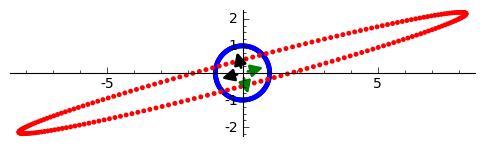

.. -*- coding: utf-8 -*-

.. code-block:: python

    sage: %hide 
    sage: %auto 
    sage: # jako funkcje
    sage: def show_2d_transf(A,typ='face'):
    ...       """
    ...       Wizualizacja przekształcenia liniowego w dwóch wymiarach.
    ...       """
    ...       if typ=='face':
    ...           punkty=[vector([cos(x),1+sin(x)]) for x in srange(0,2*pi,0.03)]
    ...           punkty+=[vector([0.3+.2*cos(x),1+0.2+.2*sin(x)]) for x in srange(0,2*pi,0.1)]
    ...           punkty+=[vector([-0.3+.1*cos(x),1+0.2+.1*sin(x)]) for x in srange(0,2*pi,0.1)]
    ...           punkty+=[vector([.5*cos(x),1+.5*sin(x)]) for x in srange(pi+.5,2*pi-.5,0.04)]
    ...           punktyA=map(lambda w:A*w,punkty)
    ...       if typ=='circle':
    ...           punkty=[vector([cos(x),sin(x)]) for x in srange(0,2*pi,0.03)]
    ...       punktyA=map(lambda w:A*w,punkty)
    ...       plt=points(punkty)+points(punktyA,color='red',aspect_ratio=1)
    ...       return (plt)
    sage: def show_2d_column_vectors(A):
    ...       """
    ...       Funkcja rysująca kolumny macierzy A (2x2) jako wektory 
    ...       """
    ...       p=[]
    ...       for a in A.columns():
    ...           p.append( arrow((0,0),a,color='red') )
    ...       sum(p).show(xmin=min(A.list()),xmax=max(A.list()),ymin=min(A.list()),ymax=max(A.list()),aspect_ratio=1)
    sage: print "Wcztane pomoce..."
    Wcztane pomoce...

.. end of output

Macierze
========

Indeksowanie elementów:

.. code-block:: python

    sage: #wymiar n
    sage: n=3
    sage: html.table([[1,2,3]] + [ ["$a_{%d %d}$" % (i,j) for j in range(1,n+1)] for i in range(1,n+1)])
    ...

.. end of output

.. code-block:: python

    sage: join([join(["A[%d,%d]" % (i,j) for j in range(n)],"&") for i in range(n)],"\\\\\n")
    ...

.. end of output

.. code-block:: python

    sage: A1 = matrix( [[var("a_%d%d" % (i,j)) for j in range(1,n+1)] for i in range(1,n+1)] ) 
    sage: show(A1)

.. MATH::

    \left(\begin{array}{rrr}
    a_{11} & a_{12} & a_{13} \\
    a_{21} & a_{22} & a_{23} \\
    a_{31} & a_{32} & a_{33}
    \end{array}\right)

.. end of output

Inny przykład generatora macierzy

.. code-block:: python

    sage: matrix( [ [ i+I*j for j in range(1,n+1)] for i in range(1,n+1)] )

.. end of output

Rożne konstuktory macierzy:
---------------------------

.. code-block:: python

    sage: random_matrix(QQ,3,3,algorithm='diagonalizable')
    ...

.. end of output

.. code-block:: python

    sage: A=random_matrix(QQ,3)

.. end of output

.. code-block:: python

    sage: identity_matrix(3)
    ...

.. end of output

.. code-block:: python

    sage: diagonal_matrix([1,2,3])
    ...

.. end of output

Uwaga 1: Aby wybrać z macierzy pierwszą kolumnę należy użyć A.column(1). Zastosowanie A[:,1] da w wyniku macierz [n,1] zamiast wektora.
~~~~~~~~~~~~~~~~~~~~~~~~~~~~~~~~~~~~~~~~~~~~~~~~~~~~~~~~~~~~~~~~~~~~~~~~~~~~~~~~~~~~~~~~~~~~~~~~~~~~~~~~~~~~~~~~~~~~~~~~~~~~~~~~~~~~~~~

.. code-block:: python

    sage: A=random_matrix(QQ,3)
    sage: show(A)
    sage: show(A.column(1))
    sage: show(A[:,1])
    sage: print type(A[:,1])
    sage: print type(A.column(1))
    sage: print A*A.column(1)
    sage: print A*A[:,1]
    
    
    (-4, 1, -4)
    [-4]
    [ 1]
    [-4]

.. MATH::

    \left(\begin{array}{rrr}
    -1 & 0 & -2 \\
    -\frac{1}{2} & 0 & \frac{1}{2} \\
    0 & 2 & -2
    \end{array}\right)

.. MATH::

    \left(0,\,0,\,2\right)

.. MATH::

    \left(\begin{array}{r}
    0 \\
    0 \\
    2
    \end{array}\right)

.. end of output

Uwaga 2: Aby wykonać obliczenia arytmetyczna na macierzy po postawienie parametru należy jawnie zmienić ciało (pierścień).
~~~~~~~~~~~~~~~~~~~~~~~~~~~~~~~~~~~~~~~~~~~~~~~~~~~~~~~~~~~~~~~~~~~~~~~~~~~~~~~~~~~~~~~~~~~~~~~~~~~~~~~~~~~~~~~~~~~~~~~~~~

.. code-block:: python

    sage: var('phi')
    sage: A=matrix([[cos(phi),-sin(phi)],[sin(phi),cos(phi)]])
    sage: show(A)
    sage: print "A jest określone nad pierścieniem:\n"
    sage: show(A.parent())
    A jest określone nad pierścieniem:
    

.. MATH::

    \left(\begin{array}{rr}
    \cos\left(\phi\right) & -\sin\left(\phi\right) \\
    \sin\left(\phi\right) & \cos\left(\phi\right)
    \end{array}\right)

.. MATH::

    \mathrm{Mat}_{2\times 2}(\text{SR})

.. end of output

.. code-block:: python

    sage: A2 = A.subs({phi:pi/4})
    sage: show(A2)
    sage: print "Pomino podstawienia liczbowego, A2 jest NADAL określone nad pierścieniem:\n"
    sage: show(A2.parent())
    Pomino podstawienia liczbowego, A2 jest NADAL określone nad pierścieniem:
    

.. MATH::

    \left(\begin{array}{rr}
    \frac{1}{2} \, \sqrt{2} & -\frac{1}{2} \, \sqrt{2} \\
    \frac{1}{2} \, \sqrt{2} & \frac{1}{2} \, \sqrt{2}
    \end{array}\right)

.. MATH::

    \mathrm{Mat}_{2\times 2}(\text{SR})

.. end of output

.. code-block:: python

    sage: A3 = A2.change_ring(RDF)
    sage: print "Po zmianie pierścienia mamy A3 określoną nad:\n"
    sage: show(A3.parent())
    sage: show(A2)
    Po zmianie pierścienia mamy A3 określoną nad:
    

.. MATH::

    \mathrm{Mat}_{2\times 2}(\Bold{R})

.. MATH::

    \left(\begin{array}{rr}
    \frac{1}{2} \, \sqrt{2} & -\frac{1}{2} \, \sqrt{2} \\
    \frac{1}{2} \, \sqrt{2} & \frac{1}{2} \, \sqrt{2}
    \end{array}\right)

.. end of output

.. code-block:: python

    sage: show( A2.parent() )

.. MATH::

    \mathrm{Mat}_{2\times 2}(\text{SR})

.. end of output

.. code-block:: python

    sage: A3 = A2.change_ring(RDF)

.. end of output

.. code-block:: python

    sage: show( A3.parent() ) 

.. MATH::

    \mathrm{Mat}_{2\times 2}(\Bold{R})

.. end of output

Eliminacja Gaussa (Jordana) \- krok po kroku:
---------------------------------------------

Cele:

 #. Wyrobienie intuicji w procedurze eliminacji Gaussa (Jordana) bez wykonywania mozolnej arytmetyki.

 #. Sage: operacje na rzędach macierzy:  ``swap_rows, swap_rows, rescale_row,add_multiple_of_row``  oraz metoda ``rref()``

.. code-block:: python

    sage: A=matrix([[   0,-2, 1],\
    ...             [-1/2, 0, 0],\
    ...             [-1  ,-1, 0] ])

.. end of output

.. code-block:: python

    sage: show(A)

.. MATH::

    \left(\begin{array}{rrr}
    0 & -2 & 1 \\
    -\frac{1}{2} & 0 & 0 \\
    -1 & -1 & 0
    \end{array}\right)

.. end of output

.. code-block:: python

    sage: b=matrix([[1],[2],[2]])
    sage: show(b)

.. MATH::

    \left(\begin{array}{r}
    1 \\
    2 \\
    2
    \end{array}\right)

.. end of output

.. code-block:: python

    sage: B=A.augment(b)
    sage: show(B )

.. MATH::

    \left(\begin{array}{rrrr}
    0 & -2 & 1 & 1 \\
    -\frac{1}{2} & 0 & 0 & 2 \\
    -1 & -1 & 0 & 2
    \end{array}\right)

.. end of output

Uprzedzając procedurę możemy  podejrzeć wynik:

.. code-block:: python

    sage: show(B.rref())

.. MATH::

    \left(\begin{array}{rrrr}
    1 & 0 & 0 & -4 \\
    0 & 1 & 0 & 2 \\
    0 & 0 & 1 & 5
    \end{array}\right)

.. end of output

.. code-block:: python

    sage: B.swap_rows(0,2)
    sage: B.rescale_row(0,-1)
    sage: B.add_multiple_of_row(1,0,1/2) # -> do drugiego dodaj pierwszy razy 1/2
    sage: B.add_multiple_of_row(2,1,4)
    sage: B.add_multiple_of_row(0,1,-2)
    sage: B.rescale_row(1,2)
    sage: show(B)

.. MATH::

    \left(\begin{array}{rrrr}
    1 & 0 & 0 & -4 \\
    0 & 1 & 0 & 2 \\
    0 & 0 & 1 & 5
    \end{array}\right)

.. end of output

.. code-block:: python

    sage: show(B.rref())

.. MATH::

    \left(\begin{array}{rrrr}
    1 & 0 & 0 & -4 \\
    0 & 1 & 0 & 2 \\
    0 & 0 & 1 & 5
    \end{array}\right)

.. end of output

Wyznaczanie macierzy odwrotnej, przez Eliminację Gaussa\-Jordana macierzy z dołączoną macierzą jednostkową:
-----------------------------------------------------------------------------------------------------------

Cele:

 #. Dysponując narzędziem "rref", budujemy intuicję w procedurze obliczania macierzy odwrotnej.

 #. Sage: uczymy się techniki "array slicing" :  ``A[:,3:]``

.. code-block:: python

    sage: A=matrix([[   0,-2, 1],\
    ...             [-1/2, 0, 0],\
    ...             [-1  ,-1, 0] ])
    sage: B=A.augment(identity_matrix(3))
    sage: # dla B z macierza I
    sage: show( B.rref() )
    sage: show(A*B.rref()[:,3:])

.. MATH::

    \left(\begin{array}{rrrrrr}
    1 & 0 & 0 & 0 & -2 & 0 \\
    0 & 1 & 0 & 0 & 2 & -1 \\
    0 & 0 & 1 & 1 & 4 & -2
    \end{array}\right)

.. MATH::

    \left(\begin{array}{rrr}
    1 & 0 & 0 \\
    0 & 1 & 0 \\
    0 & 0 & 1
    \end{array}\right)

.. end of output

Tak więc macierzą odwrotną jest

.. code-block:: python

    sage: Ainv=B.rref()[:,3:]
    sage: show( Ainv)

.. MATH::

    \left(\begin{array}{rrr}
    0 & -2 & 0 \\
    0 & 2 & -1 \\
    1 & 4 & -2
    \end{array}\right)

.. end of output

Sprawdźmy czy zachodzi:

.. MATH::

    A^{-1} A=I

  oraz  

.. MATH::

    A A^{-1}=I

.. code-block:: python

    sage: Ainv*A
    ...

.. end of output

.. code-block:: python

    sage: A*Ainv
    ...

.. end of output

Macierze elementarne, rozkład  
.. MATH::     A=LU
------------------------------------------------------

poprzez macierze elementarne:  
.. MATH::     E_3E_2E_1 A =U.
-----------------------------------------------------------------

Cele:

 #. Demonstracja algorytmu eliminacji Gaussa użwająć operacji na rzędach macierzy.

 #. Demonstracja działania macierzy elementarnych poprzez eksperyment.

 #. Eksperymentalnie sprawdzić (wyrobić intuicję) do :math:`A=LU`. 

.. code-block:: python

    sage: A=matrix(QQ,[[2,1,1],[4,-6,0],[-2,7,2]])

.. end of output

.. code-block:: python

    sage: E1=identity_matrix(3)
    sage: E1[1,0]=-2

.. end of output

.. code-block:: python

    sage: # Jak dzialają macierze elementarne E na dana macierz A ?
    sage: var('a')
    sage: E=identity_matrix(SR,3)
    sage: E[2,1]=a # eksperymetować!
    sage: html.table([[E,'x',A,'=',E*A]])
    ...

.. end of output

.. code-block:: python

    sage: html.table([[E1,'x',A,'=',E1*A]])
    ...

.. end of output

Jeszcze bardziej intuicyjnie:

.. code-block:: python

    sage: E=zero_matrix(SR,3)
    sage: E[2,1]=a # eksperymetować!
    sage: html.table([[E,'x',A,'=',E*A]])
    ...

.. end of output

.. code-block:: python

    sage: E2=identity_matrix(3)
    sage: E2[2,0]=1
    sage: E3=identity_matrix(3)
    sage: E3[2,1]=1

.. end of output

.. code-block:: python

    sage: E=identity_matrix(SR,3)
    sage: E[2,1]=a #
    sage: show(E.inverse())

.. MATH::

    \left(\begin{array}{rrr}
    1 & 0 & 0 \\
    0 & 1 & 0 \\
    0 & -a & 1
    \end{array}\right)

.. end of output

.. code-block:: python

    sage: U=E3*E2*E1*A
    sage: show(U)

.. MATH::

    \left(\begin{array}{rrr}
    2 & 1 & 1 \\
    0 & -8 & -2 \\
    0 & 0 & 1
    \end{array}\right)

.. end of output

.. code-block:: python

    sage: E1.inverse()*E1
    ...

.. end of output

.. code-block:: python

    sage: L=E1.inverse()*E2.inverse()*E3.inverse()

.. end of output

.. code-block:: python

    sage: show(L*U)

.. MATH::

    \left(\begin{array}{rrr}
    2 & 1 & 1 \\
    4 & -6 & 0 \\
    -2 & 7 & 2
    \end{array}\right)

.. end of output

.. code-block:: python

    sage: html.table([[L*U,'=',L,'x',U]])
    ...

.. end of output

**Uwaga** , wbudowane w Sage metody decompozycji działają na niektórych ciałach, np LU tylko na RDF.

.. code-block:: python

    sage: A=matrix(RDF,[[2,1,1],[4,-6,0],[-2,7,2]])

.. end of output

.. code-block:: python

    sage: show(A.LU())

.. MATH::

    \left(\left(\begin{array}{rrr}
    0.0 & 1.0 & 0.0 \\
    1.0 & 0.0 & 0.0 \\
    0.0 & 0.0 & 1.0
    \end{array}\right), \left(\begin{array}{rrr}
    1.0 & 0.0 & 0.0 \\
    0.5 & 1.0 & 0.0 \\
    -0.5 & 1.0 & 1.0
    \end{array}\right), \left(\begin{array}{rrr}
    4.0 & -6.0 & 0.0 \\
    0.0 & 4.0 & 1.0 \\
    0.0 & 0.0 & 1.0
    \end{array}\right)\right)

.. end of output

.. code-block:: python

    sage: P,L,U=A.LU()

.. end of output

Własności mnożenia Macierzy
---------------------------

Cele:

 #. Eksperymetalne badanie własności mnożenia macierzy

 #. Sage: Wykorzystanie konstruktorów macierzy nad różnymi ciałami.

.. code-block:: python

    sage: A=random_matrix(QQ,2)
    sage: B=random_matrix(QQ,2)
    sage: show(A)
    sage: show(B)
    sage: show(A*B-B*A)

.. MATH::

    \left(\begin{array}{rr}
    0 & 1 \\
    -1 & 1
    \end{array}\right)

.. MATH::

    \left(\begin{array}{rr}
    0 & -1 \\
    1 & \frac{1}{2}
    \end{array}\right)

.. MATH::

    \left(\begin{array}{rr}
    0 & \frac{3}{2} \\
    \frac{3}{2} & 0
    \end{array}\right)

.. end of output

.. code-block:: python

    sage: A=4*identity_matrix(QQ,2)
    sage: B=random_matrix(QQ,2)
    sage: show(A)
    sage: show(B)
    sage: show(A*B-B*A)

.. MATH::

    \left(\begin{array}{rr}
    4 & 0 \\
    0 & 4
    \end{array}\right)

.. MATH::

    \left(\begin{array}{rr}
    1 & 2 \\
    1 & 1
    \end{array}\right)

.. MATH::

    \left(\begin{array}{rr}
    0 & 0 \\
    0 & 0
    \end{array}\right)

.. end of output

.. code-block:: python

    sage: A=diagonal_matrix(random_vector(QQ,2))
    sage: B=random_matrix(QQ,2)
    sage: show(A)
    sage: show(B)
    sage: show(A*B-B*A)

.. MATH::

    \left(\begin{array}{rr}
    -1 & 0 \\
    0 & -1
    \end{array}\right)

.. MATH::

    \left(\begin{array}{rr}
    \frac{1}{2} & 1 \\
    1 & 2
    \end{array}\right)

.. MATH::

    \left(\begin{array}{rr}
    0 & 0 \\
    0 & 0
    \end{array}\right)

.. end of output

.. code-block:: python

    sage: A=diagonal_matrix(random_vector(QQ,2))
    sage: B=diagonal_matrix(random_vector(QQ,2))
    sage: show(A)
    sage: show(B)
    sage: show(A*B-B*A)

.. MATH::

    \left(\begin{array}{rr}
    4 & 0 \\
    0 & 0
    \end{array}\right)

.. MATH::

    \left(\begin{array}{rr}
    \frac{9}{4} & 0 \\
    0 & \frac{1}{12}
    \end{array}\right)

.. MATH::

    \left(\begin{array}{rr}
    0 & 0 \\
    0 & 0
    \end{array}\right)

.. end of output

Eliminacja Gaussa\-Jordana układu sprzecznego
---------------------------------------------

 #. Analiza specjalnych przypadków układów równań liniowych, wykorzystujemy albo ``rref()``  albo posługujemy się operacjami na rzędach macierzy.

 #. Przedstawienie rozwiązanie równania :math:`Ax=b` jako rozwiązanie szczegolne + kombinacja bazy jądra :math:`A`.

 #. Sage: ``right_kernel().basis(), right_kernel(), rank()`` , iteratory. 

.. code-block:: python

    sage: A=matrix(QQ,[[0,1,0],[0,1,0],[1,2,3]])
    sage: b= vector(QQ, [1, 0, 1])
    sage: html.table([['rank(A)=',rank(A)],['rank(A|b)=',rank(A.augment(b))]])
    sage: A=A.augment(b)
    sage: show(A)
    ...

.. MATH::

    \left(\begin{array}{rrrr}
    0 & 1 & 0 & 1 \\
    0 & 1 & 0 & 0 \\
    1 & 2 & 3 & 1
    \end{array}\right)

.. end of output

.. code-block:: python

    sage: A.swap_rows(0,2)
    sage: show(A)

.. end of output

.. code-block:: python

    sage: A.add_multiple_of_row(0,1,-2)
    sage: show(A)

.. MATH::

    \left(\begin{array}{rrrr}
    0 & -1 & 0 & 1 \\
    0 & 1 & 0 & 0 \\
    1 & 2 & 3 & 1
    \end{array}\right)

.. end of output

.. code-block:: python

    sage: A.add_multiple_of_row(2,1,-1)
    sage: show(A)

.. MATH::

    \left(\begin{array}{rrrr}
    0 & -1 & 0 & 1 \\
    0 & 1 & 0 & 0 \\
    1 & 1 & 3 & 1
    \end{array}\right)

.. end of output

.. code-block:: python

    sage: A.add_multiple_of_row(0,2,-1)
    sage: show(A)

.. MATH::

    \left(\begin{array}{rrrr}
    -1 & -2 & -3 & 0 \\
    0 & 1 & 0 & 0 \\
    1 & 1 & 3 & 1
    \end{array}\right)

.. end of output

Wykorzystując gotową procedurę:

.. code-block:: python

    sage: show(A.rref())

.. MATH::

    \left(\begin{array}{rrrr}
    1 & 0 & 3 & 0 \\
    0 & 1 & 0 & 0 \\
    0 & 0 & 0 & 1
    \end{array}\right)

.. end of output

Zmieńmy tak wektor :math:`b` by układ miał rozwiązania:

.. code-block:: python

    sage: A=matrix(QQ,[[0,1,0],[0,1,0],[1,2,3]])
    sage: b= vector(QQ, [1, 1,1])
    sage: A\b
    ...

.. end of output

.. code-block:: python

    sage: show(A)

.. MATH::

    \left(\begin{array}{rrr}
    0 & 1 & 0 \\
    0 & 1 & 0 \\
    1 & 2 & 3
    \end{array}\right)

.. end of output

.. code-block:: python

    sage: show( (A.augment(b)).rref() )

.. MATH::

    \left(\begin{array}{rrrr}
    1 & 0 & 3 & -1 \\
    0 & 1 & 0 & 1 \\
    0 & 0 & 0 & 0
    \end{array}\right)

.. end of output

.. code-block:: python

    sage: html.table([['rank(A)=',rank(A)],['rank(A|b)=',rank(A.augment(b))]])
    ...

.. end of output

.. code-block:: python

    sage: for v in A.right_kernel().basis():
    ...       show(v)
    ...       html.table([['$Av=$',A,"x",v.column(),"=", (A*v).column()]] )

.. end of output

.. code-block:: python

    sage: A=matrix(QQ,[[1,0,0],[2,1,0],[-1,-1,1]])
    sage: show(A)
    sage: B=matrix(QQ,[[1,0,0],[-2,1,0],[-1,1,1]])
    sage: show(B)

.. end of output

.. code-block:: python

    sage: A*B

.. end of output

.. code-block:: python

    sage: A=matrix(QQ,[[1,0],[6,1]])
    sage: A.inverse()

.. end of output

Macierz :math:`n\neq m`
-----------------------

 

.. code-block:: python

    sage: #Jeszcze jeden przykład
    sage: A=matrix(QQ,[[0,1,0,1],[0,1,1,0]])
    sage: b= vector(QQ, [1, 1])
    sage: A\b
    ...

.. end of output

.. code-block:: python

    sage: show(A)

.. MATH::

    \left(\begin{array}{rrrr}
    0 & 1 & 0 & 1 \\
    0 & 1 & 1 & 0
    \end{array}\right)

.. end of output

.. code-block:: python

    sage: A.right_kernel().basis()

.. end of output

.. code-block:: python

    sage: rank(A)

.. end of output

.. code-block:: python

    sage: show( (A.augment(b)).rref() )

.. end of output

.. code-block:: python

    sage: for v in A.right_kernel().basis():
    ...       show(v.column())
    ...       html.table([['$Av=$',A,"x",v.column(),"=", (A*v).column()]] )

.. end of output

Zmiana bazy: transformacja wektorów oraz operatorów liniowych.
--------------------------------------------------------------

Rozwiązanie układu :math:`Ax=b` jako rozkład wektora :math:`b` w bazie kolumn macierzy :math:`A`.

Jeżeli mamy operator :math:`C`, oraz wektor :math:`b` a macierz :math:`A`, jest macierzą której kolumny są wektorami innej bazy to mamy:

 - :math:`C'=A^{-1}CA`

 - :math:`b'=A^{-1}b`

 - W pierwszej bazie :math:`d=Cb` w drugiej :math:`d'=C'b'` bo :math:`A^{-1}d=A^{-1}CAA^{-1}b` 

Cele:

 #. Budowanie intuicji w zakresie bazy i reprezentacji operatorów oraz wektorów.

 #. Sage: wykorzystanie narzędzi graficznych.

.. code-block:: python

    sage: A=random_matrix(QQ,2)
    sage: show(A)
    sage: rank(A)
    ...

.. MATH::

    \left(\begin{array}{rr}
    0 & -1 \\
    -2 & -1
    \end{array}\right)

.. end of output

.. code-block:: python

    sage: b=vector(QQ,[1,2])
    sage: c=A\b
    sage: show(c)

.. MATH::

    \left(-\frac{1}{2},\,-1\right)

.. end of output

.. code-block:: python

    sage: A.columns()[0]
    ...

.. end of output

.. code-block:: python

    sage: A.columns()[0]*c[0]+A.columns()[1]*c[1]
    ...

.. end of output

.. code-block:: python

    sage: p=[]
    sage: p.append( arrow((0,0),b) )
    sage: #p.append( arrow((0,0),c[0]*A.columns()[0],color='red') )
    sage: #p.append( arrow((0,0),c[1]*A.columns()[1],color='red') )
    sage: p.append( arrow((0,0),A.columns()[0],color='gray') )
    sage: p.append( arrow((0,0),A.columns()[1],color='gray') )

.. end of output

.. code-block:: python

    sage: sum(p).show(aspect_ratio=1)

.. end of output

.. code-block:: python

    sage: A=random_matrix(QQ,2)
    sage: show_2d_column_vectors(A)
    sage: show(A)
    sage: rank(A)

.. end of output

.. code-block:: python

    sage: var('phi')
    sage: A=matrix([[cos(phi),-sin(phi)],[sin(phi),cos(phi)]])
    sage: show(A)
    sage: A=matrix(RR, A.subs({phi:pi/4})) 
    sage: show_2d_column_vectors(A)
    sage: show(A)

.. MATH::

    \left(\begin{array}{rr}
    \cos\left(\phi\right) & -\sin\left(\phi\right) \\
    \sin\left(\phi\right) & \cos\left(\phi\right)
    \end{array}\right)

.. MATH::

    \left(\begin{array}{rr}
    0.707106781186548 & -0.707106781186548 \\
    0.707106781186548 & 0.707106781186548
    \end{array}\right)

.. end of output

.. code-block:: python

    sage: b=vector(QQ,[0,1])
    sage: C=random_matrix(QQ,2)
    sage: show(C)
    sage: print rank(C)
    sage: d=C*b
    sage: C_prime=A.inverse()*C*A
    sage: b_prime=A.inverse()*b
    sage: d_prime=C_prime*b_prime
    sage: show( d_prime )
    sage: show( A*d_prime)
    2

.. MATH::

    \left(\begin{array}{rr}
    2 & 2 \\
    0 & -1
    \end{array}\right)

.. MATH::

    \left(0.707106781186547,\,-2.12132034355964\right)

.. MATH::

    \left(2.00000000000000,\,-1.00000000000000\right)

.. end of output

.. code-block:: python

    sage: html.table([["$C=$",C,"|-->","$C'=A^{-1}CA$",C_prime]])
    sage: html.table([["$b=$",b.column(),"|-->","$b'=A^{-1}b$",b_prime.column()]])
    sage: html.table([["$d=Cb$",d.column(),"|","$d'=C'b'$",(C_prime*b_prime).column()]])
    sage: html.table([["          ","$d=A d'$",(A*d_prime).column(),""]])
    ...

    ...

    ...

    ...

.. end of output

Wyznacznik, definicja bezpośrednia
----------------------------------

Cele:

 #. Implementacja algorytmiczna wzoru na wyznacznik

 #. Obliczenie złożoności niezbędnej do wykonania takiego algorytmu.

 #. Sage:wykorzystanie objektu  ``Permutations`` , i metody  ``Permutations.signature``

.. code-block:: python

    sage: A=random_matrix(QQ,3)
    sage: show(A)
    sage: print rank(A),det(A)
    3 7

.. MATH::

    \left(\begin{array}{rrr}
    1 & \frac{1}{2} & 2 \\
    -2 & 1 & -2 \\
    -1 & -2 & 0
    \end{array}\right)

.. end of output

.. code-block:: python

    sage: ## cos takiego .... matrix(3,3,A.minors(2)).transpose()/det(A)

.. end of output

.. code-block:: python

    sage: A.inverse()

.. end of output

.. code-block:: python

    sage: detA= sum ( [ p.signature()*prod( [A[i,p[i]-1] for i in [0,1,2]] ) for p in Permutations(3) ] )

.. end of output

.. code-block:: python

    sage: print detA,A.det()
    7 7

.. end of output

.. code-block:: python

    sage: Permutations(13).cardinality()
    ...

.. end of output

.. code-block:: python

    sage: # Ile lat trwało by obliczenie wyznacznika z definicji dla macierzy 21x21?
    sage: factorial(21)/(1e9)/3600/24/365

.. end of output

Elementy składowe powyższej procedury:

 - zastosowano "list comprehensions" oraz operacje  ``prod``  i  ``sum``

.. code-block:: python

    sage: [ p.signature()*prod( [A[i,p[i]-1] for i in [0,1,2]] ) for p in Permutations(3) ]
    ...

.. end of output

.. code-block:: python

    sage: for p in Permutations(3):
    ...       print [A[i,p[i]-1] for i in [0,1,2]] ,p.signature()
    [2.0, -6.0, 2.0] 1
    [2.0, 0.0, 7.0] -1
    [1.0, 4.0, 2.0] -1
    [1.0, 0.0, -2.0] 1
    [1.0, 4.0, 7.0] 1
    [1.0, -6.0, -2.0] -1

.. end of output

.. code-block:: python

    sage: for p in Permutations(3):
    ...       print prod( [A[i,p[i]-1] for i in [0,1,2]] ),p.signature()
    -24.0 1
    0.0 -1
    8.0 -1
    -0.0 1
    28.0 1
    12.0 -1

.. end of output

**Obliczanie wyznacznika przez rozwinięcie względem kolumny.**
--------------------------------------------------------------

Cel:

 #. Zrozumienie procedury poprzez analizę, lub samodzielne stworzenie algorytmu.

 #. Sage: Zastosowanie rekurencji.

.. code-block:: python

    sage: A=random_matrix(QQ,4)
    sage: show(A)
    sage: A.det()
    ...

.. MATH::

    \left(\begin{array}{rrrr}
    0 & 1 & -1 & -1 \\
    1 & 0 & 0 & -1 \\
    1 & -\frac{1}{2} & 0 & 1 \\
    0 & 1 & -1 & 1
    \end{array}\right)

.. end of output

.. code-block:: python

    sage: def sub_mat(A,i,j):
    ...       
    ...       return block_matrix( 2,2,[A.submatrix(0,0,i,j),A.submatrix(0,j+1,i,A.ncols()-j-1),A.submatrix(i+1,0,A.nrows()-i-1,j),A.submatrix(i+1,j+1,A.nrows()-i-1,A.ncols()-j-1)],subdivide=False)

.. end of output

.. code-block:: python

    sage: a=A.column(2)
    sage: detA=0
    sage: for i,el in enumerate(a):
    ...       print el
    ...       show(sub_mat(A,i,1))
    ...       detA+=(-1)^i*el*det(sub_mat(A,i,1))
    sage: print detA
    sage: print det(A)
    -1
    0
    0
    -1
    0
    1

.. MATH::

    \left(\begin{array}{rrr}
    1 & 0 & -1 \\
    1 & 0 & 1 \\
    0 & -1 & 1
    \end{array}\right)

.. MATH::

    \left(\begin{array}{rrr}
    0 & -1 & -1 \\
    1 & 0 & 1 \\
    0 & -1 & 1
    \end{array}\right)

.. MATH::

    \left(\begin{array}{rrr}
    0 & -1 & -1 \\
    1 & 0 & -1 \\
    0 & -1 & 1
    \end{array}\right)

.. MATH::

    \left(\begin{array}{rrr}
    0 & -1 & -1 \\
    1 & 0 & -1 \\
    1 & 0 & 1
    \end{array}\right)

.. end of output

.. code-block:: python

    sage: A=random_matrix(QQ,4)
    sage: show(A)

.. MATH::

    \left(\begin{array}{rrrr}
    1 & 1 & 1 & -1 \\
    0 & -2 & 0 & -\frac{1}{2} \\
    0 & 2 & -1 & 0 \\
    0 & 0 & 1 & 2
    \end{array}\right)

.. end of output

.. code-block:: python

    sage: def det1(A,verbose=False):
    ...       """
    ...       Rekurencyjna definicja wyznacznika, 
    ...       """
    ...       if A.ncols()==1:
    ...           return(A[0,0])
    ...       a=A.column(0)
    ...       detA=0
    ...       for i,el in enumerate(a):
    ...           
    ...           if verbose:
    ...               s="\quad"*(3*(4-A.ncols()))# trik wcinajacy
    ...               html.table([["$%s$" % s,el," x ",sub_mat(A,i,0)]])
    ...           detA+=(-1)^i*el*det1(sub_mat(A,i,0))
    ...       return detA
    ...       
    sage: print det1(A)
    sage: print det(A)
    3
    3

.. end of output

.. code-block:: python

    sage: def det1(A,verbose=False):
    ...       if A.ncols()==1:
    ...           return(A[0,0])
    ...       detA=0
    ...       for i,el in enumerate(A.column(0)):
    ...         detA+=(-1)^i*el*det1(sub_mat(A,i,0))
    ...       return detA

.. end of output

.. code-block:: python

    sage: show(A)
    sage: sub_mat(A,3,3)

.. end of output

Obliczanie wyznacznika korzystając w rozkładu :math:`LU`, jako iloczyn elementów diagonalnych macierzy :math:`U`
----------------------------------------------------------------------------------------------------------------

Cel:

 #. Prezentacja efektywnej procedury obliczania wyznacznika.

 #. Zastosowanie własności wyznacznika.

 #. Sage: Użycie metody LU i świadomy wybór ciała nad którymi jest zdefiniowana macierz.

.. code-block:: python

    sage: A=random_matrix(RDF,3)

.. end of output

.. code-block:: python

    sage: A.det()
    ...

.. end of output

.. code-block:: python

    sage: P,L,U=A.LU()

.. end of output

.. code-block:: python

    sage: U
    ...

.. end of output

.. code-block:: python

    sage: show(U)
    sage: show(L)
    sage: show(P)

.. MATH::

    \left(\begin{array}{rrr}
    -0.537075280063 & -0.332383246513 & 0.28830959793 \\
    0.0 & -0.95463469103 & -0.533782273486 \\
    0.0 & 0.0 & 0.752847982382
    \end{array}\right)

.. MATH::

    \left(\begin{array}{rrr}
    1.0 & 0.0 & 0.0 \\
    0.0708044853167 & 1.0 & 0.0 \\
    -0.397358955098 & 0.583691091967 & 1.0
    \end{array}\right)

.. MATH::

    \left(\begin{array}{rrr}
    0.0 & 0.0 & 1.0 \\
    0.0 & 1.0 & 0.0 \\
    1.0 & 0.0 & 0.0
    \end{array}\right)

.. end of output

.. code-block:: python

    sage: det(P)
    ...

.. end of output

.. code-block:: python

    sage: prod( [ U[i,i] for i in range(U.ncols())])
    ...

.. end of output

.. code-block:: python

    sage: A=random_matrix(RDF,3)
    sage: B=random_matrix(RDF,3)

.. end of output

.. code-block:: python

    sage: html.table([[det(A)*det(B),det(A*B)]])

.. end of output

Zagadnienie własne
------------------

.. code-block:: python

    sage: A=random_matrix (QQ,2,algorithm='diagonalizable')

.. end of output

.. code-block:: python

    sage: A
    ...

.. end of output

.. code-block:: python

    sage: pp=A.charpoly('x')
    sage: pp
    ...

.. end of output

.. code-block:: python

    sage: pp.roots(multiplicities=False)
    ...

.. end of output

.. code-block:: python

    sage: lambda1=pp.roots()[0][0]
    sage: B=A-lambda1*identity_matrix(2)
    sage: show(B)
    sage: print B.rank()
    sage: B.right_kernel().basis()
    1
    ...

.. MATH::

    \left(\begin{array}{rr}
    -25 & 100 \\
    -5 & 20
    \end{array}\right)

.. end of output

.. code-block:: python

    sage: for l in pp.roots(multiplicities=False):
    ...       B=A-l*identity_matrix(2)
    ...       show(B)    
    ...       print B.rank()
    ...       B.right_kernel().basis()
    1
    ...
    1
    ...

.. MATH::

    \left(\begin{array}{rr}
    -25 & 100 \\
    -5 & 20
    \end{array}\right)

.. MATH::

    \left(\begin{array}{rr}
    -20 & 100 \\
    -5 & 25
    \end{array}\right)

.. end of output

.. code-block:: python

    sage: A.eigenvalues()
    ...

.. end of output

.. code-block:: python

    sage: A.right_eigenvectors()
    ...

.. end of output

Weźmy macierz symetryczną:

.. code-block:: python

    sage: A=random_matrix (QQ,2)
    sage: A=A*A.transpose()
    sage: show(A)

.. MATH::

    \left(\begin{array}{rr}
    \frac{5}{4} & 2 \\
    2 & 5
    \end{array}\right)

.. end of output

.. code-block:: python

    sage: pp=A.charpoly('x')
    sage: pp
    ...

.. end of output

.. code-block:: python

    sage: pp.roots(ring=RR)
    ...

.. end of output

.. code-block:: python

    sage: A.eigenvalues()
    ...

.. end of output

.. code-block:: python

    sage: for (v,vec,n) in A.eigenvectors_right():
    ...       print v,vec[0],n
    0.3835359750673364? (1, -0.4332320124663318?) 1
    5.866464024932663? (1, 2.308232012466332?) 1

.. end of output

.. code-block:: python

    sage: p=[]
    sage: for (v,vec,n) in A.eigenvectors_right():
    ...       p.append( arrow([0,0],vec[0]/vec[0].norm(),color='green') )
    sage: sum(p).show(aspect_ratio=1)

.. end of output

.. code-block:: python

    sage: eigplot=show_2d_transf(A,typ='circle')+sum(p)

.. end of output

SVD oraz wartości własne... TODO

.. code-block:: python

    sage: U, S, V = matrix(RDF,A).SVD()

.. end of output

.. code-block:: python

    sage: U, S, V
    ...

.. end of output

.. code-block:: python

    sage: eigplot+sum([arrow([0,0],V.row(i),color='black') for i in range(2)])

.. end of output

.. code-block:: python

    sage: A=random_matrix (RDF,2,algorithm='diagonalizable')

.. end of output

.. code-block:: python

    sage: Ar=matrix (RDF,A)
    sage: Ar.SVD()
    ...

.. end of output

SVD dla macierzy obrotu

.. code-block:: python

    sage: var('phi')
    sage: A=matrix([[cos(phi),-sin(phi)],[sin(phi),cos(phi)]])
    sage: A=matrix(RDF,A.subs({phi:pi/6}))
    sage: A.SVD()
    ...

.. end of output

SVD
---

.. code-block:: python

    sage: import scipy.linalg as lin
    sage: var('t')
    sage: def rotell(sig,umat,t,offset=0):
    ...       temp = matrix(umat)*matrix(2,1,[sig[0]*cos(t),sig[1]*sin(t)])
    ...       return [offset+temp[0][0],temp[1][0]]
    sage: @interact
    sage: def svd_vis(a11=slider(-1,1,.05,1),a12=slider(-1,1,.05,1),a21=slider(-1,1,.05,0),a22=slider(-1,1,.05,1),ofs= selector(['Off','On'],label='offset image from domain')):
    ...       rf_low = RealField(12)
    ...       my_mat = matrix(rf_low,2,2,[a11,a12,a21,a22])
    ...       u,s,vh = lin.svd(my_mat.numpy())
    ...       if ofs == 'On': 
    ...           offset = 3
    ...           fsize = 6
    ...           colors = [(1,0,0),(0,0,1),(1,0,0),(0,0,1)]
    ...       else: 
    ...           offset = 0
    ...           fsize = 5
    ...           colors = [(1,0,0),(0,0,1),(.7,.2,0),(0,.3,.7)]
    ...       vvects = sum([arrow([0,0],matrix(vh).row(i),rgbcolor = colors[i]) for i in (0,1)])    
    ...       uvects = Graphics()
    ...       for i in (0,1):
    ...           if s[i] != 0: uvects += arrow([offset,0],vector([offset,0])+matrix(s*u).column(i),rgbcolor = colors[i+2])
    ...       html('Singular value decomposition: image of the unit circle and the singular vectors')
    ...       print jsmath("$A = %s  = %s %s %s$"%(latex(my_mat), latex(matrix(rf_low,u.tolist())), latex(matrix(rf_low,2,2,[s[0],0,0,s[1]])), latex(matrix(rf_low,vh.tolist())))) 
    ...       image_ell = parametric_plot(rotell(s,u,t, offset),0,2*pi)
    ...       graph_stuff=circle((0,0),1)+image_ell+vvects+uvects
    ...       graph_stuff.set_aspect_ratio(1)
    ...       show(graph_stuff,frame = False,axes=False,figsize=[fsize,fsize])

.. end of output

.. code-block:: python

    sage: ### resztki...
    sage: A = matrix(QQ,  [[2,-3, 1,-6],\
    ...                    [4, 1, 2, 9],\
    ...                    [3, 1, 1, 8],\
    ...                    [0, 0, 0, 0]])
    sage: b = vector(QQ,[-7,-7,-8,0])    
    sage: show(A.augment(b).rref())
    sage: A.solve_right(b)
    sage: A.right_kernel().basis()
    sage: A = matrix(QQ,  [[2,-3, 1,-6],\
    ...                    [3, 1, 1, 8]\
    ...                   ])
    sage: b = vector(QQ,[-7,-7])    
    sage: show(A.augment(b).rref())
    sage: A.solve_right(b)
    sage: A=random_matrix(QQ,3)
    sage: show(A)
    sage: show(A.rref())
    sage: A.pivots()

.. end of output

Wizualizacja działania przekształceń liniowych 2d
-------------------------------------------------

.. code-block:: python

    sage: punkty=[vector([cos(x),sin(x)]) for x in srange(0,2*pi,0.03)]
    sage: punkty+=[vector([0.3+.2*cos(x),0.2+.2*sin(x)]) for x in srange(0,2*pi,0.1)]
    sage: punkty+=[vector([-0.3+.2*cos(x),0.2+.2*sin(x)]) for x in srange(0,2*pi,0.1)]
    sage: punkty+=[vector([.5*cos(x),.5*sin(x)]) for x in srange(pi+.5,2*pi-.5,0.04)]

.. end of output

.. code-block:: python

    sage: punkty=[vector([cos(x),1+sin(x)]) for x in srange(0,2*pi,0.03)]
    sage: punkty+=[vector([0.3+.2*cos(x),1+0.2+.2*sin(x)]) for x in srange(0,2*pi,0.1)]
    sage: punkty+=[vector([-0.3+.1*cos(x),1+0.2+.1*sin(x)]) for x in srange(0,2*pi,0.1)]
    sage: punkty+=[vector([.5*cos(x),1+.5*sin(x)]) for x in srange(pi+.5,2*pi-.5,0.04)]

.. end of output

.. code-block:: python

    sage: # jako funkcje
    sage: def show_2d_transf(A,typ='face'):
    ...       if typ=='face':
    ...           punkty=[vector([cos(x),1+sin(x)]) for x in srange(0,2*pi,0.03)]
    ...           punkty+=[vector([0.3+.2*cos(x),1+0.2+.2*sin(x)]) for x in srange(0,2*pi,0.1)]
    ...           punkty+=[vector([-0.3+.1*cos(x),1+0.2+.1*sin(x)]) for x in srange(0,2*pi,0.1)]
    ...           punkty+=[vector([.5*cos(x),1+.5*sin(x)]) for x in srange(pi+.5,2*pi-.5,0.04)]
    ...           punktyA=map(lambda w:A*w,punkty)
    ...       if typ=='circle':
    ...           punkty=[vector([cos(x),sin(x)]) for x in srange(0,2*pi,0.03)]
    ...       punktyA=map(lambda w:A*w,punkty)
    ...       plt=points(punkty)+points(punktyA,color='red',aspect_ratio=1)
    ...       plt.show()
    sage: def show_2d_column_vectors(A):
    ...       p=[]
    ...       
    ...       for a in A.columns():
    ...           p.append( arrow((0,0),a,color='red') )
    ...       sum(p).show(xmin=min(A.list()),xmax=max(A.list()),ymin=min(A.list()),ymax=max(A.list()),aspect_ratio=1)

.. end of output

.. code-block:: python

    sage: points(punkty).show(aspect_ratio=1)

.. end of output

Różne macierze: odbicia, obrotu, skalująca, projektcja na wektor itp.

.. code-block:: python

    sage: A=random_matrix(QQ,2)
    sage: rank(A)
    ...

.. end of output

.. code-block:: python

    sage: A=matrix([[0,-1],[1,0]])
    sage: A

.. end of output

.. code-block:: python

    sage: A=matrix([[0,1],[1,0]])
    sage: A

.. end of output

.. code-block:: python

    sage: A=matrix([[1/2,0],[0,2]])
    sage: A

.. end of output

.. code-block:: python

    sage: A=matrix([[1/2,1/2],[1/2,1/2]])
    sage: A

.. end of output

.. code-block:: python

    sage: var('phi')
    sage: v=vector([cos(phi),sin(phi)])
    sage: A=v.outer_product(v)
    sage: show(A)
    sage: A=A.subs({phi:.6})

.. end of output

.. code-block:: python

    sage: var('phi')
    sage: A=matrix([[cos(phi),-sin(phi)],[sin(phi),cos(phi)]])

.. end of output

.. code-block:: python

    sage: show(A)

.. end of output

.. code-block:: python

    sage: show(A.subs({phi:1})*A.subs({phi:-1}))

.. end of output

.. code-block:: python

    sage: A.subs({phi:2)})

.. end of output

.. code-block:: python

    sage: A=matrix([[cos(phi),-sin(phi)],[sin(phi),cos(phi)]])
    sage: A=A.subs({phi:-pi/6})
    sage: punktyA=map(lambda w:A*w,punkty)
    sage: points(punkty)+points(punktyA,color='red',aspect_ratio=1)
    Traceback (most recent call last):
    ...
    NameError: name 'punkty' is not defined

.. end of output

.. code-block:: python

    sage: lstp=[]
    sage: for i in range(10):
    ...       A=random_matrix(QQ,2)
    ...       rank(A)
    ...       punktyA=map(lambda w:A*w,punkty)
    ...       lstp.append(points(punkty)+points(punktyA,color='red',aspect_ratio=1,legend_label="rank A=%d" % A.rank() ) )
    sage: anim=animate(lstp,ymin=-2,ymax=2,xmin=-2,xmax=2)

.. end of output

.. code-block:: python

    sage: anim.show(delay=250)

.. end of output

.. code-block:: python

    sage: A=random_matrix(QQ,2)
    sage: punkty=[vector([cos(x),1+sin(x)]) for x in srange(0,2*pi,0.03)]
    sage: punktyA=map(lambda w:A*w,punkty)

.. end of output

.. code-block:: python

    sage: punktyA
    ...

.. end of output

