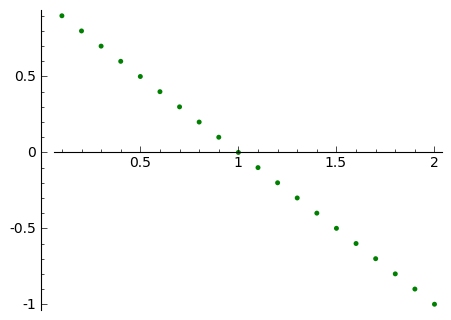

.. -*- coding: utf-8 -*-

Metoda Eliminacji Gaussa dla układów równań
-------------------------------------------

Rozważmy układ trzech równań. Za pomocą operacji dodawania do siebie wielokrotności równań, oraz ich przestawiania doprowadzamy układ do postaci schodkowej.

.. code-block:: python

    sage: var('x1 x2 x3')
    sage: eq1=x1+2*x2+2*x3==4
    sage: eq2=x1+3*x2+3*x3==5
    sage: eq3=2*x1+6*x2+5*x3==6
    sage: #html.table([eq1,eq2,eq3])
    sage: show(vector([eq1,eq2,eq3]).column())

.. MATH::

    \left(\begin{array}{r}
    x_{1} + 2 \, x_{2} + 2 \, x_{3} = 4 \\
    x_{1} + 3 \, x_{2} + 3 \, x_{3} = 5 \\
    2 \, x_{1} + 6 \, x_{2} + 5 \, x_{3} = 6
    \end{array}\right)

.. end of output

.. code-block:: python

    sage: eq2=eq2-eq1
    sage: #html.table([eq1,eq2,eq3])
    sage: show(vector([eq1,eq2,eq3]).column())

.. MATH::

    \left(\begin{array}{r}
    x_{1} + 2 \, x_{2} + 2 \, x_{3} = 4 \\
    x_{2} + x_{3} = 1 \\
    2 \, x_{1} + 6 \, x_{2} + 5 \, x_{3} = 6
    \end{array}\right)

.. end of output

.. code-block:: python

    sage: eq3=eq3-2*eq1
    sage: #html.table([eq1,eq2,eq3])
    sage: show(vector([eq1,eq2,eq3]).column())

.. MATH::

    \left(\begin{array}{r}
    x_{1} + 2 \, x_{2} + 2 \, x_{3} = 4 \\
    x_{2} + x_{3} = 1 \\
    2 \, x_{2} + x_{3} = \left(-2\right)
    \end{array}\right)

.. end of output

.. code-block:: python

    sage: eq3=eq3-2*eq2
    sage: #html.table([eq1,eq2,eq3])
    sage: show(vector([eq1,eq2,eq3]).column())

.. MATH::

    \left(\begin{array}{r}
    x_{1} + 2 \, x_{2} + 2 \, x_{3} = 4 \\
    x_{2} + x_{3} = 1 \\
    -x_{3} = \left(-4\right)
    \end{array}\right)

.. end of output

Mnożąc ostatnie równanie przez :math:`-1` dostajemy układ równań w postaci schodkowej:

.. code-block:: python

    sage: eq3=-eq3
    sage: #html.table([eq1,eq2,eq3])
    sage: show(vector([eq1,eq2,eq3]).column())

.. MATH::

    \left(\begin{array}{r}
    x_{1} + 2 \, x_{2} + 2 \, x_{3} = 4 \\
    x_{2} + x_{3} = 1 \\
    x_{3} = 4
    \end{array}\right)

.. end of output

Wykonując odpowiednie podstawienia wstecz otrzymujemy:

.. code-block:: python

    sage: html.table( [eq1.subs(eq2.subs(eq3)-4).subs(eq3)-2,eq2.subs(eq3)-4,eq3] )
    ...

.. end of output

Sprawdźmy czy odpowiedź jest zgodna z wbudowaną procedurą  ``solve()`` :

.. code-block:: python

    sage: solve([eq1,eq2,eq3],[x1,x2,x3])
    [[x1 == 2, x2 == -3, x3 == 4]]

.. end of output

Dodatek:
~~~~~~~~

Procedura solve dla układów równań nieoznaczonych (nie tylko liniowych).

.. code-block:: python

    sage: var('x1 x2')
    sage: s=solve([x1+x2==1,x1+x2==1],[x1,x2])
    sage: print s[0]
    sage: # little hack - wyłuskanie wszytkich parametrów od których zalezy rozwiązanie
    sage: lvar=uniq(flatten(map(lambda w: w.variables(), s[0])))
    sage: for x in [x1,x2]:
    ...       lvar.remove(x)
    sage: for rvar in lvar:
    ...       var(rvar)
    sage: print lvar
    sage: ss=[ map(lambda w: w.rhs().subs({rvar:x}), s[0]) for x in srange(-1,1,0.1) ]
    sage: point(ss,color='green',figsize=5)
    [x1 == -r1 + 1, x2 == r1]
    [r1]

.. end of output

