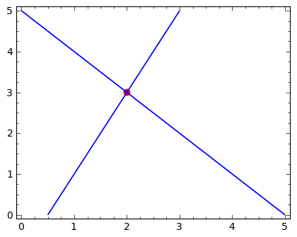
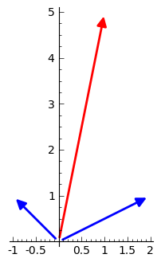

.. -*- coding: utf-8 -*-

Geometria układu równań liniowych
---------------------------------

Interpretacja "wierszowa"
~~~~~~~~~~~~~~~~~~~~~~~~~

Rozważmy dwa równania liniowe:

.. code-block:: python

    sage: var('x1 x2')
    sage: eq1 = 2*x1-x2==1
    sage: eq2 = x1+x2==5
    sage: show(eq1)
    sage: show(eq2)

.. MATH::

    2 \, x_{1} - x_{2} = 1

.. MATH::

    x_{1} + x_{2} = 5

.. end of output

Ich rozwiązaniem są liczby :math:`x_1=2` i :math:`x_1=3`, co łatwo sprawdzić:

.. code-block:: python

    sage: solve([eq1,eq2],[x1,x2])
    [[x1 == 2, x2 == 3]]

.. end of output

Każde z równań jest prostą na płaszczyźnie :math:`(x_1,x_2).` Rozwiązanie układu równań leży na obydwu prostych jednocześnie. Wynika z tego interpretacja graficzna układu dwóch równań liniowych jako punktu przecięcia się dwóch prostych:

.. code-block:: python

    sage: implicit_plot(eq1,(x1,0,5),(x2,0,5))+\
    ...    implicit_plot(eq2,(x1,0,5),(x2,0,5))+\
    ...    point((2,3),color='red',size=40,figsize=5)

.. end of output

Możemy korzystając z intuicji od razu przypuszczać, że oprócz punktu, przecięciem się dwóch prostych na płaszczyźnie może być też prosta lub zbiór pusty. Tak więc mamy więciej możliwości!

.. code-block:: python

    sage: latex([eq1,eq2])
    \left[2 \, x_{1} - x_{2} = 1, x_{1} + x_{2} = 5\right]

.. end of output

Interpretacja kolumnowa
~~~~~~~~~~~~~~~~~~~~~~~

Rozważany układ równań

.. MATH::

    \begin{cases}
    2 \, x_{1} - x_{2} &=& 1\\  x_{1} + x_{2} &=& 5 
    \end{cases}

można zapisać jako działania na wektorach kolumnowych:

.. MATH::

      \left [\array{2 x_1\\x_1}\right ] +  \left [\array{-x_2 \\x_2}\right ] = \left [\array{1 \\5}\right ],

czyli:

.. MATH::

     x_1 \left [\array{2 \\1}\right ] + x_2 \left [\array{-1 \\1}\right ] = \left [\array{1 \\5}\right ]

Interpretacja takiego zapisu jest następująca: dla jakich wartości liczb :math:`x_{1},x_{2}`, suma wektorów :math:`\left [\array{2 \\1}\right ]`  i :math:`\left [\array{-1 \\1}\right ]` jest równa wektorowi :math:`\left [\array{1 \\5}\right ].`

Geometrycznie można to przedstawić w następujący sposób:

.. code-block:: python

    sage: v1 = vector([2,1])
    sage: v2 = vector([-1,1])
    sage: v3 = vector([1,5])

.. end of output

.. code-block:: python

    sage: arrow( (0,0),v1)+\
    ...    arrow( (0,0),v2)+\
    ...    arrow( (0,0),v3,color='red', figsize=5)

.. end of output

Znamy odpowiedź \- liczbami tymi są 2 i 3, ale zobaczmy jak to działa.

W poniższym elemencie interaktywnym rysujemy grubą linią wektory :math:`v_1` :math:`v_2`  kolorem niebieskim a pożądaną wartość ich sumy :math:`v_3` zielonym. Manipulując suwakami chcemy tak dobrać liczny :math:`x_1` i :math:`x_2`, by suma ważona :math:`x_1 v_1 + x_2 v_2` oznaczona kolorem czerwonym pokryła się z zadanym wektorem :math:`v_3`. Szarym kolorem zostały oznaczone wektory :math:`x_1 v_1` i :math:`x_2 v_2.`

.. code-block:: python

    sage: @interact
    sage: def _(x1=slider(-3,3,1/2,default=1/2),x2=slider(-3,3,1/2,default=0)):
    ...       plt  = arrow( (0,0),v1)+arrow( (0,0),v2)
    ...       plt += arrow((0,0),v3,color='green') 
    ...       plt += arrow( (0,0),x1*v1, color='gray',width=1)
    ...       plt += arrow( (0,0),x2*v2, color='gray',width=1)
    ...       plt += arrow( (0,0),x1*v1+x2*v2, color='red',width=1)
    ...       plt += line( [x2*v2,x2*v2+x1*v1],linestyle='dashed',thickness=0.5,color='black')
    ...       plt += line( [x1*v1,x2*v2+x1*v1],linestyle='dashed',thickness=0.5,color='black')
    ...       plt.set_axes_range(-6,6,-6,6)
    ...       if v3 ==x1*v1+x2*v2:
    ...           print "SUKCES!!!"
    ...       plt.show(figsize=6)
    ...

.. end of output

Aby się upewnić, że jesteśmy w stanie przenieść wnioski na większą liczbę równań, rozważmy układ trzech równań:

.. code-block:: python

    sage: var('x1 x2 x3')
    sage: eq1=2*x1+x2+x3==1
    sage: eq2=1*x1-1*x2==-1
    sage: eq3= x1+1*x2+2*x3==2
    sage: show([eq1,eq2,eq3])

.. MATH::

    \left[2 \, x_{1} + x_{2} + x_{3} = 1, x_{1} - x_{2} = \left(-1\right), x_{1} + x_{2} + 2 \, x_{3} = 2\right]

.. end of output

Ma on rozwiązanie w punkcie :math:`(1,1,2)`.

.. code-block:: python

    sage: solve([eq1,eq2,eq3],[x1 ,x2 ,x3])
    [[x1 == (-1/4), x2 == (3/4), x3 == (3/4)]]

.. end of output

W przestrzeni trójwymiarowej :math:`x_1,x_2,x_3`, równanie liniowe opisuje płaszczyznę. Rozwiązaniem układu równań będzie więc miejsce przecięcia się trzech płaszczyzn:

.. code-block:: python

    sage: p1=implicit_plot3d(eq1,(x1,-5,5),(x2,-5,5),(x3,-5,5),color='blue',opacity=0.9)
    sage: p2=implicit_plot3d(eq2,(x1,-5,5),(x2,-5,5),(x3,-5,5),color='brown',opacity=0.9)
    sage: p3=implicit_plot3d(eq3,(x1,-5,5),(x2,-5,5),(x3,-5,5),color='green',opacity=0.9)
    sage: p3d=p1+p2+p3+point3d([-1/4,3/4,3/4],size=12,color='red')
    sage: p3d.show(viewer='tachyon',camera_center=(2,1,1))
    sage: #p3d.show()

.. end of output

.. code-block:: python

    sage: v1,v2,v3 = [vector([eq.lhs().coeff(x) for eq in [eq1,eq2,eq3]]) for x in [x1,x2,x3]]
    sage: v4 = vector([eq.rhs() for eq in [eq1,eq2,eq3]])
    sage: v1,v2,v3,v4
    ((2, 1, 1), (1, -1, 1), (1, 0, 2), (1, -1, 2))

.. end of output

.. code-block:: python

    sage: @interact
    sage: def _(x1=slider(-3,3,1/4,default=1/2),x2=slider(-3,3,1/4,default=0),x3=slider(-3,3,1/4,default=0)):
    ...       plt  = cube(size=4 ,frame_thickness=1,opacity=0)
    ...       plt += arrow( (0,0,0),v1)+arrow( (0,0,0),v2)+arrow( (0,0,0),v3)
    ...       plt += arrow((0,0,0),v4,color='green') 
    ...       plt += arrow( (0,0,0),x1*v1, color='gray',width=1)
    ...       plt += arrow( (0,0,0),x2*v2, color='gray',width=1)
    ...       plt += arrow( (0,0,0),x3*v3, color='gray',width=1)
    ...       plt += arrow( (0,0,0),x1*v1+x2*v2+x3*v3, color='red',width=1)
    ...       
    ...       if v4 ==x1*v1+x2*v2+x3*v3:
    ...           print "SUKCES!!!"
    ...       plt.show()#(viewer='tachyon')
    ...

.. end of output

Przypadek osobliwy: układ równań liniowych  ma nieskończenie wiele rozwiązań
~~~~~~~~~~~~~~~~~~~~~~~~~~~~~~~~~~~~~~~~~~~~~~~~~~~~~~~~~~~~~~~~~~~~~~~~~~~~

Weżmy układ równań:

.. code-block:: python

    sage: var('x1 x2 x3')
    sage: eq1=2*x1+x2+x3==4
    sage: eq2=1*x1+1/2*x2+1/2*x3==2
    sage: eq3= x1+1*x2+2*x3==3
    sage: html.table([eq1,eq2,eq3])
    sage: solve([eq1,eq2,eq3],[x1,x2,x3])
    ...

    [[x1 == r1 + 1, x2 == -3*r1 + 2, x3 == r1]]

.. end of output

Procedura solve daje rozwiązanie zależne od zmiennej r1, która może przyjmować dowolne wartości. Oznacza to, że układ równań jest spełniony przez nieskończenie wiele trójek liczb w powyższej postaci.

Zobaczmy co to oznacza geometrycznie. W interpretacji "wierszowej" rozwiązaniem jest wspólna część trzech płaszczyzn. Narysujmy je w tym przypadku:

.. code-block:: python

    sage: p1=implicit_plot3d(eq1,(x1,-5,5),(x2,-5,5),(x3,-5,5),color='blue',opacity=0.9)
    sage: p2=implicit_plot3d(eq2,(x1,-5,5),(x2,-5,5),(x3,-5,5),color='brown',opacity=0.9)
    sage: p3=implicit_plot3d(eq3,(x1,-5,5),(x2,-5,5),(x3,-5,5),color='green',opacity=0.9)
    sage: var('r4')
    sage: p3d=p1+p2+p3+parametric_plot([r4 + 1,  -3*r4 + 2,  r4],(r4,-3,3),color='red',thickness=5)
    sage: p3d.show(viewer='tachyon',camera_center=(2,1,1))
    sage: #p3d.show()

.. end of output

.. code-block:: python

    sage: v1,v2,v3 = [vector([eq.lhs().coeff(x) for eq in [eq1,eq2,eq3]]) for x in [x1,x2,x3]]
    sage: v4 = vector([eq.rhs() for eq in [eq1,eq2,eq3]])
    sage: v1,v2,v3,v4
    ((2, 1, 1), (1, 1/2, 1), (1, 1/2, 2), (4, 2, 3))

.. end of output

.. code-block:: python

    sage: arrow( (0,0,0),v1)+arrow( (0,0,0),v2)+arrow( (0,0,0),v3)+arrow( (0,0,0),v4,color='red')

.. end of output

Wektory kolumnowe leża w jednej płaszczyźnie. Wektor będący prawą stroną układu równań należy do tej płaszczyzny.

Przypadek osobliwy: układ sprzeczny
~~~~~~~~~~~~~~~~~~~~~~~~~~~~~~~~~~~

.. code-block:: python

    sage: var('x1 x2 x3')
    sage: eq1=2*x1+x2+x3==1
    sage: eq2=1*x1+1/2*x2+1/2*x3==1
    sage: eq3= x1+1*x2+2*x3==1
    sage: html.table([eq1,eq2,eq3])
    sage: solve([eq1,eq2,eq3],[x1,x2,x3])
    ...

    []

.. end of output

.. code-block:: python

    sage: p1=implicit_plot3d(eq1,(x1,-5,5),(x2,-5,5),(x3,-5,5),color='blue',opacity=0.9)
    sage: p2=implicit_plot3d(eq2,(x1,-5,5),(x2,-5,5),(x3,-5,5),color='brown',opacity=0.9)
    sage: p3=implicit_plot3d(eq3,(x1,-5,5),(x2,-5,5),(x3,-5,5),color='green',opacity=0.9)
    sage: p3d=p1+p2+p3
    sage: p3d.show(viewer='tachyon',camera_center=(2,1,1))
    sage: #p3d.show()

.. end of output

.. code-block:: python

    sage: v1,v2,v3 = [vector([eq.lhs().coeff(x) for eq in [eq1,eq2,eq3]]) for x in [x1,x2,x3]]
    sage: v4 = vector([eq.rhs() for eq in [eq1,eq2,eq3]])
    sage: v1,v2,v3,v4
    sage: arrow( (0,0,0),v1)+arrow( (0,0,0),v2)+arrow( (0,0,0),v3)+arrow( (0,0,0),v4,color='red')

.. end of output

Zadania:
~~~~~~~~

Rozważmy układ równań:

.. MATH::

     \begin{cases}-8 \, x_{1} + 22 \, x_{2} - 8 \, x_{3} &=& 1 \\ x_{1} - 3 \, x_{2} + x_{3} &=& 0 \\ 3 \, x_{1} - 8 \, x_{2} + 3 \, x_{3} &=& -1/2 \\ \\ \end{cases}

Wykorzystując system Sage lub ręczne rachunki:

 #. Rozwiązać układ.

 #. Zmodyfikować prawą stronę tak by otrzymać układ sprzeczny. Narysować wektory kolumnowe i uzasadnić sprzeczność układu.

 #. Zmodyfikować macierz tak by dla dowolnej prawej strony układ nigdy nie był sprzeczny \- zastosować rysunek wektorów kolumnowych do uzasadnienia. 

.. code-block:: python

    sage: var('x1 x2 x3')
    sage: var('b1 b2 b3')
    sage: A = random_matrix(QQ,3,algorithm='subspaces')
    sage: b = random_vector(QQ,3)
    sage: b1 = A.column_space().basis()[0]
    sage: show(A)
    sage: show(b)
    sage: show(b1)

.. MATH::

    \left(\begin{array}{rrr}
    -4 & 15 & 23 \\
    3 & -11 & -17 \\
    -1 & 4 & 6
    \end{array}\right)

.. MATH::

    \left(15,\,0,\,\frac{1}{4}\right)

.. MATH::

    \left(1,\,0,\,1\right)

.. end of output

.. code-block:: python

    sage: for i,x in enumerate(A*vector([x1,x2,x3])):
    ...       print latex(x),'&=& %s \\\\'%b1[i]
    -4 \, x_{1} + 15 \, x_{2} + 23 \, x_{3} &=& 1 \\
    3 \, x_{1} - 11 \, x_{2} - 17 \, x_{3} &=& 0 \\
    -x_{1} + 4 \, x_{2} + 6 \, x_{3} &=& 1 \\

.. end of output

.. code-block:: python

    sage: print latex(b)
    sage: print latex(b1)
    \left(15,\,0,\,\frac{1}{4}\right)
    \left(1,\,0,\,1\right)

.. end of output

.. code-block:: python

    sage: A\b
    Traceback (most recent call last):
    ...
    ValueError: matrix equation has no solutions

.. end of output

.. code-block:: python

    sage: A\b1
    (11, 3, 0)

.. end of output

