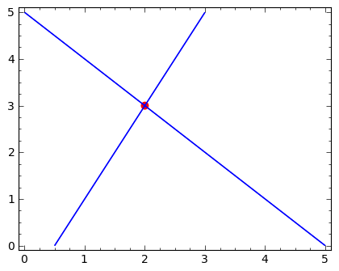

.. -*- coding: utf-8 -*-

Geometria układu równań liniowych
---------------------------------

Interpretacja "wierszowa"
~~~~~~~~~~~~~~~~~~~~~~~~~

Rozważmy dwa równania liniowe:

.. code-block:: python

    sage: var('x1 x2')
    sage: eq1 = 2*x1-x2==1
    sage: eq2 = x1+x2==5
    sage: show(eq1)
    sage: show(eq2)

.. MATH::

    2 \, x_{1} - x_{2} = 1

.. MATH::

    x_{1} + x_{2} = 5

.. end of output

Ich rozwiązaniem są liczby :math:`x_1=2` i :math:`x_1=3`, co łatwo
sprawdzić ręcznie lub za pomocą Sage:

.. code-block:: python

    sage: solve([eq1,eq2],[x1,x2])
    [[x1 == 2, x2 == 3]]

.. end of output

Każde z równań jest prostą na płaszczyźnie :math:`(x_1,x_2).`
Rozwiązanie układu równań leży na obydwu prostych jednocześnie. Wynika
z tego interpretacja graficzna układu dwóch równań liniowych jako
punktu przecięcia się dwóch prostych:

.. code-block:: python

    sage: implicit_plot(eq1,(x1,0,5),(x2,0,5))+\
    ...    implicit_plot(eq2,(x1,0,5),(x2,0,5))+\
    ...    point((2,3),color='red',size=40,figsize=5)

Możemy korzystając z intuicji od razu przypuszczać, że oprócz punktu,
przecięciem się dwóch prostych na płaszczyźnie może być też prosta lub
zbiór pusty. Tak więc dla układów dwóch równań mamy co najwyżej trzy
przypadki:

#. Dokładnie jedno rozwiązanie.
#. Brak rozwiązań - mówimy, że  układ jest sprzeczny.
#. Nieskończenie wiele rozwiązań. 

Interpretacja kolumnowa
~~~~~~~~~~~~~~~~~~~~~~~

Rozważany układ równań

.. MATH::

    \begin{cases}
    2 \, x_{1} - x_{2} &=& 1\\  x_{1} + x_{2} &=& 5 
    \end{cases}

można zapisać jako działania na wektorach kolumnowych:

.. MATH::

      \left [\array{2 x_1\\x_1}\right ] +  \left [\array{-x_2 \\x_2}\right ] = \left [\array{1 \\5}\right ],

czyli:

.. MATH::

     x_1 \left [\array{2 \\1}\right ] + x_2 \left [\array{-1 \\1}\right ] = \left [\array{1 \\5}\right ]

Interpretacja takiego zapisu jest następująca: dla jakich wartości
liczb :math:`x_{1},x_{2}`, suma wektorów :math:`\left [\array{2
\\1}\right ]` i :math:`\left [\array{-1 \\1}\right ]` jest równa
wektorowi :math:`\left [\array{1 \\5}\right ].`

Geometrycznie można to przedstawić w następujący sposób:

.. code-block:: python

    sage: v1 = vector([2,1])
    sage: v2 = vector([-1,1])
    sage: v3 = vector([1,5])

.. end of output

Narysujmy te wektory na płaszczyźnie, wykorzystując polecenie *arrow*:

.. code-block:: python

    sage: arrow( (0,0),v1)+\
    ...    arrow( (0,0),v2)+\
    ...    arrow( (0,0),v3,color='red', figsize=5)

.. image:: iCSE_MAlg01_z12_geom_ukl_rownan_media/cell_248_sage0.png
    :align: center

.. end of output

Znamy odpowiedź \- liczbami tymi są 2 i 3, ale zobaczmy jak to działa.

Eksperyment komputerowy:

W poniższym elemencie interaktywnym rysujemy grubą linią wektory
:math:`v_1` :math:`v_2` kolorem niebieskim a pożądaną wartość ich sumy
:math:`v_3` zielonym. Manipulując suwakami chcemy tak dobrać liczny
:math:`x_1` i :math:`x_2`, by suma ważona :math:`x_1 v_1 + x_2 v_2`
oznaczona kolorem czerwonym pokryła się z zadanym wektorem
:math:`v_3`. Szarym kolorem zostały oznaczone wektory :math:`x_1 v_1`
i :math:`x_2 v_2.`

.. sagecellserver::

    sage: v1 = vector([2,1])
    sage: v2 = vector([-1,1])
    sage: v3 = vector([1,5])
    sage: @interact
    sage: def _(x1=slider(-3,3,1/2,default=1/2),x2=slider(-3,3,1/2,default=0)):
    ...       plt  = arrow( (0,0),v1)+arrow( (0,0),v2)
    ...       plt += arrow((0,0),v3,color='green') 
    ...       plt += arrow( (0,0),x1*v1, color='gray',width=1)
    ...       plt += arrow( (0,0),x2*v2, color='gray',width=1)
    ...       plt += arrow( (0,0),x1*v1+x2*v2, color='red',width=1)
    ...       plt += line( [x2*v2,x2*v2+x1*v1],linestyle='dashed',thickness=0.5,color='black')
    ...       plt += line( [x1*v1,x2*v2+x1*v1],linestyle='dashed',thickness=0.5,color='black')
    ...       plt.set_axes_range(-6,6,-6,6)
    ...       if v3 ==x1*v1+x2*v2:
    ...           print "SUKCES!!!"
    ...       plt.show(figsize=6)

.. end of output

Aby się upewnić, że jesteśmy w stanie przenieść wnioski na większą
liczbę równań, rozważmy teraz układ trzech równań:

.. MATH::

   \begin{cases}
      2 \, x_{1} + x_{2} + x_{3} = 1\\
      x_{1} - x_{2} = -1\\
       x_{1} + x_{2} + 2 \, x_{3} = 2
   \end{cases}

.. end of output

Ma on rozwiązanie w punkcie :math:`x_1 = -1/4, x_2 = 3/4, x_3 = 3/4`.

W przestrzeni trójwymiarowej :math:`x_1,x_2,x_3`, równanie liniowe
opisuje płaszczyznę. Rozwiązaniem układu równań będzie więc miejsce
przecięcia się trzech płaszczyzn:

.. sagecellserver::

    sage: var('x1 x2 x3')
    sage: eq1=2*x1+x2+x3==1
    sage: eq2=1*x1-1*x2==-1
    sage: eq3= x1+1*x2+2*x3==2
    sage: p1=implicit_plot3d(eq1,(x1,-5,5),(x2,-5,5),(x3,-5,5),color='blue',opacity=0.9)
    sage: p2=implicit_plot3d(eq2,(x1,-5,5),(x2,-5,5),(x3,-5,5),color='brown',opacity=0.9)
    sage: p3=implicit_plot3d(eq3,(x1,-5,5),(x2,-5,5),(x3,-5,5),color='green',opacity=0.9)
    sage: p3d=p1+p2+p3+point3d([-1/4,3/4,3/4],size=12,color='red')
    sage: p3d.show()

.. end of output

.. admonition::  Automatyczna konwersja zapisu wierszowego do kolumnowego. 

    Mając układ równań w postaci równań algebraicznych w Sage, warto
    nie przepisywać ręcznie współczynników a zamiast tego
    wyekstrahować je z wyrażeń. Poniższy kod wykonuje te operacje,
    które co prawda wyglądają odstraszająca to w rzeczywistości są do
    "wyeksperymentowaia" w kilka minut.

    .. code-block:: python

        sage: v1,v2,v3 = [vector([eq.lhs().coeff(x) for eq in [eq1,eq2,eq3]]) for x in [x1,x2,x3]]
        sage: v4 = vector([eq.rhs() for eq in [eq1,eq2,eq3]])
        sage: v1,v2,v3,v4
        ((2, 1, 1), (1, -1, 1), (1, 0, 2), (1, -1, 2))

    .. end of output

.. sagecellserver::

    sage: v1,v2,v3,v4 = (vector(QQ,(2, 1, 1)), vector(QQ,(1, -1, 1)), vector(QQ,(1, 0, 2)), vector(QQ,(1, -1, 2)))
    sage: @interact
    sage: def _(x1=slider(-3,3,1/4,default=1/2),x2=slider(-3,3,1/4,default=0),x3=slider(-3,3,1/4,default=0),viewer=['tachyon','jmol']):
    ...       plt  = cube(size=4, frame_thickness=1, opacity=0)
    ...       plt += arrow( (0,0,0),v1)+arrow( (0,0,0),v2)+arrow( (0,0,0),v3)
    ...       plt += arrow( (0,0,0),v4,color='green') 
    ...       plt += arrow( (0,0,0),x1*v1, color='gray',width=1)
    ...       plt += arrow( (0,0,0),x2*v2, color='gray',width=1)
    ...       plt += arrow( (0,0,0),x3*v3, color='gray',width=1)
    ...       plt += arrow( (0,0,0),x1*v1+x2*v2+x3*v3, color='red',width=1)
    ...       
    ...       if v4 ==x1*v1+x2*v2+x3*v3:
    ...           print "SUKCES!!!"
    ...       plt.show(viewer=viewer)

.. end of output

Przypadek osobliwy: układ równań liniowych  ma nieskończenie wiele rozwiązań
~~~~~~~~~~~~~~~~~~~~~~~~~~~~~~~~~~~~~~~~~~~~~~~~~~~~~~~~~~~~~~~~~~~~~~~~~~~~

Weżmy układ równań:

.. MATH::

   \begin{cases}
      2 \, x_{1} + x_{2} + x_{3} = 4\\
      x_{1} + 1/2 x_{2} +1/2 x_3= 2\\
       x_{1} + x_{2} + 2 \, x_{3} = 3
   \end{cases}

.. end of output

Procedura solve daje w wyniku następujące równanie:

    [x1 == r4 + 1, x2 == -3*r4 + 2, x3 == r4],

które jest zależne od zmiennej r4. Zmienna ta może przyjmować dowolne
wartości. Oznacza to, że układ równań jest spełniony przez
nieskończenie wiele trójek liczb w powyższej postaci.

Zobaczmy co to oznacza geometrycznie. W interpretacji "wierszowej"
rozwiązaniem jest wspólna część trzech płaszczyzn. Narysujmy je w tym
przypadku:

.. sagecellserver::

    sage: var('x1 x2 x3')
    sage: eq1=2*x1+x2+x3==4
    sage: eq2=1*x1+1/2*x2+1/2*x3==2
    sage: eq3= x1+1*x2+2*x3==3
    sage: p1=implicit_plot3d(eq1,(x1,-5,5),(x2,-5,5),(x3,-5,5),color='blue',opacity=0.9)
    sage: p2=implicit_plot3d(eq2,(x1,-5,5),(x2,-5,5),(x3,-5,5),color='brown',opacity=0.9)
    sage: p3=implicit_plot3d(eq3,(x1,-5,5),(x2,-5,5),(x3,-5,5),color='green',opacity=0.9)
    sage: var('r4')
    sage: p3d=p1+p2+p3+parametric_plot([r4 + 1,  -3*r4 + 2,  r4],(r4,-3,3),color='red',thickness=5)
    sage: v1,v2,v3 = [vector([eq.lhs().coeff(x) for eq in [eq1,eq2,eq3]]) for x in [x1,x2,x3]]
    sage: v4 = vector([eq.rhs() for eq in [eq1,eq2,eq3]])
    sage: v1,v2,v3,v4
    sage: p3d_a = arrow( (0,0,0),v1)+arrow( (0,0,0),v2)+arrow( (0,0,0),v3)+arrow( (0,0,0),v4,color='red')
    sage: p3d_a.show()
    sage: p3d.show()

.. end of output

Wektory kolumnowe :math:`v_{1,2,3}` leża w jednej płaszczyźnie a wektor
:math:`v_4` będący prawą stroną układu równań należy do tej płaszczyzny.

Przypadek osobliwy: układ sprzeczny
~~~~~~~~~~~~~~~~~~~~~~~~~~~~~~~~~~~

Rozważmy teraz podobny układ równań, lecz z inną prawą stroną:

.. MATH::

   \begin{cases}
      2 \, x_{1} + x_{2} + x_{3} = 1\\
      x_{1} + 1/2 x_{2} +1/2 x_3= 1\\
       x_{1} + x_{2} + 2 \, x_{3} = 1
   \end{cases}

Układ ten nie ma rozwiązań. Zobaczmy co to oznacza w interpretacji wierszowej i kolumnowej.

.. sagecellserver::

    sage: var('x1 x2 x3')
    sage: eq1=2*x1+x2+x3==1
    sage: eq2=1*x1+1/2*x2+1/2*x3==1
    sage: eq3= x1+1*x2+2*x3==1
    sage: p1=implicit_plot3d(eq1,(x1,-5,5),(x2,-5,5),(x3,-5,5),color='blue',opacity=0.9)
    sage: p2=implicit_plot3d(eq2,(x1,-5,5),(x2,-5,5),(x3,-5,5),color='brown',opacity=0.9)
    sage: p3=implicit_plot3d(eq3,(x1,-5,5),(x2,-5,5),(x3,-5,5),color='green',opacity=0.9)
    sage: var('r4')
    sage: p3d=p1+p2+p3
    sage: v1,v2,v3 = [vector([eq.lhs().coeff(x) for eq in [eq1,eq2,eq3]]) for x in [x1,x2,x3]]
    sage: v4 = vector([eq.rhs() for eq in [eq1,eq2,eq3]])
    sage: v1,v2,v3,v4
    sage: p3d_a = arrow( (0,0,0),v1)+arrow( (0,0,0),v2)+arrow( (0,0,0),v3)+arrow( (0,0,0),v4,color='red')
    sage: p3d_a.show()
    sage: p3d.show()

.. end of output

W interpretacji wierszowej mamy do czynienia z sytuacją w której dwie
płaszczyzny są do siebie równoległe, lecz nie pokrywają się ze sobą. 

Obraz w interpretacji kolumnowej pokazuje, że jak w przypadku układu
nieoznaczonego, wektory :math:`v_1,v_2` i :math:`v_3` leżą na jednej
płaszczyźnie. W przeciwieństwie do poprzedniego przypadku jednak
wektor :math:`v_4` **nie** leży na tej płaszczyźnie co intuicyjnie powoduje,
że może być ich sumą ważoną.

Zadania:
~~~~~~~~

Rozważmy układ równań:

.. MATH::

     \begin{cases}-8 \, x_{1} + 22 \, x_{2} - 8 \, x_{3} &=& 1 \\ x_{1} - 3 \, x_{2} + x_{3} &=& 0 \\ 3 \, x_{1} - 8 \, x_{2} + 3 \, x_{3} &=& -1/2 \\ \\ \end{cases}

Wykorzystując system Sage lub ręczne rachunki:

 #. Rozwiązać układ.

 #. Zmodyfikować prawą stronę tak by otrzymać układ sprzeczny. Narysować wektory kolumnowe i uzasadnić sprzeczność układu.

 #. Zmodyfikować macierz tak by dla dowolnej prawej strony układ nigdy nie był sprzeczny \- zastosować rysunek wektorów kolumnowych do uzasadnienia. 

.. code-block:: python

    sage: var('x1 x2 x3')
    sage: var('b1 b2 b3')
    sage: A = random_matrix(QQ,3,algorithm='subspaces')
    sage: b = random_vector(QQ,3)
    sage: b1 = A.column_space().basis()[0]
    sage: show(A)
    sage: show(b)
    sage: show(b1)

.. MATH::

    \left(\begin{array}{rrr}
    2 & -2 & 4 \\
    -2 & 3 & -5 \\
    1 & -2 & 3
    \end{array}\right)

.. MATH::

    \left(-5,\,129,\,1\right)

.. MATH::

    \left(1,\,0,\,-\frac{1}{2}\right)

.. end of output

.. code-block:: python

    sage: for i,x in enumerate(A*vector([x1,x2,x3])):
    ...       print latex(x),'&=& %s \\\\'%b1[i]
    2 \, x_{1} - 2 \, x_{2} + 4 \, x_{3} &=& 1 \\
    -2 \, x_{1} + 3 \, x_{2} - 5 \, x_{3} &=& 0 \\
    x_{1} - 2 \, x_{2} + 3 \, x_{3} &=& -1/2 \\

.. end of output

.. code-block:: python

    sage: print latex(b)
    sage: print latex(b1)
    \left(-5,\,129,\,1\right)
    \left(1,\,0,\,-\frac{1}{2}\right)

.. end of output

.. code-block:: python

    sage: A\b
    Traceback (most recent call last):
    ...
    ValueError: matrix equation has no solutions

.. end of output

.. code-block:: python

    sage: A\b1
    (3/2, 1, 0)

.. end of output

