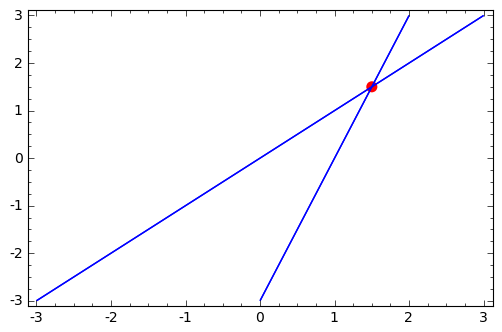
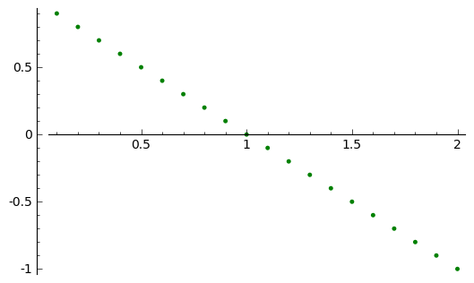

.. -*- coding: utf-8 -*-

 

Układy równań liniowych (podejście bez rachunku macierzowego).
--------------------------------------------------------------

Cel:

 #. Nabycie umiejętności Rozwiązywania układów równań liniowych, przy pomocy metody eliminacji Gaussa.

 #. Sage: Sposób operacji na równaniach i zapisu układów równań (liniowych).

 #. Sage: Poznanie metod komputerowych, które mogą służyć do rozwiązywania układów równań liniowych (np. procedura  ``solve()``  ).

Rozważmy układ dwóch równań:

.. code-block:: python

    sage: var('x1 x2')
    sage: eq1 = x1-1*x2*1==0
    sage: eq2 = -3*x1+x2==-3

.. end of output

.. code-block:: python

    sage: show( eq1 )

.. MATH::

    x_{1} - x_{2} = 0

.. end of output

.. code-block:: python

    sage: show( eq2 )

.. MATH::

    -3 \, x_{1} + x_{2} = \left(-3\right)

.. end of output

Rozwiązanie można uzyskać stosując ogólną metodę  ``solve()`` . Metoda ta nie jest ograniczona do równań liniowych.

.. code-block:: python

    sage: s=solve([eq1,eq2],[x1,x2])
    sage: print s[0]
    [x1 == (3/2), x2 == (3/2)]

.. end of output

.. code-block:: python

    sage: if len(s)>0 and s[0][0].rhs().number_of_arguments()==0:
    ...       p = point( [s[0][0].rhs(),s[0][1].rhs()],color='red',size=50)
    sage: else:
    ...       p=Graphics()

.. end of output

Wizualizacja układu równań dla dwóch zmiennych. Zastosowanie  ``implicit_plot()`` pozwala na wykorzystanie dla przypadku równań nieliniowych.

.. code-block:: python

    sage: implicit_plot(eq1,(x1,-3,3),(x2,-3,3))+implicit_plot(eq2,(x1,-3,3),(x2,-3,3))+p

.. end of output

Procedura solve rozwiązując układ równań liniowych, w przypadku rozwiązania nieoznaczonego, podaje ogólną postać zależną od parametrów swobodnych. Poniższy kod umożliwia wyciągnięcie tych zmiennych i użycie w innych procedurach.

.. code-block:: python

    sage: s=solve([x1+x2==1,x1+x2==1],[x1,x2])
    sage: print s[0]
    [x1 == -r1 + 1, x2 == r1]

.. end of output

.. code-block:: python

    sage: # little hack
    sage: lvar=uniq(flatten(map(lambda w: w.variables(), s[0])))
    sage: for x in [x1,x2]:
    ...       lvar.remove(x)
    sage: for rvar in lvar:
    ...       var(rvar)
    sage: print lvar
    [r1]

.. end of output

.. code-block:: python

    sage: ss=[ map(lambda w: w.rhs().subs({rvar:x}), s[0]) for x in srange(-1,1,0.1) ]
    sage: point(ss,color='green')

.. end of output

Zastosowanie powyższego kodu do równań nieliniowych: mamy 3 zmienne, kilka rozwiązań zależących od parametrów.

.. code-block:: python

    sage: var('x1 x2 x3')
    sage: solutions=solve([x1^2+x2^2==x3,x3==1],[x1,x2,x3])
    sage: show( solutions )

.. MATH::

    \left[\left[x_{1} = r_{2}, x_{2} = -\sqrt{-r_{2}^{2} + 1}, x_{3} = 1\right], \left[x_{1} = r_{3}, x_{2} = \sqrt{-r_{3}^{2} + 1}, x_{3} = 1\right]\right]

.. end of output

.. code-block:: python

    sage: ss=[]
    sage: for i,s in enumerate(solutions):
    ...       lvar=uniq(flatten(map(lambda w: w.variables(), s)))
    ...       for x in [x1,x2,x3]: # lub inna lista...
    ...           lvar.remove(x)
    ...       for rvar in lvar:
    ...           var(rvar)
    ...       ss.append( [ map(lambda w: w.rhs().subs({rvar:x}), s) for x in srange(-1,1,0.1) ] )
    r2
    r3

.. end of output

.. code-block:: python

    sage: sum([point3d(s,color='green',viewer='tachyon') for s in ss])

.. end of output

Rozwiązywanie układu dwóch równań:

.. code-block:: python

    sage: var('x1 x2')
    sage: eq1=x1-x2==0
    sage: eq2=-3*x1+x2==-3

.. end of output

.. code-block:: python

    sage: r2=-3/2*(eq1+eq2/3)

.. end of output

.. code-block:: python

    sage: r1=eq1.subs({x1:r2.rhs()}) 
    sage: show(r1)

.. MATH::

    -x_{2} + \frac{3}{2} = 0

.. end of output

.. code-block:: python

    sage: show( r1*(-1)+3/2 )

.. MATH::

    x_{2} = \left(\frac{3}{2}\right)

.. end of output

Rozważmy układ trzech równań. Za pomocą operacji dodawania do siebie wielokrotności równań, oraz ich przestawiania doprowadzamy układ do postaci schodkowej.

.. code-block:: python

    sage: var('x1 x2 x3')
    sage: eq1=x1+2*x2+2*x3==4
    sage: eq2=x1+3*x2+3*x3==5
    sage: eq3=2*x1+6*x2+5*x3==6
    sage: html.table([eq1,eq2,eq3])
    <html>...</html>

.. end of output

.. code-block:: python

    sage: eq2=eq2-eq1
    sage: html.table([eq1,eq2,eq3])
    <html>...</html>

.. end of output

.. code-block:: python

    sage: eq3=eq3-2*eq1
    sage: html.table([eq1,eq2,eq3])
    <html>...</html>

.. end of output

.. code-block:: python

    sage: eq3=eq3-2*eq2
    sage: html.table([eq1,eq2,eq3])
    <html>...</html>

.. end of output

Mnożąc ostatnie równanie przez :math:`-1` dostajemy układ równań w postaci schodkowej:

.. code-block:: python

    sage: eq3=-eq3
    sage: html.table([eq1,eq2,eq3])
    <html>...</html>

.. end of output

Wykonując odpowiednie podstawienia wstecz otrzymujemy:

.. code-block:: python

    sage: html.table( [eq1.subs(eq2.subs(eq3)-4).subs(eq3)-2,eq2.subs(eq3)-4,eq3] )
    <html>...</html>

.. end of output

Sprawdźmy czy odpowiedź jest zgodna z wbudowaną procedurą  ``solve()`` :

.. code-block:: python

    sage: solve([eq1,eq2,eq3],[x1,x2,x3])
    [[x1 == 2, x2 == -3, x3 == 4]]

.. end of output

.. code-block:: python

    sage: p1=implicit_plot3d(eq1,(x1,-5,5),(x2,-5,5),(x3,-5,5),color='blue')
    sage: p2=implicit_plot3d(eq2,(x1,-5,5),(x2,-5,5),(x3,-5,5),color='brown')
    sage: p3=implicit_plot3d(eq3,(x1,-5,5),(x2,-5,5),(x3,-5,5),color='green')
    sage: p3d=p1+p2+p3+point3d([2,-3,4],size=22,color='red')

.. end of output

.. code-block:: python

    sage: #p3d.show()
    sage: p3d.show(viewer='tachyon',camera_center=(2,1,1))

.. end of output

Eliminacja Gaussa (Jordana) \- krok po kroku:
---------------------------------------------

Cele:

 #. Wyrobienie intuicji w procedurze eliminacji Gaussa (Jordana) bez wykonywania mozolnej arytmetyki.

 #. Sage: operacje na rzędach macierzy:  ``swap_rows, swap_rows, rescale_row,add_multiple_of_row``  oraz metoda ``rref()``

.. code-block:: python

    sage: A=matrix([[   0,-2, 1],\
    ...             [-1/2, 0, 0],\
    ...             [-1  ,-1, 0] ])
    sage: show(A)

.. MATH::

    \left(\begin{array}{rrr}
    0 & -2 & 1 \\
    -\frac{1}{2} & 0 & 0 \\
    -1 & -1 & 0
    \end{array}\right)

.. end of output

.. code-block:: python

    sage: b=matrix([[1],[2],[2]])
    sage: show(b)

.. MATH::

    \left(\begin{array}{r}
    1 \\
    2 \\
    2
    \end{array}\right)

.. end of output

.. code-block:: python

    sage: B=A.augment(b)
    sage: show(B )

.. MATH::

    \left(\begin{array}{rrrr}
    0 & -2 & 1 & 1 \\
    -\frac{1}{2} & 0 & 0 & 2 \\
    -1 & -1 & 0 & 2
    \end{array}\right)

.. end of output

Uprzedzając procedurę możemy  podejrzeć wynik:

.. code-block:: python

    sage: show(B.rref())

.. MATH::

    \left(\begin{array}{rrrr}
    1 & 0 & 0 & -4 \\
    0 & 1 & 0 & 2 \\
    0 & 0 & 1 & 5
    \end{array}\right)

.. end of output

.. code-block:: python

    sage: B.swap_rows(0,2)
    sage: B.rescale_row(0,-1)
    sage: B.add_multiple_of_row(1,0,1/2) # -> do drugiego dodaj pierwszy razy 1/2
    sage: B.add_multiple_of_row(2,1,4)
    sage: B.add_multiple_of_row(0,1,-2)
    sage: B.rescale_row(1,2)

.. end of output

.. code-block:: python

    sage: show(B)
    sage: show(B.rref())

.. MATH::

    \left(\begin{array}{rrrr}
    1 & 0 & 0 & -4 \\
    0 & 1 & 0 & 2 \\
    0 & 0 & 1 & 5
    \end{array}\right)

.. MATH::

    \left(\begin{array}{rrrr}
    1 & 0 & 0 & -4 \\
    0 & 1 & 0 & 2 \\
    0 & 0 & 1 & 5
    \end{array}\right)

.. end of output

Eliminacja Gaussa\-Jordana układu sprzecznego
---------------------------------------------

 #. Analiza specjalnych przypadków układów równań liniowych, wykorzystujemy albo ``rref()``  albo posługujemy się operacjami na rzędach macierzy.

 #. Przedstawienie rozwiązanie równania :math:`Ax=b` jako rozwiązanie szczegolne + kombinacja bazy jądra :math:`A`.

 #. Sage: ``right_kernel().basis(), right_kernel(), rank()`` , iteratory. 

.. code-block:: python

    sage: A=matrix(QQ,[[0,1,0],[0,1,0],[1,2,3]])
    sage: b= vector(QQ, [1, 0, 1])
    sage: html.table([['rank(A)=',rank(A)],['rank(A|b)=',rank(A.augment(b))]])
    sage: A=A.augment(b)
    sage: show(A)
    <html>...</html>

.. MATH::

    \left(\begin{array}{rrrr}
    0 & 1 & 0 & 1 \\
    0 & 1 & 0 & 0 \\
    1 & 2 & 3 & 1
    \end{array}\right)

.. end of output

.. code-block:: python

    sage: A.swap_rows(0,2)
    sage: show(A)

.. MATH::

    \left(\begin{array}{rrrr}
    1 & 2 & 3 & 1 \\
    0 & 1 & 0 & 0 \\
    0 & 1 & 0 & 1
    \end{array}\right)

.. end of output

.. code-block:: python

    sage: A.add_multiple_of_row(0,1,-2)
    sage: show(A)

.. MATH::

    \left(\begin{array}{rrrr}
    1 & 0 & 3 & 1 \\
    0 & 1 & 0 & 0 \\
    0 & 1 & 0 & 1
    \end{array}\right)

.. end of output

.. code-block:: python

    sage: A.add_multiple_of_row(2,1,-1)
    sage: show(A)

.. MATH::

    \left(\begin{array}{rrrr}
    1 & 0 & 3 & 1 \\
    0 & 1 & 0 & 0 \\
    0 & 0 & 0 & 1
    \end{array}\right)

.. end of output

.. code-block:: python

    sage: A.add_multiple_of_row(0,2,-1)
    sage: show(A)

.. MATH::

    \left(\begin{array}{rrrr}
    1 & 0 & 3 & 0 \\
    0 & 1 & 0 & 0 \\
    0 & 0 & 0 & 1
    \end{array}\right)

.. end of output

Wykorzystując gotową procedurę:

.. code-block:: python

    sage: show(A.rref())

.. MATH::

    \left(\begin{array}{rrrr}
    1 & 0 & 3 & 0 \\
    0 & 1 & 0 & 0 \\
    0 & 0 & 0 & 1
    \end{array}\right)

.. end of output

Zmieńmy tak wektor :math:`b` by układ miał rozwiązania:

.. code-block:: python

    sage: A=matrix(QQ,[[0,1,0],[0,1,0],[1,2,3]])
    sage: b= vector(QQ, [1, 1,1])
    sage: A\b
    (-1, 1, 0)

.. end of output

.. code-block:: python

    sage: show(A)

.. MATH::

    \left(\begin{array}{rrr}
    0 & 1 & 0 \\
    0 & 1 & 0 \\
    1 & 2 & 3
    \end{array}\right)

.. end of output

.. code-block:: python

    sage: show( (A.augment(b)).rref() )

.. MATH::

    \left(\begin{array}{rrrr}
    1 & 0 & 3 & -1 \\
    0 & 1 & 0 & 1 \\
    0 & 0 & 0 & 0
    \end{array}\right)

.. end of output

.. code-block:: python

    sage: html.table([['rank(A)=',rank(A)],['rank(A|b)=',rank(A.augment(b))]])
    <html>...</html>

.. end of output

.. code-block:: python

    sage: for v in A.right_kernel().basis():
    ...       show(v)
    ...       html.table([['$Av=$',A,"x",v.column(),"=", (A*v).column()]] )
    <html>...</html>

.. MATH::

    \left(1,\,0,\,-\frac{1}{3}\right)

.. end of output

.. code-block:: python

    sage: A=matrix(QQ,[[1,0,0],[2,1,0],[-1,-1,1]])
    sage: show(A)
    sage: B=matrix(QQ,[[1,0,0],[-2,1,0],[-1,1,1]])
    sage: show(B)

.. MATH::

    \left(\begin{array}{rrr}
    1 & 0 & 0 \\
    2 & 1 & 0 \\
    -1 & -1 & 1
    \end{array}\right)

.. MATH::

    \left(\begin{array}{rrr}
    1 & 0 & 0 \\
    -2 & 1 & 0 \\
    -1 & 1 & 1
    \end{array}\right)

.. end of output

.. code-block:: python

    sage: A*B
    [1 0 0]
    [0 1 0]
    [0 0 1]

.. end of output

.. code-block:: python

    sage: A=matrix(QQ,[[1,0],[6,1]])
    sage: A.inverse()
    [ 1  0]
    [-6  1]

.. end of output

Macierz :math:`n\neq m`
-----------------------

 

.. code-block:: python

    sage: #Jeszcze jeden przykład
    sage: A=matrix(QQ,[[0,1,0,1],[0,1,1,0]])
    sage: b= vector(QQ, [1, 1])
    sage: A\b
    (0, 1, 0, 0)

.. end of output

.. code-block:: python

    sage: show(A)

.. MATH::

    \left(\begin{array}{rrrr}
    0 & 1 & 0 & 1 \\
    0 & 1 & 1 & 0
    \end{array}\right)

.. end of output

.. code-block:: python

    sage: A.right_kernel().basis()
    [
    (1, 0, 0, 0),
    (0, 1, -1, -1)
    ]

.. end of output

.. code-block:: python

    sage: rank(A)
    2

.. end of output

.. code-block:: python

    sage: show( (A.augment(b)).rref() )

.. MATH::

    \left(\begin{array}{rrrrr}
    0 & 1 & 0 & 1 & 1 \\
    0 & 0 & 1 & -1 & 0
    \end{array}\right)

.. end of output

.. code-block:: python

    sage: for v in A.right_kernel().basis():
    ...       show(v.column())
    ...       html.table([['$Av=$',A,"x",v.column(),"=", (A*v).column()]] )
    <html>...</html>

    <html>...</html>

.. MATH::

    \left(\begin{array}{r}
    1 \\
    0 \\
    0 \\
    0
    \end{array}\right)

.. MATH::

    \left(\begin{array}{r}
    0 \\
    1 \\
    -1 \\
    -1
    \end{array}\right)

.. end of output

Zadania:
--------

W poniższych zadaniach naciśnięcie "Evaluate" spowoduje wygenerowanie
losowego układu równań lub losowej macierzy.  

Zadanie 1. Za pomocą operacji elementarnych, doprowadzić macierz do postaci schodkowej. 
~~~~~~~~~~~~~~~~~~~~~~~~~~~~~~~~~~~~~~~~~~~~~~~~~~~~~~~~~~~~~~~~~~~~~~~~~~~~~~~~~~~~~~~~

Wolno używać tylko wbudowanych funkcji Sage do operacji na rzędach.

.. sagecellserver::

    sage: rank=0
    sage: n=randint(2,7)
    sage: while rank!=n:
    ...       A=random_matrix(QQ,n,n)
    ...       rank=A.rank()
    sage: show(A)

.. end of output

Zadanie 2. Rozwiązać układ równań metodą eliminacji Gaussa. 
~~~~~~~~~~~~~~~~~~~~~~~~~~~~~~~~~~~~~~~~~~~~~~~~~~~~~~~~~~~~

 #. Czy układ jest sprzeczny?

 #. Czy układ jest nieoznaczony?

 #. Ile jest rozwiązań, od ilu parametrów zależą rozwiązania?

.. sagecellserver::

    sage: n=randint(2,5)
    sage: m=randint(2,5)
    sage: A=random_matrix(QQ,m,n)
    sage: b=random_vector(QQ,m)
    sage: x=vector([var('x%d' % (i+1)) for i in range(n)])
    sage: html.table( [[(A*x)[i],"=",b[i]] for i in range(m)])

.. end of output

