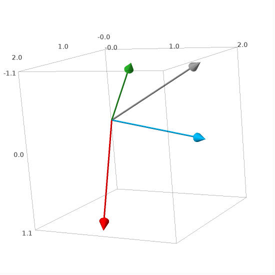
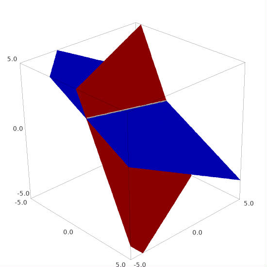
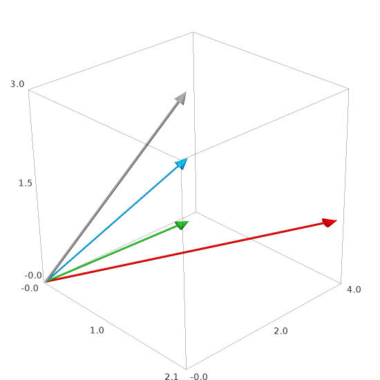
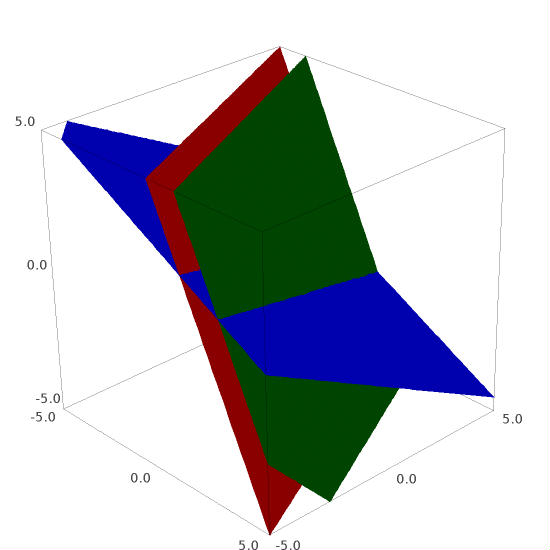
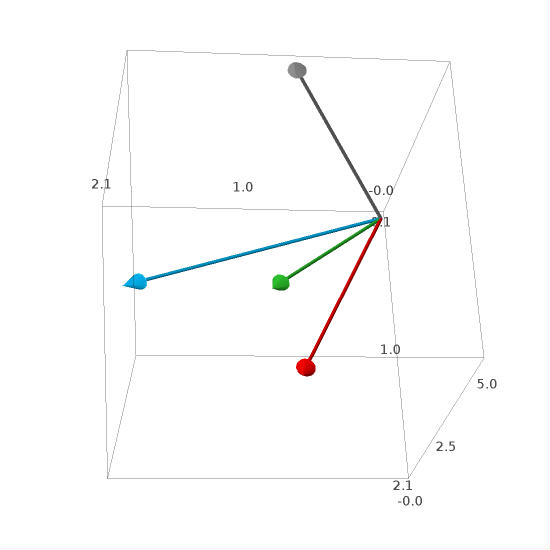

.. -*- coding: utf-8 -*-

Geometry of Linear Equations
----------------------------

Badanym w tej sekcji układom dwóch albo trzech równań liniowych odpowiadają 
określone sytuacje na płaszczyźnie albo w trójwymiarowej przestrzeni.

Omówione będą dwie interpretacje takich układów równań: obraz wierszowy i kolumnowy.
Określenia te odnoszą się do wierszy i kolumn macierzy współczynników, 
która wespół z kolumną wolnych wyrazów reprezentuje dany układ równań.

Dyskusja taka pozwoli wyrobić intuicję, pomocną przy analizie większych układów równań,
których obrazem są obiekty geometryczne w przestrzeniach wielowymiarowych.

Row Picture
~~~~~~~~~~~

Rozważmy układ dwóch równań liniowych:

.. math::
   :nowrap:
   
   \begin{alignat*}{3}
   2\,x_1 & {\,} - {\,} & x_2 & {\;} = {\;} & 1 \\ 
   x_1 & {\,} + {\,}& x_2 & {\;} = {\;} & 5
   \end{alignat*}
   
Rozwiązaniem są liczby :math:`\ x_1=2\ \; \text{i} \ \; x_2=3\,,\:` 
co łatwo sprawdzić ręcznie lub komputerowo:

.. sagecellserver::

   var('x1 x2')
   
   eq1 = 2*x1-x2==1
   eq2 = x1+x2==5

   show(solve([eq1,eq2],[x1,x2]))
   
| Każde z równań przedstawia prostą na płaszczyźnie :math:`(x_1,x_2).`   
  Obrazem rozwiązania układu jest punkt leżący na obydwu prostych jednocześnie,
  czyli punkt przecięcia się tych dwóch prostych (o ile proste się przecinają):

.. figure:: figures/Rys_0.png
   :height: 10 cm
   :width: 10 cm
   :scale: 70 %
   :align: center

| W ogólności mogą wystąpić następujące sytuacje:
|
| a.) :math:`\ ` proste przecinają się w jednym punkcie,
| b.) :math:`\ ` proste pokrywają się (są identyczne),
| c.) :math:`\ ` proste są równoległe (ale różne).
|
| Wtedy odpowiednio układ dwóch równań:
|
| a.) :math:`\ ` ma dokładnie jedno rozwiązanie (układ oznaczony),
| b.) :math:`\ ` ma nieskończenie wiele rozwiązań (układ nieoznaczony),
| c.) :math:`\ ` nie ma żadnych rozwiązań (układ sprzeczny).

Column Picture
~~~~~~~~~~~~~~
 
Rozważany układ równań

.. math::
   :nowrap:
   
   \begin{alignat*}{3}
   2\,x_1 & {\,} - {\,} & x_2 & {\;} = {\;} & 1 \\ 
   x_1 & {\,} + {\,}& x_2 & {\;} = {\;} & 5
   \end{alignat*}

można przepisać w postaci równości dwóch wektorów kolumnowych:

.. math::
   
   \left[\begin{array}{r} 2\,x_1\ -\ x_2 \\ x_1\ +\ x_2 \end{array}\right]
   \ =\ 
   \left[\begin{array}{c} 1 \\ 5 \end{array}\right]\,.

Wykorzystując działania na wektorach kolumnowych otrzymujemy

.. Wykorzystując operację dodawania wektorów kolumnowych otrzymujemy

.. .. math::
   
   \left[\begin{array}{r} 2x_1 \\ x_1 \end{array}\right]\ +\   
   \left[ \begin{array}{r} -x_2 \\ x_2 \end{array}\right] \ =\  
   \left[\begin{array}{r} 1 \\ 5 \end{array}\right]\,,

.. a odwołując się do definicji iloczynu wektora kolumnowego przez liczbę mamy:

.. math::

   x_1\ \left[\begin{array}{r} 2 \\ 1 \end{array}\right] \ + \ 
   x_2\ \left[\begin{array}{r} -1 \\ 1 \end{array}\right] \ = \ 
   \left[\begin{array}{r} 1 \\ 5 \end{array}\right]\,.

Sens takiego zapisu jest następujący: :math:`\;` dla jakich współczynników 
:math:`\;x_{1},\,x_{2}\ \;` kombinacja

liniowa wektorów :math:`\ \ \boldsymbol{v}_1=\left[\begin{array}{r} 2 \\ 1 \end{array}\right]
\ \ \,\text{i}\quad\boldsymbol{v}_2=\left[\begin{array}{r} -1 \\ 1 \end{array}\right]\ \,`
równa się wektorowi 
:math:`\ \,\boldsymbol{w}\,=\left[ \begin{array}{r} 1 \\5 \end{array} \right]\ `? :math:`\\ \\`

.. .. sidebar:: Kombinacja liniowa.

   | Kombinacja liniowa :math:`\ \,\boldsymbol{w}\ \,` wektorów
     :math:`\ \,\boldsymbol{v}_1\ \ \text{i}\ \ \,\boldsymbol{v}_2\ `
   | o współczynnikach liczbowych :math:`\ \,x_1\ \ \text{i}\ \ \, x_2\,` 
   | jest z definicji ich :math:`\ ` "sumą ważoną" :math:`\ ` postaci
   |
   | :math:`\qquad\qquad\boldsymbol{w}\ =\ x_1\,\boldsymbol{v}_1 + x_2\,\boldsymbol{v}_2\,.`
   |

.. admonition:: Poeksperymentuj z Sage:
   
   W poniższym programie wektory kolumnowe 
   :math:`\;\boldsymbol{v}_1,\,\boldsymbol{v}_2\ \ \text{i}\ \ \boldsymbol{w}\ `
   są reprezentowane przez wektory geometryczne 
   :math:`\;\vec{v}_1,\,\vec{v}_2\ \ \,\text{i}\ \ \,\vec{w}.\ `
   Operując suwakami, dobierz wartości współczynników :math:`\ x_1\ \ \text{i}\ \ \,x_2\ \,`
   tak, aby wektor :math:`\;x_1\,\vec{v}_1 + x_2\,\vec{v}_2\;` 
   (oznaczony kolorem szarym) pokrył się z wektorem :math:`\,\vec{w}`.

.. sagecellserver::

   v1 = vector([2,1]); v2 = vector([-1,1]); w = vector([1,5])

   @interact

   def _(x1=('$$x_1:$$', slider(0,3,1/2, default=3)),
         x2=('$$x_2:$$', slider(0,3,1/2, default=2))):

       plt = arrow((0,0),v1,color='red',legend_label=' $v_1$', zorder=5) +\
             arrow((0,0),v2,color='green',legend_label=' $v_2$', zorder=5) +\
             arrow((0,0),w,color='black',legend_label=' $w$',   zorder=5) +\
             arrow((0,0),x1*v1,color='gray',width=1,arrowsize=3) +\
             arrow((0,0),x2*v2,color='gray',width=1,arrowsize=3) +\
             arrow((0,0),x1*v1+x2*v2,color='gray',width=1.75,arrowsize=3) +\
             line([x1*v1,x2*v2+x1*v1],color='black',
                  linestyle='dashed',thickness=0.5) +\
             line([x2*v2,x2*v2+x1*v1],color='black',
                  linestyle='dashed',thickness=0.5) +\
             point((0,0),color='white',
                   faceted=True,size=18,zorder=7)

       plt.set_axes_range(-3,7,-1,6)   
    
       if x1*v1+x2*v2==w: html("SUKCES!!!")
       plt.show(aspect_ratio=1,ticks=[1,1],figsize=5)

W ogólności, układ równań liniowych jest całkowicie określony 
przez zadanie macierzy współczynników :math:`\,\boldsymbol{A}\ \ `
i :math:`\ ` kolumny wolnych wyrazów :math:`\,\boldsymbol{w}.\ \,` 
W tym wypadku są to:

.. math::

   \boldsymbol{A}\ =\ \left[\begin{array}{rr} 2 & -1 \\ 1 & 1 \end{array}\right]\,,\qquad
   \boldsymbol{w}\ =\ \left[\begin{array}{c} 1 \\ 5 \end{array}\right]\,.

Obraz wierszowy układu równań otrzymamy, odczytując wiersze (czyli poziome rzędy) 
macierzy :math:`\,\boldsymbol{A},\ ` a obraz kolumnowy :math:`\ -\ ` odczytując kolumny
(pionowe rzędy) tej macierzy.

:math:`\ `

Consistent System: a unique solution
~~~~~~~~~~~~~~~~~~~~~~~~~~~~~~~~~~~~

Rozważmy teraz układ trzech równań o trzech niewiadomych:

.. math::
   :nowrap:

   \begin{alignat*}{4}
   2\,x_1 & {\,} + {\,} & x_2 & {\,} + {\,} &    x_3 & {\;} = {} &  1 \\
      x_1 & {\,} - {\,} & x_2 &             &        & {\;} = {} & -1 \\
      x_1 & {\,} + {\,} & x_2 & {\,} + {\,} & 2\,x_3 & {\;} = {} &  2 
   \end{alignat*}

Ma on rozwiązanie w punkcie 
:math:`\ \ x_1 = -\frac{1}{4},\ \ x_2 = \frac{3}{4},\ \ x_3 = \frac{3}{4}\,.`

W trójwymiarowej przestrzeni współrzędnych :math:`\ x_1,\,x_2,\,x_3\ ` równanie liniowe
przedstawia płaszczyznę. W obrazie wierszowym rozwiązanie układu równań jest więc wyznaczone
przez  miejsce geometryczne przecięcia się trzech płaszczyzn.

.. figure:: figures/Rys_11.jpg
   :height: 10 cm
   :width: 10 cm
   :scale: 90 %
   :align: center

Na rysunku płaszczyzny odpowiadające kolejnym równaniom układu są oznaczone kolorem czerwonym,
zielonym i niebieskim, a punkt wspólny tych płaszczyzn :math:`\ -\ ` kolorem białym.

W obrazie kolumnowym rozwiązanie układu równań sprowadza się do wyznaczenia współczynników
:math:`\ x_1,\,x_2,\,x_3\ \,` kombinacji liniowej wektorów kolumnowych 
:math:`\ \boldsymbol{v}_1,\,\boldsymbol{v}_2,\,\boldsymbol{v}_3\,,\ `
która równałaby się wektorowi :math:`\,\boldsymbol{w}:` 

.. math::
   :label: col
   
   x_1\,\boldsymbol{v}_1\,+\,x_2\,\boldsymbol{v}_2\,+\,x_3\,\boldsymbol{v}_3\ =\ \boldsymbol{w}\,.

Przejście do postaci kolumnowej :eq:`col` układu trzech równań o współczynnikach całkowitych
można wykonać automatycznie przy użyciu podanej niżej funkcji ``verse3column()``
(wykonanie kodu definiującego funkcję nie wyprowadzi na razie żadnego wyniku):

.. sagecellserver::

   def verse3colmn(Eqns):

       var('x1 x2 x3')
    
       L = [vector([eq.lhs().coeff(x) for eq in Eqns]) for x in [x1,x2,x3]]
       
       b = vector([eq.rhs() for eq in Eqns])
       L.append(b)
       
       clmn = '$\\left[\\begin{array}{r} %d \\\ %d \\\ %d \\end{array}\\right]$'
       comp = '$x_%i$' + clmn
   
       html(comp % (1, L[0][0],L[0][1],L[0][2]) + ' $+$ ' +\
            comp % (2, L[1][0],L[1][1],L[1][2]) + ' $+$ ' +\
            comp % (3, L[2][0],L[2][1],L[2][2]) + ' $=$ ' +\
            clmn %    (L[3][0],L[3][1],L[3][2]))            

Aby wywołać funkcję, trzeba utworzyć listę równań :math:`\ ` ``Eqns`` :math:`\ ` 
i podać ją jako argument:

.. sagecellserver::

   var('x1 x2 x3')

   eq1 = 2*x1+1*x2+1*x3== 1
   eq2 = 1*x1-1*x2+0*x3==-1
   eq3 = 1*x1+1*x2+2*x3== 2

   Eqns = [eq1,eq2,eq3]
   
   try: verse3colmn(Eqns)
   except NameError: html("Wykonaj kod w poprzedniej komórce!")

Rysunek przedstawia obraz kolumnowy układu równań.
Wektory geometryczne :math:`\ \vec{v}_1,\,\vec{v}_2,\,\vec{v}_3\,,\ `
odpowiadające wektorom kolumnowym
:math:`\ \boldsymbol{v}_1,\,\boldsymbol{v}_2,\,\boldsymbol{v}_3\,,\ `
są oznaczone odpowiednio kolorem czerwonym, zielonym i niebieskim, 
wektor :math:`\,\vec{w}\;` jest szary. :math:`\,`
Wektory :math:`\ \vec{v}_1,\,\vec{v}_2,\,\vec{v}_3\ ` nie są komplanarne 
(nie leżą w jednej płaszczyźnie), przez co układ równań ma dokładnie jedno rozwiązanie.

.. Tak jak w poprzednim przykładzie z układem dwóch równań, obraz wierszowy układu równań
   można odczytać z postaci macierzy współczynników :math:`\,\boldsymbol{A}\ \,` 
   i :math:`\ ` kolumny wolnych wyrazów :math:`\ \boldsymbol{w}:`

   .. math::

   \boldsymbol{A}\ =\ (\boldsymbol{v}_1,\boldsymbol{v}_2,\boldsymbol{v}_3)
                 \ =\ \left[\begin{array}{rrr}
                            2 &  1 & 1 \\
                            1 & -1 & 0 \\
                            1 &  1 & 2
                            \end{array}\right]\,,\qquad     
   \boldsymbol{w}\ =\ \left[\begin{array}{r} 1 \\ -1 \\ 2 \end{array}\right]\,.

   Ich kolejne wiersze wyznaczają równania płaszczyzn, odpowiadających równaniom układu.

Consistent System: infinitely many solutions
~~~~~~~~~~~~~~~~~~~~~~~~~~~~~~~~~~~~~~~~~~~~

Zajmiemy się z kolei rozwiązaniami układu równań liniowych

.. math::
   :nowrap:

   \begin{alignat*}{4}
   2\,x_1 & {\,} + {\,} &    x_2 & {\,} + {\,} &    x_3 & {\;} = {\;} & 1 \\
   4\,x_1 & {\,} + {\,} & 2\,x_2 & {\,} + {\,} & 2\,x_3 & {\;} = {\;} & 2 \\
      x_1 & {\,} + {\,} &    x_2 & {\,} + {\,} & 2\,x_3 & {\;} = {\;} & 3
   \end{alignat*}

Stosując procedurę ``solve()`` otrzymujemy rozwiązanie zależne od parametru :math:`\,r_1,\,`  
który może przyjmować dowolne wartości: 

.. sagecellserver::

   var('x1 x2 x3')

   eq1 = 2*x1+1*x2+1*x3==1
   eq2 = 4*x1+2*x2+2*x3==2
   eq3 = 1*x1+1*x2+2*x3==3

   show(solve([eq1,eq2,eq3],[x1,x2,x3]))

Oznacza to, że układ równań jest spełniony przez nieskończenie wiele trójek liczb.

Taka sytuacja wystąpi zawsze wtedy, gdy jedno z równań jest kombinacją liniową pozostałych.
Równanie takie wynika z równań pozostałych, odrzucenie go nie zmienia więc zbioru rozwiązań.
W tym wypadku drugie równanie jest po prostu podwojonym równaniem pierwszym,
mamy więc faktycznie układ dwóch niezależnych równań o trzech niewiadomych.

:math:`\ `

Poniższe rysunki pokazują geometryczną interpretację 
wierszowego i kolumnowego obrazu tego układu.

Płaszczyzny, reprezentujące dwa pierwsze równania (oznaczone kolorem czerwonym i zielonym)
są identyczne i pokrywają się. Trzecia płaszczyzna (niebieska), odpowiadająca trzeciemu równaniu, 
przecina się z nimi wzdłuż linii prostej (białej). Linia ta przedstawia zbiór rozwiązań układu,
składający się z nieskończenie wielu punktów.

W obrazie kolumnowym wektory :math:`\ \vec{v}_1,\,\vec{v}_2,\,\vec{v}_3\ ` 
(oznaczone odpowiednio kolorem czerwonym, zielonym i niebieskim)
leżą w jednej płaszczyźnie, a wektor :math:`\ \vec{w}\,` (szary), 
reprezentujący prawą stronę układu równań, 
też należy do tej płaszczyzny. W tej sytuacji nieskończenie wiele kombinacji liniowych wektorów
:math:`\ \vec{v}_1,\,\vec{v}_2,\,\vec{v}_3\ ` może równać się wektorowi :math:`\ \vec{w}.`

**Dygresja o nieoznaczonych układach równań.**

Przypuśćmy, że rozwiązujemy układ równań (niekoniecznie liniowych) w Sage za pomocą ``solve()`` 
i w wyniku dostajemy wyrażenia zależne od parametrów ``r1,r2,...`` (ich nazwy mogą być nieprzewidywalne). Jeśli chcemy wykorzystać te parametry np. do narysowania rozwiązań, 
to przed ich użyciem trzeba zadeklarować odpowiadające im zmienne.

W podanym przykładzie występuje trywialny nieoznaczony układ dwóch równań o dwóch niewiadomych,
którego rozwiązanie zależy od jednego parametru. Zastosowana procedura pozwala
wykreślić zbiór rozwiązań dla zadanego przedziału zmienności parametru.
Zachęcamy do analizy kodu i zapoznania się z użytymi zaawansowanymi narzędziami systemu Sage.

.. sagecellserver::

   var('x1 x2')
   
   # Nieoznaczony układ równań:
   Eqns = [  x1 +   x2 == 1,
           2*x1 + 2*x2 == 2]
   
   s = solve(Eqns,[x1,x2])
   print s[0] # rozwiązanie układu
   
   # Wyłuskanie wszystkich parametrów od których zależy rozwiązanie:
   lvar = uniq(flatten(map(lambda w: w.variables(), s[0])))
   for x in [x1,x2]: lvar.remove(x)
   for rvar in lvar: var(rvar)
   print lvar # lista parametrów jako zmiennych

   # Wykres zbioru rozwiązań dla parametru w zadanym przedziale:
   pts = [map(lambda w: w.rhs().subs(lvar[0]==p), s[0]) 
          for p in srange(-1,1,0.1)]

   line(pts, axes_labels=['x1','x2'], color='green', figsize=5)

Inconsistent System: no solution
~~~~~~~~~~~~~~~~~~~~~~~~~~~~~~~~

Rozważmy teraz podobny układ równań, lecz z inną prawą stroną:

.. math::
   :nowrap:

   \begin{alignat*}{4}
   2\,x_1 & {\,} + {\,} &    x_2 & {\,} + {\,} &    x_3 & {\;} = {\;} & 0 \\
   4\,x_1 & {\,} + {\,} & 2\,x_2 & {\,} + {\,} & 2\,x_3 & {\;} = {\;} & 5 \\
      x_1 & {\,} + {\,} &    x_2 & {\,} + {\,} & 2\,x_3 & {\;} = {\;} & 1
   \end{alignat*}

Układ ten nie ma rozwiązań:

.. sagecellserver::

   var('x1 x2 x3')

   eq1 = 2*x1+1*x2+1*x3==0
   eq2 = 4*x1+2*x2+2*x3==5
   eq3 = 1*x1+1*x2+2*x3==1

   show(solve([eq1,eq2,eq3],[x1,x2,x3]))

| Wzajemna sprzeczność pierwszych dwóch równań jest oczywista:
| lewa strona drugiego równania jest podwojoną lewą stroną pierwszego równania, 
  powinna więc być równa 0, a nie 5. Zobaczmy, co to oznacza w obrazie wierszowym i kolumnowym.

Ilustracja obrazu wierszowego sprzecznego układu równań:

| Płaszczyzny, odpowiadajace pierwszym dwóm równaniom układu (czerwona i zielona) są równoległe, 
  ale nie pokrywają się. W tej sytuacji nie ma punktów wspólnych dla wszystkich trzech płaszczyzn.

Ilustracja obrazu kolumnowego sprzecznego układu równań:

Na rysunku wektory :math:`\,\vec{v}_1,\,\vec{v}_2,\,\vec{v}_3\,` (czerwony, zielony i niebieski)
leżą na tej samej płaszczyźnie.
W odróżnieniu jednak od poprzedniego przypadku z nieskończoną ilością rozwiązań,
wektor :math:`\ \vec{w}\,` nie jest z nimi komplanarny, przez co nie może być ich kombinacją liniową
(każda kombinacja liniowa wektorów :math:`\ \vec{v}_1,\,\vec{v}_2,\,\vec{v}_3\ ` 
leży w płaszczyźnie przez te trzy wektory wyznaczonej).

:math:`\ `

**Macierzowy zapis układu równań.**

Weźmy (przedyskutowany wcześniej) typowy układ trzech równań z trzema niewiadomymi:

.. math::
   :nowrap:

   \begin{alignat*}{4}
   2\,x_1 & {\,} + {\,} & x_2 & {\,} + {\,} &    x_3 & {\;} = {} &  1 \\
      x_1 & {\,} - {\,} & x_2 &             &        & {\;} = {} & -1 \\
      x_1 & {\,} + {\,} & x_2 & {\,} + {\,} & 2\,x_3 & {\;} = {} &  2 
   \end{alignat*}

w którym macierz współczynników i kolumna wolnych wyrazów dane są przez

.. math::

   \boldsymbol{A}\ =\ (\boldsymbol{v}_1,\boldsymbol{v}_2,\boldsymbol{v}_3)
                 \ =\ \left[\begin{array}{rrr}
                            2 &  1 & 1 \\
                            1 & -1 & 0 \\
                            1 &  1 & 2
                            \end{array}\right]\,,\qquad     
   \boldsymbol{w}\ =\ \left[\begin{array}{r} 1 \\ -1 \\ 2 \end{array}\right]\,.

   \;

Przyjmując definicję iloczynu macierzy :math:`\,\boldsymbol{A}\,` 
przez wektor kolumnowy niewiadomych :math:`\,\boldsymbol{x}:`

.. math::
   
   \left[\begin{array}{rrr}
          2 &  1 & 1 \\
          1 & -1 & 0 \\
          1 &  1 & 2
         \end{array}\right]\ 
   \left[\begin{array}{r} x_1 \\ x_2 \\ x_3 \end{array}\right]\ \ :\,=\ \  
   x_1\ \left[\begin{array}{r} 2 \\  1 \\ 1 \end{array}\right]\ +\ \,
   x_2\ \left[\begin{array}{r} 1 \\ -1 \\ 1 \end{array}\right]\ +\ \,
   x_3\ \left[\begin{array}{r} 1 \\ 0 \\ 2 \end{array}\right]\,,

   \; 

można postać kolumnową :eq:`col` tego układu zapisać zwięźle macierzowo jako:
:math:`\quad \boldsymbol{A}\,\boldsymbol{x}\,=\,\boldsymbol{w}\,.`

   

