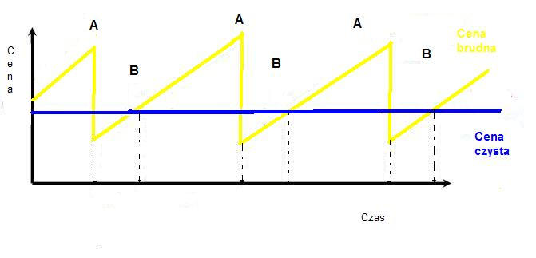
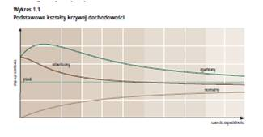
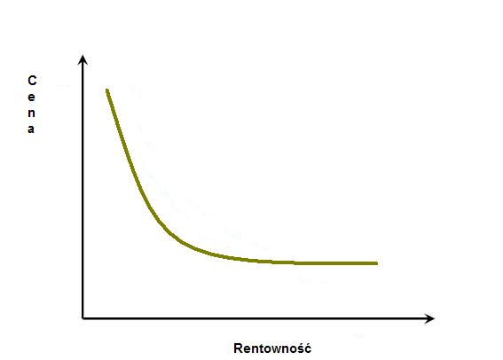
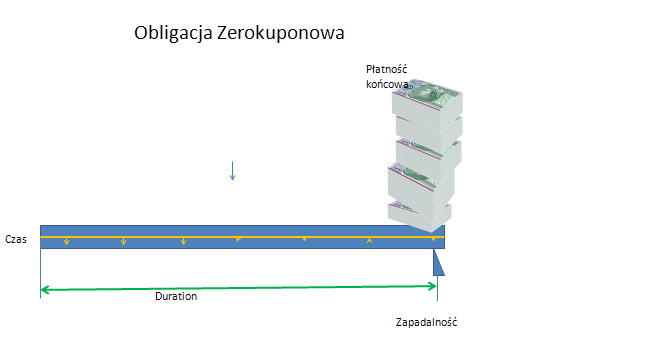
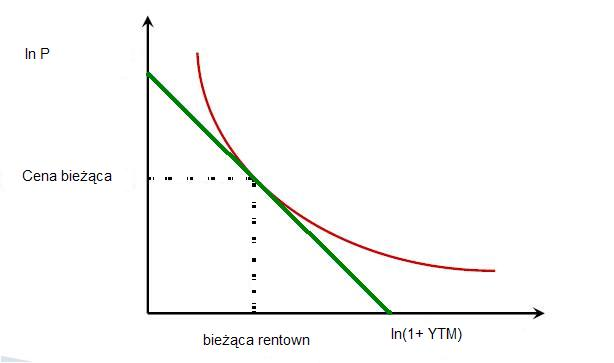
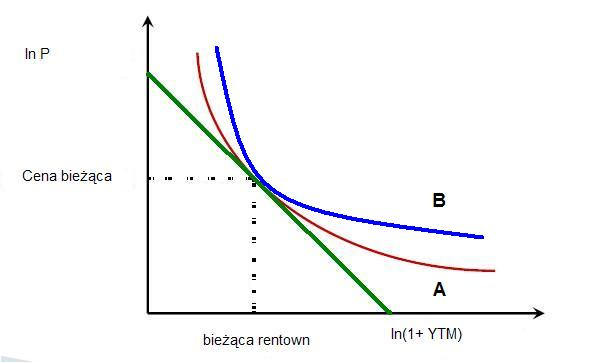

Analiza i wycena  instrumentów finansowych
==========================================

Najważniejszym na rynku jest orientacja w tym, co się dzieje i czy instrumenty, które są w obrocie w danym momencie i których ceny są znane na rynku odzwierciedlają ich rzeczywistą wartość. Wycena instrumentu finansowego to termin odnoszący się do obliczenia wartości tego instrumentu w chwili bieżącej (momencie otwierania lub zamykania przez inwestora pozycji).  Wycenę instrumentu pochodnego nazywamy **godziwą** (sprawiedliwą), jeśli żadna ze stron nie jest uprzywilejowana. Pytanie czy wycena jest godziwa to pytanie o szanse naszego działania. Należy, bowiem wiedzieć, czy cena rynkowa instrumentów jest wyższa  lub niższa od ich godziwej wartości. Jeśli cena rynkowa jest inna niż własna wycena inwestora to wie on, jakie działanie podjąć na rynku by pozbyć się przewartościowanych instrumentów biorąc należną premie, nabyć niedowartościowane licząc na zysk w najbliższej przyszłości. Przy próbach wyceny instrumentów finansowych zmuszeni jesteśmy czynić pewne upraszczające założenia dotyczące funkcjonowania rynku. Najczęstsze założenia dotyczą efektywności, płynności i możliwości arbitrażu [1]_. W zależności od przyjętych założeń otrzymujemy pewną modelową wycenę, która może uwzględniać nasze subiektywne rozumienie mechanizmów rządzących opisywanym procesem. W tym celu często definiuje się tzw. **funkcję użyteczności** opisującą liczbowo wartość [2]_, jaką przedstawia dla danego inwestora dany instrument oraz jego **nastawienie do ryzyka**. Zwykle zakłada się również istnienie (dostępność) **wolnej od ryzyka stopy procentowej**. Jest to pewna idealizacja - w praktyce przyjmuje się, że rolę tę mogą pełnić stopy dochodu zerokuponowych [3]_ obligacji (bonów skarbowych) gwarantowanych przez skarb państwa (lub instytucję równoważną). Dostępność oznacza tu, że w obrocie dostępne są takie instrumenty o dowolnym  terminie zapadalności. Jak wspomnieliśmy wyżej, wycena instrumentu finansowego nie może uwzględniać  subiektywnych odczuć stron kontraktu. Przy pewnych założeniach można zaproponować niezależną od preferencji inwestora wycenę instrumentu. Na przykład, jeśli istnieje portfel replikujący [4]_ dany instrument taki, że  wypłata (:math:`X_k`) z posiadanego instrumentu  i wartość (P_k) replikującego go portfela  w interesującym nas momencie są równe (np w chwili wygaśnięcia instrumentu). Załóżmy, że w chwili początkowej :math:`X_p>P_p`. Można wtedy, sprzedać instrument po cenie :math:`X_p`  i kupić portfel replikujący po cenie :math:`P_p` (płynność!). Różnica :math:`X_p-P_p` nazywana jest zyskiem arbitrażowym. Podobnie, gdy :math:`X_p<P_p` to kupując instrument finansowy po cenie :math:`X_p` i sprzedając  portfel replikujący po cenie :math:`P_p` (płynność i krótka sprzedaż!) można uzyskać zysk bez ryzyka arbitrażowy :math:`P_p-X`. Zysk arbitrażowy jest niemożliwy tylko wtedy,  gdy :math:`X_p=P_p` (pomijamy koszty transakcji). Wydaje się, że rozsądnym jest przyjęcie za sprawiedliwą cenę instrumentu :math:`X_p=P_p`. Jest to możliwe, wtedy, gdy spełnione jest prawo jednej ceny, do czego zwykle wystarczy brak możliwości arbitrażu. Powyższe idee i założenia pozwalają zrozumieć podstawowe zasady wyceny instrumentów finansowych, krótko przedstawione poniżej.

Instrumenty rynku pieniężnego
-----------------------------

Wartość pieniądza w czasie 

Wartość przyszła

Mając w posiadaniu pewną kwotę pieniędzy stajemy przed następującym wyborem: czy wydać te pieniądze natychmiast i kupić sobie coś, czyli innymi słowy skonsumować je czy też przezornie zachować na  późniejszy czas, gdy może będą nam bardziej potrzebne?

Jeśli już nie przeznaczamy ich na konsumpcję, to w dalszym ciągu myślimy jak je przechować do chwili późniejszej.  Chwila refleksji podsunie nam dość naturalne pytanie czy trzymanie pieniędzy w portfelu (czy też innym bezpiecznym miejscu, przykładowa skarpeta czy pod materacem)  jest dla naszego stanu posiadania bezpieczne, gdyż to przecież inflacja zmniejszać będzie ich wartość? Możemy te pieniądze zainwestować i spowodować by "pracowały" dla nas. Inwestowanie to oddanie własnych pieniędzy innym, którzy w zamian za użyczenie naszych pieniędzy na pewien okres zapłacą nam w postaci odsetek od pożyczonego kapitału i zwrócą go nam w tej samej kwocie, co pożyczyli.

Taką inwestycją może być lokata bankowa. Depozyt bankowy jest instrumentem pozwalającym na zwiększenie wartości naszych pieniędzy w czasie trwania depozytu.
Wpłacając pewną kwotę P do banku, na rachunek oszczędnościowy. Bank płaci nam rocznie roczne oprocentowanie w wysokości r.

Po roku mamy, więc:

.. math::

   F= P + Pr = P (1+r)

Po 2 latach zaś:

.. math::

   F=P(1+r) + F (1+r) r = F(1+r)(1+r) = F (1+r)^2

Gdzie:

:math:`F` = wartość przyszła

:math:`P` = wartość aktualna (bieżąca) pieniędzy

:math:`r` = stopa procentowa (oprocentowanie roczne)

Jak było to już wykazane w rozdziale 3. wartość naszych pieniądzach po n latach będzie wynosić:

.. math::

   F = P (1+r)^n

Albo inaczej przyjmując  bardziej międzynarodowe oznaczenia:

.. math::

   F_V=P_V(1+r)^n

Gdzie :

* :math:`F_V` nazywa się  wartością przyszłą (future value)
* :math:`P_V` to wartość bieżąca  pieniedzy (present value)
* :math:`n` ilość lat
* :math:`r` - stopa  odsetkowa.

Gdyby znaleźć sie w sytuacji, gdy dzisiaj potrzebujemy pieniędzy, które możemy zwrócić dopiero po pewnym czasie to znajdując kogoś, kto dziś posiada pewna nadwyżkę pieniędzy możemy pożyczyć od niego pieniądze. Stajemy przed problemem ile pieniędzy będziemy musieli zwrócić po pewnym czasie. Dzisiaj wiemy ile potrzebujemy więc;
 
.. math::

   P_V= \frac{F_V}{(1+r)^n}

Taki proces nazywa się dyskontowaniem. Bardziej szczegółowa analiza tego procesu w rozdziale 3.

Rynek  pieniądza znajduje się w równowadze i warunki oprocentowania "komuś" są takie same jak "od kogoś", czyli stopa dyskontowa jest równa stopie oprocentowania.
 
Jak widać stopa procentowa jest "zapłatą" za niepewność oddania naszych pieniędzy w czyjeś ręce. Jej wielkość wynagradza  inflacje i ryzyko pożyczki.
 
Powyższe rozważania a szczególnie wzory, pozwalają na sformułowanie dwu  ważnych praw charakteryzujących zachowania się pieniędzy w czasie.

I. *Pieniądz dzisiaj jest więcej wart niż pieniądz w przyszłości.*

II. *Pieniądz dzisiaj ulokowany w ryzykownej inwestycji jest mniej wart niż pieniądz ulokowany w bezpiecznej inwestycji (mniejsze r).*

Wartość bieżąca netto.

Jeśli nabywamy jakiś  instrument finansowy to instrument ten generuje przepływy finansowe. Przepływy to : wypływ na nabycie instrumentu oraz wpływy do inwestora w postaci albo odsetek, lub dywidendy albo (i) końcowej wypłaty pieniężnej (zwrot zaciągniętej pożyczki albo wpływ ze sprzedaży akcji).

Ponieważ przepływy są odległe od siebie w czasie ich dzisiejsza wartość musi obliczyć w sposób podobny do wcześniej już prezentowanego, czyli uwzgledniajacy zmianę wartości pieniądza w czasie.

Zdyskontowane strumienie pieniężne.

Dyskontowanie przepływów to wyrażanie ich w pieniądzu z okresu bieżącego, czyli wartości aktualnej.

.. math::

   P_V=\sum\limits_{i=1}^n\ P_V(D_i)

gdzie  :math:`P_V(D_i)` to wartość zaktualizowana przepływu :math:`D_i`

W przypadku stałych wartości płatności w czasie  wzór ten przybierze postać:

.. math::

   P_o=\sum\limits_{i=1}^n\frac{D}{(1+r)^i}

Wartość bieżąca netto

Wartość  tą wyliczamy odejmując od przyszłych wpływów finansowych dzisiejsze koszty inwestycji np. nabycie instrumentu

.. math::

   NPV=\sum_{t=1}^n\frac{D_t}{(1+r)^t}-I_0

gdzie:

* :math:`NPV` - wartość bieżąca netto,
* :math:`D_t` - przepływy gotówkowe w okresie t,
* :math:`r` - stopa dyskonta,
* :math:`I_0` - nakłady początkowe,
* :math:`t` - kolejne okresy (najczęściej lata) inwestycji

Generalnie, wartość bieżąca netto to różnica zdyskontowanych wpływów i wypływów finansowych (przyjmowanych ze znakiem -) generowanych przez inwestycje.

Jeśli NPV jest <0 to inwestycja jest  niekorzystna i nie należy jej robić.

IRR czyli wewnętrzna stopa zwrotu

Dla skrajnego przypadku  NPV =0 rozwiązujemy powstałe równanie ze względu na  r. Takie rozwiązanie wymaga bardziej zaawansowanych metod obliczeń już dla t>1. A ponieważ mamy do czynienia z wielomianem rzędu, więc do rozwiązywania stosujemy metody przybliżone.

Depozyt na rynku pieniężnym
~~~~~~~~~~~~~~~~~~~~~~~~~~~

Depozyty rynku pieniężnego to instrumenty stałego oprocentowania, które są zawierane na określony okres czasu i nie mogą być likwidowane przed terminem zapadalności.

Ponieważ są instrumentami rynku pieniężnego ich okres do zapadalności jest mniejszy od jednego roku. Powoduje to potrzebę  przeliczania rocznej stopy procentownia na okresy mniejsze od roku.

Sumę odsetek na koniec okresu depozytu wyliczyć można ze wzoru:

.. math::

   R=D d (n/360)

Gdzie:

* R = suma odsetek
* D = wartość depozytu
* d = oprocentowanie depozytu (annualizowane)
* n = ilość dni pomiędzy początkiem okresu depozytu a jego zapadalnością

Należy zwrócić uwagę, że przyjęto tutaj standard roku liczącego 360 dni.  Gdyby standard był inny (a jest top częsty przypadek) należy uwzględniać inna wartość dni w roku.

Efektywna stopę zwrotu na depozycie  można wyliczyć ze wzoru na wartość pieniądza w czasie.

Instrumenty dyskontowe
~~~~~~~~~~~~~~~~~~~~~~

Są to typowe instrumenty rynku pieniężnego wyceniane na zasadzie dyskonta tzn. są handlowane  z dyskontem w stosunku do wartości nominalnej. Najczęściej spotykanymi na rynku  przedstawicielami tej grupy są bony skarbowe i dłużne papiery komercyjne. Jak już to było wykazane, ich cena aktualna jest równa 

------------------------------------

.. math::

   P =FV/(1+Y DTM/360)

------------------------------------

gdzie:

P – cena rynkowa

FV – wartość nominalna
 
Y – rentowność

DTM – ilość dni do wykupu,

Przyjęto standard roku liczącego 360 dni - standard dla Bonów Skarbowych na polskim rynku.

Wycena obligacji
----------------

Obligacja jest to papier wartościowy (instrument finansowy),  stwierdzający zaciągnięcie przez emitenta obligacji długu wobec  posiadacza obligacji – zwanego obligatariuszem i zawierający zobowiązanie,  wobec obligatariusza   do wykupu obligacji - jako zwrotu zaciągniętego długu oraz wypłacenia odsetek za korzystanie z użyczonych pieniędzy  oraz terminowość wypłat. Odsetki mogą być wypłacane w określonych momentach (tzw. kupony) lub w postaci dyskonta w momencie emisji (obligacja zerokuponowa).

Cechy charakterystyczne określające obligacje:

* wartość nominalna – jest to wartość zaciągniętego długu, od której nalicza się odsetki, i która jest płacona w momencie wykupu przez emitenta posiadaczowi obligacji;
* termin wykupu – jest to termin, w którym obligatariusz otrzymuje od emitenta kwotę równą wartości nominalnej; w terminie wykupu obligacja podlega wykupowi;
* oprocentowanie – stopa procentowa określająca wielkość odsetek wypłaconych obligatariuszowi;
* terminy płacenia odsetek, – czyli częstotliwość wypłat odsetek. Przykładowo: raz na rok, raz na pól roku, kwartalnie. 
* cena emisyjna – to  cena, po której obligacja jest sprzedawana jej pierwszemu posiadaczowi w momencie emisji. Cena ta może  być zarówno niższa jak i wyższa od ceny nominalnej. Decyzja emitenta zależy w tym przypadku do przewidywanego zainteresowania i oprocentowania obligacji.

W charakterystycznych cechach obligacji wymienione zostały dwie ceny związana z obligacją. Były to cena nominalna i cena emisyjna. W rynkowym obrocie obligacjami używa się jeszcze terminów ceny rynkowej i rozliczeniowej. *Cena rynkowa* (kurs giełdowy), jest ustalana na codziennych sesjach giełdowych, jako wypadkowa popytu i podaż [5]_. Określana jest w procentach wartości nominalnej. Nie jest to jednak faktycznie ta cena, jaką faktycznie płaci kupujący i otrzymuje sprzedający obligacje, ponieważ nie uwzględnia narosłych odsetek przypadających w danym dniu. *Cena rozliczeniowa*, czyli cena giełdowa powiększona o narosłe odsetki, to rzeczywista kwota transakcyjna, jaką płaci kupujący i otrzymuje sprzedający obligacje. Aby ją obliczyć, należy po prostu dodać do ceny rynkowej należne w tym dniu odsetki. Wartość obligacji na rynku (a zatem jej cena), jak zostało wcześniej wspomniane, kształtuje się w wyniku popytu i podaży, które z kolei zależą od różnych czynników. Najważniejszym czynnikiem kształtującym wartość obligacji jest poziom stóp procentowych.
Inwestorzy często dokonują wyceny obligacji. Wycena obligacji polega na określaniu tzw. *godziwej ceny obligacji* ( fair price), która powinna odzwierciedlać wartość obligacji. Najczęściej stosowaną metodą przy wycenie jest metoda dochodowa, inaczej zwana metodą zdyskontowanych przepływów pieniężnych.

Wycena obligacji [6]_. 

Cena godziwa (fair price)
~~~~~~~~~~~~~~~~~~~~~~~~~

Jeśli mamy obligację, której emitent zobowiązuje się do płacenia odsetek regularnie raz do roku i zamierza zwrócić zaciągnięte zobowiązanie (wartość nominalną) w chwili wykupu, na koniec życia zobowiązania, to godziwa cena takiego instrumentu jest wynikiem zdyskontowanej wartości bieżącej przepływów pieniężnych generowanych przez takie zobowiązanie. Stopa dyskontowa jest określana przez rynek.

:math:`P_o=\sum\limits_{i=1}^n\frac{C}{(1+r)^i} +\frac{P_N}{(1+r)^n}`, 

gdzie

:math:`C` – odsetki (ang. coupon)

:math:`P_o` – wartość obligacji

:math:`P_n` – wartość nominalna

:math:`r` - stopa dyskontowa

.. admonition:: Przykład: (obligacja ze stałym kuponem)

   Jaka  jest wartość obligacji  o terminie wykupu przypadającym za dwa lata. Wartość nominalna tej obligacji wynosi 100, oprocentowanie 6%, odsetki płacone są, co rok.
   Wymagana stopa dochodu określona przez inwestora wynosi 7% w skali roku. 

   Po podstawieniu do wzoru otrzymujemy:

   :math:`P_o=\frac{6}{(1+0,07)^1} +\frac{106}{(1+0,07)^2}`.

   W naszym przypadku:

   :math:`C=0,06x100 = 0,06`

   :math:`R = 7\% = 0,07`.

   (Wartość nominalna wynosi 100 czyli w 2 roku nastąpi wpływ :math:`\frac{100+6}{(1+0,07)^2}`)

   Dla naszego inwestora wartość  tej obligacji wynosi 98, 2 jednostek.

Cena godziwa dla obligacji wieczystych
~~~~~~~~~~~~~~~~~~~~~~~~~~~~~~~~~~~~~~

Obligacje wieczyste zwane konsolami nie są nigdy wykupywane [7]_, a ich posiadacz otrzymuje nieskończony strumień odsetek, zwany rentą wieczystą. W tym przypadku
n= :math:`\infty`.

Więc  cena godziwa

:math:`P_o = \frac {C}{r}`  

(jest to suma szeregu geometrycznego).

Obligacja  zerokuponowa
~~~~~~~~~~~~~~~~~~~~~~~

Obligacje zerokuponowe to typowe instrumenty dyskontowe. Ich cena jest wyznaczana poprzez dyskontowanie ich wartości nominalnej do dnia wyceny. Wzór stosowany dotychczas do wyceny obligacji przybierze postać:

:math:`P_o=\sum\limits_{i=1}^n\frac{C}{(1+r)^i} +\frac{P_N}{(1+r)^n}= \sum\limits_{i=1}^n\frac{0}{(1+r)^i} +\frac{P_N}{(1+r)^n}\ = \frac{P_N}{(1+r)^n}`

Podany wyżej wzór dotyczy  obligacji wypłacającej   kupon jeden raz na rok. Dla  większej ilości okresów  odsetkowych aby obliczyć wartość obligacji należy zdyskontować strumienie pieniężne, jakie generuje do  czasu wykupu.

Jej wartość można wyrazić  następująco:

:math:`P_o=\sum\limits_{i=1}^n\frac{C_i/m}{(1+r/m)^i} +\frac{P_N}{(1+r/m)^n}`

Gdzie:

:math:`m` – liczba płatności odsetkowych w roku

:math:`n` – to liczba okresów odsetkowych w roku, :math:`n = mT`

:math:`T` -  długość życia obligacji w latach

:math:`P_n` - wartość nominalna obligacji.

:math:`C_i` – wysokość kuponu w i-tym okresie odsetkowym.

:math:`i` - i-ty okres odsetkowy  ( :math:`i` zawiera się  między 1 a :math:`n` )

:math:`r` - stopa dyskontowa.

Wycena przy kapitalizacji ciągłej
~~~~~~~~~~~~~~~~~~~~~~~~~~~~~~~~~

Powyższe wyliczenia dotyczą  kapitalizacje dyskretnej  obligacji. Dla ciągłego procesu kapitalizacji  i stałego kuponu  wartość obligacji będzie opisywana zależnością:

:math:`P_o=\sum\limits_{i=1}^n {(C/m)}{\exp(-r t_i)} +\  {P_N}{\exp(-rt_n)}`,

gdzie:

:math:`t_i` -  moment wypłaty i–tego kuponu

pozostałe oznaczenia jak wyżej.

Rentowność obligacji
~~~~~~~~~~~~~~~~~~~~

Obligacja jest instrumentem dłużnym. Jeśli inwestor zainwestował pieniądze w czyjś dług spodziewa się sie nagrody za czas, w którym jego pieniędzmi dysponuje ktoś inny. Oczywiście  w przypadku  obligacji inwestor oprócz  kwoty nominalnej pożyczki, której zwrot następuje po zakończeniu  życia zobowiązania  dostaje  regularnie wypłacane,  co okres odsetki. Ale obligacja może zmienić  właściciela miedzy okresami wypłaty kuponu. Każdy z posiadaczy tej obligacji rości sobie prawo do partycypacji w tym kuponie, gdyż każdy z inwestorów  przez określoną ilość dni  finansuje dług. Każdy z nich  chce udziału w kuponie proporcjonalnie do czasu, w jakim był posiadaczem obligacji w okresie miedzy wypłatą kuponu.  Cena rozliczeniowa obligacji to pewna wartość zwana ceną czystą obligacji + należne odsetki za okres posiadania. Zależność jest liniowa.

Tak zdefiniowana cena nazywa się cena „brudna”  i po takiej cenie  rozliczają się tak naprawdę uczestnicy rynku. Cena brudna, a właściwie jej zachowanie w czasie  posiada kształt przypominający  zęby piły.

*Cena brudna a cena czysta obligacji.*

Dodatkowo należy wspomnieć o następującej sytuacji. Kupon jest wypłacany  właścicielowi obligacji. Właścicielowi,  w dniu naliczania kuponu.  Jeśli miedzy dniem naliczenia kuponu a dniem wypłacenia fizycznego pieniędzy obligacja zmieni właściciela  to nowy można powiedzieć, że stary właściciel dostaje pieniądze za czas, kiedy obligacja do niego nie należy.  W takiej sytuacji nowy właściciel jest  „wynagradzany” przez starego właściciela  tym, że cena  brudna  w tym czasie jest niższa od ceny czystej. Rysunek obok modelowo  obrazuje taką sytuację i zachowanie się w czasie  cen obligacji.

Zgodnie z (David Blake - Fin. Mark. Analysis)( dla roku o 365 dniach) narosłe odsetki są równe

:math:`A_i =d\frac{{N_a}-{N_b}}{365}`

Gdzie :

:math:`A_i` – należne odsetki

:math:`N_a` - ilość dni miedzy dniem naliczenia odsetek i datą wypłaty kuponu

:math:`N_b` – liczba dni miedzy data naliczenia  kuponu a dniem transakcji

:math:`d` - wartość płatności kuponu

Stopa zwrotu z obligacji
""""""""""""""""""""""""

Ze względu na często skomplikowane strumienie pieniężne, jakie generują  obligacje, trudne jest je (obligacje) porównywać na podstawie ceny, raczej robi się to poprzez porównywania stopy zwrotu. Istnieje  kila różnych stóp zwrotu.

 
**Stopa bieżąca**

Najprostszym sposobem oceny obligacji jest  określenie stopy bieżącej.
 
Jest ona definiowana, jako  stosunek kuponu, czyli oprocentowania obligacji w skali roku do ceny czystej

:math:`r_c=\frac{d}{P}`

Gdzie:

:math:`r_c` - bieżąca stopa

:math:`P` -  cena czysta

:math:`d` - oprocentowanie obligacji w skali roku

Właściwszym byłoby, w zasadzie  używać ceny brudnej do takiej oceny, gdyż właściwie taką cenę płaci się za obligacje. Jednakże  należy pamiętać o jej podobieństwie do piły i  stopa bieżąca tez miałby taki charakter.

**Stopa zwrotu w terminie do wykupu (Yield to maturity)**

 
Do tego momentu  mówiąc o cenie obligacji używano  wzoru:

:math:`P_o=\sum\limits_{i=1}^n\frac{C_i/m}{(1+r/m)^i} +\frac{P_N}{(1+r/m)^n}`

Wyceniając ciąg płatności zakładaliśmy wartość stopy dyskontowej.

 
Na rynku mamy sytuacje nieco inną,  znamy  raczej bieżące, ceny rynkowe obligacji.  Aby wiec wycenić jej stopę zwrotu,  czyli stopę od chwili nabycia do końca życia  instrumentu powinno się za stronę lewą równania wstawić wartość rynkowa  obligacji i wyliczyć stopę zwrotu.

Tak wyliczona stopa zwrotu to jest  nic innego niż wewnętrzna stopa zwrotu (IRR) z inwestycji.

Stopa zwrotu w terminie do dnia wykupu (YTM)  liczona przy założeniu reinwestowania kuponów  po rentowności YTM.

Stopę tą wylicza się  rozwiązując powyższe równanie względem r.

Łatwiej jest napisać  *rozwiązując* niż to zrobić. Nie znamy analitycznej postaci rozwiązania - stosuje się w tym przypadku metody przybliżone.

Rozumienie koncepcji stopy zwrotu w terminie do wykupu
""""""""""""""""""""""""""""""""""""""""""""""""""""""

Takie zdefiniowanie  powyższej wielkości ma szereg implikacji i wskazuje na wiele istotnych aspektów.

Po pierwsze   stopa zwrotu  do wykupu to metoda  określenia ceny obligacji. Mając ceną rynkową potrafimy (bardziej lub mniej dokładnie) wyliczyć stopę zwrotu i odwrotnie, (co łatwiejsze) mając stopę YTM można wyznaczyć cenę  obligacji.

Druga interpretacja to taka, że YTM odpowiada „ekwiwalentnej” stopie procentowej depozytu bankowego. Tzn. że  gdyby zdeponować środki na depozycie bankowym oprocentowanym stopą YTM to zachowywać się  będzie jak inwestycja w obligacje (i odwrotnie).
Ta analogia ekwiwalentu stopy depozytowej stwarza możliwość używania YTM, jako sposobu porównywania  rożnych obligacji o różnych kuponach, czasie życia i różnych cenach rynkowych.

Innymi słowy, przykładowo,  daje to inwestorowi łatwy wybór czy ma zainwestować, w które konto czy oprocentowane np. na 6% czy na 5,5% (oba porównywalnie, co do ryzyka i sposobu naliczania procentu). Jeśli stanie przed takim wyborem z pewnością wybierze konto wyżej oprocentowane. 

W przypadku stopy oprocentowania  rachunku, która jest jedyną  miarą inwestycji,  w przypadku YTM nie można powiedzieć, że jest to jedyna i ostateczna wielkość pomiaru wartości inwestycji.  W kontekście porównania do rachunku bankowego należy wskazać trzy zasadnicze miejsca gdzie analogia załamuje się. [8]_

Pierwszy punkt to, to, że inwestor sam dowolnie decyduje  o wypłatach ze swojego konta, (co do wielkości i terminów).Tak nie jest w przypadku obligacji, którą inwestor nabywa wraz ze specyficznym dla niej realizacją kuponu i datą zapadalności. Ponadto inwestor działa w ramach swoich potrzeb finansowania i pod względem czasu i wielkości i kierunku przepływów  środków. W związku z tym nawet mając do wyboru dwie obligacje o tym samym YTM, ale generujących różne czasowo przepływy  wybierze tą, której właśnie przepływy będą bardziej mu odpowiadały.
 
Szukanie podobieństwa zawodzi w przypadku stałości oprocentowania rachunku bankowego. Inwestor nie martwi się o poziom przyszłych stóp procentowych, bo ma jest ustalone. Nie jest tak w przypadku  obligacji, gdy wpływy z kuponów są inwestowane  na bieżąco w  dostępne rynkowo instrumenty, których stopa zwrotu  nie musi być równa stopie YTM pierwszego instrumentu.

Dalej,  ciągnąc tę myśl i szukajac róznic miedzy obligacją a depozytem,  jest to,  że wypłata nominału jest związaną z datą zapadalności. Różnica  występuje, gdy właściciel nominału zainwestowanego chce go wyciągać przed data zapadalności. Właściciel konta bankowego zna wielkość  nominału depozytu w każdym czasie  bez względu na poziom stóp procentowych. W przypadku obligacji jedyne, co może zrobić to sprzedać obligacje po cenach rynkowych. Inwestor w obligacje wie  jedynie, że rynek obligacji stwarza możliwości  i ryzyka związane z jego kapitałem w czasie do zapadalności.
 
Należy jeszcze zwrócić uwagę na jeden aspekt. YTM, jako stopa procentowa w określeniu wartości przyszłej dzisiejszej inwestycji. W tym miejscu często popełniane są błędy. 
W określeniu wartości przyszłej stopa procentowa jest stopą, po której zostanie zainwestowany (reinwestowany) kupon w chwili, kiedy  stanie się dostępny. Mimo podobnej konstrukcji matematycznej, YTM nie  jest prognozą stopy reinwestycji  i nie może (chyba, że przypadkowo) reprezentować stopy wzrostu wartości przyszłej. Tak naprawdę może reprezentować tą stopę tylko wtedy, gdy reinwestycje  nastąpią ze stopą równa  stopie YTM. 

Stopa YTM jest stopą określoną w danym dniu dla danej ceny. 
Jest niezwykle pomocnym instrumentem przy podejmowaniu decyzji, ale  nie jedynym parametrem uzasadniającym decyzje inwestycyjne.

Ryzyko stopy procentowej
~~~~~~~~~~~~~~~~~~~~~~~~

Krzywe dochodowości 

Związek miedzy stopą zwrotu danej klasy obligacji a czasem życia tych papierów ilustruje krzywa  rentowności. Ta zależność jest potocznie zwana czasowa strukturą  stóp procentowych. 
Są rożne kształty krzywej dochodowości [9]_. 
 

*Różne kształty krzywych dochodowości.*

Krzywa opadająca, stała, rosnąca i  z garbem. Najczęściej spotykany w praktyce kształt krzywej to sytuacja , gdy stopy procentowe dla dłuższych okresów są wyższe niż dla krótszych okresów. Wiąże się to z niepewnością odległej przyszłości, trudniejszym do przewidzenia zachowaniem gospodarki i uczestników rynku, nieprzewidzianych zdarzeń, za co jest przewidziana  wyższa nagrodą dla odważnych inwestorów. W krótszym okresie  wydaję się, że znane są  wszystkie kluczowe fakty i łatwiej przewidzieć można  to, co może stać się na rynku i jest to już wkalkulowane w cenę ryzyka instrumentu.
Nachylenie krzywej ma też znaczenie. Jeśli krzywa ma dodatnią  stromiznę wskazuje to na oczekiwanie przez rynek wzrostu stóp. Jeśli  jest stromo ujemna  - może to wskazywać na oczekiwanie spadku stóp.

Są trzy teorie wyjaśniające kształty tych krzywych.  Każda z tych teorii potrafi wyjaśnić każdy z zaprezentowanych kształtów  krzywych, ale wskazując na nieco inne mechanizmy i czynniki, jako źródła  kształtu. Są to teorie  szalenie ciekawe wskazujące na bardzo złożony charakter procesów kształtowania  równowagi miedzy  ryzykiem rynkowym a jego ceną.
Teorie te:

* Teoria  Oczekiwań
* Teoria preferencji płynności
* Teoria segmentacji rynku.

Ryzyka inwestycji w obligacje
"""""""""""""""""""""""""""""

Obligacja  nie jest instrumentem finansowym wolnym od ryzyka  mimo. że popularnie ma opinie instrumentu bezpiecznego. Kryzysy  finansowe ostatnich lat nauczyły boleśnie inwestorów  o jego istnieniu. Dla lepszego zrozumienia  funkcjonowania rynku często przyjmuje się , że obligacje Skarbu Państwa to  instrument bez ryzyka. Jest to tylko założenie  przyjmowane dla uproszczenia  jakim jest omawiany model rynku. Stosowany jest zabieg nazywania  ryzyka obligacji - „ryzykiem referencyjnym”  czyli ryzykiem odniesienia.  Czyli , innymi słowy, ryzyka względem którego porównujemy inne ryzyka, ryzyka innych instrumentów. Tylko i tylko wyłącznie dla  potrzeb modelu i potrzeb edukacyjnych  przyjmuje się założenie , że jako ryzyko odniesienia  ma wartość odniesienia   Czyli jest  równe zero. Dramat inwestorów posiadających w swych portfelach obligacje  np. greckie  i możliwość olbrzymich strat z trym związanych szybko staje się dramatem ( a właściwie jest on jednocześnie dramatem) emitenta  obligacji. Jeśli tym emitentem jest Państwo, często, dramat ten przenosi się  na jego obywateli. 
Obligacja  jest instrumentem  finansowym i jako taki instrument jej posiadanie wiąże się z  ryzykiem. Właśnie dla tego ryzyka a dokładniej nagrody za te ryzyko inwestor inwestuje w obligacje.
Ryzyko inwestycji w obligacji można pogrupować w kilka kategorii.

* Ryzyko kredytowe – ryzyko, że emitent  nie dotrzyma terminów spłaty obligacji (w tym płatności kuponów). Ryzyko to zawiera w sobie sytuacje, w której emitent może nie spłacić zobowiązań – czyli:

   * Ryzyko  niespłacenia „Default risk”: Ryzyko tego, że  emitent nie spłaci części lub całości zobowiązania. Ryzyko to  można  poznać albo przez dokładna analizę sytuacji  finansowej emitenta wykonaną osobiście albo korzystając z ocen agencji ratingowej. Wykonanie analizy pozwala na dokonanie oceny ryzyka, ale nie usuwa jego istnienia. 

* Ryzyko stopy procentowe– ryzyko, że przykładowo stopy wzrosną i w ten sposób obniżą cenę obligacji.  (Często nazywane ryzykiem rynkowym). 

Jest to główne ryzyko inwestorów w obligacje. 

* Ryzyko reinwestycji – czyli ryzyko  polegające na tym, że stopa procentowa  reinwestowanych odsetek spadnie  a co za tym idzie spodziewane przepływy pieniężne będą niższe.
* Ryzyko wcześniejszego wygaśnięcia „ call risk”

   * Emitent może  umorzyć obligację (spłacić dług) w terminie krótszym niż  pierwotna zapadalność.

* „Credit spread risk”: Ryzyko zmian  rynkowych ceny i oprocentowania  obligacji (warunków  transakcyjnych) związanych z obligacją w wyniku poprawy sytuacji emitenta. (zmniejszenie premii za ryzyko)
* ”Credit deterioration risk”: ryzyko, ze jakość kredytowa emitenta się obniży.
* Ryzyko płynności– ryzyko sytuacji, że obligacji nie można sprzedać za jej wartość bieżącą (a właściwie bardzo jej bliską). Ryzyko nieistotne dla inwestorów  zamierzających trzymać obligacje do jej wykupu. 

Płynność określana jest poprzez  „Spread-(bid-ask spread)” czyli różnice miedzy ceną kupna a ceną sprzedaży. Im szerszy „spread„ tym mniejsza płynność.

* Ryzyko inflacji– ryzyko polegające na tym, że siła nabywcza strumieni pieniężnych generowanych przez obligacje spadnie. 

Obligacje o zmiennym oprocentowaniu mają  niższy poziom ryzyka inflacji niż obligacje o stałym kuponie. 

* Ryzyko kursowe– jeśli obligacja  jest denominowana w obcej walucie to wartość strumieni pieniężnych w PLN jest niepewna

Ryzyko zmian stóp procentowych  wiążę się z obiektywnie istniejącymi na  rynku pieniężnym zmianami cen instrumentów.  Rynek finansowy podlega szeregowi wpływów a ceny obligacji, podobnie jak każdego instrumentu wycenianego przez rynek, reagują na każdą istotna informacje gospodarczą. Nawet intuicyjnie  widać, że ryzyko zmiany stóp procentowych dla obligacji   jest większe im dłuższy jest  czas życia tego instrumentu.   Różne rodzaje obligacji są narażone na tego typu ryzyko w różnym stopniu. Najbardziej wrażliwe są ceny obligacji o stałym oprocentowaniu oraz obligacje o najdłuższych terminach do wykupu. Ryzyko wiąże się z niepewnością, co do wielkości dochodu z obligacji w przyszłości, jak i możliwością niekorzystnej zmiany ich ceny. Ceny obligacji o stałym oprocentowaniu (w tym zerokuponowych) spadają, gdy rosną oficjalne i rynkowe stopy procentowe. Przy spadających stopach procentowych rosnąć będą ceny tych obligacji, ale także tych o zmiennym oprocentowaniu, które zapewniają odsetki wyższe niż nowo emitowane papiery.

Aby zilustrować  mechanizm zmiany ceny obligacji przy zmianie stóp procentowych zanalizujmy poniższy przykład: Inwestor zakupił  10 letnią obligację oprocentowaną na 8% rocznie zajej wartość nominalną. Oznacza to tyle, że przez najbliższe 10 lat będzie otrzymywał roczne odsetki w wysokości 8 zł. To gwarantuje mu zakupiona obligacja, bez względu na poziom stóp procentowych na rynku. Niech wartość nominalna obligacji wynosi 100 PLN.  Jednakże  stopy procentowe zostały np. decyzją Rady Polityki Pieniężnej, podniesione. Zaraz po tej decyzji emitent wypuścił nową obligację  oprocentowaną na 10%rocznie. Inwestor widzi, że jego inwestycja nie jest tak dobra jak byłaby nowa inwestycja w nową obligacje. Rozsądnie postępując  powinien on sprzedać „starą” obligacje i kupić nową, bardziej dochodową obligację.
Ale jak sprzedać starą nisko oprocentowaną,  gdy na rynku dostępne są  obligacje o wyższej rentowności? Aby sprzedać Inwestor musi obniżyć cenę posiadanej obligacji tak by nowa cena  kompensowała  nabywcy niższe odsetki. Jest to możliwe, gdy zaoferuje posiadaną obligację (o wartości nominalnej 100PLN)  za 80 PLN. Przy takiej cenie  nowy inwestor widzi, że może kupić albo „starą „ obligację za 80 PLN od Inwestora i przynoszącą  8 PLN rocznie, (czyli 10%) albo nową obligację z rynku o wartości 100 zł przynoszącą 10 zł zysku. W każdym przypadku zarobi 10 procent. Czyli, przy takiej cenie obligacji może brać pod uwagę propozycje sprzedaży  Inwestora.

Inwestor doznał  konsekwencji  efektu ryzyka zmiany stopy procentowej i przy jej wzroście poniósł stratę na swojej inwestycji.

W świecie realnym rynku znamy zmieniającą się cenę obligacji. Jej zmienność  uzależniona jest od wielu czynników. Z obserwacji  rynkowej możemy zauważyć  że: obserwacja rynkowa to dokładniejsze spojrzenie na wcześniej zamieszczony YTM

*Obligacje. Zależność cena rentowność.*

Związek między ceną obligacji a jej rentownością   przypomina krzywa na rysunku obok.  Jej zamieszczenie ma na celu pokazanie, że związek  miedzy ceną a rentownością nie jest liniowy, gdyż, aby podać jej cenę należy wyliczyć jej  Po czyli wartość aktualną  ze wzoru przytaczanego wcześniej gdzie stopa procentowa występuje w mianowniku ułamka  dyskontującego. Kształt tej krzywej  jest różny dla różnego czasu życia obligacji( w wyliczeniach należy wtedy brać pod uwagę więcej okresów  kuponowych, czyli sumować więcej wyrazów, w których stopa procentowa występować będzie w wyższych potęgach. Innymi słowy obligacje o długim okresie zapadalności mają bardziej stromą krzywą rentowność/ cena  niż obligacje o krótkim okresie życia. Zatem są bardziej wrażliwe na zmiany rynkowych stóp procentowych niż te o krótszym życiu. Zatem czas do  zapadalności nie jest najlepszą miarą wrażliwości obligacji.

Ponadto łatwo zauważyć, że jeśli stopa procentowa obligacji wzrośnie o.. powiedzmy 0,1 % to zmiana ceny obligacji  (wielkość tej zmiany) nie będzie równa zmianie ceny przy zmaleniu stopy procentowej o tą samą wartość co w przypadku wzrostu.
Aby ocenić ryzyko zmiany stóp procentowych  w przypadku obligacji można użyć kilku metod [10]_.

Tak więc aby określić wielkość najlepiej pozwalającą na  wycenę ryzyka należy zanalizować  strumienie pieniężne generowane przez obligację.
Dyskontując płatności generowane przez obligacje widzimy, że wartość aktualna ( present) tych przepływów  zachowuje się podobnie do schematu przedstawionego na rysunku. Ostatnie płatności to kupon wraz z nominałem. 

Duration  (D) instrumentu o stałym dochodzie możemy zdefiniować, jako średnią ważoną chwil czasowych, w których dokonywane są płatności gotówkowe. Wagami są wartości aktualne ( present) poszczególnych przepływów gotówkowych.

Przypuśćmy, że przepływy gotówkowe otrzymywane są w chwilach :math:`t_1, t_2, . . . , t_n`. Wtedy duration takiego strumienia płatności dane jest następująco:

:math:`D=\frac{PV(t_1)t_1+PV(t_2)t_2 + ... PV(t_N)t_N}{P_o}`

Gdzie :

:math:`P_o` to wartość aktualna strumienia płatności czyli wartość obligacji

:math:`PV(t_i)`- to wartość aktualna i- tej płatności kuponu w chwili :math:`t_i`

Tak zdefiniowane  duration (D) to średnia czasu wpłat ważonych ich wielkością. Zatem D będzie mieścić się  miedzy pierwszą a ostatnią płatnością. Jest to  średni ważony termin wykupu. 

.. image:: media/D100.png
   :align: center

*Obligacje. Ilustracja sensu duration.*

Będzie to czas przypadający miedzy pierwszą a ostatnią płatnością. Dla obligacji zero kuponowej jest on równy czasowi życia czyli czasowi do zapadalności. Obligacja kuponowa będzie miała duration krótsze od czasu do zapadalności.

*Obligacje. Ilustracja sensu duration. Obligacja zerokuponowa.*

Innymi słowy, w przypadku obligacji w tym przypadku, „punkt podparcia  równowagi strumienie płatności” przypada w   momencie wypłaty czyli w czasie zapadalności instrumentu.

Ostatnie dwa obrazki maja służyć ilustracji sensu  „ duration” jako punktu równowagi   strumieni  pieniężnych generowanych przez  obligacje.
Ilustracja ta jednak  nie pokazuje znanego dobrze efektu zmiany wartości pieniądza w czasie.

Duration według Macaulay’a - Duration obligacji przy kapitalizacji dyskretnej
"""""""""""""""""""""""""""""""""""""""""""""""""""""""""""""""""""""""""""""

Cena obligacji jako aktualna wartość płatności generowanych przez obligacje  opisana jest wzorem:

:math:`P_o=\sum\limits_{i=1}^n\frac{C_i/m}{(1+r/m)^i} +\frac{P_N}{(1+r/m)^n}`

Jeśli policzymy pierwszą pochodną ceny względem stopy to otrzymamy:

:math:`dp/dr=\sum\limits_{i=1}^n\frac{(-i/m)C_i/m}{(1+r/m)^i+1} +\frac{P_N}{(1+r/m)^n+1}`

Wyłączając czynnik :math:`1/ 1+y/m` przed nawias a następnie dzieląc obie strony przez cenę obligacji 

możemy przekształcić wzór do postaci:

:math:`(dp/dr)1/P=\sum\limits_{i=1}^n\frac{(-i/m)C/m}{(1+r/m)^i} 1/P+\frac{P_N}{(1+r/m)^n}1/P`
 
Patrząc na wyrażenie po prawej stronie równania widać, że jest to nic inne jak *Duration* D zdefiniowana już poprzednio jako średni ważony okres do zapadalności.
Czyli, z dokładnością do znaku,

:math:`(dp/dr)1/P=D\frac{1}{1+r}`

Lewa strona równania określa elastyczność ceny względem zmiany stopy procentowej.

Rysunek  obok ilustruje sens  *duration* na wykresie lnP w zależności od ln stopy procentowej (YTM)

*Interpretacja duration.*

*Duration* ilustruje stromość, nachylenie krzywej w punkcie r.

Nawiązując  do ilustracji *duration* jako punktu równowagi strumieni pieniężnych uwzględniając zmienność wartości w czasie należy zauważyć ze  efekt dyskontowania  pokazuje obrazek po lewej stronie. Łatwo samemu zasymulować  komputerowo taką ilustrację dla dowolnej obligacji.

+----------------------------+---------------------------+
| .. image:: media/D102.png  | .. image:: media/D103.png |
|    :scale: 55%             |    :scale: 55%            |
+----------------------------+---------------------------+

*Ilustracja uwzględniająca efekt dyskontowania płatności.*

Część ciemne prezentuje wartość aktualną  strumienia pieniężnego.  Oś pozioma to oczywiście os czasowa. 

Jeśli uwzględnić wagę płatności to „duration” będzie punktem równowagi strumieni.
Sytuacje te ilustruje  obrazek po prawej stronie.

Komputerowa symulacja  graficzna „duration„ w sposób prezentowany pozwala łatwo zauważyć, że wysoki  kupon obligacji, to mniejsze (krótsze) „duration” , niższy kupon obligacji to większe (dłuższe) „duration.
Ponadto można łatwo zauważyć:  Duration obligacji kuponowej jest zawsze mniejsza niż jej okres do zapadalności ponieważ pośrednie płatności są ważone. 
Duration dla obligacji zerokuponowej jest równy jej okresowi do zapadalności.   
Widać negatywną relacje między duration a kuponem, relacje dodatnią  między czasem do zapadalności  i duration  oraz  odwrotną zależność miedzy  YTM i duration.

Zmodyfikowane  duration :math:`M_D`
"""""""""""""""""""""""""""""""""""

Zmodyfikowane duration jest zdefiniowane jako:

:math:`M_D = \frac{D}{(1+r)}`
 

Znaczy to, ze między ceną obligacji a zmodyfikowaną duration zachodzi związek:

:math:`\Delta P = -P M_D \Delta r`

Wypukłość
"""""""""

O ile duration jest miarą pierwszego rzędu  stopy procentowej bo mierzy nachylenie krzywej wartości bieżącej dla danej stopy  YTM, to wypukłość jest miarą drugiego rzędu. Mierzy ona  krzywiznę krzywej wartości bieżącej stopy procentowej. Duration  służy do  oceny ryzyka stopy procentowej. Lepszą ocenę ryzyka  można jednak  uzyskać dodając wyraz drugiego rzędu rozwinięcia funkcji ceny obligacji P w szereg Taylora. Wyraz drugiego rzędu w tym rozwinięciu związany jest z wypukłością  (convexity) obligacji i odpowiada za stopień krzywizny relacji ceny od wartości YTM.

Pojęcie  wypukłości jest niezwykle  przydatne przy omawianiu metod zarządzania portfelem obligacji. 

Cena obligacji zależy od stopy procentowej, terminu zapadalności. Różniczkując  dwukrotnie  funkcje ceny obligacji  względem r czyli

:math:`P_o=\sum\limits_{i=1}^n\frac{C_i/m}{(1+r/m)^i} +\frac{P_N}{(1+r/m)^n}`

Rozwijając funkcje w szereg Taylora i ograniczając się do drugiego wyrazu rozwinięcia czyli 

Można wykazać istnienie równości

:math:`F(x + \Delta x) = \ f(x)  +\Delta x\frac{\delta f}{\delta x} + 1/2!  \frac{\delta^2 f(x)}{\delta x^2}(\Delta x)^2`

Gdy za funkcje f(x) użyjemy  ceny obligacji,  możemy  rozwinięcie tej funkcji doprowadzić do postaci
zapisu:

:math:`\Delta P_d =-M_D P_d ( \Delta r) + (C/2)P_d ( \Delta r)^2`

Gdzie C – jest wypukłością  obligacji.

Można wykazać, że  wypukłość wzrasta z kwadratem zapadalności. Maleje ze wzrostem wartości kuponu i rentowności.

*Krzywe bieżącej ceny a wypukłość.*

Rysunek  obok pokazuje cechy tej miary ryzyka  stopy procentowej na przykładzie dwu obligacji,  obligacji A i obligacji B. 

Obligacje te są na rynku w tej samej cenie i maja taką samą rentowność do zapadalności (YTM) i maja taka samą „duration”. Obligacja B jest bardziej wypukła niż obligacja A. Obligacja B jest bardziej pożądana przez inwestorów w porównaniu z A. Dlatego, że będzie zawsze generować lepsze wyniki inwestycji bez względu na to co stanie się ze stopami na rynku. Jeśli, przykładowo stopy wzrastają, cena B spadnie mniej niż cena A,  a jeśli stopy spadają, cena B rośnie więcej niż wzrasta cena A. 

Wysoka wypukłość to niezwykle pożądana cecha obligacji.

Szacowanie ceny akcji
---------------------

Akcje jako papiery wartościowe  zostały omówione  szerzej w  „Wprowadzeniu do funkcjonowania rynków finansowych”.
Ze wspomnianego omówienia wynika m.in. że akcje jako papier wartościowy są  dokumentem uprawniającym posiadacza do czerpania praw z bycia Akcjonariuszem spółki akcyjnej, w tym prawa do udziału w potencjalnych zyskach  spółki wypłacanych  jako dywidenda.

Dla posiadacza akcji a szczególnie dla inwestora zamierzającego  wejść w posiadanie akcji ważnym jest rozumienie  finansowej struktury spółki zanim jeszcze weźmie pod uwagę  cenę akcji. To rozumienie jest istotne albowiem akcjonariusz ma prawa do udziału w wartości spółki. Posiadacze papierów dłużnych mają  prawo roszczenia   do majątku spółki (spłata zaciągniętych przez spółkę zobowiązań, lub tez zaspokojenie  roszczeń jeśli spółka nie jest w stanie spłacić długu) przed posiadaczami akcji. Posiadaczy zobowiązań dłużnych  struktura finansowa spółki interesuje o ile ma wpływ na ryzyko posiadanego instrumentu. Akcjonariusze jako właściciele spółki są zainteresowani we wzroście jej wartości i taki cel wyznaczają zazwyczaj  zarządzającym spółka. Akcjonariusze chcą mieć pewność, że wartość spółki wzrośnie. Dlatego ich zainteresowanie  spółką i jej finansami jest dużo większe niż  posiadaczy wierzytelności dłużnych.

O ile posiadacz  obligacji  może łatwo porównać dwa papiery dłużne i jeśli posiadają  ta sama wartość nominalną i taki sam sposób wypłacania odsetek i ten sam czas zapadalności to wie, że przepływy pieniężne wynikające z jednego z tych instrumentów będą takie same jak przepływy z drugiego. Jeśli z jednych przepływów potrafi wyznaczyć stopę dyskonta to może ją zastosować do drugiego instrumentu.

Posiadacze akcji  mają  bardziej skomplikowaną sytuacje. Jeśli nawet dwie spółki  maja taki sam zysk albo nawet taki sam rachunek przepływów  pieniężnych to parametry wyliczone z dla jednej spółki nie bardzo nadają się do aproksymacji wyniku finansowego w drugiej spółce.  Powodem tego jest inne zdefiniowanie  planu kont i przyjętego sposobu księgowania  zdarzeń finansowych. W przypadku akcji, do ich oceny wymagana jest znacznie głębsza znajomość operacji finansowych spółki.

**Cena godziwa akcji.**

Celem analizy fundamentalnej jest określenie  godziwej ceny akcji. Jeśli jest znana,  można ją porównać z ceną rynkową  i ocenić czy bieżąca cena rynkowa jest:

* niższa ( akcja niedoceniona, warto kupić bo cena jej powinna wzrosnąć i można zarobić na  różnicy miedzy dzisiejsza ceną kupna i przyszłą ceną sprzedaży) 
* rynek ceni akcję wyżej niż jej wartość godziwa, więc cena jej spadnie w przyszłości. W takim razie albo jej nie kupujemy albo, jeśli  ją posiadamy, należy się jej pozbyć dziś bo w przyszłości jej cena będzie niższa.

Oczywiście jeśli właściwie wyceni się wartość godziwą biorąc pod uwagę istotne dla jej zachowania czynniki. 

Generalnie przyjmuje się dwa  sposoby podejścia do znalezienia ceny godziwej. Jedno  podejście to ocena  biorąc pod uwagę oczekiwaną dywidendę a drugie bierze pod uwagę  oczekiwane zyski.

Model dyskontowania dywidendy
~~~~~~~~~~~~~~~~~~~~~~~~~~~~~

**Wycena w oparciu o oczekiwaną dywidendę.**
(*jeden okres*)

Inwestor kupuje akcje firmy  na okres jednego roku. Kupując  liczy na zysk w postaci dywidendy i wzrostu ceny akcji spółki. Analizując  taką inwestycję przy założeniu, że wielkość stopy dyskontowej (lub koszt kapitału albo oczekiwana stopa zwrotu) dla inwestora jest  r, to cena dzisiejsza akcji będzie spełniać równanie:

:math:`P_o =\frac{(Di_1+P_1)}{1+r}`

Gdzie

:math:`Di_1` -   to dywidenda wypłacona w pierwszym roku posiadania akcji

:math:`P_1` - cena akcji po pierwszym roku

:math:`r` – stopa dyskontowa( oczekiwana stopa zwrotu) dla inwestora.

Gdyby z tego równania wyliczyć stopę  :math:`r` to:

:math:`r = \frac{Di_1}{P_o}+ \frac{(P_1-P_o)}{ P_o}`

Powyższe równanie wskazuje, że całkowita stopa zwrotu Inwestora składa się z dwu składników. Pierwszego oczekiwanego stopy zwrotu z dywidendy i z oczekiwanej stopy zwrotu z inwestycji kapitałowej.

Przykład:

Inwestor spodziewa się wypłaty dywidendy w roku bieżącym w wysokości 1,80PLN za akcję, której wartość pod koniec roku osiagnie 36 PLN, żądając od inwestycji stopy zwrotu 10%.
Cena godziwa akcji to:

:math:`P_o = \frac {1,8+36}{1,1}= 34,4`

*Wycena w przypadku wieli okresów*

Równanie ceny  :math:`P_o = \frac {Di_1+P_1}{1+r}` można przepisać w nieco innej równoważnej formie.

:math:`P_o = \frac {Di_1}{(1+r)}+ \frac{P_1}{(1+r)}`

Jeśli inwestor zamierza zatrzymać akcje kolejny rok  wtedy wyceniając jej cenę otrzyma

 
:math:`P_1 = \frac {Di_2}{(1+r)}+ \frac{P_2}{(1+r)}`

Wstawiając drugie równanie do pierwszego otrzymamy:

:math:`P_o = \frac {Di_1}{(1+r)}+ \frac{Di_2}{(1+r)^2} + \frac{P_2}{(1+r)^2}`

Postępując podobnie kolejne razy otrzymamy ogólny wzór:

:math:`P_o=\sum\limits_{i=1}^n\frac{Di_i }{(1+r)^i} +\frac{P_N}{(1+r)^n}`

Należy pamiętać, że  jeśli akcje kupujemy na nieznany okres to należy traktować spółkę jako źródło dywidendy na okres nieskończony. Spółka bowiem nie ma zdefiniowanego czasu życia  (no, może w szczególnym przypadku, który nie jest istotny dla istoty tej analizy).

Jeśli tak  to w tym przypadku :math:`n= \infty` to dla skończonej ceny w nieskończoności 
 
Otrzymujemy

:math:`P_o=\sum\limits_{i=1}^n\frac{Di_i }{(1+r)^i}`

Model powyższy określania ceny godziwej akcji jest zwany modelem dyskontowanej dywidendy.

Należy podkreślić w tym miejscu  kilka  aspektów  stosowania modeli. Pierwszy aspekt, należy pamiętać,  że jest to model. Założenie nieskończonego życia spółki powoduje, że  wycena dzisiejszej wartości spółki nie wymaga znajomości przyszłej ceny akcji. Model ten wskazuje, że w cenie aktualnej akcji jest „zawarty” nieskończony ciąg przyszłych dywidend.

Wycena w oparciu o oczekiwany wzrost
~~~~~~~~~~~~~~~~~~~~~~~~~~~~~~~~~~~~

Jeśli  w tytule wyczuwa się  problem „wzrostu czego” to powód tego jest następujący.
 
Jeśli weźmie się do analizy zyski firmy to uwaga, że firma niezwykle rzadko przeznacza cały zysk na dywidendę jest niezwykle trafna uwagą. Konsekwencją  takiego myślenia jest, że cena wyliczona z dywidend, które zazwyczaj są mniejsze niż zyski firmy może dać wartość mniejsza niż w oparciu o wzrost zysków. Ale dla tego modelu przyjmuje się jeszcze jedno założenie- jeśli zyski firmy rosną, to dywidenda też  powinna rosnąc w tym samym tempie.

*Przypadek stałego wzrostu. Wzrost zerowy dywidendy*.

Załóżmy, że spółka płaci stałą dywidendę nie ma szans na jej wzrost w rozsądnej przyszłości.

Czyli
 
:math:`Di_1 = Di_2 = ... = Di`

Stąd   stały strumień pieniądza generowany przez wypłatę dywidend do nieskończoności jako sumy szeregu nieskończonego daje wynik:

:math:`P_o = \frac {Di}{r}`

Czyli, jak widać, jest to renta wieczysta.

Innymi słowy,  cena akcji jest równa wartości wieczystej dywidendy dzielonej przez stopę dyskontową. Jeśli stopa dyskontowa jest stopą  rynkową dyskonta (właściwą dla ryzyka inwestycji w tą akcje) to tak uzyskana cena jest ceną rynkową. Chociaż liczba firm wypłacających w nieskończoność stałą dywidendę jest praktycznie raczej niewielka, to ten model jest przydatny do wyceny jeśli aktualnie wypłacane dywidendy nie zmieniają się od pewnego czasu. Z pewnością  równanie takie można stosować dla wyceny akcji uprzywilejowanych (co do wielkości wypłaty dywidendy).

*Stały wzrostu. Wzrost większy od zera*.

Powtarzając sposób myślenia zaprezentowany przez „David Blake- Financial Market Analysis -Mc Graw-Hill Book Company 1990 str.135.
Przyjmujemy, że dywidenda wzrasta z roku na rok o czynnik :math:`g`.

Cena z modelu dyskontowego dywidendy jest

:math:`P_o=\sum\limits_{i=1}^n\frac{Di_i }{(1+r)^i}`

Jeśli wzrost dywidendy jest stały,  możemy kolejne dywidendy zapisać  korzystając z dywidendy okresu poprzedniego i czynnika wzrostu
 
:math:`Di_1=(Di_o )(1+g)`

Gdzie

:math:`g` -  jest procentowym wzrostem dywidendy (zysków)

W kolejnym roku

:math:`Di_2=(Di_1 )(1+g)`

Czyli

:math:`Di_2=(Di_o )(1+g)^2`

Dla  i- tego roku

:math:`Di_i=(Di_o )(1+g)^i`

Wstawiając tak wyliczoną i-tą dywidendę do wzoru na cenę akcji w modelu dyskontowania dywidendy otrzymamy:

:math:`P_o=\sum\limits_{i=1}^n\frac{Di_o (1+g)^i}{(1+r)^i}`

Niech 

:math:`(1+h)=\frac{(1+g)}{(1+r)}`

Czyli 

:math:`\sum\limits_{i=1}^n(1+h)^i`

Dla :math:`n = \infty` i jeśli  stopa wzrostu czyli współczynnik :math:`g` jest mniejszy od stopy dyskonta.

Otrzymujemy sumę ciągu geometrycznego

:math:`\sum\limits_{i=1}^n(1+h)^i=-\frac{(1+h)}{h}= \frac{(1+g)}{(r-g)}`

Wstawiając ten wynik do wzoru na cenę akcji uzyskujemy:

:math:`P_o=\frac{Di_o (1+g)}{(r-g)}= \frac{Di_1}{(r-g)}`

To ostatnie równanie jest zwane równaniem  modelu Gordona i jest najczęściej stosowanym równaniem dla dywidendowej wyceny. Nazwa równanie Gordona jest przyjęte w literaturze mimo, że kilka lat wcześniej równoważny model został zaprezentowany przez J.B.Williams’a w „Theory of Investment Value”( Cambridge, MA: Harvard University Press, 1938).

Na pytanie co  w przypadku gdy g jest większe od r???  odsyłamy  do rozważań  przedstawionych w pozycjach: [11]_ [12]_.

Wycena kontraktów terminowych
-----------------------------

Jak było już wspomniane w części dotyczącej funkcjonowania rynków finansowych,  kontrakt terminowy to kontrakt zawarty dziś  na dostawę  dobra w przyszłości. Przypomnijmy, że kontrakt futures tym różni się od kontraktu forward, że futures jest kontraktem standardowym (standardem jest również data dostawy) notowanym na giełdzie. Kontrakt forward z kolei jest kontraktem  sprzedawanym na rynku OTC a data dostawy  jest specyficzną cechą każdego indywidualnego  kontraktu. Różnice te powodują to, że, z nielicznymi wyjątkami, tylko kontrakt futures jest  instrumentem płynnym. Wyjątkiem od tej zasady jest sytuacja gdy  notowania giełdowe zostają zawieszone. Wtedy kontrakt futures jest niepłynny.
Ceny na rynku fizycznym dobra i ceny tego dobra na rynku terminowym są ze sobą związane. Kontrakt futures jest przecież instrumentem pochodnym i cena jego zależy od ceny dobra  podstawowego. Szczególnie widać ten związek w dniu dostawy kontraktu terminowego [13]_. W dniu dostawy dobra, na którym oparty jest kontrakt futures i ceny tego dobra na rynku transakcji fizycznych (spot) są sobie równe. Bowiem oba rynki w ten dzień dostarczają to samo dobro. Przed datą dostawy  ceny kontraktów terminowych mogą być wyższe  lub niższe od ceny na rynku spot. Różnica cen  miedzy rynkami  nazywana jest bazą:

:math:`Baza = cena futures-cena spot`.

(Niektórzy autorzy definiują bazę jako  różnicę  miedzy ceną spot a ceną futures.)
Jeśli cena futures jest wyższa niż cena spot, baza jest dodatnia (sytuacja taka nazywana jest  contango). Ceny futures w tym przypadku maleją w kierunku ceny spot, do dnia  dostawy, gdy baza staje się równa zero. Jeśli cena futures jest niższa niż cena spot, baza jest ujemna  (sytuacja taka nazywana jest backwardation). W tym przypadku cena futures rośnie w czasie by w dniu dostawy zrównać się z ceną spot. [14]_ [15]_

Istotną cechą rynku terminowego futures jest dostawa albo rozliczenie kontraktu. Ma on miejsce wtedy gdy  kontrakt nie zostanie  zlikwidowany (poprzez zawarcie kontraktu przeciwnego) przed dniem dostawy. Proces ten jest zwykle szczegółowo opisany w regulaminie giełdy składa się z sekwencji działań jakie należy podjąć określonym porządku. Izby Rozliczeniowe jako, że są stroną każdego kontraktu są również  włączone w ten proces. Generalnie Izba czuwa by strona „short” transakcji dostarczyła stronie „long” godziwe dobro z rynku fizycznego. Czasem rozliczenie może być robione w formie rozliczenia pieniężnego. Jeśli na rynku fizycznym są różne dobra spełniające specyfikę kontraktu dostarczający (short) ma prawo wybrać to, które jest „najtańsze do dostarczenia” ( cheapest to deliver). Przykładowo  ma to miejsce gdy  rozliczenie  wymaga dostarczenia  portfela obligacji o określonym terminie do zapadalności. Takich obligacji na rynku może być bardzo wiele, ale dostarczający ma prawo wybrać portfel takich, które dają największą implikowana stopę repo dla  strony short z transakcji „cost of carry” tzn. strategii zakupu obligacji (za pożyczone środki) na rynku kasowym i sprzedanie ich na rynku futures. [16]_ [17]_

Do tego miejsca  kontrakty terminowe futures były omawiane bardzo ogólnie i odnosiły się do  kontraktów opiewających na dostawę  w przyszłości określonego ”dobra”. Taki sposób dobrze opisuje rynek transakcji towarowych (commodities) takich jak określone metale, określone płody rolne, ropę itd.  Posiadanie czegoś, jakiegoś dobra , tak by móc go dostarczyć w przyszłości wiąże się z kosztami jego przechowywania. W przypadku  kontraktów terminowych futures, gdzie kontrakty oparte są o rożne aktywa począwszy od  surowców, poprzez aktywa  finansowe,  koszty przechowywania mają dużo szersze znaczenie.  Koszty przechowania to finansowanie nabycia aktywów (odsetki od kredytu zaciągniętego na nabycie aktywów) lub koszt zamrożenia kapitału, na które składają się magazynowanie, ubezpieczenie, zabezpieczenie (towary fizyczne), transport. W ich skład może również wchodzić prowizja depozytariusza jeśli kontrakt dotyczy papierów wartościowych. Bardzo ciekawa sytuacja następuje w przypadku kontraktów futures związanych z instrumentami finansowymi. 

**Wycena godziwa kontraktów  futures**

*Przypadek braku niepewności* [18]_

Jeśli na rynku nie ma niepewności, cena godziwa kontraktu futures jest łatwa do określenia. Załóżmy, że inwestor chce zainwestować w jeden z dwu sposobów: na rynku spot (kasowym, transakcji natychmiastowych)  lub na rynku futures. Może on pożyczyć pieniądze  na rynku spot, by kupić aktywa, utrzymywać inwestycje przez T lat (zyskując odsetki, ale ponosząc koszty, wliczając w nie  płacenie odsetek od pożyczonego kapitału, następnie sprzedać aktywa na rynku kasowym i zapłacić  odsetki od pożyczonego kapitału. 
Może on jednak, jako alternatywa, sprzedać kontrakt futures za aktualna cenę na rynku futures i pod koniec roku T kupić aktywa na rynku kasowym i dostarczyć go na rynku futures by wywiązać się ze zobowiązania inwestycji.  Zysk z tej drugiej inwestycji wynosi

:math:`P2 = P_f- P_s(T)`,

gdzie

:math:`P_f` = aktualna cena na rynku futures

:math:`P_s(T)` = cena spot w roku :math:`T`.

Jasnym jest, że w przypadku całkowitej pewności :math:`P_f=P_s(T)` czyli, że ceny futures muszą być równe aktualnej przyszłej cenie  rynku spot.  Należy w tym miejscu przypomnieć sobie to, co było mówione o zachowaniu przyszłych kursów wymiany w stosunku do dzisiejszych kursów wymiany, w Rynkach Finansowych. Tak więc zysk z takiej transakcji będzie równy zero. Należy zauważyć, że z powodu pełnej pewności nie ma potrzeby na pobieranie  „initial margin” czyli depozytu zabezpieczającego ani depozyt ten nie będzie się zmieniał. Czyli w strategii 2 nie wystąpią żadne wypływy pieniężne ani wpływy w czasie życia inwestycji. Również koszty przechowywania nie występują w kontrakcie futures - całkowite koszty przechowywania są związane z transakcja na rynku kasowym i nie wystąpią do końca okresu.

W przypadku  strategii 1  zysk wynosi:

:math:`P1 = P_s(T)- P_s(1+rT) + dP_sT = P_s(T)- P_s-(r-d)P_sT`,

gdzie

:math:`P_s` = aktualna cena spot (kasowa)

:math:`P_s(T)` = cena spot w roku :math:`T`

:math:`r` = roczny koszty przechowywania (Carry costs) (włączając  koszty oprocentowania pożyczki (odpowiednio do czasu)

:math:`d` = roczny zwrot z posiadania aktywa

W ostatnim wzorze został użyty procent prosty, a nie procent składany. Jeśli by użyć procentu składanego wtedy należałoby użyć formuły :math:`(1+r)^T` a koszty przechowywania na rynku kasowym byłyby proporcjonalne do ceny. „Cost of carry” są równe  przychodom pomniejszonym o  wydatki czyli :math:`(r-d)` i mogą być, jak wiemy ujemne albo dodatnie.

Obie strategie dają ten sam wynik czyli sprzedaż aktywa w roku T. Obydwie nie wymagają zaangażowania czyjegoś kapitału i obie wolne są od ryzyka. Dwie identyczne strategie niezużywające kapitału, odbywające się bez ryzyka (takie dwie transakcje zwane są arbitrażem)w warunkach równowagi powinny generować ten sam zysk, a zysk ten powinien być równy zero. Jeśli wiemy, ze strategia 2 generuje zysk zero to strategia 1 tez powinna generować zysk równy zero. Porównując  te równania  można wyliczyć cenę godziwą  kontraktu futures :math:`Pf_o`.

:math:`Pf_o={1+(r-d)T}P_s = P_s+(r-d)P_sT`.

Czyli godziwa cena  futures  jest równa  aktualnej cenie spot + „cost of Carry” – kosztom przechowywania. Biorąc pod uwagę definicję bazy i wstawiając ja do ostatniego równania widzimy, ze cost of carry jest równy bazie.

:math:`Baza= Pf_o- P_s+(r-d)P_s(T)= cost-of-carry`

Baza jest dodatnia (contango) jeśli koszty przechowywania są dodatnie i jest ujemna (backwardation) jeśli koszty przechowywania są ujemne.

Podobne równania zachodzą  miedzy cenami kontraktów futures na różne terminy dostawy.

:math:`Pf_2=Pf_1+(r-d)Pf_1(T_2-T_1)`,

gdzie:

:math:`Pf_1` = aktualna cena kontraktu futures z terminem dostawy :math:`T_1`

:math:`Pf_2` = aktualna cena kontraktu futures z terminem dostawy :math:`T_2(T_1<T_2)`

Różnica między cenami dwu kontraktów futures nazywa się  spread  i widać,  że spread jest równy „cost-of-carry”.

:math:`Spread=Pf_2- Pf_1=(r-d)Pf_1(T_2-T_1)= cost of carry`

Jeśli cost of carry (i tym samym spread) jest dodatni to :math:`Pf_2>Pf_1` (contango), a jeśli te wielkości są ujemne to :math:`Pf_2<Pf_1` (backwardation). 

Z arbitrażem (bez ryzyka) możemy mieć do czynienia jeśli cena
:math:`Pf_2`  jest większa niż lewa strona równania 

:math:`Pf_2=Pf_1+(r-d)Pf_1(T_2-T_1)`

Wtedy mając  kontrakt long  do  czasu dostawy w :math:`T_1` a kontrakt short do czasu dostawy :math:`T_2` byłoby możliwe przyjąć dostawę w :math:`T_1` za :math:`Pf_1` i trzymać aktywa, aby dostarczyć go w chwili :math:`T_2` za cenę :math:`Pf_2` i wygenerować zysk dla siebie. Jednakże, jeśli kontrakty futures są wycenione godziwie  taka sytuacja nie może się zdarzyć.

Przypadek 1.  Wycena kontraktu futures - krótkoterminowy instrument zero kuponowy.

Przyjmijmy, że będzie to bon skarbowy, powiedzmy 360 dniowy bon skarbowy. Przyjmijmy, ze wyceniamy kontrakt futures na  bony skarbowe US Treasury. Można wiec przyjąć, że w stopie futures nie ma premii za ryzyko. Rozważania w przypadku polskich Bonów Skarbowych będą wyglądać tak samo, jednak w praktyce rynek futures dla  US Treasury realnie istnieje  i jest dość duży znacznie większy niz. rynek polskich instrumentów.
  
Ponieważ  instrument nie generuje płatności kuponowych  korzystając ze wzoru
 
:math:`Pf_o={1+(r-d)T}P_s`
 
Dla :math:`d = 0`  i dla  czasu  n dni otrzymujemy:

:math:`Pf_o=[1+r(\frac{n}{360}]P_s`.

Przypomnieć  należy, że:

:math:`Pf_o` to cena kontraktu futures

:math:`n` =  ilość dni do dostawy kontraktu.

:math:`P_s` = cena spot   aktywa bazowego ( obecna cena  instrumentu bazowego)

:math:`r` = stopa  procentowa odpowiadająca terminowi realizacji kontraktu.

Przypadek 2. Kontrakt walutowy, czyli  np. konieczność  wyceny przyszłego  kursu wymiany [19]_.

Załóżmy, że jesteśmy  już w strefie EURO i  celem jest pozyskanie  USD w terminie za rok. Podobnie jak to było omawiane przy wycenie kontraktu forward na  kurs wymiany  inwestor ma do wybory dwa postępowania.  Albo  potrzebną  kwotę dolarów  otrzymujemy dzisiaj kupując dolary za euro i lokujemy je na depozycie dolarowym na rok. Albo,  kwotę w euro deponujemy na depozycie euro  na rok i za rok dokonujemy wymiany na dolary. Zakładając brak arbitrażu kwoty na depozytach po roku powinny być równoważne. Założenie jest w pełni uzasadnione co wykazano w rozdziale o kursach walutowych (hipoteza oczekiwania  w przypadku stóp procentowych). Innymi słowy, są  dwie możliwe strategie. Kupić dziś  kontrakt terminowy. Kupno kontraktu terminowego za cenę :math:`P_f` oznacza, że za rok od dziś  posiadacz kontraktu zamieni  :math:`P_f` euro na  jednego dolara. Druga strategia polega na tym,  że pożyczamy euro  na początku okresu po stopie :math:`r_e`, wymieniamy je na dolary po cenie spot i inwestujemy na rynku depozytów dolarowych przy stopie :math:`r_d`. Pod koniec roku z dochodów dolarowych spłacamy zadłużenie w euro.
Każdy z depozytów w ciągu roku przyrósł :math:`(1+r)` razy. Czyli depozyt euro przyrósł :math:`(1+r_e)` razy, a depozyt dolarowy :math:`(1+r_d)` razy. Łatwo wykazać, że :

:math:`( \frac{1+r_e}{1+r_d})P_s = P_f`,

gdzie:

:math:`r_d` - stopa oprocentowania dolarowego

:math:`r_e` - stopa oprocentowania  euro

:math:`P_s` - cena spot wymiany

:math:`P_f` - cena futures.

Po odpowiednim przekształceniu i  odrzuceniu nieznaczących wyrazów wyższych rzędów, otrzymać można  znajomo wyglądający wzór.

:math:`P_{f_o} = P_s+(r_e-r_d)P_s`

Czyli ponownie widać, że cena futures jest równa cenie spot  powiększonej o „cost of carry, czyli różnicy stóp procentowych rynku euro i rynku dolarowego.

Ten wzór można przekształcić do bardziej przydatnej formy:

:math:`\frac{P_{f_o}-P_s}{P_s}=r_e-r_d`

Jest to tzw. równanie parytetu stóp procentowych. Mówi ono, że wzrost terminowego kurs wymiany jest równy różnicy stóp procentowych  rynków walut wymienianych. Innymi słowy  równanie pozwala oceniać jak rynek terminowy ocenia aprecjację jednej waluty względem drugiej.

Przykład 3.

Cena godziwa futures na akcje  lub indeks  rynku akcji.

Cenę na kontrakt futures na akcje  można obliczyć w następujący sposób. 
Uproszczenie  - kontrakt futures na 1 rok i trzymamy jest do terminu  dostawy.

Strategia 1. 
Na początku roku kupujemy odpowiednią dla warunku kontraktu ilość akcji. Na koniec roku sprzedajemy. To co zyskujemy to różnica cen akcji i dywidenda wypłacona w czasie roku. Czyli

:math:`Zwrot_1= (Ps_1-Ps)+dPs`

Gdzie
  
:math:`Ps`- cena akcji na początku roku

:math:`Ps_1` cena akcji na końcu roku
 
:math:`d` - dywidenda (liczona jako procent ceny akcji)

Strategia 2.

Kupujemy kontrakt futures na akcje. Dodatkowo  kwota równa  cenie odpowiedniej do warunków kontraktu ilości akcji  zostaje zainwestowana na rynku pieniężnym  na okres roku. Zysk z tych transakcji to Oprocentowanie  uzyskane na rynku pieniężnym, - cena kontraktu futures   plus  różnica miedzy ceną akcji na końcu roku i na początku roku (to co daje kontrakt futures).

Czyli

:math:`Zwrot_2= (Ps_1-Pf)+(1+r)Ps- Ps`,

gdzie 
 
:math:`r` - stopa procentowa oprocentowani na rynku pieniężnym 
inne oznaczenia jak wyżej.

Obie strategie powinny odbywać się w tych samych warunkach ryzyka i są tak samo wyceniane więc wynik muszą przynieść identyczny. Jeśli tak, to  równając zyski z sobą  otrzymujemy.

:math:`Pf_o = Ps = (r-d)Ps`

Czyli znów cena futures równa się cenie spot plus “cost of carry”.

Proszę zauważyć, że robienie depozytu obrazuje w praktyce  kredytowanie całej transakcji na rynku pieniężnym i jest  kosztem inwestycji.
Jeśli   transakcje przeprowadzamy  na okres krótszy niż rok, to wzór ten  należy zapisać w poniższej formie:

:math:`Pf_o=Ps+(r-d)\frac{n}{360}Ps`,

gdzie :

:math:`n`  - liczba dni  w których trwa inwestycja

pozostałe oznaczenia jak wyżej.

Rok  obrachunkowy 360 dniowy.

Przykład 3a. Cena futures na indeks rynku akcji.

Rozumowanie przebiega tak samo jak w przypadku akcji. Tylko że cena zakupu indeksu  to cena zakupu takiej ilości akcji i z taką wagą jak  opisane jest w indeksie i  zasadach kontraktu futures,
 
Skoro rozumowanie jest takie samo więc  cena kontaktu futures na indeks wynosi:

:math:`Pf_o = Ps = (r-d)Ps`,

gdzie:

:math:`Ps` - Cena-(wartość kasowa akcji wchodzących w skład indeksu) na początku roku.

:math:`Pf_o` – cena kontraktu futures 

:math:`r` - stopa procentowa rynku pieniężnego.

:math:`d` - współczynnik dywidendy (czyli dywidenda do ceny akcji)

Jeśli inwestycja dotyczy innego okresu niż równo jeden rok to wzór  na cenę godziwą kontraktu futures  wynosi:

:math:`Pf_o=Ps+(r-d) \frac{n}{360}Ps`,

gdzie:

:math:`n` - liczba dni,  w których trwa inwestycja

pozostałe oznaczenia jak wyżej.

Wycena opcji
--------------

Jak pisaliśmy wcześniej, wycena instrumentu finansowego to termin odnoszący się  do obliczenia wartości tego instrumentu w chwili bieżącej. W przypadku instrumentu pochodnego jest to zadanie niezwykle trudne, gdyż trzeba uwzględniać wiele specyficznych warunków definiujących ten instrument oraz oszacować prawdopodobieństwo przyszłego zachowania się instrumentu bazowego, stóp procentowych itp. Na ogół nie jest możliwe uzyskanie zwartych analitycznych formuł i trzeba zadowolić się pewnymi uproszczonymi modelami. Zilustrujemy to ma przykładzie opcji europejskiej na akcję nieprzynoszącą dywidendy. Czytelnika zainteresowanego wyceną "bardziej skomplikowanych" instrumentów jesteśmy zmuszeni odesłać do literatury specjalistycznej (ostrzegamy, że w wielu przypadkach nie jest znane rozwiązanie  problemu). Modele wyceny opcji można podzielić na dwie kategorie:

* modele z czasem dyskretnym
* modele z czasem ciągłym.

W modelach z czasem dyskretnym przyjmuje się, że cena instrumentu bazowego "sprawdzana" jest w pewnych odstępach czasu określanych poprzez podział czasu życia opcji na skończoną liczbę podokresów (n) [20]_. W każdym z takich podokresów rozważamy wszystkie możliwe w danym modelu ruchy  cen i tworzymy graf (drzewo) opisujący wszystkie możliwe trajektorie "ścieżki" [21]_. Na przykład, w tzw. modelu dwumianowym dopuszczamy tylko dwie możliwości cena może wzrosnąć lub spaść o, z góry zadaną, kwotę. By określić cenę opcji musimy zdecydować, która z możliwych ścieżek zostanie wybrana i wynikającą z tego wyboru cenę w momencie wygaśnięcia zaktualizować na chwilę obecną, co na ogół nie jest możliwe w sposób dokładny. Zakładając losowość odpowiednich procesów rynkowych, oznacza to że musimy spróbować określić prawdopodobieństwa wyboru poszczególnych trajektorii i za sprawiedliwą cenę opcji przyjąć wartość oczekiwaną. Można to zrobić, na przykład,  w następujący sposób. Szacujemy na podstawie danych historycznych (oraz własnej subiektywnej wyceny spółki) możliwe wartości instrumentu bazowego w momencie wygaśnięcia opcji i związane z tym wypłaty z opcji oraz prawdopodobieństwa tych zdarzeń. Model ten chociaż ideowo prosty, jest żmudny rachunkowo, bez pomocy komputera trudno wykonać rachunki z realistyczną liczbą podokresów. Załóżmy więc,  że oszacowaliśmy, że prawdopodobieństwo wzrostu ceny akcji w dowolnym z n momentów "obserwacji" wynosi p i cena akcji może wzróść z S do uS i z prawdopodobieństwem (1-p) spaść z S do dS [22]_. Mamy więc do czynienia z sytuacją analogiczną do rzutu "zafałszowaną monetą". Taki proces (proces Bernouliego)  jest opisany rozkładem dwumianowym (stąd oczywiście nazwa). Prawdopodobieństwo k sukcesów (wzrostów cen) w n okresach dane jest wiec wzorem

.. math::

   P(L_{wzrost}=k)={n \choose k} p^k (1-p)^{n-k}, \quad k=0,1,2,...,n.

Jeśli :math:`L_{wzrost}=k` to cena akcji wynosi

.. math::

   S_n(k)=u^kd^{n-k}S_0

co zdarza się z prawdopodobieństwem :math:`P(L_{wzrost}=k)`. Mamy więc :math:`n+1`  możliwych cen w terminie  wygaśnięcia opcji oraz prawdopodobieństwa ich wystąpienia. Pozwala to określić wartość oczekiwaną instrumentu bazowego na końcu procesu:

.. math::

   E(S_n)=\sum_{k=0}^{k=n}{n \choose k} p^k (1-p)^{n-k}u^kd^{n-k}S_0.

Jeśli opcja jest zadana funkcją :math:`f(S_n)` [23]_ to za sprawiedliwą wartość opcji V przyjmujemy bieżącą wartość oczekiwaną :math:`f(S_n)`:

.. math::

   V=E(f(S_n))=(1+r)^{-n}\sum_{k=0}^{k=n}{n \choose k} p^k (1-p)^{n-k}f(u^kd^{n-k}S_0),

gdzie r oznacza stopę procentową.

Z modeli z czasem ciągłym, najsłynniejszy  jest model Blacka-Scholesa. W podejściu tym analizuje się ewolucję ceny opcji europejskiej na akcję w całym okresie jej ważności, :math:`[0,T]`. Podstawowym założeniem jest przyjęcie, że ewolucja ceny instrumentu jest pewnym procesem losowym z jedną zmienną losową - ceną spot :math:`S_t` instrumentu bazowego. Dostajemy wtedy tzw. równanie stochastyczne, które w pewnych przypadkach można rozwiązać. Dokładniej, załóżmy, że interesuje nas cena :math:`P(S, t)` opcji kupna  na akcje S, o terminie wygaśnięcia :math:`T` i cenie wykonania. Zakłada się w tym modelu :math:`K`, że cena akcji :math:`S_t` ewoluuje zgodnie z tak zwanym geometrycznym ruchem Browna przy ciągłej kapitalizacji z roczną stopą procentową r:

:math:`d S_t = S_t [\mu dt + \sigma d W_t], \quad S_0 > 0`,

gdzie parametry :math:`\mu` (tzw dryft) i :math:`\sigma` (współczynnik zmienności ceny instrumentu bazowego (volatility)) szacujemy na podstawie danych historycznych. Proces losowy :math:`W_t` jest tzw. białym szumem. Przy tych założeniach równanie na :math:`P(S,t)` przyjmuje formę:

:math:`dP(S,t)=\frac{\partial P}{\partial t}(S,t)dt+\frac{\partial P}{\partial P}(S,t)dS+\frac{1}{2}\frac{\partial P}{\partial S^2}(S,t)dS^{2}`.

To nietrywialne równanie można w pewnych przypadkach rozwiązać dokładnie. W przypadku logarytmiczno-normalnego rozkładu zmiennej losowej :math:`S_T` otrzymuje się wtedy słynna formułę Blacka-Scholesa dla ceny opcji kupna na europejska akcję bez  dywidendy [24]_:

:math:`P(S,t) = S N\left(
\frac{\ln\frac{S}{K} + \left(r+\frac{\sigma^2}{2}\right)T}{\sigma \sqrt T}
\right) - K e^{-rT} N\left(
\frac{\ln\frac{S}{K} + \left(r-\frac{\sigma^2}{2}\right)T}{\sigma \sqrt T}
\right)`,

gdzie

:math:`S` - aktualna cena instrumentu bazowego

:math:`K` - cena rozliczenia opcji

:math:`r` - wysokość rocznej stopy procentowej wolnej od ryzyka dla terminu wygaśnięcia opcji

:math:`N(x)` - kumulatywna dystrybuanta standardowego rozkładu normalnego: :math:`\frac{1}{\sqrt{2\pi}}\int^{x}_{-\infty}\exp{(-s^{2}/2)}ds`,

a  termin wygaśnięcia opcji :math:`T`  jest liczony w latach. W takim (uproszczonym) modelu dryft i volatility estymujemy z danych historycznych (nie jest to łatwe zadanie):

:math:`\mu = t^{-1}ln (E(\frac{S_t}{S_0}))` 

:math:`\sigma^{2} =t^{-1}var(\int_{0}^{t}\frac{dS_x}{S_x})`

Model ten można rozszerzyć na wiele innych przypadków, ale nie jest to celem naszego, krótkiego wprowadzenia do zagadnienia [25]_.

----------

.. [1] Musimy też wyeliminować z rozważań sytuacje patologiczne, na przykład strategie typu strategii podwajania stawki wynikające z faktu, że :math:`1+2+...+2^n=2^{n+1}-1`. Na przykład, gdy w grze polegającej na rzucie monetą za wygraną wypłata jest równa podwojonej stawce, a przegrana polega na utracie stawki, strategia podwajania stawki daje nam wygraną z prawdopodobieństwem 1, gdy możemy się wycofać z gry w dowolnym  momencie (po wygranej). Zwykle pomija się również koszty transakcyjne. Stosowanie strategii tego typu często  muszą uniemożliwić kasyna.
.. [2] Matematyczna reprezentacja wartości jest to bardzo nietrywialnym zagadnienie, które nie ma powszechnie akceptowanego rozwiązania. Jest jednak wygodne w wielu analizach teoretycznych i praktycznych (sprawiedliwy podział dóbr).
.. [3] Instrumenty kuponowe generują dodatkowe strumienie przepływów przed terminem zapadalności, które trzeba uwzględniać.
.. [4] Przypomnijmy, że zdefiniowaliśmy osiągalność instrumentu finansowego poprzez istnienie takiego portfela.
.. [5] Oczywiście dotyczy to obligacji dopuszczonych do obrotu publicznego i notowanych na giełdzie.
.. [6] polecana literatura poszerzająca , objaśniająca ten rozdział to: Joanna Place- "Basic Bond Analysis"- Handbook in Central banking- nr.20- Bank of England,2000; raz pozycja  autorstwa Jerzego Dzieży - 'Instrumenty stałego dochodu- AGH- dostepne w sieci Internet, oraz  David Blake - Financial Market Analysis- Mcgraw- Hll
.. [7] pierwsze tego typu obligacje wyemitował rząd brytyjski by finansować nimi działania wojenne przeciw Napoleonowi Bonaparte
.. [8] S.Homer i L.Leibowitz-  Inside  yield curve-N.Y Insitute of Finance.
.. [9] Rysunek z pracy Marek Świętoń- Terminowa struktura dochodowości skarbowych papierów wartościowych w Polsce..." Narodowy Bank Polski- Materiały i Studia- Zeszyt 150 -Warszawa 2002.
.. [10] bardzo ciekawe opracowanie zawiera http://home.agh.edu.pl/~dzieza/fixed_income/tp_not_agh.pdf. Opracowanie to było inspirujące również przy pisaniu  niniejszego tekstu
.. [11] Ramesh Rao „Financial Management” –Uniwersity of TexasSoth Western College Publishing1995i
.. [12] R.A.Brealey, S.T.Myers-„ Principle of corporate Finance” McGraw HillComp-1996.
.. [13] Przed skorzystaniem z pokusy arbitrażowej należy dokładnie zaznajomić się ze szczegółami notowań na ostatniej sesji przed wygaśnięciem kontraktu. Ceną rozliczeniową zwykle nie jest ostatnie notowanie lecz pewna średnia z notowań, np. z ostatniej godziny.
.. [14] M.D. Fitzgerald- „Financial Futures”- Euromoney Books 1993
.. [15] \P. Saługa,Z. Grudziński-Polityka Energetyczna. Tom 12 Zeszyt 2/2 str.525-540. rok 2009 używają  na określenie  contango i backwardation nazw reportu i deportu. Jednak uczestnicy rynku terminowego używają nazw angielskich.
.. [16] D.Blake- Financial Market Analysis- Mc Graw- Hill company1990).
.. [17] Implikowana stopa repo to rentowność z transakcji  repo dla odstępu czasu od chwili aktualnej (bieżącej) do terminu realizacji kontraktu - przyp. autorów.
.. [18] D.Blake- Financial Market analysis
.. [19] Rozumowanie przeprowadzone dla kontraktu futures  nie będzie się  różnić od rozważań przeprowadzonych dla wyceny  kontraktu forward dla  kursów wymiany przeprowadzonych w we Wprowadzeniu do funkcjonowania Rynków Finansowych  autorstwa M. Łukaszewski i J. Sładkowski. Ma jednak w tym miejscu cel wykazania, że przyjęta i omawiana  zasada wyceny  kontraktów futures  obowiązuje. Jest to również przykład ilustrujący funkcjonowanie tej zasady.
.. [20] Oczywiście w taki sposób możemy analizować i inne zjawiska rynkowe.
.. [21] Oczywiście w analogiczny sposób można analizować i inne instrumenty finansowe.
.. [22] Oczywiście zakładamy, że u>1 a 0<d<1.
.. [23] Na przykład, jeśli opcja opiewa na 1000 akcji, to :math:`f(S_n)=1000S_n`
.. [24] Ten sam wzór opisuje również amerykańską opcję kupna. W przypadku opcji sprzedaży występują już różnice.
.. [25] Nie zawsze trzeba rozwiązywać równania stochastyczne. Na przykład, cenę opcji sprzedaży można wyznaczyć opierając się o tzw. parytet kupna-sprzedaży dla opcji europejskiej (cena opcji kupna powiększona o aktualną wartość ceny wykonania musi być równa  cenie opcji sprzedaży powiększonej o cenę akcji).

