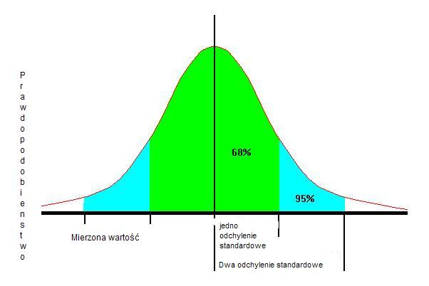

Ryzyko a efektywności zarządzania portfelem instrumentów finansowych
====================================================================

Ryzyko i niepewność
-------------------

Ceny instrumentów finansowych zmieniają się w czasie.  Zależne są, bowiem od wielu czynników. Bardzo rzadko się zdarza taki instrument i taka sytuacja na rynku, że wszystkie czynniki mające wpływ na cenę instrumentu są znane. A nawet gdyby założyć, ze znane są wszystkie czynniki, jakie mają wpływ na cenę instrumentu to nie wiadomo czy informacje te dotarły do wszystkich uczestników rynku. Gdyby nawet wszystkie informacje dotarły to i tak nie jest pewne jak zostałyby potraktowane przez innych inwestorów, czy i które uznaliby za ważne.  A ich decyzje inwestycyjne tworzą podaż i popyt na instrumenty, co głównie ma wpływ na cenę instrumentu.  Jeśli dotychczas wywód nie budzi sprzeciwów to zapewnie nie wzbudzi sprzeciwu następujące stwierdzenie: Na rynku nie ma pewności, co do przyszłej ceny instrumentu.

Popularnie mówi się, że „tylko rynek zna cenę”.  Cena rynkowa to cena ostatniej takiej samej transakcji. Ale i dzisiejsza cena aktywa nie gwarantuje znajomości jego jutrzejszej ceny. Nie gwarantuje przyszłej ceny. Stwierdzenie to wskazuje na duża pokorę doświadczonych uczestników rynków i potwierdza ich stan niepewności. Na pewno można się zgodzić, że istnieje stan niepewności i **niepewność istnieje obiektywnie.** 

Na rynku finansowym spotkać się można ze słowem ryzyko. Ze zdefiniowaniem tego terminu jest jeszcze większy kłopot. Filozofowie spierają się do dziś na ten temat [1]_. 
Ryzyko towarzyszy nam w każdym aspekcie życia a szczególnie w działalności gospodarczej. Intuicyjnie można przyjąć, że ryzyko to wymierna niepewność, co do osiągnięcia  zaplanowanego celu (prawdopodobieństwo niepowodzenia), odmiennego przebiegu zdarzeń, którego konsekwencje są negatywne, co do oczekiwań. Jak widać ryzyko wiąże się z niepewnością. Jednak odwrotne  stwierdzenie nie jest prawdziwe. Można mówić o niepewności lub odczuwać niepewność ale dopiero podjecie decyzji powoduje  istnienie ryzyka. Ryzyko wiąże się  zawsze  z oceną a najczęściej z oceną prawdopodobieństwa przebiegu procesu. Ocena prawdopodobieństwa, bowiem jest podstawą podjęcia decyzji. [2]_

W Pomarańczowej Księdze, wydanej przez Ministerstwo Skarbu Jej Królewskiej Mości, opracowaniu dotyczącym ryzyka i zarządzaniu nim, mówi się o nim, jako o minimalizowaniu jego ewentualnych negatywnych skutków. [3]_ Zawarta jest  tam definicja ryzyka, bardzo bliska intuicyjnemu jego rozumieniu. Ryzyko definiowane jest, jako taka właśnie niepewność wyniku działań lub zdarzeń, wynikająca z pojawiających się szans i zagrożeń. Ryzyko oceniane musi być w odniesieniu do kombinacji prawdopodobieństwa wystąpienia danego zdarzenia i jego oddziaływania w przypadku, jeśli rzeczywiście będzie mieć miejsce.
Zarządzanie ryzykiem obejmuje identyfikowanie i ocenę ryzyka.

Uczestnicy rynków finansowych traktują ryzyko, jako realną i istotną cześć ich działań  i nie starają się wgłębiać w dyskusje filozoficzne, ale raczej starają się ograniczać negatywne scenariusze ich wyborów poprzez działania nazywane  zarządzaniem ryzykiem. Nic dziwnego stosują wybieg zastosowany przez Markowitza w jego pracy doktorskiej> Markowitz nie definiując ryzyka, zaproponował stwierdzenie, które legło u podstaw myślenia o portfelu, inwestowaniu i ryzyku. *…”Inwestor bierze pod uwagę (lub powinien brać pod uwagę) oczekiwany zwrot na inwestycji, jako rzecz, która chce osiągnąć i wariancje tego zwrotu, jako rzecz niezamierzoną” …* [4]_. Markowitz zaproponował coś bardzo atrakcyjnego- miarę ryzyka, jako wariancje. Wariancje  uzyskiwanego przychodu, ceny instrumentu etc. Jest to bardzo użyteczne podejście, które też będzie podejściem używanym na dalszych kartach tego opracowania.

Pomiar wielkości, nawiązanie do doświadczeń własnych
~~~~~~~~~~~~~~~~~~~~~~~~~~~~~~~~~~~~~~~~~~~~~~~~~~~~

W miejscu tym należy wspomnieć o wiadomościach, które były niezwykle przydatne w wykonywaniu ćwiczeń na I pracowni fizycznej. A szczególności z tym, co wiązało się z analizą błędów  mierzonych wielkości. Jak wiadomo, każdy pomiar  wielkości jest związany z błędem, wiec zachodzi pytanie,  jaka jest prawdziwa wielkość?

Odpowiedz uzyskujemy poprzez wielokrotny pomiar wielkości  i analizę  otrzymanych wyników.

Jeśli :math:`r_i` to wynik kolejnego pomiaru jednego z n- pomiarów 

To wartość średnia  :math:`r_a` jest równa

.. math::

   r_a= \sum\limits_{i=1}^n\frac{r_i}{n}

Odchylenie standardowe to dla tego zbioru wyników  pomiarów (a właściwie jego kwadrat)

.. math::

   \sigma^2= \sum\limits_{i=1}^n\frac{(r_i-r_a)^2}{n}

Czyli

.. math::

   \sigma= \sqrt {\sum\limits_{i=1}^n\frac{(r_i-r_a)^2}{n}}

Przykład:

Prędkość chodziarza mierzona w km/ godz. wynosiła:
9.6, 9.8, 10, 9.9, 10.1, 9.8, 9.9, 9.7, 10, 10.2

Czyli wartość średnia :math:`v_a` = 9,9

Odchylenie standardowe :math:`\sigma` wynosi 0,18

Z obserwacji i pomiarów wynika, że realna wartość prędkości z 68% prawdopodobieństwem będzie znajdować się w przedziale od miedzy 9,72 a 10,08 a z 95%pewnością będzie znajdować się miedzy 9,54 a 10,2.
 
Błędy pomiarowe  tworzą  bardzo charakterystyczny kształt rozkładu. Wartości większe od wartości rzeczywistej i mniejsze od niej wystąpią z różnym prawdopodobieństwem tworząc pewien rozkład symetryczny wokół średniej nazwany „krzywą  dzwonową”. Taka typowa krzywa jest pokazana na rysunku obok.

*Krzywa dzwonowa*

Średnie odchylenie standardowe wyznacza obszar, w którym z 68% prawdopodobieństwem będzie można znaleźć wartość realna a zakresie 2 x :math:`\sigma` można znaleźć te wielkość z prawdopodobieństwem równym 95%.

Ryzyko a praktyka rynkowa
-------------------------

Ryzyko towarzyszy każdej działalności człowieka. Przeważnie  intuicyjnie wiązane jest ze stratą a raczej z jej możliwością wystąpienia. Ryzyko nie jest zjawiskiem absolutnie złym. Gdyby nie istniało, nie istniały by emocje rynków finansowych, instytucje ubezpieczeniowe nie miały by racji bytu, i powtarzając za  F. Knight’em [5]_, także przedsiębiorczość. Knight wykazał, że przedsiębiorcy mogą uzyskiwać dodatkowe korzyści tylko jeśli są akceptują ryzyko. Ryzyko bowiem, nie tylko wiąże się z możliwością strat, ale  jest także szansą na wyższe przychody dla tych, którzy je podejmują.

Jednak, mało kto uważa ryzyko za zjawisko korzystne. Ryzyko oznacza przecież niepewność efektów  działań, możliwość straty.

Czy można  je ograniczać, skoro nie można go wyeliminować?

Metodami ograniczania ryzyka są: unikanie ryzyka,transfer ryzyka do innego podmiotu, zmniejszanie prawdopodobieństwa ryzyka i zmniejszanie skutków ryzyka. 
Unikanie ryzyka niestety oznacza rezygnację z potencjalnych zysków. Inwestor, który by unikał wszelkiego ryzyka, trzymał by pieniądze w bezpiecznym sejfie a inflacja zmniejszałaby ich wartość. Transfer ryzyka kosztuje ale i  pozwala na zachowanie szans na zyski. Można ograniczać prawdopodobieństwo wystąpienia ryzyka poprzez posiadanie  wiedzy o rynku i  zachowaniu się instrumentów finansowych. Można  też starać się ograniczać rozmiar ewentualnej szkody (ubezpieczenie i zabezpieczenie). Takie działania też powodują powstanie dodatkowych kosztów. Ważnym jest by koszty te były mniejsze niż  efekt uzyskanego obniżenia prawdopodobnych strat.
 
**Natura ryzyka na rynkach finansowych.**

Ryzyko operacji na rynkach finansowych ma wiele postaci i wiele źródeł pochodzenia. 

Literatura fachowa podaje wiele ich klasyfikacji. Przykładowo zaproponowana przez Bank Rozrachunków Międzynarodowych (Bank for International Settlements – BIS) [6]_ definicja ryzyka wiąże je z  podejmowaniem decyzji finansowych, dotyczących sposobów finansowania działalności instytucji finansowej.

BIS zaproponował wyodrębnienie pięciu podstawowych pod kategorii ryzyka finansowego:

* ryzyko kredytowe – rozumiane jako ewentualność, ze Klient, druga strona transakcji  może nie wywiązać się z warunków umowy.
* ryzyko rynkowe – wiąże się  z możliwością zmiany cen instrumentów na  rynkach finansowych co w konsekwencji prowadzi do zmiany wyniku finansowego transakcji.
* ryzyko płynności –  a właściwie jej braku. Ryzyko to może dotyczyć instrumentu lub strony transakcji.  Ryzyko braku płynności instrumentu występuje  jeśli warunki rynkowe uniemożliwiają  dokonanie transakcji kupna/sprzedaży danego instrumentu (np. mała aktywność w tym segmencie rynku, brak notowań). Ryzyko braku płynności strony transakcji ( instytucji) występuje jeśli dana instytucja nie posiada w danym momencie środków płynnych na wywiązanie się z warunków umowy. 
* ryzyko operacyjne – to  zagrożenie możliwości  osiągnięcia zamierzonych celów w wyniku błędów funkcjonowania, usterek systemów informacyjnych, błędach pracowników, niewłaściwej kontroli wewnętrznej instytucji finansowej.
* ryzyko prawne – to ryzyko poniesienia straty z powodu niewłaściwej dokumentacji, złych zapisów w umowach, konfliktu interpretacji prawnych czy systemów prawnych.

Źródło definicji (Bank for International Settlement)  jest wiodącym źródłem dla zasad zarządzania ryzykiem obowiązujących banki. Banki operują głównie kapitałem  klientów wiec szczególna ostrożność prowadzenia operacji jest wymagana.  Bezpieczeństwo systemu bankowego i jego operacji zostało omówione w  rozdziale „Bezpieczeństwo systemu finansowego- Rynki Finansowe. Zarządzanie ryzykiem banki opierają na zasadach Nowej Umowy kapitałowej (Basel II). W kształtowaniu  zarządzania ryzykiem Bank BIS odgrywa wiodąca rolę.

Inwestor w swych operacjach na rynkach finansowych spotkać się może  z ryzykami  powodującymi  inne od zamierzonego efektami prowadzonych operacji inwestowania. Biorąc pod uwagę instrumenty finansowe to wiążące się z nimi ryzyk można pogrupować:

* Ryzyka związane ze zmiennością na rynkach finansowych

   * Ryzyko stopy procentowej– dotyczy inwestycji w instrumenty dłużne.  Jeśli, na rynku finansowym zmieniają sie stopy procentowe,  to taka zmiana powoduje to zmiany stóp dochodu z posiadanych instrumentów. Inne dochody powodują inną wycenę wartości instrumentów.Wzrost stopy procentowej powoduje spadek ceny instrumentu dłużnego, a spadek stopy procentowej wzrost ceny instrumentu.
   * Ryzyko  zmiany kursów walut – występuje, gdy instrument finansowy,  jest denominowany w innej walucie niż waluta rozliczania instrumentu. Zmiany kursu walutowego powodują to, że stopy zwrotu wyrażone w dwóch różnych walutach nie są takie same.
   * Ryzyko inflacji, – występuje wtedy, gdy inflacja zmienia siłę nabywczą dochodu z inwestycji.
   * Ryzyko rynku – to ryzyko zmiany ceny na rynkach finansowych. Ceny na rynkach finansowych zmieniają się pod wpływem wielu czynników  zarówno fundamentalnych ( czynniki gospodarcze) jak i emocji uczestników rynku.
   * Ryzyko  braku płynności  instrumentu – występuje w przypadku instrumentów finansowych na rynku o niewielkiej aktywności uczestników. A takich rynkach instrumenty stosunkowo trudno jest sprzedać po godziwej cenie.

* Ryzyka  wiążące się z zachowaniem  drugiej strony transakcji.

   * Ryzyko niedotrzymania warunków emisji instrumentu  (default risk) – występuje wtedy, gdy emitent instrumentu finansowego nie może dotrzymać warunków umowy emisji. Przykładowo -  nie wypłaca  odsetek(instrument dłużny). 
   * Ryzyko zarządzania– wynika błędów w  zarządzania spółką emitującą papiery wartościowe mających wpływ na uzyskiwane przez nią  wyniki finansowe , co w rezultacie przekłada się na  wartość instrumentu finansowego. Skrajną formą tego ryzyka jest ryzyko bankructwa emitenta.
   * Ryzyko finansowe– występuje  jeśli skutkiem błędów w zarządzaniu lub zmiany otoczenia rynkowego spółki jej lewarowanie długiem powoduje straty w wyniku finansowym.
   * Ryzyko braku płynności  emitenta- wiąże się z wystąpieniem braku  możliwości do wypełnienia zobowiązań finansowych emitenta w terminie.
   * Ryzyko biznesu– nazywane ryzykiem operacyjnym, wynika ze zmienności dochodów uzyskiwanych przez emitenta instrumentu finansowego skutkiem zmiany  otoczenia  rynkowego emitenta  lub błędów w zarządzaniu. 

* Ryzyka otoczenia rynków.

   * Ryzyko polityczne  – występuje wtedy, gdy rząd, parlament lub inne władze uchwalają regulacje prawne lub podejmuje decyzje dotyczące wpływające na sytuacje inwestorów, lub emitentów (np. decyzje dotyczące opodatkowania) lub . Ryzyko polityczne może występować w skali ponad państwowej ( konflikty polityczne, wojny).

Instrumenty finansowe. Ryzyko i jego miary
------------------------------------------

Inwestor podejmując decyzje inwestowania  kapitału (alokacji)  ocenia  poziom dochodu, jakiego może się spodziewać z danej inwestycji oraz ocenia wielkość ryzyka związanego z inwestycją. Stopa zwrotu z inwestycji jest podstawową miarą określającą wielkość dochodu przypadającego na każdą jednostkę zainwestowanego kapitału. Jest ona zdefiniowana jako:

.. math::

   R_i=\frac{P_i - P_0}{P_0}

gdzie:

:math:`R_i` – stopa zwrotu instrumentu finansowego w okresie i,
:math:`P_0` - wartość początkowa instrumentu finansowego (znana)
:math:`P_i` – wartość końcowa instrumentu finansowego (zmienna losowa).

Oczekiwana stopa zwrotu, która w tym przypadku pełni rolę średniej ważonej możliwych do osiągnięcia stóp zwrotu (wagami są prawdopodobieństwa zrealizowania tych stóp), może być liczona jako miara dochodu wyznaczona na podstawie rozkładu stopy zwrotu:

.. math::

   R= \sum\limits_{i=1}^n p_i r_i

gdzie:

:math:`R` – oczekiwana stopa zwrotu,

:math:`p_i` – prawdopodobieństwo uzyskania i-tej możliwej wartości stopy zwrotu,

:math:`r_i` – i-ta prawdopodobna do uzyskania wartość stopy zwrotu,

:math:`n` – ilość możliwych do uzyskania wartości stopy zwrotu.

Jeśli nie jest znany rozkład stóp zwrotu można posłużyć się przybliżeniem średniej arytmetycznej. Średnią arytmetyczną stóp zwrotu wyliczyć można w następujący sposób:

.. math::

   R=1/n \sum\limits_{i=1}^n\ r_i,

gdzie:

:math:`r_i` – stopa zwrotu instrumentu finansowego (aktywu) zrealizowanego w okresie i,
:math:`n` – liczba okresów z których pochodzą dane.

**Miary ryzyka - Odchylenie standardowe**

*Wariancja stopy zwrotu*.

Wariancje stopy zwrotu wylicza się jako:

:math:`S= \sum_{i=1}^n  p_i  (r_i - r)^2`

Ze wzoru wynika, że wariancja stopy zwrotu papieru wartościowego jest to średnia ważona z kwadratów odchyleń możliwych stóp zwrotu od oczekiwanej stopy zwrotu, gdzie wagami są prawdopodobieństwa wystąpienia możliwych stóp zwrotu. Wariancja jest liczbą dodatnią. 

Odchylenie standardowe.

Odchylenie standardowe stopy zwrotu inwestycji jest pierwiastkiem kwadratowym z wariancji stopy zwrotu i jest wyznaczane według następującego wzoru:

.. math::

   \sigma = \sqrt {S} = \sqrt{\sum_{i=1}^n  p_i  (r_i - r)^2},

gdzie:

:math:`S` - wariancja stopy zwrotu papieru wartościowego,

:math:`p_i` – prawdopodobieństwo osiągnięcia i-tej możliwej wartości stopu zwrotu,

:math:`r_i` - i-ta możliwa wartość stopy zwrotu,

:math:`r` – oczekiwana stopa zwrotu danego papieru wartościowego.

Odchylenie standardowe stopy zwrotu wskazuje, o ile przeciętnie odchylają się przeciętne możliwe stopy zwrotu od oczekiwanej stopy zwrotu. Im wyższe odchylenie standardowe, tym większe ryzyko związane z daną inwestycją
Odchylenie standardowe jest obliczane jako pierwiastek kwadratowy z wariancji i podawane jest w takich samych jednostkach jak badana cecha. Przyjmuje wartości dodatnie 
	
Odchylenie standardowe będzie równe 0, gdy wszystkie dane podlegające obserwacji będą jednakowe. W takiej sytuacji ryzyko nie będzie występowało. 
Przy odchyleniu standardowym można także wyznaczyć typowy obszar zmienności stopy zwrotu, który odnosi się do 68% wartości wszystkich jednostek badanej cechy mieszczącej się w tym przedziale. Czyli podobnie jak to ma miejsce w rachunku błędów,  stopa zwrotu w i-tym okresie  będzie się różnić od średniej stopy zwrotu o  (+/-) odchylenie standardowe z prawdopodobieństwem 68%, a z prawdopodobieństwem 95% będzie różnić się od średniej o (+/-)2 razy odchylenie standardowe.

Odchylenie standardowe jako miara ryzyka.

Ryzyko całkowite definiowane jest jako całkowita zmienność stóp zwrotu z danego waloru. Miarą ryzyka w tym ujęciu jest odchylenie standardowe (σ) oraz wariancja. Odchylenie standardowe stopy zwrotu obliczane jest według wzoru:

.. math::

   \sigma= \sqrt {\sigma^2} = \sqrt {\frac {\sum_{i=1}^n(r_i-E(r))^2}{n-1}}

gdzie: 
	
:math:`\sigma^2`– wariancja stopy zwrotu

:math:`r_i` – stopa zwrotu uzyskana w i-tym okresie

:math:`E(r)` - oczekiwana stopa zwrotu

:math:`n` - liczba okresów

Ryzyko całkowite (mierzone wariancją lub odchyleniem standardowym stopy zwrotu) składa się z dwóch części – ryzyka dywersyfikowalnego oraz niedywersyfikowalnego. Ryzyko dywersyfikowalne (też: niesystematyczne) to ta część ryzyka całkowitego, która jest charakterystyczna dla emitenta danego papieru wartościowego. Istnieje możliwość redukcji tego rodzaju ryzyka poprzez łączenie różnych walorów w zdywersyfikowany portfel. W przeciwieństwie do ryzyka dywersyfikowalnego, ryzyko specyficzne nie może zostać wyeliminowane.

Model (W.F.) Sharpe’a
~~~~~~~~~~~~~~~~~~~~~

Punktem wyjścia  rozważań przeprowadzonych przez  W.F. Sharpa była obserwacja dotycząca zachowania się   kursu akcji a zachowanie  się rynku. Nie można się  nie zgodzić z tym, że gdy rynki wzrastają  bardzo prawdopodobnym jest ,ze kurs  upatrzonej przez nas akcji też wzrasta. W czasie hossy  kursy akcji rosną. Oczywiście nie wszystkich akcji tak samo i niekoniecznie  wszystkie rosną,  jednak taka obserwacja  jest prawdziwa. Sharp założył, że  stopy zwrotu z akcji zależą od działania czynnika rynku.  Miarą tego czynnika może być indeks rynku giełdowego. (Takim indeksem może  być np. dla polskiego rynku akcji- np.WIG 20.)  Rzeczywiście   wzrostowi indeksu towarzyszy wzrost cen większości akcji, a spadkowi – spadek większości notowań. Sharp zaproponował swój model ceny akcji w którym powiązał stopę zwrotu z instrumentu(np. akcji), z zachowaniem się  indeksu. Zależność między stopą zwrotu z akcji a stopą zwrotu z rynku wyraża następujące równanie:

.. math::

   r_i=\alpha_i+\beta_ir_m+U_t

gdzie:

:math:`r_i` – stopa zwrotu z i-tej akcji,

:math:`r_m` – stopa zwrotu z rynku mierzona stopą zwrotu z indeksu giełdowego,
 
:math:`\alpha_i`, :math:`\beta_i` – parametry strukturalne równania,

:math:`U_t` – składnik losowy równania.

Współczynnik :math:`\beta`.

Parametr ten pozwalana porównanie  jak wybrany instrument zachowuje się w relacji do zachowania rynku. 
Gdy współczynnik ten równy 1,  wskazuje to na pełną,  dodatnia  korelację z rynkiem.
Instrument zachowuje się jak rynek.

Współczynnik :math:`\beta >1`   oznacza, instrument zachowuje się bardziej radykalnie niż rynek ( wzrasta szybciej i spada szybciej). Stopa zwrotu z takiego instrumenty jest  przypadku bardzo podatna na zmiany zachodzące na rynku. Tak zachowujące się instrumenty nazywa się agresywnymi. 

Współczynnik :math:`\beta > 0`, ale mniejszy od 1 oznacza, że stopa zwrotu z instrumentu jest w mało podatna na zmiany rynku. Takie instrumenty nazywa się defensywnymi.
 
Współczynnik :math:`\beta = 0` oznacza brak podatności na  zmiany  rynku.  Tak zachowuje się  instrument wolny od ryzyka np. obligacja skarbu Państwa.

Ujemne wartości współczynnika :math:`\beta` oznacza korelację negatywną.
 
Wartość współczynnika :math:`\beta` można wyznaczyć korzystając ze wzoru:
 
.. math::

   \beta= \tfrac{\sum_{i=1}^n (r_mt - r_m)(r_it-r_i)} {\sum_{i=1}^n  (r_mt-r_m)^2},

gdzie:

:math:`t` – okres na którego podstawie wyznacza się parametry równania,

:math:`r_i` i :math:`r_m`  - średnie stopy zwrotu, odpowiednio z akcji i rynku.

Stała alfa można wyliczyć przekształcając wzór do postaci:
 
.. math::

   \alpha= r_i - \beta_ir_m

Współczynnik

.. math::

   \beta

jest miara ryzyka  instrumentu związanego z ryzykiem rynku.

:math:`\beta`  *jako miara ryzyka systematycznego*.

Ryzyko systematyczne (niedywersyfikowalne) to ta część całkowitej zmienności stóp zwrotu, która spowodowana jest czynnikami jednocześnie wpływającymi na ceny wszystkich instrumentów. Źródłem tego rodzaju ryzyka są zmiany w gospodarczym, politycznym i społecznym otoczeniu rynków. Ze względu na systematyczny charakter tego typu zmian, nie można ich wyeliminować za pomocą dywersyfikacji. 
Miarą niedywersyfikowalnego ryzyka jest współczynnik beta portfela rynkowego. Inaczej możemy go zapisać:

.. math::

   \beta_i= \frac {cov(r_i ,r_m)}{var(r_m)},

gdzie:
		
:math:`\beta_i`  beta instrumentu

:math:`cov(r_i, r_m)` - kowariancja między stopą zwrotu z papieru  wartościowego a stopą zwrotu z portfela rynkowego

:math:`var(r_m)` - wariancja stopy zwrotu z portfela rynkowego.

Portfel instrumentów finansowych
--------------------------------

Do tego miejsca mówiąc o inwestycji mówiliśmy o inwestycji w instrument finansowy. Gdyby jednak inwestycje w kilka  instrumentów finansowych potraktować jako jedność  to mięlibyśmy do czynienia z portfelem. Nawet kierując się wyłącznie intuicja widać, ze gdyby posiadany kapitał zainwestować w kilka różnych instrumentów  a nie w kilka takich samych instrumentów to szansa na poniesienie straty jest mniejsza go można spodziewać się, że któryś z instrumentów przyniesie zysk jeśli nawet jakiś inny wygeneruje stratę. Jeśli mamy w portfelu jeden rodzaj instrumentu i on wygeneruje stratę, to jej wymiar jest równy wielokrotności posiadanego instrumentu.

Proces dobierania  instrumentów do portfela w celu zmniejszenia całkowitego ryzyka portfela  beż zmniejszania zwrotu tegoż portfela nazywa się dywersyfikacją.

Portfel w warunkach rynkowych: miary ryzyka, dywersyfikacja
~~~~~~~~~~~~~~~~~~~~~~~~~~~~~~~~~~~~~~~~~~~~~~~~~~~~~~~~~~~
 
Zwrot z portfela to średnia ważona zwrotów poszczególnych instrumentów wchodzących w skład portfela. Wagami w tym przypadku są ważone wartością udziały poszczególnych instrumentów w portfelu.

.. math::

   r_p= \sum\limits_{i=1}^n\theta _i r_i

Gdzie :

:math:`r_p` – zwrot z portfela

:math:`n` - liczba  instrumentów w portfelu

:math:`r_i` - zwrot na i-tym instrumencie

:math:`\theta _i` - wazony wartością udział w portfelu instrumentu.

Oczekiwany zwrot na portfelu jest do wyliczenia jako ważona kapitałem średnia  zwrotów z poszczególnych instrumentów

:math:`r_{ap}= \sum\limits_{i=1}^n\theta _i r_{ai}`,

gdzie :

:math:`r_{ap} = E(r_p)` - oczekiwany zwrot z portfela

:math:`r_{ai}= E(r_i)` - oczekiwany zwrot na i- tym instrumencie.

Wariancja zwrotu z portfela jest do wyliczenia używając dwu ostatnich wzorów:

:math:`\sigma_p^2=E(r_p-r_{ap})^2=E[\sum\limits_{i=1}^n\theta_i(r_i-r_{ap})]^2= \sum\limits_{i=1}^n\sum\limits_{j=1}^n\theta_i\theta_j\sigma_{ij}=\sum\limits_{i=1}^n \sum\limits_{j=1}^n\theta_i\theta_j\sigma_i\sigma_j\rho_{ij}`

Gdzie:

:math:`\sigma_p^2` = wariancja zwrotu na portfelu

:math:`\sigma_{ij}=\sigma_i^2=E(r_i-r_{ai})^2` = wariancja zwrotu na i-tym instrumencie

:math:`\sigma_i= \sqrt E(r_i-r_{ai})^2` = odchylenie standardowe zwrotu na i- tym instrumencie.

:math:`\sigma_{ij}=E(r_i-r_{ai})(r_j-r_{aj})` = kowariancja zwrotów instrument i-tego z j-tym.

:math:`\rho_{ij}=(definicja)=\frac {\sigma_{ij}}{\sigma_i\sigma_j}` = współczynnik korelacji zwrotów na i-tym i j-tym instrumencie.

Jak widać  zwrot na portfelu i jego ryzyko zależy od dwu grup czynników: zwrotów i ryzyk  poszczególnych instrumentów. O ile zwroty instrumentów zależne są od rynku i inwestor ma na nie ograniczony wpływ, to grupa ryzyk instrumentów  zależy od ryzyka poszczególnych instrumentów, do czego warto zastosować wszelkie wiadomości związane z natura ryzyka instrumentu finansowego zawarte w poprzednim rozdziale, ale 
pojawił się  nowy czynnik. Czynnikiem tym  jest dywersyfikacja, czyli dobór instrumentów do portfela. Ryzyko  portfela  bowiem wiąże  sią  z korelacjami  miedzy instrumentami.

Rozpatrzmy  trzy przykłady dywersyfikacji.

* **Dywersyfikacje gdy zwroty z instrumentów są w pełni skorelowane dodatnio.**

Dla uproszczenia rozważmy portfel składający się z dwu instrumentów i przy założeniu, że :math:`\rho_{ij}=1`. Innymi słowy zwroty z każdego z instrumentów  rośną lub maleją zawsze razem.
Oczekiwany zwrot z przykładowego portfela  jest niezmienny

.. math::

   r_{ap}=\theta_1r_{a1}+\theta_2r_{a2}

Wariancja  wyniesie

.. math::

   \sigma_p^2=\theta_1^2\sigma_1^2+\theta_2^2\sigma_2^2+2\theta_1\theta_2\sigma_1\sigma_2= (\sigma_1\theta_1+\theta_2\sigma_2)^2

Podczas gdy odchylenie standardowe wynosi

.. math::

   \sigma_p=\theta_1\sigma_1+\theta_2\sigma_2,

Jak widać z powyższych wzorów, gdy :math:`\rho_12=1` to  :math:`r_{ap}`  i :math:`\sigma_p` są liniowo zwiazane z sobą jak :math:`\theta_1` i :math:`\theta_2`.

Jak widać w takim przypadku nie występuje zmniejszenie ryzyka portfela .
Taka dywersyfikacja nie ma sensu ze względu na ryzyko.

* **Dywersyfikacja gdy zwroty z instrumentów są w pełni skorelowane ujemnie.**

Gdy :math:`\rho_{12}= -1`,   zwroty z instrumentów   zachowują się przeciwnie. Oczekiwany zwrot jest co prawda taki jak wyliczony poprzednio ale:

.. math::

   \sigma_p^2=\theta_1^2\sigma_1^2+\theta_2^2\sigma_2^2-2\theta_1\theta_2\sigma_1\sigma_2= (\sigma_1\theta_1-\theta_2\sigma_2)^2

a odchylenie standardowe 

.. math::

   \sigma_p=\theta_1\sigma_1-\theta_2\sigma_2 .

Co znaczy, że, biorąc pod uwagę :math:`\theta_1=(1-\theta_2)`,
to

.. math::

   \theta_1= \frac{\sigma_2}{\sigma_1+\sigma_2}

a

.. math::

   \theta_2= \frac{\sigma_1}{\sigma_1+\sigma_2}

A w takim przypadku portfel nie zawiera ryzyka  albo inaczej  jego ryzyko wynosi zero.

Czyli taka dywersyfikacja ma sens.

* **Dywersyfikacja gdy zwroty z instrumentów  są nieskorelowane.**

W praktyce  niezmiernie rzadko się zdarza by instrumenty w portfelu były w pełni skorelowane ujemnie . Jest to zasada zabezpieczenia się przed ryzykiem rynkowym w przypadku  używania  kontraktów  terminowych i opcji., ale w praktyce zarządzania portfeli inwestycji rynkowych np. funduszy inwestycyjnych czy portfeli dedykowanych (asset management) taka sytuacja występuje  bardzo rzadko.

Niemniej jednak, jeśli w portfelu znajduje się wiele instrumentów a ich dochody nie są z sobą w pełni dodatni skorelowane  to taka dywersyfikacja daje pozytywne wyniki. Jak dotąd  dla uproszczenia omawiane były portfele składające się  dwu instrumentów. Obecnie  korzyści z dywersyfikacji  poprzez budowę portfela składającego się z wielu nieskorelowanych instrumentów. Niech N instrumentów znajduje się w portfelu.

W tym przypadku odchylenie standardowe portfela wynosi:

.. math::

   \sigma_p=  \sqrt{ \theta_1^2\sigma_1^2+\theta_2^2\sigma_2^2+ \dots+\theta_N^2\sigma_N^2}

Jeśli każdy instrument ma równy udział w portfelu (tzn. :math:`\theta_i=1/N`) i taka sama wariancję (tzn. :math:`\sigma_i^2=\sigma^2`) to ostatnie równanie  uzyskuje postać:

.. math::

   \sigma_p^2=[(1/N)^2\sigma^2+ (1/N)^2\sigma^2+\dots+(1/N)^2\sigma^2]=[N(1/N)^2\sigma^2=(1/N)\sigma^2

Innymi słowy  gdy N wzrasta  odchylenie standardowe portfela  maleje.

Powyższa zasada jest myślą przewodnią funkcjonowania  firm ubezpieczeniowych, które biorą  coraz więcej do swych portfeli  nieskorelowanego ryzyka.

Portfel – poszukiwanie portfela efektywnego
~~~~~~~~~~~~~~~~~~~~~~~~~~~~~~~~~~~~~~~~~~~

Weźmy pod uwagę N instrumentów finansowych. Każdy z nich  charakteryzują  historyczne wartości  stóp zwrotu i odchylenia standardowego  jako miary ryzyka. Każdy można umiejscowić na wykresie zwrot / ryzyko. Można utworzyć dowolne kombinacje portfeli tych N instrumentów zmieniając ich udział w portfelu, czyli zmieniając wagi :math:`\theta_i` tak by ich suma zawsze była równa 1. Zbiór wszystkich możliwych portfeli nazywany jest zbiorem dopuszczalnym. Zbiór ten to dwuwymiarowy obszerna wykresie  zwrot/ryzyko a w jego wnętrzu będą zawarte wszystkie  możliwe portfele.
Szerszą dyskusje tego zagadnienia można znaleźć w [7]_.

Gdyby obszar o którym mówimy przeciąć linia pozioma dla danej stopy zwrotu to przebiegała by ona poprzez wszystkie portfele o tej samej stopie zwrotu ale o różnym ryzyku. Naturalnym jest, ze inwestorzy mając do dyspozycji ten sam zysk, a różne ryzyko, wybierać będą  portfele o mniejszym ryzyku.Gdyby obszar ten przeciąć  prostymi pionowymi  to przebiegać one będą przez portfele o tym samym ryzyku ale o różnym zwrocie na portfelu. Przy tym samym ryzyku inwestorzy wybiorą najprawdopodobniej portfele  o wyższym zwrocie. Jak widać z powyższego obszar górny tego zbioru portfeli będzie  interesował inwestorów  a szczególnie  portfele leżące na krzywej będącej górnym ograniczeniem zbioru.

Jednym ze sposobów  określania efektywnego zbioru dopuszczalnego jest  metoda Markowitza [8]_ [9]_. Podejście  Markowitza można streścić w następujący sposób. Mamy N akcji spółek w portfelu i znamy ich zwroty i odchylenia standardowe tychże zwrotów. Znane  są również  współczynniki korelacji zwrotów każdej pary instrumentów. Wagi – czyli udział w portfelu instrumentów, są poszukiwane, ale spełniają warunek, że sumują się do jedności. Dopuszczane są ujemne wartości wag czyli istnienie „krótkiej sprzedaży”. Problem polega na znalezieniu proporcji doboru instrumentów w portfelu by jego ryzyko było minimalne dla danego zwrotu z portfela. Zmieniając  poziom zwrotu portfela znaleźć można zbiór portfeli efektywnych. Za rozwiązanie tego problemu (wcale nie prostego matematycznie) Harry Markowitz został w 1991 roku uhonorowany nagroda Nobla.

Z metoda Markowitza wiąże się  pewien poważny problem . Problem ten to pytanie ile instrumentów wyznacza i opisuje właściwie rynek?. Przykładowo  ilość spółek notowanych na rynku podstawowym Giełdy Papierów Wartościowych w Warszawie wynosi 338 spółek [10]_ jeśli tak  to metoda Markowitza wymaga znajomości 114244 współczynników  kowariancji aby oszacować  odchylenie standardowe portfela rynku.  Pewien, prostszy model zaproponował Sharpe [11]_.

Zbiór dopuszczalny w przypadku istnienia  instrumentu o ryzyku =0
~~~~~~~~~~~~~~~~~~~~~~~~~~~~~~~~~~~~~~~~~~~~~~~~~~~~~~~~~~~~~~~~~

Jeśli taki instrument istnieje  można skonstruować portfel zawierający aktywa  ryzykowne i  aktywa bez ryzyka.

Dla uproszczenia przyjmijmy model portfela składającego się z dwu aktywów  , ryzykownego i bezpiecznego.

Zwrot z portfela  będzie równy:

.. math::

   r_{ap}=\theta_1r_{a1}+\theta_2r_f,

gdzie :

* jedynka oznacza odpowiednio średni zwrot z ryzykownego aktywa i  jego wagę, czyli udział w portfelu;
* :math:`r_f` = zwrot z bezpiecznego aktywa
* Suma wag daje jeden.

W tym przypadku  odchylenie standardowe portfela wynosi:

.. math::

   \sigma_p=\theta_1\sigma_1

Gdyż ryzyko aktywa bezpiecznego jest równe zero więc tyle samo równa się jego odchylenie standardowe.

Na wykresie zwrot/ryzyko  rozwiązania  tego układu równań  leża na prostej przechodzącej przez punkt C o zwrocie równym :math:`r_f` i ryzyku równym zero. Odpowiada to portfelowi zainwestowanemu tylko w aktywo bezpieczne. Kolejny punkt to punkt M gdy cały portfel stanowi  aktywo ryzykowne i który daje  zwrot ra1.  Na prostej tej leży tez punkt L, o zwrocie większym niż ra1. Ten punkt powstał  dla portfela w którym znajduje się  aktywo ryzykowne a waga aktywa  bezpiecznego jest ujemna co oznacza (krótka sprzedaż) ze za środki uzyskane za aktywo bezpieczne dokupiono do portfela aktywa ryzykowne, Innymi słowy, pożyczono przy stopie :math:`r_f` pieniądze na zakup aktywa ryzykownego i dołożono go  portfela. Czyli inwestor się zlewarował aby osiągnąć wyższy  zysk co oczywiście wiąże się ze zwiększeniem ryzyka.

Mając tak wyznaczony zbiór dopuszczalny możemy podobne obliczenia przeprowadzić dodając do  naszego portfela  kolejno wszystkie instrumenty (aktywa z rynku. Otrzymamy obszar dwuwymiarowy , tak jak to miało miejsce rozważaniach  dotyczących dopuszczalnego zbioru efektywnego. Do obszaru tego styczna jest prosta CML. Styczna ta jest styczna z góry zbioru.

Linie CLM nazywana jest „capital market line”. Linia ta to zbiór efektywny. Jej nachylenie wskazuje cenę  ryzyka.

Portfel rynkowy – ryzyko rynku
""""""""""""""""""""""""""""""

Obserwując  jakiś rynek akcji, np., akcji wycenianych na GPW w Warszawie można skonstruować  lub pokusić się o skonstruowanie portfela rynkowego . Portfel rynkowy to będzie portfel  składający się  z akcji obecnych na rynku a waga tych akcji w portfelu przyjęta zostaje jako udział tych akcji w całym rynku.

Czyli waga aktywa w portfelu rynkowym jest równa  rynkowej wartości akcji „i” w obrocie na rynku do całej kapitalizacji wszystkich akcji w obrocie.
 
Rynkowa cena ryzyka  będzie wiec  dla portfela rynkowego  równa nachyleni prostej CML.

Czyli:

.. math::

   C_r= (r_{am}- r_f)/ \sigma_m

Gdzie

* :math:`C_r` - cena rynkowa ryzyka
* :math:`r_f` - stopa wolna od ryzyka( zwrot na instrumencie bezpiecznym)
* :math:`r_{am}` - spodziewany zwrot na portfelu rynkowym
* :math:`\sigma_m` =odchylenie standardowe portfela rynkowego.

Jak wynika z równania cena rynkowa ryzyka jest równa  dodatkowemu  zwrotowi – premii, ponad stopę zwrotu aktywa bezpiecznego na jednostkę  ryzyka.

Dodając do portfela coraz więcej nieskorelowanych w pełni instrumentów wykazaliśmy, że skutkiem dywersyfikacji portfela jego ryzyko obniża się. Ryzyko maleje, ale nie do zera. Dodając wszystkie instrumenty z rynku do portfela  uzyskamy  taką wartość ryzyka portfela  poniżej, której  ryzyko już nie obniża się. Jest to ryzyko rynku. Rynek bowiem też podlega zmianom pod wpływem czynników zewnętrznych.
 
Czy można  zmniejszyć, i jak ryzyko „naszego” portfela poniżej ryzyka  rynku?.
 
Odpowiedz jest twierdząca (do pewnego  stopnia). Można zmniejszyć ryzyko poprzez proces dywersyfikacji na inne rynki.Ograniczanie polega na tym,ze jeśli  budujemy portfel z rynku globalnego to dalsza dywersyfikacja poprzez dywersyfikacje na inne rynki  jest raczej niemożliwa.

Podsumowując :

Ryzyko  portfela składa się z części dywersyfikowalnej i niedywersyfikowalnej. Czyli  ryzyku rynkowemu i ryzyku specyficznemu portfela.
Model Sharpa  pozwala  rozdzielić  ryzyko na składowe dywersyfikowalne i niedywersyfikowalne.

Ocena efektywności zarządzania  portfelem
-----------------------------------------

W praktyce spotykamy się z różnymi portfelami tworzonymi w sposób mniej świadomy (zarządzanie ah hoc  własnymi nadwyżkami pieniężnymi)po bardziej systematyczne budowy portfeli, do bardzo profesjonalnego zarządzania przez zawodowych zarządzających pracujących w firmach zarządzających aktywami. Każdy portfel, każdy fundusz inwestycyjny generuje  pewien zwrot. Nasuwa się naturalne pytanie  który z portfeli zarządzany jest lepiej od innych?

Słowo lepiej w przypadku zarządzania portfelami  jest bardzo nieprecyzyjne albowiem zarządzania i jego wynik to bardzo wiele aspektów. Nie wspominając o kosztach tego zarządzania  pojawiają się  pytania o ryzyko, może zwrot. Z reguły zwrot jest tym aspektem który budzi najwięcej emocji.  Ale nie tylko zwrot jest ważny.

Wiadomo, że wiąże się on z ryzykiem a na to  składa sie np. ryzyko instrumentów w portfelu.

Tutaj pojawia się pierwsza zasada. Nie można porównywać zwrotów z portfeli , skład których oparty jest na selekcji różnych klas aktywów.

Zwroty z portfeli akcyjnych będą inne niż z portfeli  obligacji czy instrumentów rynku pieniężnego.

Jest tez inne ryzyko takich portfeli. Ale jest dalsze pytanie czy w danej klasie portfeli, funduszy inwestycyjnych są lepiej i gorzej zarządzający ? Jeśli tak, to który z portfeli jest lepiej, efektywniej zarządzany?
 
Etapy postępowania przydatne w tworzeniu takich porównań  są przytoczone poniżej:

Zwrot z portfela
~~~~~~~~~~~~~~~~

Powszechnie stosowaną metodą wyznaczania stopy zwrotu z portfela jest obliczenie zależności :

.. math::

   R_p= \frac{PG+\Delta P_i}{P_o}

gdzie:

:math:`PG` – przychody gotówkowe (dywidendy lub dochody z odsetek) otrzymane w ciągu badanego okresu;

:math:`\Delta P_i` zmiana wartości portfela w t-tym okresie

:math:`P_o` – wartość rynkowa portfela na początku badanego okresu- liczona jako suma wartości instrumentów wchodzących w skład portfela  razy ich  ilość w portfelu.

Powyższa metoda obliczania stopy zwrotu sprawdza się jednak tylko w przypadku portfeli o charakterze statycznym, to jest takich, których środki przeznaczone na konstrukcję portfela nie zmieniają się w badanym przedziale czasu, dla którego wyliczana jest stopa zwrotu. Oznacza to, iż w analizowanym okresie do portfela nie dopływają żadne dodatkowe fundusze, ani też wcześniej zainwestowane środki nie są z niego wyprowadzane. Jednak jest to uproszczenie gdyż skład portfela i jego wartość będzie zmienia się czasie, do portfela  mogą napływać nowe środki.Są dwa sposoby oceny stopy zwrotu z portfela: to zwrot ważony czasem(średnia geometryczna) i zwrot ważony wartością- czyli zwrot ważony pieniędzmi. Najprostsza metoda, to metoda stopy zwrotu ważonej pieniędzmi.

**Stopa zwrotu ważona pieniędzmi.**

Stopa zwrotu ważona wartościami (money-weighted rate of return) stosuje się w przypadku portfeli o charakterze dynamicznym> Portfele dynamiczne to portfele w których środki przeznaczone na budowę portfela ulegają częstym zmianom w okresie, dla którego wyznaczana jest stopa zwrotu. Ta metoda, uwzględnia fakt, iż portfele odnotowują wpłaty i wypłaty środków pieniężnych za które zakupowane są instrumenty finansowe. Ta miara to nic innego jak wewnętrzną stopą zwrotu (internal rate of return) i wyznaczana jest z poniższego równania przy założeniu, że dywidendy i dochody z odsetek otrzymywane są na koniec okresu.

:math:`VP_o= \sum\limits_{i=1}^n\frac{D_i}{(1+r)^i} + \sum\limits_{i=1}^m\frac{W_i}{(1+r)^i}  +\frac{VP_in}{(1+r)^n}`,

gdzie:

:math:`r` – wartość ważonej wartościami stopy zwrotu;

:math:`VP_o` – wartość portfela na początku okresu;

:math:`VP_in` – wartość portfela na koniec okresu;

:math:`D_i` – wartość dokonanej w momencie t wpłaty nowych środków do portfela;

:math:`W_i` – wartość wycofanych z portfela środków w momencie i,

:math:`n` – liczba wpłat dokonanych w danym okresie;

:math:`m` - liczba wypłat dokonanych w danym okresie.

Aspekt ryzyka.

Ocena wyniku portfela zasadniczo polega na porównaniu stopy zwrotu z określonego portfela ze stopą zwrotu z jednego lub kilku innych portfeli. Istotne jest jednak, aby analizowane portfele były faktycznie porównywalne. Oznacza to przede wszystkim, iż powinny się one cechować zbliżonym poziomem ryzyka. Jeśli  mamy do porównania kilka podobnych portfeli( funduszy) dobrym  wskaźnikiem jest :math:`\beta`. Jeśli mamy dostępny tylko analizowany portfel to bierzemy pod uwagę  odchylenie standardowe i jego zmianę w czasie czyli zmienność stopy zwroty.

 
W przypadku portfela obligacji dobra miara jest  średni czas do zapadalności (duration).

Benchmark  jako odnośnik.

Zarządzający budują swoje portfele tak by osiągać najlepsze wyniki zarządzania. Czy wybór instrumentów (wybory – bo jest to proces trwający w czasie) jest właściwy  można ocenić porównując analizowany portfel do rynku. Określenie rynku jest często trudne i pomocnym jest odwołanie się do benchmarku.

Benchmark to zdefiniowany jednoznacznie portfel do którego wyników porównywać należy wyniki  analizowanego portfela. Benchmark powinien być podany na początku zarządzania portfelem i być w jego trakcie niezmiennym. Powinien  być wyceniany  niezależnie od zarządzającego i wyniki wyceny powinny być  łatwo dostępne.

Porównując wyniki benchmarku i analizowanego portfela możemy się przekonać czy portfel jest dobrze zarządzany. Bardzo często  benchmark nie daje się osiągnąć gdyż z reguły portfele benchmarkowe liczone są bez kosztów transakcji. Dobranie właściwego benchmarku jest  nietrywialne.

Miary efektywności zarządzania
------------------------------

Powyżej zostało wykazane, że nie jest możliwa prawidłowa ocena efektywności zarządzania portfelem na podstawie samej tylko stopy zwrotu w sytuacji, gdy porównujemy portfele o różnych poziomach ryzyka. Interpretując wyniki powszechnie publikowanych rankingów konstruowanych tylko według wartości stóp zwrotu, należy zachować szczególną ostrożność. Należy bowiem pamiętać i o ryzyku i o tym, ze skład portfela może ulęgać zmianom w czasie. Zarządzający portfelem  bowiem może świadomie wpływać na poziom ryzyka. Zarządzający portfelami często starają się  odgadywać zmiany na rynku i odpowiednio dopasowywać skład  portfela. Przy strategii aktywnej alokacji sposobem zarządzania jest sprzedaż akcji i zakup obligacji, gdy oczekiwana jest dekoniunktura, oraz sprzedaż papierów dłużnych i zakup akcji kiedy spodziewana jest hossa. Innym sposobem zachowania zarządzającego  jest modyfikowanie średniego współczynnika beta portfela w sytuacji gdy oczekuje się zmian na rynku. Modyfikowania bety polega na wymianie akcji w portfelu. W przypadku spodziewanego wzrostu cen , zarządzający zwiększa średnią betę portfela, co przyczynia się do tego, że portfel staje się bardzie wrażliwy na zmiany rynkowe. W sytuacji odwrotnej, zarządzający obniża współczynnik beta. Powoduje to, że portfel jest mniej czuły na zmiany rynkowe. Zmiany mogą również występować w wyniku oczekiwanych zmian rynkowych wartości poszczególnych aktywów i sprzedawania  tych o tendencji spadkowej a kupowanie tych których ceny powinny wzrosnąć.
	
W praktyce wykorzystuje się trzy miary efektywności zarządzania portfelem. Nazwy tych miar pochodzą od nazwisk ich twórców – miary te to wskaźniki: Jensena, Treynora i Sharpe’a. 
Wskaźnik efektywności Sharpe’a opiera się   na idei linii rynku kapitałowego (Capital Market Line, CML) i ryzyku ogólnym.  Wskaźniki Jensena i Treynora opierają się na modelu Capital Asset Pricing Model . Maja  generalnie  szersze zastosowania: zarówno do oceny pojedynczych aktywów, jak i całych portfeli. 

Miara Sharpa

Wskaźnik Sharpe’a [12]_ za podstawę porównań wykorzystuje linię rynku kapitałowego CML.  Mierzy dodatkowy zwrot w stosunku do dodatkowego ryzyka. Jego wartość obliczamy dzieląc premię za ryzyko związaną z danym portfelem przez odchylenie standardowe stopy zwrotu z tego portfela. Wskaźnik ten można przedstawić za pomocą poniższego wzoru:

.. math::

   S=( r_p- r_f)/ \sigma_m

gdzie:

* :math:`S` – wskaźnik efektywności Sharpe’a
* :math:`r_p` – stopa zwrotu z portfela
* :math:`r_f` – stopa zwrotu wolna od ryzyka
* :math:`\sigma_m` – odchylenie standardowe stopy zwrotu z portfela

Ogólna zasada ewaluacji portfeli według kryterium miary Sharpe’a jest następująca: im wyższa jest wartość miernika, tym wyższa jakość zarządzania portfelem. Aby poprawnie ocenić efektywność i umiejętności menedżerów zarządzających analizowanymi portfelami, należy porównać wartość wskaźnika Sharpe’a danego portfela z benchmarkiem najlepiej odwzorowującego portfel rynkowy. Jeżeli wskaźnik funduszu jest większy niż dla indeksu, wówczas oznacza to, iż zarządzający tym porfelem posiadają ponadprzeciętne umiejętności, gdyż zdołali osiągnąć lepsze wyniki niż rynek. W odwrotnym przypadku – zarządzajacy portfelami o  niższej niż dla rynku wartości współczynnika Sharpe’a zarządzają gorzej, ponieważ w danym okresie osiągnęli wyniki gorsze od przeciętnych dla rynku. 

Wskażnik Treynora

Wskaźnik ten jest równy premii za ryzyko( nadwyżki stopy zwrotu) przypadającej na jednostkę podjętego ryzyka rynkowego, mierzonego współczynnikiem beta.
Tym różni się on od miary Sharpe’a, która uwzględnia ryzyko całkowite inwestycji(zarówno rynkowe, jak i specyficzne, charakterystyczne dla danego portfela).

Wskaźnik Treynora [13]_ dany jest wzorem:

.. math::

   T=(r_p-r_f)/\beta_p

gdzie:

* :math:`\beta _p` – miara ryzyka systematycznego portfela
* :math:`r_p, r_f` – jak wyżej

Podobnie jak w przypadku wskaźnika Sharpe’a, wskaźnik efektywności Treynora należy odnieść do benchmarku. Im wyższa jest wartość tego miernika, tym wyższa jest jakość zarządzania portfelem.

Wskaźnik Jensena (zwany też wskaźnikiem alfa Jensena)

Inną miarą  oceny efektywności zarządzania portfelem jest wskaźnik Jensena [14]_. Wskaźni ten wydaje sie byc najczesciej stosoana miara  jakości zarządzania stosowaną przez środowisko akademickie.
Powstała na bazie modelu CAPM  i oceny portfela teoretycznego i analizowanego.

Wskaźnik wylicza się z równania:

.. math::

   J = (r_p-r_f) + \beta_p(r_m-r_f)

gdzie: 
	
* :math:`r_m` – średnia stopa zwrotu z portfela rynkowego
* inne oznaczenia jak wyżej.

Jeżeli wartość miary Jensena jest większa od zera, portfel możemy uznać za efektywny. Z kolei jeżeli wartość wskaźnika jest mniejsza od zera, jest to znak, że portfel nie jest  zarządzany efektywnie. 

Można zauważyć, że im wyższa wartość wskaźnika Jensena tym portfel mniej zależy od zmian rynku. Dodatnia wartość tej miary oznacza, że portfel może wykazywać stopę zwrotu wyższą niż oczekiwana przy jego ryzyku. Przy dodatniej alfie Jensena należy sadzić, że zarządzający portfelem posiada duże umiejętności selekcji akcji niedowartościowanych, za nisko wycenionych przez rynek, których zwrot przewyższa zwrot szacowany na podstawie modelu CAPM. Wszakże wartość wskaźnika Jensena funduszu może być również ujemna. Wówczas oznacza to, iż portfel jest gorszy od portfela rynkowego.

Czy te trzy wskaźniki wystarczą? Krytyka R. Roll'a i nie tylko jego
~~~~~~~~~~~~~~~~~~~~~~~~~~~~~~~~~~~~~~~~~~~~~~~~~~~~~~~~~~~~~~~~~~~

Jeśliby użyć  w/w wskaźników  do oceny  jakości zarządzania to zawsze pozostaje pytanie  jakie są źródła uzyskiwanego zwrotu. Sposobem odpowiedzi na to pytanie jest sposób analizy zaproponowany przez E.Fama [15]_ …. Sposób zaproponowany przez E.Famę opiera się na wyodrębnieniu czynników, które składają się na całkowitą rentowność portfela.  Na rentowność portfela składają się m.in. składowe związane z zwrotem na instrumencie bezpiecznym, zwrot związany z wyborem rynku (i jego ryzyka) zwrot związany z ryzykiem dywersyfikacji i zwrot związany z ryzykiem selekcji aktywów do portfela. Metoda ta pozwala pełniej zanalizować  proces zarządzania portfelem niż metody oparte na wskaźnikach omówionych powyżej
 
Agencje  oceniające wyniki zarządzania podają  szereg wskaźników  charakteryzujących zarządzanie portfelem. Szczególnie portfele otwartych funduszy inwestycyjnych są  analizowane pod wieloma kątami i cyklicznie te wyniki są publikowane i stają się podstawą powstania różnych rankingów.  Agencje te oprócz wskaźników Sharpe’a, Treynora i Jensena podają szereg innych wskaźników które charakteryzują  jakość zarządzania. Pozycje portfeli (funduszy) w rankingach według rożnych wskaźników  są różne , czego należy się spodziewać bo wskaźniki  dotyczą odmiennych aspektów zarządzania.

Dodatkowo należy pamiętać, ze wskaźniki te są oparte na modelach rynku  a nie na rynku i są pewnym  jego przybliżeniem. Na ten aspekt zwrócił uwagę  R,Roll w swej krytyce [16]_ przyjmowania uproszczeń w praktyce analiz. Punktem wyjścia  krytyki  R.Rolla jest stwierdzenie upraszczającej  praktyki  definiowania  portfela rynkowego. Z reguły praktycy przyjmują  portfel  rynku instrumentów wchodzących w skład  benchmarku, czasem rozszerzają go na rynek instrumentów  obecnych na rynku finansowym danego kraju ( np. rynku akcji z giełdy) etc.
Jednakże portfel rynkowy powinien zawierać wszystkie aktywa, te rynkowe i te nierynkowe (chociaż trudno je parametryzować i mierzyć  i nie ma danych na ich tematy). Te inne aktywa to przykładowo nieruchomości , dzieła sztuki, kapitał ludzki  itd. Ponieważ te aktywa nie są włączane do portfela rynkowego to nie możemy obserwować portfela rynkowego w praktyce. Jeśli  tak istotny element  teorii CAPM nie jest jednoznacznie określony to czy można   stosować ją   jako kryterium oceny?

Intuicja podpowiada, ze tak, ale należy rozumieć niedoskonałości modelu. W końcu model to jest uproszczenie ale pytania o słuszność pozostają.

Pomiar jakości zarządzania  nie osiągnął jeszcze takiego  standardu jak inne obszary naukowe finansów. Dlatego też wnioski wynikające z tego typu analiz nie są jeszcze wystarczająco dojrzałe by je bezdyskusyjnie stosować w aplikacjach praktycznych. Niemniej jednak wniosły duża dozę zdrowego rozsądku poszerzając i upowszechniając  ważność idei jakości zarządzania jako ważnego elementu dobrobytu w przyszłości (future welfare) [17]_.

Powracając do  różnych ratingów i porównań zarządzania portfelem oraz wielości publikowanych wskaźników należy zadać sobie pytanie dla kogo są te publikowane porównania? Kto i w jakim celu korzysta z tych porównań?

Nie licząc prasy fachowej i efektów pracy dziennikarzy analizujących kto w danej chwili prowadzi w rankingach i czym to jest najprawdopodobniej spowodowane, to te zbiory wskaźników  służyć mają klientom  firm zarządzających aktywami w celu dobrania dla siebie najlepszego zarządzającego. Perspektywa klienta mającego powierzyć posiadane środki  do zarządzania jest tą właśnie oczekiwana  perspektywą. Wielość i różnorodność klientów i ich profile ryzyka powodują, że tak wiele parametrów może być tymże klientom potrzebne.

W tym miejscu można wskazac na pewne prawidłowości jakie łatwo zauwazyc analizujac raporty oceniajace zarzadzanie portfelem.

Pierwsze co rzuca sie w oczy to to , że te wszystkie wskaźniki dotyczą  miar efektywności zarządzania w przeszłości. Czy są właściwym doradcą  na przyszłość? Jest to podstawowa kwestia analizy rynków finansowych. Czy przeszłe wyniki są pewnym prognostykiem przyszłości? Biorąc pod uwagę treści  ostrzeżeń wymagane przez KNF przy ogłaszaniu wszelkich informacjach rynkowych, wydaję się  wyniki z przeszłości nie mogą być podstawą wyników przyszłych. Rozsądek nakazuje pamiętać o tym ostrzeżeniu. Ale tenże sam rozsądek  podpowiada, że jedynie wyniki przeszłości są znane i nie ma  obecnie żadnego sposobu aby móc  znać i oceniać przyszłe wyniki.
Szeroko i powszechnie stosowany współczynnik Sharpe’a  nie wydaje się być ani warunkiem koniecznym  ani wystarczającym dla wyboru z perspektywy  klienta. Z punktu widzenia klienta byłaby istotną miara uwzględniająca jego profil ryzyka.
Analizując  wskaźniki należy zauważyć  zmienność pozycji zajmowanych przez z  zarządzających  w rankingach w, a szczególnie zmienność w czasie. Analizy wskazują, że najlepsi zarządzający w czasie  wzrostów to zazwyczaj nie ci sami  co najlepsi w czasie spadków.

Jeśli porównania jakości zarządzania robione są okresowo, można  zauważyć, że najlepsi zarządzający w danym okresie  nie pokrywają sie z najlepszymi zarządzającymi w kolejnym okresie. Potwierdza to słuszność stwierdzenia, że  wyniki uzyskane w przeszłości nie są gwarancją przyszłych wyników. Przeszła jakość zarządzania jest warta by wziąć ja pod uwagę ale nie może być jedynym kryterium wyboru. Bardzo często mniej namacalne czynniki jakościowe składają się na wyniki zarządzania. Na te czynniki składają się:

* proces inwestycyjny, styl zarządzania i jego konsystencja usuwająca przypadek.
* umiejętności i wiedza zarządzających, ich doświadczenie, staż i zróżnicowanie zespołu.
* dostęp do analiz rynkowych, umiejętności analiz i właściwej oceny i wyciągania wniosków.

Te czynniki wpływają znacząco  na jakość  funkcjonowania firm zarządzających i powodują różnice w osiąganych wynikach odróżniając  najlepszych od  pozostałych.

----------

.. [1] Sprawa definicji jest niezwykle ciekawa a zainteresowanym poleca się artykuł Glyn A. Holton  „Defining Risk” opublikowany w rozdziale Perspectives - Financial Analyst Journal-Vol.60nr.6.2004rok.
.. [2] Oczywiście niepodjęcie decyzji działania  jest również decyzją.  Jak widać, filozoficznie problem jest bardzo złożony.
.. [3] Pomarańczowa księga Zarządzania ryzykiem  Ministerstwo Skarbu JKM GB–Październik 2004 www.hm-treasury.gov.uk
.. [4] Nie tylko to stwierdzenie znajduje się w pracy doktorskiej  H.Markowitza, ale ponieważ trudny jest dostęp do pracy doktorskiej przyszłego noblisty polecamy, co jest łatwiej dostępne, : H.Markowitz- Portfolio selection - Journal of Finance_Vol & nr.1_Marzec 1952 r.
.. [5] Frank Knight - „Risk, Uncertainty and Profit” New York 1921-  Hart, Scaffner&Marx
.. [6] http://www.bis.org.
.. [7] http://home.agh.edu.pl/~dzieza/fixed_income/tp_not_agh.pdf
.. [8] H.Markowitz(1959 Portfolio Selection; Efficient Diversification of Investments, John Wiley)
.. [9] z wielu opracowań a ten temat można polecić przykładowo  dostępną w Internecie  publikacje  autorstwa Jerzego Dzieży - http://home.agh.edu.pl/~dzieza/fixed_income/tp_not_agh.pdf
.. [10] stan na kwiecień 2010 roku, dane  statystyczne GPW; http://www.gpw.pl/gpw.asp?cel=informacje_gieldowe&k=1&i=/statystyki/opis_statystyka&sky=1&nagnaz=Informacje%20i%20statystyki
.. [11] W.F.Sharpe(1985)"Investments" , wyd. Prentice- Hall, Englewood Cliffs, NJ
.. [12] W.F.Sharpe(1985)"Investments" , wyd. Prentice- Hall, Englewood Cliffs, NJ
.. [13] \J. Treynor"How to rate managemnet of investments funds" Harvard Business reviewJanuary 1965
.. [14] Risk, the Pricing of Capital Asset andthe Evaluation of investments portfolios"Journal of Business(1969, April)
.. [15] E.Fama "Components of Investment performance - Journal of Finance, June 1972
.. [16] R.Roll. „A critique  Of Asset Pricing Theory’s Tests”- Journal of Financial Economics -March 1977
.. [17] S.Duchateau- Performance measurements of mutual funds. Some methodolical remarks and pitfalls- Annual FEFSI  Conference - Bruksela  2001 rok.

