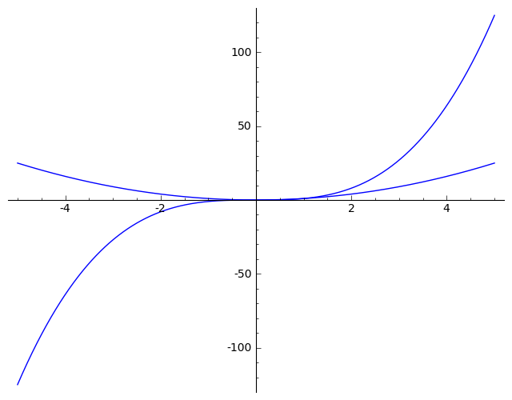

.. -*- coding: utf-8 -*-

Title (Heading 1)
=================

Lorem ipsum dolor sit amet, consectetur adipiscing elit. Donec ac dolor felis, vel semper lacus. Nunc nec tincidunt est. Praesent consectetur, ante vitae commodo imperdiet, magna neque laoreet metus, dignissim eleifend urna enim et quam.  *Praesent ac tincidunt erat.*  Nunc id enim eget urna sagittis adipiscing quis ut ligula. Aenean feugiat posuere suscipit :math:`\hbar=1`.

:math:`i\frac{\partial}{\partial t}\psi(x,t) = H(x,t)\psi(x,t)`

Ut vitae neque eros. Ut sit amet laoreet sapien. Maecenas bibendum, massa porttitor aliquet accumsan, massa neque egestas erat, sed pulvinar diam nulla et elit. Duis a semper dolor. Morbi vel mi ante, nec mollis magna. Nunc lacinia, metus at laoreet rutrum, tellus lorem feugiat eros, eget pharetra purus eros ut odio. Vestibulum ante ipsum primis in faucibus orci luctus et ultrices posuere cubilia Curae;  **Suspendisse nulla eros, consequat et sodales et, aliquam vel metus.**  Aenean sed lorem sapien, vitae malesuada est. Phasellus pulvinar dui eu nulla tincidunt et ultrices elit tincidunt.

Section (Heading 2)
------------------- 

Nunc a nisl arcu, a hendrerit erat. Praesent purus libero, auctor a aliquet nec, vehicula a dui. In eros nunc, elementum eu viverra quis, scelerisque ac purus. Donec dignissim interdum metus eu tristique. Nulla vitae mi risus. Suspendisse eu enim diam. Suspendisse libero eros, convallis at congue sit amet, bibendum et ligula :math:`\sin(x)`.

.. code-block:: python

    sage: p1 = plot(x^3, x, -5, 5)
    sage: p2 = plot(x^2, x, -5, 5)
    sage: p1+p2

.. end of output

Sub\-section (Heading 3)
~~~~~~~~~~~~~~~~~~~~~~~~

Aliquam erat volutpat. Vivamus turpis elit, facilisis at elementum sit amet, ultrices ut purus. Proin et orci sem, quis aliquet dui. Quisque in venenatis lorem. Curabitur egestas pellentesque neque. Morbi sagittis pharetra orci sed consectetur. Aliquam eget vulputate neque.

:math:`e^{-iHt} \approx \frac{1-\frac{i\Delta t}{2}H(x,t)}{1+\frac{i\Delta t}{2}H(x,t)}`

Suspendisse libero eros, convallis at congue sit amet, bibendum et ligula.

.. sagecellserver::
    :is_verbatim: True

    sage: def add(a, b):
    ...       return a + b
    ...       
    sage: add(1, 3)
    4

.. end of output

.. sagecellserver::
    :is_verbatim: True

    sage: show(add(1, 3))

.. MATH::

    4

.. end of output

.. sagecellserver::

    sage: (lambda a, b: a + b)(1, 3)
    4

.. end of output

Section (Heading 2)
------------------- 

.. sagecellserver::
    :is_verbatim: False

    sage: A = matrix([[1,1],[-1,1]])
    sage: D = [vector([0,0]), vector([1,0])]
    sage: @interact
    sage: def f(A = matrix([[1,1],[-1,1]]), D = '[[0,0],[1,0]]', k=(3..17)):
    ...       print "Det = ", A.det()
    ...       D = matrix(eval(D)).rows()
    ...       def Dn(k):
    ...           ans = []
    ...           for d in Tuples(D, k):
    ...               s = sum(A^n*d[n] for n in range(k))
    ...               ans.append(s)
    ...           return ans
    ...       G = points([v.list() for v in Dn(k)],size=50)
    ...       show(G, frame=True, axes=False)

.. end of output

- Ut suscipit eros ut est facilisis sodales. 

- Morbi vestibulum lectus vitae ante rutrum auctor.   

  - tttt

  - eee
 

- Proin vel ligula et ligula iaculis semper et non nisl. 

#. Proin vel ligula et ligula iaculis semper et non nisl. 

#. Ut fringilla congue tortor, vel dictum ante iaculis in. 

#. Integer auctor lorem convallis turpis luctus vehicula ullamcorper dolor suscipit. 

Neque porro quisquam est qui dolorem ipsum quia dolor sit amet, consectetur, adipisci velit...

.. sagecellserver::

    sage: class Test(object):
    ...       
    ...       def __init__(self, name):
    ...           self.name = name
    ...           
    ...       def print_message(self):
    ...           return self.name + " !"
    ...           
    ...           
    sage: test = Test("test")
    sage: test.print_message()
    'test !'

.. end of output

Some test table...  `LINK <http://icse.us.edu.pl>`_

.. sagecellserver::

    sage: html.table([(i, j, i == j) for i in [0..1] for j in [0..1]])

.. end of output

Other test table

.. MATH::

     	\left[ \begin{array}{c}
			2 x_1\\x_1
		\end{array} \right] +
	\left[ \begin{array}{c}
			-x_2 \\x_2
		\end{array} \right] =
	\left[ \begin{array}{c}
			1 \\5
		\end{array} \right], 

.. MATH::

	\begin{cases}
	2 \, x_{1} - x_{2} = 1\\  x_{1} + x_{2} = 5
	\end{cases}

