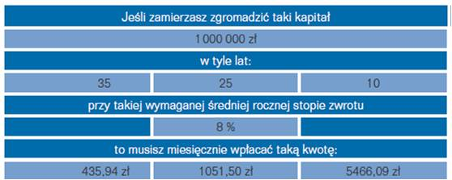
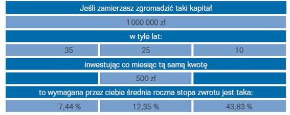
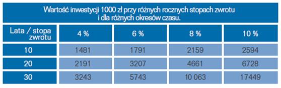

Finanse osobiste
================

Lektura poprzednich rozdziałów wprowadziła czytelnika w funkcjonowanie rynków finansowych, wyzwania starzenia się pokoleń i istotności oszczędności gospodarstw domowych. Powinienem wiedzieć o tym, że oszczędzanie jest ważne i że system emerytalny pozwala na gromadzenie środków na emeryturę indywidualnie. System solidarności pokoleń, na którym była oparta przez ostatnie 100 lat idea otrzymywania emerytury, stał się niewydolny poprzez zmiany demograficzne. Teraz samemu trzeba sobie zapewnić emeryturę. Informacje o tym są zawarte w niniejszym opracowaniu. 
Ale co z tego wszystkiego wynika dla czytającego. Ale nie dla jego wiedzy, ale dla niego samego w codziennym życiu??

Teraz nastąpi kilka bardzo praktycznych rad, – czyli jak dla siebie wykorzystać to, co dotychczas przeczytałeś?

 
Czy sprawa odległej w czasie emerytury jest ważna i pilna??

Tak, jest i ważna i pilna. Ale mimo jej ważności jeszcze niewłaściwie  rozumiana i oceniana.

Ten rozdział można czytać nie czytając poprzednich rozdziałów.

**Twoja (tak!!!) Twoja emerytura!**
 
To bardzo przyjemnie móc kupić sobie, za zaoszczędzone pieniądze, coś atrakcyjnego np. nowy telewizor albo samochód. Znasz pewnie uczucie dumy pojawiające się, gdy uda Ci się coś kupić za gotówkę bez konieczności zaciągania drogiego kredytu.

Jednak pewnie nie spodziewasz się, że **najdroższa rzecz**, jaką kupisz sobie w przeciągu całego swojego **życia** to... **Twoja emerytura**.

Postrzeganie emerytury w charakterze takiego samego towaru jak samochód, czy telewizor może wydać Ci się nieco dziwne. Ale nie ma powodu, by patrzeć na nią inaczej.

A koszty tych przyszłych lat są coraz wyższe z dwóch powodów:

Pierwszy - żyjemy dłużej po zakończeniu pracy zawodowej. Wiele osób spędzi 15, 20 a nawet więcej lat na emeryturze.

Drugi powód - współcześni ludzie są bardzo aktywni. Wiele z planów, których nie możemy zrealizować z powodu dynamicznego życia zawodowego zrealizujemy później, czyli... na emeryturze.

Na naszych barkach spoczywa coraz większy ciężar kosztów emerytury. Świadczenia płacone przez Państwo, czy też w ramach samych Funduszy Emerytalnych, nie wydają się być atrakcyjne i większość z nas ma większe oczekiwania.

Niestety, również większość naszych rodaków nie zastanawia się nad emeryturą i pojawia się ona w ich życiu, jako coś naturalnego, coś, co wzięło się z ich pracy i w gromadzeniu, czego aktywnie nie uczestniczyli. Ponadto wiele osób nie wie, w co i jak inwestować. Nie myślimy o emeryturze łudząc się, że tzw. „renta" pokryje wszystkie nasze potrzeby. Jak pokazuje życie - tak nie jest. W dużo lepszej sytuacji są ludzie, którzy mogą liczyć na wspomnianą rentę powiększoną o własne oszczędności, a raczej inwestycje (tzw. II i III filar).

Krótko mówiąc - zabezpieczenie sobie takiej emerytury, jakiej sobie życzysz, zależy tylko od Ciebie. Tę sprawę musisz osobiście wziąć w swoje ręce. To przecież Ty jesteś budowniczym swojej przyszłości finansowej.

Może to brzmieć, jak przedsięwzięcie z góry skazane na niepowodzenie. Praktycznie żyjemy od wypłaty do wypłaty ledwo wiążąc koniec z końcem. Mamy o wiele za dużo naglących potrzeb bieżących ważniejszych od kupowania czegoś, co jest tak odległe w czasie.

Odsuwamy od siebie ten problem. Aż do momentu, kiedy jest już za późno, bo... jesteśmy już na emeryturze.

Ale nawet tuż przed emeryturą możemy zacząć oszczędzać. Zawsze jesteśmy w stanie zacząć „kupować" sobie emeryturę taką, na jaką nas stać, albo inaczej:, jaką chcemy i jaką jesteśmy sobie w stanie zapewnić. Wszystko jedno, czy masz 20 czy 58 lat zawsze możesz podjąć odpowiednie kroki w celu zapewnienia sobie lepszej, bezpieczniejszej przyszłości.

Celem tego rozdziału jest pokazanie właściwego narzędzia, które sprawi, że bezpieczna emerytura stanie się rzeczywistością.
Narzędziem tym jest planowanie finansowe. Wyjaśni Ci ono, jak najlepiej można osiągnąć cel, jakim jest godna emerytura, a także jak osiągnąć najefektywniej inne cele finansowe w Twoim życiu.

Na inwestowanie naprawdę nigdy nie jest ani za wcześnie ani za późno. Ważne jest by zacząć to robić.

Nie pozwól, aby duża część Twojego życia zależała od Państwa. Weź swoją przyszłość we własne ręce.

FUNDAMENTY – CZYLI  ZARZĄDZANIE BUDŻETEM DOMOWYM.

Wszystko ma swój początek w marzeniach. Wyobraź sobie swoje szczęśliwe przejście na emeryturę. Jak takie idealne życie na emeryturze mogłoby wyglądać? Jeżeli się odpowiednio do tego przygotujesz możesz wtedy robić wszystko to, o czym marzyłeś, ale zawsze brakowało Ci czasu i ... środków.

Jak wielu ludzi możesz mieć wątpliwości. „Jak mogę zrealizować to marzenie, jeśli muszę pokryć tak wiele palących, bieżących wydatków?" - możesz zapytać. Oprócz bieżących wydatków na życie, chcesz mieć samochód, spłacić długi, oszczędzać na edukacje dzieci, wakacje albo nawet budować dom. Ponadto Twoi rodzice są coraz starsi, czujesz się w obowiązku im pomagać. Dodatkowo normalne życiowe sprawy odwodzą Cię od planowych działań. Właśnie zmieniasz pracę, bierzesz ślub, dzieci rosną i pojawiają się nowe wydatki a nawet, jak to się zdarza w życiu, ktoś z bliskich umiera.

Jak pogodzić te wszystkie wyzwania finansowe, a jednocześnie myśleć o własnej emeryturze? Jak zrealizować swoje marzenia?

Rozpocznij od wypisania istotnych celów finansowych, jakie sobie stawiasz na osobnych, luźnych karteczkach. Osobne kartki pozwolą Ci na łatwe przegrupowania kolejności i priorytetów. Dobrze jest to zrobić w gronie rodzinnym. Nie wykluczaj nikogo z bliskich z tego planowania tylko, dlatego, że sądzisz, że może Cię nie być stać na jeszcze inne cele. To jest Wasza „ lista życzeń".

* Podziel karteczki na dwie kupki. Jedna to cele, które należy zrealizować do pięciu lat a druga to cele do osiągnięcia w czasie większym od pięciu lat. Ten podział jest bardzo ważny, później dowiesz się, że inaczej należy oszczędzać na cele krótkoterminowe a inaczej na cele długoterminowe.
* Poukładaj karteczki w kupkach według priorytetu celów. Nadaj swojej emeryturze najwyższy priorytet bez względu na Twój wiek. Niektóre z celów, jakie sobie postawiłeś, możesz sfinansować kredytem, ale nie możesz pożyczać na emeryturę.
* Napisz na każdej kartce, co zamierzasz zrobić, aby ten cel osiągnąć, kiedy ma to nastąpić, jakie poniesiesz koszty, ile pieniędzy musisz już odkładać i jaką kwotę musisz oszczędzać, co miesiąc, aby zrealizować ten cel.
* Spójrz raz jeszcze na kolejność listy priorytetów. Oceń jak mocno chcesz osiągnąć te cele. Jak ciężko chcesz na nie pracować i oszczędzać? Jeśli trzeba, dokonaj ponownego uszeregowania priorytetów. Te cele, które uznasz za nierealistyczne, przesuń na listę życzeń. Może później zdołasz je również osiągnąć.

BUDOWA PLANU OSZCZĘDZANIA

Przeanalizuj swoje bieżące dochody. Ma to podstawowe znaczenie, albowiem jak się to później okaże, Twoje dochody finansowe wpływają zasadniczo nie tylko na Twoją zdolność zrealizowania celów, ale także zabezpieczają ich realizację w sytuacjach kryzysowych. Są to również środki, po które sięgniesz w nieprzewidywalnych przypadkach życiowych.

Oblicz swoją wartość netto

To nie jest takie trudne jak się spodziewasz. Twoja wartość netto to po prostu to, co masz, posiadasz (Masz) minus to, co winien jesteś oddać (Winien). Ta wartość to zdjęcie rentgenowskie twojej kondycji finansowej.

Innymi słowy dodaj do siebie przybliżoną wartość tego, co masz. Wlicza się w to wartość samochodu, mieszkania (domu), rzeczy wartościowych, stan oszczędności (lokaty, obligacje, akcje, fundusze inwestycyjne), stan Twojego konta bankowego.
Teraz oblicz ile jesteś winien, czyli długi. Obejmuje to np.: kredyt mieszkaniowy, budowlany, kredyty konsumpcyjne tj. na samochód meble, sprzęt gospodarstwa domowego, kredyty na kartach kredytowych, debet na osobistych kontach bankowych.
Oblicz swoją wartość netto odejmując od wartości tego, co masz Twoje długi.

.. math::

   Masz - winien=wartosc\ \ netto

Jeżeli wynik jest dodatni to znaczy, że Twój majątek jest większy niż Twoje zadłużenie i masz powody do radości. Jeżeli zaś wynik jest ujemny to znaczy, że obecnie pracujesz, aby spłacać długi.
Twoim celem powinno być tworzenie dodatniej wartości netto. Dobrze, gdy ta wartość co roku rośnie. Silna pozycja Twojej wartości netto pomaga w sytuacjach kryzysowych. Sprawdzaj, więc ją, co roku.

Wyobraź sobie swoje życie na emeryturze 

Emerytura jest stanem ducha, ale ma także wymiar finansowy. Nie jest to wycofanie się z czynnego życia zawodowego, a raczej wkroczenie w kolejny etap. Popatrz na to jak na nowe wyzwanie, nową karierę. Jak zawsze w nowym etapie życia musisz sobie odpowiedzieć na kilka pytań.
Jak chcesz żyć? Co masz zamiar wtedy robić? Może podróżować i odwiedzić miejsca na zobaczenie których nie miałeś dotychczas czasu? Odpoczywać? Zająć się wychowywaniem wnuków? A może swym ulubionym hobby? A może zająć się działalnością społeczną? Albo podjąć jakąś działalność zawodową niekoniecznie w dotychczas wykonywanym zawodzie i na pełny etat? A może zacząć się znów uczyć (Uniwersytet)? To te przyjemniejsze plany. Ale należy popatrzeć jeszcze na inny aspekt. Jaka jest Twoja sytuacja zdrowotna? Czy spodziewasz się, że gdy nie będziesz w stanie sam się sobą opiekować zajmie się Tobą rodzina? Czy zamierzasz przejść wcześniej na emeryturę?

Odpowiedzi na powyższe pytania mają istotny wpływ na określenie ile pieniędzy musisz mieć by przejść przez ten etap życia tak, jak to sobie wymarzyłeś.
Jeśli chcesz przejść na emeryturę wcześniej i nie pracować później na część etatu, to musisz zbudować sobie większe oszczędności, ponieważ Twoja zależność od nich będzie trwała dłużej.

Oceń ile potrzebuje zaoszczędzić na emeryturę

Przede wszystkim musisz odpowiedzieć sobie szczerze na pytanie: ile możesz odkładać miesięcznie na emeryturę?

*Ten krok jest najważniejszy!! Większość ludzi nigdy tego nie robi!!*

Obliczanie procentu składanego i używanie kalkulatora finansowego jest bardzo pomocne i pozwala sobie uzmysłowić  ile, jak długo należy oszczędzać, aby przechodząc na emeryturę  dysponować właściwą  kwota. Ty musisz wiedzieć, co to znaczy właściwa.

*Jak zgromadzić kwotę na emeryturę przy stałym oprocentowaniu*

Bez względu na rodzaj kalkulatora, jakiego można użyć należy sobie odpowiedzieć na kilka pytań zasadniczych i dokonać założeń dla tych kalkulacji.

*Jak zgromadzić kwotę na emeryturę –stała wpłata*

Buduj swoją emeryturę, gdy jesteś młody

Na wczesnym etapie życia emerytura wydaje się być czymś niejasnym i odległym. Poza tym zawsze jest wiele rzeczy do kupienia i cała masa bieżących wydatków. Niemniej, są zasadnicze powody, aby o emeryturze myśleć w młodym wieku i przygotować się do niej wcześniej. 

Na pewno Twoje oczekiwania, co do wysokości dochodów na emeryturze, są większe niż poprzednich generacji. Będzie to więcej kosztować.
Pamiętaj, że możesz liczyć na wielkiego sojusznika. Jest nim czas.

Oto przykład:

Załóżmy, że odkładasz 1000 PLN na początku każdego roku i inwestujesz te pieniądze z roczną rentownością 7%. Robisz to każdego roku poczynając od 20 roku życia aż do wieku lat 30 (11 lat).
Następnie nie dokładasz nic więcej, ale też nie wyciągasz żadnych pieniędzy z tego konta. Kiedy przejdziesz na emeryturę w wieku lat 65 stan Twojej inwestycji (stopa rentowności się nie zmienia) wynosi 168 514 PLN.

Twój przyjaciel nie zaczął inwestować aż do 35 roku życia. Ale w tym wieku, idąc za Twoim przykładem, zaczął oszczędzać taką samą kwotę jak Ty i tak jak Ty inwestował ją raz w roku na tych samych warunkach. Czynił do 65 roku życia, czyli przez 30 lat. Mimo, że zainwestował prawie trzy razy więcej, stan jego konta przy przejściu na emeryturę wyniesie 147 913 PLN.

Zacznij wcześnie z małymi kwotami, a zobaczysz, że Twoje oszczędności będą rosły. Nawet odkładając małą sumę możesz się doczekać wielkiej wypłaty.
Będąc młodym możesz inwestować bardziej agresywnie. Masz przed sobą dużo lat by przetrwać nieuniknione wzrosty i spadki na rynku.
Dobry nawyk inwestowania na emeryturę dużo łatwiej jest wyrobić w sobie, gdy jest się młodym.

*KILKA WAŻNYCH PYTAŃ, KTÓRE MUSISZ SOBIE ZADAĆ BUDUJĄC SWÓJ PLAN EMERYTALNY*

PYTANIE PIERWSZE: JAK DUŻĄ EMERYTURĘ CHCIAŁBYŚ OTRZYMAĆ?

To jest pytanie zasadnicze. Odpowiedź można formułować zaczynając od przybliżeń. Na tym etapie można przyjąć, że 70 - 90% dochodów przedemerytalnych jest właściwym, wstępnym przybliżeniem. Jeśli obecnie twój roczny dochód (przed opodatkowaniem) wynosi 50 000 PLN rocznie, to 35 000 - 45 000 PLN rocznie może być poziomem dochodu rocznego z emerytury, który pozwoli Ci na cieszenie się podobnym standardem życia jak przed emeryturą. Należy to traktować, jako „ koszty" Twojej emerytury. Niemniej, im niższy jest poziom Twoich dochodów, tym wyższą ich cześć należy zastąpić emeryturą.

Ale tak naprawdę, żadne przybliżenie nie pasuje do szczególnej sytuacji pojedynczego człowieka. Rzeczywiście podatki od dochodów z oszczędności są niższe niż tzw. „wysokie progi podatkowe", ale nadal często należy spłacać kredyt hipoteczny (zaciągnięty na budowę domu, albo zakup mieszkania). Pojawiają się coraz to większe rachunki za lekarstwa i opiekę medyczną. Ponadto wiele zależy od tego, jaki planujesz tryb życia na emeryturze. Wielu ludzi myśli o spokojnym, skromnym życiu ubarwionym ogródkiem albo działką. Na to potrzeba oczywiście mniej pieniędzy niż na liczne podróże po świecie.
Młodzi ludzie zaczynający dopiero karierę zawodową najczęściej nie myślą o tym, co będą robić za 30 - 40 lat. Nic dziwnego, że ocena, ile powinny wynosić ich dochody na emeryturze jest dla nich szczególnie trudna. W tym przypadku dobrze jest zacząć cokolwiek oszczędzać na emeryturę - powiedzmy 10% swoich dochodów. To może być niezły początek.

Następnie, co 2 lub 3 lata, należy przejrzeć swój plan emerytalny i dostosować go do wzrastających (często) dochodów oraz krystalizujących się oczekiwań w stosunku do dochodów na emeryturze.

PYTANIE DRUGIE
JAK DŁUGO BĘDZIESZ ŻYŁ NA EMERYTURZE?

Średnia długość życia w Polsce uległa wydłużeniu. Można spodziewać się, że statystyczny mężczyzna będzie cieszył się emeryturą do 69 roku życia. W przypadku kobiet (wiek emerytalny 60 lat) oznacza to nawet 17 lat emerytury. Śmiertelność noworodków i inne statystycznie występujące zjawiska, nazywane w różny sposób (np. śmiertelność tzw. „młodych mężczyzn") wyraźnie obniżają
średnią długość życia. Na to, ile lat będziesz żył na emeryturze musisz patrzeć nieco inaczej. Należy brać pod uwagę inne wielkości. Przykładowo prawdopodobieństwo przeżycia, co najmniej 15 lat na emeryturze z roku na rok wzrasta i dla kobiet jest większe. Gdyby popatrzeć na statystyki roku 2000 wynika z nich, że jeśli kobieta w tym roku osiągnęła wiek lat 60, to średnia długość życia sześćdziesięciolatki wynosi 81,5 lat. Dla mężczyzny, który dożył 65 lat, średnia długość życia wynosi 78,6 lat.

Te rozważania dotyczą średnich statystycznych. Jak długo będziesz żył zależy od Twojej kondycji zdrowotnej, trybu życia, jaki prowadzisz, historii Twojego życia i czynników genetycznych. Nie należy szacunków prowadzić na danych z dawnych lat ani dzisiejszych, gdyż ludzie dzisiaj żyją dłużej niż w przeszłości. Zgodnie z opiniami ekspertów trend wydłużania się średniej długości życia jest trwały.

PYTANIE TRZECIE:
NA JAKIE DOCHODY I SKĄD MOŻNA LICZYĆ NA EMERYTURZE?

W naszym kraju świadczenie emerytalne pochodzi z dwóch głównych źródeł.

Jeśli data Twoich urodzin przypada przed końcem 1948 roku to Twoje świadczenia emerytalne będą wypłacane przez Zakład Ubezpieczeń Społecznych, czyli ZUS. Wielkość emerytury jest naliczana w zależności od lat pracy, wysokości zarobków i zastosowania odpowiednich przeliczeń. Można spróbować samemu wyliczyć wielkość należnej emerytury, choć nie jest to prosta operacja. Skorzystaj ze stron Internetowych www.zus.pl albo zwróć się do tej instytucji prosząc o szacunkowe wyliczenia. Kalkulator ten pozwala na uzyskanie danych szacunkowych, a nie na podanie dokładnej wielkości emerytury. Dokładna wielkość zależy od wielu czynników i tylko ZUS jest w stanie podać dokładną wartość tej kwoty.

Jeśli data Twoich urodzin przypada na okres po 1 stycznia 1949 roku, Twoja emerytura jest związana z Funduszem Emerytalnym, którego jesteś członkiem.
Sprawdź na stronach Internetowych swojego funduszu jak „pracują" na Ciebie Twoje pieniądze. Ile ich masz? Jak szybko przyrastają? Sprawdź na kalkulatorach zamieszczonych na tych stronach ile ich może być, gdy przejdziesz na emeryturę. 

PYTANIE CZWARTE:
CZY JESTEŚ UCZESTNIKIEM PRACOWNICZEGO PROGRAMU EMERYTALNEGO- A MOŻE INDYWIDUALNE KONTO EMERYTALNE?

Co to jest PPE? Pracownicze Programy Emerytalne są konsekwencją reformy systemu ubezpieczeń emerytalnych. Dla osób urodzonych po 1 stycznia 1949 roku system przewiduje zabezpieczenie w trzech filarach:

I	filar to ubezpieczenie socjalne w ZUS,

II	filar to fundusze Emerytalne,

filar III to programy indywidualne, w tym PPE i Indywidualne konta Emerytalne.

Aby być w pełni zabezpieczonym należy uczestniczyć we wszystkich trzech filarach.
Podstawą prawną PPE jest ustawa z dnia 22 sierpnia 1997 roku o Pracowniczych Programach Emerytalnych znowelizowana przez Ustawodawcę 2 marca 2000 roku. W myśl wspomnianych regulacji Zakład Pracy i Towarzystwo Funduszy Inwestycyjnych mogą po przejściu odpowiedniej, przewidzianej przez ustawę, procedury uruchomić PPE.
Na czym polega Pracowniczy Program Emerytalny, który w zamiarach Ustawodawcy w portfelu młodego człowieka ma stanowić prawie 40% składki emerytalnej?
Program taki jest tworzony przez Pracodawcę i Towarzystwo Funduszy Inwestycyjnych. W ramach tego programu Pracodawca może wpłacać na rzecz pracownika, uczestniczącego w programie do 7% wynagrodzenia pracownika stanowiącego podstawę ustalenia składki ZUS.
Za te środki (po odliczeniu opłaty manipulacyjnej) uczestnik programu wchodzi w posiadanie jednostek uczestnictwa funduszu inwestycyjnego. Wartość tych jednostek stanowi dodatkowe źródło świadczeń emerytalnych. Program taki jest nadzorowany i rejestrowany w Komisji Nadzoru Finansowego.

Są jednak ograniczenia własności jednostek funduszy inwestycyjnych. Wypłata środków z funduszu może nastąpić dopiero po osiągnięciu 60 lat lub uzyskaniu uprawnień emerytalnych / rentowych. Niestety, zgodnie z regulacjami prawnymi, nie ma możliwości kontynuowania indywidualnie zaczętego Programu w przypadku ustania stosunku pracy. Można natomiast dokonać wypłaty transferowej do innego programu PPE. Programy takie przewidują możliwość wskazania przez uczestnika Programu osób uposażonych.
Jest to forma podstawowa, w ramach, której Zakład Pracy wpłaca na Twoje konto pieniądze, które zainwestowane w funduszu inwestycyjnym pracują na Twoją emeryturę. Jeśli wspomniane 7% Twoich uposażeń to mało, możesz dodatkowo w ramach takiego programu inwestować samodzielnie. Może się również zdarzyć, że pracodawca będzie wpłacał na Twoje konto w PPE dodatkowe środki. W tym przypadku te środki będą objęte podatkiem dochodowym.

IKE

IKE to Indywidualne Konto Emerytalne - plan oszczędnościowy służący do gromadzenia pieniędzy na dodatkową emeryturę. To jedyna indywidualna forma oszczędzania w III filarze, wolna od wypracowanych zysków kapitałowych. Oznacza to, że podatek nie będzie nam pomniejszał przyszłej emerytury, pod warunkiem, że nie wycofamy swoich pieniędzy przed upływem 60 roku życia. Każdy może posiadać jedno konto IKE. Konto to oszczędzanie w formie lokaty bankowej formie rejestru w funduszu(ach) inwestycyjnych, to może być konto oferowane przez firmy ubezpieczeniowe, albo otwarty rachunek w domu Maklerskim, pozwalający na indywidualne inwestycje w papiery wartościowe.
 
Jeśli uczestniczysz w takim programie sprawdzaj od czasu do czasu stan Twoich inwestycji. Firma prowadząca konto, na którym inwestujesz, powinna udostępnić Ci informacje o wielkości zgromadzonych na nim środków.

PYTANIE PIĄTE:
CZY POSIADASZ UBEZPIECZENIE Z FUNDUSZEM INWESTYCYJNYM?

Jeśli tak, do należy się cieszyć, że pomyślałeś o przyszłości, ale czy wiesz jak ta forma zabezpieczenia naprawdę pracuje na Twoją przyszłość? Ubezpieczenie z funduszem inwestycyjnym jest produktem o złożonym charakterze ochronno-inwestycyjnym. Opłaty za tę formę ubezpieczenia pokrywają koszty ochrony ubezpieczeniowej a tzw. „składka" jest przeznaczona na inwestycje długoterminową w funduszu wspólnego inwestowania. Część składki przeznaczana do funduszu jest różna w poszczególnych towarzystwach ubezpieczeniowych. Szczegóły znajdziesz w swojej umowie. Przeczytaj ją dokładnie. Generalnie rzecz biorąc, część składki inwestowana w fundusz jest z reguły niższa w pierwszym roku lub w pierwszych latach inwestowania. Różnice mogą być znaczne.
Tak, więc nie cała kwota, jaką wpłacasz pracuje dla Ciebie. 

Niska cześć składki inwestowana w pierwszym roku jest często dużym zaskoczeniem dla klienta. Różnica jest, bowiem prowizją płaconą agentowi. Jednak jej wielkość w kolejnych latach ma kapitalne znaczenie dla naszych inwestycji, bo tego typu umowa ma charakter wieloletni.
 
Nie są to jednak wszystkie „potrącenia" zmniejszające wynik Twoich inwestycji. Duże znaczenie dla Twoich oszczędności ma opłata pobierana za zarządzanie. Obniża ona zwrot z Twoich zainwestowanych pieniędzy. Dlatego też, decydując się na zakup polisy z funduszem inwestycyjnym, warto zapoznać się z wysokością opłat pobieranych za zarządzanie funduszem związanym z tą formą ubezpieczenia i wybierać takie ubezpieczenie, w którym są zapewnione najniższe opłaty przy interesującej dla nas strategii inwestycyjnej.

Te dość skomplikowane systemy utrudniają zorientowanie się w wartości portfela inwestycji takiej polisy. Często firmy ubezpieczeniowe nie publikują wyników inwestowania w fundusze związane z polisą. Najprostszym sposobem zorientowania się w wysokości posiadanej inwestycji jest poproszenie swojego agenta ubezpieczeniowego, aby podał nam wyniki naszego portfela. Analizując je należy zwrócić uwagę na to, co zostało już odliczone i czy jakieś dodatkowe koszty jeszcze nie uszczuplą wyliczonej kwoty.

PYTANIE SZÓSTE:
CZY MASZ INNE ŹRÓDŁA DOCHODU EMERYTALNEGO?

Jeśli posiadasz jakieś inne, niż wymienione, zabezpieczenie na czas emerytury sprawdź czy jest ono chronione przed inflacją. Czy wartość tych środków jest zainwestowana tak, że wzrasta, co najmniej tak szybko jak inflacja?

PYTANIE SIÓDME:
CZY POSIADASZ JAKIEŚ OSZCZĘDNOŚCI, Z KTÓRYCH MOZESZ KORZYSTAĆ NA EMERYTURZE?

Aby pokryć różnicę miedzy dochodami na emeryturze, jakimi chcesz dysponować, a tym, co otrzymasz z różnych form zabezpieczenia emerytalnego musisz uzyskać dochody, których źródłem będą inwestycje Twoich oszczędności. Oszczędności, co już wielokrotnie było podkreślane - systematycznych.

PYTANIE ÓSME:
CO TO JEST OCHRONA PRZED INFLACJĄ?

Koszty Twojej emerytury wzrastają każdego roku z powodu inflacji. Inflacja działa na niekorzyść pieniędzy. To, co mogłeś kupić 5 lat temu za 1000 PLN teraz wymaga większych wydatków. Poziom inflacji jest wrogiem oszczędności, dlatego z punktu widzenia gromadzenia środków na jakiś cel ważnym jest, aby ten poziom był jak najniższy. Tak, więc, wyliczenia, ile potrzebujemy na naszą emeryturę i ile w związku z tym musimy oszczędzać powinny uwzględniać inflację. Inflacja jest zmienna i chociaż ostatnio maleje może także rosnąć. Planując dochody na emeryturze należy zawsze przyjąć wyższy poziom inflacji.

PYTANIE DZIEWIĄTE:
JAKA MUSI BYĆ STOPA ZWROTU Z TWOICH INWESTYCJI NA EMERYTURĘ?

Intencją inwestowania jest, by oszczędności „pracowały" na inwestora, czyli ich wartość rosła. Jeśli zainwestowałeś 100 PLN, a po roku stan Twojego konta wyniósł 110 PLN to znaczy, że uzyskana roczna stopa zwrotu wyniosła 10%.
Jak zapewne zauważyłeś, korzystając kalkulatorów finansowych, stopa zwrotu ma zasadniczy wpływ na wzrost wartości Twoich pieniędzy. Każde wyliczenie musi wziąć pod uwagę oczekiwaną roczną stopę zwrotu, czyli tyle, ile oczekujesz zarobić na oszczędnościach, które już zgromadziłeś lub zamierzasz zgromadzić w przyszłości. Ważne jest, aby wiedzieć, jakiej, rocznej stopy zwrotu oczekujesz. Wielkość Twojej stopy zwrotu zależy także od tego czy zwrot z oszczędności jest opodatkowany, czy nie. Podatek oczywiście obniża końcową wartość inwestycji.
Do obliczeń należy zakładać realistyczną stopę zwrotu. Do obliczeń lepiej przyjąć niższe stopy zwrotu niż zawyżyć ich wartość.

PYTANIE DZIESIĄTE:
ILE LAT POZOSTAŁO CI DO EMERYTURY?

Jak już zapewne zauważyłeś, korzystając z kalkulatorów, im więcej lat masz do emerytury tym mniej musisz oszczędzać miesięcznie, by osiągnąć zamierzony cel.

PYTANIE JEDENASTE:
ILE MUSZISZ OSZCZĘDZAĆ MIESIĘCZNIE?

Jeśli już wiesz, ile lat pozostało do Twojej emerytury oraz jak duże bezpieczeństwo finansowe zamierzasz sobie zbudować ze swoich oszczędności, możesz policzyć ile musisz oszczędzać/inwestować miesięcznie. 
Te obliczenia należy przeglądać, co dwa - trzy lata. Twoje wyobrażenie emerytury może się zmieniać. Również dochody jak i całe otoczenie finansowe może ulegać zmianom, do których należy się dostosowywać. Dodatkowo musisz, co jakiś czas, sprawdzać czy osiągasz założony cel i czy nie należy dokonać korekt w Twoim planie.

PYTANIE DWUNASTE:
OSTATNIE I NAJTRUDNIEJSZE, CZYLI, Z CZEGO „KUPOWAĆ" EMERYTURĘ?

Masz już ogólne wyobrażenie o tym, ile musisz miesięcznie inwestować, by zbudować sobie taką emeryturę, o jakiej marzysz. Ale jak znaleźć na to pieniądze? Skąd je wziąć?
Istnieje prosta sztuczka ułatwiająca oszczędzanie pieniędzy na jakiś cel: wydawać mniej niż się zarabia. Nie jest to łatwe, jeśli z trudnością wiążemy koniec z końcem lub, gdy nie możemy się powstrzymać, by nie wydać pieniędzy, jeśli w końcu je mamy. Ale nawet ludzie o bardzo wysokich dochodach mają często trudności z oszczędzaniem.
Istnieje jednak kilka pomysłów, które mogą być pomocne.

Można zacząć od sporządzenia „planu wydatków" - czyli instrukcji, jak zamierzamy wydawać nasze pieniądze. Często nazywane jest to „budżetem", ale w wypadku naszej emerytury, którą zamierzamy sobie „kupić" lepiej użyć słowa „wydatki".

Plan wydatków można sporządzić następująco:

*Dochód*. Dodaj wszystkie Twoje miesięczne dochody: pensję, napiwki, alimenty, nagrody, dodatkowe wynagrodzenia, zasiłki itd. Nie wliczaj w to nic, co nie jest pewne np. wygranej w grze liczbowej, lub nagrody.

*Wydatki*. Dodaj wszystkie stałe wydatki w miesiącu. Czynsz, odsetki od kredytów, średnie wydatki na żywność, samochód, światło, gaz itd. Określ średnią, miesięczną wartość takich wydatków, które nie występują w każdym miesiącu, jak ubranie, czy ubezpieczenie. Przejrzyj wydruki bankowe z Twojej karty kredytowej, by sprawdzić, na co i ile wydajesz miesięcznie. Dobrze jest prześledzić ostatnie dwa - trzy miesiące. Wielu z nas będzie zdumionych gdzie i jak „ znikają" nasze pieniądze każdego miesiąca.
Zaliczaj oszczędzanie do wydatków. Najlepiej będzie, jeśli oszczędności będą na pierwszym miejscu listy Twoich wydatków. Tutaj właśnie dodajesz sumę kwot, które powinieneś zaoszczędzić, co miesiąc, aby osiągnąć cele, które wypisałeś na kartkach.

Odejmij dochód od wydatków. Co zrobić, jeśli masz więcej wydatków (w tym oszczędności) niż dochodów? 

Masz trzy możliwości: zmniejszyć wydatki, zwiększyć dochody, lub dokonać tych dwóch operacji naraz.

*Zmniejszanie wydatków*. Istnieją setki sposobów na zmniejszenie wydatków, począwszy od np. korzystania ze sklepowych kuponów rabatowych, promocji sklepowych, kończąc na rzadszym kupowaniu nowych samochodów. Wiele problemów powodujących wysokie wydatki związanych jest z kartami kredytowymi i płatniczymi. Powodują one wyższe wydatki albowiem nie widzisz wypływających pieniędzy. Zmniejsz ilość posiadanych przez Ciebie kart do jednej, góra dwóch. O kartach będzie jeszcze mowa. Wiele pomysłów dotyczących zmniejszania wydatków możesz znaleźć także w książkach, artykułach i czasopismach finansowych.

*Zwiększanie dochodów*. Weź drugi etat, podwyższ swoje kwalifikacje zawodowe i wykształcenie, aby dostać podwyżkę lub lepiej płatną pracę, zarabiaj pieniądze przez swoje hobby lub podejmij wspólną decyzję, o tym, że inny członek rodziny też zacznie pracować.

**Rady**.
 
Może się zdarzyć, że jeśli nawet, próbowałeś zmniejszyć wydatki i zwiększyć dochód - nadal możesz twierdzić, że nie jesteś w stanie zaoszczędzić wystarczającej kwoty na emeryturę i osiągnąć swoich celów. Co można wtedy poradzić?

Oto kilka rad: 

* Najpierw zapłać sobie.

Oszczędzaj pieniądze, które chcesz odłożyć na osiągnięcie swoich celów. Niech bank automatycznie przekazuje pieniądze z Twojego rachunku na oszczędności lub inwestycje.Weź udział w takim programie emerytalnym w swoim zakładzie pracy, który potrąca pieniądze z Twojego wynagrodzenia.Możesz również sam deponować swoje oszczędności na emeryturę.
Pamiętaj - to, czego nie widzisz, jest Ci bardziej dalekie i mniej Ci tego żal.

* Przeznaczaj nagrody pieniężne i podwyżki na oszczędności.
 
* Niech oszczędzanie stanie się Twoim nawykiem. Kiedy już zaczniesz przekonasz się, że to nie jest trudne.

* Sprawdzaj swój plan wydatków co kilka miesięcy, tak abyś miał pewność, że wszystko idzie zgodnie z planem. Dochody i wydatki zmieniają się wraz z czasem.

*Jak przygotować się do emerytury, jeśli nie pozostało wiele czasu?*
Co jeśli emerytura jest już tuż, tuż, a Ty jeszcze nie zdążyłeś zaoszczędzić wystarczającej kwoty pieniędzy? 

Tutaj kilka rad. Niektóre są dość bolesne, ale pomogą Ci w osiągnięciu Twojego celu.

* Nigdy nie jest za późno, żeby zacząć. Najgorzej jest wtedy, jeśli nawet nie spróbujesz.
* Spróbuj przekazać wszystkie możliwe środki na zwolnione z opodatkowania programy emerytalne (takie powinny się niebawem pojawić na polskim rynku). Spróbuj zaoszczędzić w ten sposób co najmniej 20 procent Twoich dochodów.
* Zmniejsz wydatki. Spraw by Twoje oszczędności budowały Twoją emeryturę.
* Zatrudnij się na drugi etat, lub pracuj więcej (godziny nadliczbowe).
* Dąż do wyższych zwrotów. Nie inwestuj w nic, z czym nie czułbyś się komfortowo, ale spróbuj zobaczyć, czy mógłbyś coś więcej z tego wynieść (większy zwrot).
* Przejdź na emeryturę w późniejszym terminie. Może nie będziesz musiał pracować na pełnym etacie, kiedy osiągniesz wiek emerytalny. Pół etatu może wystarczyć.
* Spróbuj przedefiniować swój cel. Może zaistnieć sytuacja, która zmusi Ciebie, abyś żył mniej kosztownie na emeryturze.
* Opóźnij korzystanie z ubezpieczenia emerytalnego. Korzyści będą tym większe, im później zaczniesz z nich korzystać.
* Jeśli masz mieszkanie lub dom wykorzystaj to w pełni. Wynajmij pokoje lub przeprowadź się do mniej kosztownego mieszkania i zaoszczędź zyski.
* Sprzedaj aktywa, które nie wytwarzają znaczących dochodów lub nie rosną, takie jak niezagospodarowany grunt lub domek letniskowy i zainwestuj dochód, wytwarzając aktywa.

UNIKAJ PROBLEMÓW ZWIĄZANYCH Z ZADŁUŻENIEM I KREDYTEM

Wysokie zadłużenie i niewłaściwe korzystanie z kart kredytowych powodują, iż oszczędzanie na emeryturę staje się trudne. Pieniądze, którymi płacisz za odsetki, opóźnione opłaty i stare rachunki to pieniądze, które mogłyby przecież zarabiać na Twoją emeryturę i inne Twoje cele.

Jak wysokie zadłużenie jest za wysoki zadłużeniem?

Zadłużenie niekoniecznie jest złe, ale nie może być zbyt wysokie. Zsumuj wydatki, które miesięcznie przeznaczasz na spłatę rat za zakup samochodu, pożyczki studenckie, karty kredytowe i płatnicze - wszystko oprócz Twojej hipoteki. Podziel tę sumę przez kwotę pieniędzy, którą przynosisz do domu co miesiąc. Wynik ten jest Twoim „wskaźnikiem zadłużenia". Spróbuj sprawić, aby wskaźnik ten wynosił 10% lub mniej. Całość hipoteki i zadłużenia nie hipotecznego powinny wynosić nie więcej niż 36% pieniędzy, które przynosisz do domu co miesiąc.

Jaka jest różnica między „dobrym", a „złym" zadłużeniem?

Może to zabrzmieć dziwnie, ale istnieje coś takiego jak „dobre" zadłużenie. Jest to zadłużenie, które może dostarczyć dochód. Pożyczając pieniądze, aby zakupić lub odnowić dom, zapłacić za szkołę dziecka, pogłębić swoje umiejętności zawodowe, kupić samochód, aby móc dojechać do pracy, możesz spowodować długoterminowe korzyści finansowe.

Złe zadłużenie to takie, kiedy pożyczasz pieniądze na rzeczy, które nie dostarczają korzyści finansowych lub rzeczy, które nie są trwałe (znikną zanim spłacisz pożyczkę). Jest to np. pożyczanie pieniędzy na wakacje, ubrania, meble lub restauracje.

Czy masz problemy z zadłużeniem?

Sam najlepiej możesz odpowiedzieć na to pytanie. Oto kilka znaków ostrzegawczych wskazujących, że jednak masz kłopoty:

* Pożyczasz pieniądze na spłacenie innego zadłużenia,
* Pożyczkodawcy dzwonią do Ciebie w sprawie spłaty zadłużenia,
* Płacisz tylko minimalną kwotę zadłużenia z kart kredytowych,
* Opłacasz więcej niż można z kart kredytowych,
* Pożyczasz środki na zapłacenie bieżących rachunków,
* Bank wypowiedział Ci korzystanie z kredytu.

Unikaj pożyczek o wysokim wskaźniku oprocentowania.

Nie wierz w tzw. „wyjątkowo korzystne pożyczki" szczególnie te udzielane w domu przez różne firmy, które nie są bankami i chwalą się, że unikają „biurokracji". Firmy te udzielają pożyczek szybko i na każdą okazję. Szczególnie na konsumpcję. Ich koszty są naprawdę bardzo wysokie, mimo, że ci, którzy pożyczają mówią coś wręcz odwrotnego.
Jeśli potrzebujesz gotówki i pożyczasz pod zastaw w lombardzie, czy podobnej instytucji to miej świadomość, że jest to niebywale drogie.

Kluczem do zrozumienia tego, jak drogie są takie pożyczki jest skupienie się nad ogólnym kosztem pożyczki - kwoty głównej i odsetek. Nie patrz tylko na płatności miesięczne, które mogą być niewielkie, ale które sumują się na przestrzeni czasu.
Obchodź się rozważnie z kartami kredytowymi.

Karty kredytowe mają wiele użytecznych zastosowań, ale często ludzie korzystają z nich w niewłaściwy sposób. Weźmy np. zwyczaj płacenia tylko tzw. minimalnej kwoty do zapłacenia wymaganej każdego miesiąca.

Podstępne odsetki (za WWW.kartyonline.net)

Gdy postanowimy skorzystać z kredytu, to odsetki będą liczone już od dnia zakupu, a nie jak myśli wiele osób dopiero od pierwszego dnia po zakończeniu okresu opóźnionych płatności. Jeśli dokonaliśmy 2 czerwca zakupu bezgotówkowego na sumę 1000 zł i była to jedyna wykonana w okresie rozliczeniowym transakcja, to wyciąg z karty został przez bank wygenerowany w dniu 1 lipca. Na wyciągu bank podał pełną wysokość zadłużenia oraz wysokość tzw. spłaty minimalnej. Jest to najmniejsza kwota, jaką musi spłacić co miesiąc posiadacz karty. Kwota ta wyrażona jest w procentach całego zadłużenia. Wysokość spłaty minimalnej jest zróżnicowana w zależności od banku, my przyjmiemy, że wynosi ona 5%. 

Zatem spłata minimalna z naszego 1000 zł będzie wynosić 50 zł. Aby nie zapłacić odsetek musimy wpłacić na konto banku pełne 1000 zł. Jeśli wpłacimy od 50 do 999 zł wtedy bank naliczy mam odsetki już od momentu zakupu towaru. Jeśli zaś zapłacimy mniej niż 50 albo nic, to poza odsetkami zostaniemy także obciążeni opłatą za spóźnioną spłatę. 

Brak spłaty całego zadłużenia skutkuje naliczeniem odsetek od kredytu. Jeśli nasza karta oprocentowana jest na 18% rocznie to miesięczne oprocentowanie wyniesie 1,5%. Zatem z dokonanej spłaty w wysokości 50 zł - 15 zł stanowiło spłatę odsetek a 35 zł spłatę kapitału. Mechanizm funkcjonowania kart powoduje, że minimalna spłata w każdym przypadku pokrywa odsetki i w ten sposób banki wykluczają możliwość pobierania odsetek od odsetek, czego zabrania prawo. Ten mechanizm powoduje także, że co miesiąc dokonuje się spłaty, która w niewielkim stopniu zmniejsza kwotę zadłużenia. 

W przypadku naszego zakupu za 1000 zł, przy comiesięcznych spłatach w wysokości 50 zł, spłata całości potrwałaby 29 okresów rozliczeniowych, czyli prawie 2,5 roku. W tym czasie do banku w formie odsetek od tego kredytu trafiłoby ponad 220 zł.

Teraz wyobraź sobie, jak szybko wzrosłoby Twoje zadłużenie, jeśli postąpisz tak z kilkoma kartami kredytowymi jednocześnie.

Oto kilka rad dotyczących rozsądnego postępowania z kartami kredytowymi:

* Posiadaj tylko jedną lub dwie karty kredytowe, a nie np. osiem lub dziewięć.
* Nie korzystaj z kart kredytowych przy kupnie drogich artykułów. Znajdź mniej kosztowne alternatywy finansowania.
* Rozglądnij się za najlepszymi stopami procentowymi, opłatami rocznymi, opłatami za usługi i okresami bezpłatnymi.
* Spłacaj kartę kredytową co miesiąc lub zapłać przynajmniej wymagane minimum.
* Nadal masz problemy? Zostaw karty w domu lub potnij je.

Jak wyjść z zadłużenia?

Pomimo wysiłków, może okazać się, że jesteś bardzo zadłużony. Pomoc możesz znaleźć u doradcy kredytowego, który pomoże Ci stworzyć plan współpracy z Twoimi kredytodawcami i obniżyć Twoje zadłużenie.

OSZCZĘDZANIE NA EMERYTURĘ

Kiedy już obniżyłeś niepotrzebne zadłużenie i stworzyłeś realny plan wydatków, który uwalnia pieniądze, możesz zacząć oszczędzać na emeryturę. Możesz przystąpić do Pracowniczego Programu Emerytalnego, możesz sam sobie otworzyć Indywidualne Konto Emerytalne.

Przede wszystkim, jednak, spójrzmy gdzie możesz ulokować pieniądze przeznaczone na emeryturę. 

Masz do wyboru kilka możliwości:

* Depozyty bankowe, fundusze inwestycyjne rynku pieniężnego, certyfikaty depozytowe.

Te instrumenty nazywane są gotówkowymi, gdyż dają Ci szybki dostęp do Twoich pieniędzy i charakteryzują się niskim ryzykiem ulokowanych w nich pieniędzy.

* Obligacje Skarbowe. Kupując Obligacje Skarbowe pożyczasz Rzeczypospolitej Polskiej swoje pieniądze. Państwo oddaje Ci je po pewnym czasie i płaci dodatkowo odsetki od pożyczki.
* Akcje spółek giełdowych. Możesz kupić za pośrednictwem Biura Maklerskiego akcje notowane na Giełdzie Papierów Wartościowych w Warszawie i stać się właścicielem części jakiejś firmy.
* Fundusze inwestycyjne. Zamiast samodzielnie inwestować w akcje spółek albo obligacje, możesz w tym celu wykorzystać fundusze inwestycyjne. W funduszach inwestycyjnych Twoje pieniądze wraz z pieniędzmi innych ludzi są inwestowane przez profesjonalistów w różne aktywa. Jest to z reguły lepszy sposób zarządzania, a inwestycje są lepiej zdywersyfikowane niż w przypadku inwestowania samodzielnego.

Jak zdecydować, w co lokować pieniądze?

Spójrz na wcześniej wypisane przez Ciebie cele krótkoterminowe - wakacje z rodziną, lub np. kupno telewizora. Jeśli chcesz osiągnąć te cele - np. w ciągu roku, to najlepiej ulokować pieniądze na rachunku bankowym lub funduszach rynku pieniężnego. Zarobisz może mniejszy procent, ale pieniądze będą dostępne, kiedy będziesz ich potrzebował.

Jednak dla celów, które chcesz osiągnąć za nie mniej niż 5 lat, np. emerytura, powinieneś ulokować pieniądze w akcje, obligacje może fundusze inwestycyjne, lub w nieruchomości.

Zawsze w każdej inwestycji istnieje ryzyko, że możesz stracić część swoich pieniędzy. Wielkość ryzyka zależy od rodzaju inwestycji. Generalnie, im dłuższy okres do emerytury i im większe są Twoje inne środki dochodu, tym większe ryzyko możesz podjąć. Osoby, które w krótkim czasie przejdą na emeryturę i które będą zależne od swoich inwestycji, i będą wolały podjąć mniejsze ryzyko. Tylko Ty możesz zdecydować o stopniu ryzyka.

Dlaczego w ogóle podejmować jakiekolwiek ryzyko?
 
Ponieważ im większe jest ryzyko, tym większe jest zazwyczaj potencjalne wynagrodzenie. Poprzez ostrożne i długoterminowe inwestowanie w akcje i obligacje, najprawdopodobniej zarobisz znacznie więcej, niż poprzez trzymanie pieniędzy np. na rachunkach oszczędnościowych.
Porównując różne instrumenty rynkowe pod względem ryzyka przyjmuje się, że inwestycje w akcje spółek są bardziej ryzykowne od inwestowania w instrumenty dłużne, czyli np. obligacje.

Wielu ekspertów finansowych uważa, że ważne jest, aby oszczędzać i by przynajmniej jakaś część pieniędzy przeznaczonych na emeryturę inwestowana była w aktywa o wyższym ryzyku, a co za tym idzie o wyższym potencjalnym zwrocie. Te aktywa o wyższym ryzyku pomogą Ci wyprzedzić inflację, która niestety zmniejsza siłę nabywczą Twoich pieniędzy.
Do Ciebie należy decyzja dotycząca aktywów, w które będziesz inwestował. Ale nigdy nie inwestuj w coś, czego dokładnie nie rozumiesz lub w coś, z czym nie czujesz się komfortowo.

Zmniejszanie ryzyka inwestycyjnego

Istnieją dwa główne sposoby zmniejszania ryzyka:

* Dywersyfikacja w ramach każdej kategorii inwestycji.

Polega to na inwestowaniu w takie instrumenty finansowe, które w swoich portfelach posiadają wiele różnych aktywów. Przykładem tego mogą być fundusze inwestycyjne. Twoja inwestycja jest wtedy małą częścią dużej puli środków wielu inwestorów. Ta duża pula jest następnie zainwestowana w wiele różnych akcji lub obligacji. Tak, więc Twoja nawet mała suma pieniędzy rozłożona jest na wiele instrumentów. Nawet, gdyby któryś z tych instrumentów przyniósł mniejszy zysk od spodziewanego, zawsze będziesz miał do dyspozycji jeszcze pozostałe. Twoje ryzyko straty jest mniejsze niż gdybyś zainwestował całe swoje pieniądze tylko w jeden instrument (bo tylko na ten jeden było cię stać). Rozproszenie ryzyka poprzez inwestowanie w wiele różnych instrumentów nazywa się dywersyfikacją.

* Dywersyfikacja między różne kategorie aktywów.

Możesz zmniejszyć ryzyko poprzez inwestowanie w różne kategorie inwestycji. Powinieneś ulokować swoje pieniądze częściowo w instrumenty gotówkowe (krótkoterminowy depozyt bankowy), fundusz rynku pieniężnego, część w obligacje, część w akcje i inne instrumenty inwestycyjne. Doświadczenia rynków finansowych wskazują, że kiedy już zdywersyfikowałeś swoje inwestycje pomiędzy różnymi kategoriami aktywów, to kolejne decyzje, jakie podejmiesz dotyczyć będą tylko wysokości kwot, które chcesz zainwestować.

Po co dywersyfikować?

W danym czasie, jeden rodzaj inwestycji może okazać się lepszy od innego. Dywersyfikacja pozwala Ci na zarządzanie ryzykiem w danej inwestycji lub kategorii inwestycji i zmniejsza prawdopodobieństwo utraty pieniędzy. W rzeczywistości, czynniki, które wpływają na to, że wartość jednej inwestycji maleje, mogą mieć również wpływ na to, że inna idzie do góry, np. ceny obligacji często spadają, kiedy ceny akcji idą w górę. Kiedy ceny akcji spadają, obligacje zwykle rosną. Im więcej masz czasu do emerytury tym więcej masz szans na to, że niepowodzenia pewnych inwestycji mogą zostać jeszcze naprawione. W dłuższym, bowiem okresie czasu ryzyko straty Twojego portfela powinno maleć.

Poprzez dywersyfikację aktywów różnego rodzaju bardziej prawdopodobne jest zmniejszenie ryzyka, polepszenia zwrotu, niż jeślibyś włożył wszystkie swoje pieniądze w jedną inwestycję lub jeden typ inwestycji. Powiedzenie „Nie wkładaj wszystkich jajek do jednego koszyka" ma również swoje przełożenie na inwestowanie i nie odnosi się tylko do przygód na wsi.

Decydowanie o zestawie własnego portfela inwestycji

Sposób dywersyfikacji - czyli ile przeznaczysz na każdy rodzaj inwestycji, nazywamy alokacją aktywów. Np. jeśli się zdecydujesz zainwestować w akcje - jaką część kwoty na to przeznaczysz: 10%, 30% czy 75%? Ile przeznaczysz na obligacje i gotówkę? Twoja decyzja będzie zależała od wielu czynników - za jaki czas przejdziesz na emeryturę, jak długo będziesz żył, ile pieniędzy masz obecnie, jakie są źródła przychodu na emeryturę, ile ryzyka możesz podjąć i jak przedstawia się Twoja obecna kondycja finansowa.

Alokacja aktywów może ulec zmianie na przestrzeni czasu. Będąc młodym, możesz więcej inwestować w akcje, niż w obligacje i gotówkę. Starzejąc się i wchodząc w wiek emerytalny, możesz zmniejszyć ryzyko związane z akcjami i inwestować więcej w obligacje i instrumenty pieniężne. Alokacja aktywów może również ulec zmianie, gdyż zmienić się mogą Twoje cele lub sytuacja finansowa.

SIŁA PROCENTU SKŁADANEGO

Niezależnie od tego czy zdecydowałeś się ulokować swoje pieniądze w gotówkę, akcje, obligacje, czy nieruchomości kluczem do oszczędzania na emeryturę jest sprawienie, aby Twoje pieniądze pracowały na Ciebie. Ta praca jest możliwa poprzez siłę procentu składanego. Procent składany może sprawić, iż nawet małe inwestycje staną się dużymi w długim okresie czasu.

Na czym polega procent składany? 
Oto przykład:
pieniądze, które lokujesz na rachunku oszczędnościowym w banku na rok zarabiają odsetki, czyli procent od kapitału, który ulokowałeś. Gdy ulokujesz to wszystko na kolejny rok to po roku zarabiasz odsetki z pieniędzy, które pierwotnie ulokowałeś, oraz odsetki od odsetek, które zarobiłeś w poprzednim roku. Jak widać każdy rok przynosi niejako „dodatkowo" procent od procentów. Ten efekt to procent składany. Ponadto im większa jest kwota Twoich inwestycji tym większa jest kwota zarobionych procentów składanych.

*Wartość inwestycji 1000PLN dla różnych okresów czasu i oprocentowania*

Tabela przedstawia przykład, w jaki sposób inwestycja rośnie przy różnych rocznych stopach odsetek i przy różnych okresach czasu. Zwróć uwagę, jak zysk zwiększa się przy każdym, kolejnym okresie 10 lat. To, dlatego, że coraz większe pieniądze pracują na Twój zysk.

Zwróć również uwagę na to, że kiedy podwaja się stopa zwrotu z 4% do 8%, to efekt końcowy, po 30 latach jest 3-krotnie większy od tego, co byś miał przy 4% stopie zwrotu.

Prawdziwa siła procentu składanego uwidacznia się z czasem. Im wcześniej zaczniesz oszczędzać, tym więcej mogą zarobić dla Ciebie Twoje pieniądze. Spójrzmy na to w inny sposób. Za każde 10 lat zwłoki w rozpoczęciu oszczędzania na emeryturę będziesz musiał oszczędzać 3 razy tyle co miesiąc, aby nadrobić zaległości. Dlatego też, nieważne jak młody jesteś, im wcześniej zaczniesz oszczędzać na emeryturę, tym lepiej.

*Fakty, które powinny brać pod uwagę kobiety, myśląc o swojej emeryturze*.

Oszczędzanie na własną emeryturę jest w przypadku kobiet większym wyzwaniem niż w przypadku mężczyzn. Z tego właśnie powodu kobiety powinny przykładać szczególną uwagę do planowania swojej emerytalnej przyszłości.

Powody tego stanu rzeczy są następujące:

* Kobiety statystycznie zarabiają mniej od mężczyzn i pracują od nich krócej.
* W przypadku rozwodu dochód kobiety maleje bardziej niż dochód mężczyzny.
* Kobiety przerywają swoją karierę zawodową, by wychowywać dzieci i w związku z tym częściej zmieniają pracę. Przez takie zmiany trudniej jest im uczestniczyć w Pracowniczych Programach Emerytalnych.
* Statystycznie kobiety żyją 8-9 lat dłużej niż mężczyźni, dlatego muszą zaoszczędzić więcej
* Kobiety inwestują bardziej bezpiecznie (czyli decydują się na niższe dochody z inwestycji).

ZARZĄDZANIE WZROSTEM FINANSOWYM PRZEZ CAŁE ŻYCIE.

Jak już wspomnieliśmy wcześniej, najprawdopodobniej doświadczysz kilku poważnych wydarzeń w swoim życiu, które sprawią, iż trudniej będzie zacząć lub kontynuować oszczędzanie na emeryturę lub inne cele. Ważne jest, by w takim momencie, posiadać precyzyjny plan działania (w tym finansowy), by skupić się na swoich celach i zarządzać pieniędzmi, tak, aby zdarzenia losowe nie przeszkodziły Ci w osiągnięciu celu.

Rady, jak najmądrzej zaoszczędzić na emeryturę.

* Zacznij oszczędzać natychmiast. Nie zwlekaj. Czas jest czynnikiem krytycznym.

* Zacznij od małych kwot, (jeśli muszą być małe). Może Ci na razie brakować pieniędzy, ale nawet małe kwoty dają znaczące oszczędności, jeśli pracują na Ciebie przez długi okres. Zainwestuj dobrze. Inwestuj w ramach Indywidualnego Konta Emerytalnego.

* Złóż bankowi polecenie, by automatycznie przelewał z Twoich poborów pieniądze na zakup jednostek funduszy inwestycyjnych.

* Oszczędzaj regularnie. Uczyń inwestowanie na własną emeryturę nawykiem.

* Bądź realistą, jeśli chodzi o zwrot z inwestycji. Nie oczekuj, że hossa będzie trwać wiecznie i będziesz tylko zarabiał. Nie panikuj, gdy rynek spada. Spadek także nie trwa wiecznie.

* Nie wyciągaj pieniędzy z Twoich inwestycji emerytalnych przed emeryturą.

* Jeśli zmieniasz Program Emerytalny przenoś wszystkie zainwestowane aktywa do nowego programu. Nie konsumuj ich wcześniej.

Kilka sugestii dotyczących oszczędzania na emeryturę przy jednoczesnym zarządzaniu finansami podczas wydarzeń losowych.

*Ślub*

Związek małżeński stwarza nowe potrzeby finansowe, które konkurują z odkładaniem pieniędzy na emeryturę. Potrzeby te to np. wydatki na nowe mieszkanie lub dom. Z drugiej strony pojawiają się także pozytywy. Utrzymanie jednego mieszkania kosztuje mniej niż utrzymanie dwóch. Zazwyczaj wspólne życie jest mniej kosztowne i łatwiej wtedy zaoszczędzić pieniądze.

*Wychowywanie dzieci*

Pojawienie się dzieci w rodzinie jest z reguły radosnym wydarzeniem. Ta radość to również inne perspektywy i priorytety w rodzinie. Wychowanie dzieci to nowy wymiar wyzwania finansowego, jaki staje przed rodziną.
Ze względu na zmieniające się warunki życia i otoczenia ekonomicznego trudno jest podać przeciętny koszt wychowania dziecka od urodzenia do pełnoletności przez przeciętna polską rodzinę, ale dla porównania można wskazać na badania amerykańskie. Departament Rolnictwa w USA oszacował, iż przeciętna amerykańska rodzina przeznacza ponad 200 000 $ na wychowanie dziecka do 18 roku życia. Ponadto, w wielu przypadkach małżonka może nie pracować zawodowo, by wychowywać dzieci, a tym samym obniża dochód i szanse na oszczędzanie na emeryturę. Posiadanie dziecka może zmienić Twoje kluczowe cele finansowe, ale nigdy nie powinno ich eliminować. Spraw by Twoje dziecko korzystało z różnych form stypendiów. Istnieją stypendia i różne formy pomocy finansowej dla studentów, **ale nie ma stypendiów dla emerytów!**

*Zmiana pracy*

Nikogo nie dziwi dziś zmiana miejsca pracy. Szukanie pracy, a nawet zmiana obszaru specjalizacji zawodowej to powoli standard w naszym kraju. W życiu zawodowym każdego widać wielokrotne zmiany miejsca zatrudnienia i czym się wielu szczyci, awanse w karierze. Zmiana pracy często stwarza ryzyko, że traktujemy pewne stanowiska pracy, jako przejściowe i nie inwestujemy w naszą przyszłość w tym miejscu. Nowy pracodawca może nie oferować Pracowniczego Programu Emerytalnego lub innej formy zabezpieczania emerytalnego. Rozważ możliwość kontynuowania dotychczasowej formy inwestowania emerytalnego lub utworzenie Indywidualnego Konta Emerytalnego inwestując w portfel funduszy inwestycyjnych. Nie wypłacaj pieniędzy i nie wydawaj ich, niezależnie od tego jak niska jest to kwota.

*Rozwód*

Ważne jest, abyś był świadom praw, które ma Twój współmałżonek do ubezpieczenia społecznego i innych korzyści. Pamiętaj, że środki na emeryturę mogą być największymi aktywami finansowymi w małżeństwie. Sprawdź, czy aktywa te zostały starannie podzielone. Bardzo ważne jest, abyś dokonał przeglądu swojej ogólnej sytuacji finansowej przed i po rozwodzie. Dochód zazwyczaj zmniejsza się dla partnerów podczas rozwodu - szczególnie dla kobiet

*Nieszczęśliwy wypadek i trwałe inwalidztwo*

Nieszczęśliwy wypadek, choroba i długotrwała niezdolność do pracy, czy inwalidztwo, mogą zniweczyć wysiłki do oszczędzania na emeryturę. Pomimo, że ubezpieczenie społeczne może pomóc w utrzymaniu rodziny, jeśli zostaniesz dotknięty kalectwem to należy ubezpieczyć się od następstw takich nieszczęśliwych okoliczności. Ubezpieczenie to bardzo ważny element Twojego planu finansowego. Pamiętaj o tym. Mimo, że dla wielu ludzi jest tylko „czystym" kosztem (bo nic złego im się nigdy nie przytrafi) to jest to pozycja wydatków, która musi być w budżecie każdej rozsądnej osoby.

*Śmierć*

Przedwczesna śmierć współmałżonka może zniweczyć plan emerytalny partnera, szczególnie, jeśli w rodzinie są dzieci, zależne finansowo od rodziców. Dlatego ważne jest, aby wiedzieć, jaka kwota zostanie wypłacona dzieciom z ubezpieczenia w przypadku śmierci partnera. Równie ważne jest utrzymanie właściwego ubezpieczenia na życie. Sprawdź, czy prawidłowo wskazałeś osoby, którym zostaną przekazane kwoty pieniędzy na wypadek Twojej (i współmałżonka) śmierci w polisach ubezpieczeniowych oraz innych kontach inwestycyjnych i oszczędnościowych, które posiadasz. Proces sądowy dotyczący spraw spadkowych jest długi. Oszczędź kłopotu innym, tak, jak Ty zawsze starałeś się unikać kłopotów.

Jak radzić sobie z kryzysami finansowymi?

Życie nieszczędni kłopotów. Mogą to być wysokie rachunki za usługi medyczne, naprawy samochodu lub domu, śmierć członka rodziny, utrata pracy lub kosztowne problemy prawne.
Takie nagłe, finansowe przypadki mogą zniweczyć Twoje wysiłki dotyczące oszczędzania na emeryturę lub na inne cele. 

Oto kilka strategii dotyczących sposobów radzenia sobie z kryzysami finansowymi.

Stwórz fundusz z myślą o nagłych przypadkach - żelazną rezerwę

W ten sposób nie będziesz musiał sięgać po oszczędności emerytalne w nagłym przypadku. Stworzenie takiego funduszu jest trudne, jeśli dochody są niskie, ale każde kilka groszy pomaga. Stwórz rezerwę z pieniędzy, które zarobiłeś pracując dodatkowo lub dorywczo, ze zwrotu podatku lub podwyżki wynagrodzenia. Pieniądze ulokuj na dostępnym koncie o niskim ryzyku, jak np. rachunek oszczędnościowy lub fundusz rynku pieniężnego.

Ubezpiecz się

Ubezpieczenie chroni Twoje aktywa finansowe, takie jak np. fundusz emerytalny, poprzez pomaganie w momentach naprawdę dużych finansowych katastrof. Oto lista polis ubezpieczeniowych, których zakup powinieneś rozważyć:

i Zdrowie

Mimo, że Ty i Twoja rodzina jesteście objęci ubezpieczeniem zdrowotnym w pracy (ubezpieczenie obowiązkowe), spróbuj wykupić polisę na pokrycie kosztów opieki zdrowotnej. Przydaje się to w razie potrzeby.

NW

Czy wiesz, że bardziej prawdopodobne jest, iż przed osiągnięciem 65 roku życia przez 3 miesiące opuścisz pracę z powodu chwilowej niezdolności do pracy, niż to, że umrzesz. Ubezpieczenie społeczne może wypłacić Ci pensje, jeśli przez maksymalnie do 9 miesięcy jesteś niezdolny do pracy. Dodatkowo pracodawca może zaoferować jakieś korzyści, ale może również okazać się, że będziesz musiał również wykorzystać twoje środki finansowe.

Ubezpieczenie majątkowe

Osoby posiadające mieszkanie lub dom są czasami ubezpieczone od skutków pożarów, kradzieży i odpowiedzialności, ale większość z nich i tak się nie ubezpiecza, gdyż uznaje, że takie ubezpieczenia są zbyt drogie. Mimo wszystko należy być ubezpieczonym.

Samochód

Nie prowadź samochodu bez ubezpieczenia. Zazwyczaj jeżdżenie autem bez odpowiedniego ubezpieczenia jest wbrew prawu, a poza tym, jeśli już uczestniczysz w wypadku, okazać się to może bardzo drogie.

OC

Dostarcza dodatkowego ubezpieczenia od odpowiedzialności zazwyczaj poprzez polisę na Twój samochód. Ważne to jest szczególnie, kiedy zostajesz pozwany do sądu, lub odpowiadasz za szkody wyrządzone trzeciej osobie.

Na życie

Posiadanie polisy na życie może pomóc Tobie lub współmałżonkowi, jeśli któreś z Was umrze przed emeryturą. Ubezpieczenie społeczne może wypłacić pieniądze Twojemu współmałżonkowi i / lub nieletnim dzieciom. Z drugiej strony, możesz nie potrzebować polisy na życie, jeśli nikt nie jest zależny od Ciebie finansowo. Istnieje wiele rodzajów ubezpieczeń na życie z różnymi opłatami i prowizjami.

Długoterminowa opieka

Ten rodzaj ubezpieczenia może pomóc w płaceniu za drogą i długoterminową opiekę zdrowotną, bądź u siebie w domu, bądź w domu opieki społecznej. Chroni Cię przed wykorzystywaniem na ten cel aktywów, które w innym przypadku przeznaczyłbyś na emeryturę.

Pożyczki i kredyty

Jeśli jesteś zmuszony do pożyczania pieniędzy, uważnie porównaj koszt wszystkich oferowanych możliwości. Koszty kredytu to nie tylko wysokość odsetek to również opłaty manipulacyjne itp.

Likwidacja inwestycji

Najrozsądniej likwidować najpierw inwestycje, których zysk został już opodatkowany. Spróbuj nie sięgać do kont ze środkami na emeryturę Np. IKE. Wypłacanie środków z tych rachunków może spowodować konieczność zapłaty podatku dochodowego i kar.

Sprawdzaj wyniki swoich działań

Planowanie finansowe nie jest działaniem doraźnym. 
Życie, Twoje cele, prawo podatkowe i Twój świat finansów mogą się zmienić, czasem nawet dramatycznie. 

W związku z tym:

* Okresowo przeglądaj swój plan wydatków.
* Monitoruj wyniki swoich inwestycji, wdrażaj korekty alokacji środków, jeśli są konieczne.
* Upewnij się, że wraz z podwyżkami wynagrodzeń więcej odkładasz na emeryturę.
* Uaktualniaj swoje ubezpieczenia tak, aby Twoja „siatka bezpieczeństwa", czyli fundusz na nieprzewidziane zdarzenia, odzwierciedlał zmiany w dochodach lub uwarunkowaniach w Twoim otoczeniu.
* Utrzymuj porządek w swoich sprawach finansowych.

I co dalej?

Teraz jesteś już świadomy, że oszczędzanie na emeryturę jest niezbędne i jest to Twoja priorytetowa odpowiedzialność. Po drodze możesz liczyć na pomoc odpowiednich instytucji, ale większość pracy musisz wykonać sam. Nikt nie będzie ciężej pracował, ani bardziej się martwił o Twoją emeryturę i Twoje cele finansowe niż Ty sam.

Spójrz ponownie na wcześniej wypisane przez Ciebie kartki z Twoimi celami. Może okażą się teraz bardziej realne. Pomimo, że może nie jesteś w stanie zrobić tyle, ile byś chciał od razu, to pamiętaj, zawsze możesz zrobić pierwszy krok.

Pomyśl o tym rozdziale, jako o punkcie startowym. Kontynuuj swoją edukację w zakresie zarządzania swoimi pieniędzmi. Rozważ przy tym możliwość skorzystania z pomocy profesjonalistów, którzy pomogą Ci nie tylko w odpowiedzi na Twoje pytania dotyczące spraw finansowych, ale co ważniejsze pomogą w motywowaniu Ciebie do działania.

Na koniec - pamiętaj istnieje tylko jeden klucz do „kupienia" emerytury, o której marzysz. 
Nieważne, czy nadal jesteś młody, czy też emerytura jest tuż, tuż. Nieważne, czy to Twoja pierwsza praca, czy próbujesz zaoszczędzić na swój pierwszy dom, czy też posyłasz dziecko do szkoły średniej.

**Wszystko zależy od tego czy zaczniesz oszczędzać teraz!!!!!**

