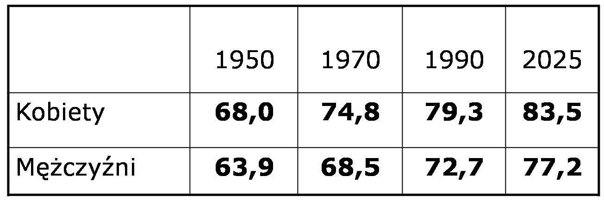
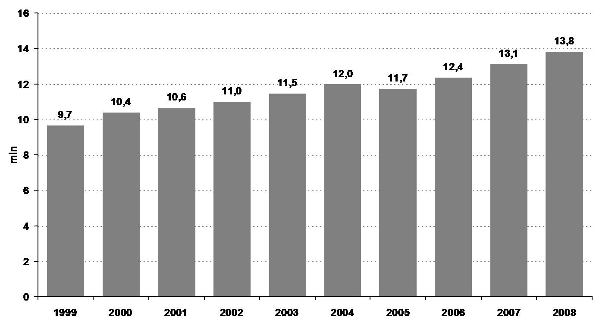
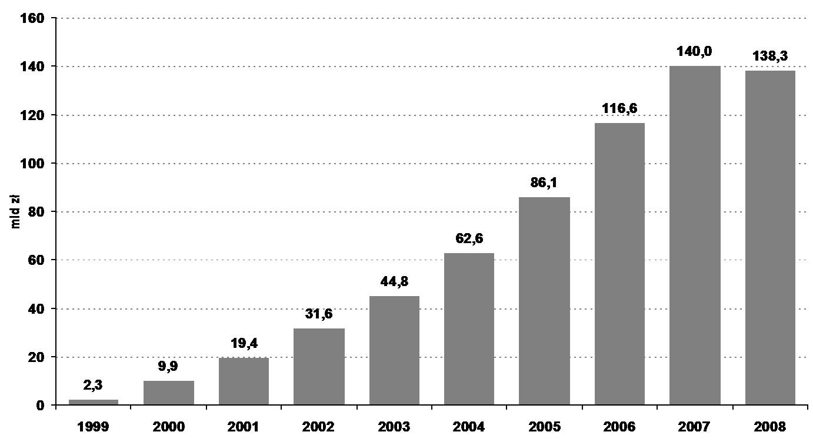
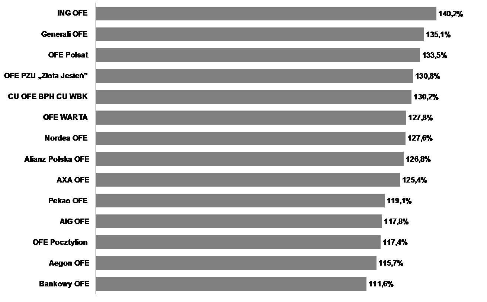
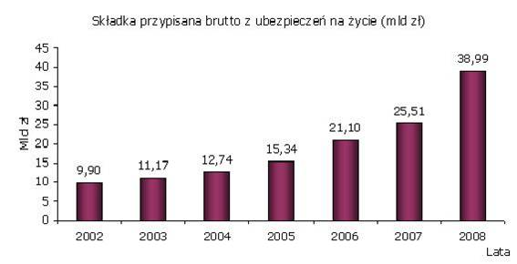

Instytucje zbiorowego inwestowania jako element bezpieczeństwa społecznego
==========================================================================

Starzenie się populacji jest szczególnie widoczne w obszarach bardziej rozwiniętej gospodarki, takich jak Stany Zjednoczone czy Europa Zachodnia (Niemcy, Holandia, Francja, Wielka Brytania itd.). W obszarach tych średnia długość życia uległa znacznemu wydłużeniu, a liczba dzieci w rodzinie znacznie zmalała. Istniejący system zabezpieczeń społecznych, zabezpieczeń emerytalnych i opieki zdrowotnej ulega szybkiej transformacji, by sprostać wyzwaniom czasów. 100 lat po wprowadzeniu przez Bismarcka, systemu zabezpieczeń emerytalnych opartych o zasadę solidarności pokoleń- system ten zaczyna być zagrożeniem dla  jego gwaranta czyli  Państwa.
Powód jest jeden - Starzenie się pokoleń. W historycznie utrwalonym schemacie społeczeństwa  ilość młodych ludzi  była zawsze większa ni z starych, gdyż ci ostatni raczej rzadko dożywali starości.  A więc,  w ramach solidarności pokoleń  niewielkie części dochodów generowane przez duża ilość  młodszych składało sie na świadczenia emerytalne  nielicznych statystycznie starych członków społeczności. Gwarantem tego systemu było (zgodnie z idea Bismarcka)  - Państwo, obsługujące zbiór wspomnianej części przychodów na cele emerytalne i ich dystrybucje. Zbieranie  tych środków  to nic innego jak  rodzaj podatków i środki te stanowiły cześć  budżetu państwa. Jeśli ilość środków na emerytury była wystarczająca i równa zapotrzebowaniu   wszystko przebiegało  gładko. Ale gdy ilość starych radykalnie wzrosła a ilość młodych spadła , Państwo jako gwarant świadczeń emerytalnych wraz ze swym budżetem stało sie zakładnikiem świadczeń emerytalnych, których udział w budżecie Państw stawał sie coraz bardziej znaczący, niestety po stronie zobowiązań.

Starzenie się pokoleń, czyli *Pension Time Bomb*
------------------------------------------------

Starzenie się pokoleń to proces zachodzący w coraz to większym obszarze świata. Tak jak było to wspominane w początkowych rozdziałach, wzrost poziomu życia i bogactwa nie tylko skutkuje wzrostem gospodarczym i zmianami w preferencjach konsumpcyjnych, ale i owocuje wzrostem długości życia, co jest intuicyjnie zrozumiałe i oczekiwane oraz zmniejszeniem się ilości rodzonych dzieci. Co jest o tyle niezrozumiałe, bo w bogatych społeczeństwach osobniki, które mogą wykarmić największą ilość potomstwa stanowią liczbę większą niż w krajach biednych. Ale to w krajach biednych rodzi się więcej dzieci.

*Długośc życia w chwili urodzenia*

Niestety liczba dzieci rodzonych przez statystyczna kobietę w czasie jej życia maleje wraz ze wzrostem poziomu życia liczonym, jako udział w Produkcie Krajowym Brutto na głowę mieszkańca.

.. image :: media/Sdr.jpg
   :align: center

*Wspólczynnik "rodności " kobiet w zależności od PKB na głowę*

Z wykresu wynika, że w krajach bogatszych kobiety rodzą mniej dzieci niż w krajach biednych.
Współczynnik ten w krajach Europy, w tym i w Polsce, która zalicza się do krajów o najniższej "rodności " kobiet na świecie (f.r= 1, 27) jest tak niski, że nawet nie podtrzymuje stałej liczebności ludności tych krajów (f.r= 2,14) i powoduje zmniejszanie się liczby ludności. Skoro dzieci nie przybywa a ludzie żyją dłużej to pojawia się poważny problem z finansowaniem życia tej części ludności, która zakończyła wiek produkcyjny i żyje ze świadczeń emerytalnych zapewnianych przez Państwo. Następuje konieczność finansowania świadczeń emerytalnych z budżetu Państwa. Wydatki te stanowią coraz większa cześć budżetu Państwa.
Kraje UE przeznaczą na ten cel od 8% do 16% (a nawet 24%) PKB. Mimo tak wielkich wydatków sytuacja w kolejnych latach się nie poprawia i coraz większa cześć budżetu jest konsumowana przez emerytów. 
Pojawia się obawa o spełnienie kryteriów z Maastricht.
Co robią inne kraje by zaradzić temu problemowi? 
Według informacji zebranych w [1]_

* Belgia – podnoszenie wieku emerytalnego z 60 do 65 dla obu płci.
* Dania – korzystanie w pełni z dostępnych instrumentów rynku finansowego / outsourcing zarządzania aktywami
* Niemcy – reforma Reistera / obniżanie poziomu stopy zastąpienia i wprowadzanie II-go filara / zwiększenie inwestycji w akcje do 55%
* Włochy – reforma Dini / II gi filar / dłuższy okres pracy w zamian za nie zwiększanie obciążenia podatkowego
* Hiszpania – podniesienie kwoty wolnej od podatku i zniesienie podatku na kwoty wpłacone do systemu powyżej ustalonego procentu pensji netto/ rozszerzenie zakresu możliwości inwestycyjnych 

Analiza tylko działań podejmowanych w powyższych, wybranych krajach wskazuje na stosowanie następujących rozwiązań. Proponuje się podniesienie wieku emerytalnego i zrównanie wieku emerytalnego kobiet i mężczyzn. Należy pamiętać, że kobiety średnio żyją dłużej od mężczyzn a przechodząc wcześniej od nich na emeryturę są krócej czynne zawodowo. 
Próbuje się tworzyć i reformować system emerytalny opierając go o inwestowanie środków na przyszłe emerytury na rynkach finansowych.
Państwa rozwinięte gospodarczo z USA na czele są liderami takich zmian systemów emerytalnych. 
W tych krajach zrodziło się przekonanie, że ludzie nie mogą polegać tylko na rodzinie i państwie, jako gwarantach przyszłości, a powinni raczej zwrócić się w kierunku rynków finansowych i związanych z nimi instytucji, aby poprzez oszczędzanie i inwestowanie samodzielnie zadbać o swoją przyszłość. Nawet w krajach rozwijających się widać oznaki reform systemów emerytalnych. W reakcji na starzenie się populacji, rządy i konglomeraty finansowe tworzą nowe instytucje, produkty chroniące przed finansowymi konsekwencjami starości, chorób, leczenia, zabezpieczając swych klientów przed inflacją i zmianą wartości posiadanych przez nich aktywów. Można mówić o rozwoju i postępie na rynkach finansowych.

W ciągu ostatnich 50 lat największy rozwój instytucji finansowych, technik zarządzania, aktywów pod zarządem, wiąże się z efektem starzenia się populacji.

Jedna z konsekwencji takiego rozwoju jest to, że każdy z nas osobiście staje przed wyborem coraz bardziej skomplikowanego zestawu portfela niezbędnych dla życia instrumentów finansowych. Wyboru skomplikowanego, którego trafność wiążę się z poważnymi konsekwencjami i ryzykiem, wymagającego coraz większej wiedzy i doświadczenia.
Taki rozwój rynku stawia też nowe wyzwania instytucjom finansowym. Powoduje, między innymi, to, że instytucje finansowe zmuszone są odchodzić od koncentrowania się na dostarczanych na rynek produktach w stronę rozwiązywania problemów swych klientów.
Sprawa jest jednak poważniejsza niż to, powyższe stwierdzenie, pachnące trywialnością.
Przecież instytucje finansowe zawsze chcą swoim produktem rozwiązać określony problem klienta albo jakiejś „grupy docelowej”. Brak dostosowania produktu do bieżącej sytuacji konkretnego
klienta to nie tylko odchylenie jego sytuacji od średniej tzw. „targetu”, nie tylko wygoda
i lenistwo instytucji finansowej. To problem szerszy [2]_.

System zabezpieczenia społecznego w Polsce
------------------------------------------

Powtarzając za prof. Markiem Górą - System emerytalny jest instytucjonalną strukturą wymiany międzypokoleniowej.
Uczestnictwo w systemie emerytalnym może być interpretowane, jako kupowanie dzisiaj przez pokolenie pracujące prawa do uczestniczenia w podziale PKB, który będzie wyprodukowany przez kolejne pokolenie pracujące w przyszłości.
Z indywidualnego punktu widzenia system emerytalny jest narzędziem alokacji dochodu w cyklu życia. W okresie aktywności zawodowej jednostki kupują prawa emerytalne (w różnej formie), po przejściu na emeryturę sprzedają je.
Rozpoczęta reforma systemu emerytalnego w Polsce stawia nasz kraj w czołówce krajów świata reformujących system emerytalny. 

Założenia zreformowanego system zabezpieczenia emerytalnego w Polsce.

System oparty o trzy filary.

* I FILAR - ZUS/FUS: obowiązkowy, powszechny,

repartycyjny, administrowany przez państwo.

* II FILAR - PTE/OFE: obowiązkowy, powszechny,

kapitałowy, zarządzany przez prywatne podmioty

* III FILAR: dodatkowy, dobrowolny, kapitałowy,

zarządzany przez prywatne podmioty.

Reforma systemu zabezpieczeń społecznych w Polsce wprowadza odpowiednie regulacje prawne sankcjonujące zbiorowe i indywidualne formy oszczędzania na emeryturę.
Formy zbiorowe to pracownicze programy emerytalne (PPE) - tworzone przez
pracodawców dla zatrudnianych przez nich pracowników.
Rozwiązania indywidualne w zakresie gromadzenia uzupełniających środków na
przyszłą emeryturę - funkcjonują pod zbiorczą nazwą indywidualnych kont emerytalnych (IKE).

Realia reformy systemu emerytalnego w Polsce.
Wprowadzone w 1999 roku reformy systemu emerytalnego miały zapewnić państwu zdolność do realizacji zobowiązań z systemu emerytalnego przy jednoczesny ograniczeniu wydatków z ramienia Skarbu Państwa. Czyli krótko mówiąc rozłożyć odpowiedzialność za kształt i wysokość emerytury nie tylko na Skarb Państwa, ale również a może nawet przede wszystkim na obywatela.

Jednym z podstawowych założeń reformy było zwiększenie bezpieczeństwa systemu emerytalnego poprzez zapewnienie wypłaty świadczeń emerytalnych z różnych źródeł - z dwóch lub trzech, dla tych, którzy podejmą decyzję o dokonywaniu dodatkowych oszczędności.

Dotychczasowy system zabezpieczeń emerytalnych daje bardzo niską stopę zastąpienia. Stopa zastąpienia to wyrażona w procentach relacja wysokości miesięcznych świadczeń emerytalnych do wysokości ostatnich, miesięcznych wynagrodzeń ze świadczonej pracy. Ta niska stopa zastąpienia jest poważnym zagrożeniem dla emerytów. 
97% obecnych emerytów deklaruje, że ich jedynym źródłem utrzymania są świadczenia emerytalne.

Jaka jest ich wysokość?

W lutym 2004 r. przeciętna emerytura wyniosła 1219 zł
Jednak około 60% emerytów otrzymało kwotę poniżej 1000 zł
A ponad 6% świadczenie minimalne w wysokości 562,58 zł
W lutym roku 2010 przeciętna emerytura wynosi 1500 zł a najniższą - 675,1zł.

System emerytalny w Polsce - instrumenty i rozwiązania
------------------------------------------------------

Otwarte Fundusze Emerytalne - czyli II filar systemu emerytalnego

Otwarte fundusze emerytalne, (OFE) stanowią kapitałową cześć aktualnego systemu emerytalnego.
Istotą działalności otwartych funduszy emerytalnych jest gromadzenie i inwestowanie środków pieniężnych członków OFE z przeznaczeniem na wypłatę członkom funduszu po osiągnięciu przez nich wieku emerytalnego.

Fundusze emerytalne mają charakter otwarty, co oznacza, że każdy uprawniony może dowolnie wybrać fundusz, a fundusz nie może odmówić mu członkostwa. Zarazem istnieje obowiązek przynależności do funduszu dla każdej osoby objętej ubezpieczeniem społecznym urodzonej po 31 grudnia 1948 r.
Fundusze emerytalne w swej strukturze i funkcjonowaniu przypominają Fundusze Inwestycyjne.
Otwarte fundusze emerytalne są odrębnymi podmiotami, mają osobowość prawną. Są jednak tworzone, zarządzane i reprezentowane w stosunkach z osobami trzecimi przez powszechne towarzystwa emerytalne (PTE) -podmioty prywatne działające w formie spółek akcyjnych.

*Ilość uczestników Funduszy Emerytalnych*

Obydwa te podmioty podlegają nadzorowi państwa.
Fundusze mając osobowość prawną, nie posiadają jednakże zdolności upadłościowej tzn. nie mogą ogłosić bankructwa - fundusz dysponuje majątkiem odrębnym od majątku towarzystwa i w przypadku ogłoszenia upadłości towarzystwa aktywa funduszu nie wchodzą w skład jego masy upadłościowej.

*Aktywa zgromadzone w OFE*

Aktywa OFE są inwestowane  zgodnie zasadami inwestowania i limitami przewidzianymi na poszczególne aktywa ustalonymi przez Ustawę o funduszach emerytalnych [3]_. Ten sam akt prawny nie przewiduje praktycznej możliwości dywersyfikacji portfela funduszy na zagraniczne  rynki instrumentów finansowych (dywersyfikacja  gospodarki kraju).
Tak ścisła regulacja  sposobu zarządzania i bardzo sztywne limity inwestycyjne spowodowały, że zwroty  portfeli inwestycyjnych  poszczególnych funduszy  nie różnią sie bardzo miedzy sobą.

*Stopy zwrotów Funduszy Emerytalnych*

Stopy zwrotów zaprezentowane za : Komisja Nadzoru Finansowego. Są to stopy zwrotów od początku działalności. 

Filar III czyli IKE i PPE

Indywidualne Konta Emerytalne (IKE) są  uzupełnieniem emerytur pochodzących z dwu pierwszych filarów o oszczędności indywidualne  przyszłych emerytów inwestowane  na rynkach finansowych. Oczywiście wielkość kwoty i sposób inwestowanie reguluje odpowiednia ustawa. W ten sposób uzyskane środki polepszają stopę zastąpienia.
IKE na rynku pojawiło sie później niż  Pracownicze Programy Emerytalne.
 
PPE - to system pozwalający Pracodawcy inwestować regularnie określoną kwotę pieniędzy na cel emerytury pracownika. Jest to oczywiście forma  zachęty dla pracownika do świadczenia pracy na rzecz Pracodawcy, który  dodatkowo , oprócz wynagrodzenia, nagradza pracownika dodatkowymi środkami na jego emeryturę. Zachęcony do oszczędzania  na własna emeryturę pracownik może  wpłacać   dodatkowe  kwoty na swoje konto emerytalne w ramach PPE, skutkiem czego jego emerytura może być w przyszłości wyższa.
Składka pracodawcy to  max 7% wynagrodzenia (w praktyce ok. 4%).Składka pracownika
To max 450% przeciętnego miesięcznego wynagrodzenia w gospodarce.
Funkcjonowanie III filara w oparciu tylko o PPE jest niewystarczające (na koniec 2003 roku było zarejestrowanych w całym kraju ok. 240 programów emerytalnych obejmujących 100 000 pracowników).
Istnienie tylko PPE stawiało w uprzywilejowanej sytuacji pracowników dużych, dochodowych firm. Sytuacja na rynku pracy, wysoki poziom bezrobocia  i wynikający z tego rynek pracodawcy  spowodował  niewielkie praktyczne zainteresowanie PPE. Rozwój III filara był po prostu koniecznością i stąd pojawienie  sie Indywidualnych Kont Emerytalnych. IKE nie jest konkurencją dla PPE ale wypełnieniem luki w systemie III filara dającym możliwość indywidualnego oszczędzania na emeryturę.

Indywidualne konta emerytalne  rozwiązują problem zobowiązań systemu emerytalnego. Każdy dostaje z niego tyle ile do niego włożył.
Nie znaczy to jednak, że indywidualne konta emerytalne pozwalają uwolnić się od skutków starzenia się ludności. – Na to bowiem nie ma sposobu.

Ustawa regulująca funkcjonowanie IKE [4]_ przewiduje możliwość prowadzenia konta przez cztery typy instytucji finansowych:

* fundusze inwestycyjne

jako wyodrębniony zapis w rejestrze uczestników funduszu inwestycyjnego

* podmioty prowadzące działalność maklerską 

wyodrębniony rachunek papierów wartościowych i rachunek pieniężny służący do jego obsługi w podmiocie prowadzącym działalność maklerską 

* zakłady ubezpieczeń na życie 

wyodrębniony rachunek w ubezpieczeniowym funduszu kapitałowym

* banki krajowe

wyodrębniony rachunek bankowy

Kwota przeznaczona na wpłaty do IKE to wyłącznie zasoby oszczędzającego
Max 150% przeciętnego miesięcznego wynagrodzenia w gospodarce.

Indywidualne  oszczędzanie  na własną emeryturę powoli  znajduje swe miejsce w świadomości Polaków. Na to umiarkowane, jak dotychczas, interesowanie złożyły sie następujące czynniki:

* Znikoma wiedza na temat IKE 
* Bardzo niewielka wiedza o OFI i funduszach ubezpieczeniowych 
* Większość Polaków nie orientuje się w kryteriach, jakimi powinni kierować się przy wyborze programu emerytalnego lub IKE
* Nieświadomość istnienia podatku od zysków kapitałowych.

Należy pamiętać, ze istnieje jeszcze jedna wielka bariera. Ta bariera ma charakter emocjonalny i zwyczajowy. W polskim społeczeństwie nie istnieją wzory  oszczędzania  a szczególnie oszczędzania na własną emeryturę.
Samodzielne oszczędzanie na emeryturę to  wyzwanie zmiany zwyczajów. Nie jest to możliwe bez edukacji.

Konto emerytalne, ryzyka oszczędzania na emeryturę
~~~~~~~~~~~~~~~~~~~~~~~~~~~~~~~~~~~~~~~~~~~~~~~~~~

Bezpieczeństwo konta emerytalnego jest niezwykle  ważna sprawa w tworzenie rozwiązań emerytalnych. Mimo, że sprawa emerytury jest coraz bardziej sprawą osobistą każdego obywatela  to każde państwo dba o bezpieczeństwo tych kont, zdając sobie sprawę, że w przypadku jakiegoś nieszczęścia uszczuplającego środki zgromadzone na tych kontach, problem będzie musiało rozwiązać samo albowiem  właścicielami tych nieszczęsnych kont są obywatele tych Państw.
Doświadczenie a szczególnie to złe tworzenia kont emerytalnych pozwoliło na wypracowywanie zasad maksymalnego bezpieczeństwa konta funkcjonującego w oparciu o rynki finansowe.
Komisja Europejska przykłada szczególny nacisk na bezpieczeństwo tych kont.  W swoim Komunikacie - [5]_ postawiła temat zabezpieczeń emerytalnych opartych o mechanizmy rynków  kapitałowych, jako priorytet. W tym dokumencie określono konieczność przejścia od systemu zabezpieczeń socjalnych opartych o zobowiązania socjalne Państwa w stosunku do obywateli, czy też systemu zobowiązań zakładów pracy, do systemów opartych na zdefiniowanej składce wpłacanej na konto emerytalne. Konto emerytalne traktowane jest jako własność inwestującego we wspólnej puli aktywów zarządzanych jak inwestycja długoterminowa na rynku kapitałowym.

Tworząc zalecenia unijne wzięto pod uwagę złe doświadczenia brytyjskich rozwiązań emerytalnych. W myśl brytyjskich rozwiązań, aby zapobiec skonsumowaniu środków gromadzonych na emeryturę przed osiągnięciem wieku emerytalnego, (co jest najbardziej powszechnym zagrożeniem indywidualnego oszczędzania na emeryturę) Pracodawca do czasu przejścia na emeryturę był właścicielem środków gromadzonych na emerytury pracowników i nimi zarządzał. Ponieważ środki te były częścią bilansu instytucji zatrudniającej w dość naturalny sposób zostały zainwestowane w inwestycje najlepiej rokującą, czyli firmę, która zatrudniała pracowników.  Niestety, gdy ten segment rynku, tę firmę dotykały trudności i kłopoty rynkowe, pracownicy nie tylko tracili prace, ale i emerytury. Skutkiem tych złych doświadczeniom taka koncentracja ryzyka została wykluczona w organizacji systemów zabezpieczeń emerytalnych.

Cechy, jakie powinno spełniać konto zabezpieczeń emerytalnych zgodnie ze wspomnianym dokumentem Komisji.

1. **„Transfer – neutral”**

Wpłaty na emeryturę powinny być czynione przez zainteresowanego i to on powinien być jednoznacznym i pełnym właścicielem jasno określonych i posiadających wartość aktywów.
czyli  musi sie czuć właścicielem konta i odpowiedzialnym za swoja emeryturę   by mógł pamiętać, że „Oszczędzaj dla Siebie. Tego nikt nie zrobi za Ciebie”

2. **„Fully portable”**

Pozwalający na swobodne przemieszczanie się siły roboczej w ramach krajów UE. Konto to musi podążać za  człowiekiem i nie może być zatrzymywane przez zakład pracy czy Państwo.

3. **„Fully funded”**

Musi pozwalać na dywersyfikacje aktywów wśród także tych o wyższej stopie zwrotu (i uniezależniać od wahań PKB na poziomie krajowym). Tak wiec aktywa konta musza być zainwestowane w aktywa rynkowe na wielu rynkach, tak, aby umożliwić właściwą dywersyfikacje. Dywersyfikacja musi być na tyle szeroka by umożliwiała dywersyfikacje gospodarki kraju poprzez inwestycje na innych zagranicznych rynkach tak by lokalne problemy gospodarki kraju nie miały negatywnych konsekwencji dla obywateli danego kraju, członka Unii.

4. **„High standards of protection”**

Ochrona przed ryzykiem inwestowania poprzez właściwe, profesjonalne zarządzanie przez licencjonowanych zarządzających i pod nadzorem lokalnego Nadzoru Finansowego, przy gwarantowaniu maksymalnie wysokiego bezpieczeństwa. (ograniczanie możliwych ryzyk). 

Powyższe zasady są właściwe i ze wszech miar dobre. Jednakże ich zastosowanie napotkało pewne trudności praktyczne. Natura tych trudności ma swoje korzenie w tym, że standardy te są ponad narodowe a w ich implementacji często górę bierze interes narodowy. Ponadto źródłem trudności jest często narodowa polityka podatkowa, polegająca na:

* dyskryminacji podatkowej lokalnych rozwiązań emerytalnych
* podatkowej penalizacji transferu zagranicznego.

Można zadać sobie pytanie  czy zasady te spełniają zastosowane w Polsce rozwiązania  kont emerytalnych?

W przypadku II Filara i OFE odpowiedz jest prosta i twierdząca. Właścicielami jednostek Funduszu są  oszczędzający na emeryturę. Zarządza nimi instytucja zarządzająca oddzielona od Funduszu , przez co  ryzyko  kredytowe instytucji zarządzającej nie stanowi zagrożenia dla aktywów Funduszu. Fundusz jest zarządzany przez profesjonalistów  pod nadzorem Komisji Nadzoru Finansowego. Aktywa Funduszu spoczywają w Banku Powierniku. Portfel  inwestycji funduszu to zdywersyfikowany zbiór  inwestycji na rynku kapitałowym. Właściciel konta może dysponować nim z każdego punktu globu.

A jak  analogiczne rozumowanie wygląda w przypadku kont IKE?

W przypadku konta IKE w Funduszu inwestycyjnym  sytuacja wygląda tak samo jak w przypadku OFE.
Natomiast w przypadku kont IKE w banku, instytucji ubezpieczeniowej i w biurze maklerskim, środki konta IKE są częścią bilansu instytucji zarządzającej i jej ryzyko bilansu stanowi ryzyko zagrożenia  aktywów konta. W przypadku kłopotów  instytucji zarządzającej kontem, przenoszone są one na konta emerytalne stanowiące cześć bilansu.
Ryzyko bilansu spowodowało to, że fundusz inwestycyjny jest najczęściej spotykaną formą oszczędzania na emeryturę w Europie i na świecie.
Co najmniej 439 mld Euro w funduszach inwestycyjnych jest zainwestowana w celach emerytalnych?
Stanowi to niemniej niż 21, 1% aktywów wszystkich kontynentalnych funduszy emerytalnych.

Firmy ubezpieczeniowe
---------------------

Ubezpieczenia można klasyfikować w zależności od przyjętego kryterium na:

* ubezpieczenia społeczne (KRUS, ZUS)
* gospodarcze (od wydarzeń gospodarczych)
* ubezpieczenia majątkowe
* osobowe,
* ubezpieczenia na życie oraz pozostałe ubezpieczenia osobowe i majątkowe tzw. Dział II
* ubezpieczenia morskie, a pozostałe określa się mianem lądowych).

W tej wymienionej wyżej grupie, za zabezpieczenia  socjalne odpowiadają  dwie instytucje państwowe KRUS i ZUS.
Pozostałe  ubezpieczenia prowadzone są na zasadach wolnorynkowych przez firmy ubezpieczeniowe (zakłady ubezpieczeniowe). 

Funkcjonowanie firmy ubezpieczeniowej oparte jest na  zasadzie aby zebrać więcej składek niż wypłacić odszkodowań, aby jednak te dwie wielkości co najmniej się zbilansowany stosuje się w towarzystwach ubezpieczeniowych właściwy proces obliczeń mający na celu oszacowanie prawdopodobieństwa  zaistnienia zdarzenia, które będzie skutkowało wypłatą odszkodowania. Wszystkie te obliczenia (wysokość składki, świadczeń, odszkodowań, rezerw itp.) wykonują specjaliści zwani aktuariuszami. Aktuariusze w oparciu o  historyczne dane statystyczne, prognozy i regulacje prawne dokonują oszacowań prawdopodobieństw zdarzeń losowych. 

Towarzystwa ubezpieczeniowe oferują nam szereg produktów ubezpieczeniowych. Ustawa o działalności ubezpieczeniowej [6]_ reguluje  w Polsce funkcjonowanie systemu ubezpieczeniowego opartego na rozdzieleniu ubezpieczeń osobowych i majątkowych. Wspomniana ustawa wprowadza podział ubezpieczeń na dwa działy: 
Dział I - Ubezpieczenia na życie i Dział II - Pozostałe ubezpieczenia osobowe oraz ubezpieczenia majątkowe. Ta regulacja jest zgodna z wytycznymi  Unii Europejskiej   i kształtuje  polski rynek ubezpieczeń na życie na wzór jednolitego rynku europejskiego. Ustawa,  jak juz wspominano, wprowadza zakaz jednoczesnego prowadzenia ubezpieczeń z działu I i II. Rozdział obydwu działów ubezpieczeń został przeprowadzony w interesie klienta. Ma on uniemożliwić przepływ środków finansowych między firmami i koncentracje ryzyka.
Te  rodzaje ubezpieczenia posiadają bowiem  inne charakterystyki czasowe:
Charakter ubezpieczeń na życie - to ubezpieczenia długoterminowe - sprawia, że ubezpieczyciel jest na bardzo długo w posiadaniu dużych środków finansowych. 
Ubezpieczenia inne niż życiowe są ubezpieczeniami krótkoterminowymi - przeważnie są to polisy jednoroczne.
 
Również ta ustawa specyfikuje różne rodzaje ubezpieczeń osobowych, które są zarazem produktami oferowanymi przez towarzystwa ubezpieczeniowe. Produkty te, to przykładowo:

* ubezpieczenie na życie 
* ubezpieczenie posagowe 
* ubezpieczenie rentowe 
* ubezpieczenie wypadkowe 
* ubezpieczenie chorobowe

.. image:: media/Zeyh.jpeg
   :align: center

*Wielkość wypłaconych świadczeń - ubezpieczenie na życie* [7]_

Ubezpieczenia  pełnią bardzo ważną  rolę zabezpieczenia od różnych ryzyk i zainteresowanie  nimi wzrasta o czym świadczą dane  przedstawione w załączonych  wykresach.

Ryzyka w działalności zakładów ubezpieczeń.

Zakłady ubezpieczeniowe są spółkami prawa handlowego i konkurują o klienta na wolnym rynku tak, jak wszystkie inne podmioty gospodarcze. Ich funkcjonowanie  polegające na  zbieraniu składek od klientów, lokowania tych aktywów na rynkach finansowych, ocena i oszacowywanie ryzyka wystąpienia zdarzeń od następstw, od których ubezpieczają klientów, tworzenie rezerw na  wypłatę odszkodowań,  powodują, że firmy ubezpieczeniowe narażone są na szereg  ryzyk.
Do najistotniejszych obszarów ryzyka należy zaliczyć (zgodnie z  nomenklaturą przyjętą przez Komisje Nadzoru Finansowego [8]_):

* ryzyko kredytowe,

na które składa się: -ryzyko kontrahenta , które to ryzyko odzwierciedla straty związane z niewykonaniem zobowiązań przez kontrahentów lub pogorszeniem się ich zdolności kredytowej.
-ryzyko koncentracji - ryzyko wynikające z niskiej dywersyfikacji portfela aktywów ze względu na koncentrację emitentów/kontrahentów, jaki koncentrację produktów.

* ryzyko stopy procentowej - ryzyko, na jakie narażony jest wynik finansowy,wynikające z wrażliwości aktywów i zobowiązań na zmiany w strukturze terminowej stóp procentowych, wahania zmienności stóp procentowych lub zmiany kształtu krzywej stopy procentowej.

* ryzyko zmienności cen rynkowych papierów wartościowych - ryzyko, najakie narażony jest wynik finansowy, wynikające z wrażliwości aktywów i zobowiązań na zmiany w poziomie lub wahania zmienności cen rynkowych papierów wartościowych w szczególności w przypadku inwestycji w akcje, czy jednostki uczestnictwa, których strategie inwestycyjne bazują na inwestycjach w akcje.

* ryzyko kursowe/walutowe - ryzyko, na jakie narażony jest wynik finansowy,wynikające z wrażliwości aktywów i zobowiązań na zmiany w poziomie lub wahania zmienności kursów wymiany walut, a także na jakie narażony jest wymóg kapitałowy, wynikające z wpływu zmiany kursu euro na minimalny kapitał gwarancyjny, którego wielkość wyjściowa została ustalona w euro.

* ryzyko katastroficzne - ryzyko wynikające ze znacznej niepewności założeń dotyczących wyceny i tworzenia rezerw, związanych ze zdarzeniami o charakterze wyjątkowym powodującym szkody o dużej wysokości.

* ryzyko otoczenia makroekonomicznego - ryzyko zmiany warunków ekonomiczno-społecznych, mających niekorzystny wpływ na zakład ubezpieczeń, między innymi, powodujących zmniejszenie przychodów z tytułu składek.

* ryzyko konkurencji - ryzyko wynikające z pojawienia się nowych ubezpieczycieli, przejęć i fuzji, rozwoju usług i nowych kanałów dystrybucji, jak również ze zmiany strategii konkurencji, stosowaniu przez konkurencję złych praktyk, etc.

* ryzyko prawne - ryzyko zmian warunków prowadzenia działalności i jej konkurencyjności wywołane zmianami w regulacjach prawnych i ich interpretacji, w tym ze strony organów podatkowych, organu nadzoru i w orzecznictwie sądowym oraz ryzyko wynikające z nieprzestrzegania przez zakład obowiązujących przepisów prawa. 
 
* ryzyko rezygnacji z umów - ryzyko wynikające ze zmian w poziomie, trendu lub zmienności wskaźników rezygnacji z umów, zamykania polis oraz wykupów. 

*Składka przypisana - Polska* [9]_

Wykazane powyżej rodzaje ryzyka, na jakie narażona jest działalność firm ubezpieczeniowych, w znacznym stopniu ograniczane  są poprzez obowiązujące przepisy ustawy o działalności ubezpieczeniowej. Zgodnie z przepisem art. 30 ustawy o działalności ubezpieczeniowej zarząd zakładu ubezpieczeń odpowiada za opracowanie, wprowadzenie i funkcjonowanie regulacji wewnętrznych określających sposób wykonywania działalności ubezpieczeniowej, w szczególności w zakresie czynności zleconych innym podmiotom, kontroli wewnętrznej, dostosowanych do skali prowadzonej działalności oraz wielkości i profilu ryzyka związanego z działalnością zakładu ubezpieczeń. Ponadto w kontekście ryzyk związanych z polityką lokacyjną zakładów ubezpieczeń należy również wskazać na przepisy ustawy o działalności ubezpieczeniowej dotyczące prowadzenia działalności lokacyjnej przez zakłady ubezpieczeń, w tym między innymi na przepis art. 153 ustawy o działalności ubezpieczeniowej, zgodnie z którym zakład ubezpieczeń jest obowiązany do lokowania środków finansowych w taki sposób, aby uwzględniając rodzaj i strukturę prowadzonych ubezpieczeń osiągnąć jak największy stopień bezpieczeństwa i  rentowności, przy jednoczesnym zachowaniu płynności środków

Aby ocenić atrakcyjność danego towarzystwa ubezpieczeniowego a także jego pozycję na rynku bardzo przydatne są tu wskaźniki finansowe charakterystyczne właśnie dla tej branży jak również oceny firm ratingowych. Jednym ze wskaźników jest składka przypisana brutto – czyli suma wszystkich należności z tytułu umów ubezpieczenia w danym okresie sprawozdawczym.  Ten wskaźnik mówi nam o pozycji rynkowej danego towarzystwa, określa rozmiary działalności. Natomiast drugim jest techniczny wynik ubezpieczeń, który wskazuje, ile firma zarobiła na swojej podstawowej działalności, czyli na ubezpieczaniu.

----------

.. [1] *Pensions International - December  2002* Issue no 36
.. [2] M.Łukaszewski „Oszczędzanie pod dyktatem demografii” Gazeta Bankowa-3maj2004
.. [3] ustawą z dnia 28 sierpnia 1997 r. o organizacji i funkcjonowaniu funduszy emerytalnych (Dz. U. Nr 139, poz. 934 i z 1998 r. Nr 98, poz. 610)
.. [4] z dnia 20 kwietnia 2004 r. o indywidualnych kontach emerytalnych (Dz. U. Nr 116, poz. 1205)
.. [5] *" Green Paper 1997 " Supplementary Pensions in Single Market"*
.. [6] Ustawa z dnia 28 lipca 1990 r. Dz.U.nr.59.poz.344
.. [7] dane dzieki Izbie  Ubezpieczeń
.. [8] i zgodnie  lista KNF
.. [9] Izba Ubezpieczeń.

