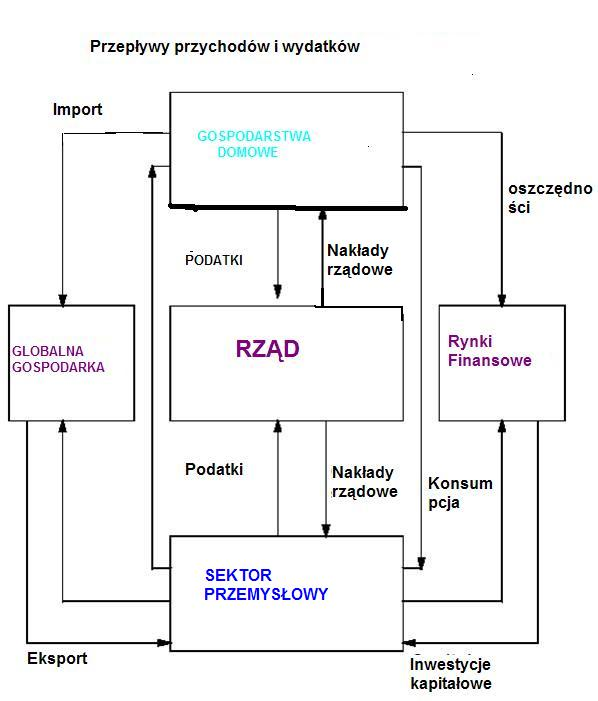
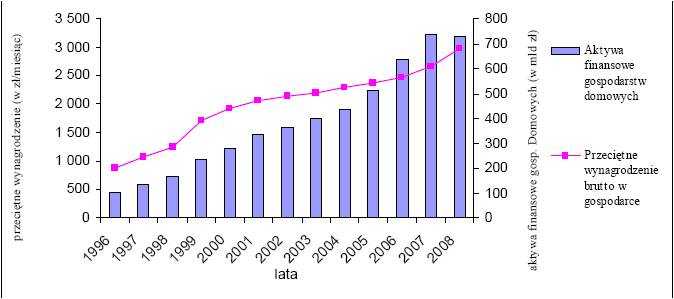
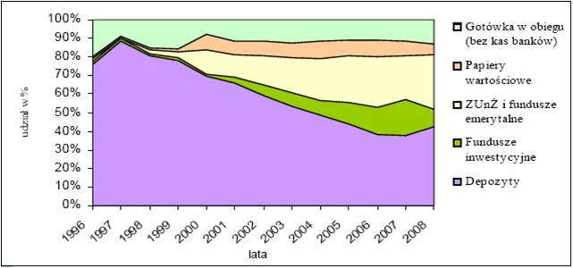
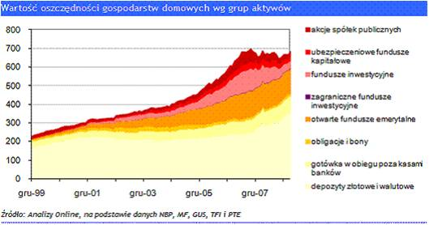
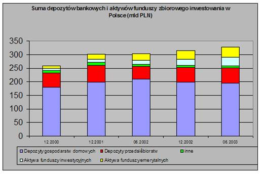
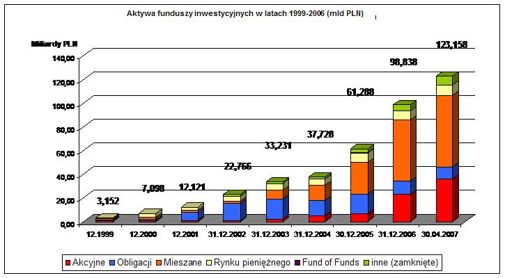
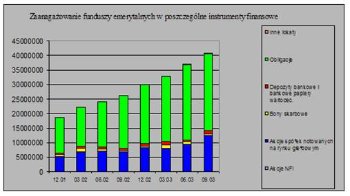

Oszczędności gospodarstw  domowych
==================================

Definicja gospodarstwa domowego - rola w ekonomii
-------------------------------------------------

Gospodarstwo domowe odgrywa niezwykle istotną funkcję w gospodarce. Jest to ważne ogniwo gospodarki wpływające na jej kształt aktywnie lub też podlegające szeregowi wpływów. W tym rozdziale uwaga skupiona będzie na jego roli w tworzeniu oszczędności a szczególnie na tym jak oszczędności te są lokowane i jak wpływają na rynki finansowe i jaką rolę odgrywają w kształtowaniu gospodarki kraju.
Definicje gospodarstwa domowego najczęściej koncentrują się na brzmieniu zbliżonych do poniższego stwierdzenia: 
Gospodarstwo domowe to podmiot gospodarczy, w którego skład wchodzi jedna lub więcej osób, wspólnie się utrzymujących w ogromnej większości połączonych więzami biologicznymi i stanowiących rodziny. 

**Gospodarstwo domowe**, którego nazwa grecka dała brzmienie terminowi - ekonomia, charakteryzuje się posiadaniem oraz zarządzaniem wspólnym majątkiem oraz wspólnym budżetem w celu zaspokajania głównych potrzeb członków gospodarstw domowych.
Gospodarowanie jest to proces zarządzania dostępnymi funduszami, materiałami, tak by czerpać z nich jak najwięcej korzyści.
W każdej gospodarce rynkowej występują dwa główne podmioty gospodarcze: gospodarstwa domowe i przedsiębiorstwa. Gospodarstwo domowe jest konsumentem oraz właścicielem zasobów (środków), przedsiębiorstwo – producentem i użytkownikiem zasobów.

Gospodarstwo domowe dostarcza przedsiębiorstwom czynników produkcji: kapitału pieniężnego, pracy, a także ziemi.
Przedsiębiorstwa dostarczają gospodarstwom domowym środków do zaspokajania ich potrzeb: dóbr i usług oraz wynagrodzenia za dostarczone czynniki produkcji.
Gospodarstwo domowe niezależnie od wielkości ma możliwość decydowania o tym, jak i gdzie zastosować zasoby, które posiada. Każde gospodarstwo domowe ma też możliwość decydowania o tym, jak i ile konsumować. Każde gospodarstwo dąży do maksymalizacji swojego zadowolenia, i tym kieruje się przy podejmowaniu decyzji.
Gospodarstwa domowe mają potrzeby, których zaspokojenie odbywa się przez konsumpcję dóbr i usług. Celem gospodarstwa domowego jest maksymalizacja użyteczności, dostępnych dla niego, dóbr i usług. Innymi słowy gospodarstwo będzie zainteresowane tymi dobrami i usługami, które są w stanie dostarczyć mu najwięcej korzyści. 
Decyzje gospodarcze gospodarstw domowych są ukierunkowane z jednej strony na pozyskiwanie dóbr i usług służących konsumpcji, z drugiej zaś na otrzymywanie dochodów. Gospodarstwo domowe zainteresowane jest tym, by powstały warunki do najlepszego zaspokojenia jego potrzeb. Działania gospodarcze gospodarstwa domowego koncentrują się na:

* gospodarowaniu posiadaną siłą roboczą
* konsumpcji

Gospodarując siłą roboczą gospodarstwa decydują, w jaki sposób uzyskają dochody, natomiast w konsumpcji manifestują swe oczekiwania dotyczące rodzajów i ilości dóbr i usług, na które ich popyt wzrośnie. Integralną częścią konsumpcji są oszczędności, ponieważ gospodarstwo domowe oszczędza nieskonsumowaną część posiadanego dochodu.

Rola oszczędności w gospodarce
~~~~~~~~~~~~~~~~~~~~~~~~~~~~~~

W systemie gospodarki obserwujemy szereg powiązań i zależności powodujących przepływy środków finansowych miedzy podmiotami. Schematyczny obraz tych zależności przedstawia prezentowany obok schemat [1]_ 

*Gospodarka - gospodarstwa domowe*

Funkcjonując w systemie powiązań gospodarki, każde gospodarstwo domowe musi podejmować trzy podstawowe decyzje:

Ile potrzebuje każdego produktu czy usług (popyt)?

Ile pracy musi świadczyć (podaż)? 

Ile może skonsumować(wydać) dzisiaj, a ile może odłożyć na później (oszczędności)? 

O popycie na usługi i produkty decydują następujące czynniki:
  
* Dochód gospodarstwa.
* Wielkość posiadanego majątku. 
* Ceny podobnych produktów na rynku dostępnym dla gospodarstwa. 
* Preferencje konsumenckie (wzory, style, smaki).
* Oczekiwania, co wielkości przyszłych dochodów, cen, koniunktury.

Potrzeby konsumpcyjne gospodarstw domowych znajdują się pod ustawicznym wpływem cen na rynku.
Ceny wpływają na gospodarstwa rynkowe na dwa sposoby:

* Konsumpcja zmienia się albowiem siła nabywcza ulega zmianie (efekt dochodów).
* konsumpcja zmienia się, bo pojawiają się inne możliwości wydatkowania (efekt zastąpienia).

Ciekawym efektem zapotrzebowania i ceny, jaką się przypisuje produktowi jest tzw. efekt wody-brylantu. Efekt ten, popularnie mówiąc, polega na tym, że rzeczy powszechne w użyciu mają niewielką wartość na rynku a rzeczy o wysokiej wartości rynkowej mają niewielką wartość użytkową.

Aby zaspakajać swe potrzeby konsumpcyjne gospodarstwa domowe muszą dokonywać następujących wyborów na rynku pracy:

* Czy pracować?
* Ile pracować?
* W jakim charakterze i dziedzinie pracować?

Oczywiście te wybory są dodatkowo uwarunkowane dostępem do miejsc pracy, stawkami na rynku płac i umiejętnościami posiadanymi przez członków gospodarstw domowych. Stawki na rynku płac, są niestety uwarunkowane relacjami między podażą a popytem na dane umiejętności oraz równowagą opłacalności. Równowaga opłacalności to równowaga między tym, by czegoś nie robić (odpoczynek) a robić. Każdy, kto decyduje się szukać swej szansy na rynku pracy, wybiera pomiędzy przyjemnościami nie pracowania a stawkami za pracę oferowanymi przez rynek, widzianymi przez pryzmat dóbr, które zamierza nabyć w zamian za wynagrodzenie.

Ta perspektywa nabywania dóbr i usług zawiera też opcje oszczędzania, czyli odkładania konsumpcji w czasie. Gospodarstwa domowe mogą użyć bieżące swe dochody do finansowania przyszłych wydatków (oszczędzania) lub mogą użyć przyszłe dochody do sfinansowania dzisiejszych wydatków - (pożyczanie, branie kredytów).
Równowaga konsumpcji bieżącej i oszczędzania regulowana jest wysokością stóp procentowych. Niskie stopy procentowe zachęcają do brania kredytów, wysokie stymulują oszczędzanie. Poziom oszczędności wykazuje również podatność na inne czynniki np.; poziom dochodów gospodarstw domowych.
Gromadzenie oszczędności przez osoby indywidualne, gospodarstwa domowe ma ogromne znaczenie dla gospodarki. Stanowią one źródło kapitału finansowego, który jest czynnikiem niezbędnym do inwestycji będących jednym ze źródeł wzrostu gospodarczego. Oszczędzanie nadwyżek finansowych przez konsumentów ogranicza ich wydatki, a tym samym łagodzi presję na wzrost cen. Duża ilość zaoszczędzonych środków zapewnia stabilność pieniądza oraz rozwój rynku finansowego. Duże oszczędności
zmniejszają ponadto negatywny wpływ deficytu budżetowego na inwestycje. Zbyt niskie oszczędności w stosunku do inwestycji sprawiają, że gospodarka jest w nierównowadze i musi korzystać z kapitału zagranicznego. W długiej perspektywie zgromadzone środki przyczyniają
się do wzrostu dobrobytu, stwarzając warunki do zwiększenia konsumpcji w przyszłości.

Struktura oszczędności w Polsce
~~~~~~~~~~~~~~~~~~~~~~~~~~~~~~~

Gospodarstwa domowe swoje nadwyżki finansowe oszczędzają poprzez lokowanie ich w różne formy inwestycji kapitałowych. Możliwość oszczędzania powstaje dopiero w sytuacji, gdy środki finansowe gospodarstw domowych są na tyle duże, że po zaspokojeniu podstawowych potrzeb związanych z ich funkcjonowaniem pozostaje nadwyżka. Wykorzystanie tej nadwyżki na cele oszczędzania zależy od skłonności gospodarstw domowych do oszczędzania, której miarą jest m.in. relacja oszczędności do PKB. W Polsce skłonność do oszczędzania jest niewielka w porównaniu z większością krajów rozwiniętych.

*Poziom oszczędności a średni dochód. Polska. Z pracy doktorskiej SGGW- Szponarowicz-2009*

Zasadniczym czynnikiem determinującym wielkość konsumpcji jest dochód gospodarstwa domowego.
Jego wzrost przekłada się jednak na wzrost spożycia tylko do pewnego stopnia, gdyż udział wydatków na konsumpcję w strukturze wydatków ogółem maleje wraz ze wzrostem dochodu. Intensywność potrzeb zmniejsza się w miarę ich zaspokajania, dlatego też przyrost zadowolenia
związany ze zwiększeniem konsumpcji danego dobra jest coraz mniejszy. Wzrost dochodu powoduje, więc obniżenie skłonności do konsumpcji, co powinno skutkować zwiększeniem skłonności do oszczędzania. W miarę wzrostu dochodu maleje też krańcowa skłonność do konsumpcji mierzona, jako stosunek przyrostu wydatków konsumpcyjnych do przyrostu dochodów. Tendencja ta jest wynikiem powiększania się stanu posiadania gospodarstwa i coraz wyższego standardu jego wyposażenia. 

*Struktura oszczędności gospodarstw domowych- Szponarowicz- praca dok.SGGW 2009*

Ponadto awersja do ryzyka, przejawiającego się niepewnością uzyskania dochodów na niezmienionym poziomie w przyszłości, skłania gospodarstwa do zabezpieczenia się przed taką ewentualnością poprzez oszczędzanie. Oszczędzanie to lokowanie środków w różne możliwości, jakie generuje rynek finansowy [2]_.

*Oszczednosci gospodarstw domowych-klasy aktywów*

Przejście do gospodarki rynkowej, jakie miało miejsce w Polsce w początku lat 90- siątych XX wieku, pozwoliło na czynienie porównań statystyk danych finansowych do innych krajów o gospodarce rynkowej.
Zmiany gospodarcze, jakie były spowodowane zmianą formy gospodarki, doprowadziły do wzrostu dochodów gospodarstw rynkowych. Jednakże w początkowym okresie wspomnianych lat wzrostowi dochodów nie towarzyszył wzrost poziomu oszczędności. Polepszenie warunków życia i wolnorynkowy dostęp do towarów spowodował naturalny trend przeznaczania wzrastających dochodów na zakupy sprzętu gospodarstw domowych. Trend ten był widoczny z dużą wyrazistością w Polsce z powodu dużej intensywności i nagromadzeniu tych zakupów w bardzo krótkim okresie czasu. W okresie socjalizmu w Polsce konsumpcja była tłumiona przez braki rynkowe gdyż gospodarka nie była w stanie wyprodukować potrzebnych ilości towarów równoważących konsumpcje. Przejście do gospodarki rynkowej wiązało się ze wzmożonymi zakupami łagodzącymi potrzeby. Obserwowano etapy wzmożonych zakupów:

* Odtwarzaczy video i kolorowych TV.
* Kuchenek mikrofalowych i innego sprzętu gospodarstwa domowego
* Samochodów osobowych
* Wykupu mieszkań na własność
* Domów jednorodzinnych.

Etapy te są typowe dla wzrostu dochodów gospodarstw domowych w dojściu do gospodarki rynkowej.

Ogólna sytuacja gospodarcza w Polsce sprzyja natomiast rozwojowi oszczędności indywidualnych. Ponieważ, jak wynika z danych empirycznych, poziom oszczędności w skali gospodarki jest rosnącą funkcją dochodu, należy odnotować fakt, że w Polsce PKB per capita, według parytetu siły nabywczej w cenach stałych, rośnie nieprzerwanie od 1992 r. i do 2006 r. zwiększył się z 5,7 tys. dolarów do 13,8 tys. dolarów (IMF 2006). Ten wzrost znajduje odzwierciedlenie w większej zamożności społeczeństwa oraz możliwościach w zakresie oszczędzania.
Struktura oszczędności, czyli udział różnych form inwestowania w całkowitej masie oszczędności, jest różny w każdym kraju. Zależy nie tylko od preferencji jego mieszkańców, ale i od rozwoju sektora finansowego w danym kraju. Rola sektora bankowego w systemie finansowym Polski jest znacząca. Aktywa banków pokrywają 80% całkowitych aktywów sektora finansowego. Najbardziej znacząca część oszczędności Polaków tradycyjnie jest zgromadzona na lokatach terminowych w bankach [3]_.

*Oszczędności podmiotów gospodarczych. Polska*

Poziom depozytów bankowych w okresie od końca 2000 r. do końca czerwca 2002 r. wzrastał z poziomu 179,0 mld PLN do 209,5 mld PLN. Od tego momentu obserwuje się obniżanie poziomu depozytów i przepływ części oszczędności w kierunku funduszy inwestycyjnych. Okresowe wahania atrakcyjności lokat bankowych czy też większej atrakcyjności innych sposobów lokowania nakłada się na wzrastający poziom lokat związany ze wzrostem poziomu oszczędności. 
Inne niż banki rodzaje instytucji finansowych zaczęły się silnie rozwijać się w Polsce od połowy lat 90-tych. Przykładem tego mogą być fundusze inwestycyjne, które praktycznie w historii naszego kraju nie istniały do 1992 roku. Kilka kolejnych lat wzrostu ilości funduszy inwestycyjnych nie zmieniało sumy aktywów zainwestowanych w tę formę oszczędzania.

*Aktywa funduszy  inwestycyjnych*

Począwszy od roku 2000 obserwowany był gwałtowny wzrost aktywów w funduszach inwestycyjnych. Konsekwentna polityka redukcji stóp procentowych miała pozytywny wpływ na atrakcyjność funduszy. Obniżane stopy oprocentowania depozytów bankowych zmuszały inwestorów do poszukiwania alternatywnych lokat. Fundusze obligacyjne znalazły wielu inwestorów akceptujących oferowane przez nie wyniki, biorąc pod uwagę poziom ryzyka oferowanych portfeli. Ponieważ w okresie kilku lat wahania stóp procentowych odbywały się w jedną stronę, fundusze obligacji wydawały się być pozbawionym ryzyka instrumentem inwestycyjnym, oferującym znaczne dochody. Do 2003 roku fundusze obligacji święciły swe dni triumfu. Ale to, co było powodem ich rosnącej popularności było również źródłem ich klęski. Nie tyle klęski funduszy a raczej klęski inwestorów nieoceniających ryzyka inwestycji. W momencie, gdy stopy spadły do poziomu kilku procent inwestorzy stwierdzili, że dochód wypracowywany przez te fundusze jest niższy od ich apetytów. Zmienili, więc swe preferencje dotyczące funduszy wybierając bardziej ryzykowne bądź rezygnując z inwestowania w fundusze w ogóle. Jednakże zainteresowanie funduszami inwestycyjnymi rosło. Tempo wzrostu aktywów w przykładowym roku 2002 było w Polsce najszybszym tempem wzrostu aktywów funduszy w całej Europie. Jednym z powodów tak rekordowych wyników funduszy w naszym kraju był bardzo niski poziom startu. Porównując aktywa funduszy inwestycyjnych do Produktu Krajowego Brutto - wskaźnik ten na koniec roku 2003 wyniósł w Polsce ok.4%. Dla porównania w krajach 15 – tki Unii Europejskiej współczynnik ten kształtował się na poziomie ponad 50%.

*Fundusze Emerytalne. Struktura portfela*

Otwarte fundusze emerytalne (OFE) stanowią kapitałową cześć nowego systemu emerytalnego, tzw. II filar. Istotą działalności otwartych funduszy emerytalnych jest gromadzenie i inwestowanie środków pieniężnych członków OFE z przeznaczeniem na wypłatę emerytur członkom funduszu po osiągnięciu przez nich wieku emerytalnego. Środki pieniężne trafiają do OFE poprzez ZUS w postaci części składek na ubezpieczenie emerytalne: do OFE trafia 7,3% podstawy wymiaru składki na ubezpieczenie społeczne. Fundusze emerytalne inwestują środki przeznaczone na przyszłe emerytury na  rynku kapitałowym. 
Limity inwestycyjne funduszy emerytalnych są bardzo skrupulatnie regulowane ustawowo. Zarządzający funduszami emerytalnymi nie mogą zdywersyfikować ryzyka kraju i wszystkie aktywa tych funduszy są inwestowane w Polsce. Proporcje aktywów tych funduszy angażowanych w instrumenty dłużne i udziałowe niewiele się zmieniają i są prawie stałe w czasie. Znikome potrzeby płynnościowe tych funduszy powodują niski udział w ich portfelach depozytów krótkookresowych i innych instrumentów rynku pieniężnego. 
W efekcie, największa część aktywów funduszy emerytalnych była i jest lokowana w obligacjach Skarbu Państwa. Kolejną, co do wielkości część aktywów stanowią inwestycje w akcje spółek notowanych na GPW w Warszawie.

Cichy bohater sukcesu gospodarczego - czyli rola oszczędności w gospodarce
""""""""""""""""""""""""""""""""""""""""""""""""""""""""""""""""""""""""""

Aktywa zgromadzone w ramach oszczędności gospodarstw domowych są inwestowane w gospodarkę kraju. Rosnący poziom inwestycji oszczędności w akcje spółek giełdowych, ich papiery dłużne, finansowanie rozwoju gmin i tworzenie bazy kredytowej dla banków poprzez wzrost bazy depozytów jest tendencją ze wszech miar korzystną dla gospodarki polskiej. Doświadczenia przepływów kapitałowych w latach 90–tych wskazują, że najbardziej korzystny i trwały rozwój gospodarczy jest budowany na oszczędnościach obywateli kraju. Budowanie rozwoju na kapitałach zagranicznych jest bardziej ryzykowne. Jak wykazały doświadczenia kryzysów finansowych lat dziewięćdziesiątych kapitał zagraniczny w czasach kryzysów „ucieka”, pozostawiając straty wśród inwestorów lokalnych i przenosi się w nowe miejsca. Trwałość rozwoju ekonomicznego zależy od dojrzałości lokalnych rynków ich głębokości i płynności, jaką mogą zaoferować. Atrakcyjność rynku to nie jedynie wielkość stopy oferowanego zwrotu, ale transparencja tych rynków i zachowanie zasad corporate governance. Należy, bowiem pamiętać, że w procesie inwestowania, beneficjentem inwestycji nie jest tylko inwestor otrzymujący zyski z inwestycji, ale i miejsce gdzie realizowana jest inwestycja, generująca szereg miejsc pracy i dodatkowe dochody, przez co następuje wzrost konsumpcji oraz. Beneficjentem jest również państwo, na którego terenie zlokalizowana jest inwestycja, poprzez wzrost wpływów z podatków.

----------

.. [1] schemat powstał inspirowany pracą " The economics of houshold savings" www.ashcombe.surrey.sch.uk
.. [2] dzięki Analizy OnLine
.. [3] wykorzystano dane z pracy Dariusz J.Błaszczuk, M.Łukaszewski- Oszczędności gospodarstw domowych w bankach oraz funduszach zbiorowego inwestowania, jako źródło finansowania  rozwoju gospodarki polskiej"- Indywidualni inwestorzy na rynku finansowym- praca zbiorowa pod redakcja D.Dziawgo- wyd. Uniwersyt M.Kopernika - Toruń 2004.

