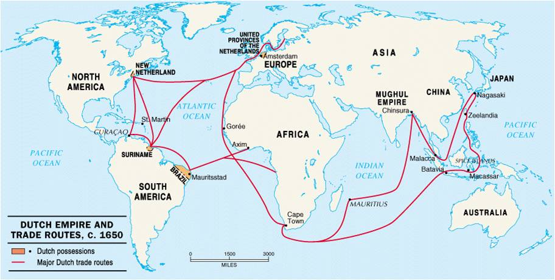
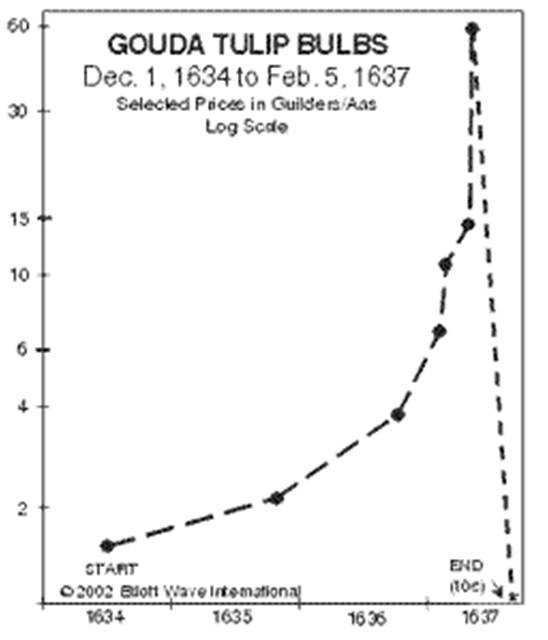
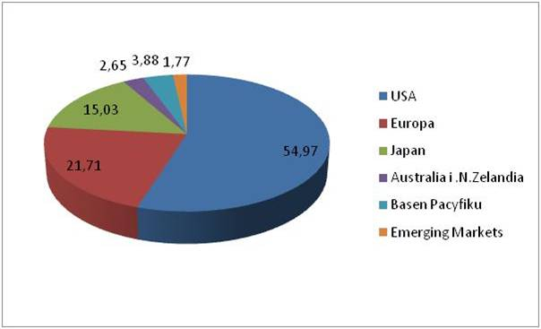
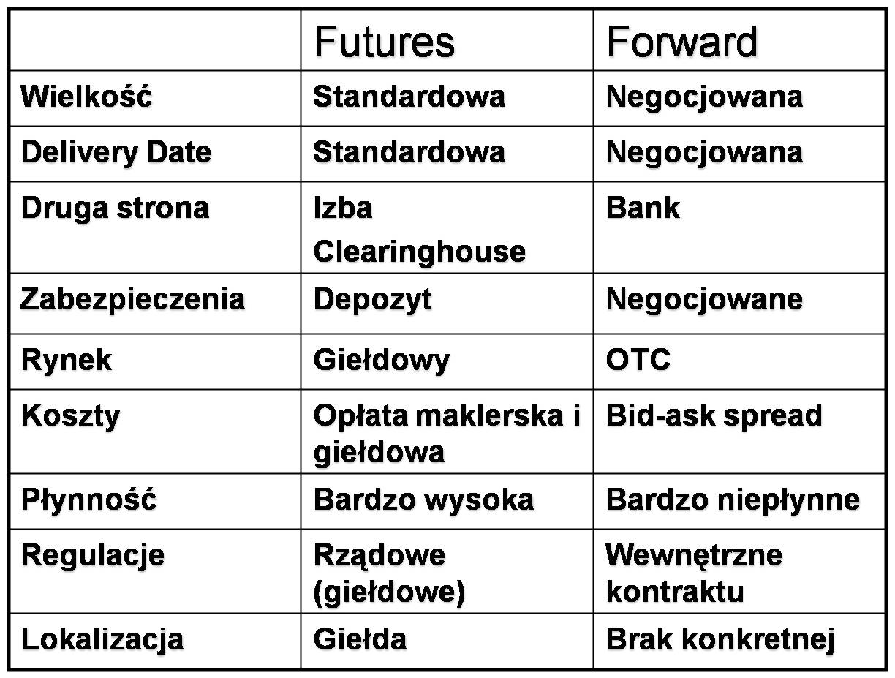
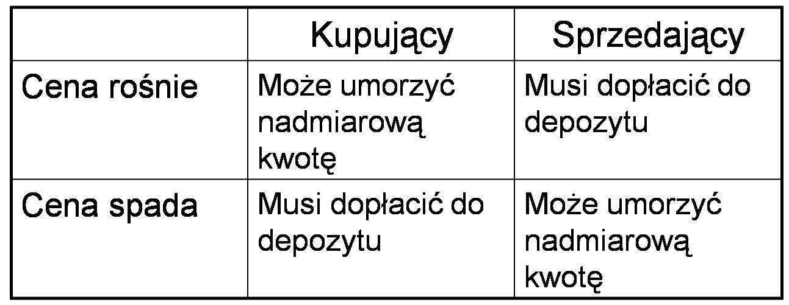

Rynek kapitałowy, instytucje i instrumenty
==========================================

Rynek kapitałowy - definicje
----------------------------

Jak było to już wspomniano wcześniej *Rynek finansowy* to rynek, na którym oczekiwania gotówkowe tych co mają w danej chwili gotówkę (pozycja – long) i tych którym w danej chwili jest jej brak i jej potrzebują (pozycja –short) spotykają się z sobą. *Rynek finansowy* to rynek, na którym przedmiotem obrotu są instrumenty finansowe.

Instrumenty finansowe, czyli umowy wiążące strony dotyczą różnych czasów ich trwania. Można wiec mówić o "czasie życia" instrumentów finansowych.

Biorąc pod uwagę aspekt czasu można zdefiniować **rynek kapitałowy** jako – rynek, na którym przedmiotem obrotu są instrumenty finansowe opiewające na wierzytelności pieniężne i o terminach płatności dłuższych niż 1 rok oraz takie, w których zawarte są prawa udziałowe w wybranych rodzajach podmiotów gospodarczych.
Element czasu odróżnia ten rynek od rynku pieniężnego zdefiniowanego w Rozdziale 4. a który to rynek służy temu by utrzymać bieżącą płynność finansową, dokonywane są tam transakcje instrumentami finansowymi o terminie do 1 roku.

Rynek kapitałowy – stwarza atrakcyjne miejsca lokowania kapitału dla inwestorów, a więc na tym rynku następuje transformacja oszczędności w inwestycje (*mobilizacja kapitału*). Dobrze funkcjonujący rynek kapitałowy powoduje wzrost przejrzystości obrotu gospodarczego oraz obniża cenę kapitału dla przedsiębiorców. Zwiększa elastyczność gospodarki w dostosowywaniu się do zmian oraz zwiększa jej innowacyjność.
Rynek kapitałowy kieruje przepływy kapitału do tych sektorów gospodarki, które zapewniają najefektowniejsze wykorzystanie funduszy (*alokacja kapitału*).
Inwestorzy inwestują na rynku kapitałowym kapitały w różne projekty, kierując się spodziewanymi zyskami z transakcji co pozwala na ocenę wartości kapitału i ryzyka inwestycyjnego związanego z procesem inwestowania (*wycena kapitału i ryzyka*).

Z rynkiem finansowym łączy się termin *papieru wartościowego*. Papier wartościowy – to dokument stwierdzający istnienie określonego prawa majątkowego w taki sposób, że bez posiadania tego dokumentu nie można wykonywać tego prawa, a przeniesienie własności tego dokumentu powoduje przeniesienie również tego prawa. Ta definicja podana za Encyklopedią Zarządzania ma swoje korzenie w czasach, gdy papiery wartościowe były rzeczywiście dokumentami papierowymi. Dziś są najczęściej zdematerializowanym zapisem elektronicznym.

Z punktu widzenia funkcji prawnych papiery wartościowe dzielimy na:

* papiery reprezentujące wierzytelności pieniężne (np. weksle, czeki, obligacje, bony skarbowe, listy zastawne, listy hipoteczne,), 
* papiery dokumentujące uprawnienia do współwłasności majątkowej (np. akcje), 
* papiery wartościowe uprawniające do zarządzania rzeczami (konosamenty w transporcie towarów).

Najpopularniejsze klasy papierów wartościowych to akcje i obligacje. Jak widać, **Obligacje** to papiery wartościowe, w których emitent potwierdza zaciągnięcie określonej kwoty pożyczki i zobowiązuje się do jej zwrotu właścicielowi obligacji w ustalonym z góry terminie oraz do zapłaty odsetek.

**Akcje** to papiery wartościowe stwierdzające uczestnictwo w kapitale spółki akcyjnej jej akcjonariusza, uprawniają do partycypacji w zyskach w formie dywidendy oraz do majątku spółki w razie jej likwidacji. 

Z punktu widzenia istoty papieru, to akcja jest dowodem posiadania udziału, a obligacja jest papierem dłużnym, potwierdzającym zobowiązanie emitenta wobec nabywcy

Krótka historia giełd i rynku kapitałowego
------------------------------------------

Giełdy to sztandarowe instytucje rynku kapitałowego. W różnych językach posiadają różne nazwy:
*bourse, bolsa, borsa, birża*, lub też anglosaskie *exchange*.  Exchange to z anglosaską prostotą i precyzją miejsce wymiany. Börse i nazwy mu podobne zastanawiają swym pochodzeniem. Na ich tle polska nazwa *giełda* wydaje się wskazywać na nieco inne korzenie. Polskie słowo "Giełda" ma swoje pochodzenie w flamandzkiej nazwie organizacji kupców - gilda. Również, podobne, holenderskie pochodzenie ma słowo "bourse" i mu podobne. Pochodzi od nazwiska znanej kupieckiej rodziny holenderskiej Van der Börse, u której w komnatach spotykali sie kupcy, aby omawiać swój udział i zaangażowanie kapitałowe w zamorskie wyprawy kupieckie.

*Kolonialne imperium holenderskie*

Powstanie i rozwój rynku giełdowego w Amsterdamie (1595-1602) [1]_
 

Na przełomie XVI i XVII wieku Amsterdam zdobywa znaczenie międzynarodowe. Holandia uniezależnienia się od wpływów Hiszpanii (upadek Antwerpii 1585). Następuję wzrost gospodarczy. Amsterdam staje się znaczącym centrum gospodarczym, do którego zewsząd ściągają wszyscy chętni, upatrując w mieście tym swej szansy życiowej. Szansy na poprawę warunków życia poprzez uczestniczenie w kreowaniu wzrostu gospodarczego. Przykładowo: między 1606-1620, 73% kobiet i mężczyzn, którzy zamierzali się pobrać w Amsterdamie urodziło się poza Amsterdamem.
Wzrost gospodarczy był związany z rozwojem handlu. Handlu na nowych, zamorskich rynkach.
Rozwój handlu stawiał nowe wymogi kapitałowe.

Przed rokiem 1500, dwumiesięczna wyprawa kupiecka do Francji, Portugalii lub Hiszpanii była finansowana przez jednego kupca, samego lub ze wspólnikiem i dotyczyła jednego statku i jednorazowej wyprawy.

Od 1565, bardziej ryzykowne i kosztowniejsze, trwające około 12 miesięcy wyprawy kupieckie do Ameryki Południowej, Afryki Zachodniej czy Karaibów, wymagały zawiązywania spółek większych kapitałowo i trwających dłużej. Zaczęto tworzyć spółki (umowy kupieckie) na czas nieokreślony - spółki określały wielkość zaangażowania kapitałowego - (udziały/ akcje). W spółkach „ brali” udział kupcy wiarygodni ze związków - gildii kupieckich.

W roku 1595 zaczęły się wyprawy do Azji.
Były cztery razy bardziej kosztowne niż wyprawy do Afryki czy Karaibów, ale i zwroty z importu przypraw z *Wysp Korzennych* (dzisiejsza Indonezja) czy też herbaty (którą do Europy przewieźli właśnie Holendrzy) były bardzo znaczące.
Podróż w dwie strony trwała około 24 miesięcy. Takie przedsięwzięcia wymagały od kilku do 15 lat na rozliczenie i rozwiązanie. 
Takie **inwestycje** wiązały się z **ryzykiem**. Na przełomie XVII i XVIII wieku 20% statków zaginęła na morzach.
Pojecie ryzyka wiązało się ściśle z prowadzeniem interesów i inwestowaniem. Na stałe weszło do języka kupieckiego. Angielskie słowo "venture", które tłumaczone jest na polski jako "przedsięwzięcie" znaczy po prostu - ryzyko. A "Joint venture" popularnie tłumaczone na "wspólne przedsięwzięcie" to nic innego jak wspólne ryzyko.
Angażowanie kapitału w tak długie projekty powodowały często problemy płynnościowe. Zaangażowany kapitał w projekt był w nim zamrożony na długi okres.
Taka sytuacja wymagała bardzo dalekosiężnych rozwiązań. Należało stworzyć szersze możliwości zbierania kapitału na nowe wyprawy kupieckie oferując w zamian "Udziały " (shares) w przedsięwzięciu, czyli proporcjonalny udział w zyskach i ryzyku do włożonego kapitału. (To, co dzisiaj nazywamy rynkiem pierwotnym). Ceny udziałów (akcji)  nie powinny być wysokie aby każdy, nawet posiadający mało pieniędzy mógł za nie nabyć udział w przedsięwzięciu , ryzykując  ich stratę ale z nadzieją na znaczny zwrot z tej inwestycji w przyszłości

W 1602 roku powstaje pierwsza udokumentowana Spółka Akcyjna - holenderska Kompania Wschodnioindyjska. Wielu małych posiadaczy kapitału utworzyło olbrzymia spółkę, która mogła prowadzić operacje zagraniczne, budować statki, zakładać faktorie itd. Udział w tej spółce był zabezpieczony dokumentem prawnym - akcją. Te dokumenty zabezpieczające udziały (securities) wskazywały, w jakiej części ich właściciel uczestniczył w zyskach i ryzyku. Ponadto te dokumenty mogły być przedmiotem obrotu.
Musiało więc, powstać rozwiązanie, pozwalające na możliwość sprzedaży(nabycia) udziałów w już funkcjonujących przedsięwzięciach (rynek wtórny). Tak powstały organizacje przypominające dzisiejsze giełdy papierów wartościowych.

Ponadto potrzebne było rozwiązanie pozwalające na sprawne sprzedanie przywiezionego z wyprawy kupieckiej towaru po najlepszej, aktualnej cenie.- (giełdy towarowe).
Co więcej, powstały rozwiązania pozwalające sprzedawać/ kupować prawa do towarów, które będą lub powinny być przywiezione z zamorskiej wyprawy. Tak powstały instrumenty pochodne *opcje* i kontrakty na dostawy w przyszłości w  określonym terminie za dzisiaj ustalona cenę - *kontrakty terminowe* i rynek, na którym były handlowane (giełdy instrumentów pochodnych).
W ten sposób powstały giełdy, które pozwoliły na niezwykłe przyspieszenie gospodarcze i wielki rozwój rynku kapitałowego. Instytucje te i rynek kapitałowy pozwalały na szybki wzrost gospodarczy, zdobycie kapitału, bogacenie się. Giełdy częściowo łagodziły ryzyko braku płynności, ale generowały kolejne rodzaje ryzyk, ryzyka rynków giełdowych.
Rozwiązanie, jakim były giełdy przetrwało do dziś, ale nie w kraju, gdzie powstały, ale w koloniach holenderskich a właściwie jednej z nich, położonej na kontynencie północnoamerykańskim u ujścia rzeki Hudson. W miejscu zwanym przez odkrywców Nowym Amsterdamem a dziś nazywanym Nowym Jorkiem.
Dlaczego tak się stało??? Powodem takiego stanu rzeczy jest (wtedy i dziś) niedocenianie ryzyka i bezpodstawne zaufanie, że można zarobić na transakcjach rynkowych, nawet nie rozumiejąc skąd się biorą zyski i jakie jest ryzyko z nimi związane.

Historia rozczarowań  powstałych skutkiem istnienia ryzyka na rynku kapitałowym, czyli wielkie kryzysy
~~~~~~~~~~~~~~~~~~~~~~~~~~~~~~~~~~~~~~~~~~~~~~~~~~~~~~~~~~~~~~~~~~~~~~~~~~~~~~~~~~~~~~~~~~~~~~~~~~~~~~

Szaleństwo tulipanowe w Amsterdamie (1637): początki regulacji rynku.

Około roku 1593 sprowadzono na tereny dzisiejszej Holandii tulipany z Turcji. Te pustynne kwiaty cieszyły się początkowo umiarkowanym zainteresowaniem. Wirusowa choroba mozaiki " *Flames of Color*, która niespodziewanie zaatakowała te kwiaty, spowodowała, że kwiaty te o dotychczas umiarkowanej palecie kolorów, zyskały niespotykane dotychczas kolory i kształty płatków. Nagle stały się modne i pożądane. 
Cena ich wzrastała o 2000% na miesiąc. Przykładowo; jedną cebulkę tego kwiatu sprzedano za 4 tony pszenicy, 8 ton zboża, łóżko, 4 woły, 8 świń, 12 owiec, komplet ubrania, 2 gąsiory wina, 4 tony piwa, 2 tony masła, 1,000 funtów sera, 1 puchar ze srebra).

*Cena cebulek tulipanów czasie kryzysu*

W 1637 roku [2]_, – kiedy bańka spekulacyjna osiągnęła swój maksymalny rozmiar – cena jednej cebulki najdroższych tulipanów wynosiła około 5,5 tys. guldenów, (a 50 guldenów wynosiła wtedy cena uncji złota - dziś, czyli, w roku 2010 cena złota osiągnęła wartość 1200 USD za uncję).Jak łatwo wyliczyć, była to równowartość dzisiejsza 132 000 USD. Średnia cena cebulki tulipana w roku 1637 wynosiła 784 guldeny-, czyli nieco poniżej dzisiejszych 19 000 USD. 
Tulipany jak i inne płody rolne charakteryzują się sezonowością dostaw. Z tego powodu handlowano nimi zawierając kontrakty terminowe i opcyjne. Wszyscy uczestnicy tych transakcji i dobrobytu, jaki kreowały wiedzieli, i byli pewni, że na tym procederze można tylko i wyłącznie zarobić. 
Aż nadszedł dzień, w którym dostawcy nie mieli komu sprzedać cebulek. A może była to tylko plotka?.
Nastąpił KRACH!!! Ceny raptownie zaczęły spadać a posiadacze kontraktów terminowych i opcyjnych zawartych przed spadkiem cen nie chcieli płacić tak wysokich cen za to, co miało obecnie niską cenę. Aby jakoś wybrnąć z zaistniałej sytuacji Władze przyjmują regulacje uznającą zawarte kontrakty futures i opcyjne za nieskuteczne. Po tym kryzysie gospodarka holenderska kulała przez dziesięciolecia.

Kryzysy Kompanii Mórz Południowych.

Kolejne kryzysy finansowe wybuchły niemal równocześnie na początku XVII wieku w Anglii, Holandii i Francji. Zaczęły tam powstawać spółki – często z udziałem państwa, – które miały przynosić olbrzymie zyski z handlu z terytoriami zamorskimi. Spółki te, na wzór holenderskiej Kompani Wschodnioindyjskiej, emitowały akcje by finansować swój wzrost i operacje. Emitenci tych akcji otrzymywali od Państwa przywilej monopolu prowadzenia tego przedsięwzięcia w zamian za obietnice rozwiązania problemów finansowych tegoż Państwa. Wizja olbrzymich zysków powodowała wzrost zainteresowania kupnem akcji. Ludzie zaczęli więc stopniowo inwestować w te akcje. Ceny tych akcji (np. Kompanii Mórz Południowych w Anglii, czy Kompani Missisipi we Francji) wzrosły w krótkim czasie wielokrotnie. Inwestorzy nie rozumieli jeszcze, że wartość akcji zależy wprawdzie od wyceny rynku, ale i od wiarygodności finansowej firmy, która za nimi stoi. Akcje stały się środkiem wymiany, zastępując częściowo pieniądze, które były w nie zainwestowane.
W przypadku Anglii jak i Francji scenariusz zdarzeń był bardzo podobny. Przykładowo w Anglii, idea założenia Kompanii [3]_ pojawiła się w 1710 r., a jego inicjatorami byli George Caswall i John Blunt. Rok później, przy wsparciu Roberta Hardleya, pomysł został zrealizowany i do istnienia powołano Kompanię Mórz Południowych. Jej działalność miała przypominać to, czym do tej pory z powodzeniem zajmował się Bank Anglii i Kompania Wschodnioindyjska, tj. udzielaniem pożyczek wspomagających obsługę długu publicznego. Tym samym, w zamian za monopol w handlu z Ameryką Południową, Kompania Mórz Południowych dokonywała konwersji długów państwowych. Wsparcie finansowe spółki, pozwalające na dokonywanie konwersji, stanowiła zaś emisja akcji Spółki.
Niepewność całego przedsięwzięcia była znaczna. Odległość była znaczna a wyprawy morskie trwały długo i nie zawsze dopływały do portów. Z pewnością, dlatego też w pewnym momencie posłużono się kłamstwem, że porty Hiszpanii będą obsługiwać statki Kompanii. Na wieść o tym ceny akcji Kompanii poszybowały w górę. Załamanie cen nastąpiło pod koniec lata, 24 września 1720r, kiedy upadł Sword Blade Bank a dyrekcje spółek zaczęły nerwowo wysprzedawać posiadane przez siebie akcje. Ceny spadły i nastąpił krach.
Krach odbił się zarówno na inwestorach krajowych, jak i zagranicznych. Jednym z nich był kanton Berno, który 14 kwietnia 1719 roku zainwestował w akcje Kompanii 150 tys. funtów. Kwota ta szybko uległa pomnożeniu w okresie hossy, lecz fortuna przepadła wraz z giełdowym krachem pociągającym za sobą liczne upadki instytucji finansowych, m.in. Malacrida & Comp, w którym przechowywane były środki kantonu. Jedną z osób poszkodowanych w kryzysie Kompani Mórz Południowych był Sir Isaak Newton - który to po kryzysie stwierdził *"Uczyłem się przewidywać  ruchy ciał niebieskich ale nie  ruchy człowieka na rynku"* [4]_. Zapewne tę wypowiedź i datę (1720r.) w przyszłości będzie przyjmować się jako datę narodzin "ekonofizyki"??
Władze, podobnie jak w kryzysie "tulipanowym", przyjęły w czerwcu *Bubble Act*, w którym zakazano tworzenia korporacji (zniesionego w 1825 roku) i unieważniono wyemitowane akcje.

Kryzysy opisane powyżej są wybranymi przykładami kryzysów finansowych w historii ludzkości. Spowodowały olbrzymie straty finansowe i pozbawiły nadziei na lepsze jutro olbrzymie i silne Państwa i ich mieszkańców. Dziesięciolecia musiały przejść by Państwa te wyszły z kryzysów aczkolwiek nie wszystkim się to udało.
Mechanizmy krachów finansowych są bardzo podobne, nie zależnie, kiedy i gdzie występują. Wskazują one na konieczność racjonalnej oceny ryzyka związanego z inwestowaniem. Właściwa ocena ryzyka jest podstawą równowagi dwu wielkich emocji rządzących rynkami i ich uczestnikami. Emocje te to **Strach** i **Chciwość**. Każdy, bowiem chce zarobić jak najwięcej, ale boi się ewentualnej straty zainwestowanych środków. Ocena ryzyka pozwala utrzymać te emocje w równowadze. Gdy górę bierze chciwość nad strachem, ceny zaczynają gwałtownie i niewytłumaczalnie rosnąć. Gdy strach, następuje paniczna wysprzedaż i spadek cen.
Konieczność racjonalnej oceny ryzyka i zarządzanie nim wydaję się właściwym zachowaniem na rynku w każdych okolicznościach.

Rynek giełdowy i OTC. Rola giełd na rynku kapitałowym
-----------------------------------------------------

Gdy Nowy York był małą faktorią handlową, otoczoną dla bezpieczeństwa murem, mur ten znalazł bardzo komercyjne wykorzystanie. Tam właśnie, spotykali się kupcy i pośrednicy handlowi, którzy na murze tym wywieszali informacje o towarach, jakie mieli na stanie i towarach, które przypłynęły na statkach, które to właśnie zawinęły do portu. Uliczka położona wzdłuż muru była też miejscem zawierania transakcji. Ulica ta, do dziś nazywa się tak samo, jak w wieku XVIII- Ulica Murowa czyli *Wall Street*.
 
17 maja 1792 dwudziestu czterech handlujących na Wall Street pośredników podpisało akt powołujący do życia najstarszą, funkcjonującą do dziś giełdę. Cel, jaki chcieli uzyskać to przyspieszenie obrotu towarami poprzez standaryzacje transakcji. Standaryzacja dotyczyła obrotu, wielkości transakcji i opłat z nimi związanych. Aby ceny mogły być właściwe dla sprzedawanych dóbr, transakcje obrotu nimi miały odbywać się publicznie, tak, aby każdy z upoważnionych do obrotu dobrami wiedział o transakcji i aby mógł, jeśli jest tylko zainteresowany, wziąć udział w transakcji. Celem było stworzenie sytuacji by ten kupował, kto dawał najwyższą cenę a ten sprzedawał, od którego chciano kupić za jego cenę a nikt nie dawał wyższej. Standaryzacja wielkości transakcji i jej warunków pozwalały na to, by handlujący mogli skoncentrować się tylko na negocjowaniu ceny. Aby każdy wiedział, jaka jest cena i jaka transakcja jest zawierana obowiązywała zasada " open outcry”, czyli publicznego, jawnego i głośnego jej zawierania. Dzięki takiemu mechanizmowi wymiana miała charakter jawny i każdy z sygnatariuszy mógł wziąć w niej udział. Z czasem sygnatariusze zawierali transakcje nie tylko w swoim imieniu, ale na rzecz i zlecenie innych kupców. Tak narodziły się zasady funkcjonowania rynku publicznego, obowiązujące w niewiele zmodyfikowanej formie, do dziś.
 
Ten wstęp pozwala na sformułowanie definicji giełdy.
**Giełda** – to organizowane w ustalonym miejscu i czasie sesje handlowe, na których przedmiotem obrotu są ściśle zdefiniowane dobra, w ilościach i jakości wystandaryzowanej, po cenach ogłoszonych w codziennych notowaniach. Transakcje zawierane są zgodnie z obowiązującym regulaminem, między członkami giełdy, którzy zawierają transakcje we własnym imieniu ale na swój własny rachunek jak i na rachunek swych klientów (pośrednictwo w transakcji kupna/sprzedaży).

Giełda to miejsce obrotu plus precyzyjne regulacje dotyczące: celu funkcjonowania giełdy, praw i obowiązków członków, organizacji władz, warunków i technik zawierania transakcji, form rozstrzygania sporów i reklamacji etc.

Dobrze funkcjonującą giełda powinna organizować regularne sesje, zapewniać powszechny i równy dostęp do informacji, zapewniać bezpieczne rozliczenia transakcji, posiadać szybki i bezawaryjny system informatyczny zapewniający szybkość transakcji, dbać o przejrzystość rynku, spółek i transakcji, zapewniać odpowiedni wolumen transakcji by minimalizować ryzyko braku płynności. To wszystko musi działać w oparciu o wewnętrzny, precyzyjny regulamin określający sposób jej funkcjonowania i kryteria doboru instytucji pośredniczących w handlu, przykładowo biur maklerskich.

Amerykański model struktury giełdy ma następujące cechy: giełda jest instytucją prywatno-prawną, jest zrzeszeniem kupców, pośredników i bankierów. Ma formę prawną spółki akcyjnej. Liczba Akcjonariuszy jest ograniczona. Członkostwo na giełdzie jest przedmiotem obrotu giełdowego. Tylko członkowie giełdy uprawnieni są do zawierania transakcji. Obecnie członek (akcjonariusz) giełdy to nie osoba fizyczna , a inwestor instytucjonalny mający prawo do świadczenia usług pośredniczenia w obrocie (usługi maklerskie).

*Udział poszczególnych kontynentów w obrocie giełdowym* [5]_

Rynek obrotu giełdowego  jest rynkiem publicznym i regulowanym.

Wiele towarów handlowanych jest poza giełdą, w bezpośrednim kontakcie kupującego i sprzedajacego a informacje o ustalonych w ich trakcie cenach nie są podawane do publicznej wiadomości. Ten rodzaj rynku nie jest szczególnie regulowany i nazywany jest rynkiem OTC (Over The Counter).

Obrót giełdowy jest obrotem bardzo wystandaryzowanym i szybkim. Wolumen obrotu na giełdach jest znaczący a ceny ustalane w transakcjach i podawane do publicznej wiadomości stają się cenami referencyjnymi względem, których wyceniane są posiadane towary (aktywa). Wycena taka nazywa się popularnie *"mark to market"* i jest uważana za  wycenę najbardziej odpowiadającą rzeczywistej wartości.

Rola giełdy, rola rynku obrotu giełdowego jest znaczącą dla rynków finansowych. 
Pozwala na atrakcyjną alokację kapitału umożliwiając przepływ kapitału w kierunku najefektywniejszego wykorzystania. Środki finansowe kierowane są w stronę aktywów mogących przynieść największe potencjalne zyski. Mechanizm ten pozwala wartościować i porównywać rynkowo ceny aktywów, towarów, usług, papierów wartościowych etc. Wymóg podawania do publicznej wiadomości wszelkich informacji które mogą mieć wpływ na cenę  dobra  handlowanego na giełdzie  zwiększa transparentność rynku i pozwala na  lepsze, bardziej świadome uczestnictwo w gospodarce i wgląd w rynek i w procesy kontroli nad tym od czego zależy cena. W przypadku giełd papierów wartościowych jawność informacji stwarza mechanizm kontroli nad działaniami spółek, których akcje znajdują się w obrocie publicznym.

Giełdy papierów wartościowych a ostatnio i giełdy innych aktywów pozwalają na lokowanie oszczędności celem ich powiększania. Z jednej strony inwestującym pozwala to na zabezpieczenie środków na realizację swych planów np. oszczędzania na emeryturę a z drugiej strony dostarcza środków na rozwój firm, w których akcje zostały zainwestowane. Giełda papierów wartościowych daje szczególne możliwości zdobywania kapitału na rozwój spółek.

Rodzaje giełd
-------------

Giełda to infrastruktura ułatwiająca obrót pewnymi dobrami. Ze względu na charakter tych dóbr giełdy możemy podzielić na :

Giełdy towarowe – handlują towarami masowymi, jakościowo jednorodnymi np. cukrem (Tokyo Sugar Exchange), bawełną (New York Cotton Exchange), diamentami (NYDEX – NY Diamond Exchange).
Metalami (Nymex, LME), i innymi produktami rolnymi.
 
Giełdy instrumentów pieniężnych – obrót walutami. 
 
Giełdy usług – giełdy frachtowe (transakcje kupna, sprzedaży przewozu ładunku; giełdy ubezpieczeniowe np. Rotterdam i Amsterdam.

Giełdy papierów wartościowych.
 
Mieszane – np. towarowo-pieniężne.

Biorąc pod uwagę rodzaj transakcji giełdy możemy podzielić na: 

Giełdy transakcji fizycznych i natychmiastowych, czyli giełdy gdzie handluje się aktywami, których dostawa następuje w najbliższym, możliwym i określonym regulaminem giełdy terminie. 

Giełdy terminowe – gdzie handluje się dobrami, których dostawa następuje w określonych i wystandaryzowanych terminach w przyszłości. 

Giełdy instrumentów pochodnych to giełdy gdzie przedmiotem obrotu są instrumenty finansowe, których cena jest uzależniona od ceny rynkowej aktywa podstawowego, z którym są związana np. Opcje na inne aktywa handlowane na rynkach.

Organizacja obrotu giełdowego, rola pośredników
-----------------------------------------------

Transakcja kupna sprzedaży na giełdzie np. papierów wartościowych, może dokonać tylko przedstawiciel Członka Giełdy. Ponieważ często pośredniczy w transakcjach, powinien, więc dysponować odpowiednią infrastrukturą pozwalającą na korzystanie z jego usług.

Pośrednicy, 

Pośredniczący w transakcjach giełdowych Członek Giełdy, to instytucja finansowa zatrudniająca odpowiednich specjalistów, których zadaniem jest pomóc inwestorom w zakupie aktywów giełdowych. Ponieważ obrót giełdowy jest mocno regulowany to i osoby zatrudniane przez pośredników (Biura Maklerskie) musza posiadać odpowiednie kwalifikacje. Kwalifikacje są sprawdzane i udzielane poprzez instytucje sprawującą nadzór nad rynkiem giełdowym w danym kraju. W przypadku Polski jest to Komisja Nadzoru Finansowego. Komisja ta licencjonuje nadawanie uprawnień do pośredniczenia w obrocie.
Na polskim rynku występują następujący specjaliści, którzy są uprawnienie do pośrednictwa: 
*Makler* - wysoko wykwalifikowany (licencjonowany) specjalista, który kupuje i sprzedaje akcje na rynku.
*Doradca inwestycyjny* jest licencjonowanym specjalistą mogącym doradzać, które akcje należy kupić lub sprzedać, często zarządza portfelem instrumentów finansowych. Jest za te czynności wynagradzany przez klientów.
Biuro Maklerskie to licencjonowana instytucja pośrednicząca w obrocie giełdowym i zatrudniająca licencjonowanych maklerów.
Jeśli Biuro lub makler przyjmuje i wykonuje w imieniu klienta zlecenie kupna/sprzedaży i jest za to opłacany jest nazywany *brokerem*- czyli działającym na rachunek i w imieniu klienta.
Jeśli pośrednik nabywa na własne konto i ryzyko aktywa by z własnego konta odsprzedawać je innym klientom, zarabiając na tym procederze to działa wtedy jako *dealer*.

Droga zlecenia

Droga zlecenia kupna/ sprzedaży aktywów na rynku giełdowym wygląda następująco: Klient kontaktuje się z Biurem Maklerskim, z którym ma już podpisaną umowę o współpracy i gdzie ma otwarte konto inwestycyjne. W Biurze tym składa zlecenie transakcji. Samo formalne złożenie zlecenia poprzedza krótka rozmowa. Zadaniem tej rozmowy dla maklera jest sprawdzenie czy klient właściwie formułuje zlecenie i taką właśnie ma intencję. Rozmowa z maklerem daje klientowi możliwość sprawdzenia, że makler dobrze rozumie zlecenie i przyjmując je wykona je właściwie. Taka rozmowa ma na celu uniknięcie błędów i pomyłek w trakcie zlecania. Pomyłki mogą nie tylko dotyczyć ilości jednostek aktywa czy też ceny ale i celu transakcji (kupno czy sprzedaż). Jeśli ilość zleceń składanych jest większą i częstotliwość ich składania staje się wyższa klient uznawany jest za profesjonalistę, rozmowa ulega skróceniu. Z czasem zlecenia przyjmowane są do realizacji bez rozmowy.

Po przyjęciu zlecenia, makler kontaktuje się ze swoim przedstawicielem na giełdzie i poleca mu wykonanie zlecenia. Przedstawiciel biura na giełdzie nabywa/zbywa aktywa zgodnie ze zleceniem i powiadamia Biuro o dokonanym zakupie /sprzedaży. Na koncie inwestycyjnym klienta następuje odpowiedni zapis zmiany stanu. Transakcja zostaje zakończona.

Rynek giełd "open  outcry".

Aby omówić, w jaki sposób nastąpiła transakcja kupna /sprzedaży na giełdzie, przez chwilę skoncentrujmy się na drodze zlecenia na klasycznym rynku amerykańskim, funkcjonującym w systemie " open outcry". W tym systemie funkcjonuje jeszcze wiele giełd a szczególnie towarowy rynek transakcji terminowych. Największa Giełda świata NY Stock Exchange do niedawna też prowadziła transakcje w tym systemie.
  
W tym przypadku Klient kontaktuje się z przedstawicielem brokera, który obsługuje jego operacje giełdowe i składa mu zlecenie. Zlecenie zostaje przyjęte a na dokumencie zlecenia pojawia się stempel czasu złożenia zlecenia. Rozmowa z Klientem też jest w obowiązku brokera. Broker kontaktuje się ze swoim przedstawicielem na giełdzie. Przedstawiciel giełdowy, siedząc koło telefonu przyjmuje zlecenie od brokera i zapisuje na odpowiednim formularzu, stempluje znacznikiem czasu i przekazuje je swojemu koledze firmowemu w miejscu zawierania transakcji (na parkiecie giełdowym – floor).

Giełdy amerykańskie to wielkie instytucje gdzie dzienny wolumen transakcji jest znacznie większy niż roczne obroty giełd w wielu krajach świata.

Historycznie transakcje mają miejsce na tym obszarze giełdy, który nazywa się *floor*. Nazwa, jak się można domyślić, wiąże się z tym, ze było to centralne miejsce giełdy, w którym spotykali się kupujący i sprzedający by publicznie i głośno (będąc widocznym przez innych) dokonać transakcji.
Ponieważ na tak wielkich amerykańskich giełdach handlowano różnymi rodzajami aktywów, to miejsce gdzie handlowano danym dobrem zwane jest *pit*. Wokół „ pitu” grupowali się sprzedający i kupujący by dokonać transakcji. Taki system obrotu powodował, to, że Ci, którzy szukali w tłumie drugiej strony transakcji i przekrzykiwali się nawzajem, ustalając ceny, nie mieli czasu na odbieranie zleceń. Tak więc " pit'y" obrosły stanowiskami telefonów gdzie przedstawiciele brokerów przyjmowali zlecenia od swoich firm, które z kolei obsługiwały tysiące klientów. Taki sposób funkcjonowania zwiększył obroty. Hałas transakcyjny na miejscach handlu trwa nieprzerwanie od otwarcia giełdy w danym dniu do jej zamknięcia.
Wracając do zlecenia Klienta, które trafiło do stanowiska telefonicznego brokera na parkiet (polski odpowiednik - floor) tam sporządzony został zapis zlecenia do przekazania go do egzekucji (tzw. „ticket”). „Ticket” został ostemplowany czasowo i przekazany do „ tradera”. Ten wykonał transakcje znajdując przedstawiciela drugiej strony transakcji i zwrócił ticket do stanowiska (znak czasowy i powrót do biura brokera. Systemy rozliczeniowe giełdy i brokera dokonują rejestracji i rozliczenia transakcji. Na koncie klienta pojawia się zapis o transakcji i zmiana stanu posiadania na jego koncie. Transakcja jest zakończona.

Kilkakrotnie już wspomniane było, że wynik transakcji giełdowej to zapis na rachunku. Jest to w pełni prawda w przypadku rynku akcji, który to rynek jest całkowicie *zdematerializowany*. 
 
Papier wartościowy przestał być papierem a jest teraz tylko zapisem na koncie.

O ile samo zawarcie transakcji na giełdzie systemu amerykańskiego wydaje się być naturalnie proste o tyle system komputerowy zawierania transakcji wydaje być procedurą mniej transparentną niż wykrzykiwanie swojej ceny aż ktoś się na nią zgodzi. Jednak systemy komputerowe stosowane są coraz częściej i nawet " stare" giełdy przechodzą na ten system ustalania ceny. Systemy komputerowe pozwoliły na kolejny krok w kierunku zwiększenia wolumenu transakcji. System komputerowy bowiem sam dokonuje znalezienie takiej ceny, po jakiej wolumen transakcji będzie największy. Wiele giełd w ten sposób ustala ceny produktu.

Uczestnicy rynków giełdowych.

Inwestorzy nabywają kontrakty giełdowe, aby nabyć dobra po ich zdaniem korzystnej cenie, w tym celu, aby przyczyniły się one do wzrostu ich przychodów i zysku bądź to: w drodze przetwórstwa nabytych surowców i ich zbycia (giełdy towarowe), bądź w drodze operacji finansowych (giełdy papierów wartościowych). Dużą płynność giełd, zmienność kursów skłania do zakupywania kontraktów by w późniejszym czasie odsprzedać je z zyskiem, gdy cena ich wzrośnie. Jak było to widać w przypadku kryzysów gospodarczych inwestowanie jest jednoznacznie związane z braniem na siebie ryzyka inwestowania. Ryzyka inwestowania to ryzyko poniesienia straty. Zarządzanie ryzykiem i techniki jego minimalizacji pozwalają na większą odwagę inwestowania doświadczonym inwestorom. 

Na rynkach giełdowych płynność jest zasługą tych inwestorów, którzy swoją szansę na zyski upatrują we zwyżkach i zniżkach kursu. Ich zadane to "tanio kupić i drożej sprzedać". Kupują kontrakty jeśli uważają, że są niedocenione i ich ceny wzrosną. Sprzedają je kiedy uważają, że jest właściwy moment na sprzedaż albowiem ceny: albo już więcej nie wzrosną albo są usatysfakcjonowani uzyskanym do tego momentu zyskiem i nie chcą dalej już ryzykować. Ci krótkoterminowi inwestorzy z angielska nazywani są " Speculators".
Okresy inwestowania są różne. Istnieje przykładowo bardzo liczna grupa inwestorów krótkoterminowych, dla których czasowy horyzont inwestycyjny to jeden dzień. Ci *" intraday investors"* zwani również *"scalpers"* inwestują licząc na zyski ze zmiany kursów w ciągu dnia.
Ze względu na zmienność cen w czasie istotnym parametrem składanego zlecenia jest cena.

Typy zleceń.

Pośrednik, u którego składa się zlecenie musi rozumieć intencje kupienia bądź sprzedania kontraktu. Klient powinien więc wykazać się, że wie w jakim celu składa zlecenie i jakie są jego intencje co do zakupionego dobra. 
Zlecenia składane mogą być do wykonania:

* Według stanu rynku - do wykonania natychmiast, czyli po aktualnej na rynku cenie kupna(Bid), lub cenie sprzedaży (Ask).

* Zlecenie może być wyzwalane przez cenę. Inwestor określa cenę, przy której zlecenie jest uruchamiane. Takie zlecenia to zlecenia typu - STOP, lub zlecenia z limitem.

* Zlecenia z limitem polega na wyznaczeniu ceny limitu, a następnie:
   * Zlecenie Limit-Buy: Kupuj, jeśli cena rynkowa jest niższa niż cena limitu
   * Zlecenie Limit-Sell: Sprzedaj, jeśli cena rynkowa jest wyższa niż limit.

* Zlecenie typu Stop, polega na wyznaczeniu ceny limitu a następnie:
   * Zlecenie Stop-Loss: Sprzedaj, jeśli rynek jest poniżej limitu.
   * Zlecenie Stop-Buy: kupuj, jeśli rynek jest wyżej od limitu.

Składanie takich typów zleceń pozwala inwestorowi na realizacje  założonej strategii bez konieczności ciągłego kontaktowaniu się  z maklerem i obserwacji rynku.

Giełdy terminowe, rola izb rozliczeniowych
------------------------------------------

Ceny wielu towarów zmieniają się w zależności od wielu czynników podlegając zasadom równoważenia podaży przez popyt. Bardzo trudno jest przewidzieć przyszła cenę. Prowadzenie takich firm jak np. kopalni miedzi, czy chociażby produkcji elementów konstrukcyjnych z aluminium odbywa się w sposób, który mimo niepewności rynkowej musi dawać możliwość planowania wyniku finansowego. Producent surowca musi przewidywać i antycypować sytuacje gdyby ceny jego surowca spadły do progu rentowności jego wydobycia. Producent drutu miedzianego musi planować produkcje i jej sprzedaż uwzględniając ceny miedzi, jako surowca, który zakupuje do produkcji.
Takiemu zabezpieczaniu sobie dostawy dobra w przyszłości za umówiona dziś cenę, służy przykładowo kontrakt forward. 

Definicja kontraktu forward.

Kontrakt forward to kontrakt zawarty w określony dzień, na wywiązanie się ze zobowiązania w określonym terminie w przyszłości na określonych warunkach. 

Taki kontrakt mimo tego, że zabezpiecza dziś cenę w przyszłości ma jednak pewne niedogodności. Niedogodności szczególnie boleśnie dają o sobie znać, gdy chcemy, z jakiś powodów się go pozbyć. Sprzedać możemy go tylko wtedy, gdy znajdziemy zainteresowanego nabyciem specyficznej (ustalonej przez nas samych) ilości dobra, daty dostawy i ceny. Znalezienie takiego kupującego może być niemożliwe. Instrumenty forward, sprzedawana na rynku OTC są bardzo specyficzne i szczególne, dopasowane do specyficznej sytuacji, w jakiej zostały zawarte. Nie nadają się do obrotu rynkowego, ze względu na brak płynności.
Aby nadać im płynność należy je wystandaryzować. Taka standaryzacja pozwala kupującemu mięć pewność, że wszystko jedno, od kogo kupuje, kupuje to samo i tej samej, jakości. 
Takie założenie legły u podstaw standaryzacji kontraktów terminowych, kontraktów *futures*.

Definicja kontraktu terminowego *futures*.

Kontrakt futures to zobowiązanie umiejscowione w przyszłości, do kupna lub sprzedaży, lub rozliczenia gotówkowego towaru, które spełnia zestaw standardów.
Kontrakty futures podlegają wyłącznie obrotowi giełdowemu (w odróżnieniu od kontraktów forward - handlowanych wyłącznie na rynku OTC).

Kontrakt futures jest uznawany za instrument pochodny. Instrumentem pochodnym nazywa się instrument finansowy, którego wartość zależy (wynika z) wartości innego podstawowego aktywa.

*Porównanie charakterystyk kontraktów futures i forward*

Standaryzacja kontrakty futures polega na zdefiniowaniu:

* *Podstawowego* towaru lub instrumentu. To może być zarówno, np. tona miedzi jak i krótkoterminowa stopa procentowa.
* Sposób rozliczenia kontraktu, rozliczenie pieniężne lub dostawa fizyczna.
* *Ilości* jednostek podstawowego towaru przypadającej na jeden kontrakt. Może to być przykładowo ilość ton miedzi, ilość baryłek ropy, czy jednostek obcej waluty.
* Waluta, w której kontrakt jest kwotowany.
* Specyfikacja, jakość dostawy. W przypadku obligacji określenie, które obligacje maja być dostarczone. W przypadku dostawy fizycznej towaru, dotyczy to nie tylko jego jakości, ale i sposobu i miejsca dostawy.
* Miesiąc dostawy.
* Ostatnia data, w której kontrakt może być handlowany.

Często kontrakt futures nie jest oparty o sprzedaż " tradycyjnego" towaru (płody rolne, metale, etc), ale dotyczyć może np. futures finansowych, czyli instrumentów opartych na walutach, akcjach, obligacjach, lub na bardzo niematerialnych indeksach giełdowych. 

Kontrakty futures mają swe początki w bardzo odległych czasach. Powstały z potrzeby zapewnienia sobie znanych cen na produkty rolne. Pewne zapiski historyczne wskazują na możliwość istnienia handlowania ryżem z przyszłych zbiorów 6000 lat temu w Chinach. W zapiskach Arystotelesa można znaleźć wzmiankę o Talesie z Miletu, który w oparciu o swą wiedzę oszacował przyszłe zbiory oliwek i zawarł na długo przed zbiorami kontrakty na oliwki po cenie określonej w dniu zawarcia transakcji. Jak mówią owe notatki, ponieważ było bardzo daleko do zbiorów ceny na te "przyszłe " oliwki były nie wysokie i gdy nastały zbiory, Tales chyba nieźle na tej transakcji zarobił.
Pierwsza w historii giełda futures to giełda ryżu Dojima w Japonii powstała w 1730 roku. Rynek ten powstał, aby uwzględnić sezonowość produkcji rolnej. Jego istnienie pomogło samurajom rozwiązać ich problemy płacy i życia. Samurajowie, bowiem byli płaceni ryżem. Często ryżem z następnych zbiorów. Potrzebne było, więc miejsce gdzie ten ryż (a szczególnie ten przyszły) mogli wymienić na pieniądze i to te dzisiejsze.

Cechy ceny kontraktu na rynku terminowym.

Cena kontraktów na rynku futures podlega wahaniom zależnym od punktu równowagi miedzy podażą a popytem w każdej chwili funkcjonowania rynku. Równowaga ta wyznaczana jest przez oczekiwania kupujących i sprzedających.
 
Głównymi uczestnikami rynku futures są:

* Producenci albo nabywcy surowców (commodities) handlowanych na giełdzie futures. Ta kategoria uczestników zwana jest *" Hedgers"* albowiem ich celem jest zabezpieczenie się przed ryzykiem zmiany cen.
* Speculators -  to grupa uczestników  rynku,  podobnie jak to ma miejsce na innych rynkach, to inwestorzy, którzy chcą zarobić na zmianie w przyszłości cen   kontraktów, które nabyli. Ta grupa nadaje rynkowi płynność. 

Zawieranie transakcji na rynku futures,

Rynek terminowy jest najbardziej spektakularnym rynkiem. Podobnie, jak ma to miejsce w przypadku innych giełd, transakcje odbywają się w określonych miejscach. Tak, więc w danym miejscu na giełdzie terminowej handluje się miedzią, gdzie indziej pszenicą. Ale kontrakty terminowe związane z danym towarem różnią się miedzy sobą nie tylko ceną , ale i  terminami dostaw. Ta różnica powoduję, że handel wygląda bardzo barwnie, kojarząc się raczej z olbrzymim chaosem okrzyków i gestów.
Hałas ten wprowadzają floor traders egzekwujący zlecenia swoich klientów. Poszukują oni w tłumie tych, którym mogą sprzedać lub, od których mogą kupić zlecone im kontrakty na dany termin i w ilości zgodnej ze zleceniem. Jeśli znajda druga stronę transakcji, mogą ją zawrzeć na zleconych warunkach. Informacje o zawarciu transakcji przekazują do " reporterów”, którzy, przy pomocy zdefiniowanych gestów, (aby uniezależnić się od hałasu) przekazują dane zawartej transakcji do systemu informacyjnego giełdy. Cena transakcji jest natychmiast podawana do publicznej informacji a ta informacja rozchodzi się natychmiast po całym świecie.
Oczywiście nawet negocjacja transakcji jest bardzo wystandaryzowana w warstwie gestów i kolejności wykrzykiwanych słów, tak by nie budziła wątpliwości przy jej zawieraniu.

Jak przebiega transakcja na rynku terminowym?
System jest prawie identyczny jak w przypadku giełd papierów wartościowych.
Pierwszy krok to kontakt z brokerem, u którego klient posiada otwarty wcześniej rachunek inwestycyjny pozwalający na przeprowadzanie transakcji. Broker ten odbiera zlecenie.
Następnie broker kieruje zlecenie do maklera parkiecie (odpowiedni pit) poprzez jego system transakcyjny. Makler na parkiecie egzekwuje zlecenie. Informuje swoje biuro o zawarciu transakcji, czyli wypełnieniu zlecenia. Broker informuje klienta, że zlecenie zostało wykonane.
Pierwsza istotna różnica w przeprowadzaniu transakcji na rynku terminowym pojawia się w tym miejscu. Po zawarciu transakcji klient musi wpłacić tzw. *"depozyt zabezpieczający"*, tzw. **'margin'**.

Depozyt zabezpieczający
~~~~~~~~~~~~~~~~~~~~~~~

\ 

*Zmiana ceny kontraktu a depozyty zabezpieczające*

Depozyt zabezpieczający ma za zadanie zmniejszenie ryzyka kredytowego stron zawierających transakcje.
Wielkość ta jest ustalana dla każdego towaru (commodity) osobno. Wielkość depozytu do kontraktu jest względnie niewielka i jest równa maksymalnej dziennej fluktuacji ceny i przeliczana jest na całkowitą wielkość transakcji. Wymagany poziomu depozytu to jest wielkość depozytu, która musi być utrzymana na rachunku inwestycyjnym uczestnika rynku terminowego futures.
Wielkość ta ulega zmianom zależnym od ruchu ceny rynkowej kontraktu. Jeśli stan depozytu jest niższy od wielkości wymaganej, dodatkowe środki musza zostać przelane na rachunek inwestycyjny (maintenance margin) tak by spełnić wymogi depozytu zabezpieczającego.  
 
Jeśli stan środków na koncie przewyższa wymagana wielkość depozytu, nadmiar środków może być umorzony, albo użyty do otwarcia nowej pozycji. 
Wielkość depozytu jest codziennie wyceniana do rynku “mark to market”, aby odzwierciedlać zmiany w wartości zajętej pozycji.

.. image:: media/Ffr.jpg
   :align: center
   :scale: 50%

*Wielkość depozytu a cena kontraktu- przykład*

 
Przykładowo [6]_:
Producent mleka sprzedał kontrakt futures na mleko po cenie 12,2 $ za jednostkę miary, a producent lodów kupił taki kontrakt. Transakcja miała miejsce 7 marca. (wartość zawartego kontraktu = 12200 USD) Zmiana wielkości depozytu zabezpieczającego dla sprzedawcy i dla kupującego pokazuje tabela obok.
Po zawarciu transakcji początkowa wysokość depozytu wynosi 800USD. Wielkość ta jest ustalana przez przepisy giełdy i warunki zawierania kontraktu na, w tym przypadku, mleko. Dla innych towarów jest to wartość z reguły inna. Gdy cena wzrasta, strona, która ma dostarczyć towar, którego wartość wzrosła musi dopłacić do depozytu, aby zrównoważyć wzrost ryzyka kredytowego. Kupujący towar o zmniejszonej wartości może wycofać odpowiednią cześć depozytu zabezpieczającego.
Wartość depozytu ustala się codziennie (dzień roboczy) po kursie zamknięcia kontraktu w danym dniu.

Depozyt zabezpieczający - **groźba dodatkowego ryzyka**.
Zawierając transakcję terminową i wpłacając żądaną kwotę depozytu otrzymuje się możliwość kontrolowania dość znacznej kwoty (cena kontraktu) poprzez stosunkowo małe zobowiązania do regulowania poziomu depozytu. Nie wolno wielkości depozytu traktować, jako należności związanej z kontraktem ani oceniać wielkość ryzyka finansowego związanego z transakcją, jako ewentualną stratę na zawartej transakcji. W dniu dostawy należy, bowiem dostarczyć (odebrać) wielkość równą cenie kontraktu a nie depozytu.

Izba Rozliczeniowa
~~~~~~~~~~~~~~~~~~

Rynek giełd terminowych różni się jeszcze jednym od rynku giełdowego transakcji natychmiastowych, czyli spot. Różnica ta, to rola Izby Rozliczeniowej dla giełd terminowych.
Każda Giełda futures ma swoja Izbę Rozliczeniową (Clearinghouse). Jest to organizacja związana z giełdą terminową odpowiedzialna za prowadzenie rachunków inwestycyjnych inwestorów, księgująca i rozliczająca transakcje, zbierająca wpłaty na depozyty zabezpieczające i kontrolująca ich stan, ściągająca powstałe zobowiązania, regulująca dostawy i dostarczająca informacji o cenach handlowanych dóbr.
Izba gwarantuje, że zawierający transakcję będą honorowali swe zobowiązanie. 
Izba rozdziela każda transakcję i występuje, jako jej druga strona.
Izba działa, jako kupujący dla każdego sprzedającego i jako sprzedający dla każdego kupującego.
Takie rozwiązanie eliminuje ryzyko kontrahenta.(Izba bierze ryzyko na siebie).
W praktyce tak, więc, pozycja futures może być „zlikwidowana” przez wykonanie transakcji odwrotnej z każdym, nie koniecznie oryginalnym kontrahentem.

Izbę tworzą firmy maklerskie, które są członkami rozliczającymi.
W przypadku niedotrzymania (plajty) kontrahenta, zobowiązanie finansowe spoczywa na:

* Depozycie zabezpieczającym kontrahenta
* Firmie maklerskiej rozliczającej transakcję
* innych członkach Izby
* Giełdzie

Jak dotąd żadna firma rozliczająca nie zawiodła w takiej sytuacji

Hedging czyli zabezpieczenie przed zmianami cen, hedging z użyciem instrumentów pochodnych
------------------------------------------------------------------------------------------

Zabezpieczanie sie przed zmianami ceny  jest praktyką stosowaną powszechnie , podobnie jak ubezpieczania się przed nieszczęśliwymi wypadkami.  Zabezpieczenie  nie polega na tym, że wydarzenie niekorzystne nie zajdzie  ale na tym ,że jak zajdzie, to skutki jego  nie będą dla nas tak bardzo dotkliwe.
Zarządzający portfelami, indywidualni inwestorzy, korporacje używają technik zabezpieczania - **hedgingu**, by zmniejszyć swą ekspozycję na rożne rodzaje ryzyka. Zabezpieczanie się na rynkach finansowych jest  jednak zajęciem bardziej złożonym i trudniejszym od kupienia polisy ubezpieczeniowej.  Hedging przed  niekorzystnymi zmianami cen polega na użyciu instrumentów finansowych tak,  by osunąć skutki niekorzystnych zmian kursów. Innymi słowy inwestor zabezpiecza inwestycje poprzez robienie innej inwestycji.

Technicznie dla zabezpieczenia przed zmianą ceny należy zainwestować w dwa  negatywnie skorelowane instrumenty finansowe. Bezpieczeństwo  nie jest za darmo więc należy za nie płacić w tej czy innej formie.
Przykładowo, ceny paliwa lotniczego (innymi słowy ropy naftowej)  są ujemnie skorelowane z cenami akcji linii lotniczych. Jeśli ceny paliwa lotniczego rosną, ceny akcji linii lotniczych maleją i odwrotnie. Jeśli w naszym portfelu będziemy posiadali odpowiednie ilości akcji linii lotniczych i  kontraktów na  ropę  to wartość tego portfela z dużym prawdopodobieństwem nie będzie się zmieniała (albo zmieni sie niewiele)  mimo zmian kursów  akcji  linii lotniczych i ropy naftowej.

Każda inwestycja na rynku finansowym obdarzona jest większym lub mniejszym ryzykiem. Inwestuje się  w celu zarobienia pieniędzy uzyskania zysku. Redukcja ryzyka zawsze wiąże sie z redukcja potencjalnych zysków. Tak więc, hedging  nie jest techniką, przy pomocy, której sie zarabia ale dzięki, której, zmniejsza się potencjalne straty. Inwestycja poczyniona celem zabezpieczenia jest dodatkowym kosztem i będzie przynosić straty i redukować zyski z inwestycji poczynionej dla zysku przy korzystnej zmianie cen. Natomiast  będzie przynosić zyski, gdy zmiana cen będzie niekorzystna dla inwestycji podstawowej, a zyski te  w skuteczny sposób zmniejszą ewentualne straty.

Techniki zabezpieczania , generalnie mówiąc, wymagają stosowania instrumentów pochodnych. Najbardziej popularne z nich to kontrakty futures i kontrakty opcyjne.  Dalej mówiąc  bardzo ogólnie, można wykorzystać te instrumenty w celu zabezpieczania  tak, by strata na inwestycji fizycznej była  zmniejszana przez zysk na instrumencie pochodnym. 

Jak to działa w praktyce?

 
Przykład. 1.

Załóżmy,  że jesteśmy szczęśliwymi posiadaczami akcji  firmy produkującej  kable elektryczne z miedzi "Kabel SA".    Chociaż wierzymy w to, że w długim okresie czasu akcje będą zyskiwać na wartości bo firma jest świetnie zarządzana i na wielkie perspektywy sprzedaży swych produktów ale obawiamy sie  zawirowań   krótkoterminowych na  światowym rynku kabli.  W celu  zabezpieczenia się przed efektami spadku notowań 'Kable SA"  kupujemy opcje put (instrument pochodny)  na akcje tej firmy, kontrakt dający nam prawo do sprzedania jej akcji za ustalona "strike price". Jeśli teraz  ceny akcji firmy spadną poniżej  " strike price" to cena  naszej opcji dającej nam prawo sprzedać akcje drożej zyskują na wartości i straty na akcjach są redukowane przez wzrost wartości opcji.

Przykład. 2.

Inny klasyczny przykład dotyczyć będzie zabezpieczenia od  ceny dostaw surowca. Wspomniana wyżej firma  "Kabel SA" zamartwia sie o zmieniające się ceny miedzi, podstawowego surowca, który musi ciągle kupować by prowadzić swą produkcję. Znaczny wzrost cen miedzi (głównego składnika kosztów firmy) przy dużej konkurencyjności rynku kabli mógłby pozbawić firmę ciężko wypracowanego zysku a nawet powodować straty.   W celu zabezpieczenia sie przed niepewnością  cen miedzi firma kupuje kontrakt futures , który daje jej pewność ceny surowca.
Firma może przestać martwic sie  o fluktuujące ceny na rynku. Ale tylko w pewnym zakresie. Jeśli bowiem, ceny przekroczą cenę  ustaloną w kontrakcie futures to "Kable SA" oszczędzą pieniądze kupując surowiec taniej. Ale jeśli ceny spadną poniżej ceny kontraktu futures,  "Kable SA" będą płacić cenę z zawartego kontraktu i ekonomiczniej dla  firmy byłoby wtedy nie być zabezpieczoną.

Na rynku  jest wiele różnych rodzajów opcji i kontraktów terminowych pozwalających na zabezpieczanie przed praktycznie wszystkim. Przed zmianami cen akcji, obligacji, cen surowców , zmianami kursów walut, stóp procentowych nawet przed  niekorzystną pogodą.

Każde zabezpieczenie kosztuje, tak więc należy zawsze rozważyć zanim zapadnie decyzja o hedgingu, jakie  korzyści uzyskamy z tej operacji i czy są warte poniesionych kosztów.

Należy pamiętać, że cel zabezpieczania to nie zarabianiu na  inwestycji zabezpieczającej ale zabezpieczenie sie przed stratami na inwestycji podstawowej. Kosztu zabezpieczenia, czy będzie to koszt opcji czy też strata  zysków poprzez kontrakt futures nie da sie uniknąć. Jest to cena płacona  za unikniecie czy tez zredukowanie niepewności.

Często porównuje sie  hedging do polisy ubezpieczenia. Polisa  ubezpieczeniowa jest  bardziej idealnym instrumentem zabezpieczenia niż hedging przy pomocy instrumentów finansowych. Wypłata z polisy bowiem w pełni rekompensuje poniesione straty (no może minus udział własny)  Natomiast hedging  na rynkach finansowych nie jest perfekcyjny i jest w pewnej mierze sztuką, a zdarzenia  zawsze mogą potoczyć się w niewłaściwą stronę. Chociaż  zarządzający ryzykiem zawsze starają się zabezpieczyć najlepiej , ale jest to bardzo trudne w praktyce.

Opcje, opcje na kontrakty terminowe
-----------------------------------

Definicja opcji jest następująca: jest to kontrakt, który daje nabywcy prawo, ale nie obowiązek, kupienia lub sprzedania aktywa, którego opcja dotyczy, za określoną cenę, aż do pewnej określonej daty. Opcja podobnie jak akcja, czy obligacja jest instrumentem finansowym, czyli wiążącym kontraktem o ścisłe określonych warunkach i właściwościach. 

Opcje to niezwykle użyteczne instrumenty, ale należy pamiętać, że ich użycie może nieść duże ryzyko. Należy o tym pamiętać, że bez względu na to, jakie opinie mają inni, transakcje opcyjne szczególnie są niebezpieczne dla kogoś, kto nie w pełni rozumie, co dokładnie robi. 

Jeśli nie zamierzamy używać opcji w celach spekulacyjnych to jest to, jeszcze jedno narzędzie do ograniczenia ryzyka w operacjach, jakie prowadzi się na rynku finansowym.

Jak działa opcja pokazuje przykład z życia codziennego.

Przykładowo: Dowiedzieliśmy się od znajomych, że można kupić bardzo sensowne mieszkanie, o dobrej lokalizacji i bardzo atrakcyjnej cenie. Problem polega na tym, że nie możemy go kupić natychmiast, ale dopiero za trzy miesiące. (Wtedy otrzymamy nagrodę za wyniki pracy w ubiegłym roku.).  Ceny mieszkań ulegają wahaniom rynkowym i nie wiemy ile takie mieszkanie może kosztować za trzy miesiące. Cena jego może znacznie wzrosnąć i tego się obawiamy. Ale może też i spaść, (czego może obawiać się sprzedający). Co możemy zrobić w takiej sytuacji?
Rozwiązanie, jakie można zaproponować sprzedającemu mieszkanie jest następujące:
Kupujący proponuje sprzedającemu pewną kwotę (powiedzmy- 3000PLN) za to, że jak zjawi się za trzy miesiące, to właściciel mieszkania sprzeda mu to mieszkanie za kwotę ustaloną dziś. W tym miejscu należy podkreślić, że nie jest to zadatek w poczet przyszłej transakcji - jest to opłata za prawo kupna mieszkania za trzy miesiące po niezmienionej cenie. Właściciel jest zobowiązany do trzymania mieszkania i nie sprzedania go, bez względu na to jak korzystna propozycje by uzyskał.

A kupujący (kupując sobie prawo korzystania z niezmienności ceny) ma następujące warianty postępowania do wyboru:

wariant 1.
Po określonym czasie zjawia się i z radością realizuje swój wymarzony zakup, po ustalonej cenie, (mimo, że mieszkania istotnie zdrożały przez ten czas). 

wariant 2. 
Po określonym czasie cena mieszkania (lub jego wartość dla kupującego) zmalała albowiem ceny mieszkań spadły, albo okazało się, że sąsiad z góry urządza głośne awantury po nocach. W takim przypadku posiadacz opcji kupna, albo nie zjawia się wcale by realizować zakup albo zjawia się i rozpoczyna negocjacje nowej, niższej ceny.
 
Jak widać **obowiązek** spoczywa na sprzedającym (**wystawcy opcji**) a **prawo** ma płacący za to prawo , **nabywca opcji**.

Posiadacz (kupujący opcje) „ traci” wszystkie pieniądze, jaki zapłacił za opcje, gdy rezygnuje z transakcji, ale przez czas obowiązywania opcji utrzymuje cenę dobra, które go interesuje na niezmiennym i korzystnym dla niego poziomie. (Jeśli realizuje kontrakt, na który wykupił opcje to też „traci” pieniądze za opcje, bo nie są one zadatkiem tylko ceną za niezmienność warunków). Wartość kontrolowanego kontraktu jest wielokrotnie wyższa niż cena, którą płaci za prawo kontrolowania ceny. Wystawca opcji dostaje dodatkowe pieniądze, za to, że przez określony czas nie zmieni ceny, (którą określił na zadawalającym go poziomie). Niestety traci wszelakie korzyści w tym czasie sprzedania posiadanego dobra za cenę lepszą (gdyby się pojawiła) albowiem zobowiązany jest do sprzedaży dobra posiadaczowi opcji. Niestety musi pamiętać, że właściciel opcji może zrezygnować z kupna.

*Opcja* i jej wartość (jej cena) jest związana z ceną aktywa, którego dotyczy, więc *jest instrumentem pochodnym*.

Generalnie są dwa typy opcji **call** i **put**: 

Opcja typu *call* daje, jej posiadaczowi prawo do kupienia określonego dobra po określonej cenie, przez określony okres czasu. Nabycie opcji tego typu (Call) przypomina zajęcie pozycji długiej (LONG) na rynku. Nabywca opcji *call* liczy, że cena tego dobra znacznie wzrośnie w czasie ważności opcji. 

Opcja typu *put* daje posiadaczowi prawo do sprzedania dobra po określonej cenie przez określony okres czasu. Nabycie opcji tego typu (Put) przypomina zajęcie pozycji krótkiej (SHORT) na rynku. Nabywca opcji *put* liczy, że ceny dobra spadną zanim opcja wygaśnie. 

Uczestnicy rynku opcji.

Są cztery typy uczestników rynku opcji w zależności od pozycji, jaką zajęli na rynku: 

1. Nabywca opcji *call* 

2. Wystawiający (sprzedający) opcję *call* 

3. Nabywca opcji *put*
 
4. Wystawiający (sprzedający) opcję *put*
 

Nabywcy opcji można powiedzieć mają Długą pozycję, a sprzedający, można powiedzieć mają pozycje Krótką.

Należy podkreślić bardzo istotną różnicę sytuacji prawnej (i finansowej) między nabywcami a sprzedającymi opcje:

* Nabywcy opcji *call* i opcji *put* nie są zobowiązani do kupienia lub sprzedania. Mają prawo wyboru wykorzystania opcji lub rezygnacji z tego przywileju w zależności od swego wyboru. 
* Wystawiający opcje *call* lub *put* (sprzedający), jednakże, są zobowiązani do kupienia lub sprzedania. Znaczy to, że sprzedający może zostać postawiony w sytuacji, gdy musi wypełnić swe zobowiązanie kupna lub sprzedaży. 

Jeśli opcje wystawiane są na kontrakty terminowe są opcjami rynku terminowego.
Na rynku terminowym opcje działają podobnie jak w przypadku kontraktów spot.
Call Option: prawo by kupić futures określoną cenę.
Put Option: prawo by sprzedać futures za określoną cenę. 
Jednak jest pewna różnica opcji na futures w stosunku do funkcjonowania rynku kontraktów futures. Dla każdej transakcji opcyjne musi być strona przeciwna- dla każdego sprzedania musi być kupujący a dla kupienia – sprzedający. Izba Rozliczeniowa nie jest stroną transakcji opcji na kontraktach futures.

Jak widać ryzyko w przypadku opcji ma inną charakterystykę niż w przypadku innych kontraktów. W przypadku typowego kontraktu np. kupna istnieje kontrakt " odwrotny" pozwalający na pozbycie się ryzyka związanego z otwartą pozycją. Jeśli coś kupiłem to wraz zawarciem kontraktu odwrotnego, w tym przypadku sprzedaży można pozbyć się ryzyka inwestycji. Miałem kontrakt i ryzyko z nim związane, zawarłem transakcje odwrotną i moje ryzyko jest równe zero.
W przypadku wystawienie opcji kupna ryzyko z nią związane nie zostaje zredukowane do zera przez  wystawienie opcji sprzedaży.

Jak widać wystawianie (sprzedaż) opcji jest bardziej skomplikowane i niesie w sobie większe ryzyko niż ich posiadanie (kupno).

Terminologia.

Terminologia rynku opcji  jest bardzo związana  z językiem angielskim, językiem rynku, na którym opcje bardzo sie rozwinęły.
Cena, za którą ma być sprzedawane lub kupowane dobro , na które wystawiona jest opcja nazywana jest  **strike price**. Oznacza to, że ceny dobra musza wzrosnąć (dla opcji call) lub zmaleć (dla opcji put) w stosunku do tej wartości, jeśli opcja może być użyta z zyskiem. Oczywiście skorzystać z opcji można jedynie przed datą jej wygaśnięcia, nie po.
 

Dla opcji *call*, opcje nazywamy **in-the-money** jeśli cena dobra jest powyżej ceny *strike price*. Opcja *put* jest  *in-the-money* jeśli cena dobra jest niższa niż *strike price*. Wartość, o którą opcja jest *in-the-money* nazywa się **intrinsic value**.

Koszt (cena) opcji jest ceną „pochodną” do ceny handlowanego dobra, ponadto zależy od czasu do wygaśnięcia, i zmienność  cen (volatility) dobra podstawowego. Wycena opcji nie wchodzi w skład tego opracowania. Ale można znaleźć informacje na ten temat w „Wybranych zagadnieniach analizy instrumentów finansowych” autorstwa tych samych piszących.

Opcje są bardzo skutecznym narzędziem zabezpieczenia przed efektami zmiany cen. Użycie opcji jest jakby wykupywaniem polisy ubezpieczeniowej. Takie zabiegi są istotne, szczególnie, dla dużych instytucji zarządzających wielkimi kontraktami, ale też bardzo korzystną techniką dla indywidualnego inwestora. Użycie opcji pozwala na skorzystaniu z możliwości czerpania nieograniczonych zysków, jeśli zmiany rynku idą w sprzyjającą nam kierunku , i  przy ograniczeniu strat z dołu, jeśli zmiany idą w kierunku przeciwnym. Koszt takiego zabezpieczenia nie jest wysoki.

----------

.. [1] w powstaniu oparto się na rysunkach i informacjach zawartych w "Role of Law in stock market development" (2005) - publikacja dostępna  na www.fetp.edu.vn
.. [2] zgodnie z informacjami zawartymi w książce *Extraordinary Popular Delusions and the Madness of Crowds* (napisanej w 1841roku) przez brytyjskiego poetę i dziennikarza, Charlesa Mackaya
.. [3] zestaw informacji można znaleźć na Wikipedii- wersja anglojęzyczna- South sea Bubbles, lub we wspomnianej wcześniej książce *Extraordinary Popular Delusions and the Madness of Crowds*
.. [4] "I have learned to predict the movements of celestial bodies but not the movements of man in markets"  wypowiedz podana za - www.people.bradies.edu_blebaron/classes; jednakże inne źrodła podają nieco inne brzmienie wypowiedzi, ale o podobnym sensie....maddnes of the men"
.. [5] obliczenia własne
.. [6] na przykładzie pokazanym w "introduction to futures and options contracts"- Risk management to Dairy Industry- www.dairy.nu

