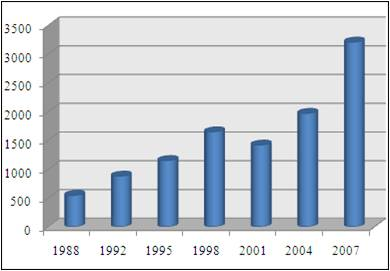
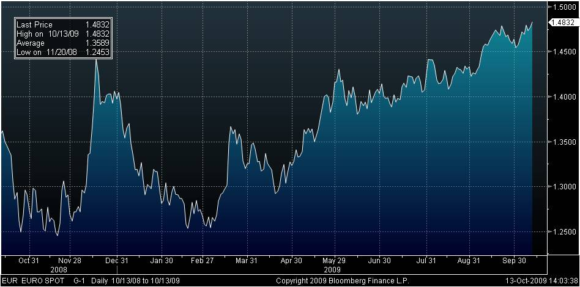
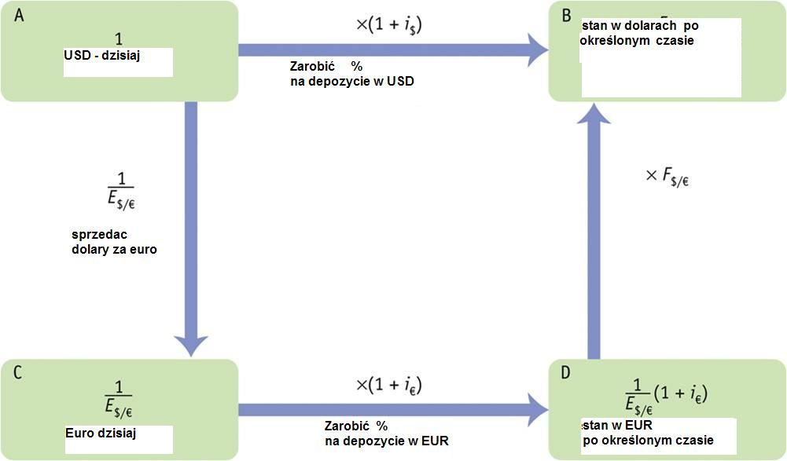
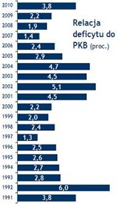
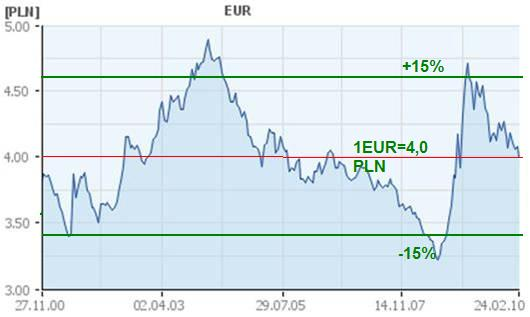
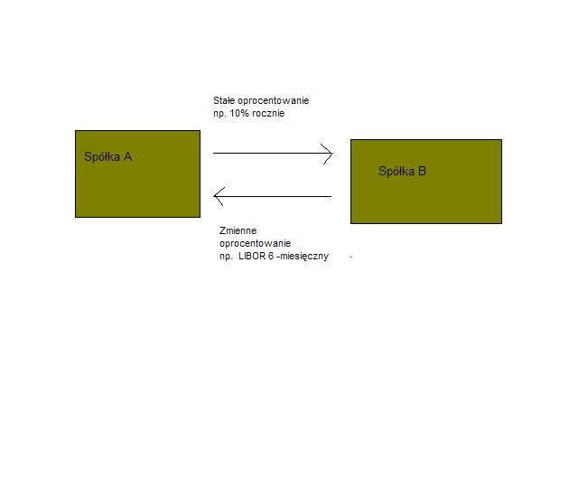
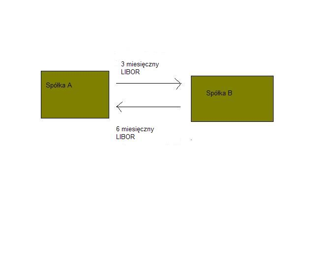
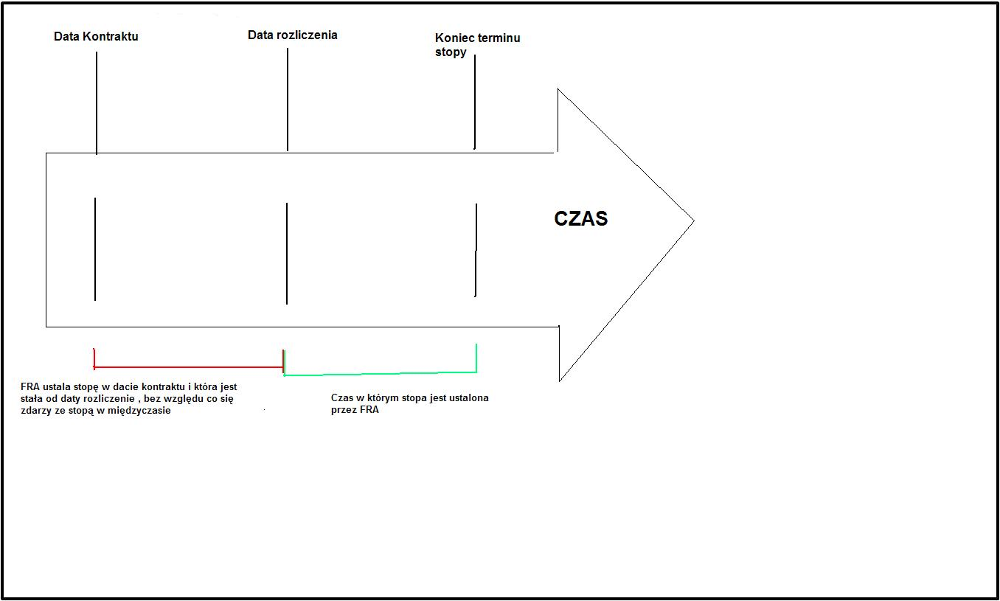
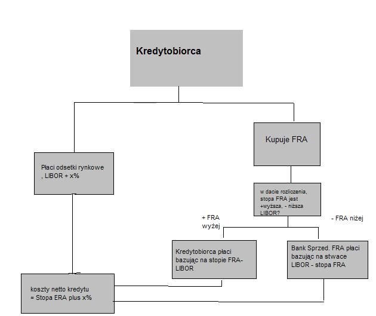
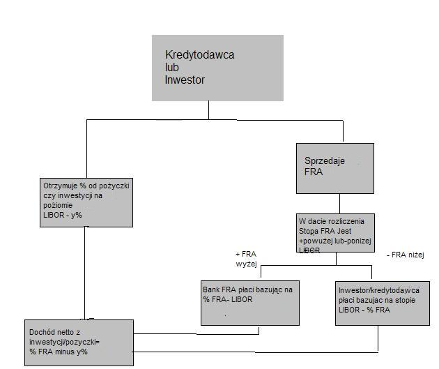

Rynek wymiany walut
===================

Rynek FX- wymiany walut
-----------------------

Rynki finansowe to miejsce, gdzie pieniądz transferowany jest do tych, co go potrzebują od tych, którzy w danym momencie czasu dysponują jego nadwyżką.
Handel to najstarsza ludzka aktywność. Polega ona na wymianie dóbr. Środkiem tej wymiany jest pieniądz. Pieniądz jest miarą wartości dobra.

Handel ma charakter globalny. Pieniądz, nad wartością, którego czuwa Państwo (lub ich związek), ma charakter lokalny.
To niedopasowanie usuwa rynek wymiany walut. Innymi słowy rynek wymiany walut istnieje skutkiem globalnego zasięgu handlu a lokalnego zasięgu waluty.

Obsługa wymiany walut to jedna z najdawniejszych funkcji pośredników rynku finansowego, którzy od wieków świadczyli te usługi na rzecz kupców. W miastach włoskich usługi te świadczono na rozłożonych na rynku ławkach (*banco*) i stad wywodzi się nazwa tej instytucji - bank. To, że był to interes bardzo ryzykowny świadczy inne popularne dziś słowo. Jeśli bowiem któryś z pośredników trudniących się wymianą walut "wypadał" z rynku na znak swego niepowodzenia zwyczajowo ławkę (*banco*) łamał (*rumpere,rupture)*  - i w ten sposób ogłaszał jako bankrupt swoje bankructwo.

Rynek, na którym przedmiotem wymiany są waluty to rynek wymiany walut.
Cena jednej waluty jest określana w jednostkach innej waluty. Kurs wymiany walut (kurs walutowy) to cena waluty jednego kraju wyrażona w jednostkach waluty innego kraju.
Waluty, czasem zwane dewizami to płynne, zagraniczne należności pieniężne, często depozyty zagraniczne, także czeki i weksle.
Kursy wymiany ustalane są przez rynek i charakteryzują się dość znaczną zmiennością. Każda transakcja wymiany wiąże się z *ryzykiem* zmienności *kursu wymiany*.

Globalna wymiana dóbr- handel globalny spowodował, że rynek wymiany walut jest największym rynkiem finansowym, biorąc pod uwagę wolumen transakcji.
Przykładowo dzienny wolumen transakcji w przykładowym dniu (kwiecień 2007 Dane- Bank for International Settlement BIS)  to  3,2 biliony USD.
Aby sobie lepiej uzmysłowić wielkość to 3 wyprzedza 12 cyfr. Od tego czasu wolumen dziennego obrotu rynku wymiany walut (Forex) wzrósł.

*Rynek Forex - dzienny wolumen transakcji w mld. USD*

Taka wielkość obrotu jest dziesięciokrotnie większa od dziennego, globalnego obrotu na rynku akcji.  Jaki wielki jest to rynek świadczy inne porównanie. Wielkość rynku jest taka jakby każdy mieszkaniec Ziemi (od niemowlaka do najstarszego starca) wymieniał dziennie 500 USD.

Rynek wymiany walut zwany a ang. Foreign Exchange (Forex) to rynek OTC (over the counter), czyli zdecentralizowany rynek nie wystandaryzowanych transakcji, gdzie transakcja odbywa się przy kontakcie strony kupującej ze sprzedającą w dowolnym miejscu. Rynek ten nie posiada jakiejś szczególnej lokalizacji(w przeciwieństwie do rynku giełdowego), ale można mówić o pewnych centrach rynku Forex na świecie.

Rynek transakcji forex charakteryzuje:

* bardzo wysoka płynność (na głównych walutach)
* praktyczny brak przerw w jego funkcjonowaniu. Pracuje bez przerw z wyjątkiem weekendu, rynek startuje o godz20.15 (GMT) w niedzielę i kończy swe operacje w piątek o 22.00.
* bardzo niska marża transakcyjna
* olbrzymia ilość czynników wpływających na zmianę kursu walutowego.
* Wysokie ryzyko kursowe.

Głównymi walutami świata są: dolar amerykański- USD- ponad 43% udziału w obrotach na rynku, Euro - EUR- ponad 17% udziału w obrotach, Jen japoński JPY- ponad 8% udziału, funt brytyjski GBP-7% i frank szwajcarski-CHF-3,5%. Oznaczenia literowe walut są  standardem rynku Forex.

Waluta polska na rynku finansowym oznaczana jest skrótem - PLN.

Na rynku tym najbardziej aktywnymi uczestnikami są banki, które zajmują się transakcjami spekulacyjnymi i zabezpieczającymi dla swych klientów i banki centralne, prowadzące swe działanie celem ustalania kursu waluty narodowej i zarządzania rezerwami walutowymi.

Najbardziej znaczącym uczestnikiem tego rynku jest Deutsche Bank - który dokonuje 21% transakcji na tym rynku. Drugim jest szwajcarski bank USB z ponad 15% udziałem w rynku.

Płynność na rynku Forex.

Płynność rynku największa jest w godzinach pracy Londynu. Największa płynność miedzy12.00 – 16.00 LDN (London i NY pracują).
Płynność zależna jest od lokalnych rynków (np. Waluty skandynawskie *Scandis* są niepłynne w godzinach pracy Azji, podobnie waluty azjatyckie niepłynne są w czasie pracy NY).
Zmniejszenie płynności redukuje rozmiar transakcji i zwiększa spread.

Główne waluty jak np. EUR czy USD są płynne całą dobę.

Wielkość transakcji, jaką da się przeprowadzić, zależy od pary walut i pory dnia,
100 milionów USD dla EUR/USD nie jest dużą kwotą, ale dla USD/NOK to jest już duża kwota.

Kursy wymiany walut
-------------------

Kursy wymiany walut są zależne od szeregu czynników. Ważnym czynnikiem fundamentalnym zmiany kursów jest poziom stóp procentowych.
Wyższe stopy przyciągają kapitał zagraniczny. Wyższe stopy procentowe to szansa na wyższy zysk z transakcji depozytu w danej walucie. Inwestorzy często pożyczają w walucie niżej oprocentowanej i inwestują w waluty o wysokim oprocentowaniu. Takie transakcje są zwane *Carry trade*.
Innymi czynnikami zmienności kursów są: sytuacja gospodarcza danego kraju, rachunek obrotów bieżących, wzrost gospodarczy, pogorszenie gospodarcze, inflacja, bezrobocie.
Na zmianę kursu mają także wpływ inne czynniki takie jak: Analiza techniczna, trend  na rynku.

Każdy może widzieć rynek inaczej i kierować się innymi jego aspektami. Rynek często zachowuje się tak jakby ignorował w/w czynniki. Koniecznym jest by potrafić się znaleźć na rynku w każdych warunkach.
Każdy uczestnik rynku kieruje się swoimi opiniami – jedni patrzą na dane podstawowe (analiza fundamentalna), inni kierują się analizą techniczną a większość własną mieszanką tych metod. Na rynku nie ma sposobu by mieć zawsze rację, należy więc zachować ostrożność i pokorę.

Kwotowanie

Dla określenia kursu wymiany przyjęto następujące zasady:
*Kwotowanie proste* - czyli stała ilość obcej waluty zrównana z walutą lokalną.

Przykładowo:
100USD = 277 PLN

*Kwotowanie odwrotne* - czyli stała ilość pieniądza lokalnego zrównana z waluta obcą.

Przykład:
100PLN = 36,10 USD

Na globalnym rynku Forex przyjęty został tzw." Dolar standard"- czyli zmienna ilość lokalnego pieniądza za 1 USD. w ten sposób określa się kursy i podaje kwotowania. Wyjątek stanowi funt brytyjski, który jako wcześniejszy od standardu dolarowego też zajmuje znaczące położenie i inne waluty też są względem niego kwotowane (nawet dolar amerykański).

Na rynku Forex każda waluta posiada dwie ceny. Te ceny to cena kupna i cena sprzedaży. Są one różne. Różnica między ceną kupna a ceną sprzedaży nazywa się "spread".
Banki zawsze kupują USD za inną walutę po niższej cenie (cena kupna) a sprzedają po cenie wyższej (cena sprzedaży). Bank zawsze przeprowadzi transakcje w najbardziej korzystny dla siebie sposób.

Przykładowo: Kurs wymiany

---------------------------------------------

USD/PLN= 2,7687/ 2,7722- czyli kupno/sprzedaż

---------------------------------------------

Jeśli sprzedajemy 10 000 USD - dostajemy 27 687 PLN a jeśli kupujemy 10 000USD- płacimy 27 772 PLN.

*Kurs wymiany spot Euro- USD w czasie*

Jeśli  ustala się kurs wymiany walut mniej popularnych  to określa się  dla nich tzw. Kursy "cross". Nazwa pochodzi ze sposobu liczenia. Jeśli oblicza się kurs waluty A względem waluty B, to wyznaczanie kursu następuje poprzez wycenę względem dolara. Waluta A jest sprzedawana za USD a następnie za uzyskaną kwotę w USD kupuje się walutę B.
 
Przykład. JPY/PLN

Przykład – firma Toshiba sprzedała w Polsce komputery za złotówki. Jak zakwotuje bank japoński kupno złotówek za jeny? (kurs USD/PLN jak w przykładzie powyżej)

-bank kupi USD za PLN-2,776
bank sprzeda USD za JPY- 90,32 (notowanie bankowe NBP z momentu wyliczania przykładu)
 
Czyli wyliczony kurs wymiany wynosi - Kurs(cross)= 2,776/90,32 = 0.03078

Dla porównania kurs bankowy NBP PLN/JPY z dnia i godziny odczytania powyższych danych wynosił = 0,0308 /  0,0309)- czyli otrzymaliśmy znaczącą zgodność obliczeń z rzeczywistymi notowaniami.

Gdy kursy wymiany ustalane są w sposób powyższy i wymiana dokonywana jest natychmiastowo to taki kurs (i transakcja) jest nazywana * spot*.

Kurs wymiany transakcji *spot* a kurs transakcji terminowej - *forward*, ryzyko kursowe
---------------------------------------------------------------------------------------

Banki działające na rynku wymiany walut kupują i sprzedają waluty swoim klientom. Ich stan "posiadania" walut zmienia się bardzo szybko. Ich całkowita ekspozycja na rynku Forex jest inna niż wynikająca z bilansu przeprowadzenia transakcji kupna i sprzedaży walut dla klientów.
Głównym tego powodem jest ryzyko kursowe. Jak już było wspomniane, kurs waluty ulega szybkim wahaniom i może to mieć istotny wpływ na rentowność przeprowadzanych operacji dla banku. Banki nie kupują potrzebną walutę dla klienta, raczej  stosują transakcje *swap* (zakup natychmiastowy/ sprzedaż terminowa) aby pozyskać potrzebną walutę. Taka transakcja obniża bowiem ryzyko kursowe banku.

Przykład:
Bank rozliczający się w USD potrzebuje polskie złotówki. Zamiast prosto kupić je w transakcji natychmiastowej *spot* bank jednocześnie sprzeda je terminowo. Będzie miał w bilansie kredyt w złotówkach, ale zero w pozycji wymiany.
Jeśli pozycja długa (Ma) *Long* jest równa pozycji krótkiej Short (winien) w przypadku waluty to w tej sytuacji używa się terminu *square*- czyli , że nie ma ryzyka wymiany.

Ze względu na wahania kursowe, które występują ciągle na rynku wymiany walutowej, Dealing Room - czyli bankowy zespół dokonywujący transakcji wymiany walut, musi bez przerwy monitorować swoją ekspozycję na ryzyko kursowe i obserwować swoją całkowitą pozycję w transakcjach natychmiastowych  spot i pozycjach terminowych.

Transakcje  terminowe *forward*.

Klienci banków, tak jak i one same prowadząc działalność gospodarczą mają często potrzebę ustalenia  kursu  wymiany  nie tylko na " dziś " ale też w przyszłości. Przykładowo firma mająca swą filię w innym kraju spodziewa się transferu wyniku finansowego wypracowanego w filii do centrali. Wynik finansowy (wielkość transakcji) jest znany, ale nie wiadomo po jakim kursie bank dokona wymiany walut na walutę w jakiej firma prowadzi księgowość i rozliczenia finansowe. Znajomość kursu w wybranym momencie w przyszłości jest istotna  dla działania firmy, wiec banki winne umieć je określać.

*Możliwości lokowania w dwu walutach*

Nazwa - transakcja terminowa forward - stosuje się dla wymiany walut w określonym momencie czasu w przyszłości po określonym wcześniej(dziś) kursie. Kontrakt forward jest to zabezpieczenie dostawy waluty w przyszłości, na określonych warunkach.
Stosuje się w celu zabezpieczenia przed ryzykiem zmiany kursu.

Wyliczenie kursu wymiany terminowej *forward*.

Do wyliczania terminowych kursów wymiany należy wziąć pod uwagę stopy procentowe obowiązujące w strefach walut wymienianych. Rysunek obok ilustruje przykład. Załóżmy, że wymieniane waluty to Euro i USD. Posiadając jedną z nich np. USD (pkt A) możemy ulokować ją na depozyt terminowy o oprocentowaniu z rynku dolarowego. Po określonym czasie będziemy dysponować kwotą podstawową powiększoną o wypracowany w czasie procent. (punkt B)
Możemy alternatywnie wymienić USD na Euro (punkt C) i otrzymaną kwotę ulokować na depozycie terminowym w strefie Euro. Niech okres depozytu i terminu transakcji forward to rok. Po tym czasie w strefie euro będziemy dysponować uzyskana w punkcie D kwotą powiększoną o zarobiony procent (punkt D). Wynik lokowania w obu walutach powinien być sobie równoważny, więc kwota z punktu B odpowiada wartości kwoty z punktu D. Porównując ilości jednostek waluty w pkt. B i w punkcie D pozwala na wyliczenie kursu wymiany w określonym terminie. Tak wyliczany kurs wymiany jest kursem terminowym - forward.

Przykład:

Niech 1 USD w transakcji spot wymieniany jest na 1,842 CHF (franka szwajcarskiego).

Niech roczna Stopa procentowa w dolarach = 7.125%

Niech roczna stopa procentowa w CHF= 4,625%

Klient potrzebuje dokonać wymiany tych walut za 94 dni.

Transakcja opiewa na kwotę 1000000 USD

A więc licząc w USD i lokując w tej walucie po 94 dniach klient będzie dysponował kwotą równą 1000 000 USD + 18 604,17USD (odsetki za 94 dni)+ 1018604,17 USD

Licząc we frankach:

Po wymianie otrzyma  1841000 CHF + 223232,63 CHF (odsetki za 94 dni)=1 863 232,60CHF

Z podzielenia kwoty we frankach przez kwotę w dolarach uzyskujemy kurs terminowy wymiany za 94 dni = 1,8292 franka za dolara.

Kursy wymiany a handel międzynarodowy
-------------------------------------

Znając kurs wymiany między walutami dwu krajów, możemy ocenić ceny eksportowe produktów jednego kraju w cenach, w walucie drugiego kraju. Kursy wymiany walutowej wpływają na decyzje o wydatkach konsumpcyjnych, gdyż pozwalają nam na porównanie cen w różnych krajach na wspólnej płaszczyźnie. Przykład: W Internecie znajdujemy kurtkę, która bardzo nam się podoba. Kosztuje 50 USD. Cena w PLN za kurtkę, przy kursie PLN 2,77 za dolara wynosi (50x 2,77)= 138,50 PLN. Jeśli cena takiej kurtki w lokalnych sklepach jest wyższa od 140 PLN wolimy ją kupić za granicą niż w kraju. (Dla uproszczenia koszty transportu kurtki do kraju wynoszą 0 PLN). Jeśli natomiast cena takich kurtek w naszym kraju jest niższa niż wynikająca z przeliczenia cena 138,5 PLN to zastanawiamy się nad możliwością eksportowania tych kurtek do kraju, w którym kosztują 50 USD, by zarobić na tej różnicy cen. Taki sposób myślenia dotyczy wszystkich towarów. A więc kurs walutowy ma wielki wpływ na kształtowanie polityki eksportu i importu państwa i ma swoje odzwierciedlenie w bilansie płatniczym państwa.

Kursy wymiany walut ulegają zmianom. Jedna waluta może wzmocnić swą pozycję względem innej (więcej jednostek waluty 2 za tyle samo jednostek waluty pierwszej) lub osłabić swoja pozycje (więcej jednostek waluty pierwszej jest potrzebne teraz by otrzymać tę samą ilość waluty 2.).

Wzrost wartości waluty nosi nazwę aprecjacji a jej spadek nazywany jest deprecjacją.
W szczególnym przypadku (stosowania sztywnego kursu walutowego) można mówić o *dewaluacji* – gdy skutkiem zabiegów administracyjnych ulega obniżeniu kurs waluty narodowej wobec innych walut. Takie operacje są przeprowadzane przez bank centralny np. w celu poprawienia bilansu płatniczego. W przeciwieństwie do dewaluacji, podwyższenie oficjalnej ceny waluty danego kraju w stosunku do innych walut nazywa się rewaluacją.	
O rewaluacji i dewaluacji można mówić w przypadku stosowania systemu kursów stałych.

Jaki jest wpływ zmian kursu walutowego na eksport i import kraju?

W przypadku deprecjacji rodzimej waluty następuje wzrost w cenach w rodzimej walucie, obcej waluty. Czyni to rodzime produkty tańsze (bardziej atrakcyjne) dla obcokrajowców a obce produkty droższe dla krajowców. 
W przypadku aprecjacji rodzimej waluty, następuje obniżka cen obcej waluty. Czyni to rodzime towary droższymi dla zagranicy a obce towary tańsze dla krajowców. 

Jak widać opłacalność importu i eksportu zależą od relacji cenowych towarów na co znaczący wpływ na kurs wymiany walut.
Czyli aprecjacja waluty: podnosi względne ceny dla eksportu (osłabia eksport).
Obniża względne ceny importu (stymuluje wzrost).
Deprecjacja waluty , natomiast obniża względną cenę eksportu (stymuluje jego wzrost).
Zwiększa względną cenę importu (osłabia import).
Deprecjacja (aprecjacja) lokalnej waluty względem innych walut czyni eksport tańszym(droższym) a import droższym (tańszym).

Nie bez znaczenia dla lokalnej waluty i sytuacji gospodarczej jest związek osłabienia czy wzmocnienia waluty z inflacją.

Prześledźmy związek atrakcyjności eksportu/importu na przypadku wystąpienia dewaluacji.

Zawsze istnieją takie dobra i usługi zagraniczne (np. dobra inwestycyjne, surowce potrzebne do produkcji), które mimo dewaluacji będą importowane. Ich ceny na rynku wewnętrznym wyrażone w lokalnej walucie po dewaluacji będą wyższe. Inflacja przeniesie się na całą gospodarkę. Wzrost cen dóbr i usług zagranicznych spowoduje potrzebę do zastępowania części importu produkcją krajową, która staje się opłacalna z reguły dopiero wtedy, gdy cena sprzedaży jest konkurencyjna do ceny dóbr importowanych przed dewaluacją wyrażonej w lokalnej walucie. Wzrośnie popyt na eksport, co powoduje potrzebę przesunięcia środków produkcji z produkcji przeznaczonej na rynek krajowy. Tym samym nakłady na produkcję eksportową stają się wyższe niż przed dewaluacją.

Kurs wymiany a stopy procentowe
~~~~~~~~~~~~~~~~~~~~~~~~~~~~~~~

Kursy wymiany są określone przez rynek FX. Jak już było wspomniane podlegają one wahaniom rynkowym i zależą w dużej mierze od równowagi między podażą a popytem na rynku.
Istotną rolą w rynku FX odgrywają transakcje terminowe. Ceny w transakcjach terminowych (jak już zostało to wykazane w rozdziale opisującym sposób wyliczania kursu terminowego forward) mają ścisły związek z oprocentowaniem depozytów na rynkach poszczególnych walut.
Waluta jest aktywem które jest inwestowane na rynkach walutowych. Inwestor, tak jak z każdej inwestycji oczekuje maksymalnego zwrotu na aktywach jakimi zarządza. Inwestując jedna walutę na rynku depozytów zagranicznych inwestor, co prawda zna stopę oprocentowania depozytów, i stąd wie jaką ilością waluty obcej będzie dysponował w chwili zakończenia depozytu, ale nie wie (nie ma pewności) jaki będzie rynkowy kurs wymiany, gdy depozyt zapadnie. Popyt na depozyty w obcej walucie podlega tym samym uwarunkowaniom co popyt na każde inne aktywa.

Ryzyka, jakie są związane z inwestycją to: ryzyko zmiany rynkowej wartości i ryzyko płynności.

Posiadający martwią się o dwie cechy aktywów, oprócz zwrotu na nim:

* Ryzyko zmienności rynkowej- zmienność wartości aktywa, które ma wpływ na stan posiadania. 
 
* Płynność -czyli miara łatwości z jaką aktywo może być sprzedane albo wymienione na inne dobra. 

Jak widać zwrot na depozytach handlowanych na FX (Forex) zależy od stóp procentowych i oczekiwanych zmian kursu.

Równowaga na rynku FX wymaga zachowania parytetu stóp procentowych. Rynek FX znajduje się w stanie równowagi gdy depozyty we wszystkich walutach oferują te same  zwroty na zainwestowanych aktywach (ROA).
 
Warunek parytetu stóp procentowych

* Spodziewane zwroty na depozytach w dwu dowolnych walutach są równe gdy mierzone są w tej samej walucie. To powoduje, że potencjalni właściciele depozytów w obcych walutach widzą je jako równo atrakcyjne aktywa.

Deprecjacja lokalnej waluty dziś obniża spodziewany zwrot w lokalnej walucie na depozycie w obcej walucie. Aprecjacja lokalnej waluty dziś zwiększa zwrot w lokalnej walucie na depozycie w walucie obcej.
Aby móc zdecydować czy kupić depozyt w EUR czy USD, należy obliczyć zwrot w dolarach na depozycie w euro.

Na aktualny kurs wymiany maja wpływ zmiany w jego oczekiwanym przyszłym poziomie.

Podsumowująć:

* Dla danych stóp procentowych i danych oczekiwaniach przyszłych kursów wymiany, warunek parytetu stóp procentowych mówi nam o aktualnych równowagowych kursach wymiany. Przykładowo: Wzrost dolarowej (euro) stopy procentowej powoduje aprecjację dolara (deprecjacje) do euro(dolara).
* Na aktualny kurs wymiany maja wpływ zmiany w jego oczekiwanym przyszłym poziomie.

ERM II - (Exchange Rate  Mechanism II) - Europejski Mechanizm Kursów Walutowych
~~~~~~~~~~~~~~~~~~~~~~~~~~~~~~~~~~~~~~~~~~~~~~~~~~~~~~~~~~~~~~~~~~~~~~~~~~~~~~~

Czyli zasady przystąpienia do strefy Euro. 

Jak dotychczas, rozważania dotyczące pieniądza podkreślały globalny charakter handlu i lokalny charakter waluty. Lokalny charakter waluty jest wynikiem roli Państwa i jego wpływu na pieniądz. Pojęcie pieniądza i jego siła jest bardzo silnie powiązane z Państwem jako twórcą i egzekutorem prawa. „Istoty waluty nie stanowi materiał, z którego zrobiona jest moneta, ale prawne rozporządzenia określające zasady jej używania.” - cytat z pracy G.F. Knappa (1905) [1]_ bardzo precyzyjnie określa ten związek. Obszar, na którym funkcjonuje jeden pieniądz ograniczony jest z reguły granicami państwa. To państwo nadzoruje jakość pieniądza i jego siłę. Zdarza się, że jeden pieniądz jest środkiem płatniczym na terenie kilku państw. Granice funkcjonowania jednego pieniądza jak i przesłanki tworzenia trwałej unii monetarnej wyznaczają czynniki polityczne i gospodarcze. Tworzenie unii monetarnych ma na celu uzyskanie korzyści z wprowadzenia wspólnej waluty na terenach krajów tworzących taką unię. Unia walutowa powinna mieć na celu podniesienie dobrobytu zamieszkującej go ludności powyżej poziomu osiągniętego, gdyby kraje te funkcjonowały osobno. 
Operacja utworzenia unii to skomplikowana operacja integracji w jeden organizm rynku finansowego, towarowego, pracy oraz koordynacji polityki makroekonomicznej oraz co bardzo istotne, integracja polityczna.

Kryteria z Maastricht

Są to kryteria przyjęcia euro przez kraje członkowskie Unii przyjęte w 1991 roku w Maastricht.
Dotyczą pięciu tzw. "kryteriów nominalnych”, czyli:

* Dwa fiskalne, dotyczące:
   * deficytu budżetowego
   * długu publicznego
* Trzy kryteria monetarne:
   * Stabilności cen
   * Stabilności stopy procentowej
   * Kursu walutowego

Ponadto dochodzi kryterium "polityczne", którego zadaniem jest zapewnienie niezależności Banku Centralnego.

*Deficyt budżetowy*

Warunek poziomu deficytu budżetowego określony został następująco: deficyt sektora instytucji rządowych i samorządowych – rzeczywisty lub planowany ..”nie większy niż 3% produktu krajowego brutto*.

*Poziom długu publicznego*

Dopuszczalna wielkość długu publicznego została określona w ten sposób, że dług sektora wydatków publicznych – jako % produktu krajowego brutto – *nie większy niż 60%*.

Kryteria monetarne

*Stabilność cen*

Określona została poprzez dopuszczalny poziom inflacji nieprzewyższający więcej niż 1,5% ponad średnią stopę inflacji trzech najlepszych krajów Unii Europejskiej.

*Stabilność stóp procentowych*

średnia nominalna długoterminowa stopa procentowa nie może być wyższa niż o 2 % od średniej stopy długoterminowej obliczonej dla trzech krajów Unii o najniższym wskaźniku inflacji w roku poprzedzającym badanie.

*Kurs Walutowy*

To kryterium ma na celu zapewnienie stabilności kursu waluty przed przystąpieniem do Unii Gospodarczej i Walutowej.  W praktyce oznacza to 

* uczestniczenie w Europejskim Mechanizmie Kursowym (ERM II) przez 2 poprzedzające badanie lata.
* kurs waluty własnej zbliżony do kursów centralnych w ERM II - utrzymanie normalnego pasma wahań (przyjętego przez kraj, nie większego niż +/- 15%) w stosunku do kursu centralnego wobec euro
* niedokonywanie dewaluacji wobec euro 
* utrzymanie zbliżonego do ERM II kursu walutowego nie wywołuje konieczności przeprowadzania interwencji walutowych oraz wahań krótkookresowych stóp procentowych.

Analizując sytuacje naszego Kraju w aspekcie przystąpienia do Unii Gospodarczej i walutowej rozpatrzyć należy aktualne wielkości określone kryteriami a charakteryzujące gospodarkę naszego kraju.

*Dług publiczny jako % PKB w Polsce wg. Ministerstwa Finansów*

* Deficyt Budżetowy

Wielkość deficytu budżetowego w Polsce ilustruje rysunek w niniejszym tekście. Dla porównania deficyt w USA wyniesie w roku 2009 -12,9 % 
a w roku 2010- 8,5%. Jest to bowiem rok (2009) gdy skutki kryzysu są widoczne w największych gospodarkach świata a gospodarka naszego kraju nie odniosła większych uszczerbków. 

* Dług publiczny

Dług publiczny w Polsce wyniesie w latach 2010-2012- od 54.7 do 55% PKB- wg. Ministerstwa Finansów. Należy pamiętać, że w roku 2009 – skończyliśmy spłacać Klub Paryski, czyli zadłużenie z okresu gospodarki socjalistycznej, a które to zadłużenie było powodem kłopotów gospodarczych, które z kolei, doprowadziły, w sferze gospodarczej, do upadku tej formy gospodarki w Polsce. 

* stabilność stóp procentowych.

Dane na podstawie Raportu EBC o konwergencji z maja 2008 wskazują, że w okresie od kwietnia 2007 – do marca 2008 wartość referencyjna wyniosła 6,5 % [2% + średnia arytmetyczna (Malta 4,8%, Holandia 4,3%, Dania 4,3%]. 
Poziom długoterminowych stóp procentowych w Polsce w badanym okresie wyniósł 5,7%

* Stabilność cen - czyli inflacja.

Dane na podstawie Raportu EBC o konwergencji z maja 2008: w okresie od kwietnia 2007 do marca 2008 wartość referencyjna wyniosła 3,2 %[1,5% + średnia arytmetyczna (Malta 1,5%, Holandia 1,7%, Dania 2%]. Inflacja w Polsce w badanym okresie wyniosła 3,2% 

* Kurs walutowy

Kryzys finansowy lat 2008/2009 wprowadził znaczące korekty wielu relacji w gospodarce. W 2008 roku nasza waluta mocno skorygowała dotychczasowy trend relacji EUR/PLN a jej wartość znalazła się w okolicach nawet 4,50 PLN za EUR. Od czasu maksymalnego osłabienia złotego, złoty powoli ma tendencje do umacniania. 

*EUR/PLN- kurs średni 27.11.00 do 24.02.2010*

Dopuszczalne pasmo wahań +/- 15% dla kursu 4,0 PLN=1 EUR daje przedział 3,40 do 4,60 PLN i zostało naniesione na wykres.
Gdyby Polska miała przystąpić do Unii z dzisiejszym kursem Euro (tj. na poziomie 4,0 PLN) to dopuszczalne pasmo widać na wykresie. Dzisiaj nie jest dokładnie określona data przystąpienia Polski do strefy Unii Walutowej.

Etapy przystępowania do strefy Euro.

Integracja Polski ze strefą Euro nastąpi etapami:

* Etap I-Przygotowanie do wejścia do ERM II i wejście.
 
Zaczynając liczyć czas od chwili podjęcia decyzji o wejściu do ERMI do włączenia PLN do ERMII - powinno wg. planów Ministerstwa Finansów trwać ok. 6 miesięcy.

* Etap wypełnienia warunków konwergencji.

Ten etap, jak to już było powyżej wyjaśniane, musi trwać 2 lata. Dwa lata wypełniania warunków konwergencji uznaje się za koniec tego etapu. Dodatkowo kraj nasz musi spełnić wszelkie wymogi stowarzyszenia.

* Etap przygotowania do wprowadzenia Euro w Polsce.

Przewidywany jego okres to ok.6 miesięcy. Działania to przygotowanie zmian cen wymiany złotego na Euro, jej zasad i infrastruktury oraz inne techniczne aspekty tej zamiany. Gdy etap ten zostanie zakończony.

**Polska przystąpi do strefy Euro**.
Od podjęcia decyzji do przystąpienia powinno upłynąć 3 lata.

Dlaczego Polska zamierza przystąpić do strefy Euro?

Poniżej krótka analiza możliwych zysków i strat:
Zyski:

* ograniczenie ryzyka kursowego
* ograniczenie kosztów transakcyjnych
* wzrost zaufania rynków finansowych i walutowych
* stabilność waluty - zmniejszenie podatności na ruchu kapitału spekulacyjnego

Możliwe zyski:
napływ inwestycji, mniejsze wahania cyklów koniunkturalnych, wzrost zaufania do kraju
wzrost obrotów handlowych z krajami strefy euro.

Straty

* brak możliwości kształtowania własnej polityki pieniężnej
* brak możliwości regulowania napięć gospodarczych korektą kursu walutowego. 

Przypadek Grecji (2010) jej problemów gospodarczych i napięć społecznych jest przykładem sytuacji, w której regulacja kursowa waluty greckiej (samodzielnej i kształtowanej przez bank grecki) mogłaby być rozwiązaniem problemów jednego Państwa i nie wpływałaby na gospodarki innych krajów członkowskich Unii. Jednakże korekcja wartości waluty w Grecji nie wchodzi w rachubę. Walutą Grecji jest euro, tak jak i innych krajów członkowskich Unii. Korekta Euro miałaby niekorzystny wpływ na gospodarkę innych krajów członkowskich. W przypadku Grecji należy szukać innych rozwiązań. Niestety, unia monetarna powoduje, że kłopoty krajów członkowskich stają się kłopotami całej Unii.

Możliwe straty: 

To zmniejszenie konkurencyjności gospodarki na tle innych krajów strefy euro,
zmniejszenie obrotów handlowych z krajami spoza strefy euro, 
konieczność uelastycznienia płac i zwiększenia mobilności kapitału społecznego, 
wzrost cen w pierwszym okresie, na skutek korekty cen oraz tendencji do zaokrąglania cen „w górę”

Ryzyko kursowe i stopy procentowej, zabezpieczenie. Kontrakty swap i FRA
-------------------------------------------------------------------------

Wyobraźmy sobie własną, polską spółkę, która musi inwestować za granicą. Na przykład chce budować fabrykę w USA. W Europie spółka ta jest znana wśród banków i posiada wysoką zdolność kredytową , co ma potwierdzenie w niskim oprocentowaniu udzielanego spółce kredytu ale kredyt jest w EUR a nie w USD. Na rynku amerykańskim nie jest znaną i tamtejsze instytucje finansowe nie chcą udzielić jej kredytu na tak znakomitych jak w Europie warunkach. Co może zrobić nasz spółka?
Ryzyka, jakie widzi myśląc o finansowaniu budowy to ryzyko kursowe i ryzyko stóp procentowych.
Najkorzystniej byłoby dla niej finansować swoje zobowiązania dolarowe z kredytów w euro.
Musi dokonać zmiany strumieni pieniężnych na jednym rynku na strumienie na drugim rynku. Tak transakcja nosi nazwę SWAP.
Swap może być pomocny również naszej spółce w innej sytuacji. Załóżmy ,że w spółce zapadła decyzja o finansowaniu instrumentami krótkoterminowymi ale skutkiem zmian na rynku kredytowym  spółka zamierza użyć instrumentów długoterminowych. W takiej sytuacji zamiana czyli kontrakt typu swap jest właściwa.

SWAP
~~~~~~~~~

Transakcje SWAP można podzielić na dwie kategorie:

* SWAP’y WALUTOWE, które pozwalają na wymianę płatności w dwu walutach, przy czym jedna strona transakcji dokonuje transakcji w jednej walucie a druga strona w drugiej walucie 
* SWAP’y STÓP PROCENTOWYCH - czyli wymiana płatności miedzy dwoma stronami gdzie wielkość nominalna jest taka sama a płatności obu stron dotyczą innego oprocentowania.

Swap’y służą do zabezpieczania się przed ryzykiem zmiany stóp procentowych na rynkach międzynarodowych.

SWAP STÓP PROCENTOWYCH.

Generalnie występują dwa typy tego rodzaju swapu:

Swap kuponowy

*SWAP KUPONOWY*

Najbardziej typowy swap dotyczy wymiany płatności opartej na zmiennej stopie na płatność opartą o stopę stałą.

Na ilustracji spółka A zgadza się wykonać płatność do spółki B liczoną w oparciu o zmienne oprocentowanie (np. LIBOR 6 – miesięczny) ustalonej kwoty. W zamian Spółka B zgadza się dokonać płatności odsetek od tej kwoty dla stałego oprocentowania (np. 10% na rok) Wymiana płatności nastąpi co 6 miesięcy.

SWAP  bazowy

*SWAP bazowy*

Mniej powszechny niż poprzedni. Dotyczy wymiany płatności opartych o zmienne oprocentowanie, ale dla różnych rodzajów stóp procentowych.
W przypadku swapu bazowego strony wymieniają  płatności oparte na jednym rodzaju zmiennej stopy procentowej(np. 3- miesięczny LIBOR) na inne płatności oparte o inną zmienną stopę oprocentowania. (np. LIBOR 6- miesięczny)

SWAP jest transakcją zawierana przez dwie strony. Banki jednako pośredniczą w transakcjach i są stroną dla każdej części transakcji zawierając oddzielne kontrakty swap z obu stronami (klientami). Banki zarabiają na różnicy między tym, co płacą jednej ze stron a tym, co otrzymują od drugiej.

Płatności wynikające dla stron z kontraktu swap dotyczą tego samego nominału kwoty, ale nie następuje tu żaden transfer tejże kwoty ani inna forma zmiany własności. Raczej mówi się o wymianie oprocentowania, ale nie wynika z tego, że następuje tu jakaś pożyczka.

Kontrakt swap reguluje okresowość płatności. Najczęściej są to okresy półroczne, ale mogą być i inne. Podstawą jest regulacja zawarta w kontrakcie. Chociaż strony umawiają się w kontrakcie co do dokonywania płatności w regularnych odstępach czasu to w praktyce, jednak, jest to każdorazowo, płatność jednej strony do drugiej równa różnicy zobowiązań.

FRA (Forward Rate Agreement)
~~~~~~~~~~~~~~~~~~~~~~~~~~~~

Transakcja FRA to terminowa transakcja stopy procentowej polegająca na ustaleniu w dniu jej zawarcia wysokości stopy procentowej dla przyszłego okresu odsetkowego (np. za 6 miesięcy) w odniesieniu do kwoty nominalnej, bez faktycznego jej zaangażowania. Zysk, bądź strata wynikają z różnicy pomiędzy stopą procentową transakcji, a właściwą dla danego okresu odsetkowego stawką referencyjną.

Klient nie musi posiadać środków w takiej wysokości, na jaką zostaje zawarta transakcja. Kupujący zabezpiecza się przed wzrostem stopy procentowej w przyszłości, a sprzedający przed spadkiem stóp procentowych, czyli spadkiem rentowności inwestycji.

FRA, inaczej mówiąc, to OTC futures krótkoterminowy, stosowany aby zabezpieczyć się przed ryzykiem zmiany stopy procentowej, płynny, jeśli zawarty w głównych walutach. Instytucja finansowa wystawiająca taki kontrakt zgadza się płacić klientowi różnicę między uzgodnioną stopą FRA a każdą niekorzystną zmianą stopy. Jednakże, jeśli stopa zmieni się w przeciwną stronę klient będzie płacił różnicę bankowi. Rozliczenie jest dokonywane na bazie dyskonta. Choć może to nieco dziwić, ale to jest tak, jakby zabezpieczający się kupując kontrakt terminowy futures pożyczał swoje pieniądze, podczas gdy zabezpieczający kupując kontrakt FRA bierze kredyt po stopie FRA. 

Standardowo stopy FRA określają startowy i końcowy termin kontraktu (okresu kredytowego).

Przykład

Kontrakt FRA zawarty 1 maja ustala stopę procentowa (powiedzmy na 10% rocznie) dla kwoty kredytowania jednego miliona funtów szterlingów (Londyn jest miejscem gdzie kontrakty FRA powstały, jeśli Londyn, to referencyjna stopa kredytowa to LIBOR) na okres 6 miesięcy od 1 sierpnia.

*FRA- ustalenie oprocentowania*

Czyli strony kontraktu ustaliły, że stopa procentowa przez 6 miesięcy za trzy miesiące od dziś czyli daty zawarcia kontraktu (1 maj) będzie wynosić 10% dla 1 miliona funtów, bez względu na to jakie będzie oprocentowanie rynkowe w okresie od 1 maja(data kontaktu) do1 sierpnia (data rozliczenia).

Tak wiec dzięki kontraktowi FRA dzisiaj ustalamy oprocentowanie, które będzie nas obowiązywać od pewnej daty w przyszłości. Tak ustalona stopa może dotyczyć zarówno wzięcia kredytu, jaki kredytowania czy inwestycji dla:

* kredytobiorcy, którego kredyt jest oprocentowany według zmiennej stopy
* Inwestora lub kredytodawcy, który zarabia zmienne oprocentowanie na inwestycji.

Kontrakt FRA usuwa z kredytobiorcy czy tez kredytodawcy/ inwestora ryzyko zmiany stopy procentowej w stronę niekorzystną między datą kontraktu a datą ewentualnego  kredytu czy inwestycji.
Taki niekorzystny ruch stopy procentowej mógłby, w przypadku braku zabezpieczenia, zwiększyć koszty kredytu lub zmniejszyć dochód z inwestycji.
 
W przypadku KREDYTOBIORCY sytuacja będzie wyglądać następująco:

*FRA- Kredytobiorca*

Kredytobiorca będzie płacił rynkową wielkość oprocentowania kredytu ustaloną w dacie kredytu. Jednakże kontrakt FRA ustala oprocentowanie poprzez wprowadzenie kompensacyjnego rozliczenia pieniężnego między stronami zawierającymi kontrakt. Rozliczenie to różnica miedzy stopą ustaloną w kontrakcie FRA a rynkowym oprocentowaniem kredytów.

W przypadku KREDYTODAWCY/INWESTORA sytuacja będzie wyglądać następująco:

*FRA- Inwestor*

W tym przypadku inwestor – kredytodawca będzie otrzymywał rynkowe oprocentowanie swojej inwestycji z dnia jej rozpoczęcia. Jednakże kontrakt FRA ustala wielkość otrzymanych odsetek poprzez skompensowanie gotówkowe otrzymanych rynkowo odsetek a oprocentowania stopą kontraktu FRA.

Z powyższych wyjaśnień widać, jak ważnym parametrem jest kwota nominalna w kontrakcie FRA mimo, że nie zostaje ona przemieszczana między  jego stronami.

Podsumowując:

Spółka chcąc ustalić (znać niezmienną) stopę procentową, dla ewentualnego, przyszłego kredytu, kupuje kontrakt FRA. Spółka chcąca ustalić (znać niezmienną) stopę dla przyszłej inwestycji, udzielenia kredytu sprzeda kontrakt FRA.

Przykład:

 
Kupno FRA.

1 lutego bank „Katowice” chce „zafiksować” dla siebie stopę oprocentowania kredytów, które zaciągnął na zmienna stopę procentową dla kwoty kredytów w wysokości 10 milionów na trzy miesiące licząc od 1 kwietnia. W tym celu kupuje kontrakt FRA od banku Tortuga opiewający na roczną stopę 11%. Kupując kontrakt bank „ Katowice” ustala dla siebie efektywna stopę oprocentowania swych kredytów w wysokości 11%.

Sprzedaż FRA.

Bank „Wisła” udzielił kredytów na trzy miesiące, w wysokości 60 milionów dla swego klienta na zasadzie  zmiennego oprocentowania rynkowego, które będzie aktualne za miesiąc (np. 1 marzec).  Zabezpieczeniem jest sprzedaż kontraktu FRA bankowi „ Europa”, który kupuje go przy stopie 10,1%. Poprzez sprzedaż kontrakt FRA do banku Europa- bank Wisła ustalił stopę zwrotu z operacji kredytowej na 10,1% rocznie za okres trzech miesięcy od daty 1 marca.

Wyliczenie płatności kompensacyjnej.

Co do zasady, kwota kompensacyjna powinna być równa różnicy stopy FRA a stopy rynkowej LIBOR, zastosowanej do kwoty nominalnej dla czasu określonego w kontrakcie.
Instrumenty tutaj omawiane to instrumenty dyskontowe.
Jednakże datą rozliczenia dla FRA jest zazwyczaj pierwszy dzień okresu naliczania odsetek dla okresu wyznaczonego przez kontrakt. To jest zasadnicza różnica w stosunku do typowych instrumentów rynków pieniężnych gdzie odsetki są naliczane na koniec okresu.
Odsetki od kredytu są płacone na koniec kredytu, podczas gdy płatność kompensacyjna będzie płacona(naliczana) na początek okresu kredytowania. 

Ze względu na to, że FRA odnosi się do początku okresu nominalnego a odsetki narastają do końca okresu, płatność kompensacyjna dla FRA powinna być dyskontowana by umożliwić wczesne rozliczenie. Stopą dyskontową powinna być stopa LIBOR z dnia rozliczenia.
Płatność kompensacyjna K jest równa:

:math:`K=N(L-F)\ \frac{B}{365\ dni}\ \frac{1}{1+\frac{LB}{365}}`

Gdzie :

| K - płatność kompensacyjna
| N - nominalna wartość w kontrakcie FRA
| (L-F) - różnica miedzy stopą LIBOR a stopą FRA uwaga – zapisane w sposób dziesiętny  jeśli LIBOR jest 10% a FRA 8% to różnica wynosi 0,02= (0,1- 0,08)
| 365 - długość roku w dniach dla kontraktów w funtach szterlingach (dla USD  rok liczy 360 dni)
| B - czas określony we FRA w dniach (do obliczeń jako ułamek roku czyli albo c/365 dla funtów albo c/360) dla dolarów.
| L - stopa LIBOR.

FRA a swapy stopy procentowej

FRA może być traktowany jako krótkoterminowy swap stopy procentowej, który to swap jest używany do zamiany zmiennej stopy kredytowej na stałą stopę płatności (albo odwrotnie)- w stosunku do zamienianych stóp).

----------

.. [1] G.F.Knapp-"State theory of Money" -Mcmillan & Company Limited (wydanie angielskie z 1924).

