Zarządzanie aktywami, instytucje zbiorowego inwestowania
========================================================

FUNDUSZE INWESTYCYJNE

Biorąc pod uwagę ryzyka samodzielnego inwestowania, potrzebę zbudowania nie tylko strategii inwestowania, ale i strategii ograniczenia ryzyka, dość atrakcyjną opcją wydaje się możliwość przyłączenia się ze swoimi aktywami do grupy inwestorów w podobnej sytuacji by razem pozwolić, aby ktoś z dużym doświadczeniem zarządzał tymi pieniędzmi w naszym imieniu. Taka większa ilość pieniędzy pozwala na lepszą dywersyfikację, gdyż pozwala nabyć instrumenty o znacznych wartościach nominalnych często niedostępnych dla indywidualnego inwestora. Lepsza dywersyfikacja i umiejętności profesjonalne zarządzającego stwarzają nadzieję na znacznie lepsze od prób indywidualnych wyniki.
Taki sposób myślenia legł u podstaw zrodzenia się idei wspólnego inwestowania.
Idea wspólnego inwestowania polega na gromadzeniu odrębnych i rozproszonych środków finansowych inwestorów indywidualnych w celu ich wspólnego, efektywnego inwestowania w różne instrumenty, głównie na rynku finansowym.

Początki wspólnego inwestowania sięgają wieku XVIII [1]_ gdy holenderski kupiec i makler Adriaan Van Ketwich, zaproponował wielu małym inwestorom udział we wspólnych przedsięwzięciach w formie powiernictwa, w celu umożliwienia im uzyskania dywersyfikacji, na którą osobno nie mogli sobie pozwolić. 
Zazwyczaj idea utworzenia pierwszego funduszu wspólnego inwestowania przypisywana jest szkockiemu przedsiębiorcy Robertowi Flemingowi. R. Fleming dostarczając swe produkty do Stanów Zjednoczonych zdobył doświadczenie na tamtym ryku i odgrywał znaczącą role w odbudowie i restrukturyzacji kolei żelaznych w USA. W ten sektor rynku zainwestował znaczące własne kapitały, ale widząc potrzeby i szanse większych inwestycji zaproponował, w 1873 roku, innym przedsiębiorcom, aby powierzyli mu swoje środki, które on w ich imieniu inwestował na rynku USA. Ten sposób działania znalazł szybko naśladowców i wiele takich przedsięwzięć powstało się, szczególnie na rynku amerykańskim zaczynając burzliwą historię wspólnego inwestowania.

Istnieje wiele form prawnych zbiorowego inwestowania. W dokumentach dotyczących zbiorowego inwestowania Organizacji Współpracy Gospodarczej i Rozwoju (OECD), wskazuje się istnie trzech głównych, akceptowalnych form organizacji takiego procesu.

* Forma spółki

Fundusz jest oddzielną spółką, której aktywa należą do firmy zarządzającej. Udziałowcami spółki zarządzającej są inwestorzy. 

* Forma powiernictwa (trust).

Określona grupa aktywów jest wydzielona i zarządzana przez Powiernika (Trustee) na rzecz i korzyść innej Strony – Beneficjenta.
Inwestor jest beneficjentem Powiernika i posiada jednostki powiernicze. 

* Forma kontraktowa

Inwestor wchodzi w kontrakt z firma Zarządzającą, która decyduje się odsprzedać określony portfel aktywów i zarządzać tym portfelem w imieniu końcowego inwestora. Inwestor posiada proporcjonalna cześć portfela. 

Na wspólnym rynku finansowym Unii Europejskiej istnieją rożne formy prawne organizacji wspólnego inwestowania [2]_, [3]_.

W Polsce regulacje prawne dotyczące funduszy inwestycyjnych kładą szczególny nacisk na bezpieczeństwo inwestorów. Szczegółowe informacje na ten temat można znaleźć [4]_, [5]_, [6]_.

**Fundusze inwestycyjne w Polsce**.

Na polskim rynku, usługi wspólnego inwestowania oferowane są przez Towarzystwa Funduszy Inwestycyjnych w formie funduszy inwestycyjnych – (podstawą prawną funkcjonowania jest Ustawa o Funduszach Inwestycyjnych), oraz firmy ubezpieczeniowe, - w formie funduszu kapitałowego.
Czym różni się inwestowanie w formie funduszy inwestycyjnych w porównaniu do innych form zarządzania?

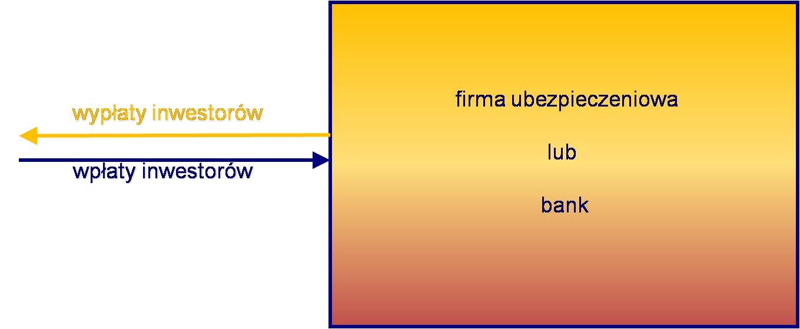

*Schemat przepływu środków- bank, ubezpieczyciel*

W przypadku wpłaty pieniędzy, na lokatę bankową albo na ubezpieczeniowy fundusz kapitałowy, pieniądze wpłacane są do w/w instytucji finansowej i wchodzą w skład bilansu tej instytucji. Instytucja ta jest spółką prawa handlowego a jej właścicielami są Akcjonariusze Spółki.
W przypadku inwestowania w fundusze inwestycyjne polskie regulacje tego rynku oferują inne rozwiązanie pokazane poniżej:

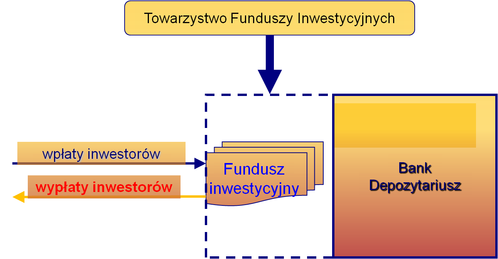

*Przepływy środków - fundusz inwestycyjny*

Wpłaty inwestorów odbywają się do funduszu inwestycyjnego. Fundusz inwestycyjny jest niezależną spółką, której właścicielami są wyłącznie inwestorzy funduszu. Funduszem zarządza Towarzystwo Funduszy Inwestycyjnych, spółka niezależna od Funduszu. Aktywa Funduszu nie są aktywami spółki zarządzającej. Nad bezpieczeństwem aktywów inwestorów czuwa dodatkowo Bank Powiernik, bank o szczególnej charakterystyce polegającej na tym, że aktywa w powiernictwie nie wchodzą do masy upadłościowej, czyli są bezpieczne i należą do Funduszu nawet w przypadku upadłości banku.

Fundusze inwestycyjne posiadają następujące cechy, które mogą być atrakcyjne dla inwestora. Wiele z nich ogranicza ryzyka inwestowania:

* Polityka inwestycyjna – statut.

Statut będący formą umowy z klientem i opisujący jak będą inwestowane środki klienta wraz z listą ryzyk i sposobów ich ograniczania. Fundusze bardzo skrupulatnie przestrzegają zapisów statutowych, wiec należy je czytać ze zrozumieniem, aby np. nie dziwić się, dlaczego zarządzający wybranym funduszem akcji z nastaniem bessy nie sprzedał wszystkich posiadanych przez fundusz akcji i nie trzyma pieniędzy w gotówce, mimo, że rynek wciąż spada. Może tak jest zapisane w statucie.

* Aktywa – bank powiernik

Nad bezpieczeństwem aktywów czuwa Bank Powiernik (Depozytariusz).

* Nadzór Komisji Nadzoru Finansowego.

Bieżący nadzór KNF nad funkcjonowaniem zarządzania wypełniania obowiązków statutowych przez TFI.
 
* Określone koszty 

Koszty zarządzania i inne wyraźnie określone w statucie.

* Codzienna publikacja wyników

Wyniki funduszy inwestycyjnych regularnie podawane są do wiadomości publicznej. W przypadku funduszy otwartych w każdy dzień roboczy.

* Prostota księgowania

W przypadku inwestowania w fundusze inwestycyjne księguje się tylko zakup jednostek funduszy i ich umorzenie a nie (jak w przypadku asset management wszystkie operacje nabycia i zbycia aktywów.)

Nie bez znaczenia jest odroczenie obowiązku podatkowego. Podatek od zysków kapitałowych w przypadku funduszy inwestycyjnych naliczony jest tylko w momencie umarzania jednostek przez inwestora a nie w przypadku zapadania każdej lokaty funduszu i zbycia aktywów funduszu.
Idea przyświecająca rynkowi funduszy inwestycyjnych polega na tym, że każdy powinien zajmować się działaniem, w którym posiada największe doświadczenie. Indywidualny inwestor zdobywa swe oszczędności pracą opartą na jego umiejętnościach i doświadczeniu, przekazując zarządzanie inwestycjami profesjonalistom, którzy poświęcają tej czynności swój cały czas i umiejętności.

TFI oferują dla swych klientów różne rodzaje funduszy. Fundusze te różnią się nie tylko polityką inwestycyjną, możliwością konwersji między różnymi strategiami inwestycyjnymi, ale i pod względem doświadczenia inwestorów. Najpopularniejsze fundusze skierowane do indywidualnych klientów to fundusze otwarte. Dla bardziej zaawansowanych w wiedzy o rynkach finansowych inwestorów rynek oferuje fundusze specjalistyczne i fundusze zamknięte. W przypadku takich inwestycji od inwestora wymagana jest wysoka znajomość rynku.

Zaletami inwestowania w fundusze inwestycyjne są:

* dywersyfikacja portfela
* profesjonalne zarządzanie
* relatywnie niskie koszty
* duża płynność inwestycji
* elastyczność wyboru strategii inwestycyjnej
* bezpieczeństwo inwestycji
* nieograniczony pośredni dostęp do instrumentów rynku kapitałowego,
* usługi dodatkowe dla uczestników funduszy (raporty okresowe i sprawozdania finansowe funduszy)

Ze względu na sposób inwestowania i grupy instrumentów finansowych, w które inwestują, fundusze można podzielić tak jak jest to pokazane poniżej:

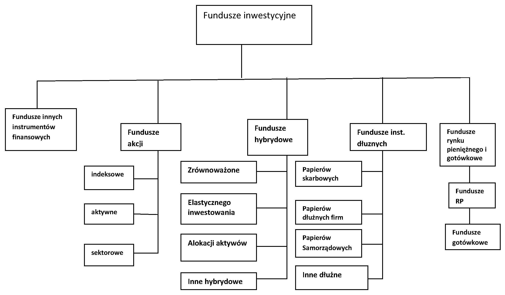

*Klasyfikacja funduszy inwestycyjnych*

Generalnie **fundusze akcyjne** dzieli się na:

* Indeksowe - czyli pasywne, odtwarzające w praktyce skład indeksu rynku i jego zachowanie. 
* Aktywne – czyli takie, w których zarządzający dobiera do portfela funduszu spółki kierując się wypracowaną metodą zmierzającą do zwiększenia wartości portfela i opisaną w Statucie funduszu.
* Sektorowe – inwestujące w akcje spółek z wybranego sektora gospodarki krajowej lub wybranej części gospodarki globalnej. Lub też spółek wybranego sektora geograficznego lub gospodarczego (BRIC) opisane szczegółowo w Statucie.

Fundusze mające w swoim portfelu mieszankę instrumentów akcyjnych i dłużnych to **fundusze hybrydowe**. 
Fundusze takie zamierzają korzystać z możliwości dawanych przez rynek akcji, zwiększając bezpieczeństwo portfela udziałem instrumentów dłużnych. Jeśli relacja między częścią portfela zainwestowaną w instrumenty dłużne jest ścisłe określona a cześć dopełniająca do 100% jest zainwestowana w akcje to są to fundusze zrównoważone. Jeśli część dłużna określona jest w zakresie od - do , co w konsekwencji wpływa na odpowiednie zachowanie się części dopełniającej do 100% wartości portfela zainwestowanej w akcje, to takie fundusze nazywane są funduszami elastycznego inwestowania. Fundusze, które statutowo mogą cały portfel zainwestowany w akcje spieniężyć i zainwestować w części lub całości w instrumenty dłużne, gdyż zarządzający dostrzega wielki potencjał w rynku instrumentów dłużnych a możliwość strat na rynku akcji (lub odwrotnie), to fundusze elastycznej alokacji aktywów. Jak widać można z różnych instrumentów, rożnych rynków finansowych, stworzyć fundusze inwestujące w różne mieszanki tych instrumentów.

**Fundusze dłużne** to grupa funduszy inwestujących w papiery dłużne. Ich podział odbywa się biorąc pod uwagę rodzaj emitenta papierów dłużnych. Bezpieczeństwo tych funduszy wiąże się z bezpieczeństwem kredytowym Emitenta. Kategoria najbezpieczniejsza z tej grupy to fundusze inwestujące w papiery dłużne emitowane przez Skarb Państwa. Jest to kategoria funduszy papierów Skarbowych. Fundusze inwestujące w papiery dłużne emitowane przez spółki prawa handlowego, zarówno obligacje jak i krótkoterminowe papiery dłużne tzw. Papiery komercyjne, to fundusze papierów dłużnych firm. Fundusze inwestujące w obligacje municypalne, czyli papiery dłużne emitowane przez samorządy lokalne, to fundusze papierów samorządowych. Dla funduszy inwestujące w inne nie wymienione tutaj papiery dłużne, zarezerwowana jest kategoria fundusze inne dłużne.
 
**Fundusze rynku pieniężnego i gotówkowe** to specyficzna klasa funduszy, której portfele składają się z pieniężnych, krótkoterminowych instrumentów dłużnych. Szczególnie fundusze rynku pieniężnego to fundusze o niezwykle precyzyjnie określonej polityce inwestycyjnej, regulowanej przez Ustawę o funduszach inwestycyjnych [5]_ zakresie Funduszu Rynku Pieniężnego. Fundusze te posiadają najniższe możliwe ryzyko funduszy inwestycyjnych ograniczając ustawowo ryzyko zmiany kursu walutowego, ryzyko kredytowe, ryzyko stopy procentowej. Fundusze gotówkowe to kategoria funduszy inwestujących podobnie jak fundusze rynku pieniężnego, ale niespełniające, co najmniej jednego z kryteriów wymienionych w ustawie.

Klasyfikacja funduszy a ryzyko.

Fundusze inwestycyjne różnią się między sobą poziomem ryzyka wiążącym się z rodzajem instrumentów finansowych, w które lokują swoje aktywa. Różnice wiążą się również z horyzontem czasowym inwestycji i celami inwestycyjnymi. Praktycznie pod względem ryzyka, nie ma dwóch identycznych funduszy inwestycyjnych.
Najprostszym sposobem oceny ryzyka jest posłużenie się klasyfikacją funduszy. Ponieważ klasyfikacja bazuje na klasach aktywów, w które inwestują fundusze, ryzyko tych aktywów wpływa na ryzyko funduszy.

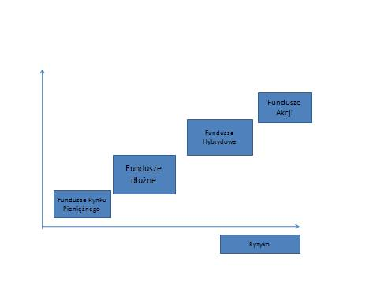

*Klasy funduszy a ryzyko*

Ten prosty sposób nie oddaje jednak w pełni ryzyka portfela aktywów funduszu. Inwestor powinien szczególnie uważnie zapoznać się ze statutem funduszu, prospektem informacyjnym, najświeższymi sprawozdaniami finansowymi. Kierowanie się wyłącznie nazwą klasyfikacji funduszu, przy ocenie, w jaką grupę aktywów będzie on inwestował, a co za tym idzie, z jakim ryzykiem wiąże się ta inwestycja, może okazać się błędne. Na przykład nazwa "fundusz obligacji" jest bardzo ogólna. Nie wiadomo, czy są to obligacje skarbowe, czy emitowane przez Spółki, papiery krajowe czy zagraniczne i jakie kraje, branże czy też konkretne przedsiębiorstwa reprezentują główne składniki portfela funduszu. Na większość tych pytań odpowiedź znaleźć można w trakcie uważnej lektury wymienionych publikacji.

Ryzyko inwestycji w fundusze wiąże się, jak już wspomniano, z planowanym okresem inwestowania.
Fundusze inwestycyjne, ze swej natury, to raczej narzędzie do inwestowania długoterminowego. Wyjątek stanowią fundusze rynku pieniężnego i gotówkowe, które to instrumenty wykorzystuje się do bieżącego zarządzania gotówką. Temu zagadnieniu, czyli funduszom rynku pieniężnego, został poświecony odrębny rozdział niniejszego opracowania.
Poniższy rysunek pokazuje zmianę ceny jednostki jednego z najstarszych funduszy Inwestycyjnych na polskim rynku - funduszu Pioneer Zrównoważony FIO. Jak widać inwestycja kilkunastoletnia w ten fundusz daje ponad 1800% zwrotu w tym czasie, mimo wahań krótkoterminowych.

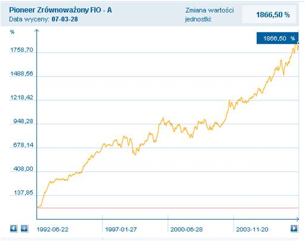

*Zmiana wartości jednostki w czasie- Pioneer Zrównoważony FIO..*

Fundusze inwestycyjne, bezpieczeństwo inwestora
-----------------------------------------------

Bezpieczeństwo środków finansowych inwestora i jego interes jest w przypadku funduszy inwestycyjnych centrum uwagi, nie tylko TFI, ale i Nadzoru Finansowego. Przepisy prawne obowiązujące w Polsce należą do najbardziej nowoczesnych w świecie i bardzo drobiazgowo regulują ryzyko w przypadku funduszy inwestycyjnych. Fundusz inwestycyjny utworzony zgodnie z Ustawą o Funduszach Inwestycyjnych jest odrębną osobą prawną niezależną od firmy zarządzającej i zobowiązania tej ostatniej nie wpływają na kondycje funduszu, którego jedynymi właścicielami są inwestorzy. Funduszem zarządza profesjonalnie Towarzystwo posiadające odpowiednie zezwolenia Komisji Nadzoru Finansowego. Jednym z warunków otrzymania takiego zezwolenia jest posiadanie odpowiednio wykwalifikowanej kadry profesjonalistów. Wszystkie Fundusze inwestycyjne w Polsce, zanim rozpoczną działalność, muszą uzyskać od Komisji stosowne zezwolenie, muszą również publikować prospekt informacyjny zawierający wszystkie niezbędne informacje o funduszu, a także są zobowiązane do publikowania półrocznych i rocznych sprawozdań finansowych. Nad operacjami funduszy pełni ciągły nadzór kilka instytucji. Aktywa funduszu inwestycyjnego, czyli to, w co fundusz zainwestował pieniądze wpłacone przez uczestników są przechowywane w banku powierniczym (Depozytariuszu), który musi spełniać określone wymagania, aby móc prowadzić taką działalność. Aktywa te są traktowane na innych zasadach niż wszystkie inne, które bank przechowuje. W przypadku kłopotów banku, ta część środków jest w całości chroniona. Ponadto zadaniem takiego banku jest bieżąca kontrola działalności inwestycyjnej funduszu.
Fundusz inwestycyjny jest instytucją prawnie i finansowo niezależną od Towarzystwa, które nim zarządza. Nawet gdyby Towarzystwo przestało istnieć fundusz inwestycyjny nadal funkcjonuje, a opiekę nad nim przejmuje Bank Depozytariusz lub inne towarzystwo. Ponadto widzisz gdzie dokładnie są inwestowane Twoje pieniądze. Bardzo ważne jest to, że wartość jednostki uczestnictwa jest bezpośrednio powiązana z wartością portfela inwestycyjnego funduszu, czyli nabytymi przez niego akcjami, obligacjami, bonami skarbowymi. Taki mechanizm powoduje, że aktywa funduszu (nabyte papiery wartościowe) są zawsze równe jego zobowiązaniom (pieniądzom powierzonym przez uczestników do inwestowania). Fundusz, w przeciwieństwie do banku, nie inwestuje pożyczonych pieniędzy, lecz tylko swoje.
W portfelu inwestycyjnym funduszu znajduje się wiele różnych papierów wartościowych. Nawet, jeśli jeden z nich odnotowuje stratę to inne przynoszą zysk. Inwestując w Fundusz inwestycyjny ze względu na jego limity narzucone przepisami prawa, inwestor automatycznie nabywa
bardzo dobrze zróżnicowany (zdywersyfikowany) portfel papierów wartościowych.
Równe traktowanie wszystkich inwestorów funduszu jest naczelną zasadą funkcjonowania funduszy inwestycyjnych. Ta zasada dotyczy nie tylko funkcjonowania funduszu, ale i nadzoru nad jego operacjami. Wszyscy uczestnicy danego funduszu są jego uczestnikami na równych prawach. Zarządzające funduszem Towarzystwo nie może spowodować, aby skutkiem jego decyzji jakaś grupa inwestorów znalazła się w sytuacji lepszej od pozostałych. Wielkość indywidualnej inwestycji w aktywa funduszu nie ma w tym przypadku znaczenia.
Fundusze inwestycyjne są różne. Różnią się przede wszystkim ryzykiem portfela inwestycji. Korzystając z różnorodności funduszy należy wybrać ten, który spełniał cel inwestycyjny inwestora, przy ryzyku, które inwestujący akceptuje.

Fundusz rynku pieniężnego - specyficzny fundusz inwestycyjny
------------------------------------------------------------

Fundusze zbiorowego inwestowania posiadają szereg cech, które czynią je atrakcyjnym narzędziem w zarządzaniu aktywami. Cechy te to profesjonalne zarządzanie przez doświadczonych specjalistów z zakresu zarządzania aktywami. Kontrola i licencjonowanie działalności przez Nadzór krajowy w postaci Komisji Nadzoru Finansowego. Określony ustawowo sposób zarządzania funduszem, jasno sformułowana polityka inwestycyjna ryzyka i sposób funkcjonowania funduszu w postaci podawanego do publicznej wiadomości Statutu Funduszu, bieżące publikowanie wyników. Wszystko to czyni proces zarządzania transparentnym. Nadzór nad bieżącymi operacjami prowadzony przez KNF oraz Bank Powiernik (Depozytariusz) zwiększa bezpieczeństwo procesu inwestycyjnego a jednoznacznie określone koszty pozwalają na proste ich kontrolowanie. Patrząc na fundusze pod kątem ograniczania ryzyk rynkowych widać dywersyfikację portfela funduszu, redukującego ryzyko rynkowe. Nawet mała kwota wpłaty pozwala na proporcjonalny udział w dużym portfelu funduszu zawierającym różne papiery wartościowe. Ta cecha usuwa podstawowa trudność samodzielnego inwestowania. Ponadto nie bez znaczenia jest to, że fundusz działa na hurtowym rynku finansowym płacąc marże i opłaty znacznie niższe niż klienci detaliczni. Najistotniejszą charakterystyką funduszu jest wyeliminowanie ryzyka bilansu instytucji zarządzającej. W polskim prawodawstwie fundusz inwestycyjny jest odrębną spółką prawa handlowego, w której właścicielami aktywów są inwestorzy, której aktywami zarządzają specjaliści wykonujący transakcje i operacje ograniczone do wymienionych w statucie funduszu. Te cechy stawiają fundusz na skali ryzyka, jako narzędzie inwestowania, znacznie korzystniej w porównaniu do innych rodzajów instrumentów finansowych.
Jak to było wykazane wcześniej do zarządzania gotówką konieczne jest płynne i bezpieczne narzędzie. Bezpieczne, czyli o minimalnym poziomie ryzyka. Takim narzędziem jest Fundusz Rynku Pieniężnego.

Fundusze rynku pieniężnego
~~~~~~~~~~~~~~~~~~~~~~~~~~

Potrzeba zaproponowania nowych, bardziej efektywnych i bezpiecznych form zarządzania finansami, a szczególnie gotówką, była podstawą wprowadzenia w Ustawie o funduszach inwestycyjnych [5]_, regulacji standardu Funduszu Rynku Pieniężnego, Funduszu, który posiada najniższe możliwe ryzyko inwestycyjne.

Ważną częścią tego standardu jest bezpieczeństwo pieniędzy inwestora. Fundusz inwestycyjny i towarzystwo funduszy inwestycyjnych zarządzające jego aktywami, to odrębne osoby prawne, zatem nie występuje ryzyko bilansu. Ponadto fundusz rynku pieniężnego ma ograniczone do minimum ryzyko zmiany kursu walut (tylko jedna waluta) i ryzyko kredytowe lokat, poprzez określenie minimalnego ratingu dla inwestycji oraz limitowane ryzyko zmian stopy procentowej (poprzez ściśle określony średni okres do zapadalności) i rodzaj instrumentów finansowych dopuszczonych do inwestowania. Ponadto fundusz rynku pieniężnego, tak jak każdy fundusz inwestycyjny, zgodnie z ustawą o funduszach inwestycyjnych, musi publikować informacje o kosztach i podawać do wiadomości publicznej osiągane wyniki. Fundusz i zarządzanie jego aktywami podlega nadzorowi Komisji Nadzoru Finansowego. Operacje są także kontrolowane przez Bank Powiernik, czyli instytucję, której celem jest zapewnienie specjalnych warunków bezpieczeństwa dla aktywów inwestora. Przy tych cechach fundusze inwestycyjne rynku pieniężnego konkurują ze sobą kosztami zarządzania, szybkością dostępu do lokat i jakością obsługi.

Wspomniana regulacja wskazuje na ograniczenia ryzyka i pozwala na uzyskanie ratingu przez takie fundusze na poziomie, co najmniej BBB, czyli ratingu bezpieczeństwa równemu bezpieczeństwu naszego kraju. Powyższa analiza wskazuje, że lokata w funduszu rynku pieniężnego jest bezpieczniejsza niż lokata w wielu bankach (szczególnie o nieustalonym ratingu). 
Tak skonstruowane narzędzie do zarządzania gotówką jest bardzo pomocne zarówno dla firm jak i osób fizycznych. Zapewnia szybki dostęp do gotówki w dowolnym, trudnym do przewidzenia momencie (płynność lokowania). Na podkreślenie zasługuje wysokie bezpieczeństwo środków lokowanych w funduszach rynku pieniężnego, albowiem z punktu widzenia inwestora, zainwestowana gotówka nie może zniknąć ani zmniejszyć swojej wartości, gdyż jest zasobem niezbędnym dla funkcjonowania firmy (bezpieczeństwo). Wskazane jest także, aby zarządzanie gotówką związane było z niskimi i jasno określonymi kosztami.
A co z rentownością lokat, o której nie wspomniano ani razu?
Otóż rentowność nie jest zasadniczym kryterium w procesie zarządzania gotówką. Rentowność z środków płynnych wypracowuje, bowiem sama firma. Zarządzający, którzy przy zarządzeniu gotówką zaczynali od kryterium rentowności, niejednokrotnie wpadali w różne trudności. Niemniej jednak rentowność funduszy rynku pieniężnego jest często wyższa od lokat bankowych.

Ustawowa regulacja funduszu rynku pieniężnego jest wyjątkowa na rynku europejskim (tylko w Polsce ten rodzaj funduszu jest regulowany ustawowo), [7]_ -  ale jej restrykcyjność służy inwestorom. Podobnie restrykcyjny standard funduszu rynku pieniężnego funkcjonuje od wielu lat na rynku amerykańskim, gdzie fundusze te służą, jako podstawowe narzędzie zarządzania gotówką szczególnie wykorzystywane przez małych i średnich inwestorów.

Fundusze inwestycyjne na świecie i w Polsce
-------------------------------------------

Inwestowanie za pomocą funduszy inwestycyjnych to bardzo popularne rozwiązanie na świecie. Ten sposób inwestowania cieszy się coraz większą popularnością. Pozwala on, bowiem na zarządzanie procesem inwestowania przez profesjonalistów, którzy koncentrują się na tej czynności, pozostawiając inwestorom możliwość skoncentrowania się na tym, w czym oni się specjalizują i w ten sposób zyskują środki na inwestycje.

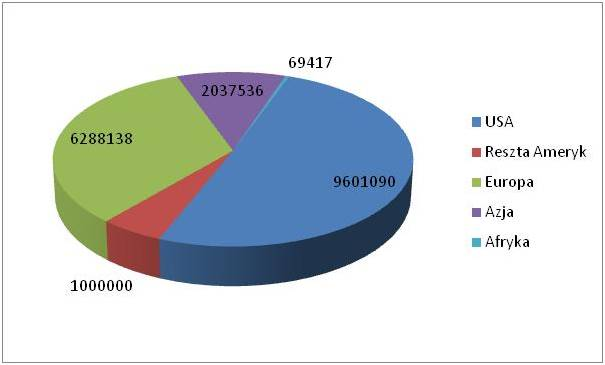

*Aktywa funduszy inwestycyjnych na świecie liczone w milionach USD. Źródło-Investment Company Institute-Factbook 2009*

Wielkość aktywów zarządzana przez fundusze inwestycyjne generalnie wzrasta z czasem, wykazując jednak fluktuacje związane z pojawianiem się stanów kryzysowych np. kryzysów gospodarczych. W roku 2008 aktywa funduszy inwestycyjnych wynosiły18 974 521 milionów USD a rok wcześniej 26 129 564 milionów dolarów (dane wg investment Company Fact Book2009).  Rynek USA jest rynkiem, z którego pochodzi prawie 55% aktywów funduszy inwestycyjnych.
Rynek europejski reprezentuje około 33% światowych aktywów funduszy inwestycyjnych.
Biorąc pod uwagę ilość funduszy inwestycyjnych to dane liczbowe wyglądają następująco:  Na świecie ilość funduszy w 2008 roku wyniosła  69 032 z czego na USA przypadło  8 022 ale na Europę  36 780. Mimo że rynek europejski jest mniejszy biorąc pod uwagę aktywa zgromadzone w funduszach inwestycyjnych, to ilość funduszy jest na tym rynku ponad czterokrotnie wyższa niż na rynku amerykańskim.
 
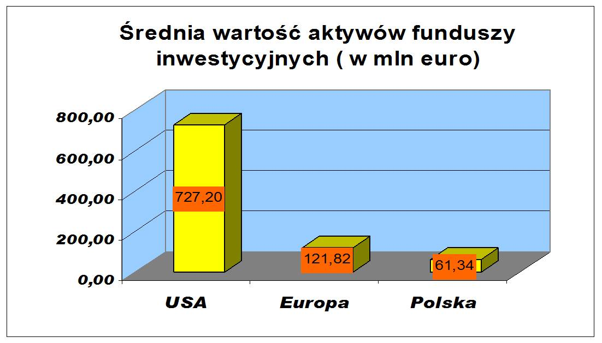

*Średnia wielkość funduszu inwestycyjnego*

Mimo odnotowanych zmian aktywów funduszy inwestycyjnych, wzrostu inwestycji, konsolidacji na rynku funduszy i wzrostu średniej wartości aktywów statystycznego funduszu, relacja średniej wielkości funduszu amerykańskiego i europejskiego pozostaje w ostatnich latach bardzo podobna. Statystycznie fundusz europejski zarządza znacznie niższymi aktywami. Taki stan rzeczy nie wpływa pozytywnie na przewagę konkurencyjną. Ta cecha ma olbrzymie konsekwencje w wielu aspektach funkcjonowania tych dwu rynków funduszy inwestycyjnych. 

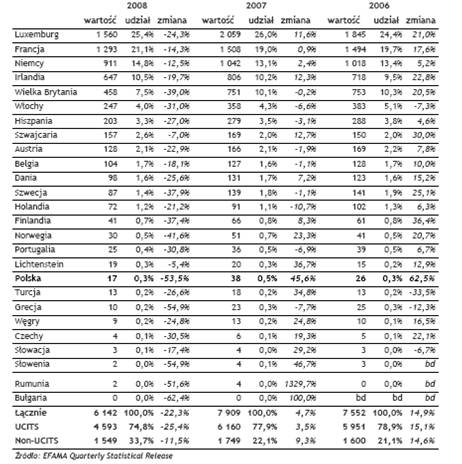

*Aktywa funduszy inwestycyjnych w państwach europejskich*

Konkurencyjność większych funduszy polega na niższej z reguły cenie za zarządzanie. Ta opłata jest z reguły liniowo związana z wielkością aktywów i stanowi zazwyczaj wielkość rzędu pojedynczych procentów. Obecnie jest tworzony wspólny rynek europejski usług finansowych. Można przypuszczać, że gdy okrzepnie a EURO stanie się jedyną walutą Unii Europejskiej, nastąpi zjawisko silnej konsolidacji europejskich funduszy inwestycyjnych. Europejski rynek funduszy europejskich powstał z połączenia lokalnych rynków funduszy państw członkowskich. Rynki te tworzyły się autonomicznie wypracowując własne lokalne rozwiązania często unikalne i różne od rozwiązań w krajach sąsiednich. Szanując stan zastany władze Unii Europejskiej tworzą wspólny rynek usług finansowych w Unii Europejskiej, regulując i standaryzując przepisy prawne dla europejskich funduszy inwestycyjnych zwanych UCITS (*Undertaking Collective Investments  in Transferable Securities*) [8]_. Różnorodność funduszy inwestycyjnych na wspólnym rynku europejskim jest wielka, tak jak i ich liczba, co powoduje dużą trudność dla inwestorów w poszukiwaniu tego właściwego dla nich funduszu. Fundusze, bowiem, bez względu na kraj europejskiego pochodzenia, są dystrybuowane bez przeszkód we wszystkich krajach Unii. Fundusze te to nie tylko inna polityka inwestycyjna, często ryzyko kursowe EURO/PLN, ale i inna konstrukcja prawna w porównaniu do polskich funduszy oraz inne prawa wynikające z faktu posiadania jednostek funduszy inwestycyjnych. Inwestor staje przed jeszcze trudniejszym wyborem. Kraj nasz, mimo, że jest jednym z większych krajów pod względem obszaru oraz liczby ludności nie jest potęgą pod względem środków zgromadzonych w funduszach.
Fundusze inwestycyjne są bardzo popularną formą inwestowania. W krajach "starych" Unii Europejskich oszczędności zainwestowane w fundusze inwestycyjne są równe prawie 50% PKB tych państw. 

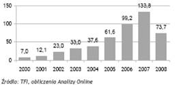

*Aktywa funduszy inwestycyjnych w Polsce*

Polska, w której fundusze inwestycyjne istnieją od kilkunastu lat jest krajem, w którym obserwuje się bardzo dynamiczny rozwój tej formy inwestowania a wzrost aktywów funduszy inwestycyjnych jest niezwykle szybki. W ten sposób polscy inwestorzy nadrabiają lukę rozwojową. Konsekwentna polityka redukcji stóp procentowych od połowy lat dziewięćdziesiątych ubiegłego wieku, kiedy to powstały w Polsce pierwsze fundusze inwestycyjne, miała pozytywny wpływ na wzrost aktywów. Obniżane stopy oprocentowania depozytów bankowych zmuszały inwestorów do poszukiwania alternatywnych lokat. Początkowo fundusze instrumentów dłużnych a szczególnie fundusze obligacji znalazły wielu inwestorów akceptujących oferowane przez nie wyniki, biorąc pod uwagę poziom ryzyka oferowanych portfeli. Ponieważ w okresie kilku lat wahania stóp procentowych odbywały się w jedna stronę (systematyczne obniżanie stóp procentowych), fundusze obligacji wydawały się być pozbawionym ryzyka instrumentem inwestycyjnym oferującym znaczne dochody.  

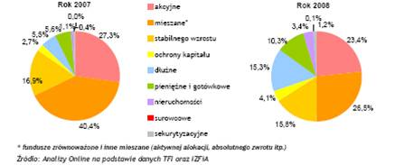

*Struktura preferencji inwestorskich - rynek funduszy inwestycyjnych. Polska*

Gdy stopy procentowe obniżone zostały do prawie dzisiejszego poziomu fundusze obligacji nie zaspakajały apetytu inwestorów na zysk. Rozwój rynku kapitałowego, wolumenu akcji spółek publicznych będących w obrocie na Giełdzie Papierów Wartościowych w Warszawie, płynność i głębokość tego rynku sprawiły, że inwestorzy szukający wyższych zwrotów z inwestycji skierowali swoje zainteresowanie na rynek akcji i akcyjne fundusze inwestycyjne zaczęły stanowić znaczącą pozycje na rynku. Podobne zjawisko obserwowano w innych krajach europejskich w podobnych okresach przed przystąpieniem do Unii Europejskiej. Wzrost gospodarczy Polski skłania do inwestowania w akcje polskie. 

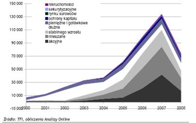

*Polska.Zmiana preferencji inwestorskich w czasie*

Ale inwestorzy dywersyfikując się na ryzyka różnych gospodarek mogą przy pomocy funduszy inwestycyjnych, inwestować w gospodarki innych krajów i regionów. Inwestowanie na rynkach surowców, nieruchomości staje się również znaczącą ofertą funduszy inwestycyjnych. Rozwój rynków funduszy inwestycyjnych podąża w Polsce ta samą drogą, co trendy światowe. Ważną różnicą jednak jest bardzo mocna ochrona interesu inwestora w polskich regulacjach funduszy inwestycyjnych. W stosunku do innych krajów europejskich nasz rynek jest nadzorowany bardziej rygorystycznie a nasze fundusze są bezpieczniejsze ze względu na konstrukcję prawną i wymogi kapitałowe oraz „ proste” w swojej działalności inwestycyjnej. Takie otoczenie sprzyja bezpieczeństwu inwestora, pozwala na budowanie zaufania, ale niestety nie pozwala swobodnie konkurować, gdyż obciążenia (informacyjne, operacyjne itd.) są u nas w Polsce dużo wyższe niż w wielu krajach Unii Europejskiej. 

Dodatkowym mechanizmem wpływającym na efekt wzrostu były strategiczne decyzje podjęte w grupach finansowych umożliwiające funduszom inwestycyjnym korzystanie z bankowych kanałów dystrybucji. 

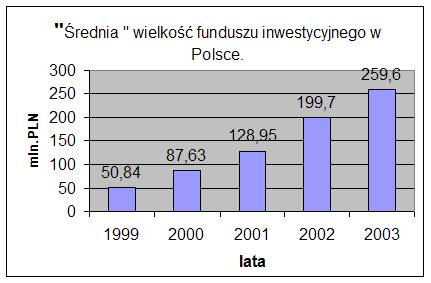

*Zmiana średniej wielkości funduszu w Polsce*

Zjawisko w Polsce przebiegało bardzo podobnie do analogicznych zjawisk w innych krajach Unii Europejskiej. Podobnie jak tam „Okienka bankowe” stały się głównym kanałem dystrybucji w Polsce.
**„Atrakcyjność” podatkowa funduszy** polegająca na odroczeniu płacenia podatku do momentu umarzania jednostek spowodowała również znaczny wzrost zainteresowania tą forma inwestycji wśród inwestorów. Wprowadzenie podatku od zysków kapitałowych był momentem uświadomienia sobie tej cechy funduszy przez wielu inwestorów, co skutkowało znacznym wzrostem aktywów.
Bezpieczeństwo otoczenia prawnego inwestowania w fundusze inwestycyjne oraz jasno określone koszty funduszy plasują je wśród najtańszych instrumentów finansowych.
Dzięki temu fundusze inwestycyjne w Polsce zwiększają swe aktywa i mimo, że średnia wartość aktywów funduszu inwestycyjnego w Polsce jest niższa niż w USA i Europie, wartość ta stale rośnie i w przypadku wielu funduszy zbliża się do wartości funduszy z rynku europejskiego.

----------

.. [1] *(wg.The Origin of Mutual Funds’ by K. Geert Rouwenhorst)* Yale ICF Working PaperNo.0448.Dec.12.2004
.. [2] UCTS i „non UCITS-  t. Tak nazywane formy funduszy noszą swą nazwę od regulacji unii Europejskiej. UCITS to skrót od nazwy angielskiej „ Undertaking the Collective Investments in Transferable Securities. Taka forma funduszy jest regulowana przez dyrektywy unijne i jest to zalecana przez Unię forma funduszy inwestycyjnych. Przykładowo fundusze otwarte zarządzane przez Towarzystwa Funduszy Inwestycyjnych z siedzibą w Polsce są takimi funduszami UCITS.
.. [3] \M. Łukaszewski- Rynek finansowy w Polsce po akcesji do Unii Europejskiej-Zeszyty Naukowe Wyższej Szkoły Bankowości i Finansów, 2003r.
.. [4] \M. Łukaszewski - Polski Sektor Funduszy Inwestycyjnych w Aspekcie Wejścia Polski do Unii Europejskiej - „Zarządzanie Ryzykiem”- Vol.18,2004r-wydawnictwo Wyższej Szkoły Ubezpieczeń i Bankowości
.. [5] ustawa o funduszach inwestycyjnych z dnia 27 maja 2004r. (Dz. U. z dnia 28 czerwca 2004 r.) Dziennik Ustaw z 2004 r. Nr 146 poz. 1546.
.. [6] \W. Pochmara. A.Zapała ”Prawa Uczestnika funduszu inwestycyjnego i sposób ich realizacji” - KPWiG-2003r.
.. [7] \M. Łukaszewski- „Fundusze Rynku Pieniężnego - ich funkcjonowanie - szczególna pozycja wśród funduszy inwestycyjnych. Analiza Porównawcza -USA, Europa, Polska” Zeszyty Naukowe- Wyższa Szkoła Ubezpieczeń i BankowościVol.36, 2005r.
.. [8] Dyrektywy 85/611 EEC oraz 2001/107/EC i 2001/108/EC.

