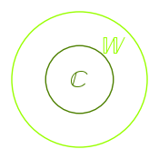
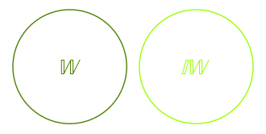
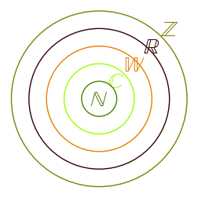

.. -*- coding: utf-8 -*-

Liczby
=======

- **Liczby naturalne** 

Zbiór liczb naturalnych N tworzą liczby 0,1,2,3,... :math:`N={0,1,2,3,...}`

Nie ma największej liczby naturalnej, czyli innymi słowy dla każdej
liczby naturalnej mozna znaleźć liczbę większą. (ex. sage) Najmniejszą
liczbą naturalną jest 0, przy czym uwaga \- niektóre podręczniki
definiują zbiór liczb naturalnych jako zbiór {1,2,3,...}. W tym
przypadku 0 nie jest liczbą naturalną.

- **Liczby całkowite** 

Zbiór liczb całkowitych C tworzą liczby ...,\-3,\-2,\-1,\-,1,2,3,...

C = :math:`\{`...,-3,-2,-1,0,1,2,3,...:math:`\}`

Nie ma najmniejszej ani największej liczby całkowitej, a zbiór liczb naturalnych zawiera się w zbiorze liczb całkowitych

N :math:`\subset` C

.. code-block:: python

    sage: %hide
    sage: %auto
    sage: G = Graphics()
    sage: liczby = ['$\mathbb{N}$', '$\mathbb{C}$']
    sage: for r in range (1,3):
    ...       c = circle((0,0), r, rgbcolor=(0.3*r,0.5*r,0))
    ...       G+=c
    ...       t1 = text(liczby[r-1],(r-1,r-1), fontsize=20,rgbcolor=(0.3*r,0.5*r,0))
    ...       G+=t1 
    ...           
    sage: G.show(figsize=[2,2],axes=false)

.. end of output

- **Liczby wymierne** 

Zbiór liczb wymiernych W tworzą liczby postaci :math:`\frac{m}{n}`, gdzie m,n :math:`\in`C, oraz n :math:`\neq 0`

W = :math:`\{\frac{m}{n}`, m,n :math:`\in` C :math:`\wedge` n :math:`\neq 0\}`

Nie ma najmniejszej ani największej liczby wymiernej, a zbiór liczb całkowitych zawiera się w zbiorze liczb wymiernych

C :math:`\subset` W

.. code-block:: python

    sage: %auto
    sage: %hide
    sage: G = Graphics()
    sage: liczby = ['$\mathbb{C}$', '$\mathbb{W}$']
    sage: for r in range (1,3):
    ...       c = circle((0,0), r, rgbcolor=(0.3*r,0.5*r,0))
    ...       G+=c
    ...       t1 = text(liczby[r-1],(r-1,r-1), fontsize=20,rgbcolor=(0.3*r,0.5*r,0))
    ...       G+=t1 
    ...           
    sage: G.show(figsize=[2,2],axes=false)

.. end of output

- **Liczby niewymierne** 

Zbiór liczb niewymiernych IW tworzą liczby, których nie można przedstawić w postaci :math:`\frac{m}{n}`, gdzie m,n :math:`\in` C, oraz n :math:`\neq 0`, czyli nie można przedstwić w postaci ułamka. Przykładami liczb niewymiernych są :math:`\sqrt{2}`, :math:`\pi`, :math:`\sqrt{13}`, liczba :math:`e` i nieskończenie wiele innych. Z podanej definicji zbioru IW wynika, że zbiory liczb wymiernych i niewymiernych są rozłączne, czyli nie posiadają elementów wspólnych

W :math:`\cap` IW = :math:`\emptyset`

.. code-block:: python

    sage: %hide
    sage: %auto
    sage: G = Graphics()
    sage: liczby = ['$\mathbb{W}$', '$\mathbb{IW}$']
    sage: for r in range (1,3):
    ...       c = circle((r+2,0), 0.45, rgbcolor=(0.3*r,0.5*r,0))
    ...       G+=c
    ...       t1 = text(liczby[r-1],(r+2,0), fontsize=20,rgbcolor=(0.3*r,0.5*r,0))
    ...       G+=t1 
    ...           
    sage: G.show(figsize=[4,4],axes=false)

.. end of output

- **Liczby rzeczywiste** 

Zbiór liczb rzeczywistych R tworzy suma zbioru liczb wymiernych W i zbioru liczb niewymiernych IW (zbiory W i IW są rozłączne)

R = W :math:`\cup` IW

Oczywiście nie ma najmniejszej ani największej liczby rzeczywistej, a pomiędzy dwie dowolne liczby rzeczywiste można włożyć nieskończenie wiele liczb rzeczywistych. Przykład w sage. Mówiąc obrazowo liczby rzeczywiste to :math:`\it wszystkie` liczby i tymi liczbami będziemy sie posługiwać na zajęciach z analizy matematycznej.

- **Liczby zespolone** 

Zbiór liczb zespolonych Z tworzą liczby postaci :math:`\it z = a + ib`, gdzie :math:`\it a,b \in R`, a :math:`\it i` jest tzw. jednostką urojoną, czyli rozwiązaniem równania :math:`\it i^{2} = -1`.

Z = :math:` \{ \it z = a + ib`, :math:`\it a,b \in R`, :math:`\it i^{2} = -1\}`

Liczby zespolone przedstawia się zwykle na tzw. płaszczyźnie zespolonej, która jest podzielona na cztery części dwoma osiami: rzeczywistą :math:`\Re` i urojoną :math:`\Im`. Własności i działania na liczbach zepolonych są omawiane na zajęciach z algebry.

W świetle powyższych definicji, oczywista jest następująca zależność zawierania się zbiorów liczbowych:

N :math:`\subset` C :math:`\subset` W :math:`\subset` R :math:`\subset` Z.

.. code-block:: python

    sage: %hide
    sage: %auto
    sage: G = Graphics()
    sage: liczby = ['$\mathbb{N}$', '$\mathbb{C}$', '$\mathbb{W}$', '$\mathbb{R}$', '$\mathbb{Z}$']
    sage: for r in range (1,6):
    ...       c = circle((0,0), r, rgbcolor=(0.3*r,0.5*r,0))
    ...       G+=c
    ...       t1 = text(liczby[r-1],(r-1,r-1), fontsize=20, rgbcolor=(0.3*r,0.5*r,0))
    ...       G+=t1 
    ...           
    sage: G.show(figsize=[3,3],axes=false)

.. end of output

