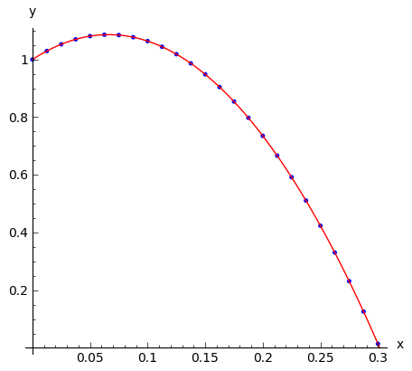
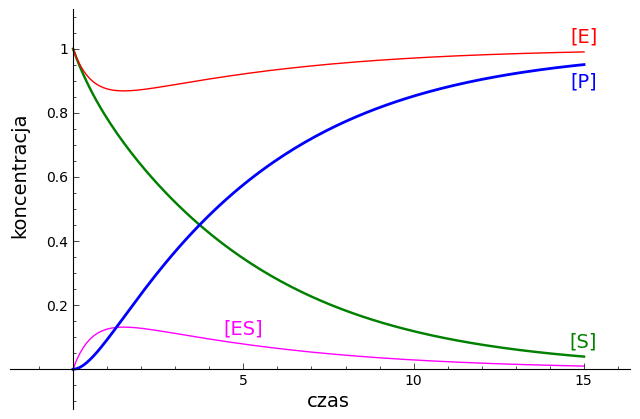

.. -*- coding: utf-8 -*-

Gra w fizykę!
=============

*...czyli o równaniach różniczkowych i modelowaniu  słów kilka...*

.. image:: Gra_w_Fizyke_media/data/Screenshot%20from%202012-09-24%2009:07:49.png
    :align: center

Rzut ukośny
-----------

Rozważmy ruch pod wpływem przyciągania ziemskiego.

Zgodnie z :math:`\,`  `Drugą Zasadą Dynamiki Newtona <http://pl.wikipedia.org/wiki/Zasady_dynamiki_Newtona>`_  :math:`\,`  (Isaac Newton, 1687)  siła   :math:`\vec F`
  przyłożona do ciała o masie :math:`\,m\,` powoduje przyśpieszenie  :math:`\vec a`  określone wzorem

.. MATH::

     m\,\vec a  = \vec F

W tym przypadku na ciało działa siła ciężkości  :math:` \vec F = m\,\vec g`,   gdzie   :math:` \vec g `   jest     `przyśpieszeniem ziemskim <http://pl.wikipedia.org/wiki/Przy%C5%9Bpieszenie_ziemskie>`_ .

0.)
 Badanie ruchu metodą iteracji przy skończonych przedziałach czasu  :math:`\Delta t`.

Aby wyliczyć  `tor ruchu <http://pl.wikipedia.org/wiki/Tor_ruchu>`_ ,  odwołamy się do wzorów definiujących wielkości kinematyczne:

 - prędkość::math:`\qquad\quad\; \vec v = \displaystyle\frac{ \Delta \vec r}{\Delta t}`

 - przyśpieszenie::math:`\quad\, \vec a =  \displaystyle \frac{\Delta \vec v}{\Delta t}`

Wzory te dają wartości średnie prędkości i przyśpieszenia w przedziale czasu  :math:`\Delta t`.  Ponieważ ruch nie jest jednostajny,  to prędkość średnia jest na ogół różna od prędkości chwilowej.  Wyniki dotyczące ruchu w dowolnie długim przedziale czasu,  podzielonym na elementarne przedziały  :math:`\Delta t`,  będą więc przybliżone.  Przybliżenie to będzie tym lepsze,  im krótsze będą przedziały  :math:`\Delta t`  (wynik dokładny odpowiada granicy  :math:`\Delta t \to 0)`.

Podstawowe równania przyjmują postać:
  :math:`\qquad\qquad\qquad \begin{cases} \quad \displaystyle \frac{\Delta \vec r}{\Delta t} &amp;=&amp; \vec v \\ \quad \displaystyle \frac{\Delta \vec v}{\Delta t} &amp;=&amp; \displaystyle \frac {\vec F}{m} \end{cases} `

W chwili początkowej  :math:`\,t_0`  stan układu jest zadany przez położenie i prędkość,  :math:`\, \vec r_0,\,\vec v_0 \,`.   Aby obliczyć  :math:`\vec r,\,\vec v`   po czasie :math:`\: \Delta t`,  wykorzystujemy oba powyższe wzory:

 - nowe położenie: :math:`  \, \vec r  =  \vec r_0  +  \vec v_0  \Delta t`

 - nowa prędkość::math:`\quad \vec v  =  \vec v_0  +  \displaystyle \frac{\vec F}{m}   \Delta t`

Ruch odbywa się w płaszczyźnie pionowej wyznaczonej przez wektory prędkości początkowej :math:`\;\vec v_0\;` i przyśpieszenia ziemskiego :math:`\;\vec g\,`.

Niech :math:`\:x\:` i :math:`\:y\;` będą współrzędnymi wektora położenia :math:`\:\vec r,`  a :math:`\ \: v_x\:` i :math:`\;v_y\:\ - \ ` współrzędnymi wektora prędkości :math:`\;\vec v,\;` w układzie współrzędnych z poziomą osią :math:`Ox` i pionową osią :math:`Oy`. Układ wielkości  :math:`\,(x,y, \, v_x,v_y\,)`  jest matematyczną reprezentacją stanu cząstki.

Siła :math:`\,\vec F\;` ma współrzędne :math:`\;F_x\,=\,0,\ F_y\,=\,-\,mg`.  Równania ruchu można teraz zapisać jako:

.. MATH::

    \begin{cases}\quad\;\displaystyle\frac{\Delta x}{\Delta t}&amp;=&amp;v_x\\ \quad\;\displaystyle\frac{\Delta y}{\Delta t} &amp;=&amp; v_y \\
    \quad\;\displaystyle\frac{\Delta v_x}{\Delta t}&amp;=&amp; 0\\\quad\;\displaystyle\frac{\Delta v_y}{\Delta t} &amp;=&amp; -\:g\end{cases}

Wprowadzając wartości początkowe :math:`\:x_0\:` i :math:`\:y_0\:` dla współrzędnych położenia oraz :math:`\:v_{x0}\:` i :math:`\:v_{y0}\:` dla współrzędnych prędkości, otrzymujemy:

.. MATH::

    \begin{cases}\quad x &amp;=&amp;x_0 \ +\  v_{x0}\:\Delta t\\ \quad y &amp;=&amp;y_0\ +\ v_{y0}\:\Delta t\\ \quad v_x &amp;=&amp;v_{x0}\ +\ 0\:\Delta t\\ \quad v_y &amp;=&amp;v_{y0}\ -\  g\:\Delta t \end{cases}

Zadanie   **warunków początkowych**  dla położenie i prędkości:

.. code-block:: python

    sage: g = 9.81              # przyśpieszenie ziemskie w metrach na sekundę do kwadratu
    sage: t0 = 0.0; delta_t = 0.05      # chwila początkowa i elementarny przedział czasu
    sage: init0 = (0.0, 1.0, 0.5, 1.3)  # warunki początkowe dla x, y, vx, vy:
    ...                                 # współrzędne położenia x0, y0 wyrażone w metrach,
    sage: (x0, y0, vx0, vy0) = init0    # współrzędne prędkości vx0, vy0 w metrach na sekundę
    sage: print("Warunki początkowe:")     
    sage: print('t0 = %4.2f s, delta_t = %4.2f s;\
    ...          \nx0 = %4.2f m, y0 = %4.2f m, vx0 = %4.2f m/s, vy0 = %4.2f m/s.'
    ...         % (t0, delta_t, x0, y0, vx0, vy0))
    Warunki początkowe:
    t0 = 0.00 s, delta_t = 0.05 s;       
    x0 = 0.00 m, y0 = 1.00 m, vx0 = 0.50 m/s, vy0 = 1.30 m/s.

.. end of output

Przebieg ruchu można przedstawić w postaci tabeli o zadanej liczbie  :math:`m`  wierszy:

.. code-block:: python

    sage: start = [t0, x0, y0, vx0, vy0]
    sage: m = 21                # zadanie liczby wierszy tabeli
    sage: tab = [start]         # inicjacja tabeli jako listy list
    sage: for i in range(1,m):                    
    ...       
    ...       t  = t0 + delta_t
    ...       x  = x0 + vx0*delta_t 
    ...       y  = y0 + vy0*delta_t
    ...       vx = vx0
    ...       vy = vy0 - g*delta_t
    ...       
    ...       next = [t, x, y, vx, vy]          
    ...       tab.append(next)               # dodanie następnego wiersza do tabeli
    ...       [t0, x0, y0, vx0, vy0] = next
    ...                  
    sage: html('%8s %12s %12s %13s %13s\n'
    ...        % ('$t$', '$x$', '$y$', '$v_x$', '$v_y$'))
    sage: for [t, x, y, vx, vy] in tab:
    ...       print('%7.2f %11.4f %10.4f %10.4f %10.4f'
    ...             % (t, x, y, vx, vy))
    sage: [t0, x0, y0, vx0, vy0] = start     # przywrócenie wartości początkowych
    <html>...</html>

       0.00      0.0000     1.0000     0.5000     1.3000
       0.05      0.0250     1.0650     0.5000     0.8095
       0.10      0.0500     1.1055     0.5000     0.3190
       0.15      0.0750     1.1214     0.5000    -0.1715
       0.20      0.1000     1.1128     0.5000    -0.6620
       0.25      0.1250     1.0797     0.5000    -1.1525
       0.30      0.1500     1.0221     0.5000    -1.6430
       0.35      0.1750     0.9400     0.5000    -2.1335
       0.40      0.2000     0.8333     0.5000    -2.6240
       0.45      0.2250     0.7021     0.5000    -3.1145
       0.50      0.2500     0.5464     0.5000    -3.6050
       0.55      0.2750     0.3661     0.5000    -4.0955
       0.60      0.3000     0.1613     0.5000    -4.5860
       0.65      0.3250    -0.0680     0.5000    -5.0765
       0.70      0.3500    -0.3218     0.5000    -5.5670
       0.75      0.3750    -0.6001     0.5000    -6.0575
       0.80      0.4000    -0.9030     0.5000    -6.5480
       0.85      0.4250    -1.2304     0.5000    -7.0385
       0.90      0.4500    -1.5823     0.5000    -7.5290
       0.95      0.4750    -1.9588     0.5000    -8.0195
       1.00      0.5000    -2.3598     0.5000    -8.5100

.. end of output

Przy użyciu suwaka można zaznaczyć położenie cząstki na przybliżonej trajektorii w wybranym kroku iteracji:

.. code-block:: python

    sage: (x0, y0, vx0, vy0) = init0                
    sage: track = [(x0,y0)]                # inicjacja trajektorii jako listy punktów
    sage: for i in range(1,101):
    ...       
    ...       x  = x0 + vx0*delta_t 
    ...       y  = y0 + vy0*delta_t 
    ...       vx = vx0 
    ...       vy = vy0 - g*delta_t
    ...       
    ...       if y<0:
    ...           t_end = t0 + (i-1)*delta_t
    ...           iter = i-1
    ...           break
    ...               
    ...       track.append((x,y))
    ...       
    ...       (x0, y0, vx0, vy0) = (x, y, vx, vy)
    sage: @interact
    sage: def _(i = slider(range(len(track)))):
    ...       
    ...       pt0 = point( track[0], color='green', pointsize=40)   # położenie początkowe
    ...       ptr = point( track[i], color='black', pointsize=40)   # położenie bieżące  
    ...       ptf = point(track[-1], color='red',   pointsize=40)   # położenie końcowe
    ...       plt = line(track, marker=".")                         # wykres trajektorii 
    ...       
    ...       show(plt+pt0+ptr+ptf, aspect_ratio=0.25, axes_labels=['x','y'], figsize=(6,4))
    ...       
    ...       print("Przybliżony opis ruchu przy %2d iteracjach:" % iter)
    ...       print("Upadek po czasie %4.2f s w odległości %4.2f m." % (t_end, x0))
    ...       print("Prędkość końcowa wyniosła %4.2f m/s." % sqrt(vx0^2+vy0^2))

.. end of output

**1.)  Dokładny opis ruchu z zastosowaniem równań różniczkowych  -  zmienne  :math:`\,x, y, \, v_x, v_y\:`.**

****

Matematycznie,  granica :math:`\;\Delta t \to 0\,\:` prowadzi do układu czterech równań różniczkowych: :math:`\qquad\begin{cases}\quad\,\displaystyle\frac{dx}{dt} \ \,=\  v_x \\ \quad\,\displaystyle\frac{dy}{dt} \ \,= \ \ \; v_y \\ \quad\,\displaystyle\frac{dv_x}{dt} \ \,=\ \; 0 \\ \quad\,\displaystyle\frac{dv_y}{dt} \ \,=\, - g \end{cases} `

W powyższym  układzie szukanymi są funkcje :math:`\;x(t),\;y(t),\;v_x(t),\;v_y(t)`.  Do ich wyznaczenia potrzebny jest dodatkowo warunek początkowy określający położenie i prędkość punktu materialnego w chwili początkowej :math:`\;t_0=0`.

W systemie Sage istnieje narzędzie do analitycznego rozwiązywania takich układów równań:

.. code-block:: python

    desolve_system(<strong>[de_x,de_y,de_vx,de_vy], <strong>[x, y, vx, vy], </strong>[0, x0, y0, vx0, vy0],  t</strong>)

.. code-block:: python

    <strong>                   równania układu     s<strong>zukane funkcje   </strong><strong></strong></strong>
.. code-block:: python

    style="display: inline !important;"><strong>warunki początkowe  argument</strong>

.. code-block:: python

    Znajdziemy najpierw ogólną postać równań ruchu:

.. code-block:: python

    sage: var('g')
    sage: var('x_0, y_0, v_x0, v_y0')
    sage: var('t')
    sage: x = function('x',t)
    sage: y = function('y',t)
    sage: v_x = function('v_x',t)
    sage: v_y = function('v_y',t)
    sage: de_x = diff(x,t) - v_x == 0
    sage: de_y = diff(y,t) - v_y == 0
    sage: de_vx = diff(v_x,t) == 0
    sage: de_vy = diff(v_y,t) + g == 0
    sage: sol = desolve_system([de_x, de_y, de_vx, de_vy],
    ...                        [x, y, v_x, v_y],
    ...                        [0, x_0, y_0, v_x0, v_y0], t) 
    sage: for i in range(4):
    ...       sol[i]
    <html>...</html>
    <html>...</html>
    <html>...</html>
    <html>...</html>

.. end of output

Przy konkretnych   **warunkach początkowych**   otrzymujemy

.. code-block:: python

    sage: g = 9.81
    sage: init0 = (0.0, 1.0, 0.5, 1.3)   # warunki początkowe dla x, y, v_x, v_y
    sage: (x_0, y_0, v_x0, v_y0) = init0
    sage: var('t')
    sage: x = function('x',t)
    sage: y = function('y',t)
    sage: v_x = function('v_x',t)
    sage: v_y = function('v_y',t)
    sage: de_x = diff(x,t) - v_x == 0
    sage: de_y = diff(y,t) - v_y == 0
    sage: de_vx = diff(v_x,t) == 0
    sage: de_vy = diff(v_y,t) + g == 0
    sage: sol = desolve_system([de_x, de_y, de_vx, de_vy],
    ...                        [x, y, v_x, v_y],
    ...                        [0, x_0, y_0, v_x0, v_y0], t) 
    sage: for i in range(4):
    ...       sol[i]
    <html>...</html>
    <html>...</html>
    <html>...</html>
    <html>...</html>

.. end of output

Na podstawie dokładnego rozwiązania wyznaczamy teraz:

 -  maksymalną wysokość  :math:`h_{max}`  i  czas jej osiągnięcia  :math:`t_{max}`

 - zasięg rzutu  :math:`x_{end}`  i  czas upadku  :math:`t_{end}`

 - prędkość w momencie upadku  :math:`v_{end}\,.`

Czas osiągnięcia maksymalnej wysokości określa się  (przy :math:`v_{y0}&gt;0`)  z warunku  :math:`v_y(t_{max})=0\,.`  Wtedy  :math:`h_{max}=y(t_{max})\,.`

Czas upadku wyznacza się z równania  :math:`\;y(t_{end})=0`,  przy czym spośród dwóch pierwiastków tego równania kwadratowego wybieramy większy.  Wtedy  :math:`x_{end}=x(t_{end})\,.`

.. code-block:: python

    sage: sol_x, sol_y = sol[0].rhs(), sol[1].rhs()     # zależności x, y od czasu         
    sage: sol_vx, sol_vy = sol[2].rhs(), sol[3].rhs()   # zależności v_x, v_y od czasu
    sage: if v_y0 > 0:
    ...       sol_max = solve(sol_vy==0,t)        
    ...       t_max = sol_max[0].rhs()     # czas osiągnięcia maksymalnej wysokości
    ...       h_max = sol_y(t=t_max)       # wartość maksymalnej wysokości
    sage: else:
    ...       t_max = 0.0                  # wyniki dla v_y0 < 0
    ...       h_max = y_0 
    sage: sol_end = solve(sol_y==0,t)
    sage: t_end = max(sol_end[i].rhs() for i in range(2))       # czas upadku
    sage: x_end = sol_x(t=t_end)                                # zasięg
    sage: v_end = sqrt(sol_vx(t=t_end)^2 + sol_vy(t=t_end)^2)   # prędkość przy upadku
    sage: print("Maksymalna wysokość %5.3f m w czasie %5.3f s."  % (h_max, t_max))
    sage: print("Upadek w odległości %5.3f m w czasie %5.3f s."  % (x_end, t_end))
    sage: print("Prędkość w momencie upadku wyniosła %5.3f m/s." %  v_end)
    Maksymalna wysokość 1.086 m w czasie 0.133 s.
    Upadek w odległości 0.302 m w czasie 0.603 s.
    Prędkość w momencie upadku wyniosła 4.643 m/s.

.. end of output

Dokładna trajektoria cząstki zostanie wyświetlona w formie animacji o zadanej liczbie  :math:`n`  klatek.

Przygotowanie animacji może potrwać dłuższą chwilę (ok. 20 s) \- czas wykonania będzie podany.

.. code-block:: python

    sage: %time
    sage: n = 50           # liczba klatek animacji
    sage: step = t_end/n   # odstęp czasu dla kolejnych klatek
    sage: P0 = point((sol_x(t=0),sol_y(t=0)),
    ...              color='green', pointsize=25)   # punkt początkowy
    sage: L = []; S = Graphics()
    sage: for t1 in srange(0.0, t_end, step):
    ...       P  = point((sol_x(t=t1+step),sol_y(t=t1+step)),   # punkt bieżący
    ...                  color='black', pointsize=25)         
    ...       S += parametric_plot((sol_x,sol_y), (t1,t1+step), color='red') 
    ...       L += [P0+S+P]
    sage: a = animate(L, aspect_ratio=0.25, axes_labels=['x','y'], figsize=(10,4),
    ...                  xmin=0, xmax=1.5*x_end, ymin=0, ymax=1.1*h_max)
    ...               
    sage: print(a); a.show(delay=10, iterations=1)
    Animation with 50 frames
    CPU time: 17.99 s,  Wall time: 22.75 s

.. end of output

Można teraz porównać dokładną trajektorię cząstki z poprzednimi wynikami przybliżonymi przy różnych zadanych liczbach iteracji  n:

.. code-block:: python

    sage: var('t')
    sage: # Rekonstrukcja wykresu dokładnej trajektorii:
    sage: sol_x = v_x0*t + x_0; sol_y = -g*t^2/2 + v_y0*t + y_0
    sage: plt0 = parametric_plot((sol_x,sol_y), (0,t_end), color='red')
    sage: @interact
    sage: def _(n = slider(range(2,41),default=10)):
    ...       
    ...       (x0, y0, vx0, vy0) = init0
    ...       delta_t = t_end/n
    ...       
    ...       track = [(x0,y0)]                                                       
    ...       
    ...       for i in range(1,n+1):
    ...           
    ...           x = x0 + vx0*delta_t 
    ...           y = y0 + vy0*delta_t
    ...           vx = vx0
    ...           vy = vy0 - g*delta_t           
    ...                  
    ...           track.append((x,y))                
    ...           (x0, y0, vx0, vy0) = (x, y, vx, vy)
    ...       
    ...       plt1 = line(track,marker='.')   # wykres przybliżonej trajektorii
    ...       
    ...       show(plt0 + plt1, aspect_ratio=0.25, axes_labels=['x','y'], figsize=(10,6),
    ...                         xmin=0, xmax=1.25*x_end, ymin=0, ymax=1.4*h_max)

.. end of output

2.)  Dokładny opis ruchu z zastosowaniem równań różniczkowych  -  zmienne  :math:`\,x, y, \, v, \theta\:`.

Do określenia stanu cząstki użyjemy teraz wielkości :math:`\,x, y, v, \theta\:`:              :math:`(x,\,y,\,v_x,\,v_y) \quad \to \quad (x,\,y,\,v,\,\theta)\,,`

gdzie :math:`\,v\,` jest wartością prędkości, :math:`\,` a :math:`\;\theta\; - ` kątem nachylenia wektora :math:`\,\vec v\,` do poziomu:

.. MATH::

    \begin{cases} \ v_x \ =\ \,v\,\cos\theta \\ \ v_y \ =\ \,v\,\sin\theta \end{cases} \qquad \qquad \begin{cases} \ v\ =\ \sqrt{v_x^2+v_y^2} \\ \ \theta\ =\ \textrm{arctg}\, (v_y/v_x)\,. \end{cases}

Przyspieszenie :math:`\,\vec a\,` można rozłożyć na  `składową styczną i normalną <http://www.if.pw.edu.pl/~wosinska/am2/w1/segment6/main.htm>`_  do toru cząstki: :math:`\qquad a_{st}\ =\ \,\displaystyle\frac{dv}{dt}\,,\qquad a_n\ =\ \,\displaystyle\frac{v^2}{\varrho}\,`

(:math:`\,\varrho\,` jest promieniem krzywizny trajektorii w danym jej punkcie).

Niech :math:`\,s\,` oznacza długość drogi przebytej przez cząstkę od chwili :math:`\,t_0\,` do chwili :math:`\,t\,`.  Wtedy

.. MATH::

    ds \ =\ v\,dt\ =\ \varrho \, d\theta\,,

                            :math:`\qquad\qquad\qquad\qquad\qquad\qquad\qquad\qquad\qquad\quad\quad\ \displaystyle \frac{v}{\varrho}\ =\ \displaystyle\frac{d\theta}{dt}\,,\qquad` więc :math:`\qquad a_n\ =\ v\ \,\displaystyle\frac{d\theta}{dt}\,.`

Rozkład siły ciężkości :math:`\, \vec F = m\vec g \,` na składową styczną i normalną daje

.. MATH::

    F_{st} \ =\ - \ m g \sin\theta \,,\qquad F_n \ =\ -\ m g \cos\theta \, .

Druga zasada dynamiki zapisana w postaci    :math:`\qquad\qquad\qquad\qquad\qquad m\,a_{st}\ =\ F_{st}\,, \qquad m\,a_n\ =\ F_n`

prowadzi do układu równań różniczkowych  :math:`\qquad\qquad\qquad\qquad\qquad\qquad\begin{cases} \quad\, \displaystyle\frac{dx}{dt} \ \,=\  v\,\cos\theta \\ \quad\,\displaystyle\frac{dy}{dt} \ \,=\  v \sin\theta \\ \quad\, \displaystyle \frac{dv}{d t}\ \,=\ -\ g\ \sin\theta \\ \quad\, \displaystyle\frac{d\theta}{dt}\ \,=\  -\ \displaystyle\frac{g}{v} \ \cos\theta \, \end{cases} `

z warunkiem początkowym :math:`\,(x_0,\,y_0,\,v_0,\,\theta_0)\,,`     gdzie    :math:`\,v_0\;=\;\sqrt{v_{x0}^2+v_{y0}^2} \;,\quad \theta_0\;=\;\textrm{arctg}\ (v_{y0}/v_{x0})\,.`

Wyliczenie   **warunków początkowych**   dla  :math:`x, y, v, \theta\$  na podstawie warunków dla  `x,\,y,\,v_x,\,v_y$:

.. code-block:: python

    sage: init0 = (0.0, 1.0, 0.5, 1.3)   # warunki początkowe dla x, y, vx, vy
    sage: (x0, y0, vx0, vy0) = init0                       
    sage: v0 = sqrt(vx0^2+vy0^2)
    sage: theta0 = arctan2(vy0,vx0) 
    sage: init02 = (x0, y0, v0, theta0)   # warunki początkowe dla x, y, v, theta
    ...                                   # (kąt theta0 wyrażony w radianach)
    sage: print("Warunki początkowe:")
    sage: print("x0 = %4.2f m, y0 = %4.2f m,\
    ...          \nv0 = %4.2f m/s, theta0 = %6.4f (%2d stopni)."
    ...         % (x0, y0, v0, theta0, int(theta0*180/pi)))
    Warunki początkowe:
    x0 = 0.00 m, y0 = 1.00 m,       
    v0 = 1.39 m/s, theta0 = 1.2036 (68 stopni).

.. end of output

W tym wypadku procedura desolve_system nie potrafi podać analitycznego rozwiązania układu równań różniczkowych,  ani w postaci ogólnej:

.. code-block:: python

    sage: var('g')
    sage: var ('x0, y0, v0, theta0')
    sage: var('t')
    sage: x = function('x',t)
    sage: y = function('y',t)
    sage: v = function('v',t)
    sage: theta = function('theta',t)
    sage: de_x = diff(x,t) - v*cos(theta) == 0
    sage: de_y = diff(y,t) - v*sin(theta) == 0
    sage: de_v = diff(v,t) + g*sin(theta)== 0
    sage: de_theta = diff(theta,t) + g*cos(theta)/v == 0
    sage: sol1 = desolve_system([de_x, de_y, de_v, de_theta],
    ...                         [x, y, v, theta],
    ...                         [0, x0, y0, v0, theta0], t)
    Traceback (most recent call last):
    ...
    TypeError: unable to make sense of Maxima expression 'x(t)=ilt((x0+laplace(v(t)*cos(theta(t)),t,?g3041))/?g3041,?g3041,t)' in Sage

.. end of output

... ani przy konkretnych warunkach początkowych:

.. code-block:: python

    sage: g = 9.81
    sage: (x0, y0, v0, theta0) = init02
    sage: var('t')
    sage: x = function('x',t)
    sage: y = function('y',t)
    sage: v = function('v',t)
    sage: theta = function('theta',t)
    sage: de_x = diff(x,t) - v*cos(theta) == 0
    sage: de_y = diff(y,t) - v*sin(theta) == 0
    sage: de_v = diff(v,t) + g*sin(theta)== 0
    sage: de_theta = diff(theta,t) + g*cos(theta)/v == 0
    sage: sol1 = desolve_system([de_x, de_y, de_v, de_theta],
    ...                         [x, y, v, theta],
    ...                         [0, x0, y0, v0, theta0], t)
    Traceback (most recent call last):
    ...
    TypeError: unable to make sense of Maxima expression 'x(t)=ilt(laplace(v(t)*cos(theta(t)),t,?g3438)/?g3438,?g3438,t)' in Sage

.. end of output

W tej sytuacji rozważany układ równań różniczkowych można rozwiązać numerycznie przy użyciu procedury  desolve_odeint:

.. code-block:: python

    desolve_odeint(<strong>[dx.rhs, dy.rhs, dv.rhs, dtheta.rhs], [x0, y0, v0, theta0], srange(0, t_end, dt), [x, y, v, theta]</strong>)

.. code-block:: python

    <strong>                 prawe strony równań różniczkowych    warunki początkowe<strong>       </strong>      czasy<strong>        </strong>szukane funkcje</strong>

Korzystając z ogólnych zależności wyznaczonych w sekcji 1.)  wyliczamy ponownie czas upadku  :math:`t_{end}`,  a następnie rozwiązujemy numerycznie różniczkowe równania ruchu.

Wyniki w zakresie czasu od  :math:`t = 0`  do  :math:`t=t_{end}`  są przedstawione w postaci tabeli,  z możliwością regulacji gęstości wyświetlanych punktów.

.. code-block:: python

    sage: # Ponowne obliczenie czasu upadku t_end:
    sage: var('t')
    sage: g = 9.81    
    sage: sol_y = -g*t^2/2 + vy0*t + y0
    sage: sol_end = solve(sol_y==0,t)
    sage: t_end = max(sol_end[i].rhs() for i in range(2))
    sage: # Rozwiązanie różniczkowych równań ruchu:
    sage: var('x, y, v, theta')
    sage: de_rhs = [v*cos(theta), v*sin(theta), -g*sin(theta), -g*cos(theta)/v]
    sage: step = 0.025; times = srange(0.0, t_end, step, include_endpoint=True) 
    sage: sol2 = desolve_odeint(de_rhs, init02, times, [x, y, v, theta])
    sage: # Tabelaryczne wyświetlenie rozwiązania:
    sage: q = 2   # punkty rozwiązania z odstępem q
    sage: html('%26s %10s %12s %12s %12s %22s \n'
    ...        % ('$\small\mathrm{numer:}$', '$t$',
    ...           '$x$', '$y$', '$v$', '$\small theta$'))
    sage: for i in range(0,len(sol2),q):
    ...       print('%6d. %12.4f %10.4f %10.4f %10.4f %10.4f'
    ...       % (i, i*step, sol2[i][0], sol2[i][1], sol2[i][2], sol2[i][3]))
    <html>...</html>

         0.       0.0000     0.0000     1.0000     1.3928     1.2036
         2.       0.0500     0.0250     1.0527     0.9515     1.0175
         4.       0.1000     0.0500     1.0810     0.5931     0.5679
         6.       0.1500     0.0750     1.0846     0.5286    -0.3304
         8.       0.2000     0.1000     1.0638     0.8296    -0.9239
        10.       0.2500     0.1250     1.0184     1.2563    -1.1615
        12.       0.3000     0.1500     0.9486     1.7174    -1.2754
        14.       0.3500     0.1750     0.8541     2.1913    -1.3406
        16.       0.4000     0.2000     0.7352     2.6712    -1.3825
        18.       0.4500     0.2250     0.5917     3.1544    -1.4116
        20.       0.5000     0.2500     0.4238     3.6395    -1.4330
        22.       0.5500     0.2750     0.2312     4.1259    -1.4493
        24.       0.6000     0.3000     0.0142     4.6132    -1.4622

.. end of output

Wyliczone numerycznie punkty  :math:`(x,y)`  układają się teraz ściśle na dokładnej trajektorii wyznaczonej wcześniej analitycznie:

.. code-block:: python

    sage: # Rekonstrukcja wykresu dokładnej trajektorii plt0:
    sage: var('t')
    sage: sol_x = vx0*t + x0; sol_y = -g*t^2/2 + vy0*t + y0
    sage: plt0 = parametric_plot((sol_x,sol_y), (0, t_end), color='red')
    sage: # Punkty rozwiązania numerycznego:
    sage: pts2 = points(sol2[:,0:2], pointsize=10)
    sage: show(plt0 + pts2, aspect_ratio=0.25, axes_labels=['x','y'], figsize=6)

.. end of output

Efekt Magnusa
-------------

*W jaki sposób wirowanie piłki wpływa na jej trajektorię?*

Przypuśćmy, że kula, poruszająca się w pewnym ośrodku z prędkością  :math:`\vec v`,  wiruje z prędkością kątową  :math:`\vec \omega`:

.. image:: Gra_w_Fizyke_media/http://upload.wikimedia.org/wikipedia/commons/thumb/1/15/Magnus_effect.svg/220px-Magnus_effect.svg.png
    :align: center

Działa wtedy na nią dodatkowa   `siła Magnusa <http://farside.ph.utexas.edu/teaching/329/lectures/node43.html>`_    (Heinrich Magnus, 1852)  dana wzorem                                      
.. MATH::

    \vec F \, = \, C   (\vec{\omega}\times\vec{v}),

gdzie  :math:`C`  jest współczynnikiem o wymiarze masy.  Dla zwykłej piłki o masie  :math:`m`  można posłużyć się wzorem empirycznym  :math:`C=B\,m`,  gdzie  :math:`B=4.1 \cdot 10^{-4}`.

Jeżeli oś wirowania  (czyli kierunek wektora :math:`\vec \omega`)  jest prostopadła do płaszczyzny ruchu,  to siła Magnusa przyjmuje wartość maksymalną i dodaje się do składowej normalnej siły ciężkości.  Wtedy równanie  :math:`m a_n = \, F_n`  przyjmuje postać  
.. MATH::

     m \, v \; \frac{d\theta}{dt} \ = \; - \,mg \,\cos\theta \; + \; S \; \omega \,v, \qquad \textrm{skąd} \qquad \frac{d\theta}{dt}\;=\;\  -\ \displaystyle\frac{g}{v} \ \cos\theta \, + \, B \, \omega.

  Tutaj  :math:`\omega &gt;0`  albo  :math:`\omega &lt;0`  przy obrocie przeciwnym do ruchu wskazówek zegara  albo  zgodnym z ruchem wskazówek zegara,  odpowiednio  (patrząc od strony dodatniej półosi :math:`Oz`).

Zadajemy nowe   **wartości początkowe**   :math:`x_0`,  :math:`y_0`,  :math:`v_0`  i  :math:`\theta_0`.

Wybierając suwakiem szybkość wirowania piłki  (w obrotach na sekundę)  można obserwować wpływ siły Magnusa na trajektorię piłki:

.. code-block:: python

    sage: g = 9.81; B = 4.1e-4
    sage: # Warunki początkowe dla x, y (w metrach),
    sage: # dla v (w metrach na sekundę) i dla theta (w radianach):
    sage: init3 = (0.0, 2.5, 50, 0.1); (x0, y0, v0, theta0) = init3
    sage: print("Warunki początkowe:")
    sage: print('x0 = %3.1f m, y0 = %3.1f m, v0 = %4.1f m/s, theta0 = %6.4f (%2d stopni).'
    ...         % (x0, y0, v0, theta0, int(theta0*180/pi)))
    ...                                                      
    sage: var('x y v theta')
    ...                           
    sage: # Wykres trajektorii bez siły Magnusa (kolor czerwony):
    sage: de_rhs0 = [v*cos(theta),v*sin(theta),-g*sin(theta),-g*cos(theta)/v]
    sage: times30 = srange(0.0, 2.0, 0.025)
    sage: sol30 = desolve_odeint(de_rhs0, init3, times30, [x,y,v,theta])                     
    sage: plt30 = line(sol30[:,0:2], color='red', ymin=0.0)
    sage: @interact
    sage: def _(rot = slider(range(-35,36),default=0)):
    ...       omega = 2*pi*rot   # prędkość kątowa w radianach na sekundę
    ...       # Wykres trajektorii z siłą Magnusa (kolor niebieski):
    ...       de_rhs3 = [v*cos(theta),v*sin(theta),-g*sin(theta),-g*cos(theta)/v + B*omega]
    ...       times3 = srange(0.0, 2.5, 0.025)
    ...       sol3 = desolve_odeint(de_rhs3, init3, times3, [x,y,v,theta])                         
    ...       plt3 = line(sol3[:,0:2], color='blue', thickness=1.75, ymin=0.0)
    ...       
    ...       show(plt30 + plt3, axes_labels=['x','y'], figsize=(10,4))

.. end of output

Opór powietrza i siła nośna:   *fugoida.*
-----------------------------------------

*Jak daleko poleci papierowy samolocik?*

Przyjmujemy,  że   `siła oporu powietrza <http://pl.wikipedia.org/wiki/Op%C3%B3r_aerodynamiczny>`_   jest proporcjonalna do kwadratu prędkości:                      :math:`F_d\; =\; \tfrac12 \; c_d \; A  \rho \; v^2.`

Tutaj:      :math:`c_d\ - \ `bezwymiarowy współczynnik zależny od kształtu ciała i jego orientacji oraz od liczby Reynoldsa,

:math:`A\ -\ `powierzchnia rzutu ciała na płaszczyznę prostopadłą do wektora prędkości,

:math:`\;\rho\ -\ `gęstość powietrza.

Siła ta ma ten sam kierunek,  co wektor prędkości,  lecz przeciwny zwrot,  odejmuje się więc od składowej stycznej siły ciężkości.

Wobec tego                 :math:`a_{st}\ = \ \displaystyle \frac{dv}{dt} \  =  \ -\ g\,\sin\theta\; -\; C_x\; v^2, \qquad \textrm{gdzie}\qquad m\,C_x\; =\; \tfrac12 \, c_d\, A \, \rho.`

`Siła nośna <http://pl.wikipedia.org/wiki/Si%C5%82a_no%C5%9Bna>`_ ,  działająca na obiekt latający,  jest również proporcjonalna do kwadratu prędkości:     :math:`F_l\; =\; \tfrac12 \; c_l \; S  \rho \; v^2.`

Teraz:      :math:`c_l\ - \ `bezwymiarowy współczynnik siły nośnej,  zależny od kąta natarcia i kształtu obiektu,

:math:`\: S\ - \ `powierzchnia skrzydła.

Siła ta jest prostopadła do kierunku ruchu i dodaje się do składowej normalnej siły ciężkości.

A zatem                        :math:`a_n\ =\ v\ \,\displaystyle\frac{d\theta}{dt} \ = \ -\ g\,\cos\theta\; + \; C_z\;v^2,  \qquad \textrm{gdzie}\qquad m\,C_z\; =\; \tfrac12 \, c_l\, S \, \rho.`

Przy ustalonych nowych  **wartościach początkowych**   :math:`x_0`,  :math:`y_0`,  :math:`v_0`  i  :math:`\theta_0`  można wybierać suwakami różne wartości współczynników oporu  :math:`C_x`  i  siły nośnej  :math:`C_z`,  a następnie porównywać trajektorię idealną (w próżni - kolor czerwony) z trajektorią rzeczywistą (kolor niebieski).

.. code-block:: python

    sage: g = 9.81
    sage: # Warunki początkowe dla x, y (w metrach),
    sage: # dla v (w metrach na sekundę) i dla theta (w radianach):
    ...                                   
    sage: init4 = (0.0, 10.0, 10, 0.27); (x0, y0, v0, theta0) = init4
    sage: print("Warunki początkowe:")
    sage: print('x0 = %3.1f m, y0 = %3.1f m, v0 = %4.1f m/s, theta0 = %6.4f (%2d stopni).'
    ...         % (x0, y0, v0, theta0, int(theta0*180/pi)))
    ...                                           
    sage: var('x y v theta')
    sage: # Wykres trajektorii w próżni (kolor czerwony):
    sage: de_rhs0 = [v*cos(theta),v*sin(theta),-g*sin(theta),-g*cos(theta)/v]
    sage: times40 = srange(0.0, 2.0, 0.025)
    sage: sol40 = desolve_odeint(de_rhs0, init4, times40, [x, y, v, theta])                      
    sage: plt40 = line(sol40[:,0:2],color='red')                                          
    sage: @interact
    sage: def _(Cx = slider(srange(0.0, 0.2, 0.01, include_endpoint=True), default=0.05),
    ...         Cz = slider(srange(0.0, 0.5, 0.05, include_endpoint=True), default=0.20)):
    ...       
    ...       # Wykres trajektorii z siłą oporu i siłą nośną (kolor niebieski):
    ...       de_rhs4 = [v*cos(theta), v*sin(theta),
    ...                  -g*sin(theta)-Cx*v^2, (-g*cos(theta)+Cz*v^2)/v]
    ...       times4 = srange(0.0, 30.0, 0.01)
    ...       sol4 = desolve_odeint(de_rhs4, init4, times4, [x, y, v, theta])                        
    ...       plt4 = line(sol4[:,0:2],color='blue',thickness=1.75)
    ...       
    ...       show(plt40 + plt4, axes_labels=['x','y'], figsize=(12,4), xmax=80.0, ymin=0.0)

.. end of output

W poniższym przykładzie wartości współczynników  :math:`C_x`  i  :math:`C_z`  oraz wartości początkowe  :math:`x_0`, :math:`y_0`  są ustalone.

Suwakami można dobierać wartości prędkości początkowej  :math:`v_0`  ( w metrach na sekundę)  i  początkowego kąta podniesienia  :math:`\theta_0`  (w stopniach).

Wyświetlane są trzy wykresy:

 - trajektoria w próżni  (kolor czerwony)

 - aktualna trajektoria rzeczywista  (kolor niebieski)

 - poprzednia trajektoria rzeczywista  (kolor szary).

Podane są również wartości aktualnego i poprzedniego zasięgu oraz maksymalny dotychczasowy zasięg.

.. code-block:: python

    sage: g = 9.81
    sage: Cx = 0.05; Cz = 0.2   # współczynnik oporu powietrza i współczynnik siły nośnej
    sage: x0 = 0.0; y0 = 10.0   # położenie początkowe w metrach
    sage: print("Współczynnik oporu powietrza Cx = %4.2f," % Cx)
    sage: print("współczynnik siły nośnej Cz = %4.2f." % Cz)
    sage: print("Wartości początkowe: x0 = %3.1f m, y0 = %3.1f m." % (x0, y0))
    sage: distances = []   # inicjacja listy zasięgów
    ...                                     
    sage: @interact
    sage: # Wybór prędkości początkowej w metrach na sekundę i kąta podniesienia w stopniach:
    sage: def _(v0 = slider(srange(1, 20, 1, include_endpoint=True), default=10),
    ...         theta0 = slider(srange(-90, 90, 1, include_endpoint=True), default=15)):
    ...       
    ...       var('x y v theta')
    ...       global distances, prev
    ...       
    ...       theta0 = theta0 * (pi/180)   # przeliczenie ze stopni na radiany
    ...       init5 = [x0,y0,v0,theta0]
    ...       
    ...       # Wykres trajektorii w próżni (kolor czerwony):
    ...       de_rhs0 = [v*cos(theta),v*sin(theta),-g*sin(theta),-g*cos(theta)/v]
    ...       times50 = srange(0.0, 10.0, 0.01)
    ...       sol50 = desolve_odeint(de_rhs0, init5, times50, [x,y,v,theta])                          
    ...       s50_plus = sol50[sol50[:,1]>=0.0]   # rozwiązania spełniające warunek y >= 0
    ...       p50 = line(s50_plus[:,0:2],color='red')
    ...       
    ...       # Wykres trajektorii rzeczywistej (kolor niebieski):
    ...       de_rhs5 = [v*cos(theta), v*sin(theta),
    ...                  -g*sin(theta)-Cx*v^2, (-g*cos(theta)+Cz*v^2)/v]
    ...       times5 = srange(0.0, 30.0, 0.01)
    ...       sol5 = desolve_odeint(de_rhs5, init5, times5, [x,y,v,theta])                          
    ...       s5_plus = sol5[sol5[:,1]>=0.0]   # rozwiązania spełniające warunek y >= 0
    ...       p5 = line(s5_plus[:,0:2],color='blue',thickness=1.75)
    ...       
    ...       # Obliczenie zasięgu:
    ...       s5_minus = sol5[sol5[:,1]<0.0]   # rozwiązania spełniające warunek y < 0
    ...       x1,y1 = s5_plus[-1][0:2]
    ...       x2,y2 = s5_minus[0][0:2]
    ...       dist = (x1*y2-y1*x2)/(y2-y1)     # zasięg
    ...       
    ...       # Wyświetlenie wyników:
    ...       if not distances:
    ...           show(p50 + p5, axes_labels=['x','y'], figsize=(12,4), xmax=80)
    ...           print("Zasięg: %4.1f m." % dist)
    ...       else:
    ...           show(p50 + p5 + prev, axes_labels=['x','y'], figsize=(12,4), xmax=80)
    ...           print("Aktualny zasięg     : %4.1f m." % dist)
    ...           print("Poprzedni zasięg    : %4.1f m." % distances[-1])
    ...           print("Dotychczasowy rekord: %4.1f m." % max(distances))
    ...       
    ...       distances.append(dist)
    ...       prev = line(s5_plus[:,0:2], color='gray')   # wykres trajektorii poprzedniej

.. end of output

Równania różniczkowe w chemii.  Przykład \- reakcja enzymatyczna.
-----------------------------------------------------------------

Enzymy są specyficznymi katalizatorami (w większości białkami),  przyśpieszającymi nawet miliony razy reakcje zachodzące w żywych komórkach. Niektóre z nich są wykorzystywane również w przemyśle spożywczym (napoje alkoholowe), farmaceutycznym (produkcja antybiotyków) i chemicznym (proszki do prania).

W reakcjach enzymatycznych substancje, występujące na początku procesu (substraty), są przekształcane w inne substancje (produkty), przy czym same enzymy nie są  zużywane. Kinetykę tych reakcji opisuje teoria  `Michaelisa\-Menten <http://en.wikipedia.org/wiki/Michaelis%E2%80%93Menten_kinetics>`_  (Leonor Michaelis, Maud Menten, 1913),  rozwinięta następnie przez  G.E. Briggsa  i  J.B.S Haldane'a  (
 1925).

Reakcja katalizowana przez enzym przebiega w dwóch etapach. Najpierw enzym  :math:`E`  wiąże się odwracalnie z substratem  :math:`S`,  tworząc kompleks  :math:`ES`.  Następnie kompleks  :math:`ES`  rozpada się na niezmieniony enzym  :math:`E`  i  produkt  :math:`P`.  Szybkość tych reakcji jest określona odpowiednio przez współczynniki  :math:`k_f,\,k_r`  i  :math:`k_\mathrm{cat}`:

.. MATH::    E + S \, \overset{k_f}{\underset{k_r}\Longleftrightarrow} \, ES \, \overset{k_\mathrm{cat}} {\Longrightarrow} \, E + P
----------------------------------------------------------------------------------------------------------------------------------------

Niech  :math:`[X]`,  gdzie  :math:`X=E,S,ES,P`,  oznacza stężenie odpowiedniego składnika.  Stosując prawo działania mas,  według którego szybkość reakcji jest proporcjonalna do iloczynu stężeń reagujących substancji, otrzymujemy układ czterech zwyczajnych równań różniczkowych,  określających szybkość zmian stężenia poszczególnych składników w czasie:

.. MATH::

    \begin{array}{cccccccc} d [S] / d t &amp; = &amp; - &amp; k_f [E] [S] &amp; + &amp; k_r [ES] &amp; \\ d [E] / d t &amp; = &amp; - &amp; k_f [E] [S] &amp; + &amp; k_r [ES] &amp; + &amp; k_\mathrm{cat} [ES] \\ d [ES] / d t &amp; = &amp; + &amp; k_f [E] [S] &amp; - &amp; k_r [ES] &amp; - &amp; k_\mathrm{cat} [ES] \\ d [P] / d t &amp; = &amp; &amp; &amp;&amp; &amp; + &amp; k_\mathrm{cat} [ES] \end{array}

Zauważmy,  że całkowite stężenie enzymu  (wolnego i związanego w kompleksie)  :math:`[E]_0 \ =\  [E] \ + \ [ES]`  nie zmienia się w czasie:

:math:` \, d [E]_0 / d t \  = \  d [E] / d t \, + \, d [ES] / d t \, \ = \  0 \,,`

co odzwierciedla rolę enzymu jako katalizatora.

Otrzymany układ równań różniczkowych można rozwiązać numerycznie metodą Runge\-Kutty 4. rzędu przy użyciu procedury  desolve_system_rk4:

.. code-block:: python

    desolve_system_rk4(<strong>[ds.rhs, de.rhs, des.rhs, dp.rhs], <strong>[s, e, es, p], </strong>[t0, s0, e0, es0, p0],   t,    end_points,    step</strong>)

.. code-block:: python

    <strong>                   prawe strony równań różniczkowych  <strong>szukane funkcje  </strong>warunki początkowe  argument<strong> zakres i krok czasu</strong></strong>

Wyniki są wyświetlone w postaci tabelarycznej z możliwością redukcji zakresu czasu i gęstości punktów rozwiązań.

.. code-block:: python

    sage: var('t, s, e, es, p')
    sage: kf, kr, kcat = 0.3, 0.3, 1.1
    sage: de_rhs = [-kf*e*s+kr*es, -kf*e*s+(kr+kcat)*es, kf*e*s-(kr+kcat)*es, kcat*es]
    sage: ics = [0.0, 1.0, 1.0, 0.0, 0.0]   # warunki początkowe dla t, s, e, es, p
    sage: end_points = 15.0                 # czas końcowy
    sage: step = 0.1                        # krok czasu
    sage: sol4 = desolve_system_rk4(de_rhs, [s, e, es, p], ics, t, end_points, step)
    sage: # Tabelaryczne wyświetlenie rozwiązania:
    sage: fin = end_points/step    # ilość punktów rozwiązania (bez punktu początkowego)
    sage: p =  1                   # czas końcowy skrócony p-krotnie 
    sage: q = 10                   # punkty rozwiązania brane z odstępem q
    sage: html('%25s %11s %13s %12s %12s \n'
    ...        % ('$\small\mathrm{czas:}$', '$[S]$', '$[E]$', '$[ES]$', '$[P]$'))
    ...                                    
    sage: for [t, s, e, es, p] in sol4[: int(fin/p)+1: q]:   
    ...       print('%7.2f %10.4f %10.4f %10.4f %10.4f'
    ...       % (t, s, e, es, p))
    <html>...</html>

       0.00     1.0000     1.0000     0.0000     0.0000
       1.00     0.7825     0.8747     0.1253     0.0923
       2.00     0.6370     0.8722     0.1278     0.2352
       3.00     0.5208     0.8882     0.1118     0.3674
       4.00     0.4249     0.9056     0.0944     0.4807
       5.00     0.3456     0.9213     0.0787     0.5757
       6.00     0.2803     0.9349     0.0651     0.6546
       7.00     0.2268     0.9464     0.0536     0.7197
       8.00     0.1831     0.9562     0.0438     0.7731
       9.00     0.1475     0.9643     0.0357     0.8167
      10.00     0.1187     0.9710     0.0290     0.8522
      11.00     0.0954     0.9765     0.0235     0.8811
      12.00     0.0766     0.9810     0.0190     0.9044
      13.00     0.0615     0.9847     0.0153     0.9232
      14.00     0.0493     0.9877     0.0123     0.9384
      15.00     0.0395     0.9901     0.0099     0.9506

.. end of output

Wykres przedstawia zależność koncentracji poszczególnych składników od czasu:

.. code-block:: python

    sage: S  = line([(t,s) for [t,s,e,es,p] in sol4], color='green',thickness=1.75)
    sage: E  = line([(t,e) for [t,s,e,es,p] in sol4], color='red')
    sage: ES = line([(t,es)for [t,s,e,es,p] in sol4], color='magenta')
    sage: P  = line([(t,p) for [t,s,e,es,p] in sol4], color='blue', thickness=2)
    sage: ls  = text("[S]", (15.0, 0.09), color='green',  fontsize=14)
    sage: le  = text("[E]", (15.0, 1.04), color='red',    fontsize=14)
    sage: les = text("[ES]",( 5.0, 0.13), color='magenta',fontsize=14)
    sage: lp  = text("[P]", (15.0, 0.90), color='blue',   fontsize=14)
    sage: th = text("czas",(7.5,-0.1), color='black', fontsize=14)
    sage: tv = text("koncentracja", (-1.5,0.6), color='black', fontsize=14, rotation="vertical")
    sage: show(S+E+ES+P+ls+le+les+lp+th+tv, figsize=(8,5), xmax=16, ymax=1.1)

.. end of output

