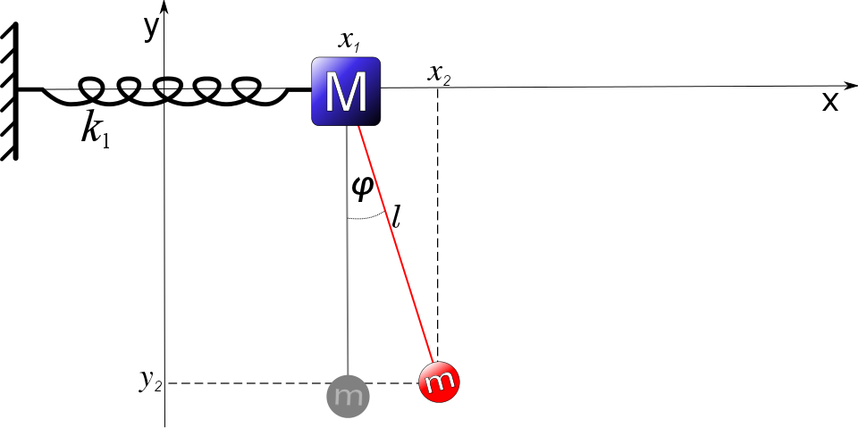
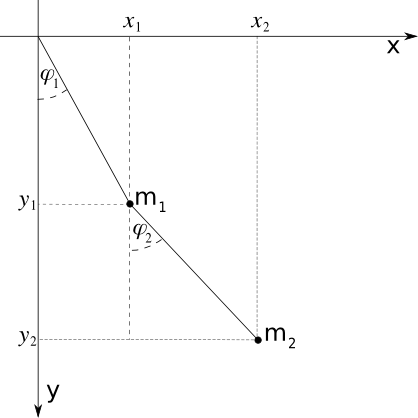
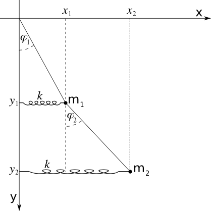

.. -*- coding: utf-8 -*-

Zagadnienie: Drgania \- numeryczne rozwiązywanie równań ruchu
-------------------------------------------------------------

Temat: Drgania normalne i częstości własne w układach dwuwymiarowych
""""""""""""""""""""""""""""""""""""""""""""""""""""""""""""""""""""

Fizyka ciała stałego zawdzięcza swe sukcesy dzięki badaniom  układów  krystalicznych, tzn. przestrzennie periodycznych (i quasi\-periodycznych ) struktur.  Układy te podlegają drganiom termicznym, które  są odpowiedzialne za takie zjawiska jak np. opór elektryczny czy tworzenie par Coopera w układach nadprzewodzących.  W języku mechaniki kwantowej, drgania sieci krystalicznej nazywane sa fononami. Fonony są wersją kwantową specjalnych typów drgań wibracyjnych nazywanych  **modami normalnymi** w mechanice klasycznej.  Układy o wielu stopniach swobody, które posiadają położenia równowagi (zdefiniujemy je poniżej) wykonują małe drgania w odpowiednich reżimach fizycznych. Metody badania małych drgań w układach o jednym stopniu swobody są przedstawione jako odrębne zagadnienie. W tej części, przedstawimy teorię małych drgań dla układów o dwóch stopniach swobody. Przypadek wielu stopni swobody jest zupełnie analogiczny do przypadku o dwóch stopniach swobody i jego teoria niczym nie różni się od tego, co przedstawiamy poniżej.

Aby nie startować od wysokiego stopnia abstrakcji, zacznijmy od przykładu, który w ramach wykładów o mechanice Lagrange'a zazwyczaj jest podawany jako układ z więzami. Jest on połączeniem dwóch dobrze znanych układów:

 #. poziomo poruszający się ciężarek o masie M na sprężynie na który działa liniowa siła sprężystości proporcjonalna do wychylenia  *x* .

 #. płaskie wahadło matematyczne o masie m i nieważkim pręcie o długości l poruszający sie w (ziemskim)  polu grawitacyjnym. 

Musimy zdecydować się na metodę opisu tego typu układów. Ponieważ jest to układ z więzami, najwygodniejszym formalizmem jest formalizm Lagrange'a.

Będziemy analizować tego typu układy w następujących krokach:

Krok 1: Funkcja Lagrange'a
~~~~~~~~~~~~~~~~~~~~~~~~~~

W ramach mechaniki Lagrange'a musimy zdefiniować współrzędne uogólnione dla ciężarka M i wahadła m oraz wyrazić energię kinetyczną oraz energię potencjalną przez prędkości uogólnione i współrzędne uogólnione.

(1) Ciężarek wykonuje tylko ruch poziomy i jego położenie oznaczymy jako

:math:`x_1 = x`

Jego prędkość

:math:`v_1 = \dot x = \frac{dx}{dt}`

Jego energia kinetyczna wynosi

:math:`E_{k1} = \frac{1}{2} M v_1^2 = \frac{1}{2} M \dot x^2`

Jego energia potencjalna (teoretycy często skracaja i mówią "potencjał") ma postać

:math:`U_1=\frac{1}{2} k x^2`

gdzie :math:`k=k_1` jest stała charakteryzującą  sprężynę (stała sprężystości).

(2) Wahadła wykonuje  drgania płaskie w płaszczyźnie :math:`XY`. Kąt wychylenia od pionu (osi OY) oznaczymy przez :math:`\phi`. Jest to współrzędna uogólniona dla wahadła. Współrzędne x-owa i y-owa  wynoszą

:math:`x_2= x_1 + (x_2 - x_1) = x_1 + l sin \phi `

:math:`y_2 = -l sin \phi`

Dwie uwagi:  1. Z rysunku wynika, że  :math:`(x_2 - x_1)/l  =  sin \phi ` (korzystamy z definicji funkcji trygonometrycznej sin x) czyli :math:`(x_2 - x_1)  = l sin \phi `. 2. W wyrażeniu dla :math:`y_2` jest znak minus  ponieważ przyjęliśmy taki układ odniesienia jak na rysunku, tzn. oś :math:`OY` jest skierowana do góry, a wartość :math:`y_2` jest wówczas ujemna.

Odpowiednie składowe prędkości to

:math:`\dot x_2 = \dot x + l \dot\phi cos \phi   `

:math:`\dot y_2 = l \dot\phi sin \phi`

Obliczymy teraz energię kinetyczną wahadła:

:math:`E_{k2} = \frac{1}{2} m v_2^2 = \frac{1}{2} m [\dot x_2^2 + \dot y_2^2] = \frac{1}{2} m [\dot x^2 + l^2 \dot\phi^2 + 2l \dot x \dot \phi cos \phi]`

Jego energia potencjalna ma postać

:math:`U_2=m g  y_2 = -mgl cos \phi `

Następnie budujemy  funkcję Lagrange'a,  która jest różnicą energii kinetycznej i energii potencjalnej układu:

(1) :math:` \quad \quad \quad L= [E_{k1} + E_{k2}]  - [ U_1 + U_2]  = \frac{1}{2} (M+m) \dot x^2 + \frac{1}{2} ml^2 \dot \phi^2 + ml \dot x \dot\phi cos \phi - \frac{1}{2} kx^2+ mgl cos \phi`

Krok 2: Czy istnieją stabilne położenia równowagi
~~~~~~~~~~~~~~~~~~~~~~~~~~~~~~~~~~~~~~~~~~~~~~~~~

Aby analizować małe drgania, musimy sprawdzić, czy istnieje stabilne położenie równowagi, tzn. minimum energii potencjalnej. Całkowita energia potencjalna ma postać

:math:`U = U(x, \phi) = U_1 + U_2 =  \frac{1}{2} kx^2  - mgl cos \phi`

Jest ona  funkcją położeń uogólnionych :math:`x` i :math:`\phi`.

Warunkiem koniecznym dla ekstremum potencjału jest zerowanie się wszystkich  pochodnych cząstkowych pierwszego rzędu

:math:`\frac{\partial U}{\partial x} =  kx = 0  \to x=0, \quad  \quad \quad \frac{\partial U}{\partial \phi} = mgl sin \phi = 0 \to \phi =0 \quad lub \quad \phi = \pi/2`

Można łatwo sprawdzić (badając pochodne 2\-go rzędu), że  tylko punkt

:math:`\{x=0, \phi = 0\}`

odpowiada minimum potencjału i dlatego jest to stabilny punkt równowagi.

Krok 3: Funkcja Lagrange'a w reżimie  małych drgań
~~~~~~~~~~~~~~~~~~~~~~~~~~~~~~~~~~~~~~~~~~~~~~~~~~

W następnym kroku rozwijamy w szereg Taylora wszystkie funkcje współrzędnych uogólnionych wokół położenia równowagi. W rozwinięciu Taylora uwzględniamy nietrywialne wyrazy najniższego rzędu i pomijamy wszystkie wyrazy rzędu wyższego. Co to znaczy "nietrywialne"? Oznacza to rozwinięcie energii potencjalnej w szereg Taylora do wyrazów drugiego rzędu (:math:`x^2, x\phi, \phi^2`),  ponieważ wyraz stały nie jest istotny (pamiętamy, że energia potencjalna jest określona z dokładnością do stałego składnika), a wyrazy pierwszego rzędu zerują się (ponieważ jest to ekstremum). W wyrazach dla energii kinetycznej funkcje zależne od współrzędnych uogólnionych są rozwijane do wyrazów najniższego rzędu. Np. wyraz  w energii kinetycznej

:math:` ml\dot x \dot \phi cos \phi \approx ml\dot x \dot \phi`.

Ostatecznie, funkcja Lagrange'a dla układu w otoczeniu położenia równowagi przyjmuje postać

(2) :math:`\quad \quad \quad L=  \frac{1}{2} (M+m) \dot x^2 +  \frac{1}{2} ml^2 \dot \phi^2 + ml \dot x \dot\phi  -  [\frac{1}{2} kx^2 + \frac{1}{2}mgl \phi^2]`

Ponieważ funkcja Lagrange'a nie zależy w sposób jawny od czasu, to istnieje całḱa energii  E (całkowita energia układu jest zachowana). Gdy całkowita energia E jest nieco większa niż minimalna wartość energii potencjalnej, układ wykonuje drgania w otoczeniu minimum energii potencjalnej. Pokażemy to explicite rozwiązując odpowiednie równania ruchu, tzn.  równania Eulera\-Lagrange'a.

Krok 4: Równania ruchu
~~~~~~~~~~~~~~~~~~~~~~

Równania Eulera\-Lagrange'a otrzymujemy z relacji:

:math:`\frac{d}{dt} (\frac{\partial L}{\partial \dot q_i}) = \frac{\partial L}{\partial q_i}, \quad \quad q_i = x, \phi`

Po obliczeniu odpowiednich pochodnych, otrzymamy równania ruchu w postaci:

(3a) :math:` \quad\quad\quad (M+m) \ddot x +ml \ddot \phi = -kx`

(3b) :math:`\quad\quad\quad ml \ddot x + ml^2 \ddot \phi = -mgl \phi`

Jest to układ 2 liniowych równań różniczkowych 2\-go rzędu. Zakładamy, że rozwiązania są w postaci funkcji  periodycznych:

:math:`x(t) = A sin (\omega t + \alpha)`

:math:`\phi(t) = B sin (\omega t + \alpha)`

Zamiast funkcji :math:`sin (\omega t + \alpha)` można użyć funkcji :math:`cos( \omega t + \alpha)` lub funkcji :math:`exp[ i(\omega t + \alpha)])`. Zauważmy, że dla każdej z tych funkcji

:math:`\ddot x = - \omega^2 x, \quad\quad\quad \ddot \phi =  - \omega^2 \phi`

Krok 5: Zagadnienie własne dla problemu małych drgań
~~~~~~~~~~~~~~~~~~~~~~~~~~~~~~~~~~~~~~~~~~~~~~~~~~~~

Wstawiamy powyższe relacje  do równań ruchu otrzymując  pewną formę zagadnienia własnego:

(4a):math:` \quad\quad\quad [k-(M+m)\omega^2] A -ml \omega^2 B =0`

(4b) :math:` \quad\quad\quad -ml\omega^2 A + [mgl -ml^2 \omega^2] B =0`

Otrzymujemy  jednorodny układ dwóch równań liniowych dla niewiadomych :math:`A` i :math:`B` oraz nieznanej częstości :math:`\omega`. Jest to zagadnnienie podobne do zagadnienia własnego dla macierzy. Podobnie jak dla zagadnienia własnego, powyższy  układ równań ma zawsze trywialne ( tzn. zerowe) rozwiązanie :math:`A=B=0`. Ale nas interesują nietrywialne rozwiązania. Aby istniały nietrywialne rozwiązania, wyznacznik z macierzy współczynników tego równania musi się zerować, tzn.

:math:`\quad \quad \quad \quad   \left| \begin{matrix}k-(M+m)\omega^2 &amp; -ml \omega^2\\ -ml\omega^2&amp; mgl -ml^2 \omega^2 \end{matrix}\right| = 0 `

Obliczając wyznacznik otrzymamy równanie dla nieznanej częstości częstości :math:`\omega`:

:math:`lM \omega^4 - [lk + g(M+m)]\omega^2 + gk=0`

Jest to trójmian kwadratowy dla :math:`Z = \omega^2`. Rozwiązaniem są dwa pierwiastki :math:`Z_1 = \omega_1^2` oraz :math:`Z_2 = \omega_2^2` dane przez dobrze znane wzory.

Krok 5: Skalowanie 
~~~~~~~~~~~~~~~~~~~

W tym miejscu warto zastanowić  się nad następującym problemem: ile parametrów charakteryzuje układ. Odpowiedź może wydawać się oczywista: tyle ile pojawia się w funkcji Lagrange'a, tzn.

$M,\quad  m, \quad  l, \quad  k,  \quad g$

Czy faktycznie jest 5 niezależnych parameterów charakteryzujących układ? W odróżnieniu od matematyków, fizycy badają świat rzeczywisty i starają się zredukować liczbę parametrów, które istotnie wpływają na własności układu fizycznego.  Do tego właśnie potrzebne jest  **skalowanie i  definiowanie wielkości bezwymiarowych** . Jak to wygląda w analizowanym przypadku. Ano tak:  podzielmy powyższe  równanie  przez czynnik :math:` lM` przy :math:`\omega^4` otrzymując taką oto postać:

:math:`Z^2 - [\Omega_0^2 + \omega_0^2(1+\frac{m}{M})] Z + \omega_0^2 \Omega_0^2 =0`

gdzie

:math:` \Omega_0^2 = \frac{k}{M}, \quad \quad \omega_0^2 = \frac{g}{l}`

są charakterystycznymi częstościami drgań podukładów niesprzężonych: :math:`\Omega_0` jest częstością oscylacji ciężarka na sprężynce oraz :math:` \omega_0` jest częstością oscylacji wahadła matematycznego. Z tego wynika  ważny wniosek: fizyka układu zależy od 3 wielkości, a mianowicie od 2 charakterystycznych częstości :math:`\Omega_0` i :math:`\omega_0` układu bez sprzężenia oraz stosunku mas :math:`m/ M` wahadła i ciężarka. To jest właśnie fizyka tego układu! Uff, skalowanie to jest zawsze poważny problem dla studentów (i często dla profesorów).

Krok 6: Wartości własne (częstości własne)
~~~~~~~~~~~~~~~~~~~~~~~~~~~~~~~~~~~~~~~~~~

Rozwiązaniem trójmianu  kwadratowego są 2 pierwiastki:

:math:`X_1= \omega_1^2 = \frac{1}{2} [b +\sqrt\Delta] &gt; 0, \quad \quad X_2= \omega_2^2 = \frac{1}{2} [b -\sqrt\Delta] &gt; 0 `

gdzie

:math:`b = \Omega_0^2 + \omega_0^2(1+\frac{m}{M}), \quad\quad \Delta = b^2 - 4 \omega_0^2 \Omega_0^2`

Otrzymujemy 2 dodatnie częstości własne :math:`\omega_1` oraz :math:`\omega_2`. Ujemne wartości częstości są równoważne i jedynie mogą wpływać na przedefiniowanie faz w

w rozwiązaniach periodycznych, które to z kolei i tak są określone przez warunki początkowe.

Krok 7: Wektory własne (drgania normalne)
~~~~~~~~~~~~~~~~~~~~~~~~~~~~~~~~~~~~~~~~~

Jeżeli znamy częstości własne, to korzystając z równania  (4a) lub (4b) możemy wyznaczyć 2 wektory własne czyli wyznaczyć amplitudy drgań własnych. Aby wyznaczyć

pierwszy wektor własny, należy pierwszą częstość własną :math:`\omega_1` wstawić do jednego z równań (4).  Tak procedura pozwala wyznaczyć  zależność amplitudy A od amplitudy B lub odwrotnie.  Dla przykładu, skorzystamy z równania (4b). Napiszemy go w przeskalowanej postaci (dzielimy przez :math:`ml`, mnożymy przez (-1) i wyciągamy przed nawias :math:`l` w drugim składniku)

:math:`\omega^2 A + l [\omega^2 - \omega_0^2] B = 0`

Dla pierwszej wartości własnej :math:`\omega_1^2` otrzymamy

:math:`\omega_1^2 A_1 + l [\omega_1^2 - \omega_0^2] B_1 = 0 \quad  --&gt; A_1= l \;[\frac{\omega_0^2}{ \omega_1^2} - 1] B_1`

Stąd pierwsza para rozwiązań

:math:`x_1(t) = A_1 sin (\omega_1 t + \alpha_1) = l \;[\frac{\omega_0^2}{ \omega_1^2} - 1] B_1 sin (\omega_1 t + \alpha_1)`

:math:`\phi_1(t) = B_1 sin (\omega_1 t + \alpha_1)`

Ta para rozwiązań nazywa się pierwszym drganiem normalnym.

Pierwszy wektor własny ma postać

:math:`X_1= [A_1, B_1] = [ l \;(\frac{\omega_0^2}{ \omega_1^2} - 1), 1 ] B_1`.

Podobnie dla drugiej  wartości własnej :math:`\omega_2^2` otrzymamy

:math:`\omega_2^2 A_2 + l [\omega_2^2 - \omega_0^2] B_2 = 0 \quad  --&gt; A_2= l \;[\frac{\omega_0^2}{ \omega_2^2} - 1] B_2`

Stąd pierwsza para rozwiązań

:math:`x_2(t) = A_2 sin (\omega_2 t + \alpha_2) = l \;[\frac{\omega_0^2}{ \omega_2^2} - 1] B_2 sin (\omega_2 t + \alpha_2)`

:math:`\phi_2(t) = B_2 sin (\omega_2 t + \alpha_2)`

Ta para rozwiązań nazywa się drugim  drganiem normalnym.

Drugi  wektor własny ma postać

:math:`X_2= [A_2, B_2] = [ l \;(\frac{\omega_0^2}{ \omega_2^2} - 1), 1 ] B_2`.

Krok 8: Współrzędne normalne
~~~~~~~~~~~~~~~~~~~~~~~~~~~~

Ponieważ równania ruchu są liniowymi równaniami różniczkowymi to pełne ich rozwiązanie jest kombinacją liniową 2 rozwiązań szczególnych dla :math:`\omega_1` oraz :math:`\omega_2`. Ma ono postać

:math:`x(t) = x_1(t) + x_2(t)  = l \;[\frac{\omega_0^2}{ \omega_1^2} - 1] B_1 sin (\omega_1 t + \alpha_1) + l \;[\frac{\omega_0^2}{ \omega_2^2} - 1] B_2 sin (\omega_2 t + \alpha_2)`

:math:`\phi(t) = \phi_1(t) + \phi_2(t)  = B_1 sin (\omega_1 t + \alpha_1) + B_2 sin (\omega_2 t + \alpha_2)`

Wprowadzamy nowe oznaczenia

(5) :math:`\quad \quad \quad Q_1(t) = B_1 sin (\omega_1 t + \alpha_1), \quad \quad \quad  Q_2(t)=  B_2 sin (\omega_2 t + \alpha_2)`

Nazywają sie one współrzędnymi normalnymi.

W nowych oznaczeniach rozwiązanie ma postać

:math:`x(t) = \epsilon_1 Q_1(t) + \epsilon_2 Q_2(t), \quad \quad \epsilon_1 = l \;[\frac{\omega_0^2}{ \omega_1^2} - 1], \quad  \epsilon_2 = l \;[\frac{\omega_0^2}{ \omega_2^2} - 1]`

:math:`\phi(t) = Q_1(t)+Q_2(t)`

Z tych  związków można wyznaczyć zależność współrzędnych normalnych od współrzędnych uogólnionych:

:math:`Q_1 = \frac{1}{\epsilon_1-\epsilon_2}(x-\epsilon_2 \phi)`

:math:`Q_2 = \frac{1}{\epsilon_2-\epsilon_1}(x-\epsilon_1 \phi)`

ZADANIA
=======

**Zadanie 1.** Sprawdź, że w punkcie   f
 0
 ;
 0
 g
  energia potencjalna  osiąga minimum.

Wskazówka: Należy obliczyć pochodne cząstkowe 2\-go rzędu i zbadać znak wyznacznika Hessego.

**Zadanie 2.** Jakie równania różniczkowe spełniają współrzędne normalne?

Wskazówka: patrz definicja współrzędnych normalnych we wzorach (5)

**Zadanie 3.**  Pokaż, że funkcja  Lagrange'a we współrzędnych normalnych ma postać:

L
 =
 2
 1
 [
 Q
 2
 1
 _
 \+
 Q
 2
 2
 _
 ]
 ¡
 2
 1
 [
 !
 1
 2
 Q
 2
 1
 \+
 !
 2
 2
 Q
 2
 2
 ]

Jak widać, funkcja Lagrange'a rozpada się na 2 funkcje Lagrange'a, opisujące niezależne podukłady.

**Zadanie 4.**   Zbadaj zachowanie się rozwiązań  x
 (
 t
 )
  oraz  Á
 (
 t
 )
  dla szczególnego przypadku:

(1)  m=
 M
 =
 1
 ;
 
 !
 0
 =
 ­
 0
 =
 1

**Zadanie 5.**   Zbadaj analogicznie jak powyżej, problem małych drgań dla płaskiego wahadła podwójnego. Wyznacz drgania własne i współrzędne normalne.

**Zadanie 6.**   Zbadaj analogicznie jak powyżej, problem małych drgań dla ukłądu przedstawionego na rysunku. Wyznacz drgania własne i współrzędne normalne.

.. code-block:: python

    sage: l, m, M, omega, l, k, g = var('l, m, M, omega, l, k, g')
    sage: rownanie(omega, l, m, M, l, k, g) = l*M*omega^4 - (l*k + g*(M+m))*omega^2 + g*k == 0
    sage: show(rownanie)

.. MATH::

    \left( \omega, l, m, M, l, k, g \right) \ {\mapsto} \ M l \omega^{4} - {\left({\left(M + m\right)} g + k l\right)} \omega^{2} + g k = 0

.. end of output

.. code-block:: python

    sage: rozw = solve(row,omega)
    sage: w = []
    sage: for pierwiastek in rozw: 
    ...       w.append(pierwiastek.rhs())
    ...       show(pierwiastek.rhs())
    ...       plot(pierwiastek.rhs()(g=9.81,m=1,M=1,k=1),(l,0.1,1), thickness=3).show(axes_labels=['$l$','$\omega$'], dpi=50, fontsize=22)

.. MATH::

    -\frac{1}{2} \, \sqrt{\frac{g m}{M l} + \frac{k}{M} + \frac{g}{l} + \frac{\sqrt{M^{2} g^{2} + 2 \, M g^{2} m - 2 \, M g k l + g^{2} m^{2} + 2 \, g k l m + k^{2} l^{2}}}{M l}} \sqrt{2}

.. image:: iCSE_FMklas04_z57_media/cell_5_sage0.png
    :align: center

.. MATH::

    \frac{1}{2} \, \sqrt{\frac{g m}{M l} + \frac{k}{M} + \frac{g}{l} + \frac{\sqrt{M^{2} g^{2} + 2 \, M g^{2} m - 2 \, M g k l + g^{2} m^{2} + 2 \, g k l m + k^{2} l^{2}}}{M l}} \sqrt{2}

.. image:: iCSE_FMklas04_z57_media/cell_5_sage1.png
    :align: center

.. MATH::

    -\frac{1}{2} \, \sqrt{\frac{g m}{M l} + \frac{k}{M} + \frac{g}{l} - \frac{\sqrt{M^{2} g^{2} + 2 \, M g^{2} m - 2 \, M g k l + g^{2} m^{2} + 2 \, g k l m + k^{2} l^{2}}}{M l}} \sqrt{2}

.. image:: iCSE_FMklas04_z57_media/cell_5_sage2.png
    :align: center

.. MATH::

    \frac{1}{2} \, \sqrt{\frac{g m}{M l} + \frac{k}{M} + \frac{g}{l} - \frac{\sqrt{M^{2} g^{2} + 2 \, M g^{2} m - 2 \, M g k l + g^{2} m^{2} + 2 \, g k l m + k^{2} l^{2}}}{M l}} \sqrt{2}

.. image:: iCSE_FMklas04_z57_media/cell_5_sage3.png
    :align: center

.. end of output

