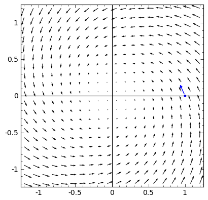
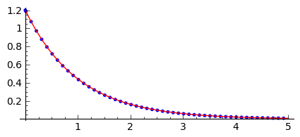
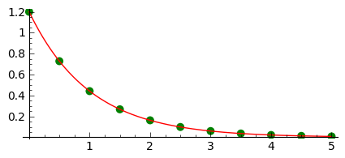
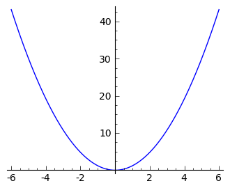
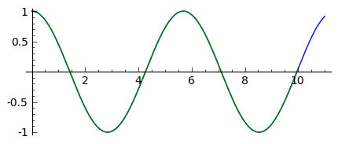
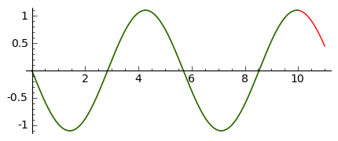

Co to jest równanie różniczkowe?
================================

Równanie różniczkowe to zależność między szukaną funkcją a jej
pochodnymi.

W ogólnym przypadku mówimy o równaniu stopnia $n$-tego jeśli mamy
relację:

$$F(y^{(n)}(x),y^{(n-1)}(x),\dots,y(x),x) = 0,$$

gdzie:

-   $y^{(n)}(x) = \frac{d^n f(x)}{dx^n}.$
-   $y(x)$ jest szukaną funkcją, lub zmienną zależną,
-   $x$ jest zwane zmienną niezależną

Możemy mieć też sytuację, że mamy $m$ równań $n$-tego stopnia na $m$
funkcji $y_i.$ Szczególnym przypadkiem jest układ $m$ równań pierwszego
stopnia $m$ funkcji. Okazuje się, że można z równania $n$ tego stopnia,
utworzyć równoważny układ $n$ równań pierwszego stopnia.

Przykład: równanie Newtona dla jednej cząstki w jednym wymiarze
---------------------------------------------------------------

Ruch cząstki opisywany jest przez:

$$m  a  = F$$

Przyśpieszenie jest drugą pochodną położenia po czasie, a siła jest w
ogólności pewną funkcja położenia $x$ i czasu. Mamy więc:

$$m \ddot x  =  F(\dot x, x, t)$$

Wprowadźmy teraz nową funkcję $v = \frac{dx(t)}{dt}$. Podstawiając w
poprzednim równaniu można zapisać:

$$\begin{cases} \dot x = v \\ \dot v = - \frac{F(\dot x,x,t)}{m} x. \end{cases}$$

Widzimy, że z jednego równana drugiego stopnia otrzymaliśmy układ dwóch
równań pierwszego stopnia.

Równania pierwszego rzędu często przedstawia się w postaci w której po
prawej stronie znaku równości stoi pochodna a po lewej wyrażenie
zależące od funkcji:

$$\underbrace{\frac{dx}{dt}}_{\text{pochodna }} = \underbrace{f(x,t)}_{\text{prawa strona równania, ang. RHS}}$$

Geometryczna interpretacja równań różniczkowych.
================================================

Rozważmy układ dwóch równań:

$$\begin{cases} \dot x = f(x,y) \\ \dot y = g(x,y) \end{cases}.$$

Jest to tak zwany dwuwymiarowy autonomiczny układ równań różniczkowych
zwyczajnych. Autonomiczność oznacza niezależność prawych stron od czasu
(tzn. zmiennej niezależnej). Przykładem takiego układu może być ruch
cząstki w jednym wymiarze z siłami niezależnymi od czasu.

Równania z powyższego układu możemy przybliżyć zastępując pochodne
ilorazem różnicowym:

$$\begin{cases} \frac{x(t+h)-x(t)}{h} = f(x,y) \\ \frac{y(t+h)-y(t)}{h} = g(x,y) \end{cases},$$

mnożąc każde równanie przez $h$ oraz przenosząc człon z wartościamy
zmiennych zależnych w chwili $t$ na prawą strone otrzymujemy:

$$\begin{cases} x(t+h) = x(t) + h \cdot f(x,y) \\ y(t+h) = y(t) +h \cdot g(x,y). \end{cases}$$

Zgodnie z definicją pochodnej, w granicy $h\to\infty$ wyrażenia $f(x,y)$
mogą być brane w chwili pomiędzy $t$ a $t+h$. Przyjmijmy dla ułatwienia,
że będziemy brali chwilę $t$.

<div class="admonition note">

Komentarz: taki wybór prowadzi do tak zwanego algorytmu jawnego, jeśli
wzięlibyśmy chwilę np. $t+h$ to byłby to algorytm uwikłany i wykonanie
kroku było by związane z rozwiązaniem równań algebraicznych.

</div>

Układ ten posiada ciekawą interpretację:

-   po pierwsze zauważmy, że para funkcji wyznacza pole wektorowe na
    płaszczyźnie
-   po drugie równania te dają nam przepis jak z wartości funkcji w
    chwili $t$ otrzymać wartość z "następnej" chwili $t+h$ co może być
    przydatne do odtworzenia krzywej $(x(t),y(t))$.

Pole wektorowe
--------------

Polem wektorowe to funkcja, która każdemu punktowi przestrzeni
przyporządkowuje pewną wielkość wektorową. Jeśli przestrzenią będzie np.
$\mathbb{R}^2$ to taka funkcja będzie składała się z dwóch funkcji
skalarnych:

$$\vec F(x,y) = \begin{cases}f(x,y) \\  g(x,y) \end{cases}$$

Takie pole wektorowe można zwizualizować rysując strzałki dla pewnej
ilości punktów na płaszczyżnie. Przykładem powszechnego użycia takiego
pola wektorowego jest pole prędkości wiatru.

W Sage możemy narysować pole wektorowe za pomocą `plot_vector_field.`

``` {.sourceCode .python}
sage: var('x y')
sage: f(x,y) = -0.4*x - 0.9*y
sage: g(x,y) = 0.9*x - 0.4*y
sage: plt_v = plot_vector_field((f(x,y),g(x,y)),(x,-1.2,1.2),(y,-1.2,1.2),figsize=6,aspect_ratio=1)
sage: plt_v
```


Graficzne rozwiązanie układu dwóch równań różniczkowych
-------------------------------------------------------

Stosując powyżej wyprowadzone wzory przybliżone na pozwalające wyliczyć
rozwiązanie układu równań różniczkowych w chwili $t+h$ znając je w
chwili $t$ możemy sprobować naszkicować rozwiązanie na podstawie wykresu
pola wektorowego. Wystarczy poruszać się małymi krokami zgodnie z
lokalnym kierunkiem strzałek.

Spróbujmy wykonać to przy pomocy algorytmu:

1.  bierzemy punkt startowy w $t$
2.  obliczamy punkt w chwili $t+h$
3.  rysujemy punkt końcowy na wykresie
4.  punkt koncowy bierzemy jako punkt startowy
5.  powracamy do 1.

``` {.sourceCode .python}
sage: x0,y0 = (1,0)
sage: h = 0.2
```

Wykonując tą komórkę wiele razy otrzymujemy kolejne kroki algrorytmu:

``` {.sourceCode .python}
sage: x1,y1 = x0+h*f(x0,y0),y0+h*g(x0,y0) 
sage: plt_v = plt_v + point((x0,y0)) +  arrow2d( (x0,y0), (x0+h*f(x0,y0),y0+h*g(x0,y0)    ),width=1,arrowsize=2,arrowshorten=-10,aspect_ratio=1 )
sage: x0,y0  = x1,y1 
sage: plt_v
```



``` {.sourceCode .python}
sage: h=0.2
sage: x0,y0 = (1,0)
sage: plts=[plot_vector_field((f(x,y),g(x,y)),(x,-1.2,1.2),(y,-1.2,1.2),figsize=(4,4),aspect_ratio=1)]
sage: for i in range(25):
...       x1,y1 = x0+h*f(x0,y0),y0+h*g(x0,y0) 
...       plt_v = plt_v + point((x0,y0)) +  arrow( (x0,y0), (x0+h*f(x0,y0),y0+h*g(x0,y0)) ,width=1,arrowsize=2,arrowshorten=-10  )
...       x0,y0  = x1,y1 
...       plts.append( plt_v )
```

``` {.sourceCode .python}
sage: animate(plts).show()
```

Mamy następujące wnioski:

1.  Rozwiązanie układu 2 równań pierwszego rzędu jest krzywą w
    przestrzeni $\mathbb{R}^2.$
2.  Krzywa zależy od wyboru punktu początkowego.
3.  Dwa rozwiązania wychodzące od różnych punktów początkowych mogą się
    schodzić do jednego punktu, ale **nie mogą się przecinać!**
4.  Ponieważ mamy nieograniczony wybór punktów początkowych i
    zachodzi (3) to rozwiązaniem układu dwóch równań jest dwuparametrowa
    rodzina krzywych płaskich.

Równanie różniczkowe (lub układ równań) z warunkiem początkowym nazywa
się w matematyce zagadnieniem Cauchy'ego. Punkt (3) jest znany jako
Twierdzenie Piccarda o istnieniu i jednoznaczności rozwiązań zagadnienia
Cauchy'ego i warto odnotować, że nakłada ono pewne ograniczenia na
zmienność prawych stron układu równań.

Analityczne rozwiązania równań różniczkowych
--------------------------------------------

Równania różniczkowe można analizować za pomocą metody graficznej a
wartości liczbowe można otrzymywać z dowolną dokładnościa z użyciem
metody przybliżonej. Metody te nie ograniczają w żaden sposób postaci
prawych stron układu.

Czy można otrzymać analityczny wzór na rodzinę funkcji będących
rozwiązaniem równania różniczkowego?

Jest to w ogólnym przypadku trudne, jednak jest kilka postaci równań
różniczkowych w których zawsze możemy znaleźć rozwiązanie analityczne.
Jedym z takich przypadków to jedno równanie separowalne pierwszego
stopnia. Separowalność oznacza, że prawa strona jest iloczynem funkcji
$x$ i $t$:

$$\frac{dx}{dt} = f(x,t) = a(x)\cdot b(t).$$

W takim przypadku możemy zapisać równanie, traktując pochodną jako
iloczyn różniczek:

$$\frac{dx}{dt} = a(x)\cdot b(t)$$

i scałkować obustronnie powyższe wyrażenie. Ponieważ lewa strona nie
zawiera jawnie czasu całkowanie po $x$ przeprowadzamy tak jakby $x$ było
zmienną niezależną.

### Przykład:

$$\frac{dx}{dt} = - k x$$

$$\frac{dx}{x} =-k dt$$

$$\log(x(t)) =-k t + C$$

przy założeniu, że $x>0$.

Rozwikłując $x$ mamy:

$$x(t) = e^{-kt +C}$$

Zobaczmy jak stała całkowania zależy od warunku początkowego. Niech
$x(0)=x_0$, mamy:

$$x(t=0) = e^{-k0+C} =e^{C}.$$

Możemy więc zapisać rozwiązanie z warunkiem początkowym $x(0)=x_0$ jako:

$$x(t) =x_0 e^{-kt}.$$

Sprawdźmy czy to rozwiązanie zgadza się z otrzymanym metodą przybliżoną:

``` {.sourceCode .python}
sage: L = []
```

``` {.sourceCode .python}
sage: k=1.0
sage: dt = 0.01
sage: x0=1.2
sage: X = x0
sage: czas = 0
sage: xt=[X]
sage: ts=[0]
sage: for i in range(500):
...       X = X + dt*(-k*X)
...       czas = czas + dt
...       if not i%10:
...           xt.append(X)
...           ts.append(czas)
...       
sage: var('t')
sage: p1 = plot( x0*exp(-k*t) ,(t,0,5),color='red',figsize=(5,2) )
sage: p2 = point(zip(ts,xt))
sage: p1+p2
```



Praktyczne rozwiązywanie równań różniczkowych z wykorzystaniem funkcji wbudowanej: `desolve_odeint`
---------------------------------------------------------------------------------------------------

W systemie Sage jest wbudowanych kilka algorytmów, które znacznie
dokładniej i wydajniej potrafią rozwiązać równania różniczkowe. Nie
wchodząc w szczegóły ich implementacji warto nauczyć się nimi
posługiwać.

Jednym z lepszych narzędzi jest funkcja `desolve_system:`

``` {.sourceCode .python}
desolve_odeint(prawe strony równań różniczkowych, warunki początkowe,czasy,szukane)
```

Dla naszego przykładu mamy użycie tej procedury wygląda w następujący
sposób:

``` {.sourceCode .python}
sage: f=-k*x
sage: ic=1.2
sage: t=srange(0,5.01,0.5)
sage: sol=desolve_odeint(f,ic,t,x)
sage: p=points(zip(t,sol[:,0]),size=40,color='green')
sage: (p1+p).show()
sage: print k,t
1.00000000000000 [0.000000000000000, 0.500000000000000, 1.00000000000000, 1.50000000000000, 2.00000000000000, 2.50000000000000, 3.00000000000000, 3.50000000000000, 4.00000000000000, 4.50000000000000, 5.00000000000000]
```



Rozwiązanie jest przekazywane w postaci macierzy (dokładnie mówiąc typu
np.array z pakietu numpy) w której dla $n$ równań każdy rząd zawiera
wartości $n$-zmiennych w kolejnych chwilach czasu.

W naszym przypadku mamy jedno równanie:

``` {.sourceCode .python}
sage: sol.shape
(11, 1)
```

``` {.sourceCode .python}
sage: type(sol)
<type 'numpy.ndarray'>
```

``` {.sourceCode .python}
sage: import numpy as np 
sage: a = np.array([[1,2,3],[3,4,5]])
sage: print a,a.shape
[[1 2 3]
 [3 4 5]] (2, 3)
```

``` {.sourceCode .python}
sage: a[:,0]
array([1, 3])
```

Przykład 1: oscylator harmoniczny
---------------------------------

Układ dwóch równań różniczkowych odpowiadającego ruchowi cząstki w
potencjale (1d)

$$U(x) = \frac{1}{2} k x^2$$

Równanie Newtona:

$$m \ddot x = m  a  = F = -U'(x)  =  -k x$$

co można zapisać:

$$\begin{cases} \dot x = v \\ \dot v = - k x \end{cases}$$

``` {.sourceCode .python}
sage: var('t')
sage: var('x, v')
sage: k = 1.2
sage: times = srange(0.0, 11.0, 0.025, include_endpoint=True) 
sage: sol = desolve_odeint([v, -k*x], [1,0], times, [x,v])
```

Narysujmy potencjał:

``` {.sourceCode .python}
sage: plot(k*x^2,(x,-6,6),figsize=4)
```



``` {.sourceCode .python}
sage: len(times)
441
```

Rozwiązanie jest tablicą numpy (zob. [Wprowadzenie do
numpy](https://sage2.icse.us.edu.pl/home/pub/114/) ), która może być
wygodnie i wydajnie przeszukiwana przez technikę "slicing", np:

``` {.sourceCode .python}
sage: sol[::200,:]
array([[ 1.        ,  0.        ],
       [ 0.69241901,  0.7903589 ],
       [-0.0411118 ,  1.09451919]])
```

Zależność parametryczną $(x(t),v(t))$ możemy przedstawić na płaszczyźnie
(x,v):

Zależności od czasu, prędkości i położenia dane są przez funkcje
okresowe:

``` {.sourceCode .python}
sage: var('x v')
sage: k = 1.2
sage: sol = desolve_odeint([v, -k*x], [3.1,0], times, [x,v])
sage: px = line(zip(times,sol[:,0]),figsize=(5,2))
sage: pv = line(zip(times,sol[:,1]),figsize=(5,2),color='red')
sage: px+pv
```


Ponieważ układ ten jest znany jako oscylator harmoniczny i wiemy, że
rozwiązanie dla warunku początkowego $x(0)=1$, $v(0)=0$ jest w postaci:

$$x(t) = \cos(\sqrt{k}t), v(t) = -\sin(\sqrt{k}t).$$

zatem możemy porównać wynik metody przybliżonej i rozwiązanie
analityczne.

Rozwiązanie analityczne, możemy też otrzymać stosując funkcję Sage
desolve, która rozwiązuje równania róźniczkowe symbolicznie:

``` {.sourceCode .python}
sage: var('t k')
sage: assume(k>0)
sage: x = function('x', t)
sage: de = diff(x,t,2) == -k*x
sage: desolve(de, x,ivar=t)
k1*sin(sqrt(k)*t) + k2*cos(sqrt(k)*t)
```

Nawet jeśli, znamy postać rozwiązania równania różniczkowego, to możemy
zawsze wykorzystać desolve, to poprawnego zastosowania warunku
początkowego. Weźmy na przykład oscylator harmoniczny, w którym w chwili
początkowej mamy $x(0)=x_0$ i $v(0)=v_0$:

``` {.sourceCode .python}
sage: var('t k')
sage: assume(k>0)
sage: x = function('x', t)
sage: de = diff(x,t,2) == -k*x
sage: var('v0,x0')
sage: show( desolve(de, x,ics=[0,x0,v0],ivar=t))
```

$$x_{0} \cos\left(\sqrt{k} t\right) + \frac{v_{0} \sin\left(\sqrt{k} t\right)}{\sqrt{k}}$$

Porównajmy zatem rozwiązanie numeryczne i analityczny dla warunku
początkowego $x_0,v_0=0,1$:

``` {.sourceCode .python}
sage: var('t x v')
sage: k=1.22
sage: sol = desolve_odeint([v, -k*(x)], [1.,0], times, [x,v])
sage: px = line(zip(times,sol[:,0]),figsize=(5,2))
sage: px+plot(cos(sqrt(k)*t),(t,0,10),color='green')
```



``` {.sourceCode .python}
sage: var('t')
sage: pv = line(zip(times,sol[:,1]),figsize=(5,2),color='red')
sage: pv+plot(-sqrt(k)*sin(sqrt(k)*t),(t,0,10),color='green')
```



Przykład 2: wahadło matematyczne:
---------------------------------

Równanie Newtona:

$$m \ddot x = m  a  = F = -U'(x)  =  -k \sin(x)$$

co można zapisać:

$$\begin{cases} \dot x = v \\ \dot v = - k \sin(x) \end{cases}$$
