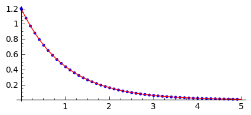
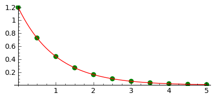

.. -*- coding: utf-8 -*-

Łagodne wprowadzenie do równań różniczkowych
============================================

Co to jest równanie różniczkowe?
-------------------------------- 

Równanie różniczkowe to zależność między szukaną funkcją a jej pochodnymi.

W ogólnym przypadku mówimy o równaniu stopnia :math:`n`-tego jeśli  mamy  relację:

.. MATH::

    F(y^{(n)}(x),y^{(n-1)}(x),\dots,y(x),x) = 0,

gdzie:

- :math:`y^{(n)}(x) = \frac{d^n f(x)}{dx^n}.`  

- :math:`y(x)` jest szukaną funkcją, lub zmienną zależną, 

- :math:`x` jest zwane zmienną niezależną 

Możemy mieć też sytuację, że mamy :math:`m` równań :math:`n`-tego stopnia na :math:`m` funkcji :math:`y_i.` Szczególnym przypadkiem jest układ :math:`m` równań pierwszego stopnia :math:`m` funkcji. Okazuje się, że można z równania :math:`n` tego stopnia, utworzyć równoważny układ :math:`n` równań pierwszego stopnia.

Przykład: równanie Newtona dla jednej cząstki w jednym wymiarze
~~~~~~~~~~~~~~~~~~~~~~~~~~~~~~~~~~~~~~~~~~~~~~~~~~~~~~~~~~~~~~~

Ruch cząstki opisywany jest przez:

.. MATH::

    m  a  = F

Przyśpieszenie jest drugą pochodną położenia po czasie, a siła jest w ogólności pewną funkcja położenia :math:`x` i czasu. Mamy więc:

.. MATH::

    m \ddot x  =  F(\dot x, x, t)

Wprowadźmy teraz nową funkcję :math:`v = \frac{dx(t)}{dt}`. Podstawiając w poprzednim równaniu  można zapisać:

.. MATH::

     \begin{cases} \dot x = v \\ \dot v = - \frac{F(\dot x,x,t)}{m} x. \end{cases}

Widzimy, że z jednego równana drugiego stopnia otrzymaliśmy układ dwóch równań pierwszego stopnia.

Równania pierwszego rzędu często przedstawia się  w postaci w której po prawej stronie znaku równości stoi pochodna a po lewej wyrażenie zależące od funkcji:

.. MATH::

    \underbrace{\frac{dx}{dt}}_{\text{pochodna }} = \underbrace{f(x,t)}_{\text{prawa strona równania, ang. RHS}}

Geometryczna interpretacja równań różniczkowych.
------------------------------------------------ 

Rozważmy układ dwóch równań:

.. MATH::

     \begin{cases} \dot x = f(x,y) \\ \dot y = g(x,y) \end{cases}.

Jest to tak zwany dwuwymiarowy autonomiczny układ równań różniczkowych zwyczajnych. Autonomiczność oznacza niezależność prawych stron od czasu (tzn. zmiennej niezależnej). Przykładem takiego układu może być ruch cząstki w jednym wymiarze z siłami niezależnymi od czasu.

Równania z powyższego układu możemy przybliżyć zastępując pochodne ilorazem różnicowym:

.. MATH::

     \begin{cases} \frac{x(t+h)-x(t)}{h} = f(x,y) \\ \frac{y(t+h)-y(t)}{h} = g(x,y) \end{cases},

mnożąc każde równanie przez :math:`h` oraz przenosząc człon z wartościamy zmiennych zależnych w chwili :math:`t` na prawą strone otrzymujemy:

.. MATH::

     \begin{cases} x(t+h) = x(t) + h \cdot f(x,y) \\ y(t+h) = y(t) +h \cdot g(x,y). \end{cases}

Zgodnie z definicją pochodnej, w granicy :math:`h\to\infty` wyrażenia :math:`f(x,y)` mogą być brane w chwili pomiędzy :math:`t` a :math:`t+h`. Przyjmijmy dla ułatwienia, że będziemy brali chwilę :math:`t`.

.. note:: 

   Komentarz: taki wybór prowadzi do tak zwanego algorytmu jawnego,
   jeśli wzięlibyśmy chwilę np. :math:`t+h` to byłby to algorytm
   uwikłany i wykonanie kroku było by związane z rozwiązaniem równań
   algebraicznych.

Układ ten posiada ciekawą interpretację:

- po pierwsze zauważmy, że para funkcji wyznacza pole wektorowe na płaszczyźnie  

- po drugie równania te dają nam przepis jak z wartości funkcji w chwili :math:`t` otrzymać wartość z "następnej" chwili :math:`t+h` co może być przydatne do odtworzenia krzywej :math:`(x(t),y(t))`. 

Pole wektorowe
~~~~~~~~~~~~~~

Polem wektorowe to funkcja, która każdemu punktowi przestrzeni przyporządkowuje pewną wielkość wektorową. Jeśli przestrzenią będzie np. :math:`\mathbb{R}^2` to taka funkcja będzie składała się z dwóch funkcji skalarnych:

.. MATH::

    \vec F(x,y) = \begin{cases}f(x,y) \\  g(x,y) \end{cases}

Takie pole wektorowe można zwizualizować rysując strzałki dla pewnej
ilości punktów na płaszczyżnie. Przykładem powszechnego użycia takiego
pola wektorowego jest pole prędkości wiatru.

W Sage możemy narysować pole wektorowe za pomocą  ``plot_vector_field.``

.. code-block:: python

    sage: var('x y')
    sage: f(x,y) = -0.4*x - 0.9*y
    sage: g(x,y) = 0.9*x - 0.4*y
    sage: plt_v = plot_vector_field((f(x,y),g(x,y)),(x,-1.2,1.2),(y,-1.2,1.2),figsize=6,aspect_ratio=1)
    sage: plt_v

.. figure:: lagodne_wprowadzenie_ode_media/pole_wektorowe.png
    :align: center

    Pole wektorowe dla liniowej funkcji wektorowej.

.. end of output

Graficzne rozwiązanie układu dwóch równań różniczkowych
~~~~~~~~~~~~~~~~~~~~~~~~~~~~~~~~~~~~~~~~~~~~~~~~~~~~~~~

Stosując powyżej wyprowadzone wzory przybliżone na pozwalające
wyliczyć rozwiązanie układu równań różniczkowych w chwili :math:`t+h`
znając je w chwili :math:`t` możemy sprobować naszkicować rozwiązanie
na podstawie wykresu pola wektorowego. Wystarczy poruszać się małymi
krokami zgodnie z lokalnym kierunkiem strzałek.

Spróbujmy wykonać to przy pomocy algorytmu:

#. bierzemy punkt startowy w :math:`t` 

#. obliczamy punkt w chwili :math:`t+h` 

#. rysujemy punkt końcowy na wykresie 

#. punkt koncowy bierzemy jako punkt startowy  

#. powracamy do 1. 

.. code-block:: python

    sage: x0,y0 = (1,0)
    sage: h = 0.2

.. end of output

Wykonując tą komórkę wiele razy otrzymujemy kolejne kroki algrorytmu:

.. code-block:: python

    sage: x1,y1 = x0+h*f(x0,y0),y0+h*g(x0,y0) 
    sage: plt_v = plt_v + point((x0,y0)) +  arrow2d( (x0,y0), (x0+h*f(x0,y0),y0+h*g(x0,y0)    ),width=1,arrowsize=2,arrowshorten=-10,aspect_ratio=1 )
    sage: x0,y0  = x1,y1 
    sage: plt_v

.. image:: MS_SS2013_lagodne_wprowadzenie_ode_media/cell_15_sage0.png
    :align: center

.. end of output

.. code-block:: python

    sage: h=0.2
    sage: x0,y0 = (1,0)
    sage: plts=[plot_vector_field((f(x,y),g(x,y)),(x,-1.2,1.2),(y,-1.2,1.2),figsize=(4,4),aspect_ratio=1)]
    sage: for i in range(25):
    ...       x1,y1 = x0+h*f(x0,y0),y0+h*g(x0,y0) 
    ...       plt_v = plt_v + point((x0,y0)) +  arrow( (x0,y0), (x0+h*f(x0,y0),y0+h*g(x0,y0)) ,width=1,arrowsize=2,arrowshorten=-10  )
    ...       x0,y0  = x1,y1 
    ...       plts.append( plt_v )

.. end of output

.. code-block:: python

    sage: animate(plts).show()

.. end of output

Mamy następujące wnioski:

#. Rozwiązanie układu 2 równań pierwszego rzędu jest krzywą w przestrzeni :math:`\mathbb{R}^2.` 

#. Krzywa zależy od wyboru punktu początkowego. 

#. Dwa rozwiązania wychodzące od różnych punktów początkowych mogą się schodzić do jednego punktu, ale  **nie mogą się przecinać!** 

#. Ponieważ mamy nieograniczony wybór punktów początkowych i zachodzi (3) to rozwiązaniem układu dwóch równań jest dwuparametrowa rodzina krzywych płaskich. 

Równanie różniczkowe (lub układ równań) z warunkiem początkowym nazywa się w matematyce zagadnieniem Cauchy'ego. Punkt (3) jest znany jako Twierdzenie Piccarda o istnieniu i jednoznaczności rozwiązań zagadnienia Cauchy'ego i warto odnotować, że nakłada ono pewne ograniczenia na zmienność prawych stron układu równań.

Analityczne rozwiązania równań różniczkowych
~~~~~~~~~~~~~~~~~~~~~~~~~~~~~~~~~~~~~~~~~~~~

Równania różniczkowe można analizować  za pomocą metody graficznej a wartości liczbowe można otrzymywać z dowolną dokładnościa z użyciem metody przybliżonej. Metody te nie ograniczają w żaden sposób postaci prawych stron układu.

Czy można otrzymać analityczny wzór na rodzinę funkcji będących rozwiązaniem równania różniczkowego?

Jest to w ogólnym przypadku trudne, jednak jest kilka postaci równań różniczkowych w których zawsze możemy znaleźć rozwiązanie analityczne. Jedym z takich przypadków to jedno równanie separowalne pierwszego stopnia. Separowalność oznacza, że prawa strona jest iloczynem funkcji :math:`x` i :math:`t`:

.. MATH::

    \frac{dx}{dt} = f(x,t) = a(x)\cdot b(t).

W takim przypadku możemy zapisać równanie, traktując pochodną jako iloczyn różniczek:

.. MATH::

    \frac{dx}{dt} = a(x)\cdot b(t)

i scałkować obustronnie powyższe wyrażenie. Ponieważ lewa strona nie zawiera jawnie czasu całkowanie po :math:`x` przeprowadzamy tak jakby :math:`x` było zmienną niezależną.

Przykład:
"""""""""

.. MATH::

    \frac{dx}{dt} = - k x

.. MATH::

    \frac{dx}{x} =-k dt

.. MATH::

    \log(x(t)) =-k t + C

przy założeniu, że :math:`x>0`.

Rozwikłując :math:`x` mamy:

.. MATH::

     x(t) = e^{-kt +C}

Zobaczmy jak stała całkowania zależy od warunku początkowego. Niech :math:`x(0)=x_0`, mamy:

.. MATH::

     x(t=0) = e^{-k0+C} =e^{C}.

Możemy więc zapisać rozwiązanie z warunkiem początkowym :math:`x(0)=x_0` jako:

.. MATH::

     x(t) =x_0 e^{-kt}.

Sprawdźmy czy to rozwiązanie zgadza się z otrzymanym metodą przybliżoną:

.. code-block:: python

    sage: L = []

.. end of output

.. code-block:: python

    sage: k=1.0
    sage: dt = 0.01
    sage: x0=1.2
    sage: X = x0
    sage: czas = 0
    sage: xt=[X]
    sage: ts=[0]
    sage: for i in range(500):
    ...       X = X + dt*(-k*X)
    ...       czas = czas + dt
    ...       if not i%10:
    ...           xt.append(X)
    ...           ts.append(czas)
    ...       
    sage: var('t')
    sage: p1 = plot( x0*exp(-k*t) ,(t,0,5),color='red',figsize=(5,2) )
    sage: p2 = point(zip(ts,xt))
    sage: p1+p2

.. end of output

Praktyczne  rozwiązywanie równań różniczkowych z wykorzystaniem funkcji wbudowanej: ``desolve_odeint``
~~~~~~~~~~~~~~~~~~~~~~~~~~~~~~~~~~~~~~~~~~~~~~~~~~~~~~~~~~~~~~~~~~~~~~~~~~~~~~~~~~~~~~~~~~~~~~~~~~~~~~

W systemie Sage jest wbudowanych kilka algorytmów, które znacznie dokładniej i wydajniej potrafią rozwiązać równania różniczkowe. Nie wchodząc w szczegóły ich implementacji warto nauczyć się nimi posługiwać.

Jednym z lepszych narzędzi jest funkcja  ``desolve_system:``

.. code-block:: python

    desolve_odeint(prawe strony równań różniczkowych, warunki początkowe,czasy,szukane)

Dla naszego przykładu mamy użycie tej procedury wygląda w  następujący sposób:

.. code-block:: python

    sage: f=-k*x
    sage: ic=1.2
    sage: t=srange(0,5.01,0.5)
    sage: sol=desolve_odeint(f,ic,t,x)
    sage: p=points(zip(t,sol[:,0]),size=40,color='green')
    sage: (p1+p).show()
    sage: print k,t
    1.00000000000000 [0.000000000000000, 0.500000000000000, 1.00000000000000, 1.50000000000000, 2.00000000000000, 2.50000000000000, 3.00000000000000, 3.50000000000000, 4.00000000000000, 4.50000000000000, 5.00000000000000]

.. end of output

Rozwiązanie jest przekazywane w postaci macierzy (dokładnie mówiąc typu np.array z pakietu numpy) w której dla :math:`n` równań każdy rząd zawiera wartości :math:`n`-zmiennych w kolejnych chwilach czasu.

W naszym przypadku mamy jedno równanie:

.. code-block:: python

    sage: sol.shape
    (11, 1)

.. end of output

.. code-block:: python

    sage: type(sol)
    <type 'numpy.ndarray'>

.. end of output

.. code-block:: python

    sage: import numpy as np 
    sage: a = np.array([[1,2,3],[3,4,5]])
    sage: print a,a.shape
    [[1 2 3]
     [3 4 5]] (2, 3)

.. end of output

.. code-block:: python

    sage: a[:,0]
    array([1, 3])

.. end of output

Przykład 1: oscylator harmoniczny
~~~~~~~~~~~~~~~~~~~~~~~~~~~~~~~~~

Układ dwóch równań różniczkowych odpowiadającego ruchowi cząstki w potencjale (1d)

.. MATH::

    U(x) = \frac{1}{2} k x^2

Równanie Newtona:

.. MATH::

    m \ddot x = m  a  = F = -U'(x)  =  -k x

co można zapisać:

.. MATH::

     \begin{cases} \dot x = v \\ \dot v = - k x \end{cases}

.. code-block:: python

    sage: var('t')
    sage: var('x, v')
    sage: k = 1.2
    sage: times = srange(0.0, 11.0, 0.025, include_endpoint=True) 
    sage: sol = desolve_odeint([v, -k*x], [1,0], times, [x,v])

.. end of output

Narysujmy potencjał:

.. code-block:: python

    sage: plot(k*x^2,(x,-6,6),figsize=4)

.. image:: MS_SS2013_lagodne_wprowadzenie_ode_media/cell_51_sage0.png
    :align: center

.. end of output

.. code-block:: python

    sage: len(times)
    441

.. end of output

Rozwiązanie jest tablicą numpy (zob.  `Wprowadzenie do numpy <https://sage2.icse.us.edu.pl/home/pub/114/>`_ ), która może być wygodnie i wydajnie przeszukiwana przez technikę "slicing", np:

.. code-block:: python

    sage: sol[::200,:]
    array([[ 1.        ,  0.        ],
           [ 0.69241901,  0.7903589 ],
           [-0.0411118 ,  1.09451919]])

.. end of output

Zależność parametryczną :math:`(x(t),v(t))` możemy przedstawić na płaszczyźnie (x,v):

.. sagecellserver::

    sage: @interact
    sage: def sdfs(i=slider(range(len(times)))):
    ...       sol = desolve_odeint([v, -k*(x)], [1,0], times, [x,v])
    ...       x1,v1 = sol[i,0],sol[i,1]
    ...       p=line(sol,figsize=7,aspect_ratio=1)+\
    ...        plot_vector_field([v, -k*(x)],(x,-4,4),(v,-2,2))+\
    ...        arrow( (x1,v1),(x1+v1,v1+ -k*(x1)),color='red')
    ...       print times[i]
    ...       p.show()

.. end of output

.. sagecellserver::

    sage: @interact
    sage: def _(v0=slider(-5,5,0.1,default=0.4)):
    ...       sol = desolve_odeint([v, -k*(x)], [0,v0], times, [x,v])
    ...       
    ...       p=line(sol,figsize=7,aspect_ratio=1)+\
    ...        plot_vector_field([v, -k*(x)],(x,-4,4),(v,-3,3),xmax=4,xmin=-4)
    ...       p.show()

.. end of output

Zależności od czasu, prędkości i położenia dane są przez funkcje okresowe:

.. code-block:: python

    sage: var('x v')
    sage: k = 1.2
    sage: sol = desolve_odeint([v, -k*x], [3.1,0], times, [x,v])
    sage: px = line(zip(times,sol[:,0]),figsize=(5,2))
    sage: pv = line(zip(times,sol[:,1]),figsize=(5,2),color='red')
    sage: px+pv

.. image:: MS_SS2013_lagodne_wprowadzenie_ode_media/cell_3_sage0.png
    :align: center

.. end of output

Ponieważ układ ten jest znany jako oscylator harmoniczny i wiemy, że rozwiązanie dla warunku początkowego :math:`x(0)=1`, :math:`v(0)=0` jest w postaci:

.. MATH::

     x(t) = \cos(\sqrt{k}t), v(t) = -\sin(\sqrt{k}t).

zatem możemy porównać wynik metody przybliżonej i rozwiązanie analityczne.

Rozwiązanie analityczne, możemy też otrzymać stosując funkcję Sage desolve, która rozwiązuje równania róźniczkowe symbolicznie:

.. code-block:: python

    sage: var('t k')
    sage: assume(k>0)
    sage: x = function('x', t)
    sage: de = diff(x,t,2) == -k*x
    sage: desolve(de, x,ivar=t)
    k1*sin(sqrt(k)*t) + k2*cos(sqrt(k)*t)

.. end of output

Nawet jeśli, znamy postać rozwiązania równania różniczkowego, to możemy zawsze wykorzystać desolve, to poprawnego zastosowania warunku początkowego. Weźmy na przykład oscylator harmoniczny, w którym w chwili początkowej mamy :math:`x(0)=x_0` i :math:`v(0)=v_0`:

.. code-block:: python

    sage: var('t k')
    sage: assume(k>0)
    sage: x = function('x', t)
    sage: de = diff(x,t,2) == -k*x
    sage: var('v0,x0')
    sage: show( desolve(de, x,ics=[0,x0,v0],ivar=t))

.. MATH::

    x_{0} \cos\left(\sqrt{k} t\right) + \frac{v_{0} \sin\left(\sqrt{k} t\right)}{\sqrt{k}}

.. end of output

Porównajmy zatem rozwiązanie numeryczne i analityczny dla warunku początkowego :math:`x_0,v_0=0,1`:

.. code-block:: python

    sage: var('t x v')
    sage: k=1.22
    sage: sol = desolve_odeint([v, -k*(x)], [1.,0], times, [x,v])
    sage: px = line(zip(times,sol[:,0]),figsize=(5,2))
    sage: px+plot(cos(sqrt(k)*t),(t,0,10),color='green')

.. image:: MS_SS2013_lagodne_wprowadzenie_ode_media/cell_4_sage0.png
    :align: center

.. end of output

.. code-block:: python

    sage: var('t')
    sage: pv = line(zip(times,sol[:,1]),figsize=(5,2),color='red')
    sage: pv+plot(-sqrt(k)*sin(sqrt(k)*t),(t,0,10),color='green')

.. image:: MS_SS2013_lagodne_wprowadzenie_ode_media/cell_31_sage0.png
    :align: center

.. end of output

Przykład 2: wahadło matematyczne:
~~~~~~~~~~~~~~~~~~~~~~~~~~~~~~~~~~

Równanie Newtona:

.. MATH::

    m \ddot x = m  a  = F = -U'(x)  =  -k \sin(x)

co można zapisać:

.. MATH::

     \begin{cases} \dot x = v \\ \dot v = - k \sin(x) \end{cases}

.. sagecellserver::

    sage: var('t')
    sage: var('x, v')
    sage: k = 1.2
    sage: times = srange(0.0, 11.0, 0.025, include_endpoint=True) 
    sage: @interact
    sage: def _(x0=slider(-4,4,0.1,default=-3),v0=slider(-5,5,0.1,default=0.4)):
    ...       sol = desolve_odeint([v, -k*sin(x)], [x0,v0], times, [x,v])
    ...       
    ...       p=line(sol,figsize=7,aspect_ratio=1)
    ...       p+=plot_vector_field([v, -k*sin(x)],(x,-4,4),(v,-3,3),xmax=4,xmin=-4)
    ...       p+=point([x0,v0],color='red',size=40)
    ...       p.show()

.. end of output

