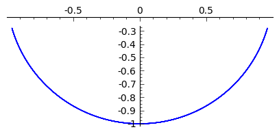
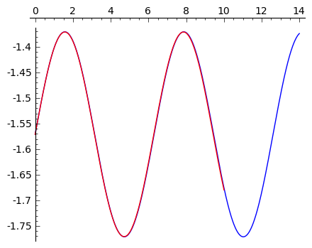

.. -*- coding: utf-8 -*-

Zasada d'Alemberta, podejście z algebrą komputerową.
====================================================

Zasada d'Alemberta
------------------ 

Zasada d'Alemberta jest podejściem umożliwiającym wyprowadzenie równań ruchu dla układów punktów materialnych z więzami.

Rozważmy ruch układu :math:`N` punktów materialnych podlegającym :math:`p` więzom:

.. MATH::

     \sum_{j=1}^{3N} (m_j \ddot x_j - F_j)\delta x_j =0

równania więzów holonomicznych są dane przez :math:`p` funkcji:

.. MATH::

     f_k(x, t) = 0

a wielkości :math:`\delta x_j`, są dowolnymi liczbami spełniającymi:

.. MATH::

    \sum_{j=1}^{3N} \frac{\partial f_j}{\partial x_j} \delta x_j,\quad k=1,2,...,p. 

    (3)

Równania (3) tworzą jednorodny układ :math:`p` równań liniowych na :math:`3N` przesunięć wirtualnych :math:`\delta x_j`: p przesunięć można wyrazić przez :math:`3N-p` pozostałych które  są dowolne.

Wstawiając te wyrażenia to równań d'Alemberta otrzymujemy z warunku znikania współczynników przy niezależnych przesunięciach wirtualnych układ :math:`3N-p` równań różniczkowych. Razem z równaniami więzów mamy w sumie :math:`3N` równań na :math:`3N` nie wiadomych :math:`x_j`.

Ponieważ jest to układ równań algebraicznych (więzy) i różniczkowych nosi on nazwę układu równań algebraiczno\-różniczkowych (ang. algebraic\-differential equations \- DAE).

Jednym ze sposobów rozwiązania takiego układu jest zróżniczkowanie równania więzów i rozwiązanie tak powstałego układu równań różniczkowych zwyczajnych.

Drugą możliwością jest dokonanie zamiany współrzędnych do takich w których znika :math:`p` przesunięć wirtualnych. Sa to tak zwane współrzędne zgodne z więzami. W takim przypadku procedura znacznie się upraszcza i :math:`p` składków formy różniczkowych znika i od razu otrzymujemy układ :math:`3N-p` równań różniczkowych drugiego rzędu.

 

Sposób pracy w Sage z wyrażeniami występującymi podczas wyprowadzania równań ruchu z zasady d'Alemberta.
-------------------------------------------------------------------------------------------------------- 

Jednym z problemów w manipulacjach na wzorach jest potrzeba traktowania pochodnych czasowych zmiennych jak niezależne zmienne. Próbując to wykonać można się przekonać, że nie wszystkie operacje będą wykonane zgodnie z oczekiwaniamy. Na przykład w Sage 4.8 nie można rozwiązać układu równań ze względu na pochodne.

Remedium jest zastąpienie pochodnych zmiennych dodatkowymi symbolami. Metoda .subs może zastępować pochodne funkcji symbolami i na odwrót. Ponadto warto ustalić system nazw zmiennych. W naszym przypadku dla pewnej współrzędnej "a" oznaczamy:

- współrzędna jako zmienna symboliczna Sage \- mała litera np. "a" 

- jej pochodne po czasie  :math:`\dot a` i :math:`\ddot a` - "ad" i "add", odpowiednio. 

- współrzędne jako funkcje Sage (od czasu) \- duże litery np. "A" 

- przesunięcie wirtualne :math:`\delta a` - "da". 

W systemie Sage istnieje ponadto możliwość dodania do zmiennej symbolicznej jej reprezentacji w LaTeX, która jest widoczna przy użyciu polecenia show(). Jest to szczególnie przydatne podczas inspekcji otrzymanych wyrażeń.

Przykład krok po kroku
~~~~~~~~~~~~~~~~~~~~~~

Poniższy przykład ilustruje opisaną implementacje. Zdefiniujmy sobie zmienna :math:`a`, która będzie reprezentowała pewną współrzędną uogólnioną:

.. code-block:: python

    sage: var('t')
    sage: var('a')
    a

.. end of output

Dadajmy dodatkowe symbole "ad" i "add" jako pochodne czasowe, którym ponadto nadajemy reprezentacje LaTeX\-ową:

.. code-block:: python

    sage: var('ad',latex_name=r'\dot a')
    sage: var('add',latex_name=r'\ddot a')
    sage: show([a,ad,add])

.. MATH::

    \left[a, \dot a, \ddot a\right]

.. end of output

Ponieważ współrzędne są funkcjami czasu, zdefiniujmy także funkcję :math:`A`, która będzie "zmienna :math:`a` traktowaną jak funkcja czasu".

.. code-block:: python

    sage: A = function('A',t)
    sage: show(A)

.. MATH::

    A\left(t\right)

.. end of output

Wykonajmy na wyrażeniach zawierających :math:`a` następujące operacje:

Zapiszmy wyrażenie :math:`1+\dot a(t)`:

.. code-block:: python

    sage: show(1+A.diff())
    sage: show ( (1+A.diff()).subs({A.diff():ad}) )

.. MATH::

    D[0]\left(A\right)\left(t\right) + 1

.. MATH::

    \dot a + 1

.. end of output

Policzmy drugą pochodną po czasie z (1\+a)^3.

Startując z zapisu:

.. code-block:: python

    sage: expr = (1+a)^3

.. end of output

zamieniamy zmienną :math:`a` na funkcje :math:`A(t)`:

.. code-block:: python

    sage: expr  = expr.subs({a:A})
    sage: show(expr)

.. MATH::

    {\left(A\left(t\right) + 1\right)}^{3}

.. end of output

liczymy pochodną:

.. code-block:: python

    sage: expr = expr.diff(t,2)
    sage: show(expr)

.. MATH::

    3 \, {\left(A\left(t\right) + 1\right)}^{2} D[0, 0]\left(A\right)\left(t\right) + 6 \, {\left(A\left(t\right) + 1\right)} D[0]\left(A\right)\left(t\right)^{2}

.. end of output

widać, pochodne funkcji przedstawione są w mało czytelnej postaci z operatorem "D". Możemy je jednak zapisać wykorzystując zmienne ad i add:

.. code-block:: python

    sage: expr  = expr.subs({A:a,A.diff():ad,A.diff(2):add})
    sage: show(expr)

.. MATH::

    3 \, {\left(a + 1\right)}^{2} \ddot a + 6 \, {\left(a + 1\right)} \dot a^{2}

.. end of output

Wyrażenie to można teraz zróżniczkować po np. :math:`\dot a`:

.. code-block:: python

    sage: expr = expr.diff(ad)
    sage: show(expr)

.. MATH::

    12 \, {\left(a + 1\right)} \dot a

.. end of output

Automatyzacja procedury
~~~~~~~~~~~~~~~~~~~~~~~

Ponieważ dla jednej współrzędnej mamy kilka wielkości: przesuniecie wirtualnie i dwie pochodne i reprezentacje poprzez funkcję, warto więc zautomatyzować proces ich definicji. W tym celu warto jest użyć dynamicznych własności python\-a: słownika zmiennych vars() i jawnego dostępu do reprezentacji obiektu. Poniższy przykład  dla zmiennych x i y deklaruje cały zestaw potrzebnych symboli jak i słowniki podstawień pochodnych za ich symbole. Kluczową cechą tego algorytmu jest to, że cała informacja potrzebna do generacji tyh wielkości zawarta jest w tablicy xy_wsp.

.. code-block:: python

    sage: var('t')
    sage: xy_wsp = [('x','x'),('y','y')]
    sage: for v,lv in xy_wsp:
    ...       var("%s"%v,latex_name=r'%s'%lv)
    ...       vars()[v.capitalize()] = function(v.capitalize(),t)
    ...       var("%sdd"%v,latex_name=r'\ddot %s'%lv)
    ...       var("%sd"%v,latex_name=r'\dot %s'%lv)
    ...       var("d%s"%v,latex_name=r'\delta %s'%lv)
    sage: to_fun=dict()
    sage: for v,lv in xy_wsp:
    ...       to_fun[vars()[v]]=vars()[v.capitalize()]
    ...       to_fun[vars()[v+"d"]]=vars()[v.capitalize()].diff()
    ...       to_fun[vars()[v+"dd"]]=vars()[v.capitalize()].diff(2)
    sage: to_var = dict((v,k) for k,v in to_fun.items())

.. end of output

Wykorzystanie powyższego kodu najlepiej zrozumieć śledząc jego działanie na przykładzie:

.. code-block:: python

    sage: show( (1+x^2*y) )
    sage: show( (1+x^2*y).subs(to_fun))
    sage: show( (1+x^2*y).subs(to_fun).diff(t,2) )
    sage: show( (1+x^2*y).subs(to_fun).diff(t,2).subs(to_var) )

.. MATH::

    x^{2} y + 1

.. MATH::

    X\left(t\right)^{2} Y\left(t\right) + 1

.. MATH::

    X\left(t\right)^{2} D[0, 0]\left(Y\right)\left(t\right) + 2 \, X\left(t\right) Y\left(t\right) D[0, 0]\left(X\right)\left(t\right) + 4 \, X\left(t\right) D[0]\left(X\right)\left(t\right) D[0]\left(Y\right)\left(t\right) + 2 \, Y\left(t\right) D[0]\left(X\right)\left(t\right)^{2}

.. MATH::

    x^{2} \ddot y + 4 \, x \dot x \dot y + 2 \, x \ddot x y + 2 \, \dot x^{2} y

.. end of output

.. code-block:: python

    sage: show( (1+x^2*y).subs(to_fun).diff(t,2).subs(to_var).diff(xd).diff(x) )

.. MATH::

    4 \, \dot y

.. end of output

Jak to działa?
~~~~~~~~~~~~~~

Zautomatyzowanie definicji zarówno deklaracji zmiennych i funkcji jak i słowników, pozwala na uniknięcie licznych pomyłek przy wpisywaniu powyższych formuł ręcznie. Jednak dla potrzeb dydaktycznych pokażemy równoważny kod zapisany jawnie dla przypadku wahadła matematycznego.

.. code-block:: python

    sage: var('t')
    sage: var("x",latex_name='x')
    sage: X = function("X",t)
    sage: var("xdd",latex_name=r'\ddot x')
    sage: var("xd",latex_name=r'\dot x')
    sage: var("dx",latex_name=r'\delta x')
    sage: var("y",latex_name='y')
    sage: Y = function("Y",t)
    sage: var("ydd",latex_name=r'\ddot y')
    sage: var("yd",latex_name=r'\dot y')
    sage: var("dy",latex_name=r'\delta y')
    sage: to_fun= {ydd:Y.diff(2), xdd:X.diff(2), x: X, yd: Y.diff(), xd:X.diff(), y: Y}
    sage: to_var  = { Y.diff(): yd,  Y.diff(2): ydd, Y: y, X: x,X.diff(2):xdd,X.diff() : xd}
    sage: xy = [x,y]

.. end of output

.. code-block:: python

    sage: show( (1+x^2*y) )
    sage: show( (1+x^2*y).subs(to_fun))
    sage: show( (1+x^2*y).subs(to_fun).diff(t,2) )
    sage: show( (1+x^2*y).subs(to_fun).diff(t,2).subs(to_var) )
    sage: show( (1+x^2*y).subs(to_fun).diff(t,2).subs(to_var).diff(xd).diff(x) )

.. MATH::

    x^{2} y + 1

.. MATH::

    X\left(t\right)^{2} Y\left(t\right) + 1

.. MATH::

    X\left(t\right)^{2} D[0, 0]\left(Y\right)\left(t\right) + 2 \, X\left(t\right) Y\left(t\right) D[0, 0]\left(X\right)\left(t\right) + 4 \, X\left(t\right) D[0]\left(X\right)\left(t\right) D[0]\left(Y\right)\left(t\right) + 2 \, Y\left(t\right) D[0]\left(X\right)\left(t\right)^{2}

.. MATH::

    x^{2} \ddot y + 4 \, x \dot x \dot y + 2 \, x \ddot x y + 2 \, \dot x^{2} y

.. MATH::

    4 \, \dot y

.. end of output

Widzimy, że powyższa definicja zmiennych i słowników jest łatwiejsza do zrozumienia, ale jej napisanie wymaga zmiany całego kodu dla różnych zmiennych. Widzimy, że większość poleceń się powtarza, dlatego zgodnie z zasada programowania DRY lepiej jednak napisać bardziej ugólny kod.

Widzimy, że operacje na naszym wyrażeniu są takie sme niezależnie czy zastosowaliśmy automatyczną czy ręczną generację słowników i zmiennych.

Przyjrzyjmy się poszczególnym elementom implemtentacji automatycznej. Punktem wyjscia są nazwy zmiennych i ich reprezentacje LaTeXowe. Reprezentacja LaTeX-owa zmiennej działa w następujący sposób. Zdefiniujmy zmienną 'a' o reprezentacji '\bar\alpha_1' - :math:`\bar\alpha_1`:

.. code-block:: python

    sage: var('a',latex_name=r'\bar\alpha_1')
    a

.. end of output

Funkcja print drukuje nam pythonową nazwę zmiennej czyli:

.. code-block:: python

    sage: print a
    a

.. end of output

Ale funkcja show, pokazuję naszą reprezentacje.

.. code-block:: python

    sage: show(a)

.. MATH::

    \bar\alpha_1

.. end of output

Wracajac do omawianego algorytmu, punktem wyjścia jest definicja tablicy par nazw (nazwa_sage, reprezentacja_latex):

.. code-block:: python

    sage: xy_wsp = [('x','x'),('y','y')]

.. end of output

Tablica ta może zostać przeiterowana w celu deklaracji zmiennych wykorzystując Sage\-owe 'var()' oraz pythonowy dostep do słownika bieżącej przestrzeni nazw 'vars()'. Ten ostatni umożliwia bezpośrednie "włożenie" nazwy obiektu i powiązanie jej z samym obiektem. Tego typu operacje są przykładem zastosowania cech dynamicznego typowania i introspekcji języka python.

Zmienne zadajemy jako ciągi znaków (stringi). Jednak będziemy potrzebowali czasem obieków pythonowych (Sage\-owych), które reprezentują. Startując z listy par `xy_wsp` mamy listę nazw zmiennych:

.. code-block:: python

    sage: [v for v,lv in xy_wsp]
    ['x', 'y']

.. end of output

oraz listę samych zmiennych:

.. code-block:: python

    sage: [vars()[v] for v,lv in xy_wsp]
    [x, y]

.. end of output

Warto zwrócić też uwagę na technikę  odwrócenia słownika, wykorzystaną w celu uniknięcia podobnych definicji:

.. code-block:: python

    sage: mojslownik  = {12:'dwanascie',1:'jeden'}
    sage: odwrocony_slownik = dict((v,k) for k,v in mojslownik.items())
    sage: print mojslownik
    sage: print odwrocony_slownik
    {1: 'jeden', 12: 'dwanascie'}
    {'jeden': 1, 'dwanascie': 12}

.. end of output

Wahadło matematyczne we współrzędnych kartezjańskich
---------------------------------------------------- 

Wyprowadzamy równaniu ruchu wahadła matematycznego  we współrzędnych kartezjańskich. Kolejność procedury jest następująca.

#. Układ składa się z jednego punktu materialnego na płaszczyźnie (dwa stopnie swobody) i jednego równania więzów: odleglość od punktu podwieszenia jest stała. 

#. Zapisujemy równanie więzów: :math:`x^2+y^2-l^2=0` w postaci różniczkowej tj. zawierające związek między przesunięciami wirtualnymi :math:`\delta x` i :math:`\delta y`.  

#. Z równania więzów wyliczamy jedno przesunięcie wirtualne. 

#. Zapisujemy równania dAlemberta dla tego układu i podstawiamy za jedno z przesunięć wyrażenie wyliczone z równania więzów. 

#. Przyrównujemy do zera wyrazy przy niezależnych przesunięciach wirtualnych (w tym przypadku przy jednym). 

#. Otrzymujemy równanie ruchu, które opisuje układ wraz z równaniem więzów. 

#. Jeżeli wykonujemy zmiany układu współrzędnych to mamy do czynienia z tzw. układem równań algebraiczno\-różniczkowych (ang. DAE). Można numerycznie rozwiązać taki układ równań różniczkując dwukrotnie równanie więzów po czasie i traktując uzyskany system jako układ równań różniczkowych zwyczajych. Należy zwrócić uwagę, że w takim układzie długość wahadła jest warunkiem początkowym! 

.. code-block:: python

    sage: var('t')
    sage: var('l g')
    sage: xy_wsp = [('x','x'),('y','y')]
    sage: for v,lv in xy_wsp:
    ...       var("%s"%v,latex_name=r'%s'%lv)
    ...       vars()[v.capitalize()] = function(v.capitalize(),t)
    ...       var("%sdd"%v,latex_name=r'\ddot %s'%lv)
    ...       var("%sd"%v,latex_name=r'\dot %s'%lv)
    ...       var("d%s"%v,latex_name=r'\delta %s'%lv)
    sage: xy = [vars()[v] for v,lv in xy_wsp]
    sage: dxy = [vars()['d'+repr(zm)] for zm in xy]
    sage: to_fun=dict()
    sage: for v,lv in xy_wsp:
    ...       to_fun[vars()[v]]=vars()[v.capitalize()]
    ...       to_fun[vars()[v+"d"]]=vars()[v.capitalize()].diff()
    ...       to_fun[vars()[v+"dd"]]=vars()[v.capitalize()].diff(2)
    sage: to_var = dict((v,k) for k,v in to_fun.items())

.. end of output

.. code-block:: python

    sage: f = x^2+y^2-l^2
    sage: constr =sum([dzm*f.diff(zm) for zm,dzm in zip(xy,dxy)])
    sage: show( constr)

.. MATH::

    2 \, \delta x x + 2 \, \delta y y

.. end of output

Zapisujemy równania d'Alembera:

.. code-block:: python

    sage: dAlemb = (X.diff(t,2))*dx + (Y.diff(t,2)+g)*dy

.. end of output

Rozwiązujemy więzy w postaci różniczkowej na :math:`\delta x` i podstawiamy wyrażenie do do zasady d'Alemberta. Następnie wykonujemy rozwinięcie iloczynów sum (expand), bierzemy współczynnik przy :math:`\delta y` i zamieniamy funkcje na zmienne pomocnicze xd,yd za pomocą słownika to_var:

.. code-block:: python

    sage: rown1=(dAlemb.subs(constr.solve(dx)[0])*x).expand().coeff(dy).subs(to_var)
    sage: show(rown1)

.. MATH::

    g x + x \ddot y - \ddot x y

.. end of output

Róźniczkujemy dwa razy po czasie równanie więzów:

.. code-block:: python

    sage: rown2 = f.subs(to_fun).diff(t,2).subs(to_var)
    sage: show(rown2)

.. MATH::

    2 \, x \ddot x + 2 \, \dot x^{2} + 2 \, y \ddot y + 2 \, \dot y^{2}

.. end of output

Rozwiązujemy powstały układ równań na :math:`\ddot x` i :math:`\ddot y`:

.. code-block:: python

    sage: sol = solve( [rown1,rown2],[xdd,ydd])
    sage: show( sol[0] )

.. MATH::

    \left[\ddot x = \frac{g x y - {\left(\dot x^{2} + \dot y^{2}\right)} x}{x^{2} + y^{2}}, \ddot y = -\frac{g x^{2} + {\left(\dot x^{2} + \dot y^{2}\right)} y}{x^{2} + y^{2}}\right]

.. end of output

Mając jawne wzory na  drugie pochodne, można automatycznie skonstruować układ równań różniczkowych, którego rozwiązanie numeryczne otrzymujemy natychmiast stosując procedurę np. desolve_odeint.

Ciekawostką jest fakt, że różniczkowanie usunęło nam stała :math:`l` z równań i równania ruchu nie zależą od długości zawieszenia wahadła! Aby jednak być konsystentym wartość tą trzeba zadać jako warunek początkowy.

Powyższy układ równań różniczkowych nie zachęca do prób rozwiązywania algebraicznego, ale można bez problemu otrzymać jego rozwiązanie numeryczne. Prawe strony układu równań możemy wydobyć  ze zmiennej sol:

.. code-block:: python

    sage: sol[0][0].rhs()
    (g*x*y - (xd^2 + yd^2)*x)/(x^2 + y^2)

.. end of output

.. code-block:: python

    sage: sol[0][1].rhs()
    -(g*x^2 + (xd^2 + yd^2)*y)/(x^2 + y^2)

.. end of output

Ponieważ procedury rozwiązywania układów równań na ogół pracują na równaniach pierwszego rzędu (np. desolve_odeint) dlatego piszemy dwa równania na pochodnie :math:`x` i :math:`y` i w Sage używamy zdefiniowanych wcześniej zmiennych xd i yd do oznaczania prędkości. Kolejno równania są więc na położenia x i y oraz prędkości w kierunkach x i y. Nie możemy też zapomnieć o wstawieniu liczby za stałą g:

.. code-block:: python

    sage: ode=[xd,yd,sol[0][0].rhs().subs({g:1}),sol[0][1].rhs().subs({g:1})]
    sage: times = srange(0,14,0.01)
    sage: numsol=desolve_odeint(ode,[0,-1,1.2,0],times,[x,y,xd,yd])
    sage: p=line(zip(numsol[:,0],numsol[:,1]),figsize=5,aspect_ratio=1)
    sage: p.show()

.. end of output

Dla małych drgań mamy oscylator harmoniczny, sprawdźmy czy rozwiązanie się z nim pokrywa. Ponieważ oscylacje zachodzą wokół kąta :math:`-90\deg = -\pi/2` musimy dodać ten kąt do klasycznego rozwiązania. Ponadto porównanie z oscylatorem wykonujemy w przybliżeniu małych drgań, czyli dla małej amplitudy. Rozwiążmy więc układ dla warunku początkowego:

.. MATH::

    \begin{cases}x = 0\\y=-l\\v_x=0.2\\v_y=0 \end{cases}.

Taki warunek odpowiada rozwiązaniu o prędkości kątowej :math:`\omega=\dot \phi  = v_x/l` dla oscylatora harmonicznego danego wzrorem:

.. MATH::

    \phi = -\pi/2 + 0.2 \sin(w_0 t),

gdzie :math:`\omega_0=\sqrt{g/l}`

Z rozwiązania numerycznego w układzie kartezjąńskim kąt :math:`\phi` wyliczamy jako :math:`\phi=\arctan(y/x)`.

Uwaga: Warto stosować funkcję arctan2, która daje poprawny kąt we wszystkich ćwiartkach.

Mamy więc:

.. code-block:: python

    sage: times = srange(0,14,0.01)
    sage: numsol=desolve_odeint(ode,[0,-1,.2,0],times,[x,y,xd,yd])
    sage: import numpy as np
    ...    
    sage: line(zip( times,np.arctan2(numsol[:,1],numsol[:,0]) ),figsize=5)+\
    ...    plot(0.2*sin(t)-pi/2,(t,0,10),color='red')

.. end of output

Sprawdźmy czy równanie więzów jest spełnione na końcu symulacji:

.. code-block:: python

    sage: print "początkowa długość wahadła l:",numsol[0,0]**2+numsol[0,1]**2," i jej wartość na końcu symulacji ",numsol[-1,0]**2+numsol[-1,1]**2
    początkowa długość wahadła l: 1.0  i jej wartość na końcu symulacji  0.999999990079

.. end of output

Układ współrzędnych zgodny z więzami
~~~~~~~~~~~~~~~~~~~~~~~~~~~~~~~~~~~~

W przypadku rozważania układów mechanicznych, najlepiej jest wprowadzić układ współrzednych w który jest zgodny z więzami, tzn. warunek więzów powoduję, że przesunięcia wirtualne wzdłuż niektórych współrzędnych są zero. W takim przypadku znika nam wyrażenie z drugą pochodną tych współrzędnych a w konsekwencji zamiast układu DAE otrzymujemy układ równań różniczkowych.

W przypadku wahadła matematycznego mamy oczywisty wybór układu polarnego a współrzędną uogólnioną będzie promień.

W implemetacji przekształceń w Sage dodatkowo definiujemy zmienną :math:`\phi` i słownik przejścia z układu :math:`(x,y)`, do układu :math:`(\phi)`.

.. code-block:: python

    sage: var('x y t')
    sage: var('l g')
    sage: xy_wsp = [('x','x'),('y','y')]
    sage: uv_wsp = [('phi','\phi')]
    sage: for v,lv in uv_wsp+xy_wsp:
    ...       var("%s"%v,latex_name=r'%s'%lv)
    ...       vars()[v.capitalize()] = function(v.capitalize(),t)
    ...       var("%sdd"%v,latex_name=r'\ddot %s'%lv)
    ...       var("%sd"%v,latex_name=r'\dot %s'%lv)
    ...       var("d%s"%v,latex_name=r'\delta %s'%lv)
    sage: uv = [vars()[v] for v,lv in uv_wsp]
    sage: xy = [vars()[v] for v,lv in xy_wsp]
    sage: to_fun=dict()
    sage: for v,lv in uv_wsp:
    ...       to_fun[vars()[v]]=vars()[v.capitalize()]
    ...       to_fun[vars()[v+"d"]]=vars()[v.capitalize()].diff()
    ...       to_fun[vars()[v+"dd"]]=vars()[v.capitalize()].diff(2)
    sage: to_var = dict((v,k) for k,v in to_fun.items())
    sage: x2u = {x:l*cos(phi),y:l*sin(phi)}

.. end of output

Musimy teraz przetransformować zasadę d'Alemberta do nowych współrzędnych. Implementujmy więc następujące wzory transformacyjne dla przesunięć wirtualnych:

.. MATH::

    \delta x = \frac{\partial x(r,\phi)}{\partial r}\delta r + \frac{\partial x(r,\phi)}{\partial \phi}\delta \phi

.. MATH::

    \delta y = \frac{\partial y(r,\phi)}{\partial r}\delta r + \frac{\partial y(r,\phi)}{\partial \phi}\delta \phi

.. code-block:: python

    sage: for w in xy:
    ...       vars()['d'+repr(w)+'_polar']=sum([w.subs(x2u).diff(w2)*vars()['d'+repr(w2)] for w2 in uv])
    sage: show([dx_polar,dy_polar])

.. MATH::

    \left[-\delta \phi l \sin\left(\phi\right), \delta \phi l \cos\left(\phi\right)\right]

.. end of output

Pozostaje podstawić zależności :math:`x(\phi)` i :math:`y(\phi)` i możemy zapisać zasadę d'Alemberta w nowych, a właściwie w nowej, współrzędnej :math:`\phi`:

.. code-block:: python

    sage: dAlemb = (x.subs(x2u).subs(to_fun).diff(t,2))*dx_polar + \
    ...            (y.subs(x2u).subs(to_fun).diff(t,2)+g)*dy_polar
    sage: dAlemb = dAlemb.subs(to_var)

.. end of output

Równania ruchu są spełnione jeśli wszystkie współczynniki przy nieznikających przesunięciach wirtualnych się zerują. Chociaż mamy tylko jedną taką współrzędna, użyjmy ogólnego sformułowania algorytmicznego i napiszmy:

.. code-block:: python

    sage: show(dAlemb)

.. MATH::

    {\left(l \dot \phi^{2} \cos\left(\phi\right) + l \ddot \phi \sin\left(\phi\right)\right)} \delta \phi l \sin\left(\phi\right) - {\left(l \dot \phi^{2} \sin\left(\phi\right) - l \ddot \phi \cos\left(\phi\right) - g\right)} \delta \phi l \cos\left(\phi\right)

.. end of output

.. code-block:: python

    sage: for v in uv:
    ...       show(dAlemb.expand().coeff(vars()['d'+repr(v)]).trig_simplify())

.. MATH::

    g l \cos\left(\phi\right) + l^{2} \ddot \phi

.. end of output

W powyższym wzorze rozpoznajemy znane równanie:

.. code-block:: python

    sage: show( dAlemb.expand().coeff(dphi).trig_simplify().solve(phidd) )

.. MATH::

    \left[\ddot \phi = -\frac{g \cos\left(\phi\right)}{l}\right]

.. end of output
