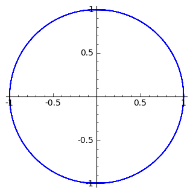

Prędkość w ruchu krzywoliniowym na płaszczyźnie
===============================================

Rozważmy ruch krzywoliniowy na płaszczyźnie. Tor ruchu niech będzie dany
przez wektor wodzący zależny od czasu

$$\vec r(t) = ( x(t), y(t) ).$$

Prędkość jest pochodna wektora wodzącego po czasie:

$$v_{x}=\frac{dx}{dt}\quad \quad v_{y}=\frac{dy}{dt}.$$

Wartością prędkości jest długość wektora:
$\vec{v}=[v_{x},v_{y}]=v_{x}\cdot \vec{e}_{x}+v_{y}\cdot \vec{e}_{y}$ i
dana jest wzorem:

$$v=\sqrt{v_{x}^{2}+v_{y}^{2}}.$$

Można więc napisać, że $\vec{v}= v \hat t$, gdzie $\hat t$ jest wektorem
jednostkowym stycznym do toru.

Przykład 1.
-----------

Ruch jednostajny po okręgu.

``` {.sourceCode .python}
sage: var('R t',domain='real')
sage: assume(R>0)
sage: x(t)=R*cos(2*pi*t)
sage: y(t)=R*sin(2*pi*t)
sage: r = vector( (x,y) )
```

<div class="admonition">

Użycie funkcji symbolicznych Sage

Definiując $x(t)$ i $y(t)$ jako funkcje symboliczne Sage uzyskujemy
możliwość krótszego zapisu różniczkowania. Aby utworzyć z nich wektor
nie podajemy argumentów jawnie. Zobaczmy: $x(t)$, $y(t)$, $r(t)$

> ``` {.sourceCode .python}
> sage: show(x)
> sage: show(r)
> ```
>
> $$t \ {\mapsto}\ R \cos\left(2 \, \pi t\right)$$$$t \ {\mapsto}\ \left(R \cos\left(2 \, \pi t\right),\,R \sin\left(2 \, \pi t\right)\right)$$
>
> ``` {.sourceCode .python}
> sage: parametric_plot(r.subs(R=1),(0,2*pi),figsize=5)
> ```
>
> 

</div>

``` {.sourceCode .python}
sage: r.subs(R=1)
t |--> (cos(2*pi*t), sin(2*pi*t))
```

Mamy zdefiniowane położenie jako parametryczną funkcję czasu. Dla wygody
możemy zdefiniować wektor $r=(x,y)$. Wektor w Sage można zróżniczkować i
policzyć jego długość. Obliczmy więć wektor prędkości oraz jednostkowy
wektor styczny $\hat t$ oznaczany w Sage przez T.

``` {.sourceCode .python}
sage: v=r.diff(t)
sage: T=v/v.norm().trig_simplify()
```

Wektor położenia:

``` {.sourceCode .python}
sage: show(r)
```

$$t \ {\mapsto}\ \left(R \cos\left(2 \, \pi t\right),\,R \sin\left(2 \, \pi t\right)\right)$$

Wektor prędkości:

``` {.sourceCode .python}
sage: show(v)
```

$$t \ {\mapsto}\ \left(-2 \, \pi R \sin\left(2 \, \pi t\right),\,2 \, \pi R \cos\left(2 \, \pi t\right)\right)$$

Jednostkowy wektor styczny do krzywej $r(t)$:

``` {.sourceCode .python}
sage: show(T)
```

$$t \ {\mapsto}\ \left(-\sin\left(2 \, \pi t\right),\,\cos\left(2 \, \pi t\right)\right)$$

W ruchu po okręgu prędkość jest prostopadła do wektora wodzącego:

$$v \cdot r  = 0$$

``` {.sourceCode .python}
sage: v(t).dot_product(r(t)).trig_simplify()
0
```

Sprawdzmy czy długość wektora wodzącego jest stała:

``` {.sourceCode .python}
sage: r(t).norm().trig_simplify()
R
```

Jak zmienia się wartość prędkości?

``` {.sourceCode .python}
sage: v(t).norm().trig_simplify()
2*pi*R
```

Widzimy, że prędkość nie zależy od czasu.

**Zobaczmy jak zmieniają się wyliczone powyżej wektory z czasem**:

**Czy każdy ruch po okręgu jest jednostajny?**

``` {.sourceCode .python}
sage: var('R t',domain='real')
sage: assume(R>0)
sage: assume(t>0)
sage: x(t)=R*cos(2*pi*t^2)
sage: y(t)=R*sin(2*pi*t^2)
sage: r=vector( (x(t),y(t)) ) 
sage: v=r.diff(t)
sage: T=v/v.norm().trig_simplify()
sage: show(r)
sage: show(v)
sage: show(T)
```

$$\left(R \cos\left(2 \, \pi t^{2}\right),\,R \sin\left(2 \, \pi t^{2}\right)\right)$$$$\left(-4 \, \pi R t \sin\left(2 \, \pi t^{2}\right),\,4 \, \pi R t \cos\left(2 \, \pi t^{2}\right)\right)$$$$\left(-\sin\left(2 \, \pi t^{2}\right),\,\cos\left(2 \, \pi t^{2}\right)\right)$$

Zweryfikujmy prostopadłość prędkości do wektora wodzącego (innymi słowy
- czy ruch odbywa się po okręgu?)

``` {.sourceCode .python}
sage: T.dot_product(r).trig_simplify()
0
```

``` {.sourceCode .python}
sage: v.dot_product(r).trig_simplify()
0
```

Ale prędkość w tym ruchu rośnie z czasem!

``` {.sourceCode .python}
sage: v.norm().trig_simplify()
4*pi*R*t
```

Przykład 2.
-----------

Ruch po krzywej spiralnej. Zkonstrujmy podobmy element interaktywny:

Prędkość w taki ruchu nie jest prostopadła do wektora wodzącego.

``` {.sourceCode .python}
sage: show(v.dot_product(r).trig_simplify())
```

$$4 \, t$$

``` {.sourceCode .python}
sage: show(T.dot_product(r).trig_simplify())
```

$$\frac{\sqrt{16 \, \pi^{2} t^{2} + 4} t}{4 \, \pi^{2} t^{2} + 1}$$

Przyśpieszenie w ruchu krzywoliniowym na płaszczyźnie
=====================================================

Przyśpieszenie jest pochodną prędkości po czasie. Zapiszmy prędkość jako
iloczyn wersora jednostkowego i długość $\vec v=v\hat t.$ Obydwa
czynniki tego iloczynu zależą od czasu więc można zastosować twierdzenie
o pochodnej iloczynu:

$$\vec{a}=\frac{\mathrm d\vec v }{\mathrm dt}=\left( \frac{\mathrm dv}{\mathrm dt} \right)\hat t +v\left( \frac{\mathrm d\hat t}{\mathrm dt} \right)$$

Z geometrii różniczkowej wiemy, że:

$$\frac{\mathrm d\hat t}{\mathrm dt}=\underbrace{\frac{\mathrm d\hat t}{\mathrm ds}}_{\hat n/\rho}\underbrace{\frac{\mathrm ds}{\mathrm dt}}_{v}=\frac{v}{\rho} \hat n$$

więc:

$$\vec{a}=\left( \frac{\mathrm dv}{\mathrm dt} \right)\hat t +\frac{v^2}{\rho} \hat n.$$

Krzywizna:
----------

Def. Wektorem krzywizny jest pochodna jednostkowego wektora stycznego po
drodze:

$$\vec K=\frac{\mathrm d\hat t}{\mathrm ds}.$$

Tw. Długość wektora krzywizny jest odwrotnością promienia koła stycznego
do krzywej w danym punkcie.

Tw. Pochodna jednostkowego wektora stycznego po czasie jest do niego
prostopadła.

$${\mathrm const} = |\hat t|^2$$

$$0 = \frac{ |\hat t|^2|}{dt}=2 \hat t \frac{\hat t}{dt}$$

Mając dowolną parametryzacje wektora wodzącego możemy zawsze skorzystać
z zależności:

$$\vec K=\frac{\mathrm d\hat t}{\mathrm ds} =\frac{\mathrm d\hat t}{\mathrm dt}\frac{\mathrm dt}{\mathrm ds}=\frac{\mathrm d\hat t}{\mathrm dt}\frac{1}{v}.$$

Z drugiej strony możemy napisać:

$$\vec K=\frac{\mathrm d\hat t}{\mathrm ds}$$

czyli

$$\frac{\mathrm d\hat t}{\mathrm dt} = \vec K \frac{\mathrm ds}{\mathrm dt} = \hat n \frac{v}{\rho}.$$

Przykład 3.
-----------

Przyśpieszenie w ruchu jednostajnym po okręgu.

``` {.sourceCode .python}
sage: var('R t',domain='real')
sage: assume(R>0)
sage: x(t)=R*cos(2*pi*t)
sage: y(t)=R*sin(2*pi*t)
sage: r = vector( (x(t),y(t)) ) 
sage: v = r.diff(t)
sage: a = r.diff(t,2)
sage: T=v/v.norm().trig_simplify()
sage: N=T.diff(t)*1.0/sqrt(x.diff(t)^2+y.diff(t)^2)
sage: show(r)
sage: show(v)
sage: show(a)
```

$$\left(R \cos\left(2 \, \pi t\right),\,R \sin\left(2 \, \pi t\right)\right)$$

$$\left(-2 \, \pi R \sin\left(2 \, \pi t\right),\,2 \, \pi R \cos\left(2 \, \pi t\right)\right)$$

$$\left(-4 \, \pi^{2} R \cos\left(2 \, \pi t\right),\,-4 \, \pi^{2} R \sin\left(2 \, \pi t\right)\right)$$

Sprawdźmy czy wektor przyśpieszenia jest prostopadły do prędkości:

``` {.sourceCode .python}
sage: (a.dot_product(v)).trig_simplify()
0
```

skoro tak to sprawdźmy czy zachodzi wzór:

$$a = \frac{v^2}{R}$$

``` {.sourceCode .python}
sage: bool( v.norm()^2/R==a.norm() )
True
```

Przykład 4.
-----------

Przyśpieszenie w ruchu **nie** jednostajnym po okręgu.

``` {.sourceCode .python}
sage: var('R t',domain='real')
sage: assume(R>0)
sage: x(t)=R*cos(2*pi*t^2)
sage: y(t)=R*sin(2*pi*t^2)
sage: r = vector( (x(t),y(t)) ) 
sage: v = r.diff(t)
sage: a = r.diff(t,2)
sage: T=v/v.norm().trig_simplify()
sage: N=T.diff(t)*1.0/sqrt(x.diff(t)^2+y.diff(t)^2)
sage: show(r)
sage: show(v)
sage: show(a)
```

$$\left(R \cos\left(2 \, \pi t^{2}\right),\,R \sin\left(2 \, \pi t^{2}\right)\right)$$

$$\left(-4 \, \pi R t \sin\left(2 \, \pi t^{2}\right),\,4 \, \pi R t \cos\left(2 \, \pi t^{2}\right)\right)$$

$$\left(-16 \, \pi^{2} R t^{2} \cos\left(2 \, \pi t^{2}\right) - 4 \, \pi R \sin\left(2 \, \pi t^{2}\right),\,-16 \, \pi^{2} R t^{2} \sin\left(2 \, \pi t^{2}\right) + 4 \, \pi R \cos\left(2 \, \pi t^{2}\right)\right)$$

Sprawdźmy czy przyśpieszenie w takim ruchu jest prostopadłe do
prędkości:

``` {.sourceCode .python}
sage: (a.dot_product(v)).trig_simplify()
16*pi^2*R^2*t
```

oczywiście w taki przypadku nie zachodzi:

$$a = \frac{v^2}{R}$$

``` {.sourceCode .python}
sage: bool( v.norm()^2/R==a.norm() )
False
```

Przykład 5.
-----------

Ruch po dowolnej krzywej.

W elemencie interaktywnym lokalny promień krzywizny $\rho$ jest
zwizualizowany przez dorysowanie okręgu o tymże promieniu. Wektor
normalny do krzywej - czyli wektor przyśpieszenia dośrodkowego został
zaznaczony kolorem niebieskim

``` {.sourceCode .python}
sage: x(t)=t
sage: y(t)=t^2
sage: r=vector( (x(t),y(t)) ) 
sage: v=r.diff(t)
sage: a = r.diff(t,2)
sage: a_norm = a/a.norm() 
...       
sage: T=v/v.norm().trig_simplify()
sage: N=T.diff(t)*1.0/sqrt(x.diff(t)^2+y.diff(t)^2)
```

``` {.sourceCode .python}
sage: show(N(t=0))
```

$$\left(0,\,2\right)$$

``` {.sourceCode .python}
sage: x(t)=cos(t)
sage: y(t)=sin(t)
sage: r=vector( (x(t),y(t)) ) 
sage: v=r.diff(t)
sage: a = r.diff(t,2)
sage: a_norm = a/a.norm() 
...       
sage: T=v/v.norm().trig_simplify()
sage: N=T.diff(t)*1.0/sqrt(x.diff(t)^2+y.diff(t)^2)
```

``` {.sourceCode .python}
sage: var('t',domain='real')
sage: (N(t).norm()).trig_simplify()
sqrt(sin(t)^2 + cos(t)^2)
```

Czasem Sage nie chce uprościć pewnych zależności, w tym przypadku
"pomaga" własna definicja normy:

``` {.sourceCode .python}
sage: normR=lambda a:sqrt(a[0]^2+a[1]^2)
```

``` {.sourceCode .python}
sage: normR(N(t)).trig_simplify()
1
```

``` {.sourceCode .python}
sage: x(t)=t
sage: y(t)=sqrt(1-t^2)
sage: r=vector( (x(t),y(t)) ) 
sage: v=r.diff(t)
sage: a = r.diff(t,2)
sage: a_norm = a/a.norm() 
...       
sage: T=v/v.norm().trig_simplify()
sage: N=T.diff(t)*1.0/sqrt(x.diff(t)^2+y.diff(t)^2)
```

``` {.sourceCode .python}
sage: normR(N(t))
sqrt(-(I*t^2/(sqrt(-t^2 + 1)*sqrt(t^2 - 1)) + I*sqrt(t^2 - 1)*t^2/(-t^2 + 1)^(3/2) + I*sqrt(t^2 - 1)/sqrt(-t^2 + 1))^2/(t^2/(t^2 - 1) - 1) + t^2/((t^2/(t^2 - 1) - 1)*(t^2 - 1)))
```

``` {.sourceCode .python}
sage: normR(N(t)).full_simplify()
1
```
