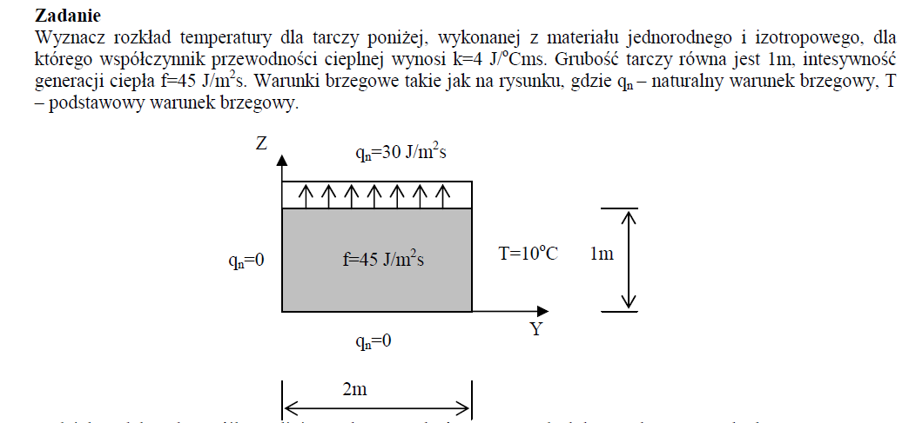
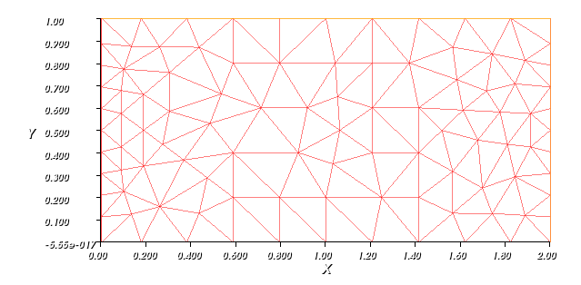
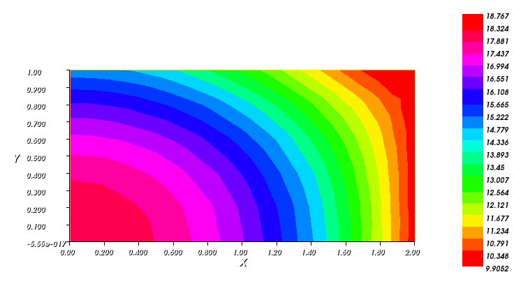
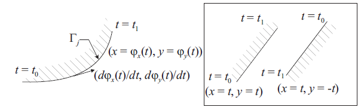
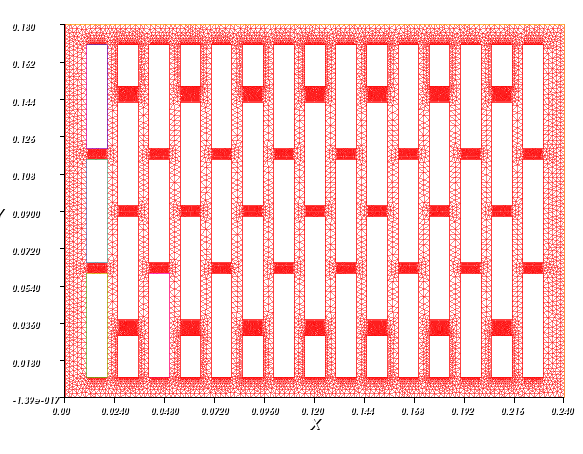
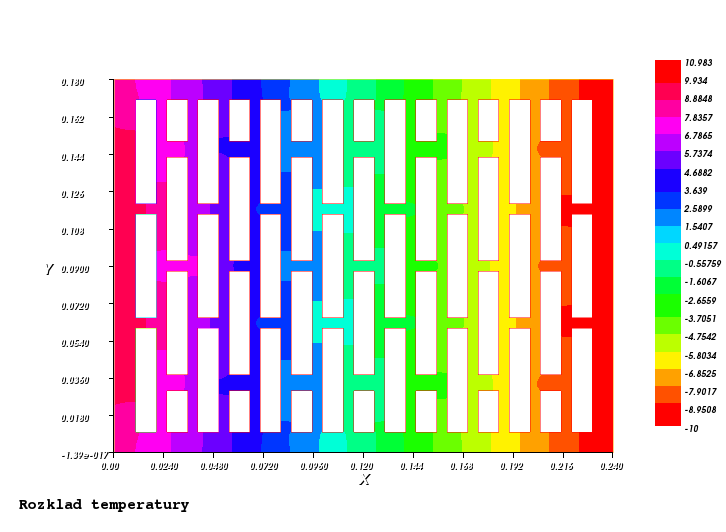
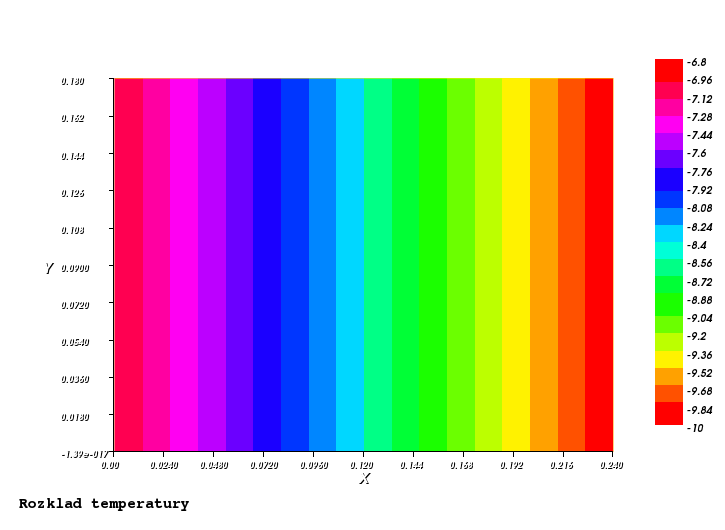
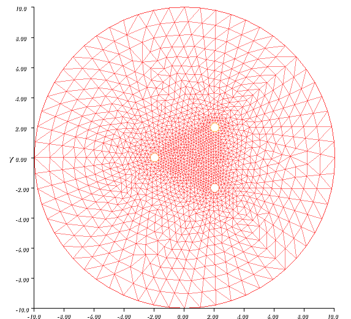
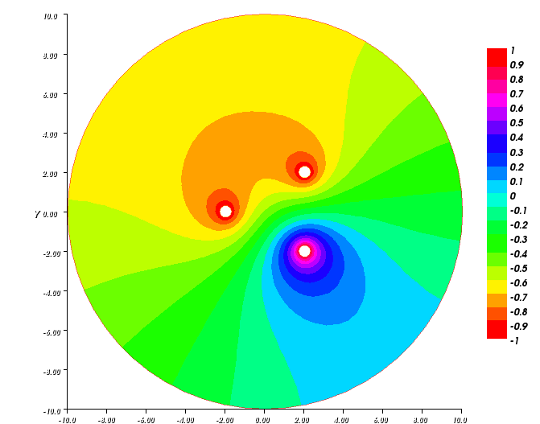

.. PoissonFEM documentation master file, created by
   sphinx-quickstart on Tue Oct  8 15:57:26 2013.
   You can adapt this file completely to your liking, but it should at least
   contain the root `toctree` directive.

Rozwiązanie równania Poissona, Metodą Elementów skończonych:
============================================================

.. toctree::
   :maxdepth: 2

Równanie Poissona:
------------------
W ogólnym przypadku równanie Poissona ma postać:

.. math::
	\frac{\partial ^{2}}{\partial x^{2}} u(x,y,z)+
	\frac{\partial ^{2}}{\partial y^{2}} u(x,y,z)+
	\frac{\partial ^{2}}{\partial z^{2}} u(x,y,z) = f(x,y,z)

lub zapisując krócej:

.. math::
	\nabla ^{2} u = f

Przykład 1
----------

Równanie Poissona opisujące zjawisko ustalonego przepływu ciepła w obszarze dwuwymiarowym dla materiału jednorodnego i izotropowego o stałej grubości ma postać:

.. math::
	\frac{\partial ^{2}T}{\partial x^{2}} +
	\frac{\partial ^{2}T}{\partial y^{2}} 
	 = \frac{f}{k}

Zdefiniujmy obszar w ktorym poszukiwać będziemy naszego rozwiązania.

.. code-block:: python

	int dlugosc=2, wysokosc=1;

	border left(t=wysokosc,0) {x=0; y=t;}; 
	border bottom(t=0,dlugosc) {x=t; y=0;}; 
	border right(t=0,wysokosc) {x=dlugosc; y=t;};
	border top(t=dlugosc,0) {x=t; y=wysokosc;};

Brzeg obszaru określa się przy użyciu funkcji parametrycznych :

.. math::
	\Gamma_{j} = [ (x,y)  |   x = \phi_{x}(t) ,  y = \phi_{y}(t),  a_{j} \le t \le b_{j}  ]

Zdefiniowany brzeg zgodny jest z obiegiem w lewo. Definiowanie brzegów obszarów zgodnie z obiegiem, 
jest istotną sprawą przy definiowaniu otworów w zadanym obszarze, tym problemem zajmiemy się jednak później.

Generowanie siatki trójkątnej.
Zdefiniujmy zmienne typu int określające liczbę węzłów zadanych na brzegach obszaru oraz poleceniem
``mesh nazwa_siatki = buildmesh(definicja brzegu);`` wygenerujmy siatkę:

.. code-block:: python

	int NpSzerokosc=10 ; 
	int NpDlugosc=10 ; 	

	mesh siatka=buildmesh(left(NpSzerokosc)+top(NpDlugosc)
	+right(NpSzerokosc)+bottom(NpDlugosc));
	
	plot(siatka);

Podobnie jak w pythonie, wizualizację obiektów uzykujemy poleceniem ``plot`` , przez co uzyskamy siatkę trójkątną (przedstawioną poniżej) o określonej liczbie węzłów na brzegu zadanego obszaru.

Zdefiniujmy część zasadniczą postawionego w zadaniu problemu. Określamy wartości parametrów podanych w zadaniu ``k`` i ``f``, następnie określamy warunki brzegowe - dla warunków Neumanna poleceniem 
``int1d(siatka,brzeg)((wartosc*v))`` oraz warunki Dirichleta ``on(brzeg,zmienna=wartosc)``

.. code-block:: python	

	fespace Vh(siatka,P1);
	func f=45;
	int k=4;
	Vh u,v;
	problem Poisson(u,v,solver=LU) =
	int2d(siatka)(k*dx(u)*dx(v) + k*dy(u)*dy(v))
	- int2d(siatka)( f*v  ) - int1d(siatka,left)((0*v))
	- int1d(siatka,bottom)((-30*v))
	- int1d(siatka,top)((-30*v))
	+ on(right,u=10);
	
	Poisson;
	plot(u, value=true, fill=true, cmm="Rozklad temperatury");

Po wykonaniu wywołaniu powyższego kodu otrzymamy mapy rozkładu temperatur w rozpatrywanym obszarze dla ustalonych warunków brzegowych:

Rozwiazanie analityczne
^^^^^^^^^^^^^^^^^^^^^^^

Przykład 2
----------
Metoda elementów skończonych umożliwa znajdowanie przybliżonych rozwiązań problemów których 
nie sposób rozwiązać w sposób analityczny lub rozwiązanie to jest bardzo trudne do uzyskania.
Rozważmy nieco trudniejszy przypadek ustalonego przepływu ciepła przez materiał z pustkami powietrznymi. 
Przykładem takiego materiału jest pustak typu POROTHERM, stosowany w szeroko pojętym budownictwie mieszkaniowym. Kształt pustaka przybliżono prostokątem o wymiarach ::240x180 mm::, a
współczynnik przewodzenia ciepła przyjęto jako :math:`k = 0.3 \frac{W}{m \circ C}`

Określamy brzeg obszaru:

.. code-block:: python

	real dlugosc=0.24, wysokosc=0.18;

	border left(t=wysokosc,0) {x=0; y=t;}; 
	border bottom(t=0,dlugosc) {x=t; y=0;}; 
	border right(t=0,wysokosc) {x=dlugosc; y=t;};
	border top(t=dlugosc,0) {x=t; y=wysokosc;};

Aby zdefiniować podobszary nie objęte siątką wewnątrz rozpatrywanego obszaru należy w sposób analogiczny  do powyższego określić jego brzegi, a także zastosować się do zasady na poniższym rysunku: 

mowiącej tyle, że przy obiegu w prawo po konturze otworu, znak zmiennej ilości węzłów zaadaptowanych do stworzenia siatki powinien być dodatni. 
Definicja podobszaru:

.. code-block:: python

	real h=0.05, b=0.01;

	border A11(t=0,0.01){ x=0.01+t; y=0.06;   }
	border A12(t=0,0.05){ x=0.02;   y=0.06-t; }
	border A13(t=0,0.01){ x=0.02-t; y=0.01;   }
	border A14(t=0,0.05){ x=0.01;   y=0.01+t; }

Określając ilość węzłów na poszczeglnych brzegach generujemy siatkę pamiętając by poobszarom przypisując znak dodatni:

.. code-block:: python

	int Np=20;
	int NpSzerokosc=100 ; 
	int NpDlugosc=100 ; 

	mesh siatka=buildmesh(

	left(NpSzerokosc)+top(NpDlugosc)
	+right(NpSzerokosc)+bottom(NpDlugosc)
	);
	plot(siatka);

Podobnie postępując przy definiowaniu kolejnych współrzędnych konturów pustek powietrznych otrzymujemy siatkę: 

Definiując jak w poprzednim przykładzie zasadniczą część rozwiązującą nasze zadanie, dobrano warunki brzegowe zakładając
- brak przepływu ciepła przez pustki powietrza (przyjmowane domyślnie przez program nie objęty siatką),
- brak przepływu w kierunku pionowym 
- ustalono wartość temperatury na brzegu prawym
- ustalony strumień ciepła na brzegu lewym

.. code-block:: python

	fespace Vh(siatka,P1);
	func f = 0;
	real k = 0.3;
	Vh u,v;
	problem Poisson(u,v,solver=LU) =
	int2d(siatka)(k*dx(u)*dx(v) + k*dy(u)*dy(v))
	- int2d(siatka)( f*v  ) 
	- int1d(siatka,bottom)((0*v))
	- int1d(siatka,top)((0*v))
	- int1d(siatka,left)((4*v))
	+ on(right,u=-10);
	Poisson; 
	plot(u, value=true, fill=true, cmm="Rozklad temperatury");

Przez co otryzmujemy mapę temperatury:

W tym miejscu można zadać pytanie - "Czy pustki powietrza mają istotny wpływ na przepływ ciepła"?
Choć odpowiedź jest oczywista, przekonajmy się rozwiązując to samo zadanie, usuwając utworzone podobszary.
W ten sposób uzyskujemy:

Otrzymany rezultat zgodny jest z przewidywaniami. Oprócz pytania 'czy' przykład pokazuje 'jak' wpływa obecność pustek powietrza na przepływ ciepła. Należy pamiętać, że w przedstawionym tu modelu i obliczeniach pominięto istotne dla sytuacji rzeczywistych aspekty przepływu ciepła,a przykład posłużyłył jedynie do ukazania mnogości problemów możliwych do rozwiązania metodą elementów skończonych.

Przykład 3
----------
W stosunkowo łatwy sposób można uzyskać także rozkład potencjału poza nieruchomymi przewodnikami dla ich dowolnej konfiguracji o zadanym potencjale. Jak wiadomo wszędzie poza przewodnikami
potencjał :math:`\phi` musi spełniać równanie Laplace'a: :math:`\nabla ^{2}\phi = 0` Które dla zagadnienia w dwóch wymiarach o współrzednych kartezjańskich przyjmuje postać:

.. math::
	\frac{\partial ^{2}\phi}{\partial x^{2}} +
	\frac{\partial ^{2}\phi}{\partial y^{2}} 
	 = 0

Rozozpatrzmy szkolny przypadek rozkładu potencjału wokół układu 3 kulek o różnym potencjale, z dala od zewnęrznych pól elektrycznych. Zdefinujmy geometrię obszaru wraz z rozkładem kulek.

.. code-block:: python

	border C0(t=0,2*pi) { x = 10 * cos(t); y = 10 * sin(t); }

	border K1(t=0,2*pi) { x = 2+0.3 * cos(t); y = -2+0.3*sin(t); }
	border K2(t=0,2*pi) { x = -2+0.3 * cos(t); y = 0.3*sin(t); }
	border K3(t=0,2*pi) { x = 2+0.3 * cos(t); y = 2+0.3*sin(t); }

Na zadanym obszarze rozpinamy siatkę:

.. code-block:: python

	mesh Th = buildmesh(C0(60)+C1(-10)+C2(-10)+C3(-10));
	plot(Th);	

i zapisujemy problem, przypisując przewodnikom kołowym okreslony potencjał:

.. code-block:: python

	fespace Vh(Th,P1);
	Vh uh,vh;

	problem Electro(uh,vh) = int2d(Th)( dx(uh)*dx(vh) + dy(uh)*dy(vh) )
	- int1d(Th,C0)((0*vh))	
	+ on(K1,uh=1)	
	+ on(K2,uh=-1) 
	+ on(K3,uh=-1) ;
	Electro;
	plot(uh,fill=true, value=true);

Przez co uzyskujemy obraz potencjału tzw. 'mapę' potencjału na zadanym obszarze:

Indices and tables
==================

* :ref:`genindex`
* :ref:`modindex`
* :ref:`search`

