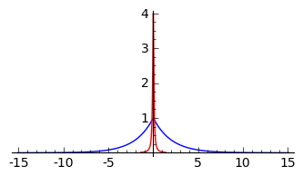
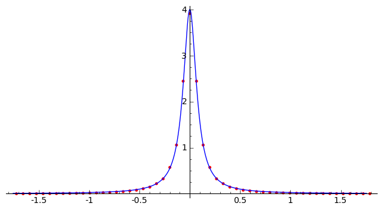
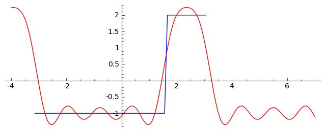
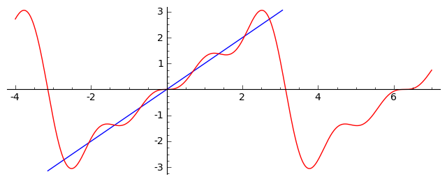
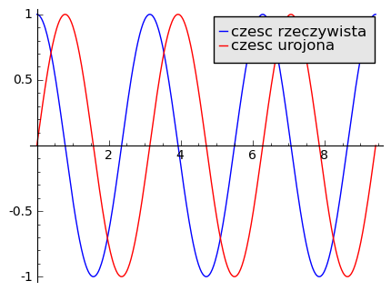

.. -*- coding: utf-8 -*-

Transformata Fouriera - praktyczny przewodnik w zastosowaniach
~~~~~~~~~~~~~~~~~~~~~~~~~~~~~~~~~~~~~~~~~~~~~~~~~~~~~~~~~~~~~~

Transformata Fouriera (TF)
-------------------------- 

Transformacja Fouriera jest to odwracalne przekształcenie liniowe,
które transformuje funkcję :math:`f(x)` w inną funkcję
:math:`\hat{f}(\xi)` zwana transformatą Fouriera. Dla funkcji
całkowalnych w :math:`\mathbb R` transformata Fouriera jest
zdefiniowana następująco:

.. MATH::

    \hat{f}(\xi)=\int e^{-i \xi x}f(x) dx,

.. end of math

   dla każdej liczby rzeczywistej  :math:`\xi.`

Transformacja Fouriera ma szerokie zastosowanie w fizyce i inżynierii
np. pozwala na przejście z funkcją określoną w dziedzinie czasu do
dziedziny częstotliwości (pulsacji :math:`\omega`):

.. MATH::

    \hat{f}(\omega)=\int e^{-i \omega t} f(t) d t.

.. end of math

Stosując odwrotną transformację możemy z powrotem przejść w dziedzinę
czasu:

.. MATH::

    \hat{f}(t)= \frac{1}{2 \pi} \int e^{-i \omega t} f(\omega) d\omega.

.. end of math

Dyskretna Transformata Fouriera (DFT)
------------------------------------- 

DFT jest transformatą Fouriera dla dyskretnego sygnału. Sygnał
dyskretny to sygnał, który składa się z wielu próbek, pobranych w
jednakowych odstępach czasu.

Transformacja dyskretna przekształca ciąg próbek sygnału :math:`(a_0,
a_1, a_2,\ldots , a_{N-1})`, :math:`a_i \in R` w ciąg harmonicznych
:math:`(A_0, A_1, A_2, \ldots, A_{N-1})`, :math:`A_i \in C` w
następujący sposób:

.. MATH::

    A_k=\sum_{n=0}^{N-1} a_n e^{-2 \pi i n k /N}, ~ 0\le n \le N-1,

.. end of math

 

gdzie :math:`n` \- numer próbki dyskretnego sygnału, :math:`a_n` \-
wartość (amplituda) próbki sygnału, :math:`k` \- numer harmonicznej,
:math:`N` \- liczba próbek sygnału.

Bardzo ważną własnością transformaty Fouriera jest to że sygnał, który
w domenie czasowej zawiera pozornie bardzo dużo informacji, po
przejsciu do domeny częstotliwości jest dużo prostszy. Ponieważ TF
jest odwracalna, zawsze możemy odtworzyć sygnał czasowy z sygnału
częstotliwościowego. Pokazano to na poinższych rysunkach: kolorem
niebieskim oznaczono sygngał czasowy, jego tranformatę Fouriera
kolorem zielonym, a kolorem czerwonym pokazano sygnał czasowy,
odzyskany z sygnbału częstotlowościowego (zielonego). Właśnie to
sprawia, że TF jest tak popularna w kompresji dźwięku i obrazu.

 

Rozważmy teraz pewną funkcję :math:`f(x)`, dla której znamy
analityczną postać transformaty Fouriera. Wykonamy próbkowanie tej
funkcji i obliczymy transformatę dyskretną a następnie pokażemy jak
wartości DFT mają się do postaci analitycznej.

Rozważmy więc następujący przykład, jako funkcję weźmiemy :math:`f(x)
= e^{-a|x|}`. Jej transformata może być obliczona analitycznie
i wynosi :math:`\frac{2 a}{(a^2+x^2)|`.

.. admonition:: Oblicz całki za pomocą Sage...

    Analityczną postać transformaty funkcji :math:`exp(-a|x|)` można
    otrzymać używając algebry komputerowej zawartej w Sage:

    .. code-block:: python

        var('k a')
        i1 = integrate( exp(a*x)*exp(-I*k*x), x).subs(x==0)
        i2 = -integrate( exp(-a*x)*exp(-I*k*x), x).subs(x==0)
        (i1+i2).full_simplify().subs({a:1/2,k:2*pi*x}).show()

    Przy okazji widać, że transformata z częstością kołową wymaga
    jeszcze przejscia do zwykłej częstości, co jest równoznaczne z
    ostatnim podstawieniem :math:`k\to 2\pi x`.

.. sagecellserver::

    sage: a=1/2
    sage: f(x) = exp( -a *abs(x) ) 
    sage: F(x) = 2*a/(a^2+4*pi^2*x^2)
    sage: html.table([['funkcja','transformata'],[f(x),F(x)]])

.. end of output

Próbkowac będziemy na przedziale :math:`(-L/2,L/2)` i weźmniemy
:math:`n` wartości funkcji. W tym celu musimy sprecyzować wartości
zakresu przedziału :math:`L` i liczby punktów :math:`n`. Rozpocznijmy
od narysowania wykresów funkcji :math:`f(x)` oraz analitycznego wyniku
dla transformaty :math:`\hat f(k)`. Wykresy rysujemy przyjmując za
wspólną oś :math:`k` i :math:`x`:

.. sagecellserver::

    sage: L = 15.1
    sage: n = 21
    sage: plot(f(x),(x, -L,L),figsize=(8,4))+\
    ...    plot(F(x),(x, -21/L,21/L),figsize=(4,2),color='red')

.. end of output

Wykonamy teraz próbkowanie funkcji :math:`f(x)` na odcinku
\-L/2,L/2. W tym celu wygenerujemy :math:`n` punktów zgodnie ze
wzrorem: :math:`-\frac{L}{2}+\frac{L}{(n-1)} i` dla
:math:`i\in(0,...,n-1)`

.. code-block:: python

    sage: [-L/2+L/(n-1)*i for i in range(n)]
    [-7.55000000000000, -6.79500000000000, -6.04000000000000, -5.28500000000000, -4.53000000000000, -3.77500000000000, -3.02000000000000, -2.26500000000000, -1.51000000000000, -0.755000000000000, 0.000000000000000, 0.755000000000000, 1.51000000000000, 2.26500000000000, 3.02000000000000, 3.77500000000000, 4.53000000000000, 5.28500000000000, 6.04000000000000, 6.79500000000000, 7.55000000000000]

.. end of output

W pakiecie Sage wszystkie wektory na ciele liczb zespolonych lub
rzeczywistych podwójnej precyzji (czyli RDF,CDF) maja metodę .ff(),
która oblicza dyskretna transformatę Fouriera:

.. code-block:: python

    sage: X = vector([-L/2+L/(n-1)*i for i in range(n)])
    sage: a = vector(RDF, [ f(x_).n()  for  x_ in X]  ) ## RDF jest konieczne by a mial metode fft()
    sage: a = vector(RDF, map(f ,X)  )                  ## RDF jest konieczne by a mial metode fft()

.. end of output

Zadanie
^^^^^^^

Zmierz wydajność algorytmu DFT zaimplementowanego, jako mnożenie przez
macierz i porównaj z metodą FFT dla różnych :math:`n`.

Uwaga, macierz :math:`T` w przykładach powyżej jest określona na
pierscieniu symbolicznym, co jest niezwykle mało wydajne \- by
porównywać wydajność numeryczną należy ją przekonwertować do
pierscienia CDF.

.. code-block:: python

    sage: A = a.fft()
    sage: Re_A = A.apply_map(lambda x:x.real())
    sage: Im_A = A.apply_map(lambda x:x.imag())

.. end of output

.. code-block:: python

    sage: html.table([[line(enumerate((Re_A)),figsize=(4,2))+line( enumerate(Im_A),color='red'),\
    ...    line(enumerate(a) ,figsize=(4,2))]])
    <html>...</html>

.. end of output

Przepis na porównanie analitycznego wzoru na transformate z wynikiem numerycznym.
^^^^^^^^^^^^^^^^^^^^^^^^^^^^^^^^^^^^^^^^^^^^^^^^^^^^^^^^^^^^^^^^^^^^^^^^^^^^^^^^^

Aby porównanie było możliwe należy:

- aby zachować rzeczywistość obrazu funkcji parzystej, wybrać stosowne przesunięcie próbkowania  :math:`m=(n-1)/2` 

- obliczyć próbkowanie częstotliwości:  :math:`df=\frac{1}{L}`, oraz zawinąć do pierwszego okresu wartości   :math:`f>\frac{n}{2L}` 

- przesunać transformatę numeryczna o L/2  

- przeskalować wartość transformaty o  :math:`\frac{L}{n-1}` 

.. code-block:: python

    sage: L = 25.1
    sage: n = 21
    sage: @interact
    sage: def _(m = slider(range(-20,20,1),default=0)):
    ...       
    ...       X = vector( [-L/2+L/(n-1)*(i%n) for i in range(0+m,n+m)] )
    ...       
    ...       a = vector( [float( f(x_) ) for  x_ in X]  )
    ...       A = a.fft()
    ...       Re_A = A.apply_map(lambda x:x.real())
    ...       Im_A = A.apply_map(lambda x:x.imag())
    ...       Abs_A = A.apply_map(lambda x:x.abs()) 
    ...       angle_A = A.apply_map(lambda x:x.argument()) 
    ...       p1 = line( enumerate(a), figsize=(4,2), marker='o', gridlines=[[],[0]])
    ...       p2 = line( enumerate(Re_A ), figsize=(4,2))
    ...       p3 = line( enumerate(Im_A),color='red')
    ...       p4 = line( enumerate(Abs_A), color='green',thickness=2)
    ...       p5 = line( enumerate(angle_A), figsize=(4,2),color='gray',thickness=2)
    ...       html.table( [[r"Funkcja $f(x)$ i jej próbkowanie",p1],\
    ...        [r"Część rzeczywista i urojonadyskretnej transformaty Fourierafunkcji $f(x)$",p2+p3],\
    ...        [r"Wartność bezwzględna i argumentdyskretnej transformaty Fourierafunkcji $f(x)$",p4+p5]])

.. end of output

Jak DFT przybliża FT?
--------------------- 

Transformata Fouriera posiada dosyć, na pierwszy rzut oka, nieintuicyjne własności. Warto więc wyrobić sobie intuicję eksperymentując. Poniższy element interaktywny umozliwia sprawdzenie między innymi takich własności jak: 

- liczba próbek poprawia dokłaność dla dużych częstości 

- okres próbkowania poprawia dokładność dla małych częstości 

.. code-block:: python

    sage: n=5
    sage: X = vector([-L/2+L/(n-1)*i for i in range(n)])
    sage: a = vector( [float( f(x_) ) for  x_ in X]  )
    sage: DFT = matrix(  [[exp(-2*pi*I*m*k/n) for m in range(n)] for k in range(n)] ) 
    sage: a_transformed  = DFT*a
    sage: print "element 5ty:",a_transformed[4].n()
    element 5ty: -0.854716933348907 + 0.620988201484304*I

.. end of output

.. code-block:: python

    sage: show(DFT)

.. MATH::

    \left(\begin{array}{rrrrr}
    1 & 1 & 1 & 1 & 1 \\
    1 & e^{\left(-\frac{2}{5} i \, \pi\right)} & e^{\left(-\frac{4}{5} i \, \pi\right)} & e^{\left(-\frac{6}{5} i \, \pi\right)} & e^{\left(-\frac{8}{5} i \, \pi\right)} \\
    1 & e^{\left(-\frac{4}{5} i \, \pi\right)} & e^{\left(-\frac{8}{5} i \, \pi\right)} & e^{\left(-\frac{12}{5} i \, \pi\right)} & e^{\left(-\frac{16}{5} i \, \pi\right)} \\
    1 & e^{\left(-\frac{6}{5} i \, \pi\right)} & e^{\left(-\frac{12}{5} i \, \pi\right)} & e^{\left(-\frac{18}{5} i \, \pi\right)} & e^{\left(-\frac{24}{5} i \, \pi\right)} \\
    1 & e^{\left(-\frac{8}{5} i \, \pi\right)} & e^{\left(-\frac{16}{5} i \, \pi\right)} & e^{\left(-\frac{24}{5} i \, \pi\right)} & e^{\left(-\frac{32}{5} i \, \pi\right)}
    \end{array}\right)

.. end of output

.. code-block:: python

    sage: print "Wbudowana procedura daje:",a.fft()[4]
    Wbudowana procedura daje: -0.854716933349 + 0.620988201484*I

.. end of output

Transformacje Fouriera funkcji okresowych:
------------------------------------------ 

Jednym z dość częstych przykładów wykorzystania DFT jest obliczenie transformaty funkcji okresowej. Matematycznie rzecz biorąc, taka transformata jest sumą skończenie lub nieskończenie wielu pików  :math:`\delta(k).` Z poniższego przykładu można wyciągnąc następujące wnioski:

- jeżeli funkcja wyjściowa  :math:`f(x)` jest sumą  :math:`\sin(\omega x)` to obraz składa się z pików w  :math:`k = \pm\omega` 

- niedokładność okresowośći powoduje pojawienie się rozmycia pików 

- mała liczba okresów podowuje małe próbkowanie  pików 

.. code-block:: python

    sage: print parent(DFT)
    sage: A = DFT.change_ring(CDF)
    sage: print parent(A)
    Full MatrixSpace of 5 by 5 dense matrices over Symbolic Ring
    Full MatrixSpace of 5 by 5 dense matrices over Complex Double Field

.. end of output

Własności macierzy DFT
^^^^^^^^^^^^^^^^^^^^^^

Macierz 

.. MATH::

    U=\frac{1}{\sqrt{n}} DFT

.. end of math

 jest unitarna.

.. code-block:: python

    sage: var('m k n')
    sage: n=6
    sage: U = 1/sqrt(n)*matrix(  [[exp(-2*pi*I*m*k/n) for m in range(n)] for k in range(n)] ) 
    sage: show(U)

.. MATH::

    \left(\begin{array}{rrrrrr}
    \frac{1}{6} \, \sqrt{6} & \frac{1}{6} \, \sqrt{6} & \frac{1}{6} \, \sqrt{6} & \frac{1}{6} \, \sqrt{6} & \frac{1}{6} \, \sqrt{6} & \frac{1}{6} \, \sqrt{6} \\
    \frac{1}{6} \, \sqrt{6} & \frac{1}{6} \, \sqrt{6} e^{\left(-\frac{1}{3} i \, \pi\right)} & \frac{1}{6} \, \sqrt{6} e^{\left(-\frac{2}{3} i \, \pi\right)} & -\frac{1}{6} \, \sqrt{6} & \frac{1}{6} \, \sqrt{6} e^{\left(-\frac{4}{3} i \, \pi\right)} & \frac{1}{6} \, \sqrt{6} e^{\left(-\frac{5}{3} i \, \pi\right)} \\
    \frac{1}{6} \, \sqrt{6} & \frac{1}{6} \, \sqrt{6} e^{\left(-\frac{2}{3} i \, \pi\right)} & \frac{1}{6} \, \sqrt{6} e^{\left(-\frac{4}{3} i \, \pi\right)} & \frac{1}{6} \, \sqrt{6} & \frac{1}{6} \, \sqrt{6} e^{\left(-\frac{8}{3} i \, \pi\right)} & \frac{1}{6} \, \sqrt{6} e^{\left(-\frac{10}{3} i \, \pi\right)} \\
    \frac{1}{6} \, \sqrt{6} & -\frac{1}{6} \, \sqrt{6} & \frac{1}{6} \, \sqrt{6} & -\frac{1}{6} \, \sqrt{6} & \frac{1}{6} \, \sqrt{6} & -\frac{1}{6} \, \sqrt{6} \\
    \frac{1}{6} \, \sqrt{6} & \frac{1}{6} \, \sqrt{6} e^{\left(-\frac{4}{3} i \, \pi\right)} & \frac{1}{6} \, \sqrt{6} e^{\left(-\frac{8}{3} i \, \pi\right)} & \frac{1}{6} \, \sqrt{6} & \frac{1}{6} \, \sqrt{6} e^{\left(-\frac{16}{3} i \, \pi\right)} & \frac{1}{6} \, \sqrt{6} e^{\left(-\frac{20}{3} i \, \pi\right)} \\
    \frac{1}{6} \, \sqrt{6} & \frac{1}{6} \, \sqrt{6} e^{\left(-\frac{5}{3} i \, \pi\right)} & \frac{1}{6} \, \sqrt{6} e^{\left(-\frac{10}{3} i \, \pi\right)} & -\frac{1}{6} \, \sqrt{6} & \frac{1}{6} \, \sqrt{6} e^{\left(-\frac{20}{3} i \, \pi\right)} & \frac{1}{6} \, \sqrt{6} e^{\left(-\frac{25}{3} i \, \pi\right)}
    \end{array}\right)

.. end of output

Macierz 

.. MATH::

    U=\frac{1}{\sqrt{n}} DFT

.. end of math

 jest unitarna.

 

.. code-block:: python

    sage: if n < 5:
    ...       show((U.conjugate_transpose()*U).simplify_trig())
    sage: else:
    ...       show( (U.conjugate_transpose()*U).numerical_approx(digits=5) )

.. MATH::

    \left(\begin{array}{rrrrrr}
    1.0000 & 4.7684 \times 10^{-7} - 1.4305 \times 10^{-6}i & 2.8610 \times 10^{-6} - 1.4305 \times 10^{-6}i & 0 & -5.9605 \times 10^{-6} - 2.8610 \times 10^{-6}i & -8.5831 \times 10^{-6} - 1.9073 \times 10^{-6}i \\
    4.7684 \times 10^{-7} + 1.4305 \times 10^{-6}i & 1.0000 & 4.7684 \times 10^{-7} - 1.4305 \times 10^{-6}i & -1.4305 \times 10^{-6} + 9.5367 \times 10^{-7}i & 0 & -5.9605 \times 10^{-6} - 2.8610 \times 10^{-6}i \\
    2.6226 \times 10^{-6} + 1.4305 \times 10^{-6}i & 4.7684 \times 10^{-7} + 1.4305 \times 10^{-6}i & 1.0000 & -7.1526 \times 10^{-7} + 2.3842 \times 10^{-6}i & 2.8610 \times 10^{-6} - 1.4305 \times 10^{-6}i & 0 \\
    0 & -1.4305 \times 10^{-6} - 9.5367 \times 10^{-7}i & -7.1526 \times 10^{-7} - 2.8610 \times 10^{-6}i & 1.0000 & 1.4305 \times 10^{-6} - 4.7684 \times 10^{-6}i & 5.7220 \times 10^{-6} + 7.1526 \times 10^{-6}i \\
    -5.9605 \times 10^{-6} + 2.8610 \times 10^{-6}i & 0 & 2.6226 \times 10^{-6} + 1.4305 \times 10^{-6}i & 1.4305 \times 10^{-6} + 4.7684 \times 10^{-6}i & 1.0000 & 4.7684 \times 10^{-7} - 1.4305 \times 10^{-6}i \\
    -8.5831 \times 10^{-6} + 2.3842 \times 10^{-6}i & -5.9605 \times 10^{-6} + 2.8610 \times 10^{-6}i & 0 & 5.7220 \times 10^{-6} - 7.1526 \times 10^{-6}i & 4.7684 \times 10^{-7} + 1.4305 \times 10^{-6}i & 1.0000
    \end{array}\right)

.. end of output

.. code-block:: python

    sage: UU = (U.conjugate_transpose()*U).numerical_approx()

.. end of output

.. code-block:: python

    sage: UU.apply_map( lambda x:round(x.real(),4 ) )
    [ 1.0  0.0  0.0  0.0 -0.0 -0.0]
    [ 0.0  1.0  0.0 -0.0  0.0 -0.0]
    [ 0.0  0.0  1.0 -0.0  0.0  0.0]
    [ 0.0 -0.0 -0.0  1.0 -0.0  0.0]
    [-0.0  0.0  0.0 -0.0  1.0  0.0]
    [-0.0 -0.0  0.0  0.0  0.0  1.0]

.. end of output

.. code-block:: python

    sage: UU.apply_map( lambda x:round(x.imag(),4 ) )
    [ 0.0 -0.0 -0.0  0.0 -0.0 -0.0]
    [ 0.0  0.0 -0.0  0.0  0.0 -0.0]
    [ 0.0  0.0  0.0  0.0 -0.0  0.0]
    [ 0.0 -0.0 -0.0  0.0 -0.0  0.0]
    [ 0.0  0.0  0.0  0.0  0.0 -0.0]
    [ 0.0  0.0  0.0 -0.0  0.0  0.0]

.. end of output

Porównanie analitycznego wzoru na transformate z wynikiem numerycznym. Aby porównanie było możliwe należy:

- aby zachować rzeczywistość obrazu funkcji parzystej, wybrać stosowne przesunięcie próbkowania  :math:`m=(n-1)/2` 

- obliczyć próbkowanie częstotliwości:  :math:`df=\frac{1}{L}`, oraz zawinąć do pierwszego okresu wartości   :math:`f>\frac{n}{2L}` 

- przesunać transformatę numeryczna o L/2  

- przeskalować wartość transformaty o  :math:`\frac{L}{n-1}` 

.. code-block:: python

    sage: L = 15.1
    sage: n = 54
    sage: m = (n-1)/2
    sage: X = vector( [-L/2+L/(n-1)*(i%n) for i in range(m,n+m)] )
    sage: a = vector( [float( f(x_) ) for  x_ in X]  )
    sage: #A = a.fft().apply_map(lambda x:x.real())
    sage: A = a.fft().apply_map(real)
    sage: freq =  vector(  [ i/L for i in range(0,n/2+1)] + [ -n/L+i/L for i in range(n/2+1,n)]   )
    sage: plt_fft = point( zip( freq, L/(n-1)*(A)),color='red' ,figsize=(8,4)) 
    sage: plt_exact = plot(F(x),(x, -.5*(n-1)/(L),.5*(n-1)/(L)),figsize=(8,4))
    sage: plt_exact+plt_fft

.. end of output

.. code-block:: python

    sage: A = a.fft().apply_map(real)

.. end of output

.. code-block:: python

    sage: real(I+1)
    1

.. end of output

.. code-block:: python

    sage: n=11
    sage: L=10
    sage: X = [-L/2+L/(n-1)*i for i in range(n)]

.. end of output

.. code-block:: python

    sage: X
    [-5, -4, -3, -2, -1, 0, 1, 2, 3, 4, 5]

.. end of output

.. code-block:: python

    sage: m = 5 
    sage: X2 = [-L/2+L/(n-1)*(i%n) for i in range(0+m,n+m)]
    sage: X2
    [0, 1, 2, 3, 4, 5, -5, -4, -3, -2, -1]

.. end of output

.. code-block:: python

    sage: Set(X)==Set(X2)
    True

.. end of output

Jak DFT przybliża FT?
--------------------- 

- liczba próbek poprawia dokłaność dla dużych częstości 

- okres próbkowania poprawia dokładność dla małych częstości 

.. code-block:: python

    sage: a=1/2
    sage: f(x) = exp( -a *abs(x) ) 
    sage: F(x) = 2*a/(a^2+4*pi^2*x^2)
    sage: @interact
    sage: def _(L=slider(0.1,100,0.001,default=15),n=slider(3,100,2,default=21)):
    ...       m = (n-1)/2
    ...       X = vector( [-L/2+L/(n-1)*(i%n) for i in range(m,n+m)] )
    ...       a = vector( [float( f(x_) ) for  x_ in X]  )
    ...       A = a.fft().apply_map(lambda x:x.real())
    ...       freq =  vector(  [ i/L for i in range(0,n/2+1)] + [ -n/L+i/L for i in range(n/2+1,n)]   )
    ...       plt = plot(f(x),(x, -20,20),figsize=(6,3))
    ...       plt += point (zip(X,a),color='green')
    ...       
    ...       plt_fft = point( zip( freq, L/(n-1)*A ),color='red' ) 
    ...       plt_fft+=plot(F(x),(x, -.5*n/L,.5*n/L),figsize=(6,3),color='gray')
    ...       
    ...       html.table([[r"Oryginał $f(x)$ (linia), próbkowanie (punkty)",r"Obraz $\hat f(k)$ (linia), FFT (punkty)"],[plt,plt_fft]])

.. end of output

Transformacje Fouriera funkcji okresowych:
------------------------------------------ 

- nieharmoniczność funkcji powoduje pojawienie się pików w  :math:`k \omega` 

- niedokładność okresowośći powoduje pojawienie się rozmycia pików 

- mała liczba okresów podowuje małe próbkowanie  pików 

.. code-block:: python

    sage: import numpy as np
    sage: @interact
    sage: def _(L=slider(srange(1,40,0.1)+srange(40,50,0.1),default=40),n=slider(range(2,100)+range(100,5000,100),1,default=1400),kwindow=slider(1,100,1,default=8)):
    ...    
    ...       
    ...       f(x) = sin(2*pi*x)+sin(4*pi*x)
    ...       
    ...       m = (n-1)/2
    ...       X = vector( [-L/2+L/(n-1)*(i%n) for i in range(m,n+m)] )
    ...       a = vector( [float( f(x_) ) for  x_ in X]  )
    ...       A = a.fft().apply_map(lambda x:x.abs())
    ...       freq =  vector(  [ i/L for i in range(0,n/2+1)] + [ -n/L+i/L for i in range(n/2+1,n)]   )
    ...       plt = plot(f(x),(x, -5,5),figsize=(8,1),thickness=0.2)
    ...       plt += line (zip(X,a),color='red',thickness=0.5)
    ...       plt.show()
    ...       plt_fft = point( zip( freq, L/(n-1)*A ),color='red' ,figsize=(8,2),xmin=-kwindow,xmax=kwindow,gridlines=[[-1,1,-2,2,-4,4],[]]) 
    ...       
    ...       
    ...       plt_fft.show()

.. end of output

Szeregi Fouriera
---------------- 

Jeżeli funckja (lub sygnał dyskretny) jest periodyczna z okresem
:math:`2\pi` tzn.  :math:`f(x+2\pi)=f(x)` i całkowalna w przedziale
:math:`[-\pi,\pi]`, to za pomocą szeregu Fouriera możemy ją rozłożyć
na sumę prostych funkcji trygonometrycznych sinus i cosinus (lub
eksponent zespolonych)

.. MATH::

    f(x)=\sum_{n=-\infty}^{\infty} \frac{c_n}{\sqrt{2\pi}}e^{inx}=\frac{a_0}{2}+\sum_{n=1}^{\infty}\left( a_n \cos(nx)+ b_n \sin(nx)\right),

.. end of math

gdzie współczynniki Fouriera :math:`a_n` i :math:`b_n` dane są
wzorami:

.. MATH::

      a_n = \frac{1}{\pi}\int_{-\pi}^\pi f(x) \cos(nx)\, dx, \quad n \ge 0,

.. end of math

.. MATH::

    b_n = \frac{1}{\pi}\int_{-\pi}^\pi f(x) \sin(nx)\, dx, \quad n \ge 1.

.. end of math

 

Aby przejść z eksponent do funkcji trygonometrycznych skorzystalismy ze wzoru Eulera

.. MATH::

    e^{inx}=\cos(nx)+i\sin(nx),

.. end of math

oraz odwrotnie:

.. MATH::

    \cos(nx)=\dfrac{e^{inx}+e^{-inx}}{2},~\sin(nx)=\dfrac{e^{inx}-e^{-inx}}{2i}.

.. end of math

 

Dla sygnału dyskretnego sumę nieskończoną zastępujemy sumą po
skończonej ilości elementów.

Na poniższym przykładzie zademonstrowano, jak zmienia się dokładność
przybliżenia funkcji za pomocą szeregu Fouriera gdy zwiększamy ilośc
wyrazów szeregu.

.. code-block:: python

    sage: def ftermSquare(n):
    ...    return(1/n*sin(n*x*pi/3))
    sage: def ftermSawtooth(n):
    ...    return(1/n*sin(n*x*pi/3))
    sage: def ftermParabola(n):
    ...    return((-1)^n/n^2 * cos(n*x))
    sage: def fseriesSquare(n):
    ...    return(4/pi*sum(ftermSquare(i) for i in range (1,2*n,2)))
    sage: def fseriesSawtooth(n):
    ...    return(1/2-1/pi*sum(ftermSawtooth(i) for i in range (1,n)))
    sage: def fseriesParabola(n):
    ...    return(pi^2/3 + 4*sum(ftermParabola(i) for i in range(1,n)))
    sage: @interact
    sage: def plotFourier(n=slider(1, 30,1,10,'Liczba wyrazow szeregu')
    sage: ,plotpoints=('Liczba punktów na wykresie',[100,500,1000]),Funkcja=['Saw Tooth','Square Wave','Periodic Parabola']):
    ...       if Funkcja=='Saw Tooth':
    ...        show(plot(fseriesSawtooth(n),x,-6,6,plot_points=plotpoints))
    ...       if Funkcja=='Square Wave':
    ...        show(plot(fseriesSquare(n),x,-6,6,plot_points=plotpoints))
    ...       if Funkcja=='Periodic Parabola':
    ...        show(plot(fseriesParabola(n),x,-6,6,plot_points=plotpoints))

.. end of output

.. code-block:: python

    sage: f1 = lambda x: -1
    sage: f2 = lambda x: 2
    sage: f = Piecewise([[(-pi,pi/2),f1],[(pi/2,pi),f2]])
    sage: print f.fourier_series_cosine_coefficient(5,pi)
    sage: print f.fourier_series_sine_coefficient(4,pi)
    sage: print f.fourier_series_partial_sum(4,pi)
    -3/5/pi
    0
    -3*sin(2*x)/pi + sin(3*x)/pi + 3*sin(x)/pi + cos(3*x)/pi - 3*cos(x)/pi - 1/4

.. end of output

.. code-block:: python

    sage: line( [(x,f(x)) for x in srange(-pi.n(),pi.n(),0.1)]) +f.fourier_series_partial_sum(6,pi).plot(-4,7,color='red',figsize=(8,3))

.. end of output

.. code-block:: python

    sage: f1 = lambda x: x
    sage: f = Piecewise([[(-pi,pi),f1]])
    sage: print f.fourier_series_cosine_coefficient(5,pi)
    sage: print f.fourier_series_sine_coefficient(5,pi)
    sage: print f.fourier_series_partial_sum(2,pi)
    sage: line( [(x,f(x)) for x in srange(-pi.n(),pi.n(),0.1)]) +f.fourier_series_partial_sum(5,pi).plot(-4,7,color='red',figsize=(8,3))
    0
    2/5
    2*sin(x)

.. end of output

Uwaga, współczynniki Fouriera są liczone analitycznie przez
"integrate" więc, podanie funkcji typu :math:`\sin(x^2)`
prawdopodobnie spowoduje zajęcie Sage na liczeniu całek:

.. MATH::

      a_n = \frac{1}{\pi}\int_{-\pi}^\pi f(x) \cos(nx)\, dx, \quad n \ge 0

.. end of math

.. MATH::

    b_n = \frac{1}{\pi}\int_{-\pi}^\pi f(x) \sin(nx)\, dx, \quad n \ge 1 

.. end of math

.. code-block:: python

    sage: @interact
    sage: def _(N=slider(range(1,10)+range(10,100,10),default=3)):
    ...       f1 = lambda x: sin(2*x)+(x)^2
    ...       f1 = lambda x: -x^2+pi^2
    ...       f1 = lambda x: pi-abs(x)
    ...       f = Piecewise([[(-pi,pi),f1]])
    ...       p1 = line( [(x,f(x)) for x in srange(-pi.n(),pi.n(),0.1)]) 
    ...       p2 = f.fourier_series_partial_sum(N,pi).plot(-4,7,color='red',figsize=(8,3)) 
    ...       (p1+p2).show()

.. end of output

.. code-block:: python

    sage: %python
    sage: from scipy import fftpack
    sage: N=4*pi
    sage: sinus=[cos(x)*cos(2*x) for x in srange(0,N,0.05)] # sygnal - kolor niebieski
    sage: fft_s=fftpack.fft(sinus,len(sinus))    # jego TF - kolor zielony
    sage: fft_odwr=fftpack.ifft(fft_s,len(sinus))   # transformata odwrotna 
    sage: html.table([[line(enumerate(sinus),figsize=(4,2)),line(enumerate(real(fft_s)),figsize=(4,2),color='green'),line(enumerate(real(fft_odwr)),figsize=(4,2),color='red')]])
    <html>...</html>

.. end of output

.. code-block:: python

    sage: L=4*pi
    sage: n=200
    sage: X = vector([-L/2+L/(n-1)*i for i in range(n)])
    sage: a = vector(RDF, [ sin(x).n()  for  x in X]  ) 
    sage: A = a.fft()
    sage: B=A.fft()
    sage: Re_A = A.apply_map(lambda x:x.real())
    sage: Re_B = B.apply_map(lambda x:x.real())
    sage: #plot(a)

.. end of output

.. code-block:: python

    sage: n=2
    sage: rl=plot(cos(n*x),(x,0,3*pi),legend_label="czesc rzeczywista")
    sage: im=plot(sin(n*x),(x,0,3*pi),color="red",legend_label="czesc urojona")
    sage: (rl+im).show(figsize=5)

.. end of output

Podstawowe własności transformaty Fouriera
==========================================

Liniowość
^^^^^^^^^

Transformata Fouriera jest liniowa. Oznacza to, że jeżeli funkcja
:math:`h(x)` jest kombinacją liniową funkcji :math:`f(x)` i
:math:`g(x)`, tj.  :math:`h(x)=c_1f(x)+c_2g(x)` (dla dowolnych liczb
zespolonych :math:`c_1` i :math:`c_2`), wtedy TF funkcji :math:`h(x)`
jest sumą transformat funckji :math:`f(x)` i :math:`g(x)` pomnożonych
przez współczynniki :math:`c_1` i :math:`c_2` :

.. MATH::

    \hat{h}(\xi)=c_1\hat{f}(\xi)+c_2\hat{g}(\xi)

.. end of math

Na poniższych rysunkach kolorem niebieskim narysowano  :math:`\hat{h(\xi)}`, kolorem czerwonym sumę transformat funckji  :math:`f(x)` i  :math:`g(x)`.

.. code-block:: python

    sage: %python
    sage: from scipy import fftpack
    sage: N=20*pi
    sage: step=0.1
    sage: f1=[cos(2*x)for x in srange(0,N,step)] # sygnal - kolor niebieski
    sage: f2=[2*sin(x)*cos(2.4*x)*sin(15*x) for x in srange(0,N,step)] # sygnal - kolor niebieski
    sage: f3=[cos(2*x)+ 2*sin(x)*cos(2.4*x)*sin(15*x)for x in srange(0,N,step)]
    sage: fft1=fftpack.fft(f1,len(f1))    # jego TF - kolor zielony
    sage: fft2=fftpack.fft(f2,len(f1))    # jego TF - kolor zielony
    sage: fft3=fftpack.fft(f3,len(f1))    # jego TF - kolor zielony
    sage: html.table([[line(enumerate(abs(fft3)),figsize=(5,3)),line(enumerate(abs(fft1)+abs(fft2)),color="red",figsize=(5,3))]])
    <html>...</html>

.. end of output

Translacja
^^^^^^^^^^

Jeżeli funkcja  :math:`h(x)=f(x-x_0)` (dla dowolnej liczby rzeczywistej  :math:`x_0`), to transformata Fouriera funckji  :math:`h(x)` jest transformatą funkcji  :math:`f(x)` z dokładnością do czynnika fazowego  :math:`e^{i2\pi x_0 \xi}`

.. MATH::

     \hat{h}(\xi)=e^{i2\pi x_0 \xi} \hat{f}(\xi)

.. end of math

.

