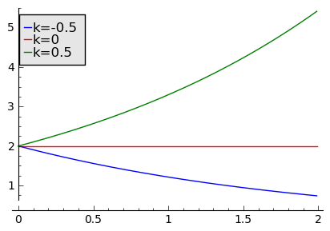

.. -*- coding: utf-8 -*-

Struktura modeli dynamiki populacyjnej 
=======================================

W historii rozwoju nauki wypracowano metody, które obecnie wydają się być oczywiste: obserwujemy jakieś zjawisko, badamy je, jeżeli to możliwe mierzymy pewne wielkości, następnie formułujemy hipotezy i w końcu testujemy te hipotezy. Sukces nauki polega też na tym, że na podstawie powyższych metod potrafimy przewidywać, planować, projektować, budować.  Postaramy się w tym wykładzie przedstawić  kilka typowych metod modelowania matematycznego  zjawisk związanych z  dynamiką populacyjną, procesami zachodzącymi w organizmach żywych, procesami chemicznymi. Wiele różnych zjawisk, które czasami wydają się być odległe i nie mające nic wspólnego z sobą, posiadają wspólne cech i w konsekwencji modele matematyczne niewiele się różnią. Procesy wzrostu komórki nowotworowej, procesy niektórych  reakcji chemicznej, wzrost kolonii bakterii, rozwój populacji królików w Australii, rozchodzenie się impulsów w komórkach nerwowych czy rozprzestrzenianie się  epidemii grypy  to problemy,  które będziemy starali się modelować na tym wykładzie. Podejście tu prezentowane różni się zasadniczo od tego, które stanowi bazę fizyki teoretycznej. Nie będziemy budowali wielkich teorii tej miary co  mechanika klasyczna, mechanika kwantowa, elektrodynamika czy fizyka statystyczna. Innymi słowy, nie będą to teorie mikroskopowe.

W historii rozwoju nauki wypracowano metody, które obecnie wydają się być oczywiste: obserwujemy jakieś zjawisko, badamy je, jeżeli to możliwe mierzymy pewne wielkości, następnie formułujemy hipotezy i w końcu testujemy te hipotezy. Sukces nauki polega też na tym, że na podstawie powyższych metod potrafimy przewidywać, planować, projektować, budować.  Postaramy się w tym wykładzie przedstawić  kilka typowych metod modelowania matematycznego  zjawisk związanych z  dynamiką populacyjną, procesami zachodzącymi w organizmach żywych, procesami chemicznymi. Wiele różnych zjawisk, które czasami wydają się być odległe i nie mające nic wspólnego z sobą, posiadają wspólne cech i w konsekwencji modele matematyczne niewiele się różnią. Procesy wzrostu komórki nowotworowej, procesy niektórych  reakcji chemicznej, wzrost kolonii bakterii, rozwój populacji królików w Australii, rozchodzenie się impulsów w komórkach nerwowych czy rozprzestrzenianie się  epidemii grypy  to problemy,  które będziemy starali się modelować na tym wykładzie. Podejście tu prezentowane różni się zasadniczo od tego, które stanowi bazę fizyki teoretycznej. Nie będziemy budowali wielkich teorii tej miary co  mechanika klasyczna, mechanika kwantowa, elektrodynamika czy fizyka statystyczna. Innymi słowy, nie będą to teorie mikroskopowe.  Bądą to modele fenomenologiczne, ale nie oznacza to że gorszej kategorii. Z jednej strony bazują na osiągnięciach matematyki, z drugiej strony wykorzystuje się wiedzę z fizyki, chemii i  biologii.

Głównym obiektem modelowania będą populacje biologiczne, tzn.  zespół organizmów jednego gatunku żyjących równocześnie w określonym środowisku i wzajemnie na siebie wpływających, zdolnych do wydawania płodnego potomstwa. Nie jest to jednak suma osobników jednego gatunku, a zupełnie nowa całość. Mogą to być populacje ludzi, wilków czy  bakterii. Ale również mogą to być substancje podlegające reakcjom chemicznym. Populacje posiadają pewne charakterystyczne cech takie jak:

 - rozrodczość

 - śmiertelność

 - obszar występowania

 - zagęszczenie populacji

 - liczebność

 - struktura płci i wieku

 - struktura socjalna

 - strategia życiowa

 - dynamika liczebności

W rzeczywistych warunkach populacje nie są izolowane, ale są to układy otwarte, oddziałujące z otoczeniem, innymi populacjami, przemieszczające się. Można mówic o sub\-populacjach czy meta\-populacjach.  Populacja występuje na ograniczonych obszarach,  w nadającym  się do zasiedlenia środowisku. Pojawiają się konkurenci, drapieżniki,  pasożyty. Istnieje wiele elementów wpływających na liczebność populacji i dynamikę zmian osobników w populacji. Gdybyśmy chcieli uwzględnić wszystkie elementy i powiązania, otrzymalibyśmy model sieci, podobnych do sieci komputerowych czy sieci neuronowych.  Modelowanie takie wymaga potężnych mocy obliczeniowych i jest coraz szerzej rozwijane we współczesnych badaniach naukowych. Obecnie jest to początek drogi. W obecnym kursie ograniczymy się do prostszego modelowania, uwzględniajacego jeden, dwa czy kilka istotnych czynników. To ma swoje plusy i minusy. Niewątpliwie plusem jest prostota i przejrzystość modeli. Wadą jest ich ograniczona i wąska stosowalność.   Ale startując od najprostszych modeli, możemy krok po kroku, mając odpowiedni zasób doświadczenia w modelowaniu, komplikować modele dodając nowe elementy. Tak też będziemy postępowali.

Zaczniemy od najprostszego modelu: jedna populacja. Może to być populacja ludzi w Ghanie,  populacja zajęcy w Borach Tucholskich, bakterii na hienie rozkładającej się na afrykańskiej sawannie  czy populacja komórek nowotworowych u  pana  Smithowa. Może to być "populacja" związku chemicznego (molekuł ). Populację określa się liczbami naturalnymi: jest 4 tys. ludzi, 3 mld bakterii, 10^20 molekuł. Posługiwanie się liczbami całkowitymi jest rozsądne jeżeli te liczby nie są zbyt wielkie. Rozsądne jest zapytać, ile ludzi mieszka w Wysokiej Lelowskiej, a ile we Wrocławiu. Można też zapytać jakie jest zaludnienie czy zagęszczenie wysp Bali czy Nowego Jorku. Pytamy, ile ludzi przypada średnio  na kilometr kwadratowy powierzchni na tej wyspie czy w tym mieście.  W jednym przypadku pytamy o wartość bezwględną osobników, w drugim przypadku \- o gęstość populacji, czyli średnią liczbę osobników na jednostkę powierzchni (gęstość powierzchniowa). W przypadku reakcji chemicznych, rozsądniej jest wprowadzić gęstość objętościową molekuł \- średnią ilość molekuł w jednostce objętości. To jest tak jak  w opisie dynamiki płynów, np. wody czy krwi. Woda w szklance składa się z dyskretnej liczby molekuł. Ale nikt do charakterystyki wody w szklance nie stosuje opisu bazującego na liczbach naturalnych.  Stosujemy  *przybliżenie ośrodka ciągłego*  scharakteryzowanego gęstością wody: ilością molekuł w jednostkowej objętości. Często podobny opis stosowany jest  w modelowaniu dynamiki populacyjnej.

Jeżeli stosujemy opis bazujący na liczbach naturalnych, wprowadzamy oznaczenie

.. MATH::

    N_t  = 0, 1, 2, 3, ...  \quad \quad - \mbox{liczba osobników w chwili czasu t;  czas też jest dyskretny}

Jeżeli stosujemy opis bazujący na liczbach ciągłych, wprowadzamy oznaczenie

.. MATH::

    N(t) \in [0, \infty) \quad \quad - \mbox{względna liczba osobników w chwili czasu t;  czas jest wielkością ciągłą}

Liczba :math:`N = N(t)`  charakteryzująca liczbę osobników w populacji będzie nieujemną liczbą rzeczywistą, interpretowaną jako względna liczba osobników (liczba osobników w stosunku do np. średniej liczby osobników w ostatnich 50 latach lub maksymalnej liczby osobników w poprzednim roku, itp.). Liczba ta może zmieniać się w sposób ciągły.

W związku z powyższym, definiuje się modele dyskretne i modele ciągłe.

Trzeba pamiętać,   że modele dyskretne mogą mieć  radykalnie różne własności niż ich odpowiedniki ciągłe.

Modele dyskretne
----------------

Rozważamy najprostszy model: jedna populacja, na przykład populacja ludzi na zamkniętym obszarze Y. Nie interesuje nas rozmieszczenie populacji w tym obszarze, tylko liczba ludzi w chwili czasu t. Dodatkowo, w modelach dyskretnych, nie śledzimy stanu ludności w sposób ciągły, tylko interesuje nas liczba ludzi pierwszego dnia każdego miesiąca o godzinie 14. 00.  Wprowadzamy oznaczenia:

.. MATH::

     N_t = \mbox{liczba ludzi w chwili t}

.. MATH::

     N_{t+1} = \mbox{liczba ludzi   miesiąc później, czyli w chwili  t+1}

Rozważamy najprostszy model: jedna populacja, na przykład populacja ludzi na zamkniętym obszarze Y. Nie interesuje nas rozmieszczenie populacji w tym obszarze, tylko liczba ludzi w chwili czasu t. Dodatkowo, w modelach dyskretnych, nie śledzimy stanu ludności w sposób ciągły, tylko interesuje nas liczba ludzi pierwszego dnia każdego miesiąca o godzinie 14. 00.  Wprowadzamy oznaczenia: 

.. MATH::

    N_t = \mbox{liczba ludzi w chwili} \, t

.. MATH::

     N_{t+1} = \mbox{liczba ludzi  miesiąc później, czyli w chwili}  \, t+1 

.. MATH::

    B_t = \mbox{liczba ludzi urodzonych  w ciągu ostatniego miesiąca, tzn. w czasie} \, (t, t+1) 

.. MATH::

    D_t = \mbox{liczba ludzi, którzy umarli  w ciągu ostatniego miesiąca, tzn. w czasie} \, (t, t+1) 

.. MATH::

    E_t = \mbox{liczba ludzi, którzy wyjechali z obszaru Y (wyemigrowali)  w ciągu ostatniego miesiąca}, \\  \mbox{tzn. w czasie} \,  (t, t+1) 

.. MATH::

    I_t = \mbox{liczba ludzi, którzy przyjechali do obszaru Y (imigrowali) w ciągu ostatniego miesiąca}, \\  \mbox{tzn. w czasie} \,  (t, t+1) 

Zauważmy, że uwzględniamy 4 procesy demograficzne: narodziny, śmierć, emigrację i imigrację. Możemy napisać równanie, które łączy te 4 procesy:

.. MATH::

    N_{t+1} = N_t + B_t  - D_t - E_t + I_t

Jest to równanie bilansu: miesiąc później populacja zmieniała się, ponieważ przybyli nowo\-narodzeni, część ludzi umarła, część ludzi wyjechała i częśc ludzi przyjechała. Przy tym prostym modelowaniu czynimy wiele nierealistycznych założeń:  gdy ktoś przyjechał, to przebywa tu przez cały miesiąć, gdy  ktoś wyjechał, to co najmniej na miesiąc, itd. Oczywiście możemy rozważać mniejszy interwał czasowy obserwacji zmian populacji. Może to być 1 dzień, 1  godzina, 1 minuta, 1 sekunda. Gdy przyjmujemy 1 sekundę  jako interwał czasowy, część założeń staje się bardziej realistyczna.  W modelowaniu nie definiujemy dokładnie interwału czasowego, ponieważ zależy on od konkretnych układów, warunków, wymagań. Tutaj zmiana jest obserwowana po upływie umownego jednostkowego interwału czasowego.

Dokonujemy następnego uproszczenia: pomijamy procesy migracji. Wówczas :math:`E_t =  I_t = 0` i otrzymujemy relację

.. MATH::

    N_{t+1} = N_t + B_t  - D_t

Równanie to jest mało użyteczne, ponieważ ciągle nie znamy wielkości :math:`B_t`  oraz  :math:`D_t`. Rozważmy wielkość :math:`B_t`. Od czego zależy liczba urodzonych osobników w przeciągu określonego przedziału czasowego. Oczywiście odpowiedź nie jest jednoznaczna i zależy od charakteru populacji. Załóżmy, że mamy populację zwierząt.  W populacjach ludzi nasze rozważania nie muszą być prawdziwe, co pokazuje historia ostatnich stu lat. Populacja zwierząt zachowuje się "normalnie": reprodukcja następuje tak często jak to tylko możliwe. Liczba urodzin w grupie  liczącej 1000 osobników  jest statystycznie inna niż w podobnej grupie  liczącej 100 tys. osobników. Oczywiście w  100 tys. grupie rodzi się więcej osobników. Można przyjąć, że im liczniejsza jest grupa, tym więcej rodzi się osobników. Innymi słowy zależność :math:`B_t` od :math:`N_t` powinna być funkcją rosnącą. Wydaje się to być rozsądna obserwacja.  Można to ująć matematycznie w następujący sposób

.. MATH::

    B_t  = f( N_t), \quad \quad \mbox{gdzie} \quad \quad f \quad \quad \mbox{jest funkcją rosnącą }

Najprostszą taką funkcją jest funkcja liniowa

.. MATH::

    B_t = b_t  N_t

Podobne rozważania można zastosować do wyrazu opisującego  zmniejszanie się populacji:

.. MATH::

    D_t  = g( N_t), \quad \quad \mbox{gdzie} \quad \quad g \quad \quad \mbox{jest funkcją rosnącą }

Najprostszą taką funkcją znowu  jest funkcja liniowa

.. MATH::

    D_t = d_t  N_t

Współczynniki proporcjonalności :math:`b_t` oraz :math:`d_t` opisują tempo urodzin i tempo śmierci osobników w populacji. Uwzględniając te wyrażenia, równanie bilansu przyjmuje postać:

.. MATH::

    N_{t+1} = N_t + (b_t - d_t) N_t

Model ten można dalej upraszczać lub go bardziej komplikować. Uproszczenie polega na założeniu, że współczynniki tempa urodzin i śmierci nie zależą od czasu:

.. MATH::

    N_{t+1} = N_t + (b - d) N_t = N_t + r N_t = \lambda N_t, \quad \quad \lambda = 1 + r, \quad \quad r = b - d

Model ten nazywa sie modelem  geometrycznym  wzrostu populacji, ponieważ
  w chwili następnej :math:`t+1`  populacja wzrasta (lub maleje) :math:`\lambda` razy w porównaniu z chwilą poprzednią. Aby wyznaczyć współczynnik :math:`\lambda` np. dla ptaków, należy zmierzyć populację  :math:`N_1`  w pewnej chwili :math:`t_1`,  a następnie po cyklu reprodukcji, zmierzyć  populację  :math:`N_2`  w chwili :math:`t_2`.   Wówczas  :math:`\lambda = N_2/N_1`.

ZADANIA
~~~~~~~

1.  Załóżmy, że znamy liczebność populacji w pewnej umownej chwili zerowej, tzn. :math:`N_0` oraz znamy tempo zmian populacji :math:`\lambda`. Oblicz, po jakim czasie podwoi się liczebność populacji. Jest to czas podwojenia populacji (doubling time)

2. Na polu, na którym rośnie żyto, badamy populację myszy polnych.  Nasz monitoring pokazał, że w pewnej chwili było 700 myszy. Po miesiącu znaleźliśmy 100 martwych myszy, natomiast zaobserwowaliśmy 200 małych myszek.  Oblicz wartości parametrów :math:`b,  d,  \lambda`.  Oblicz, ile myszy będzie po 4 miesiącach.

3. Czy parametr :math:`\lambda = 0`?  Jakie wartości tego parametru zapewniają wzrost populacji , a jakie wartości  - malenie populacji.

4. Podaj prawo wzrostu populacji, która w chwili początkowej liczyła 1000 osobników i czas podwojenia populacji wynosi 250 dni.

5. Penicylina podana pacjentowi jest oczyszczana z plazmy krwii przez nerki. Około 0.2 frakcji penicyliny jest wydalana w ciągu 5 minut. Po tym czasie pozostaje około 80% penicyliny.  Oto tabela zmian penicyliny (dane z pracy:  T. Bergans, Penicillins, in Antibiotics and Chemotherapy, Vol 25, H. Schøonfeld, Ed., S. Karger, Basel, New York, 1978)

       =============  ==================================
	czas [min]	koncentracja penicyliny [μg/ml]
       =============  ==================================
	t= 0		         200
	t= 5		         152
	t=10		         118
	t=15		          93
	t=20		          74
       =============  ==================================

Podaj prawo zaniku penicyliny.

Uogólnienia 
-----------

Uogólnienie ( i komplikacja) modelu geometrycznego polega na obserwacji, że w pewnych sytuacjach tempo wzrostu i tempo zaniku populacji może zależeć od liczby osobników w populacji. Innymi słowy, funkcje :math:`f(N_t)` oraz :math:`g(N_t)` są nieliniowymi funkcjami.

Uogólnienie ( i komplikacja) modelu geometrycznego polega na obserwacji, że w pewnych sytuacjach tempo wzrostu i tempo zaniku populacji może zależeć od liczby osobników w populacji. Innymi słowy, funkcje :math:`f(N_t)` oraz :math:`g(N_t)` są nieliniowymi funkcjami lub tempo wzrostu i tempo smierci zależy od :math:`N_t`. Znowu można założyć prostą postać tej zależności, a mianowicie w postaci funkcji liniowych:

.. MATH::

    b_t = b + b_1 N_t, \quad \quad d_t = d + d_1 N_t

gdzie :math:`b_0, b_1, d_0, d_1` są parametrami modelu.

Wówczas równanie bilansu ma postać:

.. MATH::

    N_{t+1} = N_t + [ b + b_1 N_t] N_t  - [  d + d_1 N_t] N_t = \lambda N_t + (b - d) N_t^2, \quad \quad \lambda = 1 + b - d

Równanie to nie jest równaniem liniowym ponieważ zawiera wyrazy postaci :math:`N_t^2` i to powoduje, że ma ono  radykalnie inne własności niż poprzednie równanie  liniowe ze stałymi współczynnikami tempa urodzin (wzrostu) i śmierci (zaniku). W pewnych przypadkach jest ono niesłychanie trudne do analizy. W jednym z wykładów przedstawimy metodę szczegółowej analizy tego typu równań. Chcemy tu nadmienić, że równanie to może opisywać chaotyczne zachowanie się układu, co z praktycznego punktu widzenia oznacza, że nie można przewidywać zachowania się układu w przyszłości,   nie można planować rozwoju populacji i nie można zapanować nad dynamiką zmian populacji. Brzmi to złowieszczo, mimo że powyższe równanie  wygląda "dość niewinnie".

Można dokonywać dalszych uogólnięć biorą pod uwagę inne mechanizmy wpływające na zmiany w populacji. Ogólna struktura takiego jednowymiarowego modelu ma postać równania rekurencyjnego w postaci:

.. MATH::

    N_{t+1}= F(N_t), \quad \quad \mbox{oraz warunek początkowy} \quad \quad N_0=n

Można rozważać kilka populacji oddziałujących na siebie (typu ofiara-drapieżnik, typu symbioza, typu konkurencja).Wówczas takie modele opisywane sa przez układ równań rekurencyjnych. Na przykład dla modelu 2 populacji  :math:`N_t`  oraz :math:`P_t`  które oddziaływują na siebie, równania takie sa postaci

.. MATH::

    N_{t+1}= F(N_t, P_t), \quad \quad P_{t+1}= G(N_t, P_t), \mbox{ oraz warunki  początkowe} \quad \quad N_0=n, \quad \quad P_0=p

Analiza takich równań metodami tradycyjnej matematyki jes trudna. Natomiast zastosowanie komputera pozwala w prosty sposób otrzymaywać trajektorie układu oraz analizować stany stacjonarne układu.

ZADANIA
~~~~~~~

1. Porównaj trajektorie generowane przez równania wzrostu populacji  postaci:

.. MATH::

    N_{t+1}= 1.2 N_t, \quad \quad N_{t+1}= 1.3 N_t, \quad \quad N_0=0.5, 1, 2

2. Ewolucja populacji opisana jest równaniem

.. MATH::

    N_{t+1}=  N_t + 1 - \frac{1}{16} N_t^2

Zbadaj trajektorie dla następujących warunków początkowych: :math:`N_0 = 0.1,  0.5,  0.9,  1,  1.2`. Czy zauważasz różnice w ewolucji układów z tego zadania i z zadania 1.

Modele ciągłe
-------------

Powróćmy do równania bilansu w postaci:

.. MATH::

    N_{t+1} = N_t + B_t - D_t

Wprowadzimy nowe oznaczenia:

.. MATH::

    N_t  = N(t), \quad \quad  B_t = B(t) \quad \quad D_t = D(t), \quad \quad N_{t+1} = N(t+\Delta t)

Teraz jednostkowym interwałem  czasu będzie :math:`\Delta t`.  Równanie bilansu w nowym zapisie ma postać

.. MATH::

    N(t+\Delta t) = N(t) + B(t) - D(t)

Funkcja :math:`B(t)` opisuje przyrost  populacji wskutek urodzin nowych osobników.  Podobnie jak w przypadku dyskretnym wniskujemy że im większa jest populacja tym większy jest jej przyrost, czyli :math:`B(t) \propto N(t)`. Ponadto im dłuższy jest przedział czasu :math:`\Delta t` tym więcej rodzi się osobników, czyli :math:`B(t) \propto \Delta t`. Uwzględniając te dwie proporcjonalności można stwierdzić, że :math:`B(t) \propto N(t) \Delta t`. Równość otrzymamy, gdy wprowadzimy odpowiedni współczynnik proporcjonalności :math:`a` :

.. MATH::

    B(t) = a N(t) \Delta t

 
gdzie parametr :math:`a` ma znaczenie tempa wzrostu populacji. Podobne rozumowanie można przeprowadzić dla procesu śmierci i dochodzimy do relacji: 
 
.. MATH::

    D(t)) = b N(t) \Delta t

 
gdzie parametr :math:`b` ma znaczenie tempa zaniku (śmierci)  populacji. Równanie bilansu przepiszemy w postaci:

.. MATH::

    N(t+\Delta t) = N(t) + a N(t) \Delta t - b N(t) \Delta t

Jeżeli :math:`N(t)` z prawej   strony  przeniesiemy na lewą stronę i obustronnie podzielimy to równanie  przez :math:`\Delta t` to otrzymamy równoważną postać:

.. MATH::

    \frac{N(t+\Delta t)  - N(t)}{\Delta t} = a N(t)  - b N(t) = (a - b) N(t) =  k N(t), \quad \quad \quad k = a - b

Parametr :math:`k` może być dodatni, ujemny lub przyjmować wartość zero.

Dokonujemy przejścia granicznego :math:`\Delta \to 0` i rozpoznajemy z  lewej strony  definicję pochodnej funkcji :math:`N(t)`. Ostatecznie

.. MATH::

    \frac{dN(t)}{dt} =  k N(t)

Jest to odpowiednik równania dyskretnego :math:`N_{t+1} = \lambda N_t`. Jednak jego natura jest odmienna. Jest to  równanie różniczkowe.
 W celu jego jednoznacznego rozwiązania  musimy zadać warunek początkowy, czyli :math:`N(0) = N_0`. Równanie powyższe można modyfikować, uogólniać uwzględniając różne mechanizmy wzrostu i śmierci. Jego ogólna struktura jest postaci

.. MATH::

    \frac{dN(t)}{dt}  = F(N(t)), \quad \quad N(0)=n

gdzie :math:`F` jest daną funkcją.

Można też uwzględniać oddziaływania z innymi populacjami. Jeżeli analizujemy kilka populacji oddziaływujących z sobą, wówczas modelowanie oparte jest na układzie równań różniczkowych pierwszego rzędu: równań jest tyle, ile różnych populacji jest uwzględnionych w modelowaniu.Na przykład dla 2 populacji opisywanych gęstościami :math:`N = N(t)` oraz :math:`P = P(t)` równania takie są postaci

.. MATH::

    \frac{dN(t)}{dt}  = F(N(t),  P(t)), \quad \quad \frac{dP(t)}{dt}  = G(N(t),  P(t)), \quad \quad N(0)=n, \quad \quad P(0)=p

z danymi funkcjami :math:`F` oraz :math:`G`. Ten sposób modelowania jest szeroko używany w naukach biologicznych, chemicznych i fizycznych. Teoria równań różniczkowych ma swoją długoletnią historię i jest znakomicie "rozpracowana" zarówno przez matematyków jak i nowszą  generację "komputerowców". Stosowanie komputera jest tu nieodzowne, nie tylko w celu wizualizacji procesów dynamiki populacyjnej, ale przede wszystkim komputer pozwala w relatywnie prosty numeryczny sposób analizować własności równań różniczkowych. Z jego użyciem możemy obserwować zachowanie się w czasie rozwiązań równań, badać stany stacjonarne układu, tworzyć i analizować diagramy bifurkacyjne, Jednym słowem, komputer pozwala kompletnie zbadać zachowanie się układu zarówno w czasie jak i w stanach stacjonarnych przy dowolnych zmianach parametrów charakteryzujących dany układ.

ZADANIA
~~~~~~~

1. Układ opisany jest równaniem postaci:

.. MATH::

    \frac{dN(t)}{dt}  =  k N(t), \quad \quad N(0)=n

Narysuj trajektorie dla :math:`k=-0.5, 0, 0.5` oraz rozważ kilka warunków początkowych, np. :math:`N_0 = 0.1, 0.5, 1, 2`.

2. Niech układ będzie opisany  równaniem:

.. MATH::

    \frac{dN(t)}{dt}  =   N(t) - N^2(t), \quad \quad N(0)= n0

Narysuj trajektorie dla  warunków początkowych  :math:`n0 = 0.1, 0.5, 1, 2`.

.. code-block:: python

    sage: var('N1,N2,N3') ##zadanie 1 
    sage: T = srange(0,2,0.01)
    sage: sol=desolve_odeint( vector([-0.5*N1, 0, 0.5*N3]), [2,2,2],T,[N1,N2,N3])## warunek początkowy N0=2
    sage: line( zip ( T,sol[:,0]) ,figsize=(5, 3),legend_label="k=-0.5") +\
    ...    line( zip ( T,sol[:,1]) ,color='red',legend_label="k=0")+\
    ...    line( zip ( T,sol[:,2]) ,color='green',legend_label="k=0.5") ## pokazujemy rozwiązania dla różnych wartości k=-0.5, 0, 0.5

.. end of output

.. code-block:: python

    sage: var('n1,n2,n3,n4') ##zadanie 2 
    sage: T = srange(0,4,0.01)
    sage: h(N)=N - N^2 
    sage: sol=desolve_odeint( vector([h(n1), h(n2), h(n3), h(n4)]), [0.1, 0.5, 1, 2],T,[n1, n2, n3, n4])
    sage: line( zip ( T,sol[:,0]) ,figsize=(5, 3),legend_label="n0=0.1") +\
    ...    line( zip ( T,sol[:,1]) ,color='red',legend_label="n0=0.5")+\
    ...    line( zip ( T,sol[:,2]) ,color='black',legend_label="n0=1") + line( zip ( T,sol[:,3]) ,color='green',legend_label="n0=2")

.. image:: iCSE_BMetMatem01_z116_struktura_modeli_dynamiki_populacyjnej_media/cell_8_sage0.png
    :align: center

.. end of output

Modelowanie procesów migracji
-----------------------------

Dotychczas przedstawiliśmy najprostszy sposób modelowania procesów ewolucji populacji uwzględniając mechanizmy  urodzin i śmierci osobników w populacji.   Nie były brane pod uwagę procesy migracji. Procesy migracji są różnej natury. Dla przykładu emigracja powoduje zmiejszanie się populacji. Gdyby tempo emigracji było stałe, tzn. w pewnej jednostce czasu stały odsetek  :math:`C \gt 0` populacji opuszcza ją, można to uwzględnić w ostatnim równaniu w następujący sposób:

.. MATH::

    \frac{dN(t)}{dt} = F( N(t))  -  C

Dlaczego w taki sposób? Pamiętajmy, że pochodna funkcji mówi o tempie zmian funkcji. Jeżeli pochodna jest ujemna, to funkcja maleje, więc wyraz typu:

.. MATH::

    \frac{dN(t)}{dt} =  -  C

oznacza, że funkcja maleje w stałym tempie, czyli populacja maleje w stałym tempie wskutek emigracji.Ale z drugiej strony, jeżeli populacja maleje w stałym tempie wskutek emigracji, to populacja ta może zaniknąć w skończonym czasie.

Podobnie wyrażenie typu

.. MATH::

    \frac{dN(t)}{dt} = F(N(t)) + E, \quad E \gt 0

oznacza, że funkcja wzrasta w stałym tempie :math:`E`, a to może modelować proces imigracji (napływ nowym osobników z zewnątrz). Musimy też pamiętać, że uwzględnianie różnych mechanizmów zmian w populacji ma charakter addytywny, tzn. dodajemy lub odejmujemy różne wyrażenia matematyczne po  prawej stronie równań różniczkowych  lub w równaniach dyskretnych.

Rozpatrzmy teraz bardziej realistyczny proces migracji polegający na przypadkowym pojawianiu się nowych osobników w populacji, przypadkowym znikaniu osobników, a także proces  zmian przestrzennych. Często populacja w swym rozwoju zajmuje coraz to nowe obszary sięgając po coraz to nowe zasoby pożywienia. To są procesy ekspansji gatunków, często obserwowane w historii procesów zachodzących na Ziemi. Przykładem jest ekspansja królików w Australii, ekspansja Europejczyków w Ameryce, ekspansja   piżmaka w Europie w początkowych latach poprzedniego wieku.  Ten proces migracji modelować będziemy za pomocą procesów dyfuzji.

Procesy dyfuzji jest szczegółowo opracowany w oddzielnym wykładzie. Tutaj przedstawimy najbardziej istotne cechy tego procesu. Proces dyfuzji jest granicznym przypadkiem błądzenia przypadkowego: cząstka w sposób całkowicie losowy wybiera kierunek ruchu i wykonuje jeden krok w tym kierunku. Następnie znowu wybiera losowo następny kierunek i znowu wykonuje jeden krok, itd. Ruch ten może odbywać się w jednym, dwóch lub trzech wymiarach. Na przykład w ruchu jedno\-wymiarowym, losuje się ruch w lewo lub w prawo z tym samym prawdopodobieństwem 1/2. W ruchu dyfuzyjnym na płaszczyźnie, modeluje się ruch , pozwalając cząstce na wybór czterech możliwości: ruch w lewo, w prawo, do góry, w dół, wszystkie z prawdopodobieństwem 1/4.  Model matematyczny ruchu dyfuzyjnego modeluje się przez operator 2\-go rzędu zmian zmiennych przestrzennych. Teraz gęstość populacji zależy nie tylko od czasu, ale także od zmiennych przestrzennych:

.. MATH::

    N = N(x,  t) \quad \quad \mbox{lub} \quad \quad  N = N(x, y, t) , \quad \quad \mbox{lub} \quad \quad N = N(x, y, z,  t)

Jeżeli ruch przestrzenny jest tylko 1\-wymiarowy, to równanie ewolucji modyfikuje się do postaci:

.. MATH::

     \frac{\partial N(x, t)}{\partial t} = F(N(x, t)) + D \frac{\partial^2 N(x, t)}{\partial x^2}

Jeżeli możliwy jest ruch na płaszczyźnie :math:`(X, Y)`,  to równanie ewolucji ma postać:

.. MATH::

     \frac{\partial N(x, y, t)}{\partial t} = F(N(x, y, t)) + D\left[ \frac{\partial^2 N(x, y,  t)}{\partial x^2} + \frac{\partial^2 N(x, y, t)}{\partial y^2}\right]

Jeżeli możliwy jest ruch  w przestrzeni :math:`(X, Y, Z)`,  to równanie ewolucji ma postać:

.. MATH::

     \frac{\partial N(x, y, z, t)}{\partial t} = F(N(x, y, z, t)) + D\left[  \frac{\partial^2 N(x, y, z,  t)}{\partial x^2} + \frac{\partial^2 N(x, y, z,  t)}{\partial y^2} + \frac{\partial^2 N(x, y, z,  t)}{\partial z^2}\right]

Powyższe równania ewolucji to  równania różniczkowe cząstkowe. Matematycy uczą nas, że same równania ewolucji nie są wystarczające. Potrzebne są jeszcze  warunki początkowe i warunki brzegowe dla takich równań. O ile sformułowanie  warunków początkowych nie jest problemem , o tyle wybór poprawnych warunków brzegowych  może być zadaniem trudnym. Należy o tym pamiętać, ponieważ wybór niepoprawnych warunków brzegowych może powodować, że otrzymane rozwiązania będą niepoprawne, praktycznie nieprzydatne i nie akceptowalne, mogą prowadzić do paradoksów lub nawet do absurdu.

W następnych wykładach przedstawimy typowe modele dynamiki populacyjnej. Będziemy krok po kroku  budować modele, zaczynając od najprostszych modeli. W kolejnych krokach będziemy udoskonalali lub/i rozszerzali nasze modele, co zwykle powoduje ich komplikacje. Stwierdzimy także, że modele dynamiki populacyjnej są podobne w swej strukturze do modeli opisujących kinetykę reakcji chemicznych. Reakacje enzymatyczne czy też reakcje Biełousowa\-Żabotyńskiego mają wiele cech podobnych to zachowania się kolonii  bakterii, komórek biologicznych czy też  populacji myszy na polach uprawnych.   Przedstawimy też metody analizy takich równań. Zobaczymy, że współczesne osiągnięcia w dziedzinie metod komputerowych pozwalają na elegancką i relatywnie prostą analizę równań i wizualizację ich rozwiązań. Programy do takiej  analizy i wizualizacji  liczą często tylko kilka linijek kodu. Na tym polega potęga stosowania takich metod jak iCSE.

