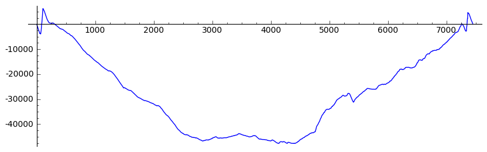
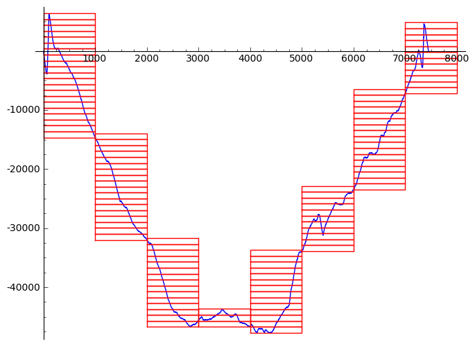
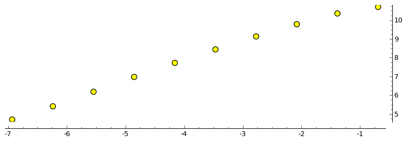
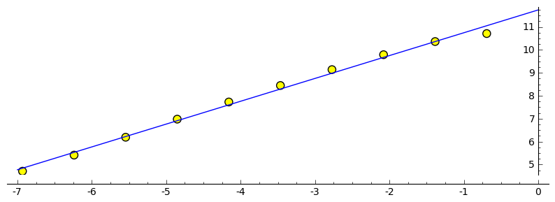

.. -*- coding: utf-8 -*-

Metody obliczania wymiaru podobieństwa
======================================

Istnieje wiele metod obliczania wymiaru podobieństwa czy też fraktalnego D. Z jednej strony za każdą z nich stoją solidne podstawy teoretyczne, z drugiej często różne metody dają różne wartości D dla tych samych obiektów. Ta mnogość metod bierze się z faktu, że definicja wymiaru Hausdorffa nie pozwala na obliczenie wartości D dla większości obiektów. Z tego to powodu powstało wiele metod przybliżonych. Część z nich omówimy tutaj.

Pomimo, że konkretne algorytmy różnią się od siebie w szczegółach, dla wszystkich można podać ogólną regułę obliczania D, zawierajacą się w 3 krokach

 - należy obliczyć daną wielkość dla konkretnego obiektu na kilku skalach (dla różnych wielkości kroku),

 - wykreślić zależność log(dana wielkość) od log(skala) i dopasować liniową zależność do wykreślonych punktów (np. metodą najmniejszych kwadratów),

 - obliczyć D jako nachylenie dopasowanej krzywej liniowej.

Przyjrzymy się bliżej metodom, które ogólnie możemy pogrupować w trzy klasy oparte o metodę pudełkową, ułamkowy ruch Browna oraz o pomiar powierzchni.

Gęstość
-------

Pierwszą metodę obliczania D podamy bazując na wiedzy, że linia ma wymiar 1, trójkąt wymiar 2 a kostka 3. Załóżmy że pewien interesujący nas obiekt ma jednorodną gęstość. Możemy zapostulować, że wymiar obiektu jest wyrażony poprzez stosunek jego masy całkowitej do jego długości (wielkości)

.. MATH::

    M(L) \propto L^{D_G}

gdzie :math:`D_G` będzie właśnie wymiarem samopodobieństwa opartym na gęstości. Czytelnik może sprawdzić, czy powyższy wzór zadziała dla regularnych obiektów (figur) 1-, 2- bądź 3-wymiarowych. Nieco lepiej będzie obliczać taki wymiar bazując na gęstości obiektu niż na jego masie, gdyż ta ostatnia będzie zmieniać się wraz z wielkością obiektu, a ta pierwsza będzie stała (zakładając, że jest jednorodna). Możemy zatem wyrazić wymiar fraktalny bazując na gęstości obiektu poprzez

.. MATH::

    \rho = \frac{M(L)}{\text{powierzchnia}} \propto \frac{L^{D_G}}{L^2} \propto L^{D_G - 2}

Metoda pudełkowa
----------------

Algorytm obliczania D metodą pudełkową jest stosunkowo prosty.

 #. sygnał (szereg czasowy) dzielimy na odcinki o wielkości r

 #. obliczamy N(r) \- ilość kwadratów o booku r potrzebnych do pokrycia całego szeregu

Obliczamy wymiar fraktalny jako

.. MATH::

    D_P = - \lim_{r \to 0} \frac{\log(N(r))}{\log(r)}

Obliczmy :math:`D_P` dla poniższych danych.

.. code-block:: python

    sage: import numpy
    sage: data = numpy.genfromtxt(DATA+'data.dat')
    sage: data = numpy.cumsum(data - numpy.mean(data))
    sage: #list_plot(data.tolist()[120:7300], plotjoined=True).show(figsize=[10,3])
    sage: list_plot(data.tolist(), plotjoined=True).show(figsize=[10,3])

.. end of output

Dla :math:`r=1000` dostaniemy :math:`Nr` pudełek.

.. code-block:: python

    sage: _scale = 1000
    sage: _segments = ceil(len(data)/_scale)
    sage: N1000 = 0
    sage: for i in range(_segments):
    ...       idx_start, idx_stop = i*_scale, (i+1)*_scale
    ...       _amp = max(data[idx_start:idx_stop]) - min(data[idx_start:idx_stop])
    ...       N1000 += ceil(_amp/_scale)
    sage: print N1000
    111

.. end of output

Zobaczmy jak to wygląda.

.. code-block:: python

    sage: def plot_rect((x,y), side=1, **args):
    ...       return list_plot([(x,y),(x,y+side),(x+side, y+side),(x+side,y),(x,y)], **args)

.. end of output

.. code-block:: python

    sage: def plot_boxes_on_data(data, scale):
    ...       _scale = scale
    ...       _p = list_plot(data.tolist(), plotjoined=True)
    ...       _segments = ceil(len(data)/_scale)
    ...       for i in range(_segments):
    ...           idx_start, idx_stop = i*_scale, (i+1)*_scale
    ...           _amp = max(data[idx_start:idx_stop]) - min(data[idx_start:idx_stop])
    ...           _Nr = ceil(_amp/_scale)
    ...           for j in range(_Nr):
    ...               _p += plot_rect((idx_start,min(data[idx_start:idx_stop])+j*_scale), side=_scale, plotjoined=True, color="red")
    ...       _p.set_aspect_ratio("automatic")
    ...       return _p

.. end of output

.. code-block:: python

    sage: plot_boxes_on_data(data, 1000)

.. end of output

Zobaczymy, jaki uzyskamy wymiar fraktalny. Ilość segmentów dla rozmiaru :math:`r` obliczymy jako

.. code-block:: python

    ceil(len(data)/r)

.. code-block:: python

    sage: scales = [2**i for i in range(1,11)]
    sage: Nr = []
    sage: for _scale in scales:
    ...       _segments = ceil(len(data)/_scale)
    ...       
    ...       Nscale = 0
    ...       for i in range(_segments):
    ...           idx_start, idx_stop = i*_scale, (i+1)*_scale
    ...           _amp = max(data[idx_start:idx_stop]) - min(data[idx_start:idx_stop])
    ...           Nscale += ceil(_amp/_scale)
    ...           
    ...       Nr.append(Nscale)
    sage: Nr = numpy.array(Nr)
    sage: scales = numpy.array(scales)
    sage: list_plot(zip(numpy.log(1./scales),numpy.log(Nr)), size=50, faceted=True, color="yellow").show(figsize=[10,3])

.. end of output

Obliczymy teraz nachylenie wykresu.

.. code-block:: python

    sage: # dopasujemy krzywą
    sage: var('a b x')
    sage: model(x) = a*x + b
    sage: wynik = find_fit(zip(numpy.log(scales),numpy.log(Nr)),model)

.. end of output

.. code-block:: python

    sage: DP = -wynik[0].rhs(); print "Wymiar fraktalny danych wynosi:", DP
    Wymiar fraktalny danych wynosi: 0.99565265783452461

.. end of output

.. code-block:: python

    sage: (plot(-wynik[0].rhs()*x + wynik[1].rhs(),-7,0) + list_plot(zip(numpy.log(1./scales),numpy.log(Nr)), size=50, faceted=True, color="yellow")).show(figsize=[10,3])

.. end of output

