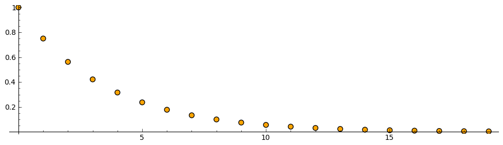

.. -*- coding: utf-8 -*-

Zadanie 5 - rozwiązanie
~~~~~~~~~~~~~~~~~~~~~~~

Wytłumacz, dlaczego wymiar fraktalny trójkąta Sierpińskiego (TS)

:math:`HD_{S} = 1.5849625007211562977005314678535796701908111572265625\dots`

Posłużymy się definicją wymiaru fraktalnego bazującą na gęstości :math:`HD = D_G`. Przeprowadźmy eksperyment myślowy (bądź ten z zadania 4) i skonstruujmy iteracyjnie TS usuwając kolejno środkowe trójkąty. Wyobraźmy sobie jednak, że po każdej iteracji przeskalujemy TS tak, aby pozostałe trójkąty miały bok o długości :math:`r=1`. Zobaczymy jak gęstość takiego obiektu zmienia się wraz z kolejną iteracją (z rozmiarem). Mając tę wiedzę możemy zastosować wzór definiujący :math:`D_G` i sprawdzić ile wynosi :math:`HD`. Zakładamy, że każdy trójkąt ma masę :math:`m` (ponieważ skalujemy obiekt) oraz jednostkową gęstość.

.. code-block:: python

    sage: var('m r M L')
    sage: rho(M,L) = M/L^2

.. end of output

Krok "zerowy": :math:`L = r, M = m`

.. code-block:: python

    sage: rho0 = rho(m,r); show(rho0)

.. end of output

Krok pierwszy: :math:`L=2r, M=3m` (z jednego trójkąta robią się 3, a długość boku trójkąta oryginalnego rośnie dwukrotnie).

.. code-block:: python

    sage: rho1 = rho(3*m, 2*r); show(rho1)

.. end of output

Krok drugi: :math:`L=4r, M=9m` (z jednego trójkąta robią się 3 - więc mamy juz 9, a długość boku trójkąta oryginalnego znów rośnie dwukrotnie - a więc dochodzi do 4 oryginalnych długości).

.. code-block:: python

    sage: rho2 = rho(3*3*m, 2*2*r); show(rho2)

.. end of output

możemy, oczywiście zobaczyć kilka kolejnych kroków szybciej...

.. code-block:: python

    sage: lrho = [rho(3^i*m, 2^i *r) for i in range(10)]; show(lrho)

.. end of output

Widzimy, że gęstość w każdej kolejnej iteracji to :math:`\frac{3}{4}` tej poprzedniej. Ze wzoru opisującego zależność gęstości od rozmiaru poprzez wymiar fraktalny

.. MATH::

    \rho = C L^{D_G - 2}

widzimy, że wykres zależności :math:`\log(\rho)` od :math:`\log(L)` będzie liniowy, a jego nachylenie wynosić będzie

.. MATH::

    D_G - 2 = \frac{\Delta \log(\rho)}{\Delta \log(L)}.

Możemy sobie to łatwo obliczyć

.. code-block:: python

    sage: DG = 2 + (log(rho0/rho0) - log(rho1/rho0)) / (log(1) - log(2)); print "DG =", n(DG)

DG = 1.58496250072116

.. end of output

Jeszcze tylko drobna uwaga na koniec. Z każdą iteracją rośnie masa dziurawego trójkąta. W rzeczywistości rośnie ona do nieskończoności, w miarę jak krok iteracji rośnie do nieskończoności. W tym samym czasie liczba pustych miejsc (dziur) również rośnie do nieskończoności, a zgodnie ze wzorem na gęstość maleje ona do zera.

.. code-block:: python

    sage: #m=1, r=1
    sage: list_plot([rho(3^i, 2^i) for i in range(20)], size=50, faceted=1, color="orange").show(figsize=[10,3])

.. end of output

W przypadku zwykłego trójkąta, którego to gęstość nie będzie rosła wraz ze wzrostem rozmiarów przyrost logarytmiczny będzie równy zero. Da nam to poprawny wynik jeżeli chodzi o wymiar fraktalny, czyli :math:`D_F = 2 - 0 = 2`, co jest tożsame z wymiarem topologicznym dla obiektu dwuwymiarowego. Oznacza to, że jeżeli odłożymy ową zależność log-log dla zwykłego trójkąta, doateniemy linię o zerowym nachyleniu, w przeciwieństwie do trójkąta Sierpińskiego, gdzie to nachylenie wynosi :math:`D_F - 2 = -0.415`.

