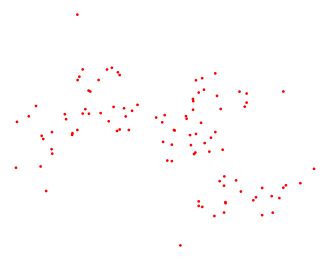
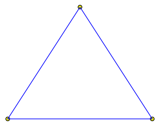
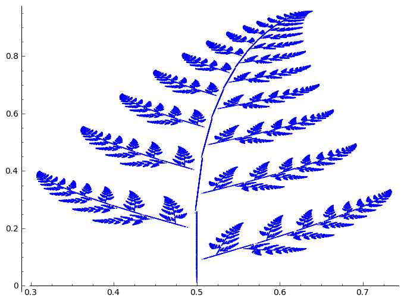

.. -*- coding: utf-8 -*-

wymagane umiejętności:

 - znajomość Sage, programowanie w języku Python

 - podstawowa wiedza z teori miary, liczby zespolone

Przykłady fraktali
==================

IFS
---

1.  **Smok Heighwaya**  \- zbiór na płaszczyźnie, znany również jako smok Hartera\-Heighwaya albo smok z Parku Jurajskiego. Można zdefiniować go za pomocą atraktora poniższego IFS

.. MATH::

    f_1(z)=\frac{(1+i)z}{2}

.. MATH::

    f_2(z)=1-\frac{(1-i)z}{2}

gdzie z to liczba zespolona :math:`z = x + iy`, a :math:`x` i :math:`y` to liczby rzeczywiste. Startujemy z dowolnego punktu na płaszczyźnie Gaussa (np. :math:`z_0 = i`). Kolejne punkty obliczamy losując przekształcenie :math:`f_1` lub :math:`f_2`, dbając aby prawdopodobieństwo wylosowania każdego z nich było równe, a następnie odkładamy je na płaszczyźnie.

Wymiar fraktalny smoka wynosi 2 (patrz zadanie 2 w zestawie zadań).

.. code-block:: python

    sage: reset
    sage: var('z')
    sage: f1(z) = (1 + I)*z / 2
    sage: f2(z) = 1 - (1 - I)*z / 2
    sage: N = 100 #5000
    sage: z = I
    sage: points = [(real(z), imag(z))]
    sage: for i in xrange(N):
    ...       if random() > 0.5:
    ...           z = f1(z)
    ...       else:
    ...           z = f2(z)           
    ...       points.append((real(z), imag(z)))
    sage: point2d(points, size=3, color="red").show(frame=0, axes=0, figsize=4)

.. end of output

2.  **Trójkąt Sierpińskiego**  to kolejny przykład fraktala na płaszczyźnie, znanego od dość dawna. Trójkąt Sierpińskiego otrzymuje się następująco: w trójkącie równobocznym łączy się środki boków, dzieląc go w ten sposób na cztery mniejsze trójkąty. Trójkąt środkowy usuwa się, a wobec trzech pozostałych trójkątów operację się powtarza, dzieląc każdy z nich na cztery mniejsze trójkąty, usuwając środkowy, a wobec pozostałych czynności się powtarzają. Atraktorem takich przekształceń będzie właśnie obiekt zwany trójkątem Sierpińskiego.

Gra w chaos
"""""""""""

Istnieje kilka algorytmów na zbudowanie trójkąta Sierpińskiego (patrz zadania 3 i 4). Tutaj  `zagramy sobie w chaos <http://pl.wikipedia.org/wiki/Gra_w_chaos>`_ . Idea tego algorytmu polega na losowym wybieraniu jednego z wierzchołków do obliczania nowych punktów na płaszczyźnie. Ale po kolei

1. Wybieramy 3 niewspółliniowe punkty na płaszczyźnie. Będą to nasze wierzchołki trójkąta. Ten początkowy krok będzie miał bardzo duży wpływ na ostateczny kształt trójkąta, więc jeżeli chcemy otrzymać klasyczny trójkąt Sierpińskiego, powinniśmy wybrać takie punkty, aby tworzyły trójkąt równoboczny :math:`\{(0,0), (1,0), (\cos\frac{\pi}{3}, \sin\frac{\pi}{3})\}`. Ten wybór oznacza jednostkową długość boku.

 

.. code-block:: python

    sage: tr = [(0,0),(1,0),(cos(pi/3),sin(pi/3))]
    sage: (line(tr+[(0,0)]) + point2d(tr, color="yellow", faceted=True, size=25)).show(frame=False, axes=False, figsize=4)

.. end of output

2. Wybieramy teraz losowo punkt na płaszczyźnie, troszcząc się tylko o to aby był to punkt leżący wewnątrz początkowego trójkąta (samo w sobie ciekawe zagadnienie matematyczne).

.. code-block:: python

    sage: def in_triangle(P, triangle=[(0,0),(1,0),(sin(pi/3),cos(pi/3))]):
    ...       """sprawdza czy punkt lezy w zadanym trojkacie"""
    ...       t1 = (triangle[2][1] - triangle[0][1])*(P[0] - triangle[0][0]) - (triangle[2][0] - triangle[0][0])*(P[1] - triangle[0][1])
    ...       t2 = (triangle[1][1] - triangle[2][1])*(P[0] - triangle[2][0]) - (triangle[1][0] - triangle[2][0])*(P[1] - triangle[2][1])
    ...       t3 = (triangle[0][1] - triangle[1][1])*(P[0] - triangle[1][0]) - (triangle[0][0] - triangle[1][0])*(P[1] - triangle[1][1])
    ...       if ((t1>0) and (t2>0) and (t3>0)) or ((t1<0) and (t2<0) and (t3<0)):
    ...         return True
    ...       else:
    ...         return False

.. end of output

mając powyższą funkcję, która sprawdza nam czy punkt leży w trójkacie, szybko znajdziemy interesujący nas punkt

.. code-block:: python

    sage: def get_starting_point(triangle=[(0,0),(1,0),(sin(pi/3),cos(pi/3))]):
    ...       go = 1
    ...       while go:
    ...           p = (random(), random())
    ...           if in_triangle(p, triangle): 
    ...               go = False
    ...               return p

.. end of output

i możemy zacząć właściwą iterację

.. code-block:: python

    sage: @interact
    sage: def _(krok=(0,1,10,100,1000,2000,3000,5000,10000,20000)):
    ...       sierpinski = []
    ...       p = get_starting_point()
    ...       for i in xrange(krok):
    ...           vertex = randint(0,2)
    ...           p = ((p[0] + tr[vertex][0])/2, (p[1] + tr[vertex][1])/2)
    ...           sierpinski.append(p)
    ...       show(point2d(tr, size=20, faceted=1, color="yellow") + point2d(sierpinski, size=1, color="red"), frame=0, axes=0, figsize=6)

.. end of output

3. Paproć Barnsleya.

Możemy taką roślinkę skonstruować opierając się na poniższym przekształceniu afinicznym. Z każdym krokiem takiej to transformacji obiekt pozostaje samopodobny w takim sensie, że relacja łącząca go z poprzednim krokiem iteracji jest taka sama jak relacja łacząca go z następnym.

Iteracja wygląda następująco

.. code-block:: python

    sage: %latex
    sage: (x_{n+1},y_{n+1}) = 
    sage: \begin{cases}(0.5, 0.27 y_n) &\text{2\%}\\
    sage: (-0.139x_n + 0.263 y_n +0.57,0.246x_n + 0.224 y_n-0.036) &\text{15\%}\\
    sage: (0.17 x_n - 0.215y_n +0.408, 0.222x_n + 0.176y_n+0.0893) &\text{13\%}\\
    sage: (0.781 x_n + 0.034y_n +0.1075, -0.032x_n + 0.739y_n+0.27) &\text{70\%}
    sage: \end{cases}

.. end of output

Spróbujmy zrealizować taka paproć. Cython przyspieszy nieco obliczenia.

.. code-block:: python

    sage: %cython
    sage: cimport cython
    sage: from sage.misc.prandom import random
    sage: def paproc_barnsleya(int N=1):
    ...       cdef int i = 0
    ...       cdef double _r
    ...       ret = [(0.5,0)] # punkt startowy
    ...       while i < N:
    ...           _r = random()
    ...           if _r < 0.02:
    ...               ret.append((0.5, 0.27 * ret[i][1]))
    ...           elif _r >= 0.02 and _r < 0.17:
    ...               ret.append((-0.139*ret[i][0]+0.263*ret[i][1]+0.57,0.246*ret[i][0]+0.224*ret[i][1]-0.036))
    ...           elif _r >=0.17 and _r < 0.3:
    ...               ret.append((0.17*ret[i][0]-0.215*ret[i][1]+0.408,0.222*ret[i][0]+0.176*ret[i][1]+0.0893))
    ...           else:
    ...               ret.append((0.781*ret[i][0]+0.034*ret[i][1]+0.1075,-0.032*ret[i][0]+0.739*ret[i][1]+0.27))
    ...           i += 1
    ...       return ret

.. end of output

.. code-block:: python

    sage: %time
    sage: _a = paproc_barnsleya(100000)
    CPU time: 0.24 s,  Wall time: 0.25 s

.. end of output

.. code-block:: python

    sage: list_plot(_a, size=1)

.. end of output

Poniżej zaprezentujemy nico zmodyfikowany kod.

.. code-block:: python

    sage: %cython
    sage: cimport cython
    sage: from PIL import Image, ImageDraw
    sage: from sage.misc.prandom import random
    sage: def draw_barnsley_2(N=50000):
    ...       size = (300,300)
    ...       im = Image.new('RGB', size)
    ...       draw = ImageDraw.Draw(im)
    ...       x, y = random(), random()
    ...       
    ...       for i in xrange(N):
    ...           rand = random()
    ...           if rand < 0.01:
    ...               x, y = 0.0, 0.16 * y
    ...           elif rand < 0.86:
    ...               newx = (0.85 * x) + (0.04 * y)
    ...               newy = (-0.04 * x) + (0.85 * y) + 1.6
    ...               x, y = newx, newy
    ...           elif rand < 0.93:
    ...               newx = (0.2 * x) - (0.26 * y)
    ...               newy = (0.23 * x) + (0.22 * y) + 1.6
    ...               x, y = newx, newy
    ...           else:
    ...               newx = (-0.15 * x) + (0.28 * y)
    ...               newy = (0.26 * x) + (0.24 * y) + 0.44
    ...               x, y = newx, newy
    ...           draw.point((size[0]/2.0  + x*size[0]/10.0, y*size[1]/12.0),fill='#0f0')
    ...       return im

.. end of output

.. code-block:: python

    sage: im = draw_barnsley_2()
    sage: im.save("fern.png", "PNG")

.. end of output

