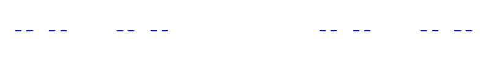
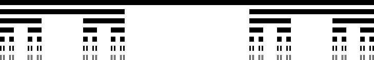

.. -*- coding: utf-8 -*-

Wstęp
=====

.. image:: http://upload.wikimedia.org/wikipedia/commons/thumb/5/5d/Mandelbrot_set_with_coloured_environment.png/320px-Mandelbrot_set_with_coloured_environment.png
    :align: center

*clouds are not spheres, mountains are not cones, coastlines are not circles, and bark is not smooth, nor does lightning travel in a straight line* 
 B. Mandelbrot, Fractal geometry of nature

Wiele rzeczywistych struktur, które można odnaleźć w otaczającym świecie ma niezwylke skomplikowaną budowę. Począwszy od lini wybrzeża Wielkiej Brytanii, przez norweskie Fiordy, kształty głowy kalafiora, chmur, formacji skalnych i kanionów, płatków śniegu, sposobu upakowania DNA w komórkach, czy wzorców widzianych przy fazie magnetycznej półprzewodników na poziomie kwantowym. W latach siedemdziesiątych poprzedniego wieku właśnie takie nieregularne zbiory badane były przez francuskiego matematyka  **Benoîta Mandelbrota** , który to nadał im wspólną nazwę  **fraktale** . Nazwa ta wywodzi się z łacińskiego  *fractus*  i oznacza cząstkowy, ułamkowy. Zainteresowanie fraktalami wzięło się z prostej obserwacji otaczającej rzeczywistości.

Do dziś nie powstała porządna teoria matematyczna opisująca właśnie takie struktury, choć znamy ich wiele, wiemy jakimi równaniami je opisywać i jak je charakterywzować. Aby fraktal był fraktalem powinien mieć nieregularną, poszarpaną stukturę niezależnie od skali. Z matematycznego punktu widzenia powinien

 - posiadać wymiar podobieństwa (wymiar fraktalny) większy od wymiaru topologicznego,

 - wykazywać samo\-niezmienniczość (samopodobność lub samoafiniczność).

To w zasadzie wszystko co można powiedzieć ściśle o fraktalach.

Wymiar podobieństwa
-------------------

Istnieje wiele możliwych definicji wymiaru fraktalnego. Najbardziej popularny jest wymiar Hausdorffa lub wymiar pudełkowy, ale zanim je podamy omówimy w ogólności czym różni się taki wymiar od zwykłego wymiaru topologicznego. Jeżeli obiekt zawiera :math:`N` kopii samego siebie o rozmiarze :math:`s`, to jego wymiar :math:`D` zdefiniowany jest jako

.. MATH::

    N s^D = 1.

Równanie to łatwo można przekształcić do bardziej znanej postaci.

.. code-block:: python

    sage: var('N s D')
    sage: eq1 = N*s^D == 1
    sage: eq2= solve(eq1, D)
    sage: D1 = eq2[0].rhs(); show(D1)

.. MATH::

    \frac{\log\left(\frac{1}{N}\right)}{\log\left(s\right)}

.. end of output

.. code-block:: python

    sage: #lub
    sage: D1b = D1.full_simplify(); show(D1b)

.. MATH::

    -\frac{\log\left(N\right)}{\log\left(s\right)}

.. end of output

Dostajemy ostatecznie

.. MATH::

    D = \frac{\log(\frac{1}{N})}{\log(s)} = -\frac{\log(N)}{\log(s)} = \frac{\log(N)}{\log(\frac{1}{s})}.

`Wymiar pudełkowy <http://pl.wikipedia.org/wiki/Wymiar_pude%C5%82kowy>`_  zasadniczo sprowdza się do tej samej definicji. Nieco bardziej formalną definicją posiada wymiar Hausdorffa.

Wymiar Hausdorffa
~~~~~~~~~~~~~~~~~

Niech :math:`s \gt 0`. Niech :math:`(X, d)` będzie przestrzenią metryczną. Dla dowolnego podzbioru :math:`E \subseteq X` określamy miarę zewnętrzną

.. MATH::

    H^s_\delta(E) = \inf\left\{\sum_{i=1}^\infty \operatorname{diam}(A_i)^s\right\},

gdzie infimum bierzemy po rodzinach zbiorów :math:`\{A_i\}_i`, które pokrywają :math:`E` i zawierają zbiory o średnicy mniejszej lub równej :math:`\delta`. Gdy :math:`\delta` maleje, to :math:`H^s_\delta(E)` rośnie. Zatem poniższa granica (skończona lub nie) istnieje i jest nazywana  **miarą Hausdorffa**  (dla wykładnika  *s* ):

.. MATH::

    H^s(E) = \lim_{\delta \to 0}~H^s_\delta(E).

**Wymiar Hausdorffa**  określa się wówczas jako

.. MATH::

    HD = \operatorname{dim}_H(E) = \inf \{s\colon H^s(E) = 0\} = \sup \{s\colon H^s(E) = \infty\}.

Samopodobność
-------------

...a właściwie samo\-niezmienniczość. Fraktal bowiem nie musi być identyczny lub nawet bardzo podoby do siebie po skalowaniu. Wiele fraktali budowane jest za pomocą  `przekształceń afinicznych <http://pl.wikipedia.org/wiki/Przekszta%C5%82cenie_afiniczne>`_ .

Konstrukcja fraktali
--------------------

Fraktale otrzymuje się iterując odpowienie przekształcenia. W geometrii fraktalnej mówimy o układach IFS (z ang.  *iterated function systems* ), zwanych też systemem funkcji iterowanych lub systemem kontrakcji iterowanych. Dzięki takim konstrukcjom otzrymujemy fraktale samopodobne. Typowym zastosowaniem IFS jest kompresja danych. Poniżej omówimy sobie najprostszą konstrukcję fraktala.

Zbiór Cantora
~~~~~~~~~~~~~

Jest to podzbiór zbioru liczb rzeczywistych z przedziału domkniętego :math:`[0,1]`. Podstawowa konstrukcję przeprowadza się w następujący sposób.

 #. Pierwszy krok iteracji: Bierzemy odcinek (zbiór liczb rzeczywistych) :math:`C_0 := [0,1]`.

 #. Drugi krok iteracji: Dzielimy go na trzy równe części :math:`[0, \frac{1}{3}], (\frac{1}{3}, \frac{2}{3}), [\frac{2}{3},1]` i usuwamy środkowy otwarty podzbiór, pozostawiając oba brzegowe, domknięte podzbiory. :math:`C_1 := [0, \frac{1}{3}] \cup [\frac{2}{3},1]`.

 #. Trzeci krok iteracji: Oba podzbiory :math:`C_1` dzielimy w taki sam sposób jak w kroku 2, usuwając ich środkowy, otwarty podzbiór, otrzymując :math:`C_2 := [0, \frac{1}{9}] \cup [\frac{2}{9},\frac{1}{3}] \cup [\frac{2}{3}, \frac{7}{9}] \cup [\frac{8}{9},1]`.

 #. :math:`\dots`

Do konstrukcji tego zbioru w Sage wykorzystamy listy oraz funkcje.

.. code-block:: python

    sage: # funkcja wycinająca środek przedziału, zwraca listę list zawierających oba końce przedziałów
    sage: def rem_middle(A=[0,1]):
    ...       a = [A[0], (A[1] - A[0])/3 + A[0], A[0] + 2*(A[1] - A[0])/3, A[1]]
    ...       out = []
    ...       for i in xrange(0,len(a),2):
    ...           out.append([a[i], a[i+1]])
    ...       return out
    sage: # funkcja wycinająca środek przedziałów z listy list
    sage: def rem_all_middle(A=[[0,1]]):
    ...       import numpy
    ...       out = []
    ...       for a in A:
    ...           out.append(rem_middle(a))
    ...       out = numpy.reshape(numpy.ravel(out), (-1,2))
    ...       return out.tolist()
    sage: #funkcja zwracająca zbiór Cantora n-tego rzędu
    sage: def cantor_set(n, C0=[0,1]):
    ...       """zwraca zbior Cantora"""
    ...       C = [C0]
    ...       for i in xrange(n):
    ...           C = rem_all_middle(C)
    ...       return C

.. end of output

IFS
---

Zbiór ten można wyrazić za pomocą IFS :math:`\{\textbf{R}: w_1, w_2\}`, co samo w sobie ułatwia konstrukcję :math:`n`-tego kroku podczas iteracji zbioru Cantora. W definicji

.. MATH::

    w_1 = \frac{1}{3} x, \quad w_2 = \frac{1}{3}x + \frac{2}{3}.

Definiujemy teraz przedział otwarty

.. MATH::

    I_{n,r} := ((3r-2)/3^n), (3r-1)/3^n)), \quad r = 1, 2, \dots, 3^{n-1}.

oraz

.. MATH::

    G_n := \bigcup_{r=1}^{3n-1} I_{n,r}, \quad G = \bigcup_{n=1}^{\infty} G_n.

Dostając ostatecznie definicję zbioru Cantora.

.. MATH::

    C = [0,1] \setminus G

**Zadanie 1** : napisz funkcję w Sage obliczającą zbiór Cantora w oparciu o podany powyżej IFS.

Należało by jeszcze narysować ów zbiór Cantora. W wizualizacji tkwi przecież piękno fraktali.

.. code-block:: python

    sage: def draw_cantor(A):
    ...       """rysuje n-ta iteracje zbioru Cantora"""
    ...       p = []
    ...       for a in A:
    ...           p.append(line([(a[0],1),(a[1],1)]))
    ...       return sum(p)

.. end of output

.. code-block:: python

    sage: show(draw_cantor(cantor_set(4)), figsize=[10,1], axes=False)

.. end of output

**Zadanie 2** . Ponieważ powyższa grafika nie wygląda zbyt okazale, spróbuj napisać funkcję rysującą m/w w poniższy sposób. Spróbuj też każdą iterację oznaczyć innym kolorem z dowolnej palety Sage.

Pójdźmy o krok dalej i spróbujmy wykorzystać to co daje nam pakiet Sage.

.. code-block:: python

    sage: @interact
    sage: def _(n=(0..5)):
    ...       html("Zbiór Cantora, krok iteracji: %d"%n)
    ...       show(draw_cantor(cantor_set(n)), figsize=[10,1], axes=False)

.. end of output

Oczywiście, o wiele lepiej będzie wykorzystać funkcję napisaną w ramach Zadania 2. Obliczymy teraz wymiar Hausdorffa dla zbioru Cantora. Wymiar topologiczny jest dla odcinka doskonale znany i wynosi zero. Aby obliczyć wymiar Hausdorffa posłużymy się pierwszą zaprezentowaną definicją wymiaru podobieństwa.

.. MATH::

     D = \frac{\log(N)}{\log(\frac{1}{s})}.

N oznacza ilość podobnych obiektów (figur) powstałych po jednym kroku iteracji. Najprościej zobaczyć to przechodząc z :math:`C_0` do :math:`C_1` (użyj np. pozyższej interakcji). Widzimy, że :math:`N = 2` (z jednego odcinka powstały 2 krótsze. Teraz :math:`1/s`, które mówi nam o stosunku długości nowopowstałych odcinków do odcinków pierwotnych

.. MATH::

    s = \frac{1}{3}

widzimy więc, że potrzebujemy minimum :math:`3` odcinków o długości :math:`1/3` aby wypełnić cały odcinek z poprzedniej iteracji (ten o długości 1). Możemy tak naprawdę użyć 4, 5 czy 112 odcinków o długości :math:`1/3` aby wypełnić odcinek jednostkowy, ale nas interesuje minimalna ich ilość. Teraz już prosto, wstawiamy dane do wzoru

.. code-block:: python

    sage: html("HD=$%s$"%latex(D1b))
    sage: html("Wymiar Hausdorffa zbioru Cantora wynosi HD=%.4f" % D1b(N=2, s=1/3).n())
    sage: html("spełnione jest zatem HD > 0")

.. end of output

| :math:`HD = - \frac{\log(N)}{\log(s)}`
| Wymiar Hausdorffa zbioru Cantora wynosi HD=0.6309
| spełnione jest zatem HD > 0

**Zadanie 3** . Spróbuj ominąć wykorzystanie pakietu  *numpy*  podczas konstrukcji powyższych funkcji.

**Zadanie 4** . Znacznie lepiej byłoby napisać od razu swoją własną klasę  *CantorSet* , w której zawarlibyśmy wszystkie zbudowane funkcje (wycinające środki zbiorów, rysujące fraktala...) oraz parametr trzymający wymiar fraktalny zbioru. Zbuduj taką klasę.

