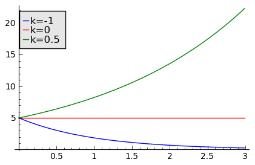
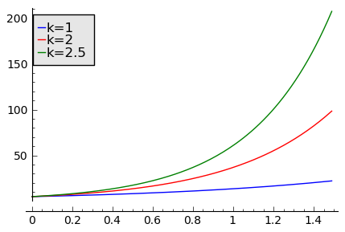
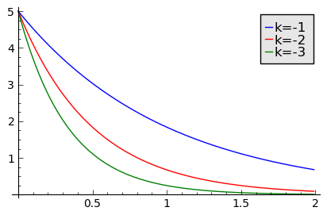
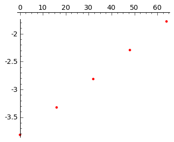
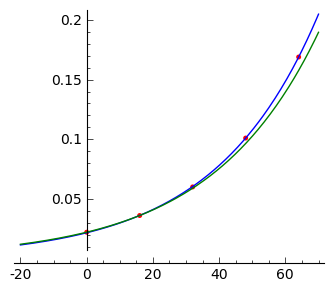
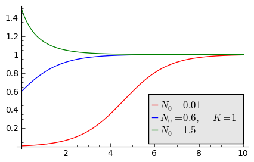
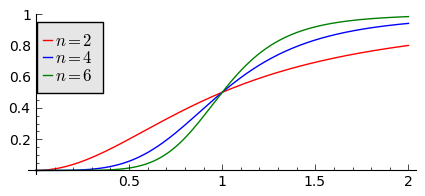
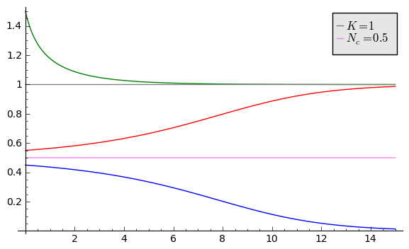

.. -*- coding: utf-8 -*-

Dynamika populacyjna: ciągłe modele jednowymiarowe
--------------------------------------------------

Model Malthusa
~~~~~~~~~~~~~~

W przyrodzie występuje wiele gatunków zwierząt i roślin. Ich
liczebność ciągle się zmienia: procesy są dynamiczne, powiązane między
sobą, oddziaływania są skomplikowane, często losowe. Można powiedzieć,
że jest to niewątpliwie przykład realnego układu złożonego z wielu
elementów połączonych z sobą w skomplikowaną sieć. Opis takich układów
jest trudny. Jak to często bywa w naukach przyrodniczych, stosuje się
opis przybliżony, "gruboziarnisty", pomija się elementy mniej istotne
i uwzględnia się najważniejsze składniki układu. Jest to metoda
*idealizacji* nagminnie stosowana przez fizyków do opisu
rzeczywistości. Historia pokazuje, że metoda ta nie jest zła. Ba,
czasami bardzo dobra i nawet znakomita. 

Podobne podejście zastosujemy do opisu dynamiki
populacyjnej. Zaczniemy od najprostszego modelu: jedna populacja. Może
to być populacja ludzi na określonym obszarze, populacja zajęcy,
bakterii czy populacja komórek nowotworowych. Może to być "populacja"
związku chemicznego (molekuł). Populację określa się liczbami
naturalnymi: jest 4 tys. ludzi, 3 mld bakterii, 10 :sup:`20`
molekuł. Posługiwanie się liczbami całkowitymi jest trudne w
modelowaniu. Postąpimy podobnie jak w opisie dynamiki płynów, np. wody
czy krwii. Woda w szklance składa się z dyskretnej liczby molekuł. Ale
nikt do charakterystyki wody nie stosuje opisu bazyjącego na liczbach
naturalnych.  Stosujemy *przybliżenie ośrodka ciągłego*
scharakteryzowanego gęstością wody: ilością molekuł w jednostkowej
objętości. Podobny opis zastosujemy w modelowaniu dynamiki
populacyjnej. Liczba N charakteryzująca liczbę osobników w populacji
będzie nieujemną liczbą rzeczywistą, interpretowaną jako względna
liczba osobników (liczba osobników w stosunku do np. średniej liczby
osobników w ostatnich 50 latach lub maksymalnej liczby osobników w
poprzednim roku, itp.). Liczba ta może zmieniać się w sposób
ciągły. Liczba N(t) będzie charakteryzować liczbę osobników populacji
w chwili czasu t.  Zmiana w czasie tej funkcji wynika z zastosowanego
modelu. 

Modele będziemy budować bazując na wiedzy z teorii funkcji i
obserwacjach otaczającego nas świata. Nie trzeba być wybitnym
matematykiem, żeby umieć zinterpretować różnicę dwóch prędkości
samochodu A i samochodu B gdy samochód A jedzie z prędkością 40 km/h,
a samochód B jedzie z prędkością 150 km/h. Wielkość, która mówi o
*tempie zmiany położenia w czasie* to pochodna położenia jako funkcji
czasu, czyli prędkość. To właśnie pochodna mówi nam, w jakim tempie
zmienia się dana wielkość. Jeżeli pochodna jest dodatnia, to funkcja
rośnie; gdy pochodna jest ujemna, to funkcja maleje. Oto niezbędna
wiedza, aby zacząć modelowanie.

Pierwszy krok modelowania: dlaczego zmienia się liczba osobników N(t)
w danej populacji?  Można wyróżnić trzy podstawowe procesy: ktoś się
rodzi, ktoś umiera, jeszcze inny "wyjeżdża", emigruje, opuszcza
populację, a jeszcze inny "przyjeżdża", imigruje. W języku matematyki
możemy to zapisać w postaci relacji:

.. MATH::

    \frac{dN(t)}{dt}= +\text{przyrost (narodziny)} - \text{ubytek (śmierć)}  \pm  \text{migracja}

(i) Lewa  strona  tej relacji opisuje tempo zmiany populacji: :math:`dN(t)/dt`

(ii) przyrost populacji wskutek urodzin nowych osobników jest  rosnącą funkcją :math:`f(N)`   liczby osobników :math:`N` w populacji: W populacji 1 mln rodzi się więcej osobników niż w populacji 50 tys. (jak można zaobserwować w ostatnich latach, w populacji ludzi nie musi to być prawdą).  Najprostszą funkcją jest funkcja liniowa:

.. MATH::

    f(N) = a N

gdzie współczynnik  :math:`a \gt 0`  nazywa się tempem rozmnażania (wzrostu)   populacji.

(iii)  ubytek  populacji  wskutek śmierci osobników  jest  rosnącą funkcją :math:`g(N)`   liczby osobników w populacji: W populacji 1 mln umiera  więcej osobników niż w populacji 50 tys.   Najprostszą funkcją jest funkcja liniowa:

.. MATH::

    g(N) = b N

gdzie współczynnik  :math:`b \gt 0` jest tempem śmiertelności (zaniku) populacji .

Pominiemy na obecnym etapie procesy migracji (zaczynamy od najprostszego modelu!).  Z powyższych rozważań wynika taki oto model:

.. MATH::

    \frac{dN(t)}{dt}= a N(t) - b N(t)  = (a-b) N(t) = k N(t), \quad \quad  k=a-b

Otrzymaliśmy liniowe równanie różniczkowe zwyczajne pierwszego rzędu. Aby otrzymać  jego jednoznaczne rozwiązanie, musimy jeszcze zadać warunek początkowy:  

.. MATH::

    N(0) = N_0

Jest to proste równanie różniczkowe, które można rozwiązać metodą rozdzielenia zmiennych:

.. MATH::

    N(t)= N_0  e^{kt}

Z rozwiązania tego wynika, że:

1. jeżeli  tempo rozmnażania  jest takie samo jak tempo śmiertelności, :math:`k=0` czyli :math:`a=b`,  to populacja utrzymuje sie na tym samym poziomie liczebności:  :math:`N(t) = N(0)`.

2. jeżeli  tempo rozmnażania  jest większe niż  tempo śmiertelności, :math:`k\gt 0` czyli :math:`a \gt b`, to populacja rozrasta się: :math:`N(t)  \gt  N(0)`.

3. jeżeli  tempo rozmnażania  jest  mniejsze niż  tempo śmiertelności, :math:`k\lt 0` czyli :math:`a \lt b`,   to liczba osobników w populacji maleje:  :math:`N(t)  \lt  N(0)`.

Powyższy model został zaproponowany przez Malthusa w 1798 roku. Wynika z niego eksponencjalnie szybkie  tempo wzrostu (gdy a>b) lub eksponencjalnie szybki zanik populacji (gdy a<b). Są takie przykłady,  dla których model Malthusa realizuje się w pewnych przedziałach czasu, w szczególności  w początkowych fazach wzrostu (np. wzrost kolonii bakterii w odpowiednich warunkach).

**Wykorzystanie Sage do analizy  modelu Malthusa**
""""""""""""""""""""""""""""""""""""""""""""""""""

**Rozwiązanie analityczne**

W SAGE można bardzo łatwo otrzymać postać analityczną rozwiązania równania Malthusa, patrz poniżej:

****

.. code-block:: python

    sage: var('t k')
    sage: #k=1
    sage: assume(t>0)
    sage: N = function('N',t)
    sage: row = N.diff()== k*N
    sage: rozw = desolve(row,N,ivar = t)
    sage: rozw

.. MATH::

    c e^{(kt)}

.. end of output

**Wykres pokazujący wzrost, brak zmian i zanik populacji w zależności od wartości parametru k=a-b**

.. code-block:: python

    sage: var('N1,N2,N3')
    sage: T = srange(0,3,0.01)
    sage: sol=desolve_odeint( vector([-N1, 0, 0.5*N3]), [5,5,5],T,[N1,N2,N3])## rozwiązania dla różnych wartości k=-1, 0, 0.5

    sage: line( zip ( T,sol[:,0]) ,figsize=(5, 3),legend_label="k=-1") +\
    ...    line( zip ( T,sol[:,1]) ,color='red',legend_label="k=0")+\
    ...    line( zip ( T,sol[:,2]) ,color='green',legend_label="k=0.5") ## pokazujemy rozwiązania dla różnych wartości k=-1, 0, 0.5

.. end of output

**Wykres pokazujący różne tempo wzrostu w zależności od wartości parametru k=a−b > 0**

.. code-block:: python

    sage: T1 = srange(0,1.5,0.01)
    sage: sol1=desolve_odeint( vector([N1, 2*N2, 2.5*N3]), [5,5,5],T1,[N1,N2,N3])
    sage: line( zip ( T1,sol1[:,0]) ,figsize=(5, 3),legend_label="k=1") +\
    ...    line( zip ( T1,sol1[:,1]) ,color='red',legend_label="k=2")+\
    ...    line( zip ( T1,sol1[:,2]) ,color='green',legend_label="k=2.5") ## pokazujemy rozwiązania dla dodatnich wartości k=1, 2, 2.5

.. end of output

**Wykres pokazujący różne tempo  zaniku populacji w zależności od wartości parametru k=a−b < 0**

.. code-block:: python

    sage: T2 = srange(0,2,0.01)
    sage: sol2=desolve_odeint( vector([-N1, -2*N2, -3*N3]), [5,5,5],T2,[N1,N2,N3])
    sage: line( zip ( T2,sol2[:,0]) ,figsize=(5,3),legend_label="k=-1") +\
    ...    line( zip ( T2,sol2[:,1]) ,color='red',legend_label="k=-2")+\
    ...    line( zip ( T2,sol2[:,2]) ,color='green',legend_label="k=-3") ## pokazujemy rozwiązania dla ujemnych wartości k=-1, -2, -3

.. end of output

**ZADANIE:**   Dane eksperymentalne  dotyczące wzrostu bakterii  *Vibrio natrigens*  są nastepujace (patrz http://mathinsight.org/bacteria_growth_initial_model)

    ===========  ================
     t  (min)       N (gęstość)
    ===========  ================
       0                0.022
      16                0.036
      32                0.060
      48                0.101
      64                0.169
    ===========  ================

Vibrio natrigens

Sprawdź, czy model Malthusa opisuje powyższy wzrost kolonii bakterii.
Oceń rzetelność tego modelu.

.. code-block:: python

    sage: t = [0 , 16 ,  32 , 48 , 64 ]
    sage: X = [0.022, 0.036,  0.060, 0.101,  0.169 ]

.. end of output

W modelu Malthusa, wzrost jest eksponencjalny. Więc w skali logarytmicznej otrzymujemy prostą:

:math:`y(t) = \ln N(t) = \ln N_0 + k t = c + k t`

Przedstawiamy  dane wzrostu bakterii na  skali logarytmicznej:

.. code-block:: python

    sage: point(zip(t,map(log,X)),color='red',figsize=4)

.. end of output

Z grubsza wygląda to na linię prostą. Aby to sprawdzić,  wykonamy procedurę dopasowania danych eksperymentalnych do krzywej: :math:`n(t) = c \; e^{ k t}`:

.. code-block:: python

    sage: var('x a b')
    sage: model(x) = c * exp(k * x )
    sage: fit = find_fit (zip(t,X), model, solution_dict=True,initial_guess=(.1,.1)) 
    sage: fit

.. MATH::

    \{k: 0.032184803220426876, c: 0.021538179879268291\}

.. end of output

Parametr :code:`initial_guess`  ustala punkt startowy dla rozpoczęcia iteracji procedury nieliniowej optymalizacji.

.. code-block:: python

    sage: fit2 = find_fit (zip(t[:2],X[:2]), model, solution_dict=True)
    sage: print fit2
    sage: plot( model(x).subs(fit), (x,-20,70))  + plot( model(x).subs(fit2), (x,-20,70),color='green')  + point(zip(t,X),color='red',figsize=4)

.. MATH::

    \{b: 0.030779780318612133, a: 0.021999999999999999\}

.. end of output

.. code-block:: python

    sage: log(0.036/0.022)/16

.. MATH::

    0.0307797803186121

.. end of output

Ostatnia liczba to wartość :math:`k` obliczona z danych dla wzrostu
bakterii. Jest on bardzo bliska wartości b obliczonej z dopasowania
danych do krzywej eksponencjalnej: :math:`n(t) = c \exp(k t)`. Stała
:math:`c` też jest bliska wartości :math:`0.022` z danych.

**ZADANIE:** W modelu Malthusa występują 2 parametry: a i b. W  rozwiązaniu pojawia się tylko różnica a\-b. Przeprowadzić dyskusję  dotyczącą bezwymiarowej postaci równania Malthusa. Ile istotnych  parametrów zawiera model Malthusa?

**ZADANIE:**   W roku 1960 liczba ludności wynosiła 3 mld. W roku  1970 \- 3.7 mld ludzi.  Zakładając, że zmiana populacji następuje zgodnie   z powyższym modelem Malthusa, oblicz  liczbę ludności w roku 1980.  Porównaj wynik modelu ze stanem faktycznym (skorzystaj z  danych  demograficznych zamieszczonych na stronie internetowej).

Model Verhulsta
~~~~~~~~~~~~~~~

Załóżmy, że w modelu Malthusa uwzględniamy tylko procesy urodzin i
pomijamy procesy śmierci, tzn. b=0. Wówczas populacja wzrasta w tempie
wykładniczym:

.. MATH::

     N(t)= N_0 e^{at}

co ilustruje powyższy rysunek dla przypadku k>0. Tak szybkie tempo
wzrostu może być obserwowane dla pewnych układów tylko w niewielkim
przedziale czasu.  W ogólności zbyt szybkie tempo wzrostu populacji
spowodowałoby zachwianie równowagi w przyrodzie. Na przykład w roku
1859 farmer Thomas Austin wypuścił w swoich włościach w Australii 24
króliki europejskie, licząc na to, że będzie mógł oddawać się
przyjemnościom polowania. Inni farmerzy podchwycili pomysł i
rzeczywiście - polować mogli wkrótce do woli. W roku 1869 królików w
Australii było już tyle, że odstrzeliwano ich dwa miliony rocznie, bez
żadnych widocznych ubytków w liczebności populacji. Króliki
zdewastowały przyrodę Australii. Pożerały roślinność, przez co wymarło
wiele gatunków australijskich ssaków. Udało się je wytępić dopiero w
latach pięćdziesiątych ostatniego stulecia, sprowadzając na wyspę
chorobę: myksomatozę. Wirus w ciągu dwóch lat zabił pół miliarda z
sześciuset milionów królików. Pozostałe króliki były na chorobę
odporne i ich liczebność znowu zaczęła wzrastać, dlatego w latach
dziewięćdziesiątych ludzie pognębili je kolejną plagą, zwaną chińskim
pomorem królików.

Z reguły nadmierny rozrost populacji na *ograniczonym* terenie
powoduje trudny dostęp do pożywienia i tempo wzrostu populacji zaczyna
spowalniać.  Model uwzględniający ten efekt ograniczonego dostępu do
pożywienia został po raz pierwszy zaproponowany przez Verhulsta w
roku 1838.  W modelu tym tempo wzrostu :math:`a` nie jest stałe, ale
zależy od stanu populacji:

.. MATH::

    a \to  a(N)

i równanie ewolucji przyjmuje postać:

.. MATH::

    \frac{dN}{dt} = a(N) \; N, \quad N(0)=N_0

Zależność funkcyjna :math:`a(N)` od :math:`N` powinna mieć następującą
własność: jeżeli populacja wzrasta, tempo wzrostu powinno
maleć. Oczywiście jest wiele funkcji o tej własności: to są funkcje
malejące. Verhulst zaproponował taką oto zależność:

.. MATH::

     a(N)= r \left[1- \frac{N}{K}\right]

gdzie :math:`r \gt 0` jest parametrem o podobnej interpretacji jak
parametr :math:`a` w modelu Malthusa (charakteryzuje tempo wzrostu)
oraz stała :math:`K \gt 0` charakteryzuje zasoby pożywienia i czasami
nazywa się pojemnością środowiska. Zauważmy, że stała :math:`K`
pojawia się w ilorazie :math:`N/K` i jest charakterystyczną liczbą
osobników :math:`K=N_c` w populacji.  Jeżeli :math:`N \gt K` to
:math:`a(N) \lt 0` i populacja maleje. Z kolei jeżeli :math:`N \lt K`
to :math:`a(N) \gt 0` i populacja rozrasta się.

Jak zmiana K wpływa na tempo wzrostu populacji? Jeżeli K rośnie to N/K
maleje. Z kolei to powoduje, że 1\-N/K rośnie, czyli a(N)
rośnie. Oznacza to, że tempo wzrostu rośnie i populacja rozrasta się
szybciej. Stąd wniosek: **Wzrost parametru K powoduje szybsze tempo
wzrostu populacji.**

Z powyższych rozważań otrzymujemy równanie ewolucji w postaci równania Verhulsta:

.. MATH::

    \frac{dN}{dt} = r \left[1- \frac{N}{K}\right]  N, \quad \quad N(0)=N_0

Równanie to zawiera 2 parametry: r oraz K. Natomiast istotne,
jakościowe a nie ilościowe własności układu nie zależą od tych
parametrów. Aby pokazać od ilu parametrów zależą własności układu,
należy przekształcić równanie Verhulsta do postaci bezwymiarowej. W
tym celu zdefiniujemy względną liczbę osobników w populacji

.. MATH::

    x= \frac{N}{K}

oraz bezwymiarowy czas

.. MATH::

    s=r t

W nowych zmiennych równanie Verhulsta przyjmuje postać:

.. MATH::

    \frac{dx}{ds} = f(x) = x[1-x], \quad x = x(s), \quad \quad x(0) = x_0 = \frac{1}{K} N(0)

Jak widać, w równaniu tym nie pojawiają się żadne parametry. Jest to istotne, gdyż  **własności układu nie zależą jakościowo od jakichkolwiek wartości r oraz K.**

**Zadanie**

Znaleźć stany stacjonarne układu i zbadać ich stabilność.

(i) :math:`f(x) =0`, tzn. :math:`x(1-x)=0`,

stąd otrzymujemy 2 stany stacjonarne :math:`x_1=0` oraz :math:`x_2=1`

(ii) ich stabilność: :math:`\lambda = f'(x) = 1- 2 x`,

czyli :math:`\lambda_1= f'(x_1) = 1 \gt  0` (niestabilny), :math:`\lambda_2= f'(x_2) =-1 \lt  0` (stabilny)

Ponieważ otrzymujemy jeden stabilny stan stacjonarny :math:`x=1`, wszystkie rozwiązania :math:`x(s)` z warunkiem początkowym :math:`x_0 \gt 0` dążą do tego stanu.

Gdy warunek początkowy :math:`x_0=0`  to rozwiązaniem jest :math:`x(s)=0`, ale dowolnie małe zaburzenie powoduje, że układ "wyskoczy" z tego stanu i zacznie ewoluować do stanu :math:`x=1`.

Powyższe równanie Verhulsta można rozwiązań analitycznie metodą separacji zmiennych:

.. MATH::

    \frac{dx}{x(1-x)} = ds  \quad \quad \mbox{lub równoważnie} \quad \quad \left[ \frac{1}{x} -\frac{1}{x-1}\right] dx = ds

Następnie całkujemy obustronnie:

.. MATH::

     \int_{x_0}^{ x(s)} \left[\frac{1}{x} -\frac{1}{x-1}\right] dx =  \int_0^{ s} ds

Końcowa postać rozwiązania to funkcja

.. MATH::

    x(s) = \frac{x_0 e^s}{1+ x_0(e^s -1)} = \frac{x_0}{x_0 + e^{-s}(1-x_0)}

Jeżeli :math:`x_0=0` to :math:`x(s)=0`. Jeżeli :math:`x_0 \gt 0` to :math:`x(s)` dąży do stanu stacjonarnego :math:`x_2=1`.

Chcemy teraz powrócić do "starych" zmiennych :math:`N=N(t)` oraz  czasu :math:`t`. Wstawiając :math:`x=N/K` oraz :math:`s=rt`  otrzymamy

.. MATH::

    N(t) = \frac{K N_0}{N_0 +(K-N_0)e^{-rt}}

Stabilnym stanem stacjonarnym jest stan :math:`x=1` czyli :math:`N=K`. Jest to charakterystyczna liczba osobników  jaka ustala się po długim czasie. W modelu Verhulsta obserwujemy nie eksponencjalny wzrost populacji, ale efekt nasycenia: przy danej dostępności populacji do pożywienia, ustala się stabilna liczba osobników  w populacji. Wynosi ona :math:`K`, czyli tyle co parametr :math:`K` w równaniu Verhulsta. Dlatego też model ten wydaje się być bardziej zbliżony do realnych warunków.

Na wykresie pokazano 3 charakterystyczne krzywe w zależności od warunku początkowego:

:math:`(A) \quad N_0  \in(0, K/2), \quad \quad N(t)  \quad\mbox{jest funkcją rosnącą do wartości K}`

:math:`(B) \quad N_0 \in [K/2, K), \quad \quad N(t)  \quad\mbox{jest funkcją rosnącą do wartości K}`

:math:`(C)  \quad N_0 \gt K, \quad \quad \quad \quad N(t) \quad \mbox{jest funkcją malejącą do wartości K}`

W przypadku  (A), krzywa ma kształt zdeformowanej litery S i dlatego nazywana jest czasami funkcją sigmoidalną (z j. ang. sigmoid function), popularna w zagadnieniach sztucznej inteligencji i sieciach neuronowych.

.. admonition:: **Poeksperymentuj z Sage**!

   Rozwiązanie rówania Velhulsta można otrzymać stosując system
   algebry komputerowej. Sage ma trochę problemów z uzyskaniem postaci
   jawnej rozwiązania (tzn. :math:`x(t)=...`), ale pomaga wykonanie
   radykalnego uproszczenia - `full_simplify()` na równaniu. 

.. sagecellserver::

   integrate(1/(x*(x-1)),x).show()

   var('t x0')
   x = function('x')(t)
   sol = desolve(diff(x,t) == x*(1-x),x,ics=[0,x0],ivar=t)
   show(sol)
   show( "postać jawna:")
   show( sol.full_simplify().solve(x) )

**Ewolucja czasowa populacji w modelu Verhulsta dla różnych warunków początkowych**

.. code-block:: python

    sage: var('n1, n2, n3, t, T4')
    sage: T4 = srange(0,3,0.01) ## uwaga: K=1
    sage: n1= 0.01*exp(t)/(1+0.01*(exp(t)-1))
    sage: n2= 0.6*exp(t)/(1+0.6*(exp(t)-1))
    sage: n3= 1.5*exp(t)/(1+1.5*(exp(t)-1))
    sage: p10=plot(n1,(t,0,10),figsize=(5,3),color='red', legend_label="$N_0=0.01$")
    sage: p20=plot(n2,(t,0,10),color='blue',legend_label="$N_0=0.6, \quad K=1$")
    sage: p30=plot(n3,(t,0,10),color='green',legend_label="$N_0=1.5$",gridlines=[[],[1]])
    sage: show(p10+p20+p30)

.. end of output

Uogólnienia modelu Verhulsta
~~~~~~~~~~~~~~~~~~~~~~~~~~~~

**(A) Model z funkcją Hilla (model Ludwiga)**

W modelu Verhulsta uwzględnia się pośrednio naturalny proces śmierci
poprzez wartości parametru :math:`r \gt 0`. Ale jest to sytuacja, gdy
w modelu Malthusa :math:`a \gt b`, czyli tempo urodzin jest większe od
tempa śmierci. Model ten można uogólnić na przypadek obecności
drapieżników, które zjadają osobników rozważanej populacji. Ponieważ w
procesie tym liczba osobników maleje wskutek śmierci spowodowanej
przez drapieżników, to w równaniu Verhulsta odzwierciedla to wyraz
ujemny :math:`F(N)`:

.. MATH::

    \frac{dN}{dt} = r \left[1- \frac{N}{K}\right]  N -F(N), \quad \quad N(0)=N_0

Funkcja :math:`F(N)` opisująca malenie populacji wskutek istnienia
drapieżników powinna spełniać następujące warunki:

(i) :math:`F(N=0)=0` - oznacza to tyle, że drapieżnik nie ma co zjadać
    gdy populacja jest zerowa, N=0.

(ii) dla dużych wartości N, funkcja :math:`F(N)` powinna się nasycać,
     to znaczy dążyć do stałej wartości gdy :math:`N\to
     \infty`. Oznacza to tyle, że drapieżnik może zjeść pewną
     maksymalną ale skończoną liczbę ofiar.

Gdy populacja jest zbyt mała, drapieżnik woli zmienić teren i poszukać
populację o większej liczbie osobników. W modelowaniu stosuje się
funkcję Hilla, znaną z kinetyki reakcji chemicznych w procesie
transkrypcji (proces syntezy RNA na matrycy DNA przez różne polimerazy
RNA, czyli przepisywanie informacji zawartej w DNA na RNA). Ma ona
postać:

.. MATH::

    F(N)= F_n(N)= \frac {BN^n}{A^n + N^n}, \quad n\gt 0

Poniżej pokazujemy jej kształt dla 3 wartości wykładnika :math:`n=2,
4, 6.` Przypadek :math:`n=2` był zastosowany do opisu populacji motyli
z rodziny zwójkowatych (Choristoneura occidentalis), które należą do
największych szkodników lasów amerykańskich i kanadyjskich.  Model
ten, czasami nazywany modelem Ludwiga , sformułowany jest przez
równanie:

.. MATH::

    \frac{dN}{dt} = r  \left[1- \frac{N}{K}\right] \, N -  \frac {BN^2}{A^2 + N^2}, \quad n \gt 0

Powyższe równanie i jego modyfikacje był i jest stosowany do opisu
różnorakich procesów: populacji motyli zjadanych przez ptaki, kinetyki
reakcji chemicznych, rozwoju komórek nowotworowych, itp. Model ten
wykazuje interesujące własności: mogą istnieć 3 stany stacjonarne, ale
możliwe są także 2 stany stacjonarne i wreszcie może istnieć tylko 1
stan stacjonarny.  Pojawiają się bifurkacje klina i nieciągłe
przejścia fazowe. Dokładna analiza tego modelu jest przedstawiona na
stronie internetowej iCSE: Przykład użycia metod iCSE: Zagadnienie
wzrostu komórki rakowej (https://sage2.icse.us.edu.pl/home/pub/184/)

**Funkcja Hilla dla 3 wartości wykładnika n.**

.. code-block:: python

    sage: var('F1, F2, F3, N, T5')
    sage: T5 = srange(0,3,0.01) ## uwaga: A=B=1
    sage: F1= N^2/(1+N^2)
    sage: F2= N^4/(1+N^4)
    sage: F3= N^6/(1+N^6) 
    sage: pl1=plot(F1,(N,0,2),figsize=(5,2),color='red', legend_label="$n=2$")
    sage: pl2=plot(F2,(N,0,2),color='blue',legend_label="$n=4$")
    sage: pl3=plot(F3,(N,0,2),color='green',legend_label="$n=6$")
    sage: show(pl1+pl2+pl3)

.. end of output

.. code-block:: python

    sage: var('F1, F2, F3, N, T5')
    sage: T5 = srange(0,3,0.01) ## uwaga: A=B=1
    sage: plts = []
    sage: c = ['red','blue','green']
    sage: for i,n in enumerate([2,4,6]):
    ...       F1= N^n/(1+N^n)
    ...       plts.append( plot(F1,(N,0,2),figsize=(5,2),color=c[i%3], legend_label="$n=%d$"%n) ) 
    sage: show(sum(plts))

.. end of output

**(B) Model opisujący efekt Alleego**

W 1931 r. W.C. Allee sformułował koncepcję wskazującą na istnienie
drugiego stabilnego stanu stacjonarnego, różnego od stanu
stacjonarnego N=K w modelu Verhulsta.  Allee wykazał, że przy niskich
liczebnościach i zagęszczeniach spada przyrost populacji.  Mniejsze
populacje są bardziej podatne na wymieranie (trudności w znalezieniu
partnera, zmniejszona zdolność do grupowej obrony przed drapieżnikami,
obniżona wydajność żerowania w grupie). Zgodnie z modelem Verhulsta
wzrost populacji jest hamowany tym silniej im bardziej populacja
zbliża się do stanu stacjonarnego N=K . Allee wykazał, ze istnieje
drugi punkt stacjonarny, który populacja osiąga podczas spadku
liczebności. Populacje, w których obserwujemy taki efekt, zmniejszają
swoją liczebność, jeśli spadnie ona poniżej pewnego progu. Obecnie
efekt Alleego oznacza każdy mechanizm, który prowadzi do zależności
między liczbą i/lub zagęszczeniem osobników w populacji a średnim
dostosowaniem osobnika.  Dobrym przykładem jest losowy rozkład płci,
który w małej populacji może prowadzić do zmniejszenia średniego
dostosowania poprzez mniejsze szanse na trafienie partnera.

Przykładem modelu uwzgledniajacego efekt Alleego jest zmodyfikowane
równanie Verhulsta:

.. MATH::

    \frac{dN}{dt} = r (N- N_c) \left[1- \frac{N}{K}\right] \;N

gdzie :math:`0 \lt N_c \lt K` jest tym drugim stanem stacjonarnym, o którym mówi Allee. Nie jest to jedyna modyfikacja. W literaturze mozna znaleźć inne modele, ale powyższy model jest najprostszy. W modelu tym istnieją 3 stany stacjonarne:

.. MATH::

    G(N)= r (N- N_c) \left[1- \frac{N}{K}\right] \;N  =\frac{r}{K}  (N- N_c) (K- N) \;N = 0, \\ \mbox{ stąd} \quad  N_1=0, \quad N_2=N_c, \quad N_3=K

Analiza stabilności:

.. MATH::

    G'(N)= \frac{r}{K} \left[(K-N) N -(N-N_c) N + (N-N_c) (K-N)\right]

.. MATH::

     \lambda_1= G'(N_1) =G'(0) = -K N_c \lt 0 \quad \mbox{(stabilny)}, \\ \lambda_2= G'(N_2) =G'(N_c) = (K-N_c)N_c \gt 0 \quad \mbox{(niestabilny)}, \\ \lambda_3= G'(N_3) =G'(K) = -K(K- N_c) \lt 0 \quad  \mbox{(stabilny)}

Otrzymujemy 2 stabilne stany stacjonarne: :math:`N=0` oraz :math:`N=K`. Stan :math:`N=N_c` jest stanem niestabilnym.

**Ewolucja czasowa populacji dla modelu Alleego w zależności od różnych warunków początkowych**  (dla :math:`K=1` oraz :math:`N_c=0.5`)

.. code-block:: python

    sage: var('x,y,z,Z,Y,t')
    sage: T0 = srange(0,15,0.01)
    sage: f11=x*(x-0.5)*(1-x)
    sage: f12=y*(y-0.5)*(1-y)
    sage: f13=z*(z-0.5)*(1-z)
    sage: f14=0
    sage: f15=0
    sage: sol5=desolve_odeint( vector([f11, f12, f13, 0, 0]), [0.45,0.55,1.5,0.5,1],T0,[x,y,z,Z,Y])
    sage: line( zip ( T0,sol5[:,0]) ,figsize=(7, 4)) +\
    ...    line( zip ( T0,sol5[:,1]) ,color='red')+\
    ...    line( zip ( T0,sol5[:,2]) ,color='green') +\
    ...    line( zip ( T0,sol5[:,4]) ,color='gray',legend_label="$K=1$") +\
    ...    line( zip ( T0,sol5[:,3]) ,color='violet',legend_label="$N_c=0.5$")

.. end of output

**Zadania**

Można łatwo zmodyfikować powyższy program i analizowac dowolne modele. Dwa poniższe zadania dają przykład możliwości wykorzystania Sage.

1.  Funkcja tempa wzrostu w modelu Verhuslta :math:`a(N)= r[1-N/K]` przypomina dwa pierwsze wyrazy w rozwinięciu funkcji eksponencjalnej:  
 
.. MATH::

    a_1(N) = r e^{-\frac{N}{K}} \approx r \left[ 1 - \frac{N}{K} + ...\right]

Zbadać własności dynamiki populacji z taką funkcją tempa wzrostu i porównań ze standardowym modelem  Verhulsta.

2. Zbadać własności modelu z funkcją Hilla dla różnych wartości wykładnika :math:`n = 1, 2, 4, ...` i porównać je.

