.. -*- coding: utf-8 -*-

Modele oddziałujących populacji: ofiara \- drapieżca
====================================================

Model Lotki\-Volterry
---------------------

W modelu tym rozważamy 2 populacje: populacja zwana "ofiary" i
populacja zwana "drapieżniki" lub drapieżcy. Osobniki jednej z nich
("ofiary") są (niestety) zjadane przez osobniki drugiej populacji
("drapieżniki").  "Ofiary" mogą rozmnażać się i umierać śmiercią
naturalaną. Ponadto "ofiary" giną śmiercią tragiczną zjadane przez
"drapieżników", które to rozmnażają się i umierają śmiercią naturalną
(niestety).

Populacja ofiar opisana jest funkcją :math:`N=N(t)`, natomiast
populacja drapieżników opisana jest funkcją :math:`P=P(t)`. Podobnie
jak w modelu Malthusa, tempo zmian w populacji ofiar i drapieżników
jest wynikiem urodzin i śmierci w populacji:

.. MATH::

    \frac{dN}{dt} = a N - b N

.. MATH::

    \frac{dP}{dt} = c P - e P

gdzie parametr :math:`a` charakteryzuje tempo urodzin ofiar, :math:`b`
charakteryzuje tempo śmierci ofiar, :math:`c` charakteryzuje tempo
urodzin drapieżników i :math:`e` charakteryzuje tempo śmierci
drapieżników.

Zakładamy, że tempo śmierci ofiar :math:`b` zależy od populacji
drapieżników: im więcej jest drapieżników :math:`P`, tym większe jest
tempo śmierci ofiar.  W prostym opisie oznacza to, że

.. MATH::

    b \to  b_0 P

gdzie :math:`b_0\gt 0` jest parametrem. Podobnie założymy, że tempo
urodzin drapieżników :math:`c` zależy od populacji ofiar: im więcej
jest ofiar :math:`N`, tym większe jest tempo urodzin drapieżników (im
więcej jest pożywienia tym szybciej rozrasta się populacja). Oznacza
to, że

.. MATH::

    c  \to  c_0 N

gdzie :math:`c_0 \gt 0`.  Przy takich założeniach model Malthusa zmienia się do postaci

.. MATH::

    \frac{dN}{dt} = a N - b_0 P N

.. MATH::

    \frac{dP}{dt} = c_0 N P - e P

Wszystkie parametry są dodatnie. Model ten wprowadził w
1926 r. V. Volterra do opisu populacji ryb. Natomiast w
1920 r. A. J. Lotka otrzymał podobne równania do opisu kinetyki
autokatalizy (patrz wykład o kinetyce reakcji chemicznych). Stąd model
ten nazywa się modelem Lotki\-Volterry. W modelu tym pojawiają się 4
parametry. Jak to często bywa, własności tego typu modeli zależą od
mniejszej ilości parametrów. Metodą na eliminację niektórych
parametrów jest wprowadzenie wielkości bezwymiarowych lub wielkości
przeskalowanych. W powyższym przypadku wprowadzimy następujące
przeskalowane i bezwymiarowe wielkości:

.. math::

   x=\frac{c_0}{e} N, \quad y =\frac{b_0}{a} P

oraz bezwymiarowy czas:

.. math:: 

   \tau = a t

Po wstawieniu tych wielkości do równań Lotki\-Volterry otrzymamy układ równań:

.. math:: 

	\dot x= x- x y

.. math:: 

	\dot y = \alpha (xy-y)

w którym pojawia się tylko jeden parametr :math:`\alpha = \frac{e}{a}
\gt 0`, który opisuje stosunek tempa śmierci drapieżników :math:`d` do
tempa urodzin ofiar :math:`r`.  Tak więc procedura przeskalowania
równań pozwoliła wyeliminować nieistotne parametry. Jedynym istotnym
parametrem jest tylko jeden parametr, a mianowicie :math:`\alpha`.
Własności rozwiązań w modelu Lotki-Volterry zależą tylko od tego
parametru i od warunków początkowych :math:`x(0)` i :math:`y(0)`.

**STANY STACJONARNE**

Stany stacjonarne wyznaczone sa przez równania:

.. MATH::

    f(x, y) = x- x y =0,  \quad g(x,y) = \alpha (xy - y) =0,

stąd otrzymujemy

.. MATH::

    (x_1=0, y_1=0) \quad \mbox{lub} \quad (x_2=1, y_2 =1)

**STABILNOŚĆ STANÓW STACJONARNYCH**

1. Wyznaczamy macierz Jacobiego

.. MATH::

    J = \begin{bmatrix}\frac{ \partial f}{\partial x}&  \frac{\partial f}{\partial y}\\ \frac{\partial g}{\partial x}&  \frac{\partial g}{\partial y}  \end{bmatrix}

w punktach stacjonarnych:

.. MATH::

    J_1= J(0, 0) = \begin{bmatrix}1& 0\\ 0& -\alpha \end{bmatrix}, \quad \quad  J_2= J(1, 1) = \begin{bmatrix}0& -1\\ \alpha& 0 \end{bmatrix}

 

2. Wyznaczamy wartości własne macierzy Jacobiego :math:`|J-\lambda I|=0`:

(a) dla :math:`(0, 0)` otrzymujemy: 
      :math:`\lambda_{01} = 1,\quad \lambda_{02} =- \alpha`. 
       Więc rozwiązanie to nie jest asymptotycznie stabilne, ponieważ
       jedna z wartości własnych jest dodatnia,
       tzn. :math:`\lambda_{01} \gt 0`. Dowolnie małe zaburzenie tego
       stanu spowoduje ucieczkę układu z tego stanu.

(b) dla :math:`(1, 1)` otrzymujemy: 
       :math:`\lambda_{11} = i \sqrt{\alpha}, \quad \lambda_{12} = -i\sqrt{\alpha}`.  
       Ponieważ wartości własne są urojone, to rozwiązanie jest
       stabilne, lecz nie jest asymptotycznie stabilne. Dowolnie małe
       zaburzenie tego stanu spowoduje powstanie stanu, który cały
       czas będzie w otoczeniu tego stanu :math:`(1, 1)`, ale do niego
       nie dąży. W pobliżu tego stany, trajektorie są periodyczne i
       krzywe fazowe powinny być zamknięte.

Znajdziemy teraz postać  krzywych fazowych. W tym celu podzielimy obustronnie przeskalowane równania Lotki\-Volterry:

.. MATH::

    \frac{dy}{dx}= \frac{\alpha y (x-1)}{x(1-y)}

Otrzymliśmy równanie różniczkowe pierwszego rzędu, które rozwiązujemy metodą rozdzielenia zmiennych:

.. MATH::

    \left(\frac{1}{y} - 1\right) \; dy = \alpha \left(1-\frac{1}{x}\right)\; dx

Obustronne całkowanie tego  równania daje następująca postać krzywych fazowych:

.. MATH::

    \mbox{ln} y -y = \alpha (x- \mbox{ln} x) - H_0

gdzie :math:`H_0` jest stałą całkowania.  Jej wartość określona jest przez warunki początkowe :math:`x_0` oraz :math:`y_0`, ale minimalna wartość jest dla  stanu stacjonarnego :math:`(1, 1)` i wynosi :math:`H_0 = 1+\alpha`. Poniżej przedstawiamy kilka krzywych fazowych  dla różnych wartości :math:`H_0`. Ponieważ równanie powyższe jest równaniem uwikłanym,  jego graficzną wizualizację  można bardzo łatwo otrzymać korzystając z SAGE w następujący sposób:

.. code-block:: python

    sage: (x,y)=var('x,y') ## alfa=2
    sage: p1=implicit_plot(2*x+y -2*ln(x) - ln(y) -5.5, (x,0, 4), (y, 0, 6), color="violet") 
    sage: p2=implicit_plot(2*x+y -2*ln(x) - ln(y) -5, (x,0, 4), (y, 0, 6), color="red")
    sage: p3=implicit_plot(2*x+y -2*ln(x) - ln(y) -4, (x,0, 4), (y, 0, 6), color="green",aspect_ratio=1/2)
    sage: show(p1+p2+p3,figsize=5)

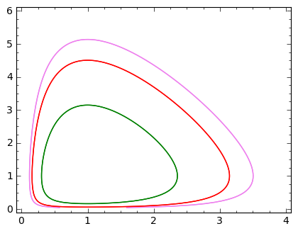

.. end of output

Po pierwsze, zauważamy że krzywe fazowe są zamknięte, więc z tego wynika, że rozwiązania są funkcjami periodycznymi czasu :math:`t`.  Po drugie, zauważamy że wzrost wartości stałej całkowania :math:`H_0` powoduje wzrost amplitud oscylacji czasowego przebiegu. Poniżej pokazujemy to explicite rozwiązując numerycznie równania Lotki-Volterry .

Ewolucja czasowa w Modelu Lotki\-Volterry
~~~~~~~~~~~~~~~~~~~~~~~~~~~~~~~~~~~~~~~~~

Przebieg czasowy rozwiązań równań Lotki\-Volterry można łatwo otrzymać korzystając z pakietu SAGE:

.. code-block:: python

    sage: var('x,y') ## warunek początkowy (x0, y0)=(1, 0.3)
    sage: a=2
    sage: T = srange(0,30,0.01)
    sage: sol=desolve_odeint(\
    ...    vector([x-x*y, a*(x*y-y)]),\
    ...    [1, 0.3],T,[x,y])
    sage: line( zip ( T,sol[:,0]) ,color='green',figsize=(6, 3), legend_label="x")+\
    ...    line( zip ( T,sol[:,1]) ,color='black',legend_label="y")

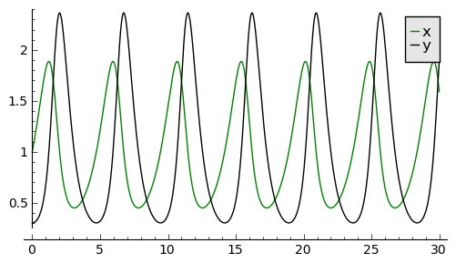

.. end of output

Zauważamy, że maksima w populacji drapieżców pojawiają się później niż maksima w populacji ofiar. Jest to dość jasna własność: drapieżniki mają dużo pożywienia i zjadają ofiary.  Łatwy dostęp do pożywienia powoduje szybkie rozmnażanie się drapieżników. Ale to z kolei powoduje, że szybko maleje populacja ofiar i drapieżniki mają utrudniony dostęp do pożywienia i dlatego ich liczba zaczyna maleć. Zmniejszenie się liczby drapieżników powoduje wzrost liczby ofiar. To z kolei powoduje zwiększone zasoby pożywienia dla drapieżników i ich populacja zaczyna wzrastać. I tak powtarza się cykl.

Możemy z powyższych  rozwiązań czasowych  otrzymać krzywą fazową jako punkty na płaszczyźnie o współrzędnych :math:`(x(t_i), y(t_i))` zmieniając czas od :math:`t_i=0` do jakiegoś :math:`t_i=t_{max}`.  W SAGE wygląda to tak prosto  jak poniżej:

.. code-block:: python

    sage: list_plot(sol.tolist(), plotjoined=1, figsize=(6, 3))

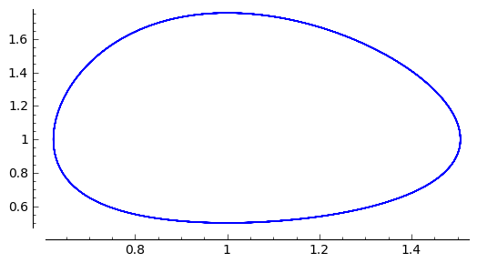

.. end of output

Jak wpływa parametr :math:`H_0` na okres oscylacji rozwiązań?   Poniżej pokazujemy wpływ warunków początkowych ( tzn. :math:`H_0`) na okres oscylacji.

Jeden warunek początkowy to :math:`(1, 0.8)  --\gt  H1`. Drugi warunek początkowy jest z powyższego przykładu:   :math:`(1, 0.3) --\gt  H2`.

.. code-block:: python

    sage: H1==2*(1-ln(1)) + 0.8 - ln(0.8)

.. MATH::

    H1 == 3.02314355131421

.. end of output

.. code-block:: python

    sage: H2==2*(1-ln(1)) + 0.3 - ln(0.3)

.. MATH::

    H2 == 3.50397280432594

.. end of output

.. code-block:: python

    sage: var('x,y')
    sage: a=2
    sage: T = srange(0,30,0.01)
    sage: solu=desolve_odeint(\
    ...    vector([x-x*y, a*(x*y-y)]),\
    ...    [1, 0.8],T,[x,y])
    sage: line( zip ( T,sol[:,0]) ,color='green',figsize=(6, 3),legend_label="$H_2$")+\
    ...    line( zip ( T,solu[:,0]) ,color='black',legend_label="$H_1<H_2$")

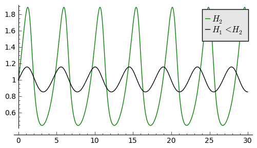

.. end of output

Rozwiązaniom tym odpowiadają krzywe fazowe przedstawione poniżej. Z tych dwóch  rysunków wnioskujemy, że gdy :math:`H_1 \lt  H_2` to amplituda oscylacji jest mniejsza i okres oscylacji jest mniejszy.  To odpowiada krzywym fazowym o mniejszym "obwodzie".

.. code-block:: python

    sage: list_plot(sol.tolist(), plotjoined=1,  color='green',figsize=(6, 3))+ list_plot(solu.tolist(), plotjoined=1,  color='black',figsize=(6, 3))

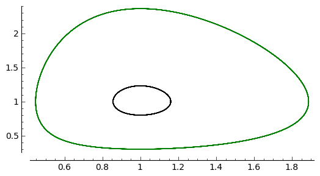

.. end of output

Bardziej realistyczny: Model Maya
---------------------------------

W modelu Lotki-Volterry występuje 1 stabilny punkt równowagi: gdy w chwili początkowej przeskalowane populacje :math:`x_0=1, y_0=1`  to w dowolnej innej chwili, liczba osobników w populacjach nie zmienia się. Natomiast drobne zaburzenia powodują odejście od tego stanu równowagi i pojawiają się oscylacje w obu populacjach. Jeżeli znowu zaburzymy układ, zmienią się także oscylacje, tzn.  ich amplituda i ich okres. Często obserwuje się inny rodzaj zachowania. Mimio, że układ zaburza się w niewielkim stopniu, układ powraca do swego poprzedniego stanu.  Mówimy, że układ jest strukturalnie stabilny. Tej własności nie posiada model Lotki-Volterry.  Przypomnijmy, że model Lotki-Volterry jest  w zasadzie 2-wymiarowym modelem Malthusa:

.. MATH::

    \frac{dN}{dt} = a N - b N

.. MATH::

    \frac{dP}{dt} = c P - e P

w którym procesy rozmnażania i śmierci  są modelowane w najprostszy sposób. My mamy jednak doświadczenie nabyte w uogólnianiu modelu Malthusa dla jednej populacji. Możemy teraz to wykorzystać i podobnie zmodyfikować model Lotki\-Volterry:

(A) w części dla populacji ofiar uwględniamy model Verhulsta i efekty nasycenia z modelu Ludwiga (w funkcją Hilla)

.. MATH::

    a=r\left(1-\frac{N}{K}\right), \quad \quad bN = b_0 \,\frac{N}{D+N} \;P

(B) w części dla populacji drapieżników uwzględniamy  model Verhulsta

.. MATH::

    c  = c_0 \left(1-\frac{P}{K_0} \right)

Dlatego w drugim równaniu otrzymamy

.. MATH::

    c P - e P  = c_0 \left(1-\frac{P}{K_0} \right)\;P - e P = (c_0 - e) P - c_0 \frac{P^2}{K_0} = s P \left(1- \frac{P}{K_1} \right)

Zakładamy, że :math:`s=c_0-e \gt  0`.  Przeskalowana stała :math:`K_1 = K_0 (1-e/c_0).`

Parametr :math:`K_1` modelujący zasoby pożywienia dla drapieżników jest proporcjonalny do liczby osobników ofiar :math:`K_1=h_0 N` (:math:`h_0 \gt  0` jest stałą proporcjonalności). Więc ostatecznie dostajemy

.. MATH::

    c = s \left(1- h \frac{P}{N}\right)

gdzie nowy parametr :math:`h=1/h_0`.

Uwzględniając powyższe wyrażenia w wyjściowym modelu Malthusa otrzymamy taki oto układ równań:

.. MATH::

    \frac{dN}{dt} = r \left(1-\frac{N}{K}\right) \; N- b_0 \frac{N}{D+N} \; P

.. MATH::

     \frac{dP}{dt} = s\left(1-h\frac{P}{N}\right)\; P

Wszystkie stałe w tym modelu przyjmują dodatnie wartości. Stałych tych jest aż 6: :math:`r, K, b_0, D, s, h`. Ile jest istotnych stałych w tym modelu? Musimy umiejętnie dokonać skalowania i wprowadzić wielkości bezwymiarowe. Znowu możemy wykorzystać doświadczenie nabyte w skalowaniu równania Verhulsta, tzn.

.. MATH::

    x= \frac{N}{K}

Wstawiając :math:`N=K x` to do wyrażenia w nawiasie w równaniu dla :math:`P` widzimy że  drugą zmienną należy skalować w taki oto sposób:

.. MATH::

    y= h\frac{P}{K}

Wówczas otrzymamy:

.. MATH::

     \frac{dx}{d\tau} = (1-x)\, x - \alpha  \frac{x y}{d+x}

.. MATH::

    \frac{dy}{d\tau} = \beta \left(1- \frac{y}{x}\right) y

gdzie  zdefiniowaliśmy  następujące bezwymiarowe wielkości:

.. MATH::

    \tau = r t, \quad \alpha = \frac{b_0}{h r}, \quad d = \frac{D}{K} , \quad \beta = \frac{s}{r}

W wyniku tagiego postepowania otrzymaliśmy układ równań różniczkowych z trzema parametrami. Bezwymiarowy czas skaluje się ze względu na tempo rozmnażania się ofiar. Parametr :math:`\beta` to relacja między tempem rozmnażania się drapieżników w stosunku do tempa rozmnażania się ofiar. Jeżeli :math:`\beta \lt 1` to tempo rozmnażania się drapieżników jest mniejsze niż tempo rozmnażania sie ofiar i dlatego populacja ofiar może przetrwać. Jeżeli  :math:`\beta \gt 1` to tempo rozmnażania się drapieżników jest większe niż  tempo rozmnażania sie ofiar i dlatego populacja ofiar może wyginąć. Ale ponieważ układ jest nieliniowy, to takie proste dywagacje nie muszą być prawidziwe. Sprawdzimy to dokładniej.

**STANY STACJONARNE**

Stany stacjonarne są określone przez równania:

.. MATH::

      (1-x)\, x - \alpha  \frac{x y}{d+x} = 0

.. MATH::

     \beta \left(1- \frac{y}{x}\right) y = 0

Jeden stan stacjonarny jest łatwo wyznaczyć:

.. MATH::

    x_0=1, \quad y_0 =0

(stan :math:`x=0` oczywiście  wykluczmy z rozważań, ponieważ gdy  nie ma ofiar  to i nie ma drapieżników).  Powyższy stan  to stan bez drapieżników, więc stan stacjonarny populacji ofiar jest taki jak w modelu Verhulsta. Czy ten stan jest stabilny?

Inne stany stacjonarne  są określone przez równania:

.. MATH::
   :label: OD1

     y=x , \quad \quad  (1-x)   - \alpha  \frac{ y}{d+x} = 0

Stąd otrzymujemy równanie dla :math:`x` w postaci

.. MATH::

     x^2 + (\alpha + d -1) x -d =0

Jest to równanie kwadratowe, ale należy brać pod uwagę tylko dodatnie  rozwiązania.  Wyróżnik

.. MATH::

    \Delta = (\alpha + d -1)^2 + 4d \gt  0

więc otrzymujemy drugi stan stacjonarny

.. MATH::

    x_1=  y_1 = \frac{1}{2} \left[- (\alpha + d -1) + \sqrt{\Delta}\right]

Zauważmy, że ten stan nie zależy od wartości parametru :math:`\beta`.

**STABILNOŚĆ STANÓW STACJONARNYCH**

1. Wyznaczamy macierz Jacobiego

.. MATH::

     \quad \quad \quad  J = \begin{bmatrix}\frac{ \partial  f}{\partial x}&  \frac{\partial  f}{\partial y}\\ \frac{\partial  g}{\partial x}&  \frac{\partial  g}{\partial y}  \end{bmatrix}  = \begin{bmatrix}1-2x-\alpha y \frac{d}{(x+d)^2}&  -\alpha \frac{x}{x+d} \\ \frac{\beta y^2}{x^2}&  \beta - \frac{2\beta y}{x}  \end{bmatrix}

2. Wyznaczamy wartości własne macierzy Jacobiego :math:`|J-\lambda I|=0`:

(a)    dla stanu stacjonarnego :math:`(1, 0)` otrzymujemy:

.. MATH::

     \quad \quad \quad  J(1, 0)  =  \begin{bmatrix}-1&  -  \frac{\alpha}{1+d} \\ 0&  \beta \end{bmatrix}

Stąd wartości własne :math:`\lambda_{1} = -1, \quad  \lambda_{2} = \beta`. Więc rozwiązanie to nie jest asymptotycznie  stabilne, ponieważ jedna z wartości własnych jest dodatnia, tzn.  :math:`\lambda_{2} \gt  0`. Dowolnie małe zaburzenie tego stanu spowoduje  ucieczkę układu z tego stanu.

(b)    dla  drugiego stanu analiza stabilności jest bardziej skomplikowana  ponieważ macierz Jacobiego jest postaci

.. MATH::

     \quad \quad \quad  J(x_1, y_1)  =  \begin{bmatrix}x_1\left[ \frac{\alpha x_1}{(x_1+d)^2} -1\right]&  -  \frac{\alpha x_1}{x_1+d} \\ \beta &  -\beta \end{bmatrix}

Aby otrzymać wyraz :math:`J_{11}` tej macierzy, wykorzystaliśmy równanie :eq:`OD1` na stan stacjonarny. Zamiast wyznaczyć wartości własne :math:`(\lambda_{1}, \lambda_{2})` tej macierzy, wystarczy sprawdzić, kiedy część rzeczywista wartości własnych jest ujemna (lub dodatnia).  Ponieważ macierz Jacobiego jest macierzą :math:`2 \times 2`, więc otrzymujemy równanie kwadratowe  dla :math:`\lambda`. Aby wartości własne miały część rzeczywistą ujemną muszą zachodzić dwie relacje:

.. MATH::

     \lambda_1 + \lambda_2 \lt 0  \quad \mbox{oraz} \quad \lambda_1 \; \lambda_2 \gt  0, \quad \quad \mbox{to oznacza, że} \quad \mbox{Tr} \, J \lt  0, \quad \quad \mbox{det} \,J \gt  0

**ZADANIE:**
  Udowodnić, że  dla dowolnych (dodatnich) wartości parametrów :math:`\alpha, \beta,  d`, drugi warunek  :math:`\mbox{det} \,J \gt  0` jest zawsze spełniony.

Pierwszy warunek na stabilność stanu stacjonarnego :math:`(x_1, y_1)` przyjmuje postać:

.. MATH::

     b \gt  x_1\left[ \frac{\alpha x_1}{(x_1+d)^2} -1\right] = \phi (\alpha, d)

Ponieważ :math:`x_1` zależy od 2 parametrów :math:`\alpha` i :math:`d`, prawa strona przedstawia równanie powierzchni w 3-wymiarowej przestrzeni.

****

.. code-block:: python

    sage: var('a b d x y')
    sage: ode_lotka=[x*(1-x)-(a*x*y)/(x+d),b*y*(1-y/x)];
    sage: show(ode_lotka)

.. MATH::

    \left[-{\left(x - 1\right)} x - \frac{a x y}{d + x}, -{\left(\frac{y}{x} - 1\right)} b y\right]

.. end of output

.. code-block:: python

    sage: y_z_pierwszego=solve(ode_lotka[0],y,solution_dict=True)[0]
    sage: drugie=ode_lotka[1].subs(y_z_pierwszego)
    sage: show(drugie)
    sage: show(solve(drugie,x,solution_dict=True)[0])
    sage: x_0=x.subs(solve(drugie,x,solution_dict=True)[1])
    sage: y_0=y_z_pierwszego[y].subs({x:x_0}).expand()
    sage: show(x_0)
    sage: show( y_0 )

.. MATH::

    -\frac{{\left(\frac{{\left(d - 1\right)} x + x^{2} - d}{a x} + 1\right)} {\left({\left(d - 1\right)} x + x^{2} - d\right)} b}{a}

.. MATH::

    \left\{x : -\frac{1}{2} \, a - \frac{1}{2} \, d - \frac{1}{2} \, \sqrt{2 \, {\left(a + 1\right)} d + a^{2} + d^{2} - 2 \, a + 1} + \frac{1}{2}\right\}

.. MATH::

    -\frac{1}{2} \, a - \frac{1}{2} \, d + \frac{1}{2} \, \sqrt{2 \, {\left(a + 1\right)} d + a^{2} + d^{2} - 2 \, a + 1} + \frac{1}{2}

.. MATH::

    -\frac{1}{2} \, a - \frac{1}{2} \, d + \frac{1}{2} \, \sqrt{a^{2} + 2 \, a d + d^{2} - 2 \, a + 2 \, d + 1} + \frac{1}{2}

.. end of output

.. code-block:: python

    sage: ode_lotka[0].diff(x).show()

.. MATH::

    -\frac{a y}{d + x} + \frac{a x y}{{\left(d + x\right)}^{2}} - 2 \, x + 1

.. end of output

.. code-block:: python

    sage: JJ=jacobian(ode_lotka,[x,y])
    sage: show(JJ)

.. MATH::

    \left(\begin{array}{rr}
    -\frac{a y}{d + x} + \frac{a x y}{{\left(d + x\right)}^{2}} - 2 \, x + 1 & -\frac{a x}{d + x} \\
    \frac{b y^{2}}{x^{2}} & -{\left(\frac{y}{x} - 1\right)} b - \frac{b y}{x}
    \end{array}\right)

.. end of output

.. code-block:: python

    sage: #mamy x0=y0 ;-) 
    sage: var('x0')
    sage: JJ0=JJ.subs({x:x0,y:x0})

.. end of output

.. code-block:: python

    sage: show(JJ0)

.. MATH::

    \left(\begin{array}{rr}
    -\frac{a x_{0}}{d + x_{0}} + \frac{a x_{0}^{2}}{{\left(d + x_{0}\right)}^{2}} - 2 \, x_{0} + 1 & -\frac{a x_{0}}{d + x_{0}} \\
    b & -b
    \end{array}\right)

.. end of output

.. code-block:: python

    sage: show(JJ0.trace())

.. MATH::

    -\frac{a x_{0}}{d + x_{0}} + \frac{a x_{0}^{2}}{{\left(d + x_{0}\right)}^{2}} - b - 2 \, x_{0} + 1

.. end of output

.. MATH::

     b = x_1\left[ \frac{\alpha x_1}{(x_1+d)^2} -1\right]

.. code-block:: python

    sage: expr_murray = x0*(a*x0/(x0-d)^2-1)
    sage: expr_murray.show()

.. MATH::

    {\left(\frac{a x_{0}}{{\left(d - x_{0}\right)}^{2}} - 1\right)} x_{0}

.. end of output

.. code-block:: python

    sage: show( JJ0.trace().subs({x0:x_0})+b )

.. MATH::

    -\frac{{\left(a + d - \sqrt{2 \, {\left(a + 1\right)} d + a^{2} + d^{2} - 2 \, a + 1} - 1\right)} a}{a - d - \sqrt{2 \, {\left(a + 1\right)} d + a^{2} + d^{2} - 2 \, a + 1} - 1} \\ + \frac{{\left(a + d - \sqrt{2 \, {\left(a + 1\right)} d + a^{2} + d^{2} - 2 \, a + 1} - 1\right)}^{2} a}{{\left(a - d - \sqrt{2 \, {\left(a + 1\right)} d + a^{2} + d^{2} - 2 \, a + 1} - 1\right)}^{2}} \\ + a + d - \sqrt{2 \, {\left(a + 1\right)} d + a^{2} + d^{2} - 2 \, a + 1}

.. end of output

.. code-block:: python

    sage: p={a:1.23,d:1.01}
    sage: show( JJ0.trace().subs({x0:x_0}).subs(p) )
    sage: expr_murray.subs({x0:x_0}).subs(p)

.. end of output

.. MATH::

    -b - 0.404054289657954 \\
    1.35696399470668

.. end of output

.. sagecellserver::

    var('a,d,b,x,y,t')
    ode_lotka=[x*(1-x)-(a*x*y)/(x+d),b*y*(1-y/x)];
    # Murray eq. 3.28
    f(a,d)=(a-sqrt(  (1-a-d)^2+4*d) )*(1+a+d-sqrt((1-a-d)^2+4*d))/(2*a)
    @interact
    def myf(a_in = slider(0,2,0.01,default=1.0),b_in = slider(0,2,0.01,default=0.1),d_in = slider(0,2,0.01,default=0.1) ):
        p={a:a_in,d:d_in,b:b_in}
        ode_lotka_num=[i.subs(p) for i in ode_lotka]
        pkt_osob=solve(ode_lotka_num,x,y, solution_dict=True)
        x_osobliwy,y_osobliwy=0,0
        plt_pkt=[]
        for n_pkt,pkt in enumerate(pkt_osob): 
           x_osobliwy,y_osobliwy=pkt[x].n(),pkt[y].n()
           plt_pkt.append(point([x_osobliwy,y_osobliwy],size=30,color='red') )
           JJ=jacobian(ode_lotka_num,[x,y])
           JJ0=JJ.subs({x:x_osobliwy+1e-8,y:y_osobliwy+1e-8})
           print( n_pkt+1,":",x_osobliwy.n(digits=3),y_osobliwy.n(digits=3),vector(JJ0.eigenvalues()).n(digits=3) )
           if pkt[x]>0 and pkt[y]>0 : 
               print( "Czy pkt. jest stabilny?",bool(b_in>f(a_in,d_in)) )
        plt1 = plot_vector_field(vector(ode_lotka_num)/vector(ode_lotka_num).norm(),(x,-0.1,2),(y,-0.1,2))
        # plt2a = implicit_plot(ode_lotka_num[0],(x,-0.10,2),(y,-0.10,2),color='green')
        plt2a = plot(solve(ode_lotka_num[0],y)[0].rhs(),(x,-0.10,2),ymin=-0.10,ymax=2,color='green')
        show(ode_lotka_num)
        plt2b = implicit_plot(ode_lotka_num[1],(x,-0.10,2),(y,-.010,2),color='blue',xmin=-0.03)
        
        T = srange(0,123,0.1)
        sol1=desolve_odeint(vector(ode_lotka_num), [0.82,0.85], T, [x,y])
        plt_solution = list_plot(sol1.tolist(), plotjoined=True,color='brown')
        
        show(sum(plt_pkt)+plt1+plt2a+plt2b+plt_solution)

.. end of output

.. code-block:: python

    sage: var('a,d')
    sage: f(a,d)=(a-sqrt(  (1-a-d)^2+4*d) )*(1+a+d-sqrt((1-a-d)^2+4*d))/(2*a)
    sage: show(f)
    sage: implicit_plot( f(a,d),(d,0,.61),(a,0,2),aspect_ratio=0.3,  figsize=(6, 3), axes_labels=[r'$d$','$a$'] )

.. MATH::

    \left( a, d \right) \ {\mapsto} \ \frac{{\left(a - \sqrt{{\left(a + d - 1\right)}^{2} + 4 \, d}\right)} {\left(a + d - \sqrt{{\left(a + d - 1\right)}^{2} + 4 \, d} + 1\right)}}{2 \, a}

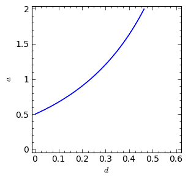

.. end of output

Pod tą płaszczyzną

.. MATH::

     b = x_1\left[ \frac{\alpha x_1}{(x_1+d)^2} -1\right] = \phi (\alpha, d)

mamy cykl graniczny:

.. code-block:: python

    sage: assume(a>0)
    sage: sol1=solve(f(a,d)==0, d) 
    sage: show(sol1)
    sage: dm_expr=sol1[1].rhs()
    sage: import sympy
    sage: import numpy as np
    sage: b2=np.vectorize( sympy.lambdify((a,d), sympy.sympify( f(a,d)  ) ) )
    sage: bm=np.vectorize( sympy.lambdify(a,    sympy.sympify( f(a,0)  ) ) )
    sage: dm=np.vectorize( sympy.lambdify(a,    sympy.sympify( dm_expr ) ) )
    sage: from mpl_toolkits.mplot3d import Axes3D
    sage: import matplotlib
    sage: from matplotlib import cm
    sage: from matplotlib import pyplot as plt
    sage: step = 0.04
    sage: maxval = 1.0
    sage: fig = plt.figure()
    sage: ax = fig.add_subplot(111, projection='3d',azim=134)
    sage: x = np.linspace(0.5,6,115)
    sage: y = np.linspace(0.00,1.,35)
    sage: X,Y = np.meshgrid(x,y)
    sage: # transform them to cartesian system
    sage: X,Y = X,Y*(np.sqrt(X**2+4*X)-(1.0+X))
    sage: #Y[:,i((X[7,0]**2+4*X[7,0])**0.5 - (1+X[7,0]) )
    sage: #0.99*d(:,i)*((a1.^2+4.*a1)^0.5 - (1+a1) )
    sage: Z = b2(X,Y)
    sage: ax.plot_surface(X, Y, Z, rstride=2, cstride=2, cmap=cm.jet)
    sage: #ax.plot_surface(X, Y, Z,  cmap=cm.jet)
    sage: #ax.plot_wireframe(X, Y, Z)
    sage: ax.set_zlim3d(0, 1)
    sage: ax.set_xlim3d(0, 3)
    sage: ax.set_ylim3d(0, .7)
    sage: ax.set_xlabel(r'$a$')
    sage: ax.set_ylabel(r'$d$')
    sage: ax.set_zlabel(r'$b(a,d)$')
    sage: ax.plot(x, dm(x), np.zeros_like(x), color=(.6,.1,.92),linewidth=3)
    sage: ax.plot(x,np.zeros_like(x), bm(x),  color='red',linewidth=3)
    sage: ax.plot([0],[0],[0])
    sage: ax.view_init(elev=35, azim=134)
    sage: plt.savefig("1.png")

.. MATH::

    \left[d = -\sqrt{a + 4} \sqrt{a} - a - 1, d = \sqrt{a + 4} \sqrt{a} - a - 1, d = -a + \sqrt{2 \, {\left(a + 1\right)} d + a^{2} + d^{2} - 2 \, a + 1} - 1\right]

.. end of output

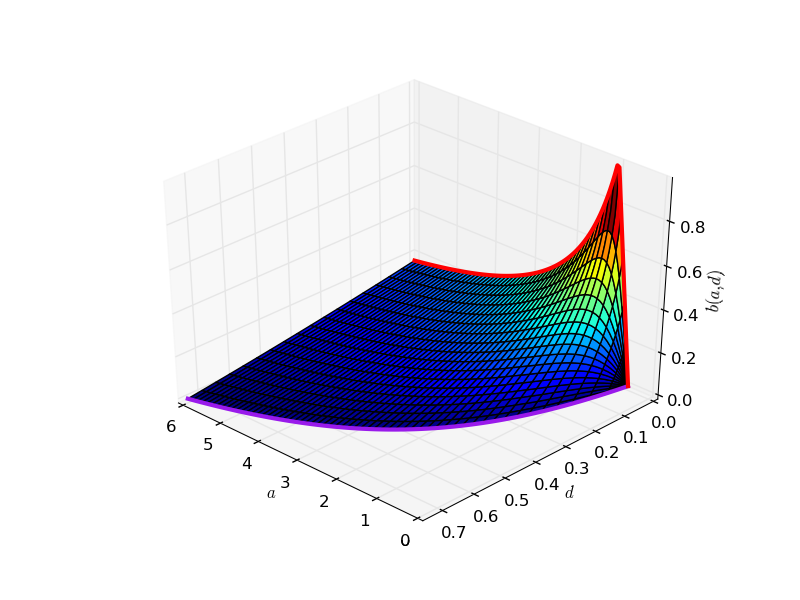

**Rozwiązania dążące do stabilnego stanu stacjonarnego:**  :math:`a \in (0, 0.5), \beta \gt  0, d \gt 0`

.. code-block:: python

    sage: var('x,y')
    sage: a, b, d = 0.3, 0.35, 0.1
    sage: T = srange(0,30,0.01)
    sage: sol2=desolve_odeint(\
    ...    vector([x*(1-x) - (a*x*y/(x+d)), b*y*(1-y/x)]),\
    ...    [0.2, 0.5],T,[x,y])
    sage: line( zip ( T,sol2[:,0]) ,color='green', figsize=(6, 3), legend_label="x")+\
    ...    line( zip ( T,sol2[:,1]) ,color='black',legend_label="y")

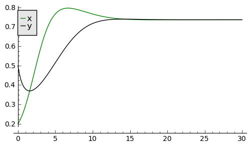

.. end of output

.. code-block:: python

    sage: a, b, d = 0.3, 0.35, 0.1
    sage: F(x,y)=x*(1-x) - a*x*y/(x+d)
    sage: G(x,y)= b*y*(1-y/x)
    sage: T = srange(0,30,0.01)
    sage: sol1=desolve_odeint(vector([F,G]), [0.2,0.5], T, [x,y])
    sage: list_plot(sol1.tolist(), plotjoined=1,  figsize=(6, 3))

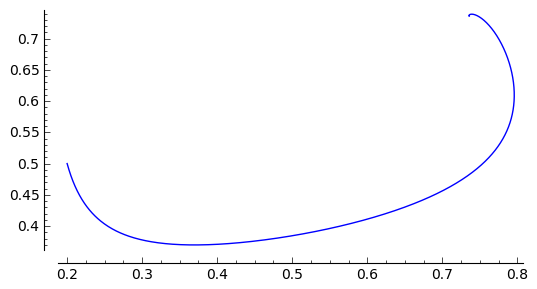

.. end of output

**Rozwiązania dążące do stabilnego cyklu granicznego:**  :math:`a \gt  0.5 , \beta \gt  0, d \gt 0`

.. code-block:: python

    sage: var('x,y')
    sage: a, b, d = 1.3, 0.33, 0.1
    sage: T = srange(0,200,0.01)
    sage: sol2=desolve_odeint(\
    ...    vector([x*(1-x) - (a*x*y/(x+d)), b*y*(1-y/x)]),\
    ...    [0.2, 0.5],T,[x,y])
    sage: line( zip ( T,sol2[:,0]) ,color='green', figsize=(6, 3), legend_label="x")+\
    ...    line( zip ( T,sol2[:,1]) ,color='black',legend_label="y")

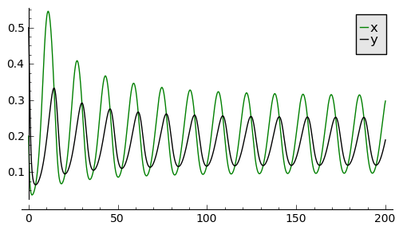

.. end of output

.. code-block:: python

    sage: a, b, d = 1.3, 0.33, 0.1
    sage: F(x,y)=x*(1-x) - a*x*y/(x+d)
    sage: G(x,y)= b*y*(1-y/x)
    sage: T = srange(0,250,0.01)
    sage: sol1=desolve_odeint(vector([F,G]), [0.2,0.5], T, [x,y])
    sage: list_plot(sol1.tolist(), plotjoined=1,  figsize=(6, 3))

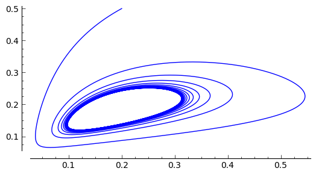

.. end of output

