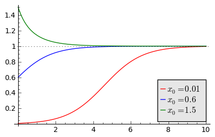
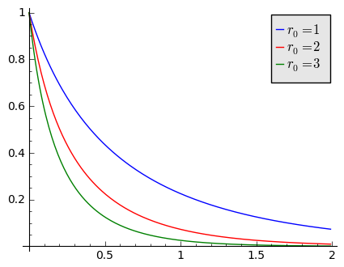
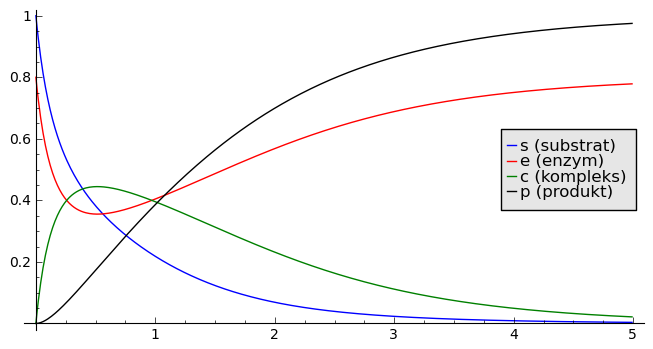
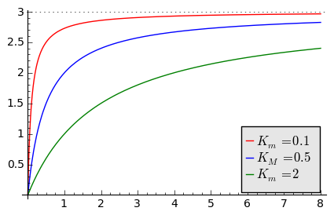

.. -*- coding: utf-8 -*-

Kinetyka reakcji chemicznych
============================

Kinetyka zajmuje się przewidywaniem zmian stężeń substratów i produktów reakcji chemicznych w czasie, badaniem szybkości reakcji,  wpływu rozmaitych czynników na tę szybkość i ogólnie przebiegiem całej  reakcji. W reakcji chemicznej zachodzi przemiana jednej lub kilku wyjściowych substancji (substratów) w jedną lub kilka innych substancji (produkty). Zarówno substraty jak i produkty mogą występować w formie cząsteczkowej, atomowej, jonowej lub rodnikowej. Zbadanie danej reakcji od strony kinetycznej polega zazwyczaj  na ustaleniu zależności tempa powstawania produktów (i ubytku  substratów) od  różnych czynników takich jak np.  rodzaju i stężenia katalizatora,  wyjściowych proporcji substratów. Uzyskane dane mogą pozwolić na wyznaczenie stałych szybkości reakcji i sformułowanie matematycznego równania kinetycznego reakcji oraz na ustalenie mechanizmu reakcji.  **Równanie kinetyczne**  to zazwyczaj równanie różniczkowe opisujące  zmiany stężenia molowego reagentów w czasie zachodzenia reakcji chemicznej.  Konstrukcja takich równań bazuje w głównej mierze na prawie działania mas, zwane także  **prawem Guldberga i Waagego**  \- wyprowadzone w 1864 r. przez norweskich chemików Guldberga i Waagego. Można je sformułować w następujący sposób:

*Szybkość reakcji chemicznej jest proporcjonalna do iloczynu stężeń składników  wszystkich uczestniczących w niej reagentów.*

Jest to fundamentalne prawo, stanowiące podstawę współczesnej kinetyki chemicznej i wszelkich obliczeń uwzględniających fakt występowania równowagi reakcji chemicznych.

Prawo to na poziomie molekularnym wynika z faktu, że szybkość reakcji zależy od liczby efektywnych zderzeń reagujących ze sobą indywiduów chemicznych w jednostce czasu. Fundamentem prawa działania mas jest przyjęcie  założenia, że prawdopodobieństwo efektywnego zderzenia się reagujących  indywiduów chemicznych nie zależy od tego, co działo się z nimi  wcześniej, lecz wyłącznie od ich liczby w jednostce objętości i średniej  energii kinetycznej ich ruchu.

Efektywne stężenie nie zawsze odpowiada prostemu stężeniu molowemu danej substancji, ze względu na to, że różne czynniki środowiskowe  powodują obniżenie ruchliwości reagujących cząsteczek. Stąd czasami, gdy  w równaniach równowagi chemicznej stosuje się zwykłe stężenia molowe, można obserwować pozorne odstępstwa  od prawa działania mas. Problem ten znika, gdy zamiast stężenia  podstawi się do odpowiednich równań odpowiednie aktywności reagentów.

Jak budować równania kinetyczne?  Poniżej podamy kilka przykładów, na podstawie których powinniśmy zrozumieć istotę modelowania kinetyki.

Jako pierwszy przykład, rozważamy reakcję:

.. MATH::

    A  + X \overset{ k_1} {\underset {k_2} \longleftrightarrow}  B

Mamy dwa składniki :math:`A` i :math:`X`,  które  reagują z szybkością  :math:`k_1` i tworzą cząsteczkę  :math:`B`.  Cząsteczka ta może rozpaść się  z szybkością :math:`k_2` na na dwie cząsteczki :math:`A` i :math:`X`.  Oznaczymy stężenia (koncentracje, aktywności molowe)  wszystkich trzech substancji za pomocą odpowiednich małych liter :

.. MATH::

    [A]=a, \quad [X]=x, \quad [B]=b

gdzie np.  :math:`[A]` oznacza stężenie  substancji :math:`A`.  Tempo zmian dowolnej funkcji opisywane jest pochodną funkcji. Przypominamy, że:

(i) jeżeli funkcja rośnie to jej pochodna jest dodatnia

(ii) jeżeli funkcja maleje to jej pochodna jest ujemna.

Tak więc tempo zmian stężenia substancji :math:`A` to

.. MATH::

    \frac{d a}{dt}

Zgodnie z prawem działania mas, tempo tych zmian (czyli szybkość zmian) jest proporcjonalna do iloczynu koncentracji substancji, przy czym: jeżeli substancji :math:`A` przybywa to jest to zmiana ze znakiem dodatnim (stężenie rośnie);  jeżeli substancji :math:`A` ubywa to jest to zmiana ze znakiem ujemnym (stężenie maleje). Oznacza to, że dla powyższej reakcji otrzymujemy następujące równania kinetyki:

.. MATH::

    \frac{d a}{dt} = -k_1 a x + k_2 b, \quad \quad \frac{d x}{dt} = -k_1 a x + k_2 b, \quad \quad \frac{d b}{dt} = k_1 a x  - k_2 b

Rozpatrzmy pierwsze z tych równań. Zmiana stężenie substancji :math:`A` następuje z dwóch powodów:

1. substancji :math:`A` ubywa  w  tempie  :math:`k_1`, przy czym ubytek jest tam, gdzie są dwie substancje: :math:`A` oraz :math:`X`. Dlatego też pojawia się iloczyn dwóch stężeń: :math:`a` oraz :math:`x` i dlatego pojawia się wyraz :math:`-k_1 a x`

2. substancji :math:`A` przybywa  w tempie :math:`k_2`, przy czym powstaje ona z substancji :math:`B`. Stąd wyraz :math:`+k_2 b`.

Podobnie otrzymujemy pozostałe dwa równania.

Reakcje autokatalityczne
------------------------

Reakcje autokatalityczne to takie reakcje, w których jeden z substratów jest także produktem i pełni on rolę katalizatora (w trakcie procesów z udziałem katalizatora reakcja chemiczna przebiega  drogą o energii mniejszej w stosunku do reakcji bez udziału  katalizatora).  Autokataliza odgrywa ważną rolę w procesach zachodzących w organizmach żywych.  Wystepuje np. w  transkrypcji  rRNA.

(A) Przykład 1
~~~~~~~~~~~~~~

Najprostszym przykładem takiej reakcji jest reakcja:

.. MATH::

    A  + Y \overset{ k_1} {\underset {k_2} \longleftrightarrow}  2Y 

czyli

.. MATH::

    A  + Y \overset{ k_1} {\underset {k_2} \longleftrightarrow}  Y+Y

ze stałymi szybkości reakcji :math:`k_1` i :math:`k_2`. Załóżmy, że stężenie substancji :math:`A`  jest utrzymywane na tym samym poziomie, czyli jest stałe, co oznacza że :math:`da/dt=0`. Natomiast stężenie substancji :math:`Y` zmienia się. Wówczas równanie kinetyczne ma postać

.. MATH::

    \frac{dy}{dt}= k_1 a  y - k_2 y y = k_1 a y - k_2 y^2

Przepiszemy je w postaci

.. MATH::

    \frac{dy}{dt}= k_1 a  y [1 - \frac{k_2}{k_1 a}  y]

Zauważmy, że w równaniu tym wszystkie parametry są dodatnie i równanie to ma podobną postać do równania Verhulsta z dynamiki populacyjnej. Wprowadzamy nowe zmienne:

.. MATH::

    x= \frac{k_2}{k_1 a}  y, \quad \quad s= k_1 a t

W nowych zmiennych równanie to przyjmuje postać:

.. MATH::

    \frac{dx}{ds}=  x [1 - x], \quad x=x(s), \quad  x(0) = x_0

Ma ono dokładnie taką samą postać jak przeskalowane równanie Verhulsta.

.. code-block:: python

    sage: var('x1, x2, x3, t') 
    sage: x1= 0.01*exp(t)/(1+0.01*(exp(t)-1)) 
    sage: x2= 0.6*exp(t)/(1+0.6*(exp(t)-1)) 
    sage: x3= 1.5*exp(t)/(1+1.5*(exp(t)-1)) 
    sage: p10=plot(x1,(t,0,10),figsize=(5,3),color='red', legend_label="$x_0=0.01$")
    sage: p20=plot(x2,(t,0,10),color='blue',legend_label="$x_0=0.6$")
    sage: p30=plot(x3,(t,0,10),color='green',legend_label="$x_0=1.5$",gridlines=[[],[1]])
    sage: show(p10+p20+p30)

.. end of output

Powyżej pokazujemy ewolucję czasową przeskalowanego stężenia :math:`x = x(s)` dla trzech warunków początkowych . Jak wynika z analizy modelu Verhulsta, istnieje jeden stabilny stan stacjonarny :math:`x=1` oraz jeden niestabilny stan stacjonarny :math:`x=0`. Kształt krzywej dla warunku początkowego :math:`x_0=0.01` to tzw.  sigmoidalny przebieg zmian stężenia produktu w reakcji autokatalitycznej.  Obserwujemy, że szybkość reakcji autokatalitycznej wzrasta w miarę jej postępu i  związanego z tym wzrostu stężenia produktu będącego katalizatorem, a  następnie maleje z powodu spadku stężenia substratów. dla długich czasów obserwujemy nasycenie stężenia substancji :math:`Y`.

(B) Przykład 2
~~~~~~~~~~~~~~

Rozważmy drugi przykład reakcji autokatalitycznej:

.. MATH::

    A  + Y \overset{ k_1} {\underset {k_2} \longleftrightarrow}  2Y

.. MATH::

    B  + Y \overset{ k_3} { \rightarrow} C

Zakładamy, że stężenie substancji :math:`A` i :math:`B` jest utrzymywane na tym samym poziomie, czyli jest stałe, co oznacza że :math:`da/dt = db/dt = 0`.
Natomiast stężenie substancji  :math:`Y`  zmienia się. Wówczas równanie kinetyczne ma postać:

.. MATH::

    \frac{dy}{dt} = k_1  a  y -k_2  y  y  - k_3  b  y  = r  y - k_2  y^2

gdzie

.. MATH::

    r = k_1 a - k_3 b

Struktura tego równania jest podobna do poprzedniego równania. Jest jednak jedna istotna różnica:  współczynnik przy wyrazie liniowym :math:`y` może być dodatni lub ujemny.

(a) Jeżeli  

.. MATH::
   k_1 a  \gt  k_3 b \quad \quad \mbox{czyli} \quad \quad r \gt 0

to otrzymujemy poprzedni przypadek z przeskalowanym współczynnikiem przy wyrazie liniowym. Ewolucja czasowa stężenia :math:`Y` jest analogiczna jak na powyższym rysunku dla pierwszego przykładu reakcji autokatalitycznej.

(b) Jeżeli  

.. MATH::
   k_1 a  \lt   k_3
   \quad \quad \mbox{czyli} \quad \quad r \lt 0

 
to współczynniki przy wyrazie liniowym jest ujemny i otrzymujemy równanie:

.. MATH::

    \frac{dy}{dt}  =  - r_0 y - k_2 y^2, \quad \quad r_0 =
    \|k_1 a - k_3 b\|
    \gt  0, \quad k_2  \gt  0

Równanie to ma radykalnie inne rozwiązania niż w poprzednim przypadku. Istnieje jedno rozwiązanie stacjonarne :math:`y=0` które jest stabilne.  Dla dowolnych warunków początkowych obserwujemy zanik substancji :math:`Y`. Jest to spowodowane relacją (b), czyli tempo  pierwszej reakcji  jest zbyt powolne aby skompensować zanik substancji :math:`Y` wskutek  drugiej reakcji.

.. code-block:: python

    sage: var('x, y, z') 
    sage: T0 = srange(0,2,0.01)
    sage: f1= -x*(1+x) 
    sage: f2=-2*y*(1+y) 
    sage: f3=-3*z*(1+z) 
    sage: sol5=desolve_odeint( vector([f1, f2, f3]), [1,1,1],T0,[x,y,z])

.. end of output

.. code-block:: python

    sage: line( zip ( T0,sol5[:,0]) ,figsize=5, legend_label="$r_0=1$" ) +  line( zip ( T0,sol5[:,1]) ,color='red',legend_label="$r_0=2$") + line( zip ( T0,sol5[:,2]) ,color='green', legend_label="$r_0=3$")

.. end of output

Na powyższym rysunku przedstawiamy ewolucję czasową stężenia substancji :math:`Y`  dla trzech  wartości parametru :math:`r_0 = 1, 2, 3`.  W tym przypadku stężenie zawsza maleje do zera.

Reakcje enzymatyczne
--------------------

Wiele białek występujących w organizmach żywych to enzymy, czyli katalizatory przyspieszające przemiany biochemiczne. Reakcje katalizowane przez enzymy mają wspólne właściwości. Najważniejszą z nich jest zjawisko wysycenia enzymu substratem, ograniczające szybkość reakcji. Przedstawia to model Michaelisa\-Menten opisany przez równanie:

.. MATH::

    E + S \, \overset{k_f}{\underset{k_r}\Longleftrightarrow} \, ES \, \overset{k_3} {\Longrightarrow} \, E + P

gdzie :math:`S` jest substratem, :math:`E` jest enzymem, :math:`P` jest produktem. Pierwsza reakcja jest tworzeniem kompleksu enzym-substrat. Reakcja ta jest odwracalna. W modelu Michaelisa-Menten zakłada się, że druga reakcja jest nieodwracalna.

Jak wszystkie katalizatory, enzymy obniżają energię aktywacji  reakcji chemicznej, przyspieszając w ten sposób przebieg reakcji.  Większość reakcji enzymatycznych (tj. z udziałem enzymów) przebiega  miliony razy szybciej niż ich niekatalizowane enzymatycznie  odpowiedniki. Jednym z najszybciej działających znanych enzymów jest anhydraza węglanowa. Jedna cząsteczka tego enzymu potrafi w sprzyjających warunkach w jedną sekundę uwodnić od 10 :sup:`4`  do 10 :sup:`6`  cząsteczek dwutlenku węgla. Z kolei jedna cząsteczka jednego z najwolniejszych enzymów – lizozymu, katalizuje 1 akt elementarny co 2 sekundy. Jak wszystkie katalizatory, również enzymy nie zużywają się w trakcie przebiegu reakcji, a także nie wpływają na ich równowagę. Enzymy różnią się od zwykłych katalizatorów, przejawiając znacznie większą specyficzność substratową. Aktywność enzymatyczna może być zatrzymana lub obniżona przez inne cząsteczki – inhibitory. Wiele leków i trucizn jest inhibitorami enzymów. Z kolei aktywatory enzymatyczne  to cząsteczki zwiększające aktywność enzymów. Ponadto aktywność enzymów  zależy od parametrów fizykochemicznych środowiska reakcji, takich jak: temperatura, pH, siła jonowa, obecność niektórych jonów i innych.

Szybkość procesu enzymatycznego zależy od łatwości tworzenia kompleksu enzymu z substratem (powinowactwo enzymu do substratu). Zależność tę przedstawia równanie matematyczne L. Michaelisa i M.L. Menten, zawierające tzw.  **stałą Michaelisa**   charakterystyczną dla danego enzymu.

 Stała Michaelisa  :math:`\boldsymbol{K_m}`  to wielkość liczbowa, określająca stężenie substratu (w molach na litr roztworu), przy którym szybkość reakcji enzymatycznej jest równa połowie szybkości maksymalnej, osiąganej przy wysyceniu enzymu substratem i niezależnej już od dalszego wzrostu jego stężenia.

Stosując prawo działania mas do powyższej reakcji enzymatycznej, otrzymujemy następujące równania kinetyczne:

.. MATH::

    \begin{array}{cccccccc} d s / d t &  = &  - &  k_f  e  s &  + &  k_r  c &  \\ d e / d t &  = &  - &  k_f  e  s &  + &  k_r  c &  + &  k_3  c \\ d  c / d t &  = &  + &  k_f  e  s  &  - &  k_r  c &  - &  k_3  c \\ d p / d t &  = &  &  &  + &  k_3 c \end{array}

gdzie małymi literami oznaczyliśmy koncentracje poszczególnych substancji :math:`s=s(t), e=e(t), p=p(t)`,  natomiast  :math:`c=c(t)` oznacza koncentrację kompleksu :math:`ES`.

Musimy zadać warunki początkowe:

.. MATH::

    s(0)= s_0, \quad \quad e(0)=e_0, \quad \quad c(0)=0, \quad \quad p(0)=0

Warunki te są oczywiste: w umownej chwili początkowej istnieje stężenie substratu i enzymu, nie ma natomiast  kompleksu :math:`ES` i nie ma produku :math:`P`. Pojawiają się one w chwili późniejszej jako wynik reakcji.

Poniżej prezentujemy program do numerycznego rozwiązywania powyższego układu czterech nieliniowych równań różniczkowych.  Bez pomocy komputera, wizualizacja rozwiązań byłaby trudna.

.. code-block:: python

    sage: var('s e c p') ## w tej części układ równań jest numerycznie rozwiązywany
    sage: kf,kr,k3 = 5,0.5,1 
    sage: T = srange(0,5,0.01)
    sage: sol=desolve_odeint(\
    ...    vector([-kf*e*s+kr*c,-kf*e*s+kr*c+k3*c, kf*e*s-kr*c-k3*c,k3*c]),\
    ...    [1,0.8,0,0],T,[s,e,c,p])

.. end of output

.. code-block:: python

    sage: line( zip ( T,sol[:,0]) ,figsize=(8,4),legend_label="s (substrat)") +\
    ...    line( zip ( T,sol[:,1]) ,color='red',legend_label="e (enzym)")+\
    ...    line( zip ( T,sol[:,2]) ,color='green',legend_label="c (kompleks)")+\
    ...    line( zip ( T,sol[:,3]) ,color='black',legend_label="p (produkt)") ## wizualizacja rozwiązań

.. end of output

Analiza teoretyczna a' la Michaelis \-Menten
--------------------------------------------

Układ czterech nieliniowych równań różniczkowych wydaje się być  skomplikowany. Na szczęście jego specyficzna struktura pozwala na daleko posuniętą   analizę matematyczną.

(1) Zauważamy, że ostatnie równanie można scałkować:

.. MATH::

    p(t) = p(0) + k_3 \int_{0}^t c(\tau) d\tau =  k_3 \int_{ 0}^t c(\tau) d\tau

\ 
  Wiedząc jak ewoluuje stężenie kompleksu, wiemy też jak  ewoluuje  produkt.

(2) Enzym jest katalizatorem, więc jego całkowita koncentracja (  wolnego składnika i w kompleksie) jest stała. To widać, dodając do  siebie stronami równanie drugie i trzecie:

.. MATH::

     \frac{de}{dt} + \frac{dc}{dt} =0, \quad \quad \mbox{stąd  wynika,  że } \quad \quad e(t) + c(t) = const. = e(0) + c(0) = e_0

\ 
  Z relacji tej wynika, że

.. MATH::

    e(t) = e_0 - c(t)

(3) Z powyższych rozważań (1) oraz (2) wynika, że wystarczy rozpatrywać tylko dwa równania:

.. MATH::

    \begin{array}{cccccccc} d s / d t &  = &  - &  k_f  e   [e_0 - c]  &  + &  k_r  c &  \\  d  c / d t &  = &  +  &  k_f  s [e_0-c]   &  - & ( k_r +  k_3) c   \end{array}

\ 
  Mająć doświadczenie ze skalowaniem, nabyte przy analizie dynamiki populacyjnej, wprowadzamy bezwymiarowe wielkości:

.. MATH::

     x= \frac{s}{s_0}, \quad y=\frac{c}{e_0}, \quad \tau = k_f  e_0  t,  \quad \lambda = \frac{k_3}{k_f  s_0}, \quad K= \frac{k_r +  k_3}{k_f  s_0}, \quad \epsilon =\frac{e_0}{s_0}

\ 
  W nowych zmiennych, równania powyższe przyjmują postać:

.. MATH::

    \begin{array}{cccccccc} \frac{dx}{d\tau} & =&   - x +  (x+K-\lambda)  y, \quad \quad x(0)   =  1 \\ \epsilon  \frac{dy}{d\tau}  & =&  x - (x+K)  y, \quad \quad y(0) = 0   \end{array}

\ 
  Zauważmy, że :math:`K - \lambda = k_r/k_f  s_0  \gt 0`.

Zachowanie się w czasie stężenia substratu  :math:`x(\tau)` i kompleksu :math:`y(\tau)`, które jest przedstawione na rysunku otrzymanym  z rozwiązań numerycznych, można przewidzieć z następujących rozważań heurystycznych:

1. dla krótkich  chwil :math:`\tau`, stężenia :math:`y(\tau) \approx 0` ponieważ :math:`y(0)=0`. Natomiast :math:`dx/d\tau \approx -x  \lt 0`, ponieważ drugi wyraz (zawierający :math:`y`) można pominąć.

  Ale :math:`dx/d\tau   \lt 0` oznacza, że :math:`x(\tau)` maleje od wartości początkowej :math:`x(0)=1`.

2.  dla małych wartości :math:`\tau`, wielkość :math:`\epsilon dy/d\tau \approx x  \gt 0`,  ponieważ drugi wyraz (zawierający :math:`y`) można pominąć. Oznacza to, że  :math:`y(\tau)` rośnie od wartości początkowej :math:`y(0)=0`. Stężenie kompleksu rośnie tak długo, jak długo prawa strona w równaniu dla :math:`y` jest dodatnia, czyli gdy :math:`x(\tau_1) - [x(\tau_1) + K] y(\tau_1)=0`, czyli gdy

.. MATH::

     y(\tau_1) = \frac{x(\tau_1)}{x(\tau_1) + K}

3.  Dla chwili :math:`\tau_1`, pochodna :math:`dy/ d \tau =0`, natomiast :math:`dx/ d \tau = -\lambda x/[x+K]  \lt  0` (wstawiliśmy wartość :math:`y(\tau_1)` do pierwszego równania), czyli :math:`x(\tau)` maleje i maleje  do zera dla długich czasów.  Po tym czasie, pochodna :math:`y` zmienia znak, :math:`dy/ d\tau  \lt 0`, i  funkcja :math:`y(\tau)` zaczyna maleć do zera.  Widać to z równania dla y:

.. MATH::

    \epsilon \frac{dy}{d\tau} \approx -K y   \lt  0 \quad \mbox{ponieważ} \quad x(\tau) \to 0  \quad \mbox{dla długich czasów}.

W ten sposób odtworzyliśmy jakościową ewolucję :math:`s(t) \propto x(\tau)` oraz :math:`c(t) \propto y(\tau)`.  Korzystając z prawa zachowania :math:`e(t) + c(t) = const. = e(0) + c(0) = e_0`, możemy odtworzyć ewolucję czasową stężenia enzymu :math:`e(t)`. Z kolei ewolucję czasową stężenia produktu :math:`p(t)` odtwarzamy z następującego rozumowania:  Ponieważ

.. MATH::

    p(t) =  k_3 \int_{ 0}^t c(\tau) d\tau

czyli jest to pole pod krzywą  :math:`c(t)`.  A pole pod tą krzywą rośnie, gdy rośnie górny przedział całkowania, czyli :math:`t`. Stąd wniosek, że :math:`p(t)` rośnie monotonicznie od zera do pewnej wartości.

(A) Pierwszy ważny wniosek
~~~~~~~~~~~~~~~~~~~~~~~~~~

Wydaje się, że najprostszy do analizy jest przypadek,  gdy parametr :math:`\epsilon = e_0/s_0  \lt  \lt 1`. Wówczas lewa   strona  drugiego równania jest "mała" i w pierwszym  przybliżeniu można  założyć, że jest zero:

.. MATH::

    \begin{array}{cccccccc} \frac{dx}{d\tau} & =&   - x +   (x+K-\lambda)  y,  \\  0   & =&  x - (x+K)  y   \quad \quad \mbox{stąd} \quad \quad  y \approx \frac{x}{x+K} \end{array}

Wstawiając wyrażenie dla :math:`y` do pierwszego równania otrzymujemy zamknięte równanie dla zmiennej :math:`x` czyli dla substratu:

.. MATH::

     \frac{dx}{d\tau} =  - \frac{\lambda x}{x+K}

Zauważamy, że prawa strona tego równania jest zawsze ujemna, czyli :math:`x=x(\tau)` jest funkcją malejącą czasu. Jest to całkowicie zgodne z dokładną analizą numeryczną, prezentowana  i zilustrowaną  powyżej. Przybliżenie stosowane w tej części nazywa się hipotezą stanu quasi-stacjonarnego (pseudo- lub quasi-steady state hypothesis)

Zadania
"""""""

1. Zbadaj stany stacjonarne układu :math:`(x(\tau), y(\tau))` oraz stabilność tych stanów.

2. Zbadaj numerycznie, bazując na powyższym programie rozwiązującym układ 4 równań,  dla jakich wartości :math:`\epsilon`  stosowane przybliżenie jest słuszne.

Oceń jaka powinna być relacja między początkowymi stężeniami enzymu i substratu, aby przybliżenie stanu stacjonarnego było poprawne.

(B) Drugi ważny wniosek
~~~~~~~~~~~~~~~~~~~~~~~

Zbadajmy jak zmienia się w czasie stężenie produktu. Opisuje to 4 równanie:

.. MATH::

    \frac{dp}{dt}= k_3 c \quad \quad \mbox{gdzie} \quad \quad c= e_0 y = e_0 \frac{x}{x+K} = e_0 \frac{s/s_0}{s/s_0 +K}

czyli  tempo zmiany produktu (szybkość reakcji) opisywane jest równaniem

.. MATH::

    v= \frac{dp}{dt} = V_{max} \frac{s}{s+K_m}

gdzie

.. MATH::

    V_{max} = k_3 e_0, \quad \quad \quad K_m=\frac{k_r +k_3}{k_f}

Parametr :math:`K_m`  nazywa sie stałą Michaelisa.

.. code-block:: python

    sage: var('v1, v2, v2, s0') ## zależność szybkości reakcji od koncentracji substratu, patrz powyższy wzór dla v 
    sage: v1= 3*s0/(s0+0.1)  
    sage: v2= 3*s0/(s0+0.5)  
    sage: v3= 3*s0/(s0+2)  
    sage: pv1=plot(v1,(s0,0,8),figsize=(5,3),color='red', legend_label="$K_m=0.1$")
    sage: pv2=plot(v2,(s0,0,8),color='blue',legend_label="$K_M=0.5$")
    sage: pv3=plot(v3,(s0,0,8),color='green',legend_label="$K_m=2$",gridlines=[[],[3]])
    sage: show(pv1+pv2+pv3)

.. end of output

Zadania
"""""""

I. Dany jest ciąg reakcji:

.. MATH::

    X \overset{ k_1} {\underset {k_2} \longleftrightarrow}  A, \quad \quad B   \overset{ k_3} { \rightarrow} Y,   \quad \quad 2X + Y    \overset{ k_4} { \rightarrow}3X

1. Napisać równania kinetyczne dla zmiany czasowej stężenia substancji :math:`X` oraz :math:`Y`. Zakładamy, że stężenia substancji :math:`A` oraz :math:`B` nie zmieniają się.

2. Przeskalować równania kinetyczne do postaci bezwymiarowej.

3. Zbadać istnienie stanów stacjonarnych i ich stabilność.

II. Dany jest ciąg reakcji:

.. MATH::

    A \overset{ k_1} {\rightarrow}  X, \quad  \quad B  + X \overset{ k_2} { \rightarrow} Y + D,   \quad \quad 2X + Y     \overset{ k_3} { \rightarrow}3X,  \quad \quad X      \overset{ k_4} { \rightarrow} E

\ 
  Wykonać wszystkie 3 zadania jak w przykładzie I.  Teraz zakładamy, że stężenia substancji :math:`A, B, D` oraz :math:`E` nie zmieniają się.

