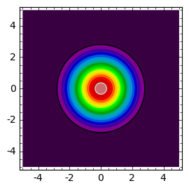

.. -*- coding: utf-8 -*-

Równania reakcji\-dyfuzji
=========================

Dotychczas analizowaliśmy modele dynamiki populacyjnej oraz kinetykę reakcji chemicznych bez uwzględnienia zjawisk rozprzestrzeniania się populacji lub substancji chemicznych na powierzchni czy w przestrzeni. Interesowało nas tylko zachowanie się układu w czasie, a nie w przestrzeni. Oznacza to, że modelowanie oparte było na równaniach różniczkowych zwyczajnych (występują tylko pochodne ze względu na czas) . Uwzględnienie zjawisk związanych z przestrzennymi zmianami modeluje się z pomocą równań różniczkowych cząstkowych (występują pochodne ze względu na zmienne przestrzenne).  Poniższy przykład przybliży nam sposób takiego modelowania.

**Przykład: zjawisko dyfuzji**

Wrzućmy kroplę farby akwarelowej do pojemnika z wodą. Zaobserwujemy, że z upływem czasu cząsteczki farby rozpływają się w coraz to większym obszarze i po odpowiednio długim czasie wypełniaja całkowicie pojemnik z wodą. To, co obserwujemy jest zjawiskiem dyfuzji lub, jak niektórzy nazywają, ruchem cząstek Browna. Jest to zjawisko natury molekularnej, spowodowane nieregularnymi (chaotycznymi) zderzeniami cząsteczek wody i cząsteczek farby.  Zauważamy też, że podwyższenie temperatury wody powoduje szybsze mieszanie się obu substancji. W języku fizyki statystycznej oznacza to, że współczynnik dyfuzji ulega zwiększeniu, rosnie natężenie fluktuacji termicznych i następuje przyspieszenie procesu dyfuzji.W języki matematyki, proces ten jest opisany za pomocą równania:

.. MATH::

    \frac{\partial c(\vec r, t)}{\partial t} = D \Delta c(\vec r, t) = D \left[\frac{\partial^2 }{\partial x^2} + \frac{\partial^2 }{\partial y^2} + \frac{\partial ^2}{\partial z^2} \right] c(\vec r, t)

gdzie :math:`c(\vec r, t)` jest koncentracją substancji  w chwili czasu :math:`t` w punkcie przestrzeni określonej przez wektor wodzący :math:`\vec r = (x, y, z)`. Zwracamy uwagę, że proces dyfuzji jest opisany operatorem Laplace'a (dwukrotnym różniczkowaniem).

Dla początkowej koncentracji :math:`c(x, y, z, 0)`  skupionej punktowo w początku układu odniesienia :math:`XYZ`, rozwiązanie równania dyfuzji ma postać

.. MATH::

    c(x, y, z, t) = [4\pi Dt]^{-3/2} \; exp\left[-\frac{x^2+y^2+z^2}{4Dt}\right]

Gdyby proces przebiegał tylko w jednym kierunku przestrzennym, np. wzdłuż osi :math:`OX` to odpowiednie równanie ma postać

.. MATH::

    \frac{\partial c(x, t)}{\partial t} =  D  \frac{\partial^2 }{\partial x^2}  c(x, t)  = D  \frac{\partial^2  c(x, t) }{\partial x^2}

Jego rozwiązaniem jest funkcja

.. MATH::

    c(x,  t) = [4\pi Dt]^{-1/2} \; exp\left[-\frac{x^2}{4Dt}\right]

Otrzymujemy więc następującą receptę na uwzględnienie dyfuzyjnego (losowego) rozprzestrzeniania się populacji lub substancji chemicznej:

Do równań opisujących dynamikę populacji dodaj jeszcze wyraz z pochodnymi drugiego rzędu względem zmiennych przestrzennych. Jeżeli zmiany mogą zachodzić tylko w jednym kierunku przestrzennym, to dodajemy wyraz analogiczny jak po prawej stronie powyższego równania. Gdyby zmiany mogły zachodzić na płaszczyżnie, to dodajemy wyraz typu:

.. MATH::

     +  D \left[ \frac{\partial^2 }{\partial  x^2}  + \frac{\partial^2 }{\partial y^2} \right] c(x, y, t)

Rozwiązaniem 2\-wymiarowego równania dyfuzji jest funkcja

.. MATH::

    c(x, y, t) = [4\pi Dt]^{-2/2} \; \exp\left[-\frac{x^2+y^2}{4Dt}\right] =\frac{1}{4\pi Dt}  \; \exp\left[-\frac{x^2+y^2}{4Dt}\right]

.. sagecellserver::

    sage: var('x,y,t')
    sage: c(x,y,t)=1/(4*pi*t)*exp(-(x^2+y^2)/(4*t) )
    sage: plts = [ plot3d(c(x,y,t), (x,-4,4), (y,0,8),rgbcolor = hue(t/2.0)) for t in [0.5,1.0,1.5,2.0]]
    sage: @interact
    sage: def _(viewer=['tachyon','jmol','canvas3d']):
    ...       show(sum(plts),viewer=viewer)

.. end of output

.. code-block:: python

    sage: def plt_t(t):
    ...       cmax = c(0,0,t)
    ...       return contour_plot( c(x,y,t) ,(x,-5,5),(y,-5,5),contours=srange(0.01,cmax,cmax/20.0),cmap='spectral',figsize=(3,3))

.. end of output

.. code-block:: python

    sage: times = [.1,0.4,0.9]
    sage: html.table([["t=%0.2f"%t for t in times],[plt_t(t) for t in times]])

.. end of output

.. image:: iCSE_BProcnielin05_z125_reakcja_dyfuzja_media/cell_6_sage0.png
    :align: center

Wszystkie dotychczas rozważane modele (Malthusa, Verhuslta,  autokatalizy, Lotki\-Volterry, Maya, Biełousowa\-Żabotyńskiego) mogą być  uogólnione na przypadek przestrzennych zmian. Dla przykładu, jeżeli  równanie dynamiki populacyjnej ma postać

.. MATH::

    \frac{dN(t)}{dt} = F(N(t))

to odpowiednie równanie uwzględniające proces dyfuzji ma postać

.. MATH::

    \frac{\partial N(\vec r, t)}{\partial t} = F(N(\vec r, t) ) +  D  \Delta N(\vec r, t)

gdzie w zależności od zagadnienia, laplasjan jest w jednym, dwóch lub trzech wymiarach.  **Tego typu równanie nazywa się równaniem reakcji\-dyfuzji.**

Rozważamy poniżej dwa modele: model Malthusa i model Verhulsta.

Model Malthusa z migracją: Równanie Skellama
============================================

Standardowy model Malthusa to najprostszy model wzrostu lub zaniku populacji opisany  przez  równanie różniczkowe

.. MATH::

    \frac{dN(t)}{dt} = k N(t)

Jeżeli populacja może przemieszczać się losowo na płaszczyźnie :math:`XY` to ogólniona wersja tego równania ma postać

.. MATH::

    \frac{dN(x, y, t)}{dt} = k N(x, y, t) +   D \left[ \frac{\partial^2  }{\partial  x^2}  + \frac{\partial^2 }{\partial y^2} \right] N(x, y,  t)

gdzie teraz :math:`N(x, y,  t)` ma interpretację koncentracji populacji  (substancji chemicznej) w chwili czasu :math:`t` w punkcie o współrzędnych  :math:`(x, y)`, czyli liczby osobników na jednostke powierzchni. Jest to jeden  z prostszych  przykładów  układu,  który nazywamy równaniem  reakcji-dyfuzji. W literaturze, powyższe równanie  nazywa się równaniem  Skellama, który w 1951 roku  zaproponował ten model jako model inwazji  gatunku. Zastosował go do opisu inwazji piżmaka w Europie.

.. image:: http://upload.wikimedia.org/wikipedia/commons/thumb/3/35/Bisamratte-drawing.jpg/250px-Bisamratte-drawing.jpg
    :align: center

`<http://pl.wikipedia.org/w/index.php?title=Plik:Bisamratte-drawing.jpg&filetimestamp=20041114193425>`_

Do Europy  piżmaki sprowadzone zostały na początku XX w. z  Ameryki  Północnej  przez księcia Colloredo\-Mansfelda jako zwierzę futerkowe.   Cała dzisiejsza europejska populacja  dziko żyjących piżmaków pochodzi  od kilku osobników, które w 1905 roku uciekły z  farmy  położonej w  Czechach, 40 km na południowy zachód od Pragi.   Na ziemiach polskich  pojawił się w latach 30. XX w.

W modelu rozpatrujemy tylko takie przypadki że :math:`N(x, y,  t) \ge 0`.   Nie jest to jeszcze kompletne sformułowanie problemu. Należy  sprecyzować:

(1) warunek początkowy :math:`N(x, y, 0)= N_0(x, y)`

(2) warunki brzegowe

Właściwe warunki brzegowe są często trudne do zdefiniowania. Na pewno  na brzegach obszaru  koncentracja :math:`N(\pm \infty, t)` powinna  przyjmować ograniczone wartości.  Ale to niekoniecznie musi wystarczać,  aby rozwiązania posiadały poprawne własności i były pozbawione  artefaktów.

Powyższe równanie reakcji\-dyfuzji jest  tak trudne (łatwe)  do  analizy jak równanie dyfuzji. Aby to zobaczyć, dokonamy podstawienia:

.. MATH::

    N(x, y, t)=e^{kt} c(x, y, t)

Wstawiając je  do równania reakcji-dyfuzji, widzimy że nowa funkcja :math:`c(x, y, t)` spełnia równanie

.. MATH::

    \frac{d c(x, y, t)}{dt} =   D \left[ \frac{\partial^2  }{\partial   x^2}  + \frac{\partial^2 }{\partial y^2} \right] c(x, y,  t)

czyli równanie dyfuzji w dwu-wymiarowej przestrzeni. Rozwiązanie tego  równania jest przedstawione powyżej. Więc funkcja :math:`N(x, y, t)` ma  postać

.. MATH::

    N(x, y, t)=e^{kt} c(x, y, t) =  \frac{N_0}{4\pi Dt}  \; exp\left[kt -\frac{x^2+y^2}{4Dt}\right]

gdzie stała :math:`N_0=N(0)` jest liczbą osobników w populacji w chwili początkowej :math:`t=0`.

Ponieważ koncentracja :math:`N(x, y, t)` populacji ma interpretację liczby osobników na jednostkę powierzchni, to

.. MATH::

    \int_{-\infty}^{\;\infty} \;\int_{-\infty}^{\;\infty} N(x, y, t) \,dx \,dy = N(t) = N(0) e^{kt}

Zauważmy, że ewolucja koncentracji populacji zależy tylko od położenia w taki oto sposób

.. MATH::

    N(x, y, t)= N(r ,t) = \frac{N_0}{4\pi Dt}  \; exp\left[kt -\frac{r^2}{4Dt}\right]

gdzie

.. MATH::

    r^2=x^2+y^2

jest  miarą odległości od początku układu odniesienia.

Analizę własności :math:`N(r,  t)` można łatwo przeprowadzić korzystając z możliwości Sage.  Są one przedstawione graficznie poniżej.

.. sagecellserver::

    sage: g(x,t) = (1/(4*pi*t))*exp(t-x^2/(4*t))   
    sage: @interact 
    sage: def _(t=slider(0.1,5,0.01)):
    ...       pr0 = plot( g(x,0.1),(x,0,10),color='black' ) 
    ...       prt = plot( g(x,t),(x,0,10),fill=True ) 
    ...       (pr0+prt).show(figsize=5)

.. end of output

Obserwujemy następującą ewolucję populacji:

(A) W pewnej umownej chwili początkowej rozkład populacji ma określoną formę (powyżej:  dla t=0.1).

(B) Wraz z upływem czasu populacja rozprzestrzenia się i jej koncentracja wokół :math:`r=0`  (w otoczeniu wyjściowego największego skupiska)  zaczyna maleć:  osobniki rozchodzą się, tempo urodzin jest na razie niewielkie.

(C) Po pewnym czasie koncentracja wokół  :math:`r=0` przyjmuje minimalną wielkość, a następnie wraz z upływem czasu zaczyna wzrastać (narasta tempo urodzin). Jednocześnie populacja rozprzestrzenia się zajmując coraz to większy obszar.

(D) Następnie obserwujemy,  że  istnieje taka chwila czasu, gdy  koncentracja wokół położenia :math:`r=0` przekracza wartość początkową i dalej wzrasta w coraz to większym tempie, jednocześnie rozprzestrzeniając się na coraz to większym obszarze. Obserwujemy  inwazję populacji. Dalej jest już jak w kiepskim horrorze. Tym nie mniej, scenariusz  ten wydaje się dość rozsądny i w pewnych warunkach całkiem dobrze opisuje w ograniczonym przedziale czasowym inwazję populacji.

Pełniejsza analiza tego modelu jest przedstawiona w książce:

Nanako Shigesada and Kohkichi Kawasaki,  *Biological Invasion: Theory and Practice*  (Oxford University Press, 2001)

Model Verhulsta z migracją: Równanie Fishera\-Kołmogorowa
=========================================================

Model Verhulsta opisuje ewolucję populacji w przypadku ograniczonych zasobów pożywienia w środowisku, w którym żyje dana populacja:

.. MATH::

    \frac{dn(t)}{dt} = r n(t) \; [1- n(t)]

gdzie przeskalowana koncentracja :math:`n(t) = N(t)/K` i parametr :math:`K` nazywa sie pojemnością środowiska.

Model ten opisuje też kinetykę dwóch reakcji autokatalitycznych:

.. MATH::

     A + X {\Longleftrightarrow}  2X , \quad \quad \mbox{lub reakcji} \quad  A+X {\Longleftrightarrow} 2X, \quad B+X \rightarrow C

Jeżeli uwzględnimy proces rozprzestrzeniania się dyfuzyjnego, model ten przyjmuje postać

.. MATH::

    \frac{\partial n(\vec r, t)}{\partial t} =  r n(\vec r, t) \;[1-  n(\vec r, t)] +  D  \Delta n(\vec r, t)

W przypadku dynamiki populacyjnej, powinniśmy rozważać migrację na płaszczyżnie (laplasjan w dwóch wymiarach), a w przypadku substancji chemicznych \- dyfuzję przestrzenną (pełny trójwymiarowy laplasjan). Oba realistyczne przypadki są wyjątkowo skomplikowane. Dlatego upraszczamy model i redukujemy zagadnienia do przypadku jednowymiarowej dyfuzji i  poniżej rozważamy następujące równanie

.. MATH::

    \frac{\partial n(x, t)}{\partial t} = r n(x, t) \;[1-  n(x, t)] +    D \frac{\partial^2   n(x, t)}{\partial  x^2}

Równanie to nazywa się równaniem Fishera\-Kołmogorowa.

Jak zwykle w modelu tym rozpatrujemy tylko takie przypadki że :math:`n(x,  t) \ge 0`.  Należy jeszcze zadać:

(1) rozkład  początkowy populacji :math:`n(x, t= 0)= n_0(x)`

(2) warunki brzegowe dla :math:`n(\pm\infty, t)`

Warunki brzegowe sformułujemy później.

Analiza równania Fishera\-Kołmogorowa
-------------------------------------

(I)  Zauważmy, że funkcje stałe :math:`n(x,t) = n_{0} = 0` oraz :math:`n(x, t) = n_{1} = 1` są rozwiązanami tego równania. Są to te same stany stacjonarne, które są obecne w przypadku modelu Verhulsta bez dyfuzji.

(II) Równanie powyższe można przeskalować w następujący sposób:

.. MATH::

    \tau = rt, \quad \quad y^2=\frac{r}{D} x^2, \quad \quad n(x,t) \equiv  c(y, \tau)

\ 
  Przeskalowana koncentracja spełnia równanie

.. MATH::

    \frac{\partial c }{\partial \tau} =  c  [1-  c ] + \frac{\partial^2  c}{\partial y^2}, \quad \quad c=c(y, \tau)

\ 
  Funkcje :math:`c=0` oraz :math:`c=1` są rozwiązaniami stacjonarnymi.

(III) Szukamy rozwiązań w postaci fali biegnącej:

.. MATH::

    c(y, \tau) = U(z), \quad \mbox{gdzie } \quad z=y-v_0 \tau

\ 
  Oznacza to, że fala przesuwa się w prawo z prędkością :math:`v_0`.  Często mówi się, że  front falowy koncentracji porusza się w prawo z prędkością :math:`v_0`.

  Zauważamy, że

.. MATH::

     \frac{\partial c }{\partial \tau} = \frac{\partial U}{\partial \tau} = \frac{d U}{d z} \frac{\partial z}{\partial \tau} =  -v_0 \frac{d U}{d z} 

.. MATH::

     \frac{\partial c }{\partial y} = \frac{\partial U }{\partial y} = \frac{d U }{d z} \frac{\partial z }{\partial y} =    \frac{d U }{d z} 

.. MATH::

     \frac{\partial ^2 c }{\partial y^2} = \frac{\partial^2 U }{\partial y^2} = \frac{d ^2U }{d z^2}

\ 
  Stąd, nowa funkcja :math:`U(z)` spełnia równanie różniczkowe zwyczajne drugiego rzędu:

.. MATH::

    U'' + v_0 U' + U(1-U)=0

\ 
  Jest ono równoważne układowi 2 równań:

.. MATH::

    U'=V = F(U, V), \quad \quad V'=-v_0 - U(1-U) = G(U, V)

\ 
  Stany stacjonarne określone są przez pierwiastki równań:

.. MATH::

     F(U, V) = 0, \quad \quad  G(U, V) = 0,

\ 
  stąd otrzymujemy 2 par rozwiązań

.. MATH::

    (U_0, V_0) = (0, 0), \quad (U_1,  V_1) = (1, 0)

1. Wyznaczamy macierz Jacobiego

.. MATH::

    \quad \quad \quad \quad J = \begin{bmatrix}\frac{ \partial F}{\partial U}&  \frac{\partial F}{\partial V}\\ \frac{\partial  G}{\partial U}&  \frac{\partial Gg}{\partial V}  \end{bmatrix}= \begin{bmatrix}0,  &  1\\ -1+2U,  &  -v_0  \end{bmatrix}

\ 
  w punktach stacjonarnych:

.. MATH::

    J_0= J(0, 0) =  \begin{bmatrix}0& 1\\ -1& -v_0 \end{bmatrix}, \quad \quad  J_1=  J(1, ) = \begin{bmatrix}0& 1\\ 1& -v_0 \end{bmatrix}

2. Wyznaczamy wartości własne macierzy Jacobiego :math:`|J-\lambda I|=0`:

(a)    dla :math:`(0, 0)` otrzymujemy:

.. MATH::

     \lambda_{\pm}(0, 0) = (1/2)[-v_0\pm\sqrt{v_0^2-4}]

\ 
 Należy rozważyć 2 przypadki: :math:`v_0 \lt  2` oraz :math:`v_0 \ge 2`. Pierwszy przypadek należy odrzucić, ponieważ wartości własne są zespolone, o rzeczywistej części ujemnej i krzywe fazowe tworzą spiralę wokół punktu :math:`(0, 0)`. Ale to oznacza, że :math:`U`  przyjmuje także ujemne wartości, co nie jest dopuszczalne (koncentracje populacji mogą być tylko dodatnie lub zerowe). Pozostaje tylko drugi przypadek:

.. MATH::

    v_0 \ge 2

(b)    dla :math:`(1, 0)` otrzymujemy: :math:`\lambda_{\pm}(1, 0) = (1/2)[-v_0\pm\sqrt{v_0^2+4}]`.  Ponieważ jedna  z wartości własnych jest dodatnia, ten stan stacjonarny jest niestabilny (jest to stan stacjonarny typu siodło).

.. code-block:: python

    sage: F(u,v)=v
    sage: G(u,v)= -2*v-u+u^2 #ewolucja z  otoczenia stanu stacjonarnego (1,0)
    sage: T1 = srange(0,5,0.01) #druga liczba=ilość iteracji="czas"
    sage: T2 = srange(0,29,0.01)
    sage: solo2=desolve_odeint(vector([F,G]), [0.8, 0.01], T1, [u,v]) # warunek pocz (U, V)
    sage: solo3=desolve_odeint(vector([F,G]), [0.999, 0], T2, [u,v]) # warunek pocz (U, V)
    sage: list_plot(solo2.tolist(), plotjoined=1, color='green', figsize=(7,3)) + list_plot(solo3.tolist(), plotjoined=1, figsize=(7,3))

.. image:: iCSE_BProcnielin05_z125_reakcja_dyfuzja_media/cell_10_sage0.png
    :align: center

.. end of output

Zauważmy, że istnieją stany początkowe z otoczenia stanu :math:`(1, 0)`, które dążą do stanu :math:`(0, 0)`. Innymi słowy funkcja :math:`U(z)`  z otoczenia :math:`U(z) \approx 1` łączy się z  funkcją :math:`U(z)=0`. To sugeruje wybór warunków brzegowych w postaci:

.. MATH::

     \lim_{z\to   -\infty} U(z) = 1, \quad \quad \lim_{z\to \infty} U(z) = 0

Pamiętając o własnościach stanów stacjonarnych w standardowym modelu Verhulsta (:math:`n(t) \to 1` dla :math:`t\to \infty`), oznacza to, że dla ustalonej wartości położenia :math:`y`:

.. MATH::

    \lim_{z\to   -\infty} U(z) =  \lim_{\tau \to \infty} U(y-v_0 \tau ) = \lim_{\tau \to   \infty} c(y, \tau )  = 1

co jest konsystentne z zachowaniem się układu w przypadku bez migracji.

Dokładne rozwiązanie w szczególnym przypadku
~~~~~~~~~~~~~~~~~~~~~~~~~~~~~~~~~~~~~~~~~~~~

Istnieje jeden szczególny przypadek, gdy znane jest dokładne  rozwiązanie równania Fishera\-Kołmogorowa w postaci analitycznej. Dal prędkości fali

.. MATH::

    v_0 =  \frac{5}{\sqrt{6}}

rozwiązanie ma postać:

.. MATH::

     c(y, \tau) = \frac{1}{\left\{1+A \exp\left[ (y-v_0 \tau)/\sqrt{6}\right] \right\}^{2}}

gdzie stała :math:`A\gt 0` określa początkowy profil koncentracji.

.. sagecellserver::

    sage: A=1                                              ## określa początkowy profil koncentracji 
    sage: b=5/sqrt(6)                                      ## prędkość frontu falowego
    sage: cs(x,t) = 1/(1+ A*exp(x-b*t)/sqrt(6))^2          ## szczególna, ale analityczna postać frontu koncentracji 
    sage: @interact 
    sage: def _(t=slider(0,5,0.2)):
    ...       pr3 = plot( cs(x,0),(x,-10,10),color='black' ) 
    ...       pr4 = plot( cs(x,t),(x,-10,10),fill=True ) 
    ...       (pr3+pr4).show(figsize=5)

.. end of output

Analiza numeryczna równania Fishera\-Kołmogorowa:
-------------------------------------------------

.. MATH::

    \frac{\partial n(x, t)}{\partial t} = r n(x, t) \;[1-  n(x, t)] +    D \frac{\partial^2  n(x, t)}{\partial x^2}

Przyjęto okresowe warunki brzegowe, poprzez odpowiedni wybór dyskretnego operatowa dyfuzji :math:`L`.  Najpierw wybieramy dyskretyzację przestrzeni, potem dobieramy maksymalny krok czasowy tak by warunek CFL był spełniony.

Aby uzyskac rozwiązanie z wyraźną falą biegnącą należy wziąć dla :math:`r=0` wartości dyfuzji poniżej :math:`D\lt 0.001`. Dla większych wartości stałych dyfuzji najpierw nastąpi wyrównanie poziomu :math:`u` na obszarze, a potem wzrost do wartości stabilnej :math:`u=1`.

Długość układu wchodzi efektywnie w skalowanie stałej dyfuzji, można więc bez straty ogólności rozważać układy o długości 1.

.. MATH::

    u^{i+1}  = u^i + dt \left( r u^i (1-u^i) + D \frac{1}{h^2} Lu^i\right),

gdzie :math:`L` jest dyskretnym operatorem Laplace'a.

Ponieważ część nieliniowa jest lokalna (nie zawiera pochodnych), to warunki brzegowe są zawarte w operatorze :math:`L`.

.. sagecellserver::

    sage: import numpy as np 
    sage: Dyf = 1.0
    sage: r = 1.0
    sage: l = 100.0 # dlugosc ukladu
    sage: t_end = 50 # czas symulacje
    sage: N = 100 # dyskretyzacja przestrzeni
    sage: h = l/(N-1) 
    sage: dt = 0.2/(Dyf*(N-1)**2/l**2) # 0.2 z warunku CFL, krok nie moze byc wiekszy
    sage: sps = int(1/dt) # liczba krokow na jednostke czasu
    sage: Nsteps=sps*t_end  # calkowita liczba krotkow 
    sage: print "sps=",sps,"dt=",dt
    sage: one = np.identity(N)
    sage: L=np.roll(one,-1)+np.roll(one,1)-2*one
    sage: L[0,0]=-2.
    sage: L[-1,-1]=-2.
    sage: L[0,-1]=1.
    sage: L[-1,0]=1.
    sage: # warunek poczatkowy
    sage: u = np.zeros(N)
    sage: u[N/2-10:N/2+10]=.1 # small bump
    sage: #u[:N/2]=1 # step
    sage: Tlst=[]
    sage: for i in range(Nsteps):
    ...       if not i%sps:
    ...           Tlst.append(list(u))
    ...       u = u + dt*(r*u*(1-u) + Dyf*(N-1)**2/l**2*L.dot(u))
    sage: @interact 
    sage: def _(ti=slider(range(len(Tlst)))):
    ...       print r"tau=",dt*ti
    ...       p =  list_plot(Tlst[ti],plotjoined=True)
    ...       p += list_plot(Tlst[-1],plotjoined=True,color='red',ymin=0,ymax=1.5)
    ...       p += list_plot(Tlst[0],plotjoined=True,color='gray')
    ...       p.show(figsize=(8,3))

.. end of output

.. sagecellserver::

    sage: import numpy as np 
    sage: Dyf = 1.0
    sage: r = 1.0
    sage: l = 100.0 # dlugosc ukladu
    sage: t_end = 100 # czas symulacje
    sage: N = 200 # dyskretyzacja przestrzeni
    sage: h = l/(N-1) 
    sage: dt = 0.052/(Dyf*(N-1)**2/l**2) # 0.2 z warunku CFL, krok nie moze byc wiekszy
    sage: sps = int(1/dt) # liczba krokow na jednostke czasu
    sage: Nsteps=sps*t_end  # calkowita liczba krotkow 
    sage: print "sps=",sps,"dt=",dt
    sage: one = np.identity(N)
    sage: L=np.roll(one,-1)+np.roll(one,1)-2*one
    sage: L[0,0]=1.
    sage: L[-1,-1]=1.
    sage: # warunek poczatkowy
    sage: u = np.zeros(N)
    sage: #u[:int(N/2]=1 # step
    sage: for i in range(1,3):
    ...       u[i] = 1.0 - i/3.0
    sage: def essential_boundary_conditions(u):
    ...       u[0] = 1.
    ...       u[-1] = 0.0
    sage: Tlst=[]
    sage: essential_boundary_conditions(u)
    sage: for i in range(Nsteps):
    ...       if not i%sps:
    ...           Tlst.append(list(u))
    ...       u = u + dt*(r*u*(1-u) + Dyf*(N-1)**2/l**2*L.dot(u))
    ...       essential_boundary_conditions(u)
    sage: @interact
    sage: def _(ti=slider(range(len(Tlst)))):
    ...       print r"t=",dt*ti
    ...       p =  list_plot(Tlst[ti],plotjoined=True)
    ...       p += list_plot(Tlst[-1],plotjoined=True,color='red',ymin=0,ymax=1.5)
    ...       p += list_plot(Tlst[0],plotjoined=True,color='gray')
    ...       p.show(figsize=(8,3))

.. end of output

Prędkość frontu fali:
~~~~~~~~~~~~~~~~~~~~~

.. code-block:: python

    sage: pos_lst = []
    sage: for T_ in Tlst:
    ...       for (i,a),b in zip(enumerate(T_),T_[1:]):
    ...           if a>=0.5 and b<=0.5:
    ...               pos_lst.append( i+(a-0.5)/(a-b) ) 
    ...           
    sage: list_plot( [l/(N-1)*(b-a)/(sps*dt) for a,b in zip(pos_lst,pos_lst[1:])] , figsize=(7,3),gridlines=[[],[2]],ymax=2)

.. end of output

