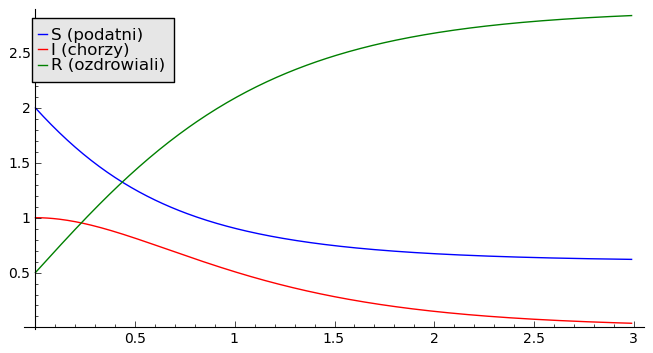
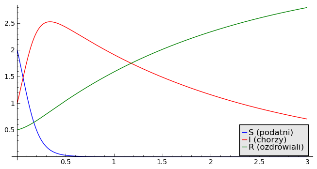
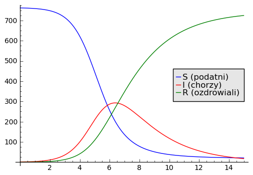
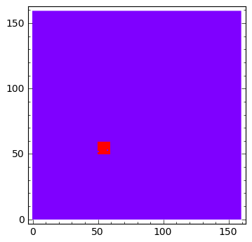
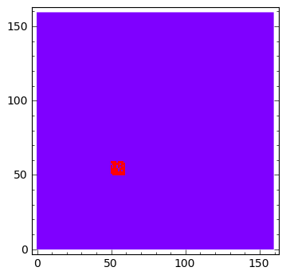
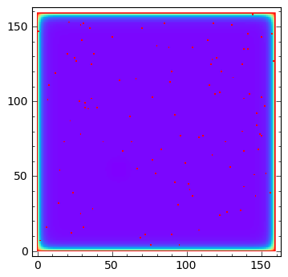
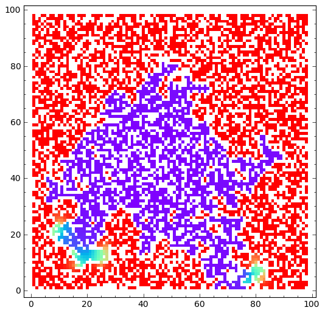
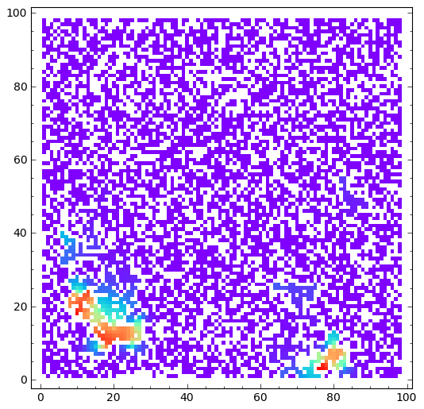
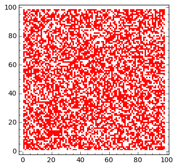
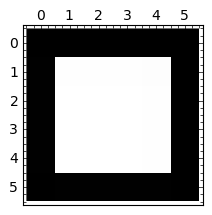

.. -*- coding: utf-8 -*-

Modele epidemii
===============

Model Kermacka\-McKendricka
---------------------------

W języku potocznym termin epidemia używany jest  jako synonim masowych zachorowań wywołanych chorobami zakaźnymi.  Często definiuje się ją jako wystąpienie na danym  obszarze zakażeń lub zachorowań na chorobę zakaźną w liczbie wyraźnie  większej niż we wcześniejszym okresie albo wystąpienie zakażeń lub  chorób zakaźnych dotychczas niewystępujących.  Przypadki globalnych epidemii nazywa się pandemią. Oto kilka przykładów epidemii (pandemii):

 - grypy            
  - grypa hiszpanka (1918\-1919) – ponad 50 mln ofiar śmiertelnych na całym świecie

  - grypa azjatycka (1957) – ok. 1 mln ofiar śmiertelnych na całym świecie

  - grypa Hong\-Kong (1968) – ok. 1 mln ofiar śmiertelnych na całym świecie

  - Pandemia grypy A/H1N1 (od 11 czerwca 2009) \- ok. 12799 ofiar na całym świecie
 

 - AIDS – masowe zachorowania; zwłaszcza na kontynencie afrykańskim

Jak zwykle zaczniemy modelowanie epidemii jakiejś choroby od uproszczających założeń. Rozważamy izolowaną populację, a w niej 3 grupy osób:

1. osoby podatne, które mogą zachorować; ich populacje oznaczamy przez :math:`S`

2. ososby chore  (zainfekowane) :math:`I` oraz

3. osoby,  które wyzdrowiały i są odporne na nową infekcję :math:`R`.

W punkcie 3 zakłada się, że choroba jest wyleczalna i nie prowadzi do śmierci. Równie dobrze można założyć, że choroba jest całkowicie śmiertelna i wówczas :math:`R` jest liczbą osób matrwych z powodu choroby.

Ponieważ  jest to  populacja izolowana, więc całkowita liczba wszystkich osobników jest stała

.. MATH::

    S + I + R = N_0  = const.

Zmiana liczebności osobników w poszczególnych grupach jest wyznaczona przez równania:

.. MATH::

    \frac{dS}{dt} = - r S I, \quad \quad  \frac{dI}{dt} = r S I -aI, \quad \quad  \frac{dR}{dt} =  aI

Równania te mają podobną strukturę jak równania dynamiki populacyjnej Lotki\-Volterry. Uzasadnienie tych równań jest podobne:

1. Liczba osobników w grupie  podatnych :math:`S` maleje (pochodna jest ujemna), ponieważ  mogą zachorować. Tempo ubytku osobników :math:`S` zależy od liczby osób chorych :math:`I`, ponieważ im więcej jest nosicieli choroby, tym więcej ludzi może być zainfekowanych.

2. Liczba osób chorych :math:`I` zmienia się z dwóch powodów. Pierwszy powód: :math:`I` wzrasta (wyraz po prawej stronie równania jest dodatni) ponieważ nowe osoby są infekowane. Drugi powód: :math:`I` maleje (wyraz po prawej stronie jest ujemny) ponieważ chorzy zdrowieją.

3. Osób ozdrowiałych :math:`R`  (lub martwych)  przybywa (pochodna jest dodatnia).

Jeżeli dodamy obustronnie do siebie wszystkie 3 równania, to wyrazy po prawej stronie uproszczą się i otrzymamy zero:

.. MATH::

    \frac{dS}{dt} + \frac{dI}{dt} + \frac{dR}{dt} =  \frac{d(S + I + R)}{dt} = 0  \quad \quad \Rightarrow \quad \quad  S + I + R  = const.   \quad \quad \Rightarrow \\  S(t) + I(t) + R(t)  = const. = S(0) + I(0) + R(0)  = N_0

Jak widać, całkowita liczba osobników  :math:`S(t) + I(t) + R(t)` w populacji nie zmienia się w czasie i jest określona przez :math:`S(0) + I(0) + R(0)` w początkowej  chwili czasu. Więc równania ewolucji są zgodne z założeniem o wyizolowanej populacji. Powyższy model można modyfikować na wiele sposobów. Po wykładach o modelowaniu dynamiki populacyjnej, każdy student może stworzyć swój model i   badać jego własności.

Zbadajmy własności proponowanego modelu, który **nazywa się  modelem  Kermacka\-McKendricka.** Będziemy uważali, że model ten może opisywać zjawisko epidemi, jeżeli w trakcie ewolucji czasowej liczba osób chorych  :math:`S(t)`  będzie funkcją rosnącą od danej chwili zwanej umownie chwilą początkową (czasem początkowym) :math:`t_0 = 0`. Nie będziemy wymagać, aby w zjawisku epidemii  :math:`S(t)`  była cały czas funkcją rosnącą. Po pewnym czasie, epidemia może być opanowana i wówczas :math:`S(t)` zacznie maleć.  Jeżeli  z kolei  :math:`S(t)`  będzie funkcją malejącą już od chwili początkowej :math:`t_0 = 0`, nie będzie to zjawisko epidemii.

Dwa pierwsze równania tworzą zamknięty i niezależny układ równań różniczkowych:

.. MATH::

    \frac{dS}{dt} = - r S I, \quad \quad  \frac{dI}{dt} = r S I -aI = I (r S - a)

Możemy zastosować dobrze znaną nam metodę badania stanów stacjonarnych i ich stabilności. Przyrównując prawe strony do zera otrzymamy możliwe stany stacjonarne:

.. MATH::

    I = 0 \quad \quad \quad  S = \frac{a}{r}

Obliczmy odpowiednią macierz Jacobiego:

.. MATH::

     \quad \quad \quad \quad J (S, I) = \begin{bmatrix}-r I& -r S\\ r I & r S - a  \end{bmatrix} \quad  \quad  \mbox{w punkcie stacjonarnym:} \quad J= J(a/r, 0) =  \begin{bmatrix}0&-a\\ 0&0 \end{bmatrix}

Wyznaczamy wartości własne macierzy Jacobiego :math:`|J-\lambda I|=0`. Prosty rachunek pokazuje, że wartości własne wynoszą zero. Więc analiza liniowa stabilności nie może być stosowana!! Należy w inny sposób badać zachowanie sie układu.  Wykorzystajmy numeryczną analizę z użyciem SAGE.  W modelu występują dwa parametry:  tempo infekcji  :math:`r`  oraz tempo zdrowienia  :math:`a`. One powinny   decydować o ewolucji rozprzestrzeniania się choroby. Ale to jest za mało.  Okazuje się, żę także warunki początkowe odgrywają istotną  rolę.  Poniżej przedstawiamy dwa zestawy parametrów  :math:`r`  oraz  :math:`a` przy ustalonych i tych samych warunkach początkowych.

Przykładowy zestaw parametrów
~~~~~~~~~~~~~~~~~~~~~~~~~~~~~

Dwa parametry:  tempo infekcji  :math:`r`  oraz tempo zdrowienia  :math:`a`  decydują o początkowej ewolucji rozprzestrzeniania się choroby (przy założeniu ustalonych warunkach początkowych). Jako pierwszy przykład, rozpatrujemy:

.. MATH::

    r  \lt   a

.. code-block:: python

    sage: var('S I R') ## w tej części układ równań jest numerycznie rozwiązywany
    sage: r,a = 1,2 
    sage: T = srange(0, 3,0.01)
    sage: sol=desolve_odeint( vector([-r*S*I,r*S*I - a*I, a*I]), [2,1,0.5],T,[S,I,R])
    sage: line( zip ( T,sol[:,0]) ,figsize=(8,4),legend_label="S (podatni)") +\
    ...    line( zip ( T,sol[:,1]) ,color='red',legend_label="I (chorzy)")+\
    ...    line( zip ( T,sol[:,2]) ,color='green',legend_label="R (ozdrowiali)")

.. end of output

Inny zestaw parametrów
~~~~~~~~~~~~~~~~~~~~~~

Zmieniamy relacje między dwoma  parametrami: tempem infekcji  :math:`r`  oraz tempem zdrowienia  :math:`a`:

.. MATH::

    r \gt  a

.. code-block:: python

    sage: var('S I R') 
    sage: r1,a1 = 4,0.5 
    sage: T = srange(0,3,0.01)
    sage: sol=desolve_odeint( vector([-r1*S*I,r1*S*I - a1*I, a1*I]), [2,1,0.5],T,[S,I,R])
    sage: line( zip ( T,sol[:,0]) ,figsize=(8,4),legend_label="S (podatni)") +\
    ...    line( zip ( T,sol[:,1]) ,color='red',legend_label="I (chorzy)")+\
    ...    line( zip ( T,sol[:,2]) ,color='green',legend_label="R (ozdrowiali)")

.. end of output

Powyższe 2 zestawy parametrów prowadzą do 2 różnych ewolucji.  Dlaczego? Aby rozwikłać ten problem, rozpatrzmy własność równania dla :math:`I`:

.. MATH::

     \frac{dI}{dt} = r S I -aI = I (r S - a)

Początkowa ewolucja zależy od znaku pochodnej dla czasu :math:`t \to 0`.  Dobrze wiemy o tym  że jeżeli pochodna jest dodatnia, to funkcja rośnie; jeżeli pochodna jest ujemna to funkcja maleje.

Znak pochodnej w zerze to:

.. MATH::

    \frac{dI}{dt}|_{t=0}  =   r S(0)  I(0)  - a I(0)  = I(0) [r S(0) - a]

Jeżeli :math:`r S(0) - a \gt  0`  to funkcja :math:`I(t) \gt  I(0)`  rośnie i pojawia się epidemia. Jeżeli :math:`r S(0) - a  \lt   0`  to funkcja :math:`I(t)  \lt   I(0)` maleje  i  nie pojawia się epidemia. W zagadnieniu tym pojawia się zjawisko progowe. Wartością progową jest wielkość:

.. MATH::

     S_c = \frac{a}{r}

**Gdy w chwili początkowej**  :math:`S(0) \gt  S_c` **to pojawia się  epidemia!**

Pojawienie sie epidemii zależy od tego jak duża jest populacja ludzi podatnych na zakażenie.  Populacja ta musi być odpowiednio duża, a jej minimalna wartość zależy od tego jakie jest tempo zdrowienia :math:`a` w relacji do tempa infekcji :math:`r`.  To jest najważniejszy wniosek z tej analizy.

Przykład
~~~~~~~~

Powyższy model zastosowano do opisu epidemii grypy w 1978 roku w jednej z angielskich szkół dla chłopców (może dlatego tam pojawiła się epidemia?).  A oto dane:

Wszystkich uczniów było 763.  Jeden z chłopców był chory i zaczął zakażać  swoich kolegów. Skutek był taki, że w przeciągu kilku dni (od 22 stycznia do 4 lutego)  zachorowało 512  uczniów. W szóstym dniu od pojawienia się choroby epidemia osiągnęła  maksimum: było chorych 300 chłopców. W następnych dniach ich liczba zaczęła spadać.  Dopasowano krzywą empiryczną do modelu i otrzymano następujące wartości parametrów:

.. MATH::

    r = 0.00218, \quad \quad \quad S_c = 202.

Wykreślić wszystkie trzy krzywe.

.. code-block:: python

    sage: var('S I R') 
    sage: r2,s = 0.00218, 202 
    sage: T = srange(0,15,0.01)
    sage: sol=desolve_odeint( vector([-r2*S*I,r2*I*(S - s),r2*s*I]), [762,1,0],T,[S,I,R])
    sage: line( zip ( T,sol[:,0]) ,figsize=(6,4),legend_label="S (podatni)") +\
    ...    line( zip ( T,sol[:,1]) ,color='red',legend_label="I (chorzy)")+\
    ...    line( zip ( T,sol[:,2]) ,color='green',legend_label="R (ozdrowiali)")

.. end of output

Geograficzne rozprzestrzenianie się epidemii
--------------------------------------------

W poprzednim modelowaniu nie byliśmy zainteresowani czy epidemia choroby rozprzestrzenia się na danym obszarze. Interesowało nas tylko to, czy zachorowalność w czasie  wzrasta czy maleje; czy liczba ludzi chorych rośnie czy maleje w czasie.  W tej części interesuje nas, w jaki sposób choroba "rozmywa się"  się na danym obszarze. Mamy już pewne doświadczenie, aby taki proces modelować. Nabyliśmy je przy modelowaniu modelu Malthusa z migracją i modelu Verhulsta z migracją. Otrzymaliśmy równania, którę w literaturze **nazywają się równaniami reakcji\-dyfuzji.**  Podobnie będziemy postępować teraz: do naszych równań  Kermacka\-McKendricka dodamy  wyraz (lub wyrazy) opisujące proces dyfuzji, czyli losowego rozchodzenia się danego zjawiska na określonym obszarze:

.. MATH::

    \frac{\partial S }{\partial t} =  -r S I +  D_s  \Delta S

.. MATH::

    \frac{\partial I }{\partial t} =   r S I  - a I +  D  \Delta I

gdzie :math:`S = S(\vec r, t)`  oraz  :math:`I = I(\vec r, t)`  opisuje  koncentrację populacji  w chwili czasu :math:`t`  w punkcie obszaru określonym  przez wektor wodzący :math:`\vec r = (x, y)`.  Parametry :math:`D_s` oraz  :math:`D` są współczynnikami dyfuzji i opisują tempo zmian przestrzennych odpowiednich populacji :math:`S`  i  :math:`I`. Zwracamy uwagę, że proces dyfuzji jest opisany operatorem Laplace'a  (dwukrotnym różniczkowaniem). Na przykład :

.. MATH::

    \Delta S(\vec r, t)  = \left[\frac{\partial^2 }{\partial x^2} + \frac{\partial^2 }{\partial y^2} \right] S (\vec r, t)

W przypadku uproszczonych modeli, operator Laplace'a może dotyczyć tylko jednej zmiennej (dyfuzja w jednym wymiarze). Jeżeli nie interesuje nas przestrzenna zmiana osobników podatnych :math:`S`, wówczas otrzymamy model tego typu:

.. MATH::

    \frac{\partial S }{\partial t} =  -r S I

.. MATH::

    \frac{\partial I }{\partial t} =   r S I  - a I +  D  \Delta I

Model tego typu był szeroko stosowany do opisu rozprzestrzeniania się wścielkizny wśród dzikich zwierząt, zwałaszcza wśród populacji lisów. Jeszcze pod koniec lat 60\-ych  do połowy lat 70\-tych XX wieku we Francji wścielkizna stanowiła poważny problem i rozprzestrzeniała się w szybkim tempie z północnej części Francji aż do południowych krańców Francji.

Powyższy model rozszerzono uwzględniając naturalny wzrost populacji lisów wskutek urodzin:

.. MATH::

    \frac{\partial S }{\partial t} =  -r S I  + B S \left(1-\frac{S}{S_0}\right)

.. MATH::

    \frac{\partial I }{\partial t} =   r S I  - a I +  D  \Delta I

W pierwszym równaniu rozpoznajemy drugi wyraz po prawej stronie opisujący wzrost populacji podatnej populacji :math:`S` taki jak w  modelu Verhulsta.   Parametry :math:`B` oraz :math:`S_0` mają taką samą interpretację jak w modelu Verhulsta: :math:`B` opisuje tempo wzrostu populacji, natomiast :math:`S_0` opisuje pojemność środowiska (zasoby pożywienia).

W modelu tym występuje aż 6 parametrów.  Odpowiednie skalowanie pozwala zredukować liczbe parametrów. Zawsze jest ciekawym zagadnieniem, od ilu istotnych parametrów zależż własności opisywanego układu. Wprowadźmy następujące wielkości bezwymiarowe:

.. MATH::

     U = \frac{S}{S_0},  \quad \quad V =  \frac{r I}{B S_0},  \quad \quad y =  \left(\frac{B}{D}\right)^{1/2} x ,  \quad \quad \tau =  B t,  \quad \quad \lambda =  \frac{a}{r S_0},  \quad \quad \alpha  =  \frac{r S_0}{B}

W nowych zmiennych  równania mają postać:

.. MATH::

    \frac{\partial U }{\partial t} =   U (1 - U - V)

.. MATH::

    \frac{\partial V }{\partial t} =   \alpha V ( U - \lambda)  +  \Delta V

Jak widać, jedynie 2 parametry (:math:`\alpha`  oraz  :math:`\lambda`) pojawijają się w przeskalowanych równaniach. Jedynie te 2 parametry są istotne dla charakteryzacji własności układu.

Relistyczne modelowanie rozprzestrzeniania się epidemii
-------------------------------------------------------

Można rozbudować modele o następujące czynnki:

 #. Epidemia w ośrodku jednorodnym

 #. Epidemia w ośrodku niejednorodnym:     
  - Przeszkody będące scianką odbijającą dla dyfuzji u i v rozmieszczone w pewien sposób (np. losowy).

  - Przeszkody będące źródłem lub zlewem u lub v. Na przykład można sobie wyobrazić, że mamy miejsca w przestrzeni w które usuwają chorych (szpitale).

  - Dodanie zmienności różnych stałych od miejsca. Na przykład miejsc w których zachodi zdrowienie chorych z dużą prędkościa dyfuzja chorych jest zero a dyfizja zdrowych duża (Uwaga na modelowanie zmiennej stałej dyfuzji!).
 

Poniżej zamieszczone są dwa przykłady, w pierszym mamy możliwość dodania źródeł lub zlewów u i v a w drugim zaimplementowana jest złożona geometria z warunkiem von Neumanna.

.. code-block:: python

    sage: var('u,v')
    sage: T = srange(0,45,0.01)
    sage: #sol=desolve_odeint( vector([u*(.0-0.0*u-v),a*v*(u-lam)]), [1,0.1],T,[u,v])
    sage: sol=desolve_odeint( vector([-a*u*v,a*v*u-lam*a*v]), [1,0.1],T,[u,v])
    sage: uvt = line( zip ( T,sol[:,0]) ,figsize=4,legend_label="S (podatni)") +\
    ...    line( zip ( T,sol[:,1]) ,color='red',legend_label="I (chorzy)")
    sage: html.table([["Przestrzeń fazowa (u,v)","u(t) i v(t)"],[line( sol,figsize=4 ),uvt]])

.. end of output

Model rozprzestrzeniania się epidemii w ośrodku jednorodnym
~~~~~~~~~~~~~~~~~~~~~~~~~~~~~~~~~~~~~~~~~~~~~~~~~~~~~~~~~~~

.. code-block:: python

    sage: %timeit 
    sage: import numpy as np
    sage: sparse = True
    sage: slicing = True
    sage: Dyf_u = .0
    sage: Dyf_v = 1.02
    sage: Dyf = max(Dyf_u,Dyf_v)
    sage: a = 1.0 
    sage: lam = .3
    sage: l = 100.0 # dlugosc ukladu
    sage: t_end = 200 # czas symulacji
    sage: N = 160 # dyskretyzacja przestrzeni
    sage: h = l/(N-1) 
    sage: dt = 0.052/(Dyf*(N-1)**2/l**2) # 0.2 z warunku CFL, krok nie moze byc wiekszy
    sage: dt_dyn = 0.02
    sage: print "dt,dt_dyn",dt,dt_dyn
    sage: dt = min(dt,dt_dyn)
    sage: sps = int(1/dt) # liczba krokow na jednostke czasu
    sage: Nsteps=sps*t_end  # calkowita liczba krotkow 
    sage: print "sps=",sps,"dt=",dt,'Nsteps=',Nsteps
    sage: # warunek poczatkowy
    sage: u = np.zeros((N,N))
    sage: v = np.zeros((N,N))
    sage: u[:,:]=1.0
    sage: v[50:60:,50:60]=0.1
    sage: perc =4100
    sage: irand,jrand = np.random.randint(0,u.shape[0],perc),np.random.randint(0,u.shape[0],perc)
    sage: def essential_boundary_conditions(u):
    ...       global irand,jrand
    sage: #    u[irand,jrand]=1
    sage: #    v[irand,jrand]=0
    ...       u[:,0] = 1.0
    ...       u[:,-1] = 1.0
    ...       u[-1,:] = 1.0
    ...       u[0,:] = 1.0
    ...       v[:,0] = 0.0
    ...       v[:,-1] = 0.0
    ...       v[-1,:] = 0.0
    ...       v[0,:] = 0.0
    ...       
    sage: Tlst=[]
    sage: Tvlst=[]
    sage: essential_boundary_conditions(u)
    sage: for i in range(Nsteps):
    ...       if not i%sps:
    ...           Tlst.append(u.copy())
    ...           Tvlst.append(v.copy())
    ...       
    ...       u[1:-1,1:-1] = u[1:-1,1:-1] + dt*(u[1:-1,1:-1]*( 0.0 - 0*u[1:-1,1:-1]-v[1:-1,1:-1] ) + \
    ...        Dyf_u*(N-1)**2/l**2*(np.diff(u,2,axis=0)[:,1:-1]+np.diff(u,2,axis=1)[1:-1,:]))
    ...       v[1:-1,1:-1] = v[1:-1,1:-1] + dt*(a*v[1:-1,1:-1]*(u[1:-1,1:-1]-lam)+ \
    ...        Dyf_v*(N-1)**2/l**2*(np.diff(v,2,axis=0)[:,1:-1]+np.diff(v,2,axis=1)[1:-1,:]))
    ...       
    ...       essential_boundary_conditions(u)
    ...       
    sage: print "Saved ",len(Tlst), " from ", Nsteps

| dt,dt_dyn 0.0201654966800612 0.0200000000000000
| sps= 50 dt= 0.0200000000000000 Nsteps= 10000
| Saved  200  from  10000
| CPU time: 24.83 s,  Wall time: 24.82 s

.. end of output

.. MATH::

    \frac{\partial U }{\partial t} =   U (1 - U - V)+  \Delta U

.. MATH::

    \frac{\partial V }{\partial t} =   \alpha V ( U - \lambda)  +  \Delta V

.. code-block:: python

    sage: import pylab
    sage: @interact
    sage: def _(ti=slider(range(len(Tlst)))):
    ...       print r"t=",dt*ti
    ...       pu =  matrix_plot(Tlst[ti],origin='lower',cmap='rainbow', figsize=(4,4) )
    ...       pv =  matrix_plot(Tvlst[ti],origin='lower',cmap='rainbow',figsize=(4,4) )
    ...       html.table([[pu,pv]])

.. end of output

.. code-block:: python

    sage: anim = animate([matrix_plot(u,origin='lower',cmap='rainbow',figsize=(4,4) ,vmin=0,vmax=.01) for u in Tvlst[::10]])

.. end of output

.. code-block:: python

    sage: anim.show()

.. end of output

.. code-block:: python

    sage: anim.show()

.. end of output

.. code-block:: python

    sage: u[np.random.randint(0,u.shape[0],100),np.random.randint(0,u.shape[0],100)] = 1

.. end of output

.. code-block:: python

    sage: matrix_plot(u,origin='lower',cmap='rainbow',figsize=(4,4) )

.. end of output

.. code-block:: python

    sage: (u-np.roll(u,1,axis=0))*m+(u-np.roll(u,-1,axis=0))*m+(u-np.roll(u,1,axis=1))*m+(u-np.roll(u,-1,axis=1))*m

.. end of output

Model rozprzestrzenienia się epidemii w losowej geometrii
~~~~~~~~~~~~~~~~~~~~~~~~~~~~~~~~~~~~~~~~~~~~~~~~~~~~~~~~~

.. code-block:: python

    sage: %timeit 
    sage: import numpy as np
    sage: sparse = True
    sage: slicing = True
    sage: Dyf_u = .0
    sage: Dyf_v = 1.02
    sage: Dyf = max(Dyf_u,Dyf_v)
    sage: a = 1.0 
    sage: lam = .3
    sage: l = 100.0 # dlugosc ukladu
    sage: t_end = 50 # czas symulacji
    sage: N = 100 # dyskretyzacja przestrzeni
    sage: h = l/(N-1) 
    sage: dt = 0.052/(Dyf*(N-1)**2/l**2) # 0.2 z warunku CFL, krok nie moze byc wiekszy
    sage: dt_dyn = 0.02
    sage: print "dt,dt_dyn",dt,dt_dyn
    sage: dt = min(dt,dt_dyn)
    sage: sps = int(1/dt) # liczba krokow na jednostke czasu
    sage: Nsteps=sps*t_end  # calkowita liczba krotkow 
    sage: print "sps=",sps,"dt=",dt,'Nsteps=',Nsteps
    sage: # warunek poczatkowy
    sage: u = np.zeros((N,N))
    sage: v = np.zeros((N,N))
    sage: u[:,:]=1.0
    sage: v[30:60:,30:60]=0.1
    sage: perc =5500
    sage: irand,jrand = np.random.randint(0,u.shape[0],perc),np.random.randint(0,u.shape[0],perc)
    sage: # maska
    sage: m = np.ones((N,N),dtype=np.bool)
    sage: if True:
    ...       m[0,:]=False
    ...       m[N-1,:]=False
    ...       m[:,0]=False
    ...       m[:,N-1]=False
    ...       
    sage: m[irand,jrand]=False
    ...      
    sage: Lap =lambda u: -((u-np.roll(u,1,axis=0))*np.roll(m,1,axis=0)+(u-np.roll(u,-1,axis=0))*np.roll(m,-1,axis=0)+(u-np.roll(u,1,axis=1))*np.roll(m,1,axis=1)+(u-np.roll(u,-1,axis=1))*np.roll(m,-1,axis=1))
    sage: def essential_boundary_conditions(u):
    sage: #    global irand,jrand
    sage: #    u[irand,jrand]=0
    sage: #    v[irand,jrand]=0
    ...       u[:,0] = 1.0
    ...       u[:,-1] = 1.0
    ...       u[-1,:] = 1.0
    ...       u[0,:] = 1.0
    ...       v[:,0] = 0.0
    ...       v[:,-1] = 0.0
    ...       v[-1,:] = 0.0
    ...       v[0,:] = 0.0
    ...       
    sage: Tlst=[]
    sage: Tvlst=[]
    sage: essential_boundary_conditions(u)
    sage: for i in range(Nsteps):
    ...       if not i%sps:
    ...           Tlst.append(u.copy())
    ...           Tvlst.append(v.copy())
    ...       
    ...       u[1:-1,1:-1] = u[1:-1,1:-1] + dt*(u[1:-1,1:-1]*( 0.0 - 0*u[1:-1,1:-1]-v[1:-1,1:-1] ) + \
    ...        Dyf_u*(N-1)**2/l**2*Lap(u)[1:-1,1:-1])
    ...       v[1:-1,1:-1] = v[1:-1,1:-1] + dt*(a*v[1:-1,1:-1]*(u[1:-1,1:-1]-lam)+ \
    ...        Dyf_v*(N-1)**2/l**2*Lap(v)[1:-1,1:-1])
    ...       
    sage: wall = np.ones_like(u)
    sage: wall[np.logical_not(m)]=np.nan    
    sage: print "Saved ",len(Tlst), " from ", Nsteps
    sage: html.table([["U","V"],[matrix_plot(u*wall,origin='lower',cmap='rainbow',figsize=8 ),matrix_plot(v*wall,origin='lower',cmap='rainbow',figsize=8 )]])

| dt,dt_dyn 0.0520155006191845 0.0200000000000000
| sps= 50 dt= 0.0200000000000000 Nsteps= 2500
| Saved  50  from  2500

CPU time: 8.68 s,  Wall time: 8.68 s

.. end of output

.. code-block:: python

    sage: import pylab
    sage: @interact
    sage: def _(ti=slider(range(len(Tlst)))):
    ...       print r"t=",dt*ti
    ...       pu =  matrix_plot(Tlst[ti]*wall,origin='lower',cmap='rainbow', figsize=(4,4) )
    ...       pv =  matrix_plot(Tvlst[ti]*wall,origin='lower',cmap='rainbow',figsize=(4,4) )
    ...       html.table([[pu,pv]])

.. end of output

.. code-block:: python

    sage: wall = np.ones_like(u)
    sage: wall[np.logical_not(m)]=np.nan
    sage: anim = animate([matrix_plot(u*wall,origin='lower',cmap='rainbow',figsize=(4,4) ,vmin=0,vmax=1.01) for u in Tlst[::1]])
    sage: anim.show()

.. end of output

Operator Laplace'a z odbijającą scianką: implementacja z maska.
~~~~~~~~~~~~~~~~~~~~~~~~~~~~~~~~~~~~~~~~~~~~~~~~~~~~~~~~~~~~~~~

.. code-block:: python

    sage: import numpy as np 
    sage: N=6
    sage: m = np.ones((N,N),dtype=np.bool)
    sage: m[0,:]=False
    sage: m[N-1,:]=False
    sage: m[:,0]=False
    sage: m[:,N-1]=False
    sage: show(m)
    sage: matrix_plot(m,figsize=3)

.. MATH::

    \begin{array}{l}
    \verb|[[False|\phantom{x}\verb|False|\phantom{x}\verb|False|\phantom{x}\verb|False|\phantom{x}\verb|False|\phantom{x}\verb|False]|\\
    \phantom{x}\verb|[False|\phantom{xx}\verb|True|\phantom{xx}\verb|True|\phantom{xx}\verb|True|\phantom{xx}\verb|True|\phantom{x}\verb|False]|\\
    \phantom{x}\verb|[False|\phantom{xx}\verb|True|\phantom{xx}\verb|True|\phantom{xx}\verb|True|\phantom{xx}\verb|True|\phantom{x}\verb|False]|\\
    \phantom{x}\verb|[False|\phantom{xx}\verb|True|\phantom{xx}\verb|True|\phantom{xx}\verb|True|\phantom{xx}\verb|True|\phantom{x}\verb|False]|\\
    \phantom{x}\verb|[False|\phantom{xx}\verb|True|\phantom{xx}\verb|True|\phantom{xx}\verb|True|\phantom{xx}\verb|True|\phantom{x}\verb|False]|\\
    \phantom{x}\verb|[False|\phantom{x}\verb|False|\phantom{x}\verb|False|\phantom{x}\verb|False|\phantom{x}\verb|False|\phantom{x}\verb|False]]|
    \end{array}

.. end of output

.. code-block:: python

    sage: u=np.random.randn(N,N)
    sage: Lap =lambda u: -((u-np.roll(u,1,axis=0))*np.roll(m,1,axis=0)+(u-np.roll(u,-1,axis=0))*np.roll(m,-1,axis=0)+(u-np.roll(u,1,axis=1))*np.roll(m,1,axis=1)+(u-np.roll(u,-1,axis=1))*np.roll(m,-1,axis=1))

.. end of output

.. code-block:: python

    sage: show(np.diff(u,2,axis=0)[:,1:-1]+np.diff(u,2,axis=1)[1:-1,:])

.. MATH::

    \begin{array}{l}
    \verb|[[-3.13448456|\phantom{xx}\verb|5.18465268|\phantom{xx}\verb|2.24718743|\phantom{xx}\verb|1.5615061|\phantom{x}\verb|]|\\
    \phantom{x}\verb|[|\phantom{x}\verb|6.81131198|\phantom{x}\verb|-5.12027386|\phantom{xx}\verb|0.45648868|\phantom{x}\verb|-8.70124209]|\\
    \phantom{x}\verb|[|\phantom{x}\verb|0.83522291|\phantom{x}\verb|-2.22075512|\phantom{xx}\verb|4.82439459|\phantom{xx}\verb|5.04618174]|\\
    \phantom{x}\verb|[|\phantom{x}\verb|4.44827112|\phantom{x}\verb|-5.28018261|\phantom{x}\verb|-5.41145643|\phantom{x}\verb|-2.22106382]]|
    \end{array}

.. end of output

.. code-block:: python

    sage: show(Lap(u))

.. MATH::

    \begin{array}{l}
    \verb|[[-0.|\phantom{xxxxxxxxxx}\verb|0.42601275|\phantom{x}\verb|-2.51302703|\phantom{x}\verb|-1.25894388|\phantom{xx}\verb|1.13807986|\phantom{x}\verb|-0.|\phantom{xxxxxxxx}\verb|]|\\
    \phantom{x}\verb|[|\phantom{x}\verb|0.34635619|\phantom{x}\verb|-2.36211561|\phantom{xx}\verb|2.67162565|\phantom{xx}\verb|0.98824355|\phantom{xx}\verb|1.49902703|\phantom{x}\verb|-1.20055893]|\\
    \phantom{x}\verb|[-1.58676378|\phantom{xx}\verb|5.22454821|\phantom{x}\verb|-5.12027386|\phantom{xx}\verb|0.45648868|\phantom{x}\verb|-6.25692915|\phantom{xx}\verb|2.44431293]|\\
    \phantom{x}\verb|[-0.21974371|\phantom{xx}\verb|0.61547921|\phantom{x}\verb|-2.22075512|\phantom{xx}\verb|4.82439459|\phantom{xx}\verb|3.49525843|\phantom{x}\verb|-1.55092331]|\\
    \phantom{x}\verb|[-1.49169634|\phantom{xx}\verb|2.81477871|\phantom{x}\verb|-3.81338909|\phantom{x}\verb|-1.7187601|\phantom{xx}\verb|-1.09762113|\phantom{xx}\verb|1.90581171]|\\
    \phantom{x}\verb|[-0.|\phantom{xxxxxxxxx}\verb|-0.14179607|\phantom{xx}\verb|1.46679352|\phantom{xx}\verb|3.69269634|\phantom{x}\verb|-0.78236901|\phantom{x}\verb|-0.|\phantom{xxxxxxxx}\verb|]]|
    \end{array}

.. end of output

