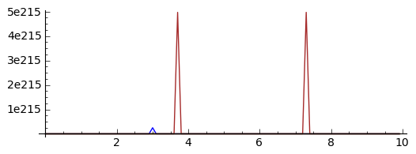
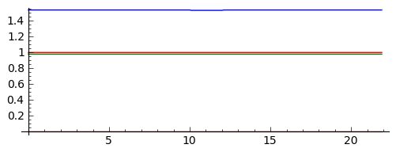

.. -*- coding: utf-8 -*-

Model Hodgkinga\-Huxleya  \- numeryka
======================================

.. code-block:: python

    sage: var('C,g_Na,m,h,g_K,G_L,V,E_Na,n,E_K,E_L,I_ext')
    sage: alpha_m(V) = 0.1*(V+40)/(1-exp(-(V+40)/10))
    sage: beta_m(V) = 4*exp(-(V+65)/18)
    sage: alpha_n(V) = 1.0/(1-exp(-(V+55)/10))
    sage: beta_n(V) = 0.125*exp(-(V+65)/80)
    sage: alpha_h(V) = 0.07*exp(-(V+65)/20)
    sage: beta_h(V) = 1.0/(1+exp(-(V+35)/10))
    sage: F_V = 1/C*( I_ext - g_Na*m^3*h*(V-E_Na)- g_K*n^4*( V- E_K )- G_L*(V- E_L)  )
    sage: F_m = alpha_m(V)*(1-m) - beta_m(V)*m
    sage: F_h = alpha_h(V)*(1-h) - beta_h(V)*h
    sage: F_n = alpha_n(V)*(1-n) - beta_n(V)*n
    sage: varlst= [V,m,h,n]
    sage: rhslst= [F_V,F_m,F_h,F_n]
    sage: pars = list(F_V.variables())
    sage: print pars
    sage: pars.remove(V)
    sage: pars.remove(m)
    sage: pars.remove(n)
    sage: pars.remove(h)
    sage: print pars

| [C, E_K, E_L, E_Na, G_L, I_ext, V, g_K, g_Na, h, m, n]
| [C, E_K, E_L, E_Na, G_L, I_ext, g_K, g_Na]

.. end of output

.. MATH::

     C \frac{dV}{dt}  = I  - G_{Na} ( V  - E_{Na})  - G_{K} ( V  - E_{K})  - G_{L} ( V  - E_{L})

   
.. MATH::

    \frac{dm}{dt} = \alpha_m  (1- m)  - \beta_m  m

   
.. MATH::

    \frac{dh}{dt} = \alpha_h  (1- h)  - \beta_h  h

   
.. MATH::

    \frac{dn}{dt} = \alpha_n  (1- n)  - \beta_n   n

.. MATH::

    \alpha_m = \frac{0.1  (V+40)} { 1 -  \exp\left[ - (V+40)/ 10\right]} 

   
.. MATH::

    \beta_m = 4 \exp\left[ - (V + 65)/18\right]

   
.. MATH::

    \alpha_h = 0.07  \exp\left[ - (V +65)/20\right]

   
.. MATH::

    \beta_h =   \frac{1}{1 +  \exp\left[ - (V+35)/10\right]} 

   
.. MATH::

    \alpha_n = \frac{0.01  (V+ 55)}{1 -  \exp\left[ - (V+ 55)/10\right]} 

   
.. MATH::

    \beta_n = 0.125  \exp\left[ - (V + 65)/80\right]

.. MATH::

    G_{Na} = g_{Na}   m^3  h

gdzie :math:`g_{Na}` jest maksymalną wartościa przewodności jonów sodowych.       

.. MATH::

    G_{K} = g_{K}   n^4

.. code-block:: python

    sage: pars
    

[C, E_K, E_L, E_Na, G_L, I_ext, g_K, g_Na]

.. end of output

.. code-block:: python

    sage: for r in rhslst:
    ...       show(rhslst)

.. MATH::

    \left[\frac{{\left(E_{\mbox{Na}} - V\right)} g_{\mbox{Na}} h m^{3} + {\left(E_{K} - V\right)} g_{K} n^{4} + {\left(E_{L} - V\right)} G_{L} + I_{\mbox{ext}}}{C}, \\ -4 \, m e^{\left(-\frac{1}{18} \, V - \frac{65}{18}\right)} + \frac{{\left(m - 1\right)} {\left(0.100000000000000 \, V + 4.00000000000000\right)}}{e^{\left(-\frac{1}{10} \, V - 4\right)} - 1}, \\ -0.0700000000000000 \, {\left(h - 1\right)} e^{\left(-\frac{1}{20} \, V - \frac{13}{4}\right)} - \frac{h}{e^{\left(-\frac{1}{10} \, V - \frac{7}{2}\right)} + 1}, \\ -0.125000000000000 \, n e^{\left(-\frac{1}{80} \, V - \frac{13}{16}\right)} + \frac{n - 1}{e^{\left(-\frac{1}{10} \, V - \frac{11}{2}\right)} - 1}\right]

.. MATH::

    \left[\frac{{\left(E_{\mbox{Na}} - V\right)} g_{\mbox{Na}} h m^{3} + {\left(E_{K} - V\right)} g_{K} n^{4} + {\left(E_{L} - V\right)} G_{L} + I_{\mbox{ext}}}{C}, \\ -4 \, m e^{\left(-\frac{1}{18} \, V - \frac{65}{18}\right)} + \frac{{\left(m - 1\right)} {\left(0.100000000000000 \, V + 4.00000000000000\right)}}{e^{\left(-\frac{1}{10} \, V - 4\right)} - 1}, \\ -0.0700000000000000 \, {\left(h - 1\right)} e^{\left(-\frac{1}{20} \, V - \frac{13}{4}\right)} - \frac{h}{e^{\left(-\frac{1}{10} \, V - \frac{7}{2}\right)} + 1}, \\ -0.125000000000000 \, n e^{\left(-\frac{1}{80} \, V - \frac{13}{16}\right)} + \frac{n - 1}{e^{\left(-\frac{1}{10} \, V - \frac{11}{2}\right)} - 1}\right]

.. MATH::

    \left[\frac{{\left(E_{\mbox{Na}} - V\right)} g_{\mbox{Na}} h m^{3} + {\left(E_{K} - V\right)} g_{K} n^{4} + {\left(E_{L} - V\right)} G_{L} + I_{\mbox{ext}}}{C}, \\ -4 \, m e^{\left(-\frac{1}{18} \, V - \frac{65}{18}\right)} + \frac{{\left(m - 1\right)} {\left(0.100000000000000 \, V + 4.00000000000000\right)}}{e^{\left(-\frac{1}{10} \, V - 4\right)} - 1}, \\ -0.0700000000000000 \, {\left(h - 1\right)} e^{\left(-\frac{1}{20} \, V - \frac{13}{4}\right)} - \frac{h}{e^{\left(-\frac{1}{10} \, V - \frac{7}{2}\right)} + 1}, \\ -0.125000000000000 \, n e^{\left(-\frac{1}{80} \, V - \frac{13}{16}\right)} + \frac{n - 1}{e^{\left(-\frac{1}{10} \, V - \frac{11}{2}\right)} - 1}\right]

.. MATH::

    \left[\frac{{\left(E_{\mbox{Na}} - V\right)} g_{\mbox{Na}} h m^{3} + {\left(E_{K} - V\right)} g_{K} n^{4} + {\left(E_{L} - V\right)} G_{L} + I_{\mbox{ext}}}{C}, \\ -4 \, m e^{\left(-\frac{1}{18} \, V - \frac{65}{18}\right)} + \frac{{\left(m - 1\right)} {\left(0.100000000000000 \, V + 4.00000000000000\right)}}{e^{\left(-\frac{1}{10} \, V - 4\right)} - 1}, \\ -0.0700000000000000 \, {\left(h - 1\right)} e^{\left(-\frac{1}{20} \, V - \frac{13}{4}\right)} - \frac{h}{e^{\left(-\frac{1}{10} \, V - \frac{7}{2}\right)} + 1}, \\ -0.125000000000000 \, n e^{\left(-\frac{1}{80} \, V - \frac{13}{16}\right)} + \frac{n - 1}{e^{\left(-\frac{1}{10} \, V - \frac{11}{2}\right)} - 1}\right]

.. end of output

read :math:`V_{Na} = 50 mV`, VK = 77 mV, VL = 54:4 mV, and C = 1 F/cm2  more, the leakage conductance is assumed to be constant, GL = 0:3 mS/cm2 .

e g max K = 36 mS/cm2 and g max Na = 120 mS/cm2 d

.. code-block:: python

    sage: print pars
    sage: set1 = {g_K:36,g_Na:120,E_Na:50,E_K:-77,E_L:-54.4,C:1.0,G_L:0.3,I_ext:0.}
    sage: set2 = {g_K:36,g_Na:120,E_Na:50,E_K:-77,E_L:-54.4,C:1.0,G_L:0.3,I_ext:8000.}
    sage: print [p.subs(set1) for p in pars]

| [C, E_K, E_L, E_Na, G_L, I_ext, g_K, g_Na]
| [1.00000000000000, -77, -54.4000000000000, 50, 0.300000000000000, 0.000000000000000, 36, 120]

.. end of output

.. code-block:: python

    sage: #0<n<1, 0<h<1, 0<m<1 and -77<V<50,
    sage: varlst

[V, m, h, n]

.. end of output

.. code-block:: python

    sage: f=[r.subs(set1) for r in rhslst]
    sage: ic = [10,.5,.5,.5]
    sage: t = srange(0,10,0.1)
    sage: sol=desolve_odeint(f,ic,t,varlst)

\ 
     lsoda--  warning..internal t (=r1) and h (=r2) are
           such that in the machine, t + h = t on the next step  
           (h = step size). solver will continue anyway
          In above,  R1 =  0.1846727420878E+01   R2 =  0.4391583337979E-16
     lsoda--  warning..internal t (=r1) and h (=r2) are
           such that in the machine, t + h = t on the next step  
           (h = step size). solver will continue anyway
          In above,  R1 =  0.1846727420878E+01   R2 =  0.4391583337979E-16
     lsoda--  warning..internal t (=r1) and h (=r2) are
           such that in the machine, t + h = t on the next step  
           (h = step size). solver will continue anyway
          In above,  R1 =  0.1846727420878E+01   R2 =  0.4391583337979E-16
     lsoda--  warning..internal t (=r1) and h (=r2) are
           such that in the machine, t + h = t on the next step  
           (h = step size). solver will continue anyway
          In above,  R1 =  0.1846727420878E+01   R2 =  0.4391583337979E-16
     lsoda--  warning..internal t (=r1) and h (=r2) are
           such that in the machine, t + h = t on the next step  
           (h = step size). solver will continue anyway
          In above,  R1 =  0.1846727420878E+01   R2 =  0.4391583337979E-16
     lsoda--  warning..internal t (=r1) and h (=r2) are
           such that in the machine, t + h = t on the next step  
           (h = step size). solver will continue anyway
          In above,  R1 =  0.1846727420878E+01   R2 =  0.4391583337979E-16
     lsoda--  warning..internal t (=r1) and h (=r2) are
           such that in the machine, t + h = t on the next step  
           (h = step size). solver will continue anyway
          In above,  R1 =  0.1846727420878E+01   R2 =  0.4391583337979E-16
     lsoda--  warning..internal t (=r1) and h (=r2) are
           such that in the machine, t + h = t on the next step  
           (h = step size). solver will continue anyway
          In above,  R1 =  0.1846727420878E+01   R2 =  0.4391583337979E-16
     lsoda--  warning..internal t (=r1) and h (=r2) are
           such that in the machine, t + h = t on the next step  
           (h = step size). solver will continue anyway
          In above,  R1 =  0.1846727420878E+01   R2 =  0.4391583337979E-16
     lsoda--  warning..internal t (=r1) and h (=r2) are
           such that in the machine, t + h = t on the next step  
           (h = step size). solver will continue anyway
          In above,  R1 =  0.1846727420878E+01   R2 =  0.8783166675959E-16
     lsoda--  above warning has been issued i1 times.  
           it will not be issued again for this problem
          In above message,  I1 =        10
     lsoda--  at current t (=r1), mxstep (=i1) steps   
           taken on this call before reaching tout     
          In above message,  I1 =       500
          In above message,  R1 =  0.1846727420878E+01
    Excess work done on this call (perhaps wrong Dfun type).
    Run with full_output = 1 to get quantitative information.

.. end of output

.. code-block:: python

    sage: scal=[0.05,1.,1.,1.]
    sage: Xst = [zip(t,scal[i]*sol[:,i]) for i in range(4)]
    sage: col = ['blue','red','brown','green']

.. end of output

.. code-block:: python

    sage: sum([line(Xst[i],color=col[i],figsize=(6,2)) for i in range(4)])

.. end of output

.. code-block:: python

    sage: sol[-1]

array([  7.67888551e+01,   9.99870103e-01,   8.35248468e-05,   9.79176017e-01])

.. end of output

.. code-block:: python

    sage: set1 = {g_K:36,g_Na:120,E_Na:50,E_K:-77,E_L:-54.4,C:1.0,G_L:0.3,I_ext:0.}
    sage: set2 = {g_K:36,g_Na:120,E_Na:50,E_K:-77,E_L:-54.4,C:1.0,G_L:0.3,I_ext:-8.}
    sage: f1=[r.subs(set1) for r in rhslst]
    sage: f2=[r.subs(set2) for r in rhslst]
    sage: ic = [7.67888551e+01,   9.99870103e-01,   8.35248468e-05,9.79176017e-01]
    sage: t1 = srange(0,10,0.1)
    sage: sol1=desolve_odeint(f1,ic,t1,varlst)
    sage: t2 = srange(10,12,0.1)
    sage: ic = sol1[-1]
    sage: sol2=desolve_odeint(f2,ic,t2,varlst)
    sage: t3 = srange(12,22,0.1)
    sage: ic = sol2[-1]
    sage: sol3=desolve_odeint(f1,ic,t3,varlst)

\ 
     lsoda--  warning..internal t (=r1) and h (=r2) are
           such that in the machine, t + h = t on the next step  
           (h = step size). solver will continue anyway
          In above,  R1 =  0.5879507051058E-01   R2 =  0.1734855097409E-17
     lsoda--  warning..internal t (=r1) and h (=r2) are
           such that in the machine, t + h = t on the next step  
           (h = step size). solver will continue anyway
          In above,  R1 =  0.5879507051058E-01   R2 =  0.6939420389637E-18
     lsoda--  warning..internal t (=r1) and h (=r2) are
           such that in the machine, t + h = t on the next step  
           (h = step size). solver will continue anyway
          In above,  R1 =  0.5879507051058E-01   R2 =  0.6939420389637E-18
     lsoda--  warning..internal t (=r1) and h (=r2) are
           such that in the machine, t + h = t on the next step  
           (h = step size). solver will continue anyway
          In above,  R1 =  0.5879507051058E-01   R2 =  0.6939420389637E-18
     lsoda--  warning..internal t (=r1) and h (=r2) are
           such that in the machine, t + h = t on the next step  
           (h = step size). solver will continue anyway
          In above,  R1 =  0.5879507051058E-01   R2 =  0.6939420389637E-18
     lsoda--  warning..internal t (=r1) and h (=r2) are
           such that in the machine, t + h = t on the next step  
           (h = step size). solver will continue anyway
          In above,  R1 =  0.5879507051058E-01   R2 =  0.1387884077927E-17
     lsoda--  warning..internal t (=r1) and h (=r2) are
           such that in the machine, t + h = t on the next step  
           (h = step size). solver will continue anyway
          In above,  R1 =  0.5879507051058E-01   R2 =  0.1387884077927E-17
     lsoda--  warning..internal t (=r1) and h (=r2) are
           such that in the machine, t + h = t on the next step  
           (h = step size). solver will continue anyway
          In above,  R1 =  0.5879507051058E-01   R2 =  0.1387884077927E-17
     lsoda--  warning..internal t (=r1) and h (=r2) are
           such that in the machine, t + h = t on the next step  
           (h = step size). solver will continue anyway
          In above,  R1 =  0.5879507051058E-01   R2 =  0.3045928433311E-17
     lsoda--  warning..internal t (=r1) and h (=r2) are
           such that in the machine, t + h = t on the next step  
           (h = step size). solver will continue anyway
          In above,  R1 =  0.5879507051058E-01   R2 =  0.3045928433311E-17
     lsoda--  above warning has been issued i1 times.  
           it will not be issued again for this problem
          In above message,  I1 =        10
     lsoda--  at current t (=r1), mxstep (=i1) steps   
           taken on this call before reaching tout     
          In above message,  I1 =       500
          In above message,  R1 =  0.5879507051058E-01
    Excess work done on this call (perhaps wrong Dfun type).
    Run with full_output = 1 to get quantitative information.
     lsoda--  warning..internal t (=r1) and h (=r2) are
           such that in the machine, t + h = t on the next step  
           (h = step size). solver will continue anyway
          In above,  R1 =  0.1090538481382E+02   R2 =  0.6571733269282E-15
     lsoda--  warning..internal t (=r1) and h (=r2) are
           such that in the machine, t + h = t on the next step  
           (h = step size). solver will continue anyway
          In above,  R1 =  0.1090538481382E+02   R2 =  0.6571733269282E-15
     lsoda--  warning..internal t (=r1) and h (=r2) are
           such that in the machine, t + h = t on the next step  
           (h = step size). solver will continue anyway
          In above,  R1 =  0.1090538481382E+02   R2 =  0.6571733269282E-15
     lsoda--  warning..internal t (=r1) and h (=r2) are
           such that in the machine, t + h = t on the next step  
           (h = step size). solver will continue anyway
          In above,  R1 =  0.1090538481382E+02   R2 =  0.6571733269282E-15
     lsoda--  warning..internal t (=r1) and h (=r2) are
           such that in the machine, t + h = t on the next step  
           (h = step size). solver will continue anyway
          In above,  R1 =  0.1090538481382E+02   R2 =  0.7196890136021E-15
     lsoda--  warning..internal t (=r1) and h (=r2) are
           such that in the machine, t + h = t on the next step  
           (h = step size). solver will continue anyway
          In above,  R1 =  0.1090538481382E+02   R2 =  0.1023101705473E-15
     lsoda--  warning..internal t (=r1) and h (=r2) are
           such that in the machine, t + h = t on the next step  
           (h = step size). solver will continue anyway
          In above,  R1 =  0.1090538481382E+02   R2 =  0.1023101705473E-15
     lsoda--  warning..internal t (=r1) and h (=r2) are
           such that in the machine, t + h = t on the next step  
           (h = step size). solver will continue anyway
          In above,  R1 =  0.1090538481382E+02   R2 =  0.1023101705473E-15
     lsoda--  warning..internal t (=r1) and h (=r2) are
           such that in the machine, t + h = t on the next step  
           (h = step size). solver will continue anyway
          In above,  R1 =  0.1090538481382E+02   R2 =  0.2046203410947E-15
     lsoda--  warning..internal t (=r1) and h (=r2) are
           such that in the machine, t + h = t on the next step  
           (h = step size). solver will continue anyway
          In above,  R1 =  0.1090538481382E+02   R2 =  0.2046203410947E-15
     lsoda--  above warning has been issued i1 times.  
           it will not be issued again for this problem
          In above message,  I1 =        10
     lsoda--  at current t (=r1), mxstep (=i1) steps   
           taken on this call before reaching tout     
          In above message,  I1 =       500
          In above message,  R1 =  0.1090538481382E+02
    Excess work done on this call (perhaps wrong Dfun type).
    Run with full_output = 1 to get quantitative information.

.. end of output

.. code-block:: python

    sage: import numpy as np
    sage: sol = np.concatenate( (sol1,sol2,sol3) )
    sage: t = np.concatenate( (t1,t2,t3) )
    sage: scal=[0.02,1.,1.,1.]
    sage: Xst = [zip(t,scal[i]*sol[:,i]) for i in range(4)]
    sage: col = ['blue','red','brown','green']
    sage: sum([line(Xst[i],color=col[i],figsize=(6,2)) for i in range(4)])

.. end of output

