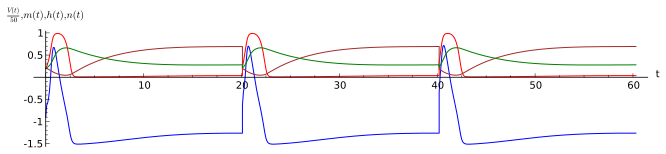

.. -*- coding: utf-8 -*-

Numeryczna analiza rozwiązań układu Hodgkina-Huxley'a
-----------------------------------------------------

Przeanalizujmy numerycznie układ Hodgkina-Huxley'a. W tym celu
zdefiniujmy funkcje :math:`\alpha_m`, :math:`\beta_m` itp., Prawe
strony całego układu równań różniczkowych zapiszemy na liście
`rhslst`, a zmienne na liście `varlst`. 

.. sagecellserver::

    sage: var('C,g_Na,m,h,g_K,G_L,V,E_Na,n,E_K,E_L,I_ext')
    sage: alpha_m(V) = 0.1*(V+35.)/(1.-exp(-(V+35.)/10.))
    sage: beta_m(V) = 4.*exp(-(V+60)/18.)
    sage: alpha_h(V) = 0.07*exp(-(V+60.)/20.)
    sage: beta_h(V) = 1.0/(1.+exp(-(V+30.)/10.))
    sage: alpha_n(V) = 0.01*(V+50.)/(1-exp(-(V+50.)/10.))
    sage: beta_n(V) = 0.125*exp(-(V+65.)/80.)
    sage: F_V = 1/C*( I_ext - g_Na*m^3*h*(V-E_Na)- g_K*n^4*( V- E_K )- G_L*(V- E_L)  )
    sage: F_m = alpha_m(V)*(1-m) - beta_m(V)*m
    sage: F_h = alpha_h(V)*(1-h) - beta_h(V)*h
    sage: F_n = alpha_n(V)*(1-n) - beta_n(V)*n
    sage: varlst= [V,m,h,n]
    sage: rhslst= [F_V,F_m,F_h,F_n]
    sage: html.table([[ F_V*C],[F_m],[F_h],[F_n]])

.. end of output

Zdefiniumy sobie dwa zestawy parametrów, bez sygnału - `set1` i z sygnałem `set2`:

.. sagecellserver::

    sage: set1 = {g_K:36,g_Na:120,E_Na:50,E_K:-77,E_L:-54.4,C:1.0,G_L:0.3,I_ext:0.}
    sage: set2 = {g_K:36,g_Na:120,E_Na:50,E_K:-77,E_L:-54.4,C:1.0,G_L:0.3,I_ext:120.}

.. end of output

Charakterystyczne zachowanie się układu jest widoczne w dwóch typowych rozwiązaniach:

- dla :math:`V_0 = -60` (czerwony) mamy charakterystyczny pik i relaksację 
- dla :math:`V_0 = -30` (zielony) mamy relaksację 

.. sagecellserver::

    sage: f=[r.subs(set1) for r in rhslst]
    sage: t = srange(0,20.1,.1)
    sage: ic = [-30,.2,.2,.3]
    sage: sol = desolve_odeint(f,ic,t,varlst)
    sage: ic = [-60,.2,.2,.3]
    sage: sol_spike = desolve_odeint(f,ic,t,varlst)
    sage: line(zip(t,sol_spike[:,0]),color="green",figsize=(8,3)) +\
    ...    line(zip(t,sol[:,0]),color="red") 

Możemy dokładnie przyjrzeć się jak zmienia się rozwiązanie w
zależności od warunku początkowego, manipulując elementem
interaktywnym:

.. sagecellserver::

    sage: @interact
    sage: def _(V0=slider(-70,0,0.1)):
    ...       ic = [V0,.2,.2,.3]
    ...       f=[r.subs(set1) for r in rhslst]
    ...       t = srange(0,25.1,.1)
    ...       sol = desolve_odeint(f,ic,t,varlst)
    ...       line(zip(t,sol[:,0]),figsize=(8,3),ymin=-77,ymax=30).show() 

.. end of output

Sygnałem dla neuronu jest :math:`I_{ext}` - powoduje on zmniejszenie
potencjału tak, że neuron znajduje się w reżimie "spike". Możemy
przekonać się jak ciąg "spike"ów prądu :math:`I_{ext}` przekłada się
na reakcę neurownów. W tym celu  wykonujemy naprzemian:

- przez któtki czas symulujemy układ z :math:`I_{ext}=120` (`set2`)
- następnie wykorzystuąc stan układu jako warunek początkowy
  symulujemy przez dłuższy czas układ przy :math:`I_{ext}=0` - czyli
  dla zestwu parametrów `set1`

Poeksperymentujmy sami:

.. sagecellserver::

    sage: import numpy as np
    sage: col = ['blue','red','brown','green']
    sage: f1=[r.subs(set1) for r in rhslst]
    sage: f0=[r.subs(set2) for r in rhslst]
    sage: dt1 = np.linspace(0,0.1,3)
    sage: dt2 = np.linspace(0,20.,210)
    sage: ic = [-45,.2,.2,.2]
    sage: tend = 0.0
    sage: sol = np.array(2*[ic])
    sage: t = np.array([0,0])
    sage: for i in range(4):
    ...       
    ...       t0 = dt1 +tend
    ...       sol1 = desolve_odeint(f0,ic,t0,varlst)
    ...       ic = sol1[-1]
    ...       t1 = dt2+t0[-1]
    ...       sol2 = desolve_odeint(f1,ic,t1,varlst)
    ...       tend += dt1[-1] + dt2[-1]
    ...       sol = np.concatenate( (sol,sol1,sol2) )
    ...       t = np.concatenate( (t,t0,t1) )
    ...       
    sage: scal=[0.02,1.,1.,1.]
    sage: Xst = [zip(t,scal[i]*sol[:,i]) for i in range(4)]
    sage: col = ['blue','red','brown','green']
    sage: sum([line(Xst[i],color=col[i],figsize=(8,2)) for i in range(4)])

