.. -*- coding: utf-8 -*-

Reakcje Biełusowa\-Żabotyńskiego
================================

Wstęp: opis reakcji 
-------------------

Istnieje wiele przykładów reakcji Biełousowa\-Żabotyńskiego (będziemy czasami używali skrótu B\-Ż). Są one niezwykłe i mają niezwykłą historię. Dlaczego? Ponieważ są to reakcje oscylacyjne. W 1951 roku Biełousow opisał taką reakcję i napisał pracę na ten temat. Edytorzy czasopisma, do którego został wysłany maszynopis pracy, nie zaakceptowali  jej do druku, nie wierząc w jej wyniki. Sześć lat później, Biełousow znowu wysłał pracę do publikacji, ale tym razem do innego czasopisma. I znowu edytorzy byli sceptyczni. Zaproponowali aby przedstawić tylko opis reakcji, ale Bielousow nie zgodził się. Obrażony postanowił nie wysyłać więcej jej do publikacji. W 1961 roku inny adept radzieckiej nauki, Żabotyński odkrył odkrytą  już reakcję, ale o tym nie wiedział. Na szczęście opiekun naukowy Żabotyńskiego znał wyniki prac Biełousowa i prosił swego podopiecznego o kontakt z Biełousowem. Niestety, w tamtych czasach nie było ani telefonii komórkowej, ani internetu. Dopiero w 1968 roku, w czasie obrad sympozjum w Pradze, świat zachodni dowiedział się o tych niezwykłych reakcjach.  

Reakcje oscylacyjne  występują np.  w wodnym roztworze w temperaturze pokojowej, w której zachodzą okresowe zmiany barwy roztworu z okresem ok. jednej minuty.  Na podstawowy mechanizm reakcji  składa się utlenianie kwasu malanowego w środowisku kwaśnym przez jony bromianowe BrO :sub:`3` w obecności katalizatora - jonów ceru. Okresowe oscylacje obserwowane są w stężeniu jonów ceru. Oscylacje przejawiają  się jako zmiany koloru przy przejściu Ce :sup:`3+` w Ce :sup:`4+` . Obecnie znanych jest wiele reakcji, które mogą zachowywać się okresowo. Mianem reakcji BŻ nazywa się klasę reakcji, w których związek organiczny jest utleniany przez jony bromianowe wspomagane jonami metalu w środowisku kwaśnym. Jeśli substraty dyfundują mogą się wówczas wytwarzać wzory przestrzenne. Dla katalizatorów będących jonami innych metali np. żelaza Fe :sup:`2+` i Fe :sup:`3+` zmiany barw mogą być bardziej spektakularne czerwony ↔ niebieski.  Istnieją jeszcze inne reakcje tego typu.  Np. reakcja Briggsa-Rauschera jest jeszcze atrakcyjniejsza, bo oscylacje są bardzo kontrastowe (bezbarwny-złoty-granatowy) i bardzo szybkie: co kilkanaście sekund; a jej uruchomienie jest bardzo proste. Reagenty: zakwaszony roztwór jodanu, kwasu malonowego, nadtlenku wodoru, katalizowany solą manganawą, z dodatkiem skrobi. Mechanizm tej reakcji jest słabo poznany; prawdopodobnie są to dwie sprzężone reakcje oscylacyjne. 

W przykładowej  reakcji  miesza się trzy wyjściowe roztwory wodne, które zaraz po zmieszaniu dają barwę zieloną, która po chwili przechodzi w niebieską, purpurową, czerwoną aż do powrotu do zieleni. Roztworami tymi są:

    0,23 M KBrO :sub:`3` (bromian(V) potasu)

    0,31 M kwas malonowy (lub kwas cytrynowy) \+ 0,059 M KBr

    0,019 M (NH :sub:`4`) :sub:`2` Ce(NO :sub:`3`) :sub:`6` + 2,7 M H :sub:`2` SO :sub:`4`

Oprócz tego do układu reakcji dodaje się niewielką ilość ferroiny, która zmienia barwę w wyniku ubocznej reakcji redoks, lecz nie wpływa bezpośrednio na przebieg całego procesu. 

W sprzyjających warunkach, przy bardzo dokładnym utrzymaniu proporcji i przy zachowaniu idealnej czystości cykl powtarza się kilkanaście razy.  Po zmieszaniu zakwaszonego roztworu bromianu, kwasu malonowego, soli ceru oraz wskaźnika \- ferroiny, przez pewien czas istnieje stan indukcji. Szczegółowy mechanizm reakcji jest bardzo zawiły.  Obejmuje trzy grupy złożonych procesów, które skrótowo opiszemy poniżej. 

 

W roztworze początkowo istnieje pewne stężenie jonów bromkowych, które pełnią kluczową rolę w całym mechanizmie. Jony bromkowe są powoli usuwane w wyniku utleniania bromianem: 

(A) 2Br :sup:`–` + BrO :sub:`3` :sup:`-`  + 3CH :sub:`2` (COOH) :sub:`2` + 3H :sup:`+`  = 3CHBr(COOH) :sub:`2` + 3H :sub:`2` O

W wyniku reakcji A stężenie jonów bromkowych stopniowo maleje. Z chwilą, gdy spadnie ono poniżej pewnej dolnej wartości progowej, zachodzi raptowne utlenienie jonów cerawych do jonów cerowych:

(B) 4Ce :sup:`3+` + BrO :sub:`3` :sup:`–`  + CH :sub:`2` (COOH) :sub:`2` + 5H :sup:`+`  = 4Ce :sup:`4+` + CHBr(COOH) :sub:`2` + 3H :sub:`2` O

Jest to reakcja autokatalityczna, która jest skutecznie hamowana przez jony bromkowe. Aby mogła zajść, trzeba poczekać, aż stężenie jonów bromkowych spadnie poniżej pewnej dolnej wartości progowej. W wyniku autokatalizy jony ceru bardzo raptownie przechodzą w postać utlenioną; towarzyszy temu gwałtowna zmiana barwy wskaźnika na niebieski.

W kolejnej fazie powstały kwas bromomalonowy zostaje utleniany, uwalniane są aniony bromkowe, których stężenie rośnie w wyniku reakcji C szybciej, niż ich konsumpcja w reakcji A. Stężenie utlenionej postaci ceru maleje, a wskaźnik stopniowo zmienia barwę na różową.

(C) 4Ce :sup:`4+` + CHBr(COOH) :sub:`2` + 2H :sub:`2` O = Br :sup:`–` + 4Ce :sup:`3+` +  HCOOH + 2CO :sub:`2` + 5H :sup:`+`

Po przekroczeniu pewnej górnej wartości progowej stężenia bromku, następuje ponowne zablokowanie autokatalitycznej reakcji B (autoinhibicja). Powstają duże ilości jonów bromkowych. Trzeba odczekać, aż zostaną one skonsumowane w reakcji A. Potem cykl zostaje kolejny raz odtworzony. Oscylacje zachodzą tylko do czasu osiągnięcia minimalnego granicznego odchylenia od stanu równowagi; dalszy przebieg ma charakter monotoniczny.

Sumarycznie reakcja ta sprowadza się do odwracalnego utlenienia kwasu malonowego do dwutlenku węgla przez jony bromianowe, zaś jony ceru pełnią w procesie rolę katalizatora:

3 CH :sub:`2` (COOH) :sub:`2` + 4 BrO :sub:`3` :sup:`-` → 4 Br :sup:`-` + 9 CO :sub:`2` + 6 H :sub:`2` O

W istocie jednak reakcja ta składa się z dwóch procesów zachodzących cyklicznie jeden po drugim.

Pierwszy proces (A) przebiega sumarycznie wg równania:

BrO :sub:`3` :sup:`-` + 5 Br :sup:`-` + 6 H :sup:`+` → 3 Br :sub:`2` + 3 H :sub:`2` O

i składa się z następujących reakcji elementarnych:

BrO :sub:`3` :sup:`-` + Br :sup:`-` + 2 H :sup:`+` → HBrO :sub:`2` + HOBr

HBrO :sub:`2` + Br :sup:`-` + H :sup:`+` → 2 HOBr

HOBr + Br :sup:`-` + H :sup:`+` → Br :sub:`2` + H :sub:`2` O

Powstający brom reaguje z kwasem malonowym wg równania:

Br :sub:`2` + CH :sub:`2` (COOH) :sub:`2` → BrCH(COOH) :sub:`2` + Br :sup:`-` + H :sup:`+`

Druga reakcja (B) przebiega sumarycznie następująco:

2 BrO :sub:`3` :sup:`-` + 12 H :sup:`+` + 10 Ce :sup:`3+` → Br :sub:`2` + 6 H :sub:`2` O + 10 Ce :sup:`4+`

i składa się z następujących aktów elementarnych:

BrO :sub:`3` :sup:`-` + HBrO :sub:`2` + H :sup:`+` → 2 BrO :sub:`2` • + H :sub:`2` O

BrO :sub:`2` • + Ce :sup:`3+` + H :sup:`+` → HBrO :sub:`2` + Ce :sup:`4+`

2 HBrO :sub:`2` → HOBr + BrO :sub:`3` :sup:`-` + H :sup:`+`

2 HOBr → HBrO :sub:`2` + Br :sup:`-` + H :sup:`+`

HOBr + Br :sup:`-` + H :sup:`+` → Br :sub:`2` + H :sub:`2` O

Kluczowy wpływ na zmianę barwy ma cykliczna zmiana stężenia jonów Ce :sup:`3+` i Ce :sup:`4+`, które sumarycznie można przedstawić w formie następującego równania:

2 Ce :sup:`3+` + BrO :sub:`3` :sup:`-` + HBrO :sub:`2` + 3 H :sup:`+` → 2 Ce :sup:`4+` + H :sub:`2` O + 2 HBrO :sub:`2`

4Ce :sup:`4+`  + CHBr(COOH) :sub:`2` + 2H :sub:`2` O = Br :sup:`–` + 4Ce :sup:`3+` +  HCOOH + 2CO :sub:`2` + 5H :sup:`+`

Powstające jony ceru Ce :sup:`4+` utleniają atomy żelaza(II) do żelaza(III). Jony Ce :sup:`3+` są bezbarwne, jony Ce :sup:`4+`  posiadają intensywnie żółtą barwę. Kompleks ferroiny z atomami żelaza(II) ma barwę czerwoną, zaś z atomami żelaza(III) niebieską. Kombinacja żółtej barwy jonów Ce :sup:`4+`  i niebieskiej kompleksu ferroiny z atomami żelaza(III) daje w efekcie barwę zieloną.

Cykliczne zmiany stężenia jonów Ce :sup:`3+` i Ce :sup:`4+` wynikają z następującej kombinacji zjawisk:

reakcja (B) ma charakter autokatalityczny \- początkowo zatem przebiega bardzo powoli, aby w pewnym momencie nagle gwałtownie przyspieszyć

reakcja (A) zachodzi przy odpowiednio wysokim, granicznym stężeniu jonów bromianowych (BrO :sub:`3` :sup:`-`), które są generowanie w reakcji (B)

Stężenie początkowych roztworów jest tak dobrane, aby najpierw zaszła szybko reakcja (A), zanim reakcja (B) zdąży nabrać tempa i jednocześnie tak, aby reakcja (B) zdążyła się "rozpędzić", zanim w układzie całkowicie nie zanikną jony bromkowe  Br :sup:`-`  i H :sup:`+`. W związku z tym, w układzie dominuje najpierw reakcja (A), która nie ma bezpośredniego wpływu na zmianę barwy, a następnie większą rolę zaczyna odgrywać reakcja (B), która jednak jednocześnie dostarcza substratu dla reakcji (A), co po pewnym czasie powoduje ponowne przyspieszenie (A) i spowolnienie (B).

Równania kinetyczne: oregonator  
-------------------------------

W literaturze opis reakcji B\-Ż  nie jest jednolity. Można pogubić się w tym, ile jest reakcji elementarnych, ile istotnych, ile pośrednich, itd. Opisane powyżej wszystkie reakcje chamiczne są trudne do modelowania matematycznego. Jednak praktyka i doświadczenie w modelowaniu  pokazuje, że należy uwzględnić tylko najbardziej istotne elementy jakie pojawiają się w powyższych reakcjach. Innymi słowy, należy umiejętnie zredukować ilość reakcji i sformułować efektywne reakcje. Jeden z takich zredukowanych modeli został opracowany przez Fielda, Korosa i  Noyesa (1974)  z  University of  Oregon. Dlatego nazywa się "oregonatorem" lub mechanizmem FKN. Jest zbudowany z 5 elementarnych reakcji jakie pojawiają sie w reakcjach Biełousowa\-Żabotyńskiego.  Niech student/studentka (hm, nie jestem pewien: jeżeli minister/ministra to może student/studenta??)  postara się je odszukać w powyższym gąszczu i porówna z poniżej zaprezentowanymi 5 reakcjami.   Wprowadźmy oznaczenia dla odpowiednich stężeń:

X = [HBrO :sub:`2` ] ,     Y = [Br :sup:`−` ],        Z = [Ce :sup:`4+`],         A= [BrO :sub:`3` :sup:`−` ],            B = [CH :sub:`2` (COOH) :sub:`2` ],           P = [HOBr]  lub  P=[BrCH(COOH) :sub:`2`]

Koncentracje A,  B oraz P  nie zmieniają się (lub zmieniają sie bardzo wolno w porównaniu do zamian stężeń X, Y oraz Z.   Efektywne reakcje to reakcje:

A\+Y → X \+P w tempie :math:`k_1`

X \+ Y → 2P w tempie :math:`k_2`

A \+ X → 2X \+ 2Z w tempie :math:`k_3`
  
2X → A \+ P w tempie :math:`k_4`

B \+ Z →  u Y w tempie :math:`k_5`

Symbol u w ostatniej reakcji to  **współczynnik stechiometryczny** (liczba przypisana do określonego reagenta określająca proporcję w jakiej uczestniczy on w reakcji w stosunku do innych reagentów).

Uwaga: W prawie wszystkich źródłach (ksiązkach, pracach, in ternecie), używa się oznaczenia f na ten współczynnik. Ale  my rezerwujemy f do tradycyjnego oznaczania funkcji.

Odpowiedznie równania kinetyczne są postaci:

.. MATH::

    \begin{array}{l}
    \frac{dX}{dt} =  k_1  A  Y − k_2  X  Y + k_3  A  X − k_4  X^ 2 , \\ \frac{dY}{dt} =  −k_1  A  Y − k_2  X  Y + u  k_5  B  Z , \\ \frac{dZ}{dt} =  2  k_3  A  X − k_5  B  Z
    \end{array}

Należy te równania przeskalować do nowych zmiennych

.. MATH::

     x=\frac{X}{X_0}, \quad \quad y=\frac{Y}{Y_0}, \quad \quad z=\frac{Z}{Z_0}, \quad \quad \tau=\frac{t}{t_0}

gdzie

.. MATH::

    \begin{array}{l}
    X_0=\frac{k_3 A}{k_4}, \quad \quad Y_0=\frac{k_3 A}{k_2}, \quad \quad Z_0=\frac{ (k_3 A)^2}{k_4 k_5 B}, \\ t_0=\frac{1}{k_5 B}, \quad \quad  c=\frac{k_5 B}{k_3 A}, \quad \quad  \delta =\frac{k_4 k_5 B}{k_2 k_3 A}, \quad \quad q=\frac{k_1 k_4}{k_2 k_3}
    \end{array}

Przeskalowane równania redukują się do postaci zwanej "oregonatorem":

.. MATH::

    \begin{array}{l}
      c \, \frac{dx}{d\tau}= q y -x y + x(1 - x) \equiv f(x, y, z), \\ \delta\,  \frac{dy}{d\tau} = -q y - x y +u z \equiv g(x, y, z), \\ \frac{dz}{d\tau} = x-z \equiv h(x, y, z) \quad \mbox{OREGONATOR}
    \end{array}

Ta postać równań jest powszechnie stosowana do opisu reakcji B-Ż. W równanich tych występują 4 parametry: :math:`c, q, \delta, u`. Rząd ich wielkości jest następujący:

.. MATH::

     c = 5 \times 10^{-5}, \quad q = 8 \times 10^{-4}, \quad  \delta = 2 \times 10^{-4}, \quad  u =1

Znalazłem też taki zestaw danych (patrz:  `http://www.rose\-hulman.edu/search.aspx?q=bielousov <http://www.rose-hulman.edu/search.aspx?q=bielousov>`_):

.. MATH::

     c = 4 \times 10^{−2} , \quad  q = 8 \times  10^{−4}, \quad  \delta  = 4 \times  10^{−4}.

Własności "oregonatora" 
========================

Reakcje opisywane za pomocą "oregonatora" posiadają bogactwo własności dynamicznych ponieważ "oregonator" to układ dynamiczny opisywany przez układ 3 równań różniczkowych zwyczajnych pierwszego rzędu. Jego tzw. przestrzeń fazowa to zbiór możliwych wartości :math:`\{x, y, z\}`, a  wymiar tej przestrzeni oczywiście  wynosi 3. Jak udowodnili nasi przyjaciele matematycy, jest to minimalny wymiar przestrzeni, aby układ mógł wykazywać  **własności chaotyczne.**   Dynamika takiego układu może w ogólności wykazywać następujące cechy:

1. istnienie stanów  stacjonarnych

2. istnienie orbit periodycznych

3. istnienie orbit chaotycznych

4. istnienie dziwnych atraktorów

Okazuje się, że oryginalny  "oregonator" przedstawiony tutaj, nie wykazuje własności chaotycznych.  Oznacza to,  że własności 3 oraz 4 nie można zaobserwować dla tego modelu. W 1992 roku, zaproponowano zmodyfikowany model reakcji    B\-Ż który wykazuje chaos. Szczegóły można znależć w oryginalnej pracy:

L. Gyorgyi and  R. J.  Field,  (1992) *A Three\-Variable Model of Deterministic Chaos in the Belousov\-Zhabotinsky Reaction*. Nature, 355, 808\-810.

Stany stacjonarne 
-----------------

Zbadajmy, czy istnieją stany stacjonarne i czy są one stabilne.  Podobnie jak w analizie dynamiki populacyjnej, warunkiem na istnienie stanów stacjonarnych jest istnienie rozwiązań układu 3 równań algebraicznych  otrzymanych jako prawe strony "oregonatora"

.. MATH::

    f(x, y, z)=0, \quad \quad \quad    g(x, y, z) =0, \quad \quad \quad h(x, y, z)=0

czyli

.. MATH::

       q y -x y + x(1 - x) =0, \quad \quad \quad    -q y - x y +u z  =0,  \quad \quad \quad  x-z  =0 \quad \quad \quad \quad \mbox{stany stacjonarne}

Na szczęście układ tych równań jest łatwo rozwiązać. Z trzeciego równania otrzymujemy równość :math:`z=x`. Wstawiamy to do drugiego równania, z którego wyznaczamy :math:`y` i to wstawiamy do pierwszego równania. W wynku otrzymujemy:

.. MATH::

    z=x, \quad \quad \quad y = \frac{ u x}{q+x}, \quad \quad \quad x[1-x]  + u x   \frac {q-x}{q+x} = 0

Łatwo spoztrzegamy, że :math:`x=0`   spełnia trzecie równanie. wstawiając to do pierwszego i drugiego równania otrzymujemy :math:`y=0`   oraz   :math:`z=0`.  Tak więc mamy jeden stan stacjonarmy:

.. MATH::

    (x_0, y_0, z_0) = (0, 0, 0)

Pozostale stany stacjonarne są wyznaczone przez równania:

.. MATH::

    z=x, \quad \quad \quad y = \frac{ u x}{q+x}, \quad \quad \quad  1-x + u    \frac {q-x}{q+x} = 0

Z ostatniego  równania wynika, że musi być spełnione równanie kwadratowe:

.. MATH::

     x^2  - (1 - q - u) x -  q (1+u) = 0

Wyróżnik tego równania jest zawsze dodatni:

.. MATH::

    \Delta = (1 - q - u)^2  +  4 q (1 + u)  \gt  0

Ponieważ wielkości stacjonarne to stężenia stacjonarne, więc są one dodatnie. Jedyny dodatni pierwiastek równania kwadratowego ma postać:

.. MATH::

    x_1=  z_1 = \frac{1}{2} \left\{(1 - q - u) + \sqrt{\Delta}\right\} \quad \quad \quad \mbox{oraz } \quad\quad\quad y_1 = \frac{ u x_1}{q+x_1}

Badanie stabilności powyższych stanów stacjonarnych wymaga wyznaczenia wartości własnych macierzy Jacobiego, której wymiar wynosi 3. Oznacza to, że otrzymujemy wielomian  3-stopnia dla wartości własnej :math:`\lambda`. Mamy kilka możliwości:

(a) wykonać obliczenia "na piechotę" (horror  z  kiepskim  scenariuszem, patrz żmudne obliczenia w książce J. D.  Murraya); to można zrobić relatywnie łatwo dla  stanu stacjonarnego :math:`(0, 0, 0)`, ktory okazuje się być zawsze niestabilny.

(b) posiadać pewną wiedzę na temat pierwiastków wielomianów, jak np. kryterium Routha\-Hurwitza albo  reguła znaku Kartezjusza (drugi horror, ale scenariusz bardziej wyrafinowany)

(c) zastosować SAGE \- i to jest to!

Bedziemy badać stabilność niezerowego stanu stacjonarnego. W stanie tym ustala się stężenie trzech składników: X = [HBrO :sub:`2` ] ,     Y = [Br :sup:`−` ],        Z = [Ce :sup:`4+` ].

Poniżej jest program, który możemy wykorzystać  do "zabawy" jednocześnie się ucząc. Możemy zmieniać wartości różnych parametrów i warunków początkowych. Pamiętajmy, że stacjonarne wartości :math:`x`  oraz  :math:`z`  są sobie zawsze równe: :math:`x=z`. Natomiast wartość :math:`y` jest na ogół różniąca się.

Proponuję pozostawić wartości  :math:`c, \delta=d, q`, a zmieniać wartość :math:`u` oraz  wartości początkowe  początkowe  :math:`x_0, y_0, z_0`, które są w drugim oknie poniżej. Taka "zabawa" wyrobi w nas intuicję, jaki jest wpływ poszczególnych elementów.   Trzecie okno  pozwala otrzymywać krzywą fazową na płaszczyżnie :math:`(x, z)`.

Istotny jest zakres parametrów w okolicach

.. MATH::

    u \approx 0.5

Można zaobserwować bifurkację Hopfa, czyli przejście od stałych wartości stacjonarnych do periodycznie zmieniających się w czasie, czyli oscylacji Biełousowa.  Oscylacje te pojawiają się dla poniższych wartości parametrów w oknie wartościach  parametru  z  grubsza z przedziału :math:`u \in (0.512, 2.35)`.

Proponuję taki ciąg zmian:

:math:`u=0.1,   0.3,   0.4,   0.5,   0.51,  0.5125,   0.5126,    0.5127      \quad \quad \quad  (x_0, y_0, z_0) = (0.8, 0.2, 0.7),  (0.08, 0.4, 0.07)`

Zmieniaj dalej wartość parametru :math:`u` do :math:`u \approx 2.35` i dalej.

.. code-block:: python

    sage: var('x,y,z')
    sage: c=0.04 
    sage: d=0.0004 ## to jest parametr delta 
    sage: q=0.0008 
    sage: u=0.512 ## zmiana tego parametru powoduje bifurkacje
    sage: f(x,y,z)= (q*y -x*y + x -x*x)/c
    sage: g(x,y,z)=(-q*y - x*y +u*z)/d
    sage: h(x,y,z)= x-z

.. end of output

.. code-block:: python

    sage: T = srange(0, 30,0.001) ## tu można zmieniać czas  zmieniając drugą wartość, czyli wydłużać wartość poziomej osi
    sage: sol1=desolve_odeint([f,g,h], [0.08,0.5,0.07], T, [x,y,z]) ## w 2 nawiasie są warunki początkowe dla x, y, z
    sage: line( zip ( T,sol1[:,2]) ,color='black',legend_label="z") +\
    ...    line( zip ( T,sol1[:,0]) ,color='red',legend_label="x") ##  + line( zip ( T,sol1[:,1]) ,color='green',legend_label="y")

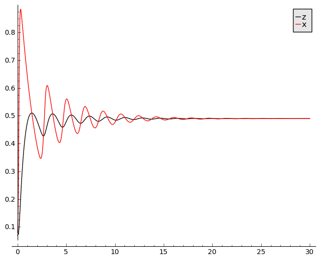

.. end of output

Powyżej przedstawiony jest przebieg czasowy koncentracji substancji :math:`x` oraz :math:`z`.

Aby dołączyć do rysunku ewolucję zmiennej :math:`y` należy w oknie powyżej zlikwidować symbol  # #  w dolnej linii. Czasami wartość :math:`y` jest bardzo duża w relacji do pozostałych. W tym przypadku lepiej nie dokładać wykresu dla :math:`y`.

**W poniższym oknie możemy obserwować kształt krzywej fazowej dla paramatrów z okna pierwszego i drugiego.**

Zamkniętej krzywej fazowej odpowiadają rozwiązania periodyczne. W takim reżimie można obserwować oscylacje, które  w 1951 roku odkrył Biełousow.

.. code-block:: python

    sage: X = sol1[:,0]
    sage: Y = sol1[:,1]
    sage: Z = sol1[:,2]
    sage: list_plot(zip(X,Z), plotjoined=1)

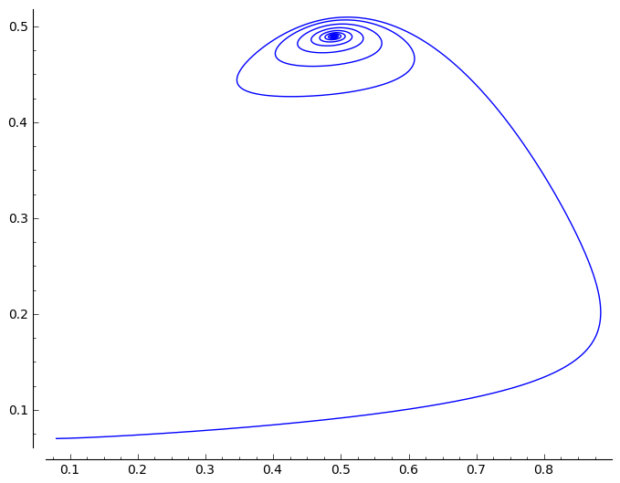

.. end of output

Układ zredukowany :math:`\delta =0`
-----------------------------------

Badanie stabilności "oregonatora" jest dość uciążliwe.  Dokonamy teraz przybliżenia układu, dla którego badanie stabilności jest prostsze.  Porównamy też wyniki dla pełnego układu i przybliżonego. Zobaczymy, czy pojawiają sie istotne różnice.

W drugim zestawie parametrów:

.. MATH::

     c=4 \times 10^{-2}, q=8 \times 10^{-4}, \delta = 4 \times 10^{-4}

Zauważmy, że

.. MATH::

     \delta \lt \lt c

i  dlatego dokonamy przybliżenia :math:`\delta  \approx 0`.  Wówczas równania "oregonatora" są postaci: 

.. MATH::

   c \, \frac{dx}{d\tau}= q y -x y + x(1 - x),  \quad \quad \quad \delta\,  \frac{dy}{d\tau} =  0 = -q y - x y +u z ,  \quad \quad \quad \frac{dz}{d\tau} = x-z  

    
Z drugiego równania wyznaczamy zmienną :math:`y`: 

.. MATH::    
   :label: BZ1

   y = \frac{u z}{q+x}

i wstawiamy do pierwszego równania otrzymując układ zredukowany: 

.. MATH::    

   c  \frac{dx}{d\tau}= x (1 - x) + u  z  \frac{q - x}{q + x} \equiv F(x, z),  \quad \quad \quad \frac{dz}{d\tau} = x-z  = \equiv H(x, z) \quad \quad \quad \mbox{zredukowany układ} 

Stany stacjonarne tego układu pokrywają się ze stanami stacjonarnymi pełnego układu.  
Tak więc mamy stan stacjonarmy: 
    
.. MATH::

   (x_0, y_0) = (0, 0) 

Drugi stan stacjonarny określony jest  przez równania: 

.. MATH::
   :label: BZ2

   1-x + u    \frac {q-x}{q+x} = 0,  \quad \quad \quad z=x

Stan dla :math:`y` jest wyznaczony przez równanie :eq:`BZ1`.  Aby zbadać stabilność stanu określonego przez równanie :eq:`BZ2`, musimy zbadać wartości własne macierzy Jacobiego: 
    
.. MATH::

   J = \begin{bmatrix} A&   B\\ C &  D   \end{bmatrix},

.. MATH::

   A =  \frac {\partial  F}{\partial x} , \quad \quad B  =  \frac{\partial F}{\partial z}  ,  \quad \quad         C = \frac{\partial H}{\partial x} ,    \quad \quad       D =  \frac{\partial H}{\partial z}  

    
Wartości własne :math:`\lambda` określone są przez równanie: 

.. MATH::

   \left\| \begin{matrix} A -\lambda&  B\\  C&   D-\lambda \end{matrix}\right\| = 0  

 
Stąd  otrzymujemy równanie dla :math:`\lambda`. Jest to równanie kwadratowe: 
    
.. MATH::

   \lambda ^2 - (A+D)  \lambda + (A D - B C) = 0  

    
Zauważamy, że :math:`A+D` to ślad macierzy Jacobiego :math:`{\text Tr} J` , a wielkość :math:`A D - B C` to wyznacznik macierzy :math:`{\text Det} J`, czyli równanie to przepiszemy w postaci: 
    
.. MATH::

   \lambda ^2 - ({\text Tr} J)  \lambda + ({\text Det} J) = 0  

   
Pierwiastki tego równania są dane przez wzór: 
    
.. MATH::

   \lambda_{1/2} = (1/2) \left[ {\text Tr} J \pm \sqrt{ ({\text Tr} J)^2 - 4 ({\text Det} J)}\right] 

Jeżeli  przy zmianie parametrów pojawiają się  relacje

.. MATH::

   {\text Tr} J = 0 \quad \quad \quad \mbox{oraz} \quad \quad \quad {\text Det} J \gt  0 

     
to dwie wartości własne stają się liczbami urojonymi, czyli obserwuje się  **bifurkację Hopfa.**
Obliczamy pochodne cząstkowe funkcji :math:`F` oraz :math:`H`. Warunek :math:`{\text Tr} J = 0` ma postać

.. MATH::
   :label: BZ3

   c=1-2 x - \frac{2u q x}{(q + x)^2}

gdzie :math:`x` jest wyznaczone przez równanie :eq:`BZ2`.  Te dwa równanie, przy naszej ustalonej wartości :math:`q = 0.0008`, wyznaczają granicę rozwiązań oscylacyjnych. Na płaszczyźnie (u, c) otrzymujemy diagram bifurkacyjny dla zredukowanego układu.  Dla wartości  :math:`(u \gt  0,  c \gt  0)`  między krzywą a osią poziomą pojawiają się oscylacje. Jak widać z poniższego wykresu, zwiększanie  wartości :math:`q` powoduje zmiejszanie się obszaru  parametrów :math:`(u, c)` dla których pojawiają się oscylacje.  Powyżej   pewnej wartości krytycznej :math:`q \gt   q_c`  oscylacje zanikają całkowicie.

.. code-block:: python

    sage: var('u,q')
    sage: D(u,q)=(1-q-u)^2 + 4*q*(1+u)
    sage: x1(u,q)=0.5*(1-q-u+sqrt(D(u,q)))
    sage: c(u,q)=1-2*x1(u,q) - 2*u*q*x1(u,q)/(q + x1(u,q))^2
    sage: pr1=plot(c(u,0.0008), (u,0,3), legend_label="q=0.0008")
    sage: pr2=plot(c(u,0.04), (u,0,3), color='red', legend_label="q=0.040")
    sage: pr3=plot(c(u,0.075), (u,0,3), color='green', legend_label="q=0.075")
    sage: show(pr1+pr2+pr3, ,fontsize=12 )

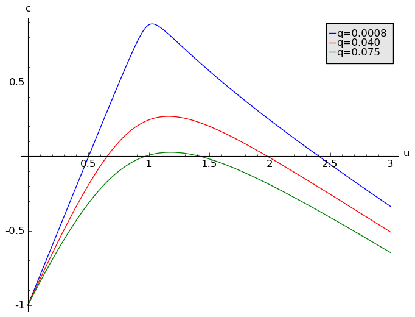

.. end of output

**Wyprowadzenie powyższych wzorów wykorzystując algebrę komputerową:**

.. code-block:: python

    sage: var('x u q c z')
    sage: F(x, z) =( x*(1-x) + u*z*(q-x)/(q+x) )/c
    sage: H(x,z)= x-z
    sage: x0 = solve([F(x,z),H(x,z)],[x,z])[1][0].rhs()
    sage: J = jacobian(vector([F,H]),(x,z) )
    sage: print "Tr(J) łatwo rozwiazać na c!" 
    sage: show(J.trace())
    sage: Tr(u,q,c) = J.trace().subs({x:x0,z:x0})
    sage: C(u,q) = Tr(u,q,c).solve(c)[0].rhs().simplify()

Tr(J) łatwo rozwiazać na c!

.. MATH::

    \left( x, z \right) \ {\mapsto} \ -\frac{\frac{{\left(q - x\right)} u z}{{\left(q + x\right)}^{2}} + \frac{u z}{q + x} + 2 \, x - 1}{c} - 1

.. end of output

.. code-block:: python

    sage: sum([plot(C(u,q_),(u,.01,3),figsize=(6,4),axes_labels=['u','c'],legend_label="q=%0.4f"%q_) for q_ in srange(0.0001,0.2,0.02) ] )

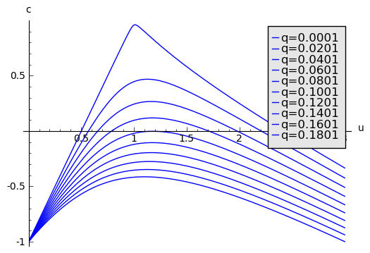

.. end of output

Obszar pod czerwoną krzywą zawiera miejsca gdzie Tr(J)>0 co sugeruje oscylacje (punkt stały jest niestabilny).

.. code-block:: python

    sage: contour_plot(C(u,q),(u,.01,3),(q,1e-6,.1), axes_labels=['u','q'],contours=srange(0,.61,0.01),aspect_ratio=30.)+\
    ...    implicit_plot(C(u,q),(u,.01,3),(q,1e-6,.1), axes_labels=['u','q'],color='red')

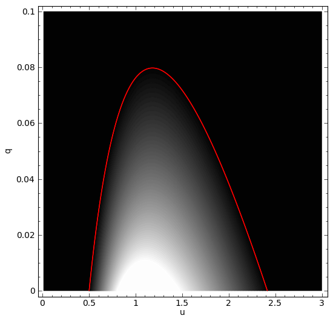

.. end of output

Porównanie rozwiązań  pełnego "Oregonatora" i układu zredukowanego 
-------------------------------------------------------------------

.. code-block:: python

    sage: var('x,y,z')
    sage: c=0.04 
    sage: d=0.0004 ## to jest parametr delta: zmieniaj go od małej wartości, np. 0.0004 (brak różnic) do np. 0.04 (obserwuje się różnice) 
    sage: q=0.0008  
    sage: u=0.51 ## zmieniaj też ten parametr bifurkacyjny 
    sage: f(x,y,z)= (q*y -x*y + x -x*x)/c
    sage: g(x,y,z)=(-q*y - x*y +u*z)/d
    sage: h(x,y,z)= x-z

.. end of output

.. code-block:: python

    sage: T = srange(0, 30,0.001) ## tu można zmieniać czas  zmieniając drugą wartość, czyli wydłużać wartość poziomej osi
    sage: sol1=desolve_odeint([f,g,h], [0.08,0.5,0.07], T, [x,y,z]) ## w 2 nawiasie są warunki początkowe dla x, y, z

.. end of output

.. code-block:: python

    sage: var('x z')
    sage: c=0.04 
    sage: q=0.0008 
    sage: u=0.51 ## zmieniaj tę wartość 
    sage: F(x, z) =(1/c)*( x*(1-x) + u*z*(q-x)/(q+x) )
    sage: H(x,z)= x-z

.. end of output

.. code-block:: python

    sage: Ts = srange(0, 30,0.001) ## tu można zmieniać czas  zmieniając drugą wartość, czyli wydłużać wartość poziomej osi
    sage: solR=desolve_odeint([F,H], [0.08,0.07], Ts, [x,z]) ## w 2 nawiasie są warunki początkowe dla x, y, z
    sage: line( zip ( T,solR[:,0]),legend_label="zredukowany" )+line( zip ( T,sol1[:,0]), color='red',legend_label="Oregonator")

.. image:: iCSE_BProcnielin08_z161_BZ_media/cell_46_sage0.png
    :align: center

.. end of output

Demostracja użycia CAS do selektywnego uproszczenia wzorów
----------------------------------------------------------

.. code-block:: python

    sage: tr = J(x,x).trace()  
    sage: show(tr)
    sage: show( tr.operands()[0] )
    sage: show( tr.operands()[0].operands() )
    sage: show( (-tr.operands()[0].operands()[0]) )
    sage: show( (-tr.operands()[0].operands()[0]).operands() )
    sage: show( (-tr.operands()[0].operands()[0]).operands()[0:2] )
    sage: show(sum( (-tr.operands()[0].operands()[0]).operands()[0:2] ).factor() )
    sage: print "Ma być:"
    sage: show( 1-2*x - 2*u*q*x/(q + x)^2 )

.. MATH::

    -\frac{\frac{{\left(q - x\right)} u x}{{\left(q + x\right)}^{2}} + \frac{u x}{q + x} + 2 \, x - 1}{c} - 1

.. MATH::

    -\frac{\frac{{\left(q - x\right)} u x}{{\left(q + x\right)}^{2}} + \frac{u x}{q + x} + 2 \, x - 1}{c}

.. MATH::

    \left[\frac{{\left(q - x\right)} u x}{{\left(q + x\right)}^{2}} + \frac{u x}{q + x} + 2 \, x - 1, \frac{1}{c}, -1\right]

.. MATH::

    -\frac{{\left(q - x\right)} u x}{{\left(q + x\right)}^{2}} - \frac{u x}{q + x} - 2 \, x + 1

.. MATH::

    \left[-\frac{{\left(q - x\right)} u x}{{\left(q + x\right)}^{2}}, -\frac{u x}{q + x}, -2 \, x, 1\right]

.. MATH::

    \left[-\frac{{\left(q - x\right)} u x}{{\left(q + x\right)}^{2}}, -\frac{u x}{q + x}\right]

.. MATH::

    -\frac{2 \, q u x}{{\left(q + x\right)}^{2}}

Ma być:

.. MATH::

    -\frac{2 \, q u x}{{\left(q + x\right)}^{2}} - 2 \, x + 1

.. end of output

Diagram bifurkacyjny układu zredukowanego :math:`x^*(q)`
--------------------------------------------------------

.. code-block:: python

    sage: var('x u q c z')
    sage: F(x, z) =( x*(1-x) + u*z*(q-x)/(q+x) )/c
    sage: H(x,z)= x-z
    sage: x0 = solve([F(x,z),H(x,z)],[x,z])[1][0].rhs()
    sage: J = jacobian(vector([F,H]),(x,z) )
    sage: Tr(u,q,c) = J.trace().subs({x:x0,z:x0})
    sage: C(u,q) = Tr(u,q,c).solve(c)[0].rhs().simplify()

.. end of output

Narysujmy jak zmienia sie punkt stały z :math:`q` przy ustalonych pozostałych parametrach. Kolorem czerwonym zaznaczamy punkt stały niestabilny (:math:`{\text Tr} J \gt 0`) a niebieskim stabilny.

.. code-block:: python

    sage: fix_stable = []
    sage: fix_unstable = []
    sage: for q_ in srange(.0001,.1,0.0002):
    ...       pars = {c:0.3,q:q_,u:1.1}
    ...       if Tr(u,q,c).subs(pars)<0:
    ...           fix_stable.append((q_,x0.subs(pars)))
    ...       else:
    ...           fix_unstable.append((q_,x0.subs(pars)))
    sage: point( fix_stable)+point( fix_unstable,color='red')

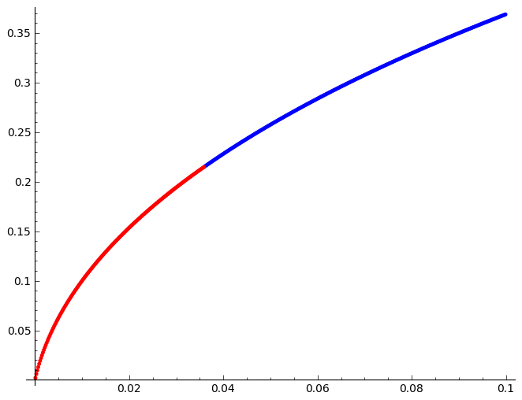

.. end of output

Niestabilny punkt stały i brak innych stabilnych punktów sugeruje możliwość rozwiązań okresowych typu cykl graniczny.

Powtarzając poprzedni algorytm, jeśli punkt jest niestabilny

 - rozwiązujemy ODE 

 - nanosimy na diagramie ekstremalne wartości trajektorii :math:`x(t)`  po pewnym czasie umożliwiającym relaksację warunku początkowego.

 - dodatkowo rysujemy trajektorię na prawym rysunku z wyróżnieniem ostatnich stu punktów. Trajektorią jest wyliczana dla :math:`t\in(0,T_{end}).`

.. code-block:: python

    sage: fix_stable = []
    sage: fix_unstable = []
    sage: times = srange(1,125,.2)
    sage: IC = (.51,.51)
    sage: print "wyliczam diagram bifurkacyjny - chwilka..."
    sage: for q_ in srange(.0001,.1,0.002)+srange(.035,.038,0.00001):
    ...       pars = {c:0.3,q:q_,u:1.1}
    ...       
    ...       if Tr(u,q,c).subs(pars)<0:
    ...           fix_stable.append((q_,x0.subs(pars)))
    ...       else:
    ...           sol=desolve_odeint([F.subs(pars),H.subs(pars)],IC,times,[x,z])
    ...           X = sol[sol.shape[0]/2:,0]
    ...           fix_stable.append((q_,X.min()))
    ...           fix_stable.append((q_,X.max()))
    ...           fix_unstable.append((q_,x0.subs(pars)))
    sage: print "ok"
    sage: @interact
    sage: def _(qsel  =slider(0.03,0.041,0.000001,default= 0.037),Tend=slider(10,100000,0.1,default= 120)):
    ...       pars[q]=qsel# = {c:0.3,q:qsel,u:1.1}
    ...       times = srange(1,Tend,.2)
    ...       sol=desolve_odeint([F.subs(pars),H.subs(pars)],IC,times,[x,z])
    ...       html.table([[point( fix_stable)+point( fix_unstable,color='red',gridlines=[[qsel],[]]),line(sol)+line(sol[-20:,:],color='red')]])

.. end of output

.. code-block:: python

    sage: times = srange(1,125,.2)
    sage: IC = (1,1)# (x0.subs(pars),x0.subs(pars)+1e-3)
    sage: sol=desolve_odeint([F.subs(pars),H.subs(pars)],IC,times,[x,z])
    sage: X = sol[sol.shape[0]/2:,0]
    sage: X.min()
    sage: X.max()

.. end of output

.. code-block:: python

    sage: X = sol[sol.shape[0]/2:,0]#- x0.subs(pars).n()
    sage: print X.min(),X.max()
    sage: list_plot(list(X))

0.0500712624079 0.506595108388

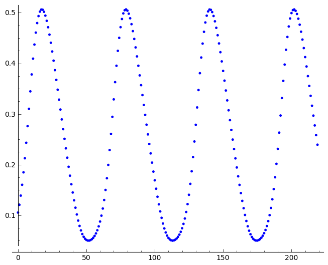

.. end of output

.. code-block:: python

    sage: line(zip(times,sol[:,1]),gridlines=[[],[x0.subs(pars).n()]])

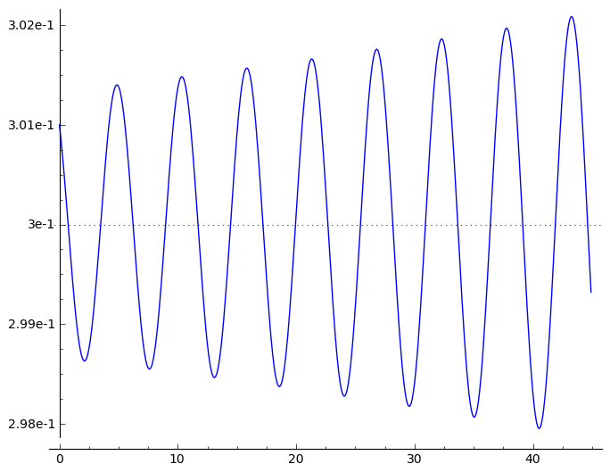

.. end of output

.. code-block:: python

    sage: line(sol)+point(IC)

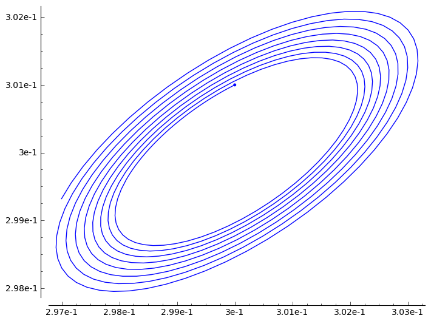

.. end of output

.. code-block:: python

    sage: pars = {c:0.04,q:0.0008,u:0.8}
    sage: fix_pointsR =  solve([F.subs(pars),H.subs(pars)],x,z,solution_dict=True)
    sage: plt_fpR = point( [ (x.subs(fp).n(),z.subs(fp).n()) for fp in fix_pointsR],color='red')
    sage: plt_fpR

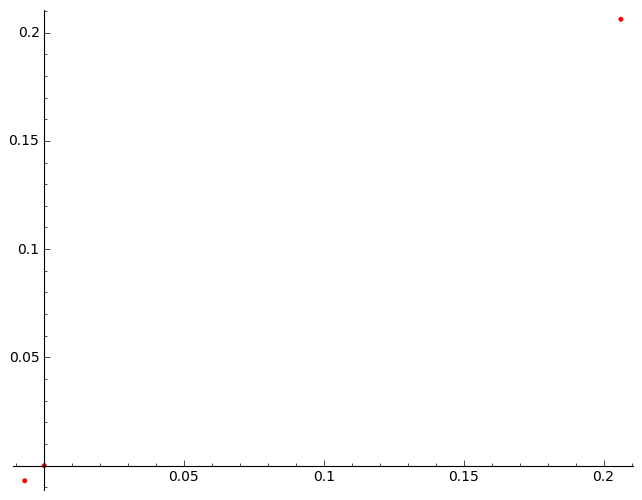

.. end of output

.. code-block:: python

    sage: pars = {c:0.04,d:0.0002,q:0.0008, u:0.8}
    sage: fix_points =  solve([f.subs(pars),g.subs(pars),h.subs(pars)],x,y,z,solution_dict=True)
    sage: plt_fp = point( [ (z.subs(fp).n(),z.subs(fp).n()) for fp in fix_points],color='red')

.. end of output

.. code-block:: python

    sage: times = srange(0,0.1,.0001)+srange(0.1,1.0,.001)+srange(1,45,.01)
    sage: IC = [0.8,120.2,.3]
    sage: sol=desolve_odeint([f.subs(pars),g.subs(pars),h.subs(pars)],IC,times,[x,y,z])
    sage: p=line(zip(times,sol[:,0])) + line(zip(times,sol[:,2]),color='red')
    sage: p.show(figsize=(6,2))

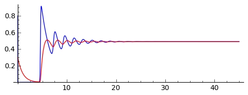

.. end of output

.. code-block:: python

    sage: solR=desolve_odeint([f1.subs(pars),h1.subs(pars)],[IC[0],IC[2]],times,[x,z])
    sage: p=line(zip(times,solR[:,0]))+line(zip(times,solR[:,1]),color='red')
    sage: p.show(figsize=(6,2))

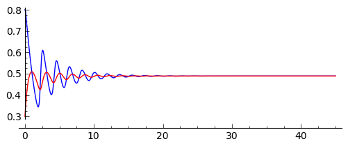

.. end of output

Porównanie układu 2d i 3d:

.. code-block:: python

    sage: line(zip(sol[:,0],sol[:,2]))+line(zip(solR[:,0],solR[:,1]),color='red')

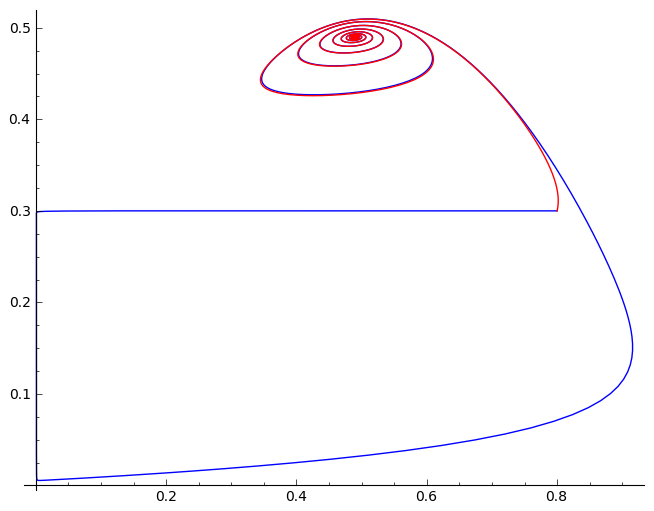

.. end of output

.. code-block:: python

    sage: surf = implicit_plot3d((-q*y - x*y + u*z).subs(pars),(x,0,1),(y,0,230),(z,0,.4))
    sage: traj = line(zip(sol[::1,0],sol[::1,1],sol[::1,2]),color='red',thickness=9)
    sage: plt_IC = point(IC,size=20,color='yellow')
    sage: surf+traj+plt_IC
    Traceback (most recent call last):
    ...
    NameError: name 'y' is not defined

.. end of output

.. code-block:: python

    sage: surf_form=solve(-q*y - x*y + u*z,y)[0].rhs().subs(pars)
    sage: show(surf_form)

.. MATH::

    \frac{640 \, z}{1250 \, x + 1}

.. end of output

.. code-block:: python

    sage: solR_3d = [(x,surf_form(z=z,x=x),z) for x,z in solR]
    sage: trajR = point(solR_3d,color='green',size=14)
    sage: surf+traj+plt_IC+trajR

.. end of output

.. image:: iCSE_BProcnielin08_z161_BZ_media/indeks.jpeg
    :align: center

.. code-block:: python

    sage: fp_n = [ (x.subs(fp).n(),z.subs(fp).n()) for fp in fix_pointsR]

.. end of output

.. code-block:: python

    sage: html.table(fp_n  )

\ 
    ====================  =====================
    −0.604242327531896     −0.604242327531896
     0.00344232753189605    0.00344232753189605
     0.000000000000000      0.000000000000000
    ====================  =====================

.. end of output

.. code-block:: python

    sage: var('x z')
    sage: vf = vector( [f1.subs(pars),h1.subs(pars) ]) 
    sage: vf = vf/vf.norm()
    sage: domx,domy =(x,-0.0020,0.01),(z,-0.002,.014)
    sage: plt_fp = point( fp_n[1:],color='red',size=30)
    sage: vec_plt = plot_vector_field( vf,  domx,domy)
    sage: nullc1=implicit_plot( f1.subs(pars), domx,domy)
    sage: nullc2=implicit_plot( h1.subs(pars), domx,domy)
    sage: vec_plt+plt_fp+nullc1+nullc2

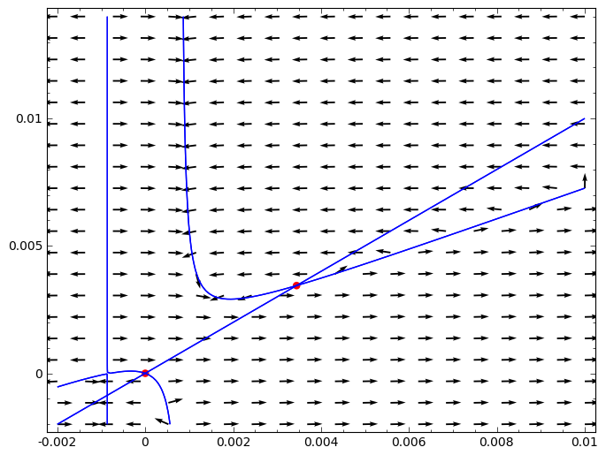

.. end of output

.. code-block:: python

    sage: for x_,z_ in fp_n:
    ...       print x_,z_
    ...       A =  jacobian([f1.subs(pars),h1.subs(pars) ],[x,y])(x=x_,z=z_) 
    ...       show(A)
    ...       
    ...       print map(N,A.eigenvalues())
    ...       print A.eigenvectors_right()

-0.604242327531896 -0.604242327531896

.. MATH::

    \left(\begin{array}{rr}
    55.3183151691335 & 0.000000000000000 \\
    1 & 0
    \end{array}\right)

[55.3183153770813, 0.000000000000000]
[(56480/1021, [], 1), (0, [(0, 1)], 1)]

0.00344232753189605 0.00344232753189605

.. MATH::

    \left(\begin{array}{rr}
    12.5866898308665 & 0.000000000000000 \\
    1 & 0
    \end{array}\right)

[12.5866900175131, 0.000000000000000]
[(7187/571, [], 1), (0, [(0, 1)], 1)]

0.000000000000000 0.000000000000000

.. MATH::

    \left(\begin{array}{rr}
    25.0000000000000 & 0.000000000000000 \\
    1 & 0
    \end{array}\right)

[0.000000000000000, 25.0000000000000]
[(0, [(0, 1)], 1), (25, [(1, 1/25)], 1)]

.. end of output

.. code-block:: python

    sage: m=matrix(QQ,[[12.5966,0],[1,0]])
    sage: m

| [62983/5000          0]
| [         1          0]

.. end of output

.. code-block:: python

    sage: m.eigenvectors_right()

| [(62983/5000, [
| (1, 5000/62983)
| ], 1), (0, [
| (0, 1)
| ], 1)]

.. end of output

.. code-block:: python

    sage: var('y')
    sage: plot_vector_field(m*vector([x,y]),(x,-1,1),(y,-1,1))

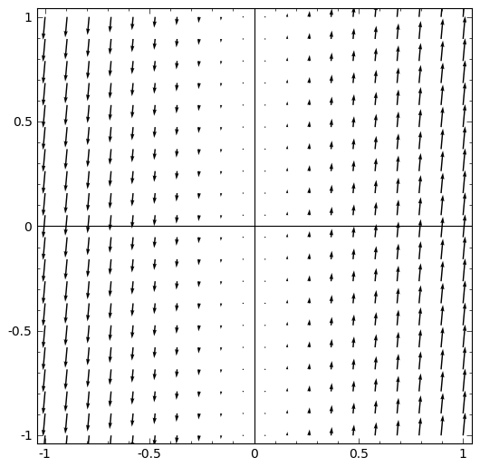

.. end of output

Rozwiązania spiralne w układzie reakcji z dyfuzją (Bielousow\-Zabotyński)
-------------------------------------------------------------------------

.. code-block:: python

    sage: a=1.0
    sage: b=0.1
    sage: eps=0.1
    sage: a = 0.75
    sage: b = 0.0006
    sage: eps = 0.072
    sage: var('u v')
    sage: f(u,v) = u*(1-u)*(u-(v-b)/a)
    sage: g(u,v) = u-v
    sage: V = vector( (1/eps*f,g))
    sage: V=V/V.norm()
    sage: vfield=plot_vector_field(V,(u,0,1),(v,0,1))+implicit_plot(g,(u,0,1),(v,0,1))
    sage: t = srange(0,4/eps,0.01)
    sage: sol = desolve_odeint([19*f,g], [0.5,0.0], t, [u,v])  
    sage: plt_phase = vfield+line(sol,color='red',figsize=5)
    sage: plt_time = line(zip(t,sol[:,0]),figsize=5)
    sage: html.table([[plt_phase,plt_time]])

.. end of output

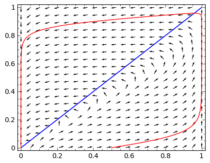

.. image:: iCSE_BProcnielin08_z161_BZ_media/cell_65_sage1.png
    :align: center

.. code-block:: python

    sage: %timeit 
    sage: import numpy as np
    sage: sparse = True
    sage: slicing = True
    sage: Dyf_u = 1.0
    sage: Dyf_v = 0.052
    sage: Dyf = max(Dyf_u,Dyf_v)
    sage: a = 1.0 
    sage: b = 0.001
    sage: eps = 0.072
    sage: l = 100.0 # dlugosc ukladu
    sage: t_end = 100 # czas symulacje
    sage: N = 160 # dyskretyzacja przestrzeni
    sage: h = l/(N-1) 
    sage: dt = 0.052/(Dyf*(N-1)**2/l**2) # 0.2 z warunku CFL, krok nie moze byc wiekszy
    sage: dt_dyn = (1.0/eps)/125.0
    sage: sps = int(1/dt) # liczba krokow na jednostke czasu
    sage: Nsteps=sps*t_end  # calkowita liczba krotkow 
    sage: print "dt,dt_dyn",dt,dt_dyn
    sage: dt = min(dt,dt_dyn)
    sage: print "sps=",sps,"dt=",dt,'Nsteps=',Nsteps
    sage: # warunek poczatkowy
    sage: u = np.zeros((N,N))
    sage: v = np.zeros((N,N))
    sage: #u[int(N/2)-5:int(N/2)+5,int(N/2)-5:int(N/2)+5]=1 # step
    sage: #u[:int(N/2)+5,:]=1.0 # step
    sage: #u[int(N/2)-5:int(N/2)+5,int(N/2)-20:int(N/2)+20]=1.0
    sage: #v[int(N/2)-5:int(N/2)+3,int(N/2)-20:int(N/2)+20]=1.0
    sage: #u[int(N/2)-5:int(N/2)+5,int(N/2)-20:int(N/2)+20]=1.0
    sage: #v[int(N/2)-5:int(N/2)+5,int(N/2)-22:int(N/2)+18]=1.0
    sage: #u[-20:-1,int(N/2)-5:int(N/2)+5]=1.0
    sage: #v[-20:-1,int(N/2)-6:int(N/2)+4]=1.0
    sage: #u[:5,:]=1.0
    sage: #v[:4,:]=1.0
    sage: #u[-10:,:]=1.0
    sage: #v[-4:,:]=1.0
    sage: u[:int(N/2),int(N/2)-5:int(N/2)+5]=1.0
    sage: v[:int(N/2),int(N/2)-6:int(N/2)+4]=1.0
    sage: # aby wymusic ruch falowy, przesuwamy u wzgledem v
    sage: def essential_boundary_conditions(u):
    ...       u[:,0] = 0.0
    ...       u[:,-1] = 0.0
    ...       u[-1,:] = 0.0
    ...       u[0,:] = 0.0
    ...       v[:,0] = 0.0
    ...       v[:,-1] = 0.0
    ...       v[-1,:] = 0.0
    ...       v[0,:] = 0.0
    ...       
    sage: Tlst=[]
    sage: Tvlst=[]
    sage: essential_boundary_conditions(u)
    sage: for i in range(Nsteps):
    ...       if not i%sps:
    ...           Tlst.append(u.copy())
    ...           Tvlst.append(v.copy())
    ...       
    ...       u[1:-1,1:-1] = u[1:-1,1:-1] + dt*(1.0/eps*u[1:-1,1:-1]*(1-u[1:-1,1:-1])*( u[1:-1,1:-1]-(v[1:-1,1:-1]+b)/a ) + \
    ...        Dyf_u*(N-1)**2/l**2*(np.diff(u,2,axis=0)[:,1:-1]+np.diff(u,2,axis=1)[1:-1,:]))
    ...       v[1:-1,1:-1] = v[1:-1,1:-1] + dt*( (u[1:-1,1:-1]-v[1:-1,1:-1]) )
    ...       # + \
    ...       # Dyf*(N-1)**2/l**2*(np.diff(v,2,axis=0)[:,1:-1]+np.diff(v,2,axis=1)[1:-1,:]))
    ...       essential_boundary_conditions(u)
    ...       
    sage: print "Saved ",len(Tlst), " from ", Nsteps

| dt,dt_dyn 0.0205688066136624 0.111111111111111
| sps= 48 dt= 0.0205688066136624 Nsteps= 4800
| Saved  100  from  4800
| CPU time: 9.54 s,  Wall time: 9.54 s

.. end of output

.. code-block:: python

    sage: anim=animate([matrix_plot(u,cmap='jet',figsize=(4,4)) for u in Tlst[:]])
    sage: anim.show()

.. image:: iCSE_BProcnielin08_z161_BZ_media/cell_70_sage0.gif
    :align: center

.. end of output

.. code-block:: python

    sage: import pylab
    sage: @interact
    sage: def _(ti=slider(range(len(Tlst)))):
    ...       print r"t=",dt*ti*sps
    ...       if True: 
    ...           pylab.subplot(1,2,1)   
    ...           pylab.imshow(Tlst[ti],vmin=0,vmax=1,origin='top')
    ...           pylab.subplot(1,2,2) 
    ...           pylab.imshow(Tvlst[ti],vmin=0,vmax=1,origin='top') 
    ...           pylab.savefig('1.png',dpi=70)
    ...       else:
    ...           p =  matrix_plot(Tlst[ti])
    ...           p.show(figsize=(4,4))

.. end of output

.. code-block:: python

    sage: anim=animate([matrix_plot(u,cmap='jet',figsize=(2,2)) for u in Tlst[40:72:2]])
    sage: anim.show()

.. end of output

