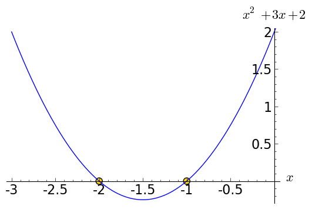

.. -*- coding: utf-8 -*-

Środowisko Sage - rozwiązania zadań
-----------------------------------

Zadanie 1: Ruch pionowy w polu grawitacyjnym Ziemi
~~~~~~~~~~~~~~~~~~~~~~~~~~~~~~~~~~~~~~~~~~~~~~~~~~~

<dd>czas: 5 min. W górę rzucono piłkę. Zaniedbując siły oporu, oblicz na jaką wysokość wzniesie się piłka po 0.54 sekundy, jeżeli wartość początkowa prędkości wynosiła :math:`3.44m∕s`. Rozwiązanie Znając rozwiązanie równań ruchu, mamy

:math:`h(t) = {v}_{0}t -{1\over 2}g{t}^{2}`

Jeżeli :math:`{v}_{0} = 3.44m∕s`, a :math:`t = 0.54s`, to łatwo obliczyć, że

:math:`h(t) = 3.44 \cdot 0.54 -{1\over 2}\cdot 9.81 \cdot  0.5{4}^{2}`

i w Sage

</dd>

.. code-block:: python

    sage: 3.44 * 0.54 - 9.81 * 0.54^2 / 2
    0.427302000000000

.. end of output

Zadanie 2: Ruch pionowy w polu grawitacyjnym
~~~~~~~~~~~~~~~~~~~~~~~~~~~~~~~~~~~~~~~~~~~~

<dd>czas: 5 min. Proszę policzyć to samo zagadnienie na równikach: 
<ul>
<li>Księżyca,</li>
<li>Marsa,</li>
<li>Jowisza.</li>
</ul>
</dd>

.. code-block:: python

    sage: # Księżyc
    sage: 3.44 * 0.54 - 1.622 * 0.54^2 / 2
    1.62111240000000

.. end of output

.. code-block:: python

    sage: # Mars
    sage: 3.44 * 0.54 - 3.69 * 0.54^2 / 2
    1.31959800000000

.. end of output

.. code-block:: python

    sage: # Jowisz
    sage: 3.44 * 0.54 - 24.79 * 0.54^2 / 2
    -1.75678200000000

.. end of output

.. code-block:: python

    sage: # hmmm... coś nie tak, co? znaczy to , że piłka po prostu leży na powierzchni Jowisza (jeżeli takowa jest...)

.. end of output

Zadanie 3: Ile minut minęło od 6:15 dziś rano?
~~~~~~~~~~~~~~~~~~~~~~~~~~~~~~~~~~~~~~~~~~~~~~

<dd>czas: 10 min.</dd>
<dd> </dd>

.. code-block:: python

    sage: # spr o godz 17:02
    sage: (17-6)*60 + (2-15)
    647

.. end of output

Zadanie 4: Oblicz swoją liczbę urodzenia.
~~~~~~~~~~~~~~~~~~~~~~~~~~~~~~~~~~~~~~~~~

<dd>czas: 5 min. Sprawdź później, co o tobie myślą <a href="http://pl.wikipedia.org/wiki/Numerologia">numerolodzy</a>.</dd>

.. code-block:: python

    sage: # spr dla Charliego Chaplina
    sage: # ur. 16 kwietnia 1889
    sage: 1 + 8 + 9 + 9 + 4 + 1 + 6
    38

.. end of output

.. code-block:: python

    sage: 3 + 8
    11

.. end of output

.. code-block:: python

    sage: 1 + 1
    2

.. end of output

.. code-block:: python

    sage: # 2 - to "dyplomata" mający świadomość dwóch obliczy świata, zainteresowany drugim człowiekiem, wrażliwy, kierujący się w życiu uczuciami

.. end of output

Zadanie 5: Oblicz ile dni minęło od Bitwy pod Chojnicami (1657). 
~~~~~~~~~~~~~~~~~~~~~~~~~~~~~~~~~~~~~~~~~~~~~~~~~~~~~~~~~~~~~~~~~

Zadanie 6: to samo dla zmiennych
~~~~~~~~~~~~~~~~~~~~~~~~~~~~~~~~

<dd>czas: 20 min. Pomoc: <a href="http://pl.wikipedia.org/wiki/Data_Julia%C5%84ska">Data Juliańska</a></dd>

.. code-block:: python

    sage: R=1657
    sage: M=1
    sage: D=2
    sage: X=(M+9)/12
    sage: A=4715+R+int(X)
    sage: Y=275*M/9
    sage: V=7*A/4
    sage: B=1729279.5+367*R+int(Y)-int(V)+D
    sage: Q=(A+83)/100
    sage: C=int(Q)
    sage: W=3*(C+1)/4
    sage: E=int(W)
    sage: chojnice = B + 38 - E
    sage: R=2011
    sage: M=10
    sage: D=20
    sage: X=(M+9)/12
    sage: A=4715+R+int(X)
    sage: Y=275*M/9
    sage: V=7*A/4
    sage: B=1729279.5+367*R+int(Y)-int(V)+D
    sage: Q=(A+83)/100
    sage: C=int(Q)
    sage: W=3*(C+1)/4
    sage: E=int(W)
    sage: teraz = B + 38 - E
    ...       
    sage: int(teraz - chojnice)
    129587

.. end of output

Zadanie 7: Jednostki wersja 1.
~~~~~~~~~~~~~~~~~~~~~~~~~~~~~~~

<dd>czas: 15 min. Napisz prosty program (tak, tak, już programujemy!) zamieniający długość z metrów na jednostki z wysp Brytyjskich (stopy, cale, jardy i mile).  
<ul>
<li>1 cal = 2.54 cm</li>
<li>1 stopa = 12 cali</li>
<li>1 jard = 3 stopy</li>
<li>1 mila = 1760 jardów</li>
</ul>

Uwaga: 640 m = 25196.85 cali = 2099.74 stóp = 699.91 jardów = 0.3977 mili (użyj tej wielkości do testów). Do wyświetlenia może przydać się funkcja show(). Jeżeli mamy zadeklarowaną zmienną x=3 to show(x) zwróci nam wartość zmiennej na ekran (w tym przypadku liczbę 3).

</dd>

.. code-block:: python

    sage: # zad 7, lekcja 1
    sage: metry = 640
    sage: cale  = metry * 100 / 2.54; print "cale:",  cale
    sage: stopy = cale / 12         ; print "stopy:", stopy
    sage: jardy = stopy / 3         ; print "jardy:", jardy
    sage: mile  = jardy / 1760      ; print "mile:",  mile
    cale: 25196.8503937008
    stopy: 2099.73753280840
    jardy: 699.912510936133
    mile: 0.397677563031894

.. end of output

Zadanie 8: Temperatura pokojowa.
~~~~~~~~~~~~~~~~~~~~~~~~~~~~~~~~~

<dd>czas: 10 min. Przelicz temperaturę pokojową (r.t.) na stopnie Kelwina i Fahrenheita.</dd>
 
<dd> </dd>

.. code-block:: python

    sage: # zad 8, lekcja 1
    sage: rt = 20
    sage: f  = 9./5 * rt + 32
    sage: k = rt + 273.15
    sage: print "r.t. = %f\nFahrenheit: %f\nKelwin: %f" % (rt,f,k)
    r.t. = 20.000000
    Fahrenheit: 68.000000
    Kelwin: 293.150000

.. end of output

Zadanie 9: Równanie kwadratowe
~~~~~~~~~~~~~~~~~~~~~~~~~~~~~~

<dd>czas: 10 min. Rozwiąż równanie

:math:`{ x}^{2} + 3x + 2 = 0`

</dd>

.. code-block:: python

    sage: a = 1
    sage: b = 3
    sage: c = 2
    sage: delta = b^2 - 4*a*c
    sage: x1 = (-b + sqrt(delta))/2/a
    sage: x2 = (-b - sqrt(delta))/2/a
    sage: print "x1 =", x1
    sage: print "x2 =", x2
    x1 = -1
    x2 = -2

.. end of output

.. code-block:: python

    sage: (plot(x^2+3*x+2,(-3,1)) +
    sage: point((x1,0), faceted=True, size=50, color='gold') + 
    sage: point((x2,0), faceted=True, size=50, color='gold')
    sage: ).show(xmin=-3, xmax=0, ymax=2, axes_labels=[r'$x$',r'$x^2 + 3x + 2$'], fontsize=16)

.. end of output

