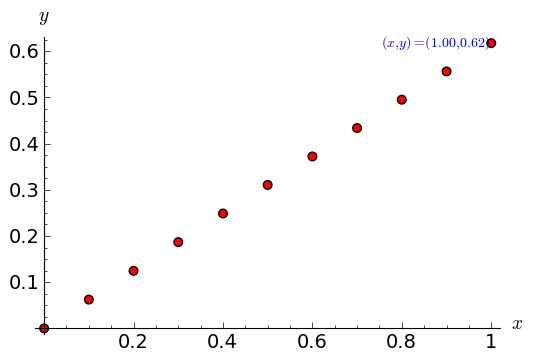

.. -*- coding: utf-8 -*-

Zmienne - rozwiązania zadań
---------------------------

Zadanie 1: Określ jaki typ mają poniższe zmienne
~~~~~~~~~~~~~~~~~~~~~~~~~~~~~~~~~~~~~~~~~~~~~~~~~

<dd>czas: 5 min. i = 1 k = (1,2,3) zmienna_z_zadania = ("Ala", 21, 4.5) ocena = 3.5 imie = "Feliks"</dd>

.. code-block:: python

    sage: i = 1; print i, type(i)
    sage: k = (1,2,3); print k, type(k)
    sage: zmienna_z_zadania = ("Ala", 21, 4.5); print zmienna_z_zadania, type(zmienna_z_zadania)
    sage: ocena = 3.5; print ocena, type(ocena)
    sage: imie = "Feliks"; print imie, type(imie)
    1 <type 'sage.rings.integer.Integer'>
    (1, 2, 3) <type 'tuple'>
    ('Ala', 21, 4.50000000000000) <type 'tuple'>
    3.50000000000000 <type 'sage.rings.real_mpfr.RealLiteral'>
    Feliks <type 'str'>

.. end of output

Zadanie 2: Konwersja ze stopni Celsiusa do Fahrenheita
~~~~~~~~~~~~~~~~~~~~~~~~~~~~~~~~~~~~~~~~~~~~~~~~~~~~~~~

<dd>czas: 5 min. Napisz program konwertujący temperaturę mierzoną w stopniach Celsiusa do stopni Fahrenheita według równania

:math:` F = {9\over 5}C + 32`

Użyj identycznych nazw zmiennych. Następnie napisz program konwertujący temperaturę w drugą stronę.

</dd>

.. code-block:: python

    sage: C = 25
    sage: F = 9./5 * C + 32
    sage: print C, "stopni Celsiusa to", F, "stopni Fahrenheita"
    25 stopni Celsiusa to 77.0000000000000 stopni Fahrenheita

.. end of output

.. code-block:: python

    sage: F = 77
    sage: C = (F-32)*5/9.
    sage: print  F, "stopni Fahrenheita to", C, "stopni Celsiusa"
    77 stopni Fahrenheita to 25.0000000000000 stopni Celsiusa

.. end of output

Zadanie 3: Oblicz z wykorzystaniem tych samych zmiennych
~~~~~~~~~~~~~~~~~~~~~~~~~~~~~~~~~~~~~~~~~~~~~~~~~~~~~~~~~

<dd>czas: 10 min. 

:math:` \text{Area} = \pi {r}^{2},\quad \text{gdzie}\quad r = {\pi}^{{1\over 3} }-  1 `

:math:` \text{_}0 ={\cosh }^{2}(x) +{\sinh }^{2}(x),\quad \text{gdzie}\quad x = 32 \pi`

:math:`  f = {{(x + {y}^{0.4})}^{0.25x}\over 0.8} +\log \Big ({x\over y}\Big ) + 10^{x+{y}^{2} },\quad \text{gdzie}\quad x =\sinh (1),y =\tanh (20)`

</dd>

.. code-block:: python

    sage: #1
    sage: r = pi^(1/3) - 1
    sage: Area = pi * r^2
    sage: print "Area =", Area, "=", Area.n()
    Area = (pi^(1/3) - 1)^2*pi = 0.678099020346954

.. end of output

.. code-block:: python

    sage: #2
    sage: x = 32*pi
    sage: _0 = cosh(x)^2 + sinh(x)^2
    sage: print "_0 =", _0, "=", _0.n()
    _0 = sinh(32*pi)^2 + cosh(32*pi)^2 = 1.04485650343921e87

.. end of output

.. code-block:: python

    sage: #3
    sage: x, y = sinh(1), tanh(20)
    sage: f = (x+y^0.4)^(0.25*x)/0.8 + log(x/y) + 10^(x+y^2)
    sage: print "f =", f, "=", f.n()
    f = 1.25000000000000*(tanh(20)^0.400000000000000 + sinh(1))^(0.250000000000000*sinh(1)) + 10^(tanh(20)^2 + sinh(1)) + log(sinh(1)/tanh(20)) = 151.424943167773

.. end of output

Zadanie 4: Rzut ukośny
~~~~~~~~~~~~~~~~~~~~~~~

<dd>czas: 20 min. Jeżeli w polu grawitacyjnym wyrzucimy piłkę z wysokości :math:`h_0` i z prędkością początkową :math:`{v}_{0}` zorientowaną pod kątem :math:`\alpha` w stosunku do poziomu otrzymujemy zagadnienie rzutu ukośnego. Rozwiązywać je będziecie analitycznie na zajęciach z mechaniki. Równanie toru takiego ruchu we współrzędnych kartezjańskich (x,y) dane jest wzorem:</dd>
<dd> </dd>
<dd>

:math:`y = h_0 + x\mathop {tg} (\alpha) -     {g\over 2{v}_{0}^{2}{\mathop{ cos}^{2}(\alpha) }}{x}^{2}`

Napisz program znajdujący ”wysokość”piłki :math:`y` dla zadanych wartości przyspieszenia grawitacyjnego :math:`g`, kąta :math:`\alpha`, prędkości początkowej :math:`{v}_{0}` i odległości :math:`x`. Postaraj się napisać jak najbardziej czytelny kod.

</dd>

.. code-block:: python

    sage: g = 9.81 #m/s^2
    sage: alpha_deg = 32 #stopni
    sage: alpha = alpha_deg*pi/180 # w radianach, do obliczeń!
    sage: v0 = 30 #m/s
    sage: h0 = 0 #m
    sage: # odległość:
    sage: x = 1 #m
    sage: y = h0 + x*tan(alpha) - g/(2*v0^2*cos(alpha)^2)*x^2
    sage: print "Wysokość piłki po %.2fm wynosi %.2fm" % (x,y)
    Wysokość piłki po 1.00m wynosi 0.62m

.. end of output

.. code-block:: python

    sage: # do ewentualnej wizualizacji trajektorii...
    sage: X = srange(0,1,0.1, include_endpoint=1)
    sage: Y = [h0 + x*tan(alpha) - g/(2*v0^2*cos(alpha)^2)*x^2 for x in X]
    sage: (list_plot(zip(X,Y), color=(1,0,0), size=30, faceted=True) + 
    sage: text(r"$(x,y) = (%.2f,%.2f)$"%(x,y),(x,y),horizontal_alignment='right')).show(fontsize=14, axes_labels=['$x$','$y$'])

.. end of output

Zadanie 5: Rzut ukośny
~~~~~~~~~~~~~~~~~~~~~~

<dd>czas: 10 min. Przepisz kod tak, aby zwracał m/w taką informację

Na odległości 2.963 m ciało rzucone z wysokości 12.5 m z   prędkością początkową 3 m/s pod kątem 0.12 rad   znajduje się na wysokości 8.0 m w polu grawitacyjnym Ziemi.

</dd>

.. code-block:: python

    sage: g = 9.81 #m/s^2
    sage: alpha = 0.12 # w radianach
    sage: v0 = 3 #m/s
    sage: h0 = 12.5 #m
    sage: # odległość:
    sage: x = 2.963 #m
    sage: y = h0 + x*tan(alpha) - g/(2*v0^2*cos(alpha)^2)*x^2
    sage: print """Na odległości %.3f m ciało rzucone z wysokości %.1f m z  
    sage: prędkością początkową %d m/s pod kątem %.2f rad  
    sage: znajduje się na wysokości %.1f m w polu grawitacyjnym Ziemi.""" % (x, h0, v0, alpha, y)
    Na odległości 2.963 m ciało rzucone z wysokości 12.5 m z  
    prędkością początkową 3 m/s pod kątem 0.12 rad  
    znajduje się na wysokości 8.0 m w polu grawitacyjnym Ziemi.

.. end of output

Zadanie 6: Słownik przyspieszeń
~~~~~~~~~~~~~~~~~~~~~~~~~~~~~~~

<dd>czas: 10 min. Zbuduj słownik zawierający jako klucz nazwę ciała niebieskiego a jako wartość wartość przyspieszenia na nim podają w :math:`m∕s`. Słowinik powinien zawierać wpisy dla conajmniej 7 ciał niebieskich.</dd>

.. code-block:: python

    sage: gdict = {"Ziemia" : 9.80665,
    ...            "Słońce" : 273.95,
    ...            "Mars"   : 3.69,
    ...            "Jowisz" : 20.87,
    ...            "Pluton" : 0.58,
    ...            "Wenus"  : 8.87,
    ...            "Neptun" : 10.71
    ...           }

.. end of output

Zadanie 7: Przyrost pieniędzy w banku
~~~~~~~~~~~~~~~~~~~~~~~~~~~~~~~~~~~~~~

<dd>czas: 15 min. Niech :math:`p` oznacza stopę procentową banku wyrażoną w procentach na rok. Początkowa wartość odłożonej gotówki w tym banku urośnie zgodnie ze wzorem 

:math:`W = A\Big( 1 + {p \over 100}\Big )^n`

po :math:`n` latach. Oblicz do jakiej kwoty wzrośnie

<ol>
<li id="x1-9003x1">1000 Euro po 3 latach dla stopy 5 procentowej</li>
<li id="x1-9005x2">23513 zł po 5 latach dla stopy 3,54%</li>
<li id="x1-9007x3">112,12 miliona Rubli po 1 roku dla stopy 7.14%</li>
</ol>

Powyższe wielkości sformatuj odpowiednio dla wszystkich trzech przypadków tak, by inwestor otrzymał pełną, czytelną informację.

</dd>

.. code-block:: python

    sage: # 1
    sage: p = 5
    sage: n = 3
    sage: A = 1000
    sage: waluta = "Euro"
    sage: W = A * (1 + p/100)^n
    sage: print "Zainwestowane %.2f %s wzrośnie po %d latach do kwoty %.2f %s przy stopie %.2f procentowej"%(A, waluta, n, W, waluta, p)
    Zainwestowane 1000.00 Euro wzrośnie po 3 latach do kwoty 1157.62 Euro przy stopie 5.00 procentowej

.. end of output

.. code-block:: python

    sage: # 2
    sage: p = 3.54
    sage: n = 5
    sage: A = 23513
    sage: waluta = "zł"
    sage: W = A * (1 + p/100)^n
    sage: print "Zainwestowane %.2f %s wzrośnie po %d latach do kwoty %.2f %s przy stopie %.2f procentowej"%(A, waluta, n, W, waluta, p)
    Zainwestowane 23513.00 zł wzrośnie po 5 latach do kwoty 27980.07 zł przy stopie 3.54 procentowej

.. end of output

.. code-block:: python

    sage: # 2
    sage: p = 7.14
    sage: n = 1
    sage: A = 112.12 * 1e6
    sage: waluta = "Rubli"
    sage: W = A * (1 + p/100)^n
    sage: print "Zainwestowane %.2f %s wzrośnie po %d roku do kwoty %.2f %s przy stopie %.2f procentowej"%(A, waluta, n, W, waluta, p)
    Zainwestowane 112120000.00 Rubli wzrośnie po 1 roku do kwoty 120125368.00 Rubli przy stopie 7.14 procentowej

.. end of output

