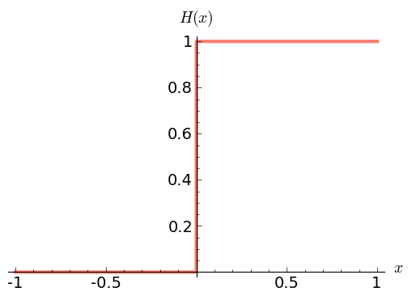

.. -*- coding: utf-8 -*-

Instrukcje sterujące - rozwiązania zadań
----------------------------------------

Zadanie 1
~~~~~~~~~

.. code-block:: python

    sage: x = sin(pi/2 - 0.1)
    sage: y = sin(pi/2 + 0.1)
    sage: print x.n() == y.n(), x.n(20) == y.n(20), x.n(100) == y.n(100)
    sage: print bool(x == y)
    True False False
    True

.. end of output

.. code-block:: python

    sage: #1 z użyciem solve()
    sage: var('u')
    sage: [u1, u2] = solve(2*u^2 -10,u)
    sage: print "metoda 1 u1 > u2:", u1.rhs().n() > u2.rhs().n()
    sage: #2 rozwiązanie typowe dla r. kwadratowego z b=0
    sage: a = 2
    sage: c = -10
    sage: u1 = -sqrt(-c/a)
    sage: u2 = sqrt(-c/a)
    sage: print "metoda 2 u1 > u2:", u1.n() > u2.n()
    metoda 1 u1 > u2: False
    metoda 2 u1 > u2: False

.. end of output

Zadanie 2
~~~~~~~~~

.. code-block:: python

    sage: for p in [0, 1]:
    ...     for q in [0, 1]:
    ...       print "%d lub %d => %d" % (p, q, p or q)
    ...           
    sage: for p in [0, 1]:
    ...       for q in [0, 1]:
    ...           print "%d|\t%d|\t%d" % (p, q, p and q)
    0 lub 0 => 0
    0 lub 1 => 1
    1 lub 0 => 1
    1 lub 1 => 1
    0|	0|	0
    0|	1|	0
    1|	0|	0
    1|	1|	1

.. end of output

później korzystając z Sage\-owego modułu do logiki można to zrobić sensowniej, ale na razie mają ćwiczyć for, while itp. a przy okazji nauczą się logiki na Analizę (do prof. Kostura, prof. Kominka, dr Króla)

.. code-block:: python

    sage: import sage.logic.propcalc as propcalc
    sage: m1 = propcalc.formula("a|b")
    sage: m2 = sage.logic.propcalc.formula("a&b")
    sage: print "OR\n", m1.truthtable()
    sage: print "AND\n", m2.truthtable()
    OR
    a      b      value
    False  False  False  
    False  True   True   
    True   False  True   
    True   True   True   
    
    AND
    a      b      value
    False  False  False  
    False  True   False  
    True   False  False  
    True   True   True   

.. end of output

Zadanie 3
~~~~~~~~~

.. code-block:: python

    sage: print "prawo podwójnego przeczenia"
    sage: for p in [0, 1]:
    ...       print "p: %s \t\t ~~p: %s" % (bool(p), not not p)
    ...       
    sage: print "\nprawo przemienności koniunkcji"
    sage: for p in [0, 1]:
    ...       for q in [0, 1]:
    ...           print "%s i %s: %s\t%s i %s: %s" %(p, q, p and q, q, p, q and p)
    ...           
    sage: print "\nprawo przemienności alternatywy"
    sage: for p in [0, 1]:
    ...       for q in [0, 1]:
    ...           print "%s lub %s: %s\t%s lub %s: %s" %(p, q, p or q, q, p, q or p)
    ...                   
    sage: print "\nprawo łączności koniunkcji"
    sage: for p in [0, 1]:
    ...       for q in [0, 1]:
    ...           for r in [0, 1]:
    ...               print "(%s i %s) i %s: %s\t%s i (%s i %s): %s" %(p, q, r, (p and q) and r,p,q,r, p and (q and r))
    sage: print "\nprawo łączności alternatywy"
    sage: for p in [0, 1]:
    ...       for q in [0, 1]:
    ...           for r in [0, 1]:
    ...               print "(%s lub %s) lub %s: %s\t%s lub (%s lub %s): %s" %(p,q,r,(p or q) or r,p,q,r,p or (q or r))
    ...          
    sage: print "\nitd...\n"            
    sage: print "\nprawo idempotentności koniunkcji"
    sage: print "\nprawo idempotentności alternatywy"
    sage: print "\nprawo rozdzielności koniunkcji względem alternatywy"
    sage: print "\nprawo rozdzielności alternatywy względem koniunkcji"
    sage: print "\nprawa pochłaniania"
    sage: print "\nprawa De Morgana (pierwsze i drugie)"
    prawo podwójnego przeczenia
    p: False 		 ~~p: False
    p: True 		 ~~p: True
    
    prawo przemienności koniunkcji
    0 i 0: 0	0 i 0: 0
    0 i 1: 0	1 i 0: 0
    1 i 0: 0	0 i 1: 0
    1 i 1: 1	1 i 1: 1
    
    prawo przemienności alternatywy
    0 lub 0: 0	0 lub 0: 0
    0 lub 1: 1	1 lub 0: 1
    1 lub 0: 1	0 lub 1: 1
    1 lub 1: 1	1 lub 1: 1
    
    prawo łączności koniunkcji
    (0 i 0) i 0: 0	0 i (0 i 0): 0
    (0 i 0) i 1: 0	0 i (0 i 1): 0
    (0 i 1) i 0: 0	0 i (1 i 0): 0
    (0 i 1) i 1: 0	0 i (1 i 1): 0
    (1 i 0) i 0: 0	1 i (0 i 0): 0
    (1 i 0) i 1: 0	1 i (0 i 1): 0
    (1 i 1) i 0: 0	1 i (1 i 0): 0
    (1 i 1) i 1: 1	1 i (1 i 1): 1
    
    prawo łączności alternatywy
    (0 lub 0) lub 0: 0	0 lub (0 lub 0): 0
    (0 lub 0) lub 1: 1	0 lub (0 lub 1): 1
    (0 lub 1) lub 0: 1	0 lub (1 lub 0): 1
    (0 lub 1) lub 1: 1	0 lub (1 lub 1): 1
    (1 lub 0) lub 0: 1	1 lub (0 lub 0): 1
    (1 lub 0) lub 1: 1	1 lub (0 lub 1): 1
    (1 lub 1) lub 0: 1	1 lub (1 lub 0): 1
    (1 lub 1) lub 1: 1	1 lub (1 lub 1): 1
    
    itd...
    
    
    prawo idempotentności koniunkcji
    
    prawo idempotentności alternatywy
    
    prawo rozdzielności koniunkcji względem alternatywy
    
    prawo rozdzielności alternatywy względem koniunkcji
    
    prawa pochłaniania
    
    prawa De Morgana (pierwsze i drugie)

.. end of output

Zadanie 3
~~~~~~~~~

.. code-block:: python

    sage: n = 23
    sage: i = 1
    sage: while i <= n:
    ...       print i,
    ...       i += 2
    1 3 5 7 9 11 13 15 17 19 21 23

.. end of output

Zadanie 5
~~~~~~~~~

.. code-block:: python

    sage: n = 23
    sage: i = 1
    sage: liczby_nieparzyste = []
    sage: while i <= n:
    ...       liczby_nieparzyste.append(i)
    ...       i += 2
    sage: print liczby_nieparzyste
    [1, 3, 5, 7, 9, 11, 13, 15, 17, 19, 21, 23]

.. end of output

Zadanie 6
~~~~~~~~~

.. code-block:: python

    sage: jest = """s = 0; k = 1; M = 100  
    sage: while k < M:  
    ...     s += 1/k  
    sage: print s"""
    sage: #ma być
    sage: s = 0; k = 1; M = 100
    sage: while k < M:  
    ...     s += 1./k  
    ...     k += 1
    sage: print s.n(digits=50)
    5.1773775176396208408391430566553026437759399414062

.. end of output

Zadanie 7
~~~~~~~~~

.. code-block:: python

    sage: x = [0.5, 0.5, 0.5, 0.71, 0.712, 0.331, 0.331, 0.331, 0.24, 0.245, 0.246, 0.247, 0.248]  
    sage: t = [ti*0.1 for ti in range(len(x))]
    sage: delta_t = t[1] - t[0]; print "delta t =", delta_t
    sage: v = []
    sage: a = []
    sage: # jako, że nie znamy jeszcze mechanizmu dzielenia list (slice), to trzeba dać warunek...
    sage: for time in t:
    ...       indeks = t.index(time)
    ...       if indeks > 0 and indeks < len(t)-1:
    ...           v.append((x[indeks+1] - x[indeks-1])/2./delta_t)
    ...           a.append((x[indeks+1] - 2*x[indeks] + x[indeks-1])/delta_t^2)
    sage: print "\nx: ",x,"\nv: ",v,"\na: ",a
    delta t = 0.100000000000000
    
    x:  [0.500000000000000, 0.500000000000000, 0.500000000000000, 0.710000000000000, 0.712000000000000, 0.331000000000000, 0.331000000000000, 0.331000000000000, 0.240000000000000, 0.245000000000000, 0.246000000000000, 0.247000000000000, 0.248000000000000] 
    v:  [0.000000000000000, 1.05000000000000, 1.06000000000000, -1.89500000000000, -1.90500000000000, 0.000000000000000, -0.455000000000000, -0.430000000000000, 0.0300000000000000, 0.0100000000000000, 0.0100000000000000] 
    a:  [0.000000000000000, 21.0000000000000, -20.8000000000000, -38.3000000000000, 38.1000000000000, 0.000000000000000, -9.10000000000000, 9.60000000000000, -0.400000000000000, 0.000000000000000, 0.000000000000000]

.. end of output

Zadanie ZD4.1: Trójkąt.
~~~~~~~~~~~~~~~~~~~~~~~

.. code-block:: python

    sage: a = 2
    sage: b = 2
    sage: c = 2.2
    sage: if a + b > c and a + c > b and b + c > a:
    ...       p = (a + b + c)/2
    ...       Pole = sqrt(p*(p-a)*(p-b)*(p-c))
    ...       print "Dla a = %f, b = %f, c = %f da się zbudować trójkąt o polu %f i obwodzie %f" % (a, b, c, Pole, p * 2)
    sage: else:
    ...       print "Dla a = %f, b = %f, c = %f nie da się zbudować trójkąta"
    Dla a = 2.000000, b = 2.000000, c = 2.200000 da się zbudować trójkąt o polu 1.837362 i obwodzie 6.200000

.. end of output

Zadanie ZD4.2: min, max
~~~~~~~~~~~~~~~~~~~~~~~

.. code-block:: python

    sage: L = [random() for rr in xrange(33)]
    sage: minimum = maximum = L[0]
    sage: for el in L: 
    ...       if el > maximum:
    ...           maximum = el        
    ...       if el < minimum:
    ...           minimum = el
    sage: print "minimum:", minimum == min(L)
    sage: print "maksimum:", maximum == max(L)
    minimum: True
    maksimum: True

.. end of output

Zadanie ZD4.3: jajo
~~~~~~~~~~~~~~~~~~~

.. code-block:: python

    sage: M_male = 47 #g
    sage: M_duze = 67 #g
    sage: c = 3.7      #J / (g K)
    sage: rho = 1.038  #g/cm
    sage: K = 5.4e-3   #W / (cm K)
    sage: Tw = 100
    sage: Ty_twardo  = 70
    sage: Ty_miekko  = 69
    sage: punkt_a = "wyjęte z lodówki małe jajko na miękko"
    sage: M = M_male
    sage: Ty = Ty_miekko
    sage: T0 = 7
    sage: t = M^(2/3) * c * rho^(1/3) / K / pi^2 / (4 * pi / 3)^(2/3) * ln (0.76 * (T0 - Tw)/(Ty - Tw))
    sage: print punkt_a, ":", t.n(digits=5), "s"
    sage: punkt_b = "duże jajko leżące w temperaturze pokojowej, na twardo"
    sage: M = M_duze
    sage: Ty = Ty_twardo
    sage: T0 = 20
    sage: t = M^(2/3) * c * rho^(1/3) / K / pi^2 / (4 * pi / 3)^(2/3) * ln (0.76 * (T0 - Tw)/(Ty - Tw))
    sage: print punkt_b, ":", t.n(digits=5), "s"
    sage: punkt_c = "przyniesione z bazaru w Słubicach (woj. lubuskie) w dniu 30 lipca 1994, duże jajko na twardo"
    sage: M = M_duze
    sage: Ty = Ty_twardo
    sage: T0 = 39.5
    sage: t = M^(2/3) * c * rho^(1/3) / K / pi^2 / (4 * pi / 3)^(2/3) * ln (0.76 * (T0 - Tw)/(Ty - Tw))
    sage: print punkt_c, ":", t.n(digits=5), "s"
    wyjęte z lodówki małe jajko na miękko : 290.36 s
    duże jajko leżące w temperaturze pokojowej, na twardo : 315.22 s
    przyniesione z bazaru w Słubicach (woj. lubuskie) w dniu 30 lipca 1994, duże jajko na twardo : 190.55 s

.. end of output

Zadanie ZD4.4: Funkcja Heaviside’a
~~~~~~~~~~~~~~~~~~~~~~~~~~~~~~~~~~

Funkcja Heaviside’

.. code-block:: python

    sage: iksy = [-1/2, 0, 3]
    sage: for x in iksy:
    ...       if x < 0:
    ...           print 0
    ...       else:
    ...           print 1
    0
    1
    1

.. end of output

.. code-block:: python

    sage: # dla zobrazowania z jaką funkcja mamy do czynienia (jezeli student nie zajrzał do wiki)
    sage: plot(lambda x: 0 if x < 0 else 1, thickness=3, color='salmon', axes_labels=['$x$','$H(x)$'], fontsize=14)

.. end of output

Zadanie ZD4.5: Przybliżenie funkcji  ``cos``
~~~~~~~~~~~~~~~~~~~~~~~~~~~~~~~~~~~~~~~~~~~~

.. code-block:: python

    sage: x_k = [0, 4 * pi, 6 * pi, 8 * pi, 10 * pi]
    sage: m = [5, 25, 50, 100, 200]
    sage: for ni in m:
    ...       for xk in x_k:
    ...           cj = 1
    ...           C  = cj
    ...           for j in xrange(1,ni):
    ...               cj = -cj * n(xk)^2 / (2 * j * (2*j - 1))
    ...               C += cj
    ...           print "n: %00i, xk: %s, C: %e, cos: %e, err: %e" % (ni, xk, C, cos(xk), cos(xk) - C)
    n: 5, xk: 0, C: 1.000000e+00, cos: 1.000000e+00, err: 0.000000e+00
    n: 5, xk: 4*pi, C: 1.091447e+04, cos: 1.000000e+00, err: -1.091347e+04
    n: 5, xk: 6*pi, C: 3.380505e+05, cos: 1.000000e+00, err: -3.380495e+05
    n: 5, xk: 8*pi, C: 3.614471e+06, cos: 1.000000e+00, err: -3.614470e+06
    n: 5, xk: 10*pi, C: 2.223789e+07, cos: 1.000000e+00, err: -2.223789e+07
    n: 25, xk: 0, C: 1.000000e+00, cos: 1.000000e+00, err: 0.000000e+00
    n: 25, xk: 4*pi, C: 1.000000e+00, cos: 1.000000e+00, err: -2.815308e-10
    n: 25, xk: 6*pi, C: 1.168624e+00, cos: 1.000000e+00, err: -1.686243e-01
    n: 25, xk: 8*pi, C: 2.722107e+05, cos: 1.000000e+00, err: -2.722097e+05
    n: 25, xk: 10*pi, C: 1.716062e+10, cos: 1.000000e+00, err: -1.716062e+10
    n: 50, xk: 0, C: 1.000000e+00, cos: 1.000000e+00, err: 0.000000e+00
    n: 50, xk: 4*pi, C: 1.000000e+00, cos: 1.000000e+00, err: 1.736833e-12
    n: 50, xk: 6*pi, C: 1.000000e+00, cos: 1.000000e+00, err: 7.124334e-11
    n: 50, xk: 8*pi, C: 1.000000e+00, cos: 1.000000e+00, err: -4.869289e-07
    n: 50, xk: 10*pi, C: 9.998353e-01, cos: 1.000000e+00, err: 1.647202e-04
    n: 100, xk: 0, C: 1.000000e+00, cos: 1.000000e+00, err: 0.000000e+00
    n: 100, xk: 4*pi, C: 1.000000e+00, cos: 1.000000e+00, err: 1.736833e-12
    n: 100, xk: 6*pi, C: 1.000000e+00, cos: 1.000000e+00, err: 7.124334e-11
    n: 100, xk: 8*pi, C: 1.000000e+00, cos: 1.000000e+00, err: -4.869289e-07
    n: 100, xk: 10*pi, C: 9.998353e-01, cos: 1.000000e+00, err: 1.647151e-04
    n: 200, xk: 0, C: 1.000000e+00, cos: 1.000000e+00, err: 0.000000e+00
    n: 200, xk: 4*pi, C: 1.000000e+00, cos: 1.000000e+00, err: 1.736833e-12
    n: 200, xk: 6*pi, C: 1.000000e+00, cos: 1.000000e+00, err: 7.124334e-11
    n: 200, xk: 8*pi, C: 1.000000e+00, cos: 1.000000e+00, err: -4.869289e-07
    n: 200, xk: 10*pi, C: 9.998353e-01, cos: 1.000000e+00, err: 1.647151e-04

.. end of output

.. code-block:: python

    sage: # trochę lepiej byłoby zbierać dane do list i narysować zależności na wykresach
    sage: x_k = [0, 4 * pi, 6 * pi, 8 * pi, 10 * pi]
    sage: m = [5, 25, 50, 100, 200]
    sage: i = 0
    sage: C, blad = [], []
    sage: for ni in m:
    ...       for xk in x_k:
    ...           cj = 1
    ...           C.append(cj)
    ...           for j in xrange(1,ni):
    ...               cj = -cj * n(xk)**2R / (2R * j * (2R*j - 1))
    ...               C[i] += cj
    ...           blad.append(cos(xk) - C[i])
    ...           #print "n: %00i, xk: %s, C: %e, cos: %e, err: %e" % (ni, xk, C[i], cos(xk), blad[i])
    ...           i += 1
    sage: C; blad;
    [1.00000000000000, 10914.4653591260, 338050.510333820, 3.61447135119766e6, 2.22378949080788e7, 1.00000000000000, 1.00000000028153, 1.16862426266236, 272210.684804043, 1.71606214742239e10, 1.00000000000000, 0.999999999998263, 0.999999999928757, 1.00000048692892, 0.999835279797996, 1.00000000000000, 0.999999999998263, 0.999999999928757, 1.00000048692892, 0.999835284869337, 1.00000000000000, 0.999999999998263, 0.999999999928757, 1.00000048692892, 0.999835284869337]
    [0.000000000000000, -10913.4653591260, -338049.510333820, -3.61447035119766e6, -2.22378939080788e7, 0.000000000000000, -2.81530798673657e-10, -0.168624262662356, -272209.684804043, -1.71606214732239e10, 0.000000000000000, 1.73683289972359e-12, 7.12433445571037e-11, -4.86928924292584e-7, 0.000164720202003532, 0.000000000000000, 1.73683289972359e-12, 7.12433445571037e-11, -4.86928924292584e-7, 0.000164715130663184, 0.000000000000000, 1.73683289972359e-12, 7.12433445571037e-11, -4.86928924292584e-7, 0.000164715130663184]

.. end of output

.. code-block:: python

    sage: import matplotlib.pyplot as plt
    sage: import numpy
    sage: nC = numpy.reshape(C, (len(x_k), len(m)))
    sage: nblad = numpy.reshape(blad, (len(x_k), len(m)))
    sage: plt.pcolor(numpy.log(nC))
    sage: #plt.pcolor(nblad)
    sage: #plt.colorbar()
    sage: plt.savefig('p01.png')

.. end of output

