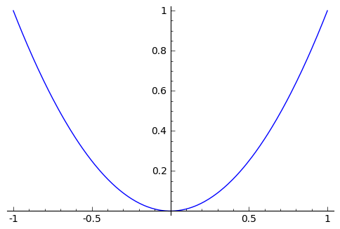

.. -*- coding: utf-8 -*-

Listy, Funkcje
--------------

Listy
~~~~~~~~

Sporo już o listach powiedzieliśmy. Wiemy jak je zdefiniować, jak odwołać się do :math:`n` -tego elementu listy, jak ją rozszerzać, sortować czy usuwać jakiś element. Dziś dowiemy się kilku nowych rzeczy.

Ujemne indeksy
""""""""""""""

Za pomocą ujemnych indeksów odnosimy się do elementów idących od końca do początku tzn.

.. code-block:: python

    sage: lista = ["ala", "ma", "kota"]
    sage: lista[-1]

'kota'

.. end of output

oznacza ostatni element,  ``lista[-2]``  przedostatni,  ``lista[-3]`` odnosi się do 3 od końca elementu itd. Ostatnim elementem niepustej listy jest zawsze  ``lista[-1]``.

**Zadanie 1:**

czas: 10 min.

Zbuduj posortowaną listę ``lp`` wszystkich liczb pierwszych w zakresie od 0 do 30. Następnie za pomocą pętli ``while`` stwórz listę ``odw_lp`` zawierającą posortowaną malejąco listę ``lp`` **Uwaga:** Nie wolno używać metody ``reverse()``.

Wycinanie list
""""""""""""""

Kolejną niezwykle użyteczną konstrukcją języka Python jest wycinanie list. Za pomocą podania dwóch indeksów możemy pobrać wycinek listy. Ogólne wyrażenie to  ``lista[a:b]``, gdzie  ``a``  i  ``b``  to właśnie żądane indeksy. Załóżmy, że zdefiniowaliśmy listę

.. code-block:: python

    sage: parzyste = [2, 4, 6, 8, 10, 12, 14, 16, 18, 20, 22, 24, 26]

.. end of output

a potrzebny nam tylko kawałek, trzymający liczby z zakresu :math:`[8,16]`. Możemy oczywiście napisać sobie prostą pętlę i za pomocą instrukcji  ``if``  zbudować nową listę  ``parzyste8_16``

.. code-block:: python

    sage: parzyste8_16_v1 = []
    sage: for p in parzyste:
    ...                                                                                               
    ...                                                                                               
    ...     if p >= 8 and p <= 16:
    ...       parzyste8_16_v1.append(p)

.. end of output

ale możemy wyciąć sobie odpowiedni kawałek i od razu wynik wycinania przypisać dodanej nazwy. Musimy tylko znać indeksy. Z tak krótkiej listy możemy je po prostu odczytać

.. code-block:: python

    sage: parzyste8_16_v2 = parzyste[3:8]

.. end of output

lub  też  nieco  lepiej

.. code-block:: python

    sage: start = parzyste.index(8)
    sage: stop = parzyste.index(16)
    sage: parzyste8_16_v3 = parzyste[start:stop+1]

.. end of output

Proszę zauważyć, że w obu przypadkach zmuszeni jesteśmy podać końcowy indeks o jeden większy od indeksu odpowiadającego wartości :math:`16`. Znając odpowiednie indeksy jesteśmy w stanie wycinać z list dowolne interesujące nas części. Możemy także podać ujemną wartość któregoś indeksu. Wycinanie wtedy także dobrze zadziała.

Jeśli lewy indeks wynosi 0, możemy go opuścić, wartość 0 jest domyślna.  ``parzyste[:3]``  jest tym samym, co  ``parzyste[0:3]`` (czyli  ``[2, 4, 6]``). Podobnie jest z prawym indeksem. Jeżeli chcemy wyciąć np. drugą połowę listy wystarczy napisać

.. code-block:: python

    sage: parzyste[int(len(parzyste)/2):]

[14, 16, 18, 20, 22, 24, 26]

.. end of output

zamiast pisać  ``parzyste[int(len(parzyste)/2):len(parzyste)]``. Można zauważyć, że

.. code-block:: python

    sage: parzyste[:7]

[2, 4, 6, 8, 10, 12, 14]

.. end of output

zwróci  pierwsze  7  elementów  listy,  a

.. code-block:: python

    sage: parzyste[7:]

[16, 18, 20, 22, 24, 26]

.. end of output

kolejne 6, dopełniając listę (w tym przypadku lista ma 13 elementów). Oczywiście istnieje specyficzna konstrukcja  ``parzyste[:]``  zwracająca całą listę. Używa się jej do kopiowania całej listy

.. code-block:: python

    sage: kopia1 = parzyste[:]

.. end of output

Można zapytać się: dlaczego nie przypisać po prostu listy  parzyste  do nowej zmiennej (listy) tak

.. code-block:: python

    sage: kopia2 = parzyste

.. end of output

Jest spora różnica pomiędzy skopiowaniem listy  parzyste  do nowej listy za pomocą  "[:]"  i zwykłymprzypisaniem  "=". Pierwsza konstrukcja kopiuje listę do nowego obiektu (czyli wykonuje kopię listy) drugatworzy tylko dowiązanie (wskaźnik) do obiektu występującego po prawej stronie operatora  "=".

.. code-block:: python

    sage: %python
    sage: print "[:] ", parzyste is kopia1
    sage: print "= ",   parzyste is kopia2

| [:]  False
| =  True

.. end of output

Jak widać  kopia1  to kompletnie inna lista niż  parzyste, w przeciwieństwie do listy  kopia2, która tak naprawdę jest tym samym obiektem co  parzyste.

**Zadanie 2:**

czas: 10 min.

Z podanej listy wytnij dwie równoliczne listy zawierające wartości mniejsze i większe od ich mediany.

``l1 = [-18, -9, 1, -14, -2, 7, 5, -11, 16, 4, 18, 7, -18, 19, -10, 11, 7, -18, -3, -6]``

Wyrażenia listowe
"""""""""""""""""

Wyrażenia listowe są jednymi z najbardziej użytecznych cech języka Python (więc i Sage). Dzięki nim możemy odwzorować jedną listę w drugą wykonując na każdym elemencie pierwszej pewne działania. Ogólna składnia wygląda następująco

``nowa_lista = [E(e) for e in lista]``, gdzie  ``E(e)``  to wyrażenie przekształcające element  ``e``  z listy  ``lista``. Najprościej wyjaśnić to na przykładzie

.. code-block:: python

    sage: # liczby calkowite Gaussa
    sage: lcG = [-1, 1, -1j, 1j, -1 - 1j, -1 + 1j, 1 - 1j, 1 + 1j]
    sage: # kwadrat powyzszych liczb
    sage: kwadrat_lcG = [liczba^2 for liczba in lcG]

.. end of output

Jak widać takie wyrażenie zawiera w sobie definicję nowej listy  ``kwadrat_lcG``  zbudowanej poprzez podniesienie w pętli  for  wszystkich elementów listy  ``lcG``  do kwadratu. Pętla ta występuje w środku nawiasów  ``[]``, czyli niejako wśrodku listy. Zapis taki dość mocno przyspiesza zapis i konstrukcję list potomnych, budowanych z list już istniejących:

.. code-block:: python

    sage: # kwadraty liczb naturalnych od 0 do 20
    sage: [z^2 for z in range(21)]
    sage: # szesciany liczb naturalnych od -30 do -20
    sage: [z^3 for z in range(-30, -19)]
    [-27000, -24389, -21952, -19683, -17576, -15625, -13824, -12167, -10648, -9261, -8000]

.. end of output

Dzięki takiej konstrukcji wiele dotychczasowych zadań okazuje się zadaniami ”jednolinijkowymi”:

.. code-block:: python

    sage: # Celsius -> Fahrenheit (od -27 do 27 co 3)
    sage: [9./5*C + 32 for C in range(-27, 28, 3)]
    sage: # wielomiany Legendre'a rzedu 1, dla x = 0.1 i stopni n od 0 do 33
    sage: L1 = [legendre_P(n, 0.1) for n in xrange(34)]

.. end of output

**Zadanie 3:**

czas: 10 min.

Stwórz listy

1. kwadratów liczb nieparzystych w zakresie od 0 do 300
2. zawierających wysokość piłki rzuconej w polu grawitacyjnym Ziemi z prędkością początkową :math:`{v}_{0} = 3.44[m/s]`,  wysokością początkową :math:`{h}_{0} = 0[m]` dla poszczególnych chwil czasu :math:`t = 0,0.01,0.02,0.03,...,0.70[s]`
3. zawierające :math:`\sin(x) - \cos(x)` dla :math:`x \in  [-2 \pi,2 \pi]` i :math:`x = 0.025`

Funkcje
~~~~~~~~~~

Jeżeli chodzi o Sage to pojęcie funkcja może być rozumiane w dwojaki sposób. Po pierwsze jako zwykła (no, może nie do końca taka zwykła) funkcja matematyczna, którą można badać (np. jej przebieg zmienności), narysować jej wykres, znaleźć miejsca zerowe, scałkować czy policzyć pochodną po jej argumencie. Po drugie jako zbiór poleceń który można wykonać w dowolnej części naszego notatnika. Lub obie możliwości na raz.

Wyrażenie symboliczne, które można wywoływać
~~~~~~~~~~~~~~~~~~~~~~~~~~~~~~~~~~~~~~~~~~~~

Takie wyrażenia najbardziej przypominają znane wam funkcje matematyczne. Definiujemy je następująco

.. code-block:: python

    sage: r = var('r') # o tym za chwile
    sage: # definicja jak w zeszycie
    sage: f(r) = r^2
    sage: print f # f przeprowadza r w r^2
    sage: # pochodna pierwszego rzedu
    sage: print f.diff(r) # lub po prostu f.diff()
    sage: # pochodna drugiego rzedu
    sage: print f.diff(r,2) # lub f.diff(2)
    sage: # calka nieoznaczona
    sage: print f.integrate(r)
    sage: # kwadrat funkcji
    sage: print f^2
    sage: # czy tez proste wywolanie w punkcie
    sage: print f(3)

| r \|--> r^2
| r \|--> 2*r
| r \|--> 2
| r \|--> 1/3*r^3
| r \|--> r^4
| 9

.. end of output

i wiele wiele innych możliwych operacji dostępnych zarówno jako metody obiektu (po wpisaniu  f.  i naciśnięciu klawisza [TAB]  jak i po podaniu nazwy funkcji jako argumentu do żądanej funkcji. Wykres takiej funkcji możemy łatwo obejrzeć

.. code-block:: python

    sage: f.plot()
    sage: #lub
    sage: plot(f)

.. end of output

Podczas definiowania wyrażenia symbolicznego możemy pominąć argument i zapisać

.. code-block:: python

    sage: g = r^2

.. end of output

**Zadanie 4:**

czas: 10 min.

Sprawdź czy całka z pochodnej funkcji :math:`\sin({x}^{2})` jest równa tej funkcji.

Funkcje programistyczne
"""""""""""""""""""""""

Aby w Sage zdefiniować nową funkcję należy użyć komendy  def  oraz postawić dwukropek za listą argumentów podanych w nawiasie.

def nazwa_funkcji(argument1, argument2, ..., argumentN):  

  BLOK INSTRUKCJI

Na  przykład:

.. code-block:: python

    sage: def F(C):
    ...     return 9./5 * C + 32

.. end of output

W tym przypadku nazwa funkcji to  ``F  a lista argumentów ogranicza się do jednego  ``C``. Funkcja ta przelicza nam stopnie Celsiusa na Fahrenheita według znanego już wzoru i zwraca za pomocą komendy return  obliczoną wartość. Aby wywołać ową funkcję dla temperatury pokojowej, wystarczy wykonać

.. code-block:: python

    sage: F(25)

77.0000000000000

.. end of output

Jak widzimy wywołania takiej funkcji są identyczne jak te, do których już się przyzwyczailiśmy, czyli np:  ``sin(2)``, ``cos(pi)``. Należy podać nazwę funkcji i w nawiasie wartość argumentu. Dodatkowo wartości dla argumentów funkcji możemy podawać explicite

.. code-block:: python

    sage: F(C=25)

77.0000000000000

.. end of output

Oczywiście nie musimy pamiętać jakich nazw zmiennych użyliśmy do konstrukcji danej funkcji. Wystarczy zapytać o to Sage korzystając z wbudowanej pomocy  ``F?``  lub  ``F??``  (pamiętacie jeszcze czym różnią się oba wywołania?). Aby w pełni wykorzystać tę możliwość należy zdefiniować co pomoc Sage ma pokazywać, gdy napiszemy  ``F?`` . Należy w tym celu dodać opis funkcji, tzw:  docstring. Nie jest to jednak obowiązkowe.

.. code-block:: python

    sage: def F(C):
    ...     """przelicza temperature podana w stopniach Celsiusa na stopnie Fahrenheita
    ...       typowe uzycie:
    ...       F(25)
    ...       F(C=100)"""
    ...     return 9./5 * C + 32

.. end of output

**Uwaga:**  Proszę pamiętać aby nie używać polskich znaków diakrytycznych w docstring\-u.

Do funkcji możemy podawać wiele argumentów, wystarczy podać je po przecinkach w nawiasie stojącym zaraz za nazwą funkcji.

.. code-block:: python

    sage: def rownanie_kwadratowe(a, b, c):
    ...     """Miejsca zerowe wielomianu kwadratowego"""
    ...     if a != 0:
    ...       sdelta = sqrt(b^2 - 4*a*c)
    ...       wynik = [(-b - sdelta)/2/a, (-b + sdelta)/2/a]
    ...     elif b != 0:
    ...       print "rownanie liniowe"
    ...       wynik = -c/b
    ...     else:
    ...       print "podaj przynajmniej niezerowe a lub b"
    ...       wynik = ""
    ...     return wynik

.. end of output

Właśnie zdefiniowaną funkcję rozwiązującą równanie

.. math::
   :label: IT03.77.1

   a{x}^{2} + bx + c = 0

możemy  teraz  wywoływać  na  wiele  sposobów:

.. code-block:: python

    sage: y = rownanie_kwadratowe(2, 1, -1); print y
    sage: y = rownanie_kwadratowe(a=2, b=1, c=-1); print y
    sage: y = rownanie_kwadratowe(b=1, a=2, c=-1); print y
    sage: y = rownanie_kwadratowe(c=-1, b=1, a=2); print y
    sage: y = rownanie_kwadratowe(2, 1, c=-1); print y
    sage: y = rownanie_kwadratowe(2, c=-1, b=1); print y

| [-1, 1/2]
| [-1, 1/2]
| [-1, 1/2]
| [-1, 1/2]
| [-1, 1/2]
| [-1, 1/2]

.. end of output

Jak widzimy możemy wywoływać funkcję zarówno podając nazwy argumentów (wtedy kolejnośc ich jest dowolna), nie podając ich wcale (wtedy musimy zachować kolejność taką jak w definicji funkcji) lub podając nazwy części z nich. Ważne jest, aby argumenty podawane bez nazwy występowały przed tymi deklarowanymi explicite, ponieważ Sage zwróci nam błąd, nawet jeżeli zachowamy kolejność

.. code-block:: python

    sage: y = rownanie_kwadratowe(a=2, 1, c=-1); print y
    Traceback (most recent call last):
    ...
    SyntaxError: non-keyword arg after keyword arg

.. end of output

Funkcje nie muszą niczego zwracać, znaczy to, że komenda  ``return``  nie musi występować w ciele funkcji. Funkcje takie mogą być tworzone do testowania zachowania kodu, innych funkcji, wydrukowania pomocy, i wielu innych celów.

.. code-block:: python

    sage: def drukuj_temperatury(lTemp, CF=True):
    ...     for temp in lTemp:
    ...       if CF:
    ...         print "%s stopni Celsiusa to %s stopni Fahrenheita" % (temp, F(temp))
    ...       else:
    ...         print "%s stopni Fahrenheita to %s stopni Celsiusa" % (temp, C(temp))
    sage: lista_Celsius = [0, 4, 20, 25, 100]
    sage: drukuj_temperatury(lista_Celsius)
    sage: def C(F):
    ...     return (F-32)*5/9
    sage: lista_Fahr = [0, 4, 20, 25, 100]
    sage: drukuj_temperatury(lista_Fahr, CF=False)

| 0 stopni Celsiusa to 32.0000000000000 stopni Fahrenheita
| 4 stopni Celsiusa to 39.2000000000000 stopni Fahrenheita
| 20 stopni Celsiusa to 68.0000000000000 stopni Fahrenheita
| 25 stopni Celsiusa to 77.0000000000000 stopni Fahrenheita
| 100 stopni Celsiusa to 212.000000000000 stopni Fahrenheita
| 0 stopni Fahrenheita to -160/9 stopni Celsiusa
| 4 stopni Fahrenheita to -140/9 stopni Celsiusa
| 20 stopni Fahrenheita to -20/3 stopni Celsiusa
| 25 stopni Fahrenheita to -35/9 stopni Celsiusa
| 100 stopni Fahrenheita to 340/9 stopni Celsiusa

.. end of output

**Zadanie 5: Funkcja Heaviside’a.**

czas: 10 min.

Zdefiniuj funkcję Heaviside’a.

Funkcja lambda
""""""""""""""

W języku Python możliwość zaimplementowania funkcji w jednej linii kodu. Zazwyczaj funkcje takie definiuje się jako szybkie, krótkie funkcje, które mogą służyć jako argumenty do innych funkcji. Nazywamy je funkcjami lambda. Ogólna składnia wygląda następująco

.. code-block:: python

    sage: g = lambda arg1, arg2, agr3, ...: wyrazenie

.. end of output

Np

.. code-block:: python

    sage: CtoF = lambda C: 9/5 * C + 32

.. end of output

co  odpowiada  zwykłej  definicji

.. code-block:: python

    sage: def normalCtoF(C):
    ...     return 9/5 * C + 32

.. end of output

sprawdźmy

.. code-block:: python

    sage: CtoF(33.) == normalCtoF(33.)

True

.. end of output

**Zadanie 6: Parzysta funkcja lambda**

czas: 10 min.

Zbuduj funkcję lambda sprawdzającą czy dana liczba jest parzysta. Funkcja powinna zwracać ``True`` w  przypadku liczby parzystej i ``False`` dla liczby nieparzystej.

Zadania
~~~~~~~~~~

**Zadanie 7: Lista nieparzysta.**

czas: 10 min.

Zdefiniuj lambda funkcję ``nieparzyste(n)`` zwracającą listę liczb nieparzystych od 0 do podanej jako argument liczby :math:`n` włącznie.

**Zadanie 8:**

czas: 10 min.

Napisz trzy funkcje

1. ``hw1`` nie przyjmującą żadnych argumentów i zwracającą ciąg znaków ’Hello, World!’;
2. ``hw2`` nie przyjmującą żadnych argumentów i nie zwracającą też nic, ale drukującą na standardowe wyjście ’Hello, World!’;
3. ``hw3`` przyjmującą dwa argumenty i drukującą na standardowe wyjście oba argumenty oddzielone przecinkiem. Przetestuj te funkcje za pomocą 

| print hw1()
| hw2()
| hw3(’Hello’, ’World!’)

**Zadanie 9: Funkcja Gaussa.**

czas: 20 min.

Zbuduj funkcję ``mygauss`` zwracającą wartość funkcji Gaussa o średniej :math:`\mu` i odchyleniu standardowym :math:`\sigma`  w punkcie :math:`x`. Zmienne :math:`\mu` oraz  :math:`\sigma` zaprogramuj z  domyślnymi wartościami :math:` \mu= 0`  i :math:` \sigma= 1`. Nie zapomnij napisać ``docstring`` -a.

**Zadanie 10: Suma**

czas: 10 min.

Napisz funkcję zwracającą sumę podanych w liście wartości. Funkcję nazwij ``suma``. Następnie przetestuj wpisując: ``suma([3,6,-3,4])``.

**Zadanie 11: Pętla for ze zmienną listą**

czas: 15 min.

Rozważ poniższy przykład użycia pętli ``for``. Wyjaśnij co dzieje się przy każdym obrocie pętli.

.. code-block:: python

    sage: numery = range(10)
    sage: print numery
    sage: for n in numery:
    ...       i = int(len(numery)/2)
    ...       del numery[i]
    ...       print 'n=%d, del %d' % (n, i), numery

| [0, 1, 2, 3, 4, 5, 6, 7, 8, 9]
| n=0, del 5 [0, 1, 2, 3, 4, 6, 7, 8, 9]
| n=1, del 4 [0, 1, 2, 3, 6, 7, 8, 9]
| n=2, del 4 [0, 1, 2, 3, 7, 8, 9]
| n=3, del 3 [0, 1, 2, 7, 8, 9]
| n=8, del 3 [0, 1, 2, 8, 9]

.. end of output

**Uwaga:**  Nigdy nie modyfikuj listy używanej w pętli ``for`` ! (No chyba, że naprawdę wiesz co robisz).

Zadania domowe
""""""""""""""

Stwórz notatnik ’Zadania domowe L05, Imię Nazwisko’. W tym notatniku rozwiąż poniższe zadania. Postaraj się jasno opisać jakie zadanie rozwiązujesz oraz metodykę rozwiązania tego zadania. Notatnik uwspólnij (tylko) z prowadzącym ćwiczenia.

**Zadanie ZD5.1: Gra w kości.**

czas: – min.

Funkcja ``random()`` zwraca losową liczbę zmiennoprzecinkową z zakresu :math:`[0,1)`.  Napisz funkcję ``kostka(n)`` zwracającą listę n losowo wyrzuconych oczek sześciennej kostki do gry. Domyślnie funkcja powinna realizować 1 rzut kością ( :math:`n = 1` ).

**Zadanie ZD5.2: Przypisania**

czas: – min.

Część poniższych przypisań będzie działać, a część nie. Wytłumacz przy każdej linijce  dlaczego dane przypisanie działa lub nie działa. Jeżeli działa, napisz jakim obiektem jest  :math:`x` i  jaką trzyma wartość.

| x = 1
| x = 1.
| x = 1;
| x = 1!
| x = 1?
| x = 1:
| x = 1,

**Uwaga:** Wywołaj powyższe przypisania jedno po drugim, za każdym razem sprawdź typ i zawartość zmiennej x.

**Zadanie ZD5.3: Błąd zaokrąglania.**

czas: – min.

Pierwiastkując jakąś liczbę :math:`M` razy, a później podnosząc ją :math:`M`  razy do kwadratu powinniśmy otrzymać tą samą liczbę (przynajmniej na kartce papieru). Jeżeli wykonamy  podobną operację na kalkulatorze, okaże się, że nie zawsze jest to prawda - tzn. startując z liczby :math:`A` nie wrócimy do tej samej liczby. Mając Sage nie musimy przejmować się naciskaniem klawiszy kalkulatora - możemy  wykonać podobne operacje w pętli. Oto odpowiedni program:

| for n in range(60):
|     r = 2.0
|     for i in range(n):
|         r = sqrt(r)
|     for i in range(n):
|         r = r^2
|     print "%d razy spierwiastkowane i podniesione do kwadratu: %.16f" % (n, r)

Napisz w trybie edytora tekstu (``SHIFT+ENTER`` na niebieskim polu) co powyższy program wykonuje. Potem  uruchom program. Zaokrąglanie liczb (błąd zaokrąglania) kompletnie niszczy obliczenia dla dostatecznie dużych :math:`n`. Zwróć uwagę na to, że dla niektórych przypadków z liczby 2 dostajemy 1! Zbadaj te przypadki ustalając liczbę  :math:`n` i   drukując na ekran to co zwracają pętle pierwiastkujące i podnoszące do kwadratu. Dlaczego dochodzimy do liczby 1? Odpowiedz w trybie edytora tekstu.

**Zadanie ZD5.4: Numeryczne zero.**

czas: – min.

Wpisz poniższy kod i uruchom go.

| eps = 1.0
| while 1.0 != 1.0 + eps:
|     print ’............’, eps
|     eps = eps/2.0
| print ’koncowe eps:’, eps

Jak to możliwe, że :math:`1 \ne 1 + eps`?  Jaka wartość ``eps`` jest numerycznie traktowana przez Sage jak zero?

