.. -*- coding: utf-8 -*-

Wykresy
-------

Wykresy funkcji
~~~~~~~~~~~~~~~

Jednym z głównych powodów do nauki i używania algebry komputerowej jest możliwość wizualizacji wyników naszych obliczeń. W najprostszej formie będą to wykresy funkcji, choć za pomocą Sage możemy tworzyć wymyślne trójwymiarowe wykresy, animacje, czy nieco bardziej abstrakcyjne reprezentacje wyników. Ponadto każdy z takich wykresów może być interaktywny. Poniżej kilka przykładów

Prosty,  dwuwymiarowy  wykres

.. code-block:: python

    sage: var('x')
    sage: plot(abs(x))

.. image:: iCSE_ITechninf04_z78_media/cell_1_sage0.png
    :align: center

.. end of output

Nieco  bardziej  skomplikowany  wykres

.. code-block:: python

    sage: g(x) = sin(x) + cos(x)*x^2 + sqrt(x)
    sage: gp = g.plot(xmin=0, xmax=20, ymin=-200, ymax=200,
    ...        rgbcolor=(0,0,0), thickness=2, fill=True,
    ...        fillcolor='gold' , legend_label='g(x)')
    sage: taylorp = sum([g.taylor(x,0,i).plot(linestyle='--',
    ...             xmin=0, xmax=20, rgbcolor=(i/.4,i/4.,i/4.),
    ...             legend_label='rozwiniecie rzedu %d' % i) 
    ...             for i in xrange(4)])
    sage: p = gp + taylorp
    sage: p.axes_labels(['x','g(x)'])
    sage: p.show()

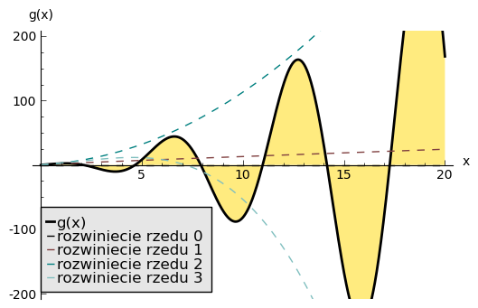

.. end of output

Można  też  trochę  się  pobawić...

.. code-block:: python

    sage: (circle((1,1),1, fill=True, facecolor='white') +
    sage: circle((1,2),.8, fill=True, facecolor='white') +
    sage: circle((1,3),.6, fill=True, facecolor='white') +
    sage: circle((1-0.2,3),.061, fill=True, facecolor='black') +
    sage: circle((1+0.2,3),.061, fill=True, facecolor='black') +
    sage: circle((1,1),.061, fill=True, facecolor='black') +
    sage: circle((1,1-0.5),.06, fill=True, facecolor='black') +
    sage: circle((1,2),.06, fill=True, facecolor='black') +
    sage: circle((1,2-0.5),.06, fill=True, facecolor='black')
    sage: ).show(figsize=[4,4] , axes=False, frame=False)

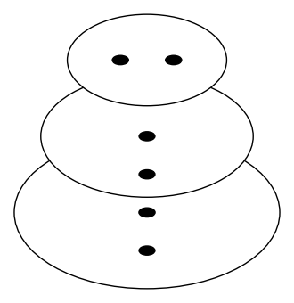

.. end of output

czy  też

.. code-block:: python

    sage: lk = [circle((random(),random()), random()/20,
    ...        fill=True, edgecolor=(random(), random(), random()),
    ...        facecolor=(random(), random(), random())) 
    ...        for i in xrange(500)]
    sage: show(sum(lk), axes=False, frame=True )

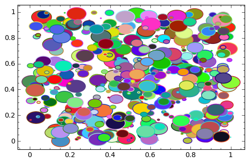

.. end of output

Bardzo łatwo tworzy się również wykresy ”trójwymiarowe”, tzn. wykresy funkcji dwóch zmiennych

.. code-block:: python

    sage: def f(x,y):
    ...       return math.sin(y*y+x*x)/math.sqrt(x*x+y*y+.0001)
    sage: P = plot3d(f,(-3,3),(-3,3), adaptive=True, 
    ...       color=rainbow(60, 'rgbtuple'),
    ...       max_bend=.1, max_depth=15)
    sage: P.show()

.. end of output

.. image:: iCSE_ITechninf04_z78_media/indeks.jpeg
    :align: center

czy też korzystając z Pythonowych funkcji lambda

.. code-block:: python

    sage: plot3d(lambda x, y: x^2 + sin(y^2), (-2,2), (-2,2), adaptive=True,
    ...          color=['red','yellow'])

.. end of output

To tyle jeżeli chodzi o przykłady. Teraz po kolei...

Funkcje plot() i show()
"""""""""""""""""""""""

Najczęściej będziemy używać Sage do tworzenia prostych wykresów wizualizujących wykonywane obliczenia. Do tego wykorzystamy komendy  **plot()**  oraz  **show()**. Pomimo, że obie komendy mają tylko niewielką liczbę parametrów którymi możemy dostrajać wykres, do prostych wizualizacji powinno to nam wystarczyć w zupełności (kiedy tak naprawdę chcemy zobaczyć jak wygląda dana funkcja, czy na szybko zobaczyć gdzie leżą jej miejsca zerowe lub ekstrema...). Do demonstracji użyjemy dwóch funkcji

.. math::
   :label: TI04_z78.1

   p(x) = 40e^{x}\sin(-\pi x),\quad r(x) = 40e^{x}\cos(-\pi x)

oraz ich różnicy :math:`h(x) = p(x) -  r(x)`.

.. code-block:: python

    sage: # funkcje symboliczne
    sage: p(x) = 40 * e^(-pi*x) * sin(3*pi*x)
    sage: r(x) = 40 * e^(-pi*x) * cos(3*pi*x)
    sage: h(x) = (p - r)

.. end of output

plot()
''''''''

Funkcja  ``plot()`` zainicjuje obiekt Sage o typie  ``sage.plot.plot.Graphics`` (możecie to sprawdzić sami).

Składnia funkcji **plot** to

``plot(f, (xmin, xmax), opcje)``

gdzie

- ``f`` to funkcja lub lista funkcji (lub wyrażeń symbolicznych) do wykreślenia,     
- ``(xmin, xmax)`` to zakres argumentu funkcji na wykresie (zakres osi :math:`x`),     
- ``opcje`` to różne opcje, którymi można dostosować wykres do żądanego wyglądu.

Tylko pierwszy parametr funkcji  ``plot()``, czyli  ``f`` jest obowiązkowy (``plot()`` musi wiedzieć co ma rysować), resztajest opcjonalna. Jeżeli krotka  ``(xmin, xmax)``  nie zostanie podana,  ``plot()``  przybierze domyślne wartości

- xmin = \-1     
- xmax = 1

Przykładowym opcjonalnym parametrem może być  ``rgbcolor``,  który powoduje zmianę domyślnego koloru wykresu (niebieskiego) na inny, np. czerwony

.. code-block:: python

    sage: plot(sin, rgbcolor="red")

.. image:: iCSE_ITechninf04_z78_media/cell_15_sage0.png
    :align: center

.. end of output

Możemy podawać zarówno nazwy kolorów (w języku angielskim) lecz w ograniczonym zakresie, lub dowolny kolor przestrzeni barw  `RGB <http://pl.wikipedia.org/wiki/RGB>`_  (Red Green Blue). A oto kilka możliwych kolorów i ich reprezentacje RGB:

- ``"red"   : (1.0,0.0,0.0)``,
- ``"orange": (1.0,0.5,0.0)``,
- ``"yellow": (1.0,1.0,0.0)``,
- ``"green" : (0.0,1.0,0.0)``,
- ``"blue"  : (0.0,0.0,1.0)``,
- ``"purple": (0.5,0.0,1.0)``,
- ``"white" : (1.0,1.0,1.0)``,
- ``"black" : (0.0,0.0,0.0)``,
- ``"grey"  : (0.5,0.5,0.5)``

Czyli, żeby narysować wykres funkcji :math:`sinus` w zakresie :math:`[0,2]` linią o kolorze pomarańczowym, wystarczy wpisać

.. code-block:: python

    sage: plot(sin, (0, 2*pi), rgbcolor="orange")

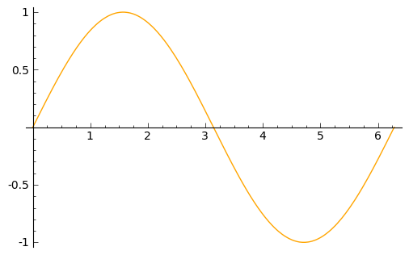

.. end of output

Słownik innych możliwych opcji, jakie możemy podać do funkcji  ``plot()``  dostępne są po wpisaniu

.. code-block:: python

    sage: plot.options

{'fillalpha': 0.5, 'detect_poles': False, 'plot_points': 200, 'thickness': 1, 'alpha': 1, 'adaptive_tolerance': 0.01, 'fillcolor': 'automatic', 'adaptive_recursion': 5, 'exclude': None, 'legend_label': None, 'rgbcolor': (0, 0, 1), 'fill': False}

.. end of output

Oto te opcje i ich wartości domyślne

- ``thickness=1``
  grubość linii     
- ``rgbcolor=(0,0,1)``
  kolor linii, domyślnie niebieski     
- ``alpha=1``
  przeźroczystość linii wykresu (domyślnie nieprzeźroczysta)     
- ``fill=None``
  wypełnienie przestrzeni pomiędzy wykresem a odciętą (osią :math:`OX`)     
- ``fillalpha=0.5``
  przeźroczystość wypełnienia     
- ``fillcolor=’automatic’``
  kolor wypełnienia     
- ``plot_points=200``
  ilość punktów z jakich składa się linia wykresu     
- ``adaptive_tolerance=0.01``
- ``adaptive_recursion=5``

No, ale my chcemy stworzyć wykresy aż 3 funkcji (r,p,h) naraz. Na początku, zbudujmy te wykresy, ale przypisując je do zmiennych:

.. code-block:: python

    sage: fig1 = plot(p, (0,5), rgbcolor=(0,0,1))
    sage: fig2 = plot(r, (0,5), rgbcolor='red')
    sage: fig3 = plot(h, (0,5), rgbcolor=(0.5,0.5,0))

.. end of output

``fig1`` to obiekt z klasy  ``sage.plot.plot.Graphics``, linia narysowana będzie pomiędzy 0 a 5 i będzie miała kolor niebieski,  ``fig2`` to linia czerwona a  ``fig3`` ciemnozielona.

show()
''''''''

Możemy teraz zobaczyć nasze wykresy razem na jednym obrazku używając funkcji  ``show()``. Składnia funkcji **show** to

``show(f, xmin, xmax, ymin, ymax, opcje)``

gdzie

- ``f``  to obiekt lub lista obiektów klasy  ``sage.plot.plot.Graphics``  (np:  ``plot(sin)``)
- ``xmin, xmax, ymin, ymax``  to zakres odciętej (OX) i rzędnej (OY)
- ``opcje``  to  różne  opcje,  którymi  można  dostosować  wykres  do  żądanego  wyglądu,  np.  (``dpi=300, figsize=[4,4],  axes=True/False,  fontsize=24,  frame=False/True``)

Tak jak w przypadku funkcji  ``plot()``  tylko pierwszy parametr jest obowiązkowy, a reszta jest opcjonalna. Zobaczmy w końcu jak wygląda ów wykres

.. code-block:: python

    sage: (fig1 + fig2 + fig3).show(xmin=0, xmax=1.5, ymin=-40, ymax=45, 
    ...          figsize=[8,4], fontsize=20, axes_labels=['x','funkcje'])

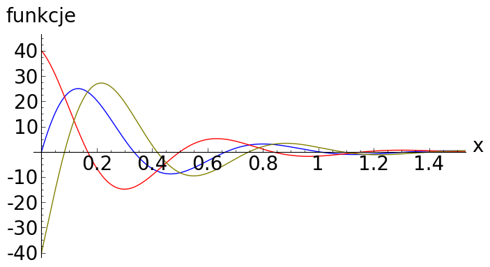

.. end of output

lub  równoważnie

.. code-block:: python

    sage: # wersja 2
    sage: show(fig1 + fig2 + fig3, xmin=0, xmax=1.5, ymin=-40, ymax=45, 
    ...      figsize=[8,4], fontsize=20)
    sage: # wersja 3
    sage: figs = fig1 + fig2 + fig3
    sage: figs.show(xmin=0, xmax=1.5, ymin=-40, ymax=45, figsize=[8,4], 
    ...      fontsize=20)
    sage: # wersja 4
    sage: show(figs, xmin=0, xmax=1.5, ymin=-40, ymax=45, figsize=[8,4], 
    ...      fontsize=20)

.. image:: iCSE_ITechninf04_z78_media/cell_25_sage0.png
    :align: center

.. image:: iCSE_ITechninf04_z78_media/cell_25_sage1.png
    :align: center

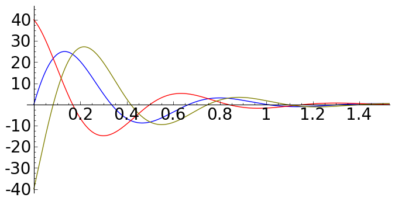

.. end of output

**Zadanie 1:** :math:`\mathop{sin}\nolimits` **i** :math:`\mathop{cos}\nolimits`

czas: 10 min.

Pokaż na wykresie, że :math:`\sin(x) = \cos(x - \pi/2)`.

**Uwaga:** może przydać ci się opcjonalny parametr ``linestyle``, który przyjmuje wartości

- ``"-"`` linia ciągła
- ``"--"`` linia przerywana
- ``"-."`` kropka–kreska
- ``":"`` linia kropkowana
- ``"None", "", " "`` nic (nie rysuje linii)

(np: ``linestyle="--"``, lub parametr ``marker``, który rysuje znaki. Przyjmuje on wartości

- ``"None", "", " "`` nic (domyślnie)
- ``","`` piksel, ``.`` punkt
- ``"_"`` linia pozioma, ``"`` linia pionowa
- ``"o"`` kółko, ``"p"`` pięciokąt, ``"s"`` kwadrat, ``"x"`` x, ``"+"`` plus, ``"*"`` gwiazdka
- ``"D"`` romb lub ``"d"`` mniejszy romb
- ``"H"`` ośmiokąt lub ``"h"`` inny ośmiokąt
- ``">"`` trójkąt skierowany w prawo, ``"<"`` w lewo, ``"^"`` do góry, ``"v"`` w dół
- ``"1", "2", "3", "4"`` tri w różnych kierunkach (dół, góra, lewo, prawo)
- ``0, 1, 2, 3`` podziałka (tick) w różnych kierunkach (lewo, prawo, góra, dół)
- ``"4, 5, 6, 7`` daszek w różnych kierunkach (lewo, prawo, góra, dół)
- ``...`` ciąg znaków z LATEX-a

Z nim łączą się takie parametry jak

- ``markersize`` wielkość znaków w punktach,
- ``markeredgecolor`` kolor obwódki znaku,
- ``markeredgewidth`` szerokość obwódki znaku w punktach.

Jak wygląda lista?
""""""""""""""""""

Dość często z list korzystaliśmy i jeszcze nie raz będziemy korzystać. Jeżeli dana lista zawierać będzie wyłącznie wartości liczbowe możemy ją przedstawić na wykresie. Oczywiście krótkie listy możemy przeglądać za pomocą instrukcji  ``print``, ale wyświetlanie list długich nie ma większego sensu. Prawdę mówiąc łatwiej zauważyć jakąś zależność między liczbami nawet dla list posiadających po kilka elementów. Do narysowania wykresu bazującego na liście służy funkcja  ``list_plot``. Spójrzmy na przykład

.. code-block:: python

    sage: # spadek swobodny
    sage: # wykres polozenia w zaleznosci od czasu
    sage: h0 = 100 # m
    sage: g_ziemskie  = 9.81 # m/s^2
    sage: tstart = 0 # czas poczatkowy
    sage: tstop = sqrt(2*h0/g_ziemskie) # czas spadku na ziemie
    sage: tkrok = (tstop-tstart)/20 # 20 punktow
    sage: h = [h0 - g_ziemskie*t^2/2 for t in srange(tstart, tstop, tkrok)]
    sage: list_plot(h)

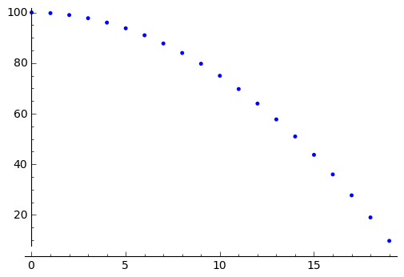

.. end of output

Łatwo zauważyć, że na osi odciętych odłożone mamy indeksy listy a na osi rzędnych wartości odpowiadające danym indeksom. Domyślnym stylem wykresu będą niebieskie punkty. Jeżeli będziemy chcieli zobaczyć linię łączącą punkty a nie same punkty, należy dodać opcję  ``plotjoined=True``

.. code-block:: python

    sage: list_plot(h, plotjoined=True)

.. image:: iCSE_ITechninf04_z78_media/cell_29_sage0.png
    :align: center

.. end of output

Możemy zobaczyć jednocześnie i punkty i linię. Należy dodać do siebie dwa takie wykresy.

.. code-block:: python

    sage: list_plot(h, plotjoined=True) + list_plot(h, faceted=True, 
    ...      color="red", size=50)

.. image:: iCSE_ITechninf04_z78_media/cell_31_sage0.png
    :align: center

.. end of output

Oczywiście możemy opisać osie, ustalić wielkość wykresu, wielkość czcionek dokładnie tak jak robiliśmy to dla funkcji ``plot()``. Możemy do tego użyć oczywiście funkcji  ``show()``.

Jeżeli chcielibyśmy aby na wykresie znajdowała się owa funkcja, którą zdefiniowaliśmy za pomocą naszego wyrażenia listowego, tzn: na osi OX znalazł się czas :math:`t` a na OY położenie w spadku swobodnym, należy do naszej funkcji podać nie listę, ale listę krotek w postaci :math:`[({t}_{1},{h}_{1}),({t}_{2},{h}_{2}),({t}_{3},{h}_{3}),...]`. Nie chcemy oczywiście robić tego ręcznie (dla 20 punktów to nie takie straszne, ale dla 2000?). Możemy sobie napisać pętlę (ale to zostawimy na zadanie domowe), albo skorzystać z funkcji  ``zip()``. Funkcja ta tworzy z wielu list identycznej długości listę krotek, z których każda zawiera wartości odpowiadające temu samemu indeksowi. Najpierw jednak stworzymy sobie listę ”czasów” (dyskretnych wartości czasu).

.. code-block:: python

    sage: t = srange(tstart, tstop, tkrok)
    sage: ht = zip(t,h)

.. end of output

i teraz możemy już sobie narysować naszą ”funkcję”

.. code-block:: python

    sage: list_plot(zip(t,h), axes_labels=[r'$t$',r'$x(t)$'], 
    ...      size=20, color="navy")

.. image:: iCSE_ITechninf04_z78_media/cell_35_sage0.png
    :align: center

.. end of output

Inne typy wykresów
""""""""""""""""""

Typów wykresów jest w Sage wiele. Oto lista z bardzo krótkimi wyjaśnieniami. Większość z nich ma dokładnie taką samą konstrukcję jak  ``plot()`` lub  ``list_plot``, w większości przypadków wystarczy podać funkcję lub listę do narysowania żądanej krzywej.

- ``parametric_plot()`` jako argument wpisujemy listę (krotkę) dwóch lub trzech funkcji, na osi OX odkładają się wartości pierwszej funkcji, na OY drugiej a na OZ trzeciej (jeżeli ją podamy dostaniemy trójwymiarowy wykres)

.. code-block:: python

    sage: parametric_plot([cos(x) + 2 * cos(x/4), sin(x) - 2 * sin(x/4)], 
    ...      (x,0, 8*pi), fill = True, color="gold")

.. image:: iCSE_ITechninf04_z78_media/cell_37_sage0.png
    :align: center

.. end of output

- ``implicit_plot()`` jako argumenty podajemy funkcje dwóch zmiennych :math:`f(x,y)`, dostajemy     wykres :math:`f(x,y) = 0`

Możemy  podać  też  równanie,
bądź  też  narysować  coś  bardziej  ciekawskiego

.. code-block:: python

    sage: var("x y")
    sage: f(x,y) = x^2 + y^2 - 2
    sage: implicit_plot(f, (-3,3), (-3,3), linestyle='dashdot')

.. image:: iCSE_ITechninf04_z78_media/cell_39_sage0.png
    :align: center

.. end of output

.. code-block:: python

    sage: var("x y")
    sage: implicit_plot(y^2+sin(x^2) == 2, (x,-3,3), (y,-3,3), 
    ...      color="steelblue")

.. image:: iCSE_ITechninf04_z78_media/cell_40_sage0.png
    :align: center

.. end of output

.. code-block:: python

    sage: G = Graphics()
    sage: counter = 0
    sage: for col in colors.keys():
    ...          G += implicit_plot(x^2+y^2==1+counter*.1, (x,-4,4),(y,-4,4),
    ...      color=col)
    ...          counter += 1
    sage: G.show(frame=False)

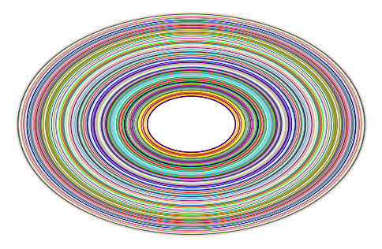

.. end of output

- ``polar_plot()`` przyjmuje funkcję lub listę (krotkę) funkcji i rysuje je we współrzędnych biegunowych

 

.. code-block:: python

    sage: polar_plot(sqrt, 0, 2 * pi, fill = True)

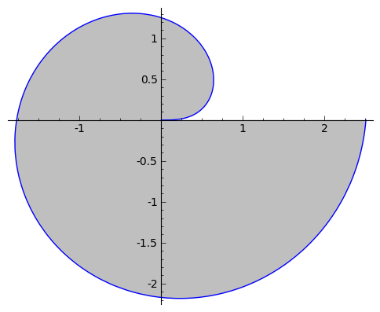

.. end of output

- ``region_plot()`` przyjmuje warunek logiczny ograniczający funkcję i rysuje region, gdzie wyrażenie jest prawdziwe

.. code-block:: python

    sage: region_plot(sin(x)*sin(y) >= 1/4, (x,-10,10), (y,-10,10),
    ...      incol='yellow', bordercol='black', borderstyle='dashed',
    ...      plot_points=250)

.. image:: iCSE_ITechninf04_z78_media/cell_45_sage0.png
    :align: center

.. end of output

- ``scatter_plot()`` wykres punktów podanych w liście list (krotek)

 

.. code-block:: python

    sage: scatter_plot([[0,1],[2,2],[4.3,1.1]], marker='s', markersize=100, 
    ...      facecolor='green')

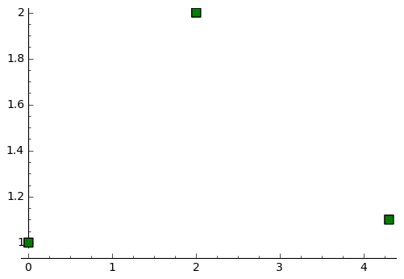

.. end of output

- ``bar_chart()`` to wykres słupkowy

- ``contour_plot()`` to wykres konturowy

- ``density_plot()`` wykres ”gęstości”, jako argumenty podajemy funkcje dwóch zmiennych :math:`f(x,y)`, dostajemy płaski wykres wartości tej funkcji

 

.. code-block:: python

    sage: density_plot(sin(x^2 + y^2)*cos(x)*sin(y), (x, -4, 4), (y, -4, 4), 
    ...      cmap='jet', plot_points=100)

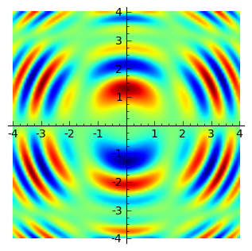

.. end of output

- ``plot_vector_field()`` rysuje pole wektorowe, podajemy 2 funkcje dwóch różnych zmiennych  :math:`f(x),s(y)`

.. code-block:: python

    sage: f = exp(-(x^2+y^2))
    sage: plot_vector_field(f.gradient(), (x,-2,2), (y,-2,2), 
    ...      color='darkorchid')

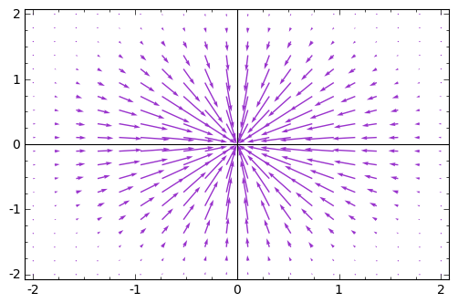

.. end of output

- ``matrix_plot()`` możemy zwizualizować sobie macierz (domyślnie w skali szarości)

.. code-block:: python

    sage: matrix_plot(matrix([[1,3,5,1],[2,4,5,6],[1,3,5,7]]))

.. image:: iCSE_ITechninf04_z78_media/cell_53_sage0.png
    :align: center

.. end of output

- ``graphics_array()`` macierz grafik, dzięki tej funkcji możemy wykresy przedstawiać obok siebie, w jednym obiekcie, funkcja  przyjmuje listę lub krotkę obiektów graficznych (jakichkolwiek powyższych wykresów) i rysuje je razem w żądanym układzie

 

.. code-block:: python

    sage: p(x) = 40 * e^(-pi*x) * sin(3*pi*x)
    sage: r(x) = 40 * e^(-pi*x) * cos(3*pi*x)
    sage: h(x) = (p - r)
    sage: p1 = plot(p,(0,2),color=hue(0.3))
    sage: p2 = plot(r,(0,2),color=hue(0.6))
    sage: p3 = plot(h,(0,2),color=hue(0.9))
    sage: p4 = parametric_plot((p,h),(0,2*pi),color=hue(0.1))
    sage: p5 = parametric_plot((r,h),(0,2*pi),color=hue(0.5))
    sage: p6 = parametric_plot((r,p),(0,2*pi),color=hue(1.0))
    sage: ga = graphics_array(((p1,p2,p3),(p4,p5,p6)))
    sage: ga.show()

.. end of output

.. image:: iCSE_ITechninf04_z78_media/sage0.png
    :align: center

Kółka, krzywe zamknięte, strzałki i inne
""""""""""""""""""""""""""""""""""""""""

Sage posiada również spore możliwości rysowania dowolnych obiektów znanych z geometrii. W zasadzie nie ma obiektu, którego z ich użyciem nie da się narysować. Na samym początku widzieliśmy bałwanka zrobionego na samych kółkach.

- ``arrow()`` \- rysuje strzałkę. 
- ``circle()`` \- rysuje koło o zadanym środku i promieniu 
- ``ellipse()`` \- rysuje elipsę o zadanym środku i promieniach 
- ``arc()`` \- wycinek koła lub elipsy 
- ``disk()`` \- wypełniony dysk 
- ``line()`` \- rysuje linię bazując na liście punktów 
- ``point()`` \- rysuje punkt 
- ``text()`` \- wstawia tekst 
- ``polygon()`` \- rysuje wypełnioną zamkniętą krzywą

Zadania
~~~~~~~

**Zadanie 2: Narysuj krzywe**

czas: 30 min.

Narysuj:

- ewolwentę
- cykloidę
- brachistochronę
- hiperbolę
- hipocykloidę
- lemniskatę Bernoulliego (we współrzędnych kartezjańskich i biegunowych)

**Zadanie 3: Dopasowanie**

czas: 10 min.

Do podanych punktów dopasuj krzywą (m/w).

``l = [0, 0.8, 0.079, 4.8, 12., 18.51, 23., 31., 48., 81.]``

**Zadanie 4: Ruch balistyczny**

czas: 20 \- 40 min.

Narysuj tor lotu pocisku artyleryjskiego o kalibrze 155 mm wystrzelonej z armaty ustawionej pod kątem   :math:`\alpha = \pi/3` w stosunku do ziemi i z prędkością początkową :math:`{v}_{0} = 800` m/s. Wysokość końca lufy to 1 m.

**wersja łatwa**: bez oporu powietrza

**wersja trudna**: z oporem powietrza

Zadania domowe
""""""""""""""

Stwórz notatnik ’Zadania domowe L06, Imię Nazwisko’. W tym notatniku rozwiąż poniższe zadania. Postaraj się jasno opisać jakie zadanie rozwiązujesz oraz metodykę rozwiązania tego zadania. Notatnik uwspólnij (tylko) z prowadzącym ćwiczenia.

**Zadanie ZD6.1: Równanie Batmana**

czas: – min.

Stwórz poniższy znaczek Batmana używając funkcji ``implicit_plot()``

.. image:: iCSE_ITechninf04_z78_media/zd61.png
   :align: center

**Zadanie ZD6.2: myzip()**

czas: – min.

Zdefiniuj swoją własną funkcję ``myzip()`` działającą dokładnie jak funkcja ``zip()``.

**Wersja normalna** tylko dla dwóch list

**Wersja trudna (dla odważnych)** dla dowolnej liczby list

**Zadanie ZD6.3: Krzywe Lissajous**

czas: – min.

Są to parametryczne krzywe opisujące drgania harmoniczne. Narysuj 9 różnych krzywych na jednym obrazku za  pomocą macierzy grafik. Każda krzywa ma mieć inny kolor, musi być opisana (na każdym obrazku muszą być      podane wszystkie parametry krzywej). Osie X i Y mają zostać wyłączone, krzywe powinny być obrysowane      ramką.

**Zadanie ZD6.4: Metoda Newtona**

czas: – min.

Jest to iteracyjny algorytm wyznaczania przybliżonej wartości pierwiastka funkcji. Wygeneruj rysunek ilustrujący tą metodę (patrz: `wiki <http://pl.wikipedia.org/wiki/Metoda_Newtona>`_).

