.. -*- coding: utf-8 -*-

Wykresy - przykłady i zadania
-----------------------------

.. code-block:: python

    sage: plot(sin, color='red')

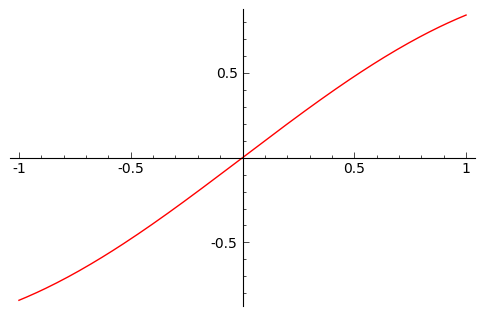

.. end of output

.. code-block:: python

    sage: # spadek swobodny
    sage: # wykres polozenia w zaleznosci od czasu
    sage: h0 = 100 # m
    sage: g_ziemskie  = 9.81 # m/s^2
    sage: tstart = 0 # czas poczatkowy
    sage: tstop = sqrt(2*h0/g_ziemskie) # czas spadku na ziemie
    sage: tkrok = (tstop-tstart)/20 # 20 punktow
    sage: h = [h0 - g_ziemskie*t^2/2 for t in srange(tstart, tstop, tkrok)]
    sage: list_plot(h)

.. image:: iCSE_ITechninf04_z78_ROZWIAZANIA_ZADAN_media/cell_4_sage0.png
    :align: center

.. end of output

.. code-block:: python

    sage: list_plot(h, plotjoined=True)

.. image:: iCSE_ITechninf04_z78_ROZWIAZANIA_ZADAN_media/cell_9_sage0.png
    :align: center

.. end of output

.. code-block:: python

    sage: list_plot(h, plotjoined=True) + list_plot(h, faceted=True, 
    ...      color="red", size=50)

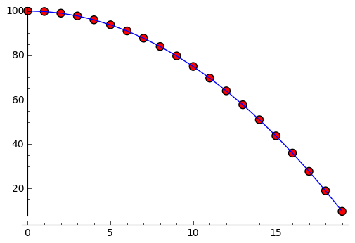

.. end of output

.. code-block:: python

    sage: t = srange(tstart, tstop, tkrok)
    sage: list_plot(zip(t,h), axes_labels=[r'$t$',r'$x(t)$'], size=20, 
    ...      color="navy")

.. image:: iCSE_ITechninf04_z78_ROZWIAZANIA_ZADAN_media/cell_7_sage0.png
    :align: center

.. end of output

.. code-block:: python

    sage: l = [n(random()*x^2,8) for x in xrange(10)]
    sage: list_plot(l)

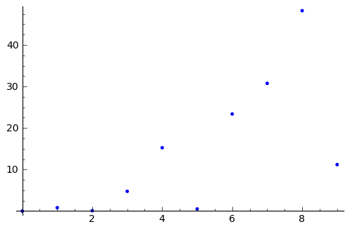

.. end of output

.. code-block:: python

    sage: list_plot(r)

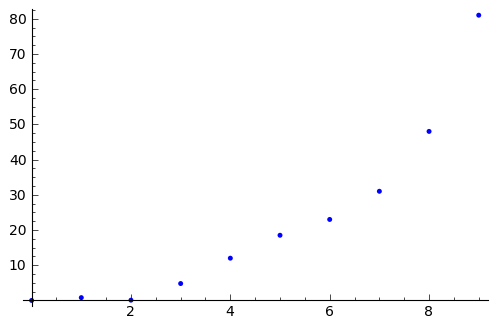

.. end of output

Zadania na lekcji
=================

Zadanie 2: Narysuj krzywe
~~~~~~~~~~~~~~~~~~~~~~~~~~

- ewolwentę
- cykloidę
- brachistochronę
- hiperbolę
- hipocykloidę
- lemniskatę Bernoulliego (we współrzędnych kartezjańskich i biegunowych)

.. code-block:: python

    sage: # ewolwenta
    sage: a = 1
    sage: var('t')
    sage: parametric_plot((a*(cos(t) + t*sin(t)), a*(sin(t) - t*cos(t))), 
    ...          (t,0,6*pi), fill=1, color='firebrick', fillcolor='gold')

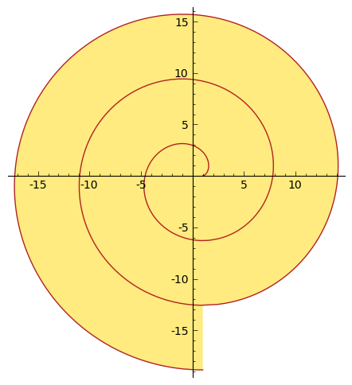

.. end of output

.. code-block:: python

    sage: # cykloida
    sage: a = 1
    sage: var('t')
    sage: parametric_plot((a*(t-sin(t)), a*(1-cos(t))), (t,0,6*pi), fill=1, 
    ...      color='firebrick', fillcolor='gold')

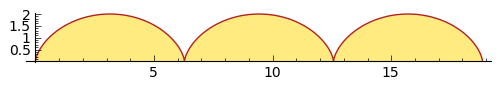

.. end of output

.. code-block:: python

    sage: # brahistochrona (w zasadzie cykloida)
    sage: a = 1/2/9.81
    sage: var('t')
    sage: parametric_plot((1/2*a^2*(t-sin(t)), 1/2*a^2*(1-cos(t))), (t,0,6*pi), 
    ...          fill=1, color='firebrick', fillcolor='gold')

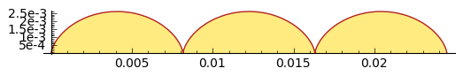

.. end of output

.. code-block:: python

    sage: # hiperbola
    sage: var('x y')
    sage: a, b = 1, 1
    sage: (sum([implicit_plot(x^2/a^2 - y^2/b^2 == 1, (x,-2,2), (y,-2,2), 
    ...      color=(a,1,a)) for a in srange(.1,1,0.1)])).show(aspect_ratio=1)
    sage: 2

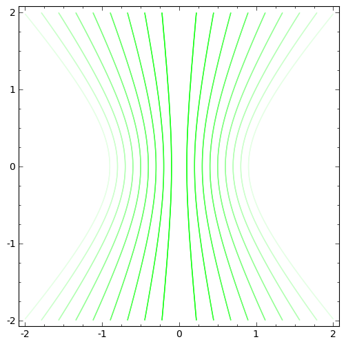

2

.. end of output

.. code-block:: python

    sage: #hipocykloida
    sage: var('t')
    sage: r, R = 1, 2.13
    sage: graphics_array([parametric_plot(((r-R)*(cos(t) + r*cos((R-r)/r*t)), 
    ...      (r-R)*(sin(t) - r*sin((R-r)/r*t))), (t,-10,150), fill=1, 
    ...      color='firebrick', fillcolor='gold', thickness=0.3, 
    ...      plot_points=300) for R in srange(0.5,3, 0.23)], 
    ...      4,3).show(dpi=250, frame=1, aspect_ratio=1, fontsize=5)

.. image:: iCSE_ITechninf04_z78_ROZWIAZANIA_ZADAN_media/sage0.png
    :align: center
    :width: 600px

.. end of output

.. code-block:: python

    sage: #Lemniskata Bernoulliego
    sage: a = 1
    sage: graphics_array([implicit_plot((x^2+y^2)^2 == 2 * a^2 * (x^2 - y^2), 
    ...      (x, -2, 2), (y, -1, 1), color='firebrick'),
    sage: polar_plot(2*a^2*cos(2*t), (t,0,2*pi), fill=0, color='firebrick', 
    ...      fillcolor='gold'),
    sage: parametric_plot((a*sqrt(2)*cos(t)/(1 + sin(t)^2),
    ...      a*sqrt(2)*sin(t)*cos(t)/(1 + sin(t)^2)),
    ...      (t,0,2*pi), color='firebrick')]).show(aspect_ratio=1, 
    ...      dpi=200, frame=1)

.. image:: iCSE_ITechninf04_z78_ROZWIAZANIA_ZADAN_media/sage1.png
    :align: center
    :width: 600px

.. end of output

Zadanie 3: Dopasowanie
~~~~~~~~~~~~~~~~~~~~~~

Do podanych punktów dopasuj krzywą (m/w).

``l = [0, 0.8, 0.079, 4.8, 12., 18.51, 23., 31., 48., 81.]``

.. code-block:: python

    sage: l = [0, 0.8, 0.079, 4.8, 12., 18.51, 23., 31., 48., 81.]
    sage: list_plot(l) + plot(x^(1.96), (0,len(l)), color='red')

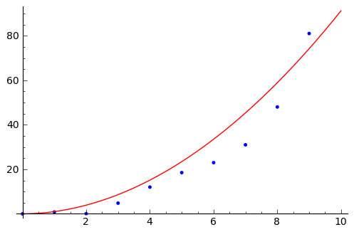

.. end of output

Zadanie 4: Ruch balistyczny
~~~~~~~~~~~~~~~~~~~~~~~~~~~

Narysuj tor lotu pocisku artyleryjskiego o kalibrze 155 mm wystrzelonej z armaty ustawionej pod kątem :math:`\alpha = \pi/3` w stosunku do ziemi i z prędkością początkową :math:`{v}_{0} = 800` m/s. Wysokość końca lufy to 1 m.

**wersja łatwa**: bez oporu powietrza

**wersja trudna**: z oporem powietrza

.. code-block:: python

    sage: # parametryczne równanie ruchu
    sage: x, y0, theta, v0, g = var("x, y0, theta, v0, g")
    sage: gZ = 9.81 #m/s^2
    sage: alpha = pi/3. #rad
    sage: v0n = 800 #m/s
    sage: y0n = 1 #m
    sage: kaliber = 155 / 1000. #m
    sage: f(x, y0, theta, v0, g) = y0 + x*tan(theta) - g*x^2/2/v0^2/cos(theta)^2
    sage: rozw = solve(f == 0, x)

.. end of output

.. code-block:: python

    sage: # wybieramy dodatnie rozwiązanie (ujemne jest na lewo od armaty)
    sage: for idx in [0,1]:
    ...       tmp(y0, theta, v0, g) = rozw[idx].rhs()
    ...       zasieg = tmp(y0n, alpha, v0n, gZ).n()
    ...       if zasieg > 0:
    ...           break

.. end of output

.. code-block:: python

    sage: (plot(f(x, y0n, alpha, v0n, gZ), (x,0,zasieg), fill=0, color='green', 
    ...      fillcolor='yellow', thickness=2) + point((zasieg, 0), size=50, 
    ...      faceted=1, color='red') + text(" (%.2f,0)"%zasieg, (zasieg, 0), 
    ...      rotation=60, horizontal_alignment='left', 
    ...      vertical_alignment='bottom')).show(axes_labels=["$x [m]$",
    ...      "$y(x) [m]$"], fontsize=14)

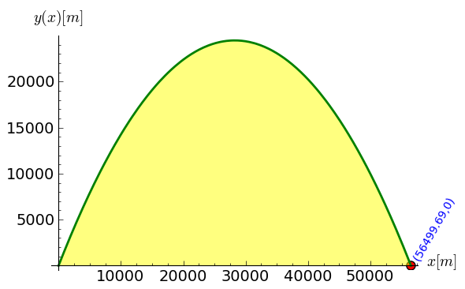

.. end of output

.. code-block:: python

    sage: #Opór powietrza: TBA

.. end of output

Zadania domowe
==============

ZD6.1 (Batman)
~~~~~~~~~~~~~~

.. code-block:: python

    sage: var('x,y')
    sage: F = region_plot((x<8,x>-8,y<4,y>-4),(x,-8,8),(y,-4,4),incol='black')
    sage: G = implicit_plot((x/7)^2*sqrt(abs(abs(x)-3)/(abs(x)-3))+
    ...      (y/3)^2*sqrt(abs(y+3*sqrt(33)/7)/(y+3*sqrt(33)/7))-1==0,(x,-8,8),
    ...      (y,-4,4),plot_points=1200,color='yellow')
    sage: H = implicit_plot(abs(x/2)-((3*sqrt(33)-7)/112)*x^2-3
    ...      +sqrt(1-(abs(abs(x)-2)-1)^2)-y==0,(x,-8,8),(y,-4,4),
    ...      plot_points=1200,color='yellow')
    sage: I = implicit_plot(9*sqrt(abs((abs(x)-1)*(abs(x)-0.75))/
    ...      ((1-abs(x))*(abs(x)-0.75)))-8*abs(x)-y==0,(x,-8,8),(y,-4,4),
    ...      plot_points=1200,color='yellow')
    sage: J = implicit_plot(3*abs(x)+0.75*sqrt(abs((abs(x)-0.75)*(abs(x)
    ...      -0.5))/((0.75-abs(x))*(abs(x)-0.5)))-y==0, (x,-8,8),
    ...      (y,-4,4),plot_points=1200,color='yellow')
    sage: K = implicit_plot(2.25*sqrt(abs((x-0.5)*(x+0.5))/((0.5-x)*(0.5+x)))
    ...      -y==0, (x,-8,8),(y,-4,4),plot_points=1200,color='yellow')
    sage: L = implicit_plot((6*sqrt(10))/7+(1.5-0.5*abs(x))*
    ...      sqrt(abs(abs(x)-1)/(abs(x)-1))-((6*sqrt(10))/14)*
    ...      sqrt(4-(abs(x)-1)^2)-y==0,(x,-8,8),
    ...      (y,-4,4),plot_points=1200,color='yellow')
    sage: (F+G+H+I+J+K+L).show(aspect_ratio=1, frame=False)

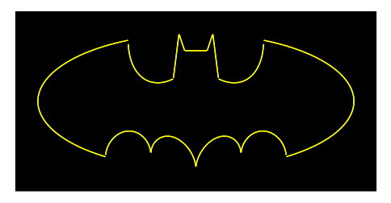

.. end of output

ZD6.2 (myzip)
~~~~~~~~~~~~~

.. code-block:: python

    sage: def myzip(lista1, lista2):
    ...       "myzip: 2 listy"
    ...       if (type(lista1) == list or type(lista1) == tuple) and 
    ...      (type(lista2) == list or 
    ...       type(lista2) == tuple):
    ...           l1 = len(lista1)
    ...           l2 = len(lista2)
    ...           if l1 == l2:
    ...               L = []
    ...               for idx in xrange(l1):
    ...                   point = []
    ...                   point.append(lista1[idx])
    ...                   point.append(lista2[idx])        
    ...                   L.append(tuple(point))
    ...               return L
    ...           else:
    ...               print("nierówne długości list")
    ...       else:
    ...           print "Podaj listy lub krotki"

.. end of output

.. code-block:: python

    sage: a = range(5)
    sage: b = range(5)
    sage: print zip(a,b)
    sage: print myzip(a,tuple(a))

| [(0, 0), (1, 1), (2, 2), (3, 3), (4, 4)]
| [(0, 0), (1, 1), (2, 2), (3, 3), (4, 4)]

.. end of output

.. code-block:: python

    sage: def myzip2(*argv):
    ...       "myzip: wiele list"
    ...       output = 0
    ...       
    ...       if len(argv) < 2:
    ...           print "min 2 listy lub krotki"
    ...           output = None
    ...       
    ...       l = []
    ...       for arg in argv:
    ...           if not (type(arg) == list or type(arg) == tuple):
    ...               print "Podaj listy lub krotki"
    ...               output = None
    ...               break
    ...           else:
    ...               l.append(len(arg))
    ...           
    ...       if False in [l[0] == la for la in l]:
    ...           print "listy muszą być równe" 
    ...           output = None
    ...       
    ...       if output != None:
    ...           L = []
    ...           for idx in xrange(l[0]):
    ...               point = []
    ...               for arg in argv:
    ...                   point.append(arg[idx])
    ...               L.append(tuple(point))    
    ...       
    ...       return None if output == None else L

.. end of output

.. code-block:: python

    sage: print zip(a,tuple(a),tuple(b))        
    sage: print myzip2(a,tuple(a),tuple(b))

| [(0, 0, 0), (1, 1, 1), (2, 2, 2), (3, 3, 3), (4, 4, 4)]
| [(0, 0, 0), (1, 1, 1), (2, 2, 2), (3, 3, 3), (4, 4, 4)]

.. end of output

ZD6.3 (Lissajous)
~~~~~~~~~~~~~~~~~

.. code-block:: python

    sage: A = 1
    sage: B = 1
    sage: a = [randint(1,10) for i in range(1,10)]
    sage: b = [randint(1,10) for i in range(1,10)]
    sage: delta = [random()*2 for i in range(1,10)]
    sage: pp = []
    sage: for a, b, delta in zip(a,b,delta):
    ...       f(x) = A*sin(a*x + delta*pi) 
    ...       g(x) = B*sin(b*x)
    ...       pp.append(parametric_plot((f,g),(-2*pi,2*pi), 
    ...       color=((a+b)/20.,a/10.,b/10.)) 
    ...       + text(r"$a=%d, b=%d$" % (a,b), (0,0), color="black") 
    ...       + text(r"$\delta=%.2f\pi$" % (delta), (0,-0.5), color="black")) 
    sage: graphics_array(((pp[0],pp[1],pp[2]),(pp[3],pp[4],pp[5]),
    ...       (pp[6],pp[7],pp[8]))).show(frame=True, axes=False, 
    ...       aspect_ratio=1, ticks=None)

.. image:: iCSE_ITechninf04_z78_ROZWIAZANIA_ZADAN_media/sage2.png
    :align: center

.. end of output

Zadanie ZD6.4: Metoda Newtona
~~~~~~~~~~~~~~~~~~~~~~~~~~~~~~~~~

.. code-block:: python

    sage: x = var('x')
    sage: #przykładowa funkcja
    sage: f(x) = sqrt(x)-2; print f
    sage: df(x) = diff(f,x); print df
    sage: # i jej wykres na szybko
    sage: plot(f,0,5).show(dpi=50)

| x \|--> sqrt(x) - 2
| x \|--> 1/2/sqrt(x)

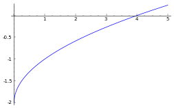

.. end of output

.. code-block:: python

    sage: # szukamy miejsca zerowego na przedziale [a,b] = [1,2] metodą Newtona
    sage: # warunek stopu (dokładność obliczeń):
    sage: epsilon = 1e-8
    sage: #równanie na styczną do funkcji w punkcie (x0, f(x0))
    sage: var('x0, y0')
    sage: styczna(x, x0) = f(x0) + df(x0)*(x - x0)
    sage: a, b = 0.5, 2
    sage: y = a
    sage: pts1 = []
    sage: pts2 = []
    sage: sty = []
    sage: sty2 = []
    sage: while not ((f(y) < epsilon) and (f(y) > -epsilon)):
    ...      print y.n(), f(y).n()    
    ...      pts1.append(point([y, f(y)], size=20, faceted=1, 
    ...      rgbcolor='yellow'))
    ...      pts2.append(point([y - f(y)/df(y), 0], size=20, faceted=1, 
    ...      rgbcolor='red'))    
    ...      sty2.append(plot(styczna(x, y),0,6,color='green', 
    ...      linestyle='solid'))    
    ...      y -= f(y)/df(y)
    ...       
    sage: print "Miejsce zerowe (x,f(x)) =", (y.n(), f(y.n()))   
    sage: # grafika - trzeba narysować wykres + odpowiednie 
    sage: # proste styczne do punktów, 
    sage: # w których obliczamy kolejne "zera" 
    sage: (sum(pts) +sum(pts2) + sum(sty2) + 
    ...      plot(f,0,6)).show(axes_labels=["$x$","$f(x)$"], 
    ...      ymax=1, fontsize=14)

| 0.500000000000000 -1.29289321881345
| 2.32842712474619 -0.474081547150638
| 3.77524668665126 -0.0570005953034218
| 3.99675093213506 -0.000812431977665673
| 3.99999933995428 -1.65011436292772e-7
| Miejsce zerowe (x,f(x)) = (3.99999999999997, -6.88338275267597e-15)

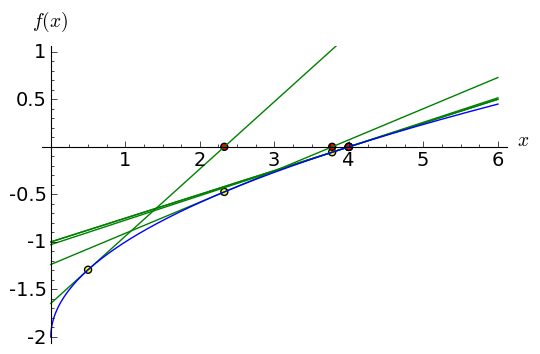

.. end of output

.. code-block:: python

    sage: # a co nam powie o miejscu zerowym Sage?
    sage: f.find_root(1,5)

3.9999999999999996

.. end of output

