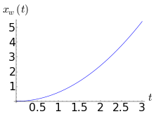

.. -*- coding: utf-8 -*-

Zadania z fizyki
================

Resnick Halliday

**Zadanie (ResHol10r3t1)**

Położenie punktu materialnego poruszającego się wzdłuż osi :math:`x` zależy od czasu jak

:math:`x = \frac{v_{0}}{k}(1 - e^{-kt})`

gdzie :math:`v_{0}` oraz :math:`k` są wielkościami stałymi.

 #. zrób wykres zależności :math:`x` od :math:`t`; jaką wartość przyjmuje :math:`x` dla :math:`t=0` i :math:`t=\infty`?

 #. Jaka jest całkowita odległość jaką pokonuje punkt? 

 #. Znajdź równanie na prędkość i przyspieszenie. Jaka jest zależność między prędkością i przyspieszeniem? 

Uwaga: w rysunkach opisz osie, użyj różnych kolorów jeżeli będziesz umieszczał więcej niż jedną linię na wykresie, zrób legendę opisującą konkretne funkcje.

Rozwiązanie:

.. code-block:: python

    sage: reset()
    sage: t, v_0, k = var('t v_0 k')
    sage: x(t,v_0,k) = v_0 / k * (1 - e^(-k*t))

.. end of output

.. code-block:: python

    sage: # punkt 1
    sage: plot(x(t,1,1), (t,0,10)).show(axes_labels=["$t$","$x(t)$"], fontsize=14, legend_loc='lower right')
    sage: # t = 0
    sage: asympt1 = x(0, v_0, k); show("$x(0) = %s$"%asympt1)
    sage: # t = inf
    sage: asympt2 = x(Infinity, v_0, k); show("$x(\infty) = %s$"%asympt2)

.. MATH::

    \hbox{$x(0) = 0$}

.. MATH::

    \hbox{$x(\infty) = v_0/k$}

.. end of output

.. code-block:: python

    sage: # punkt 2
    sage: droga = asympt2 - asympt1; show("Całkowita droga pokonana przez punkt to $x(\infty) - x(0) = %s$"%droga)

.. MATH::

    \hbox{Całkowita droga pokonana przez punkt to $x(\infty) - x(0) = v_0/k$}

.. end of output

.. code-block:: python

    sage: v = x.diff(t); print "prędkość"; show(v)
    sage: a = x.diff(t,2); print "przyspieszenie"; show(a)
    prędkość
    przyspieszenie

.. MATH::

    \left( t, v_{0}, k \right) \ {\mapsto} \ v_{0} e^{\left(-k t\right)}

.. MATH::

    \left( t, v_{0}, k \right) \ {\mapsto} \ -k v_{0} e^{\left(-k t\right)}

.. end of output

.. code-block:: python

    sage: # ustawiamy parametry dla dodatniej prędkości początkowej
    sage: v0n, kn = 2, 1
    sage: print "v_n = %s, k = %s" % (v0n, kn)
    sage: show("asymptota $x(\infty) =%s$"% asympt2(v_0=v0n,k=kn))
    sage: # i rysujemy krzywe
    sage: (plot(x(t,v_0=v0n,k=kn), (t,0,10), legend_label=r"$x(t)$") + 
    sage: plot(v(t,v_0=v0n,k=kn), (t,0,10), color='red', legend_label=r"$v(t)$") + 
    sage: plot(a(t,v_0=v0n,k=kn), (t,0,10), color='green', legend_label=r"$a(t)$") + 
    sage: plot(asympt1(v_0=v0n,k=kn), (t,0,10), color='black', legend_label=r"asymptota $x(0) = %s$"%asympt1, linestyle='dotted') + 
    sage: plot(asympt2(v_0=v0n,k=kn), (t,0,10), color='black', legend_label=r"asymptota $x(\infty) = %s$"%asympt2, linestyle='dotted')).show(axes_labels=["$t$","$x,v,a$"], fontsize=14, legend_loc='lower right')
    v_n = 2, k = 1

.. MATH::

    \hbox{asymptota $x(\infty) =2$}

.. image:: iCSE_ITechninf05_z80_mechanika_media/cell_20_sage0.png
    :align: center

.. end of output

Znak prędkości zawsze jest odwrotny do znaku przyspieszenia, bo :math:`a(t) = - k v(t)`.

.. code-block:: python

    sage: # ustawiamy parametry dla ujemnej prędkości początkowej
    sage: v0n, kn = -2, 0.3
    sage: print "v_n = %s, k = %s" % (v0n, kn)
    sage: show("asymptota $x(\infty) =%.2f$"% asympt2(v_0=v0n,k=kn))
    sage: # i rysujemy krzywe
    sage: (plot(x(t,v_0=v0n,k=kn), (t,0,10), legend_label=r"$x(t)$") + 
    sage: plot(v(t,v_0=v0n,k=kn), (t,0,10), color='red', legend_label=r"$v(t)$") + 
    sage: plot(a(t,v_0=v0n,k=kn), (t,0,10), color='green', legend_label=r"$a(t)$") + 
    sage: plot(asympt1(v_0=v0n,k=kn), (t,0,10), color='black', legend_label=r"asymptota $x(0) = %s$"%asympt1, linestyle='dotted') + 
    sage: plot(asympt2(v_0=v0n,k=kn), (t,0,10), color='black', legend_label=r"asymptota $x(\infty) = %s$"%asympt2, linestyle='dotted')).show(axes_labels=["$t$","$x,v,a$"], fontsize=14, legend_loc=0)
    v_n = -2, k = 0.300000000000000

.. MATH::

    \hbox{asymptota $x(\infty) =-6.67$}

.. image:: iCSE_ITechninf05_z80_mechanika_media/cell_32_sage0.png
    :align: center

.. end of output

**Zadanie 2, (ResHol29r3t1)**

Zależność położenia punktu poruszającego się wzdłuż osi x od czasu dana jest wzorem

:math:`x = at^2 - bt^3`.

Jednostkami :math:`x` i :math:`t` są :math:`[x] = m`, a czasu :math:`[t] = s`.

Pytania (przyjmijmy, że :math:`a = 3`, :math:`b=1`):

 #. Jakie wymiary powinny mieć stałe :math:`a` i :math:`b`.

 #. Po jakim czasie punkt osiągnie maksymalną odległość w kierunku dodatnim osi x?

 #. Jaka będzie całkowita droga przbyta przez pierwsze 4s?

 #. Jakie jest przemieszczenie punktu po owych 4s?

 #. Jaka jest prędkość punktu po upływie każdej z czterech pierwszych sekund?

.. code-block:: python

    sage: reset()
    sage: var('t a b')
    sage: an, bn = 3, 1
    sage: x(t,a,b) = a*t^2 - b*t^3

.. end of output

.. code-block:: python

    sage: # punkt 1, jednostki
    sage: var('m s')
    sage: r_jednostka_a = m == a * s^2
    sage: jednostka_a = solve(r_jednostka_a,a)
    sage: r_jednostka_b = m == b * s^3
    sage: jednostka_b = solve(r_jednostka_b,b)
    sage: # odp, punkt 1
    sage: show("[a] = $%s$, [b] = $%s$" % (jednostka_a[0].rhs(),jednostka_b[0].rhs()))

.. MATH::

    \hbox{[a] = $m/s^2$, [b] = $m/s^3$}

.. end of output

.. code-block:: python

    sage: # punkt 2, maksymalna odległość w kierunku dodatnim osi x
    sage: # najpierw zobaczymy jak wygląda x
    sage: plot(x(t,an,bn), (t,0,4), fill=True, fillcolor="yellow", thickness=2, ).show(axes_labels=["$t$","$x(t)$"], fontsize=12)

.. end of output

.. code-block:: python

    sage: # widzimy, że maksymalna odległość w kierunku dodatniej osi dana jest przez maksimum funkcji x
    sage: # obliczmy t dla którego mamy owo maksimum - wystarczy znajeźć miejsca zerowe pochodnej
    sage: v = x.diff(t); print v
    sage: zerav = solve(v == 0, t)
    (t, a, b) |--> -3*b*t^2 + 2*a*t

.. end of output

.. code-block:: python

    sage: # czas po jakim osiągamy maksimum
    sage: maksimumx_t(a,b) = zerav[0].rhs(); print maksimumx_t
    (a, b) |--> 2/3*a/b

.. end of output

.. code-block:: python

    sage: # zatem, dla naszych parametrów 
    sage: print "maksymalna odległość w kierunku dodatnim osi x osiągnięta zostanie po ", maksimumx_t(an,bn), "sekundach"
    maksymalna odległość w kierunku dodatnim osi x osiągnięta zostanie po  2 sekundach

.. end of output

.. code-block:: python

    sage: # pytanie 3: Jaka będzie całkowita droga przbyta przez pierwsze 4s?
    sage: # należy wziąść pod uwagę, że punkt na początku poruszał się w kierunku dodatnich x
    sage: # a później w kierunku ujemnych, więc najprościej jest napisać
    sage: droga = abs(x(4,an,bn)) + x(maksimumx_t(an,bn),an, bn) * 2; print "droga po 4 sekundach wynosi %dm" % droga
    droga po 4 sekundach wynosi 24m

.. end of output

.. code-block:: python

    sage: # lub nieco bardziej rozsądnie, czyli długość krzywej (choć nie za dokładnie toto liczy...)
    sage: xn(t) = x(t,an,bn)
    sage: #s = integral_numerical(sqrt(1 + (diff(xn,t))^2), (t,0, 4))
    sage: droga = integral_numerical(sqrt(1+(xn.diff(t))^2),0,4)[0]; print "droga po 4 sekundach wynosi %dm" % droga
    droga po 4 sekundach wynosi 24m

.. end of output

.. code-block:: python

    sage: # 4. przemieszczenie po 4 s?
    sage: print "przemieszczenie po 4 sekundach wynosi %dm" % x(4,an,bn)
    przemieszczenie po 4 sekundach wynosi -16m

.. end of output

.. code-block:: python

    sage: # 5. Jaka jest prędkość punktu po upływie każdej z czterech pierwszych sekund?
    sage: # jako, że już obliczyliśmy predkość, bo była potrzebna do znalezienia maksimum, wystarczy teraz zapisać
    sage: for tn in range(1,5):
    ...       print "Prędkość dla t = %d wynosi v(%d) = %d" %(tn, tn, v(tn,an,bn))
    Prędkość dla t = 1 wynosi v(1) = 3
    Prędkość dla t = 2 wynosi v(2) = 0
    Prędkość dla t = 3 wynosi v(3) = -9
    Prędkość dla t = 4 wynosi v(4) = -24

.. end of output

**Zadanie 3, (ResHol45r3t1)**

Winda wznosi się do góry z przyspieszeniem :math:`1.2 m/s^2`. W momencie gdy jej prędkość wynosi :math:`2.4 m/s` obluzowana śruba spada z sufitu na podłogę windy. Winda ma :math:`2.7m` wysokości. Oblicz

 #. Czas, po jakim śruba sparnie z sufitu na podłogę.

 #. Odległość, która pokona śruba względem ścian domu.

.. code-block:: python

    sage: reset()
    sage: h_windy = 2.7 # [m]
    sage: a_windy = 1.2 # [m/s^2]
    sage: gZ = 9.81 # [m/s^2]
    sage: #as = gZ + a_windy
    sage: # równanie ruchu dla śruby
    sage: show("$m\ddot{x}_s(t) = ma_{w} + mg \qquad \Rightarrow \qquad \ddot{x}_s = a_{w} + g$")
    sage: t, aw, g, h0, v0 = var('t, aw, g, h0, v0')
    sage: x = function('x', t); print x
    sage: xs(t,aw,g,h0,v0) = desolve(diff(x,t,2) - aw - g == 0, x, ivar=t, ics=[0,h0,v0], contrib_ode=True)
    sage: xs
    x(t)
    (t, aw, g, h0, v0) |--> 1/2*(aw + g)*t^2 + t*v0 + h0

.. MATH::

    \hbox{$m\ddot{x}_s(t) = ma_{w} + mg \qquad \Rightarrow \qquad \ddot{x}_s = a_{w} + g$}

.. end of output

.. code-block:: python

    sage: # równanie ruchu dla windy (żeby znaleźć czas, po którym winda ma v = 2.4 m/s)
    sage: show("$m\ddot{x}_w(t) = ma_{w}\qquad \Rightarrow \qquad \ddot{x}_w = a_{w}$")
    sage: # potrzebujemy tylko wzoru na prędkość
    sage: vw(t,aw,h0,v0) = desolve(diff(x,t) - aw == 0, x, ivar=t, ics=[0,h0], contrib_ode=True); print vw
    sage: plot(vw(t,a_windy, 0, 0),0,4).show(axes_labels=["$t$","$v_w(t)$"], fontsize=28, dpi=40)
    (t, aw, h0, v0) |--> aw*t + h0

.. MATH::

    \hbox{$m\ddot{x}_w(t) = ma_{w}\qquad \Rightarrow \qquad \ddot{x}_w = a_{w}$}

.. image:: iCSE_ITechninf05_z80_mechanika_media/cell_51_sage0.png
    :align: center

.. end of output

.. code-block:: python

    sage: # czas, przy którym winda ma 2.4 m/s (przy którym zaczyna spadać śrubka)
    sage: t0(aw,h0,v0) = solve(vw(t,aw,h0,v0) == 2.4, t)[0].rhs(); print t0
    sage: # czyli
    sage: t0n = t0(a_windy, 0, 0); print "czas do prędkośći windy = 2.4 wynosi %.2fs" % t0n
    sage: # wysokość windy po t0n
    sage: xw(t,aw,h0,v0) = desolve(diff(x,t,2) - aw == 0, x, ivar=t, ics=[0,h0,v0], contrib_ode=True); print xw
    sage: plot(xw(t,a_windy, 0, 0),0,3).show(axes_labels=["$t$","$x_w(t)$"], fontsize=28, dpi=40)
    sage: xw0 = xw(t0n,a_windy, 0, 0)
    sage: print "wysokość windy po %.2fs wynosi %.2fm" %(t0n, xw0)
    (aw, h0, v0) |--> -1/5*(5*h0 - 12)/aw
    czas do prędkośći windy = 2.4 wynosi 2.00s
    (t, aw, h0, v0) |--> 1/2*aw*t^2 + t*v0 + h0
    wysokość windy po 2.00s wynosi 2.40m

.. end of output

.. code-block:: python

    sage: tmp = solve(xs(t,a_windy,gZ,0,0) == h_windy, t); print tmp
    [
    t == -6/367*sqrt(5)*sqrt(367),
    t == 6/367*sqrt(5)*sqrt(367)
    ]

.. end of output

.. code-block:: python

    sage: # jako, że czas musi byc > 0, to
    sage: czas_spadku = tmp[1].rhs().n(); print "czas spadku śruby to %.2fs"%czas_spadku
    czas spadku śruby to 0.70s

.. end of output

.. code-block:: python

    sage: print "odległość jaką pokona śruba względem ścian domu wynosi %.2fm" % (xw0 + h_windy - xw(t0n+czas_spadku,a_windy,0,0))
    sage: html("
")
    odległość jaką pokona śruba względem ścian domu wynosi 0.72m
    <html>...</html>

.. end of output

**Zadanie, (ResHolP1r4t1)**

Samolot leci ze stałą poziomą prędkością 500 km/h na wysokości 5000 m, w kierunku punktu znajdującego się dokładnie nad jego celem. Pod jakim kątem :math:`\phi` względem pionu powinien być widoczny cel w chwili zrzucenia paczki, tak abby trafiła ona w tem właśnie cel?

.. code-block:: python

    sage: # problem: rzut ukośny
    sage: # równanie ruchu
    sage: show("$\ddot{x} = 0, \quad \ddot{y} = -g$")

.. MATH::

    \hbox{$\ddot{x} = 0, \quad \ddot{y} = -g$}

.. end of output

.. code-block:: python

    sage: reset()
    sage: x0n = 0 # m
    sage: y0n = 5000 # m
    sage: vx0n = 500 * 1000 / 3600 # m/s
    sage: vy0n = 0 # m/s
    sage: gZ = 9.81 # m/s^2
    sage: t, x0, y0, vx0, vy0, g, v0 = var('t, x0, y0, vx0, vy0, g, v0')
    sage: x = function('x',t)
    sage: y = function('y',t)

.. end of output

.. code-block:: python

    sage: eqx = diff(x,t,t) == 0; print eqx
    sage: xs(t, v0) = desolve(eqx, x, ics=[0,0,v0]); print xs
    D[0, 0](x)(t) == 0
    (t, v0) |--> t*v0

.. end of output

.. code-block:: python

    sage: eqy = diff(y,t,t) == -g; print eqy
    sage: ys(t, y0, g) = desolve(eqy, y, ics=[0,y0,0], ivar=t, contrib_ode=True); print ys
    D[0, 0](y)(t) == -g
    (t, y0, g) |--> -1/2*g*t^2 + y0

.. end of output

.. code-block:: python

    sage: tt = solve(xs == x,t)[0].rhs()

.. end of output

.. code-block:: python

    sage: # równanie parametryczne na (x,y) tutaj niepotrzebne, ale jakby co...
    sage: ys(tt, y0, g)
    -1/2*g*x(t)^2/v0^2 + y0

.. end of output

.. code-block:: python

    sage: # czas spadku na ziemię
    sage: tmp = solve(ys == 0, t); print tmp
    [
    t == -sqrt(y0/g)*sqrt(2),
    t == sqrt(y0/g)*sqrt(2)
    ]

.. end of output

.. code-block:: python

    sage: # znów bierzemy tylko czas > 0
    sage: czas_spadku(y0, g) = tmp[1].rhs()
    sage: t_end = czas_spadku(y0n, gZ).n()
    sage: print "czas spadku na ziemię = %.2fs" % t_end
    czas spadku na ziemię = 31.93s

.. end of output

.. code-block:: python

    sage: x_zero = xs(czas_spadku(y0n, gZ).n(), vx0n)
    sage: print "odległość w kierunku poziomym jest zatem równa %.2fm" %x_zero
    odległość w kierunku poziomym jest zatem równa 4434.38m

.. end of output

.. code-block:: python

    sage: # kąt pod jakim widać cel
    sage: phi = arctan(x_zero/y0n)
    sage: print "Kąt = %.2f radiany" % phi
    sage: print "Kąt = %.2f stopnie" % (phi*180/pi)
    Kąt = 0.73 radiany
    Kąt = 41.57 stopnie

.. end of output

.. code-block:: python

    sage: (parametric_plot((xs(t,vx0n),ys(t,y0n,gZ)),(t,0,t_end)) + line([[0,y0n],[x_zero,0]], linestyle='dotted', thickness=1, color='firebrick') + text(r"$\phi$",(200,4000), color='firebrick', horizontal_alignment='left', vertical_alignment='center')).show(axes_labels=["$x(t)$","$y(t)$"], fontsize=10, dpi=172, aspect_ratio=.42)

.. end of output

