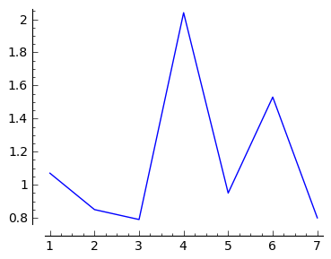

.. -*- coding: utf-8 -*-

Kinematyka
---------- 

Pociąg przebył drogę ze stacji :math:`A` do :math:`B` w ciągu
:math:`10` minut, oblicz średnią prędkość jeśli odległość miedzy
stacjami wynosi :math:`10` km."

Dana jest droga przebyta w czasie, a chcemy policzyć prędkość i
przyśpieszenie. Zadanie to nie wykracza poza materiał ze szkoły
średniej. Przypuśćmy jednak, że mamy dane wiecej niż szkolne dwa
punkty pomiaru :math:`A` i :math:`B`:

.. code-block:: python

    sage: t=[0, 1, 2, 3, 4, 5, 6, 7]
    sage: x = [0.96, 2.03, 2.88, 3.67, 5.71, 6.66, 8.19, 8.99]

.. end of output

Oblicznamy z drogi przędkośc korzystając ze wzoru na prędkość średnią:  

.. MATH::
    :label: dxdt

    v=\frac{\Delta x}{\Delta t}

.. code-block:: python

    sage: v=[]
    sage: for i in range(0,len(x)-1):
    ...       v.append ((x[i+1]-x[i])/(t[i+1]-t[i]))

.. end of output

.. code-block:: python

    sage: line(zip(t[1:],v),figsize=4)

.. end of output

Podobnie możemy obliczyć z przyśpieszenia, prędkość lub odwrotnie stosując:

.. MATH::
    :label: dvdt

    a=\frac{\Delta v}{\Delta t}

Co nam daje algorytmiczne zautomatyzowanie powyższych rachunków?

Zyskiem jest możliwość przetworzenia dowolnej ilości danych. Jednym z
fascynujących przykładów jest próba wykorzystania nowoczesnego
telefonu jako źródła danych. Tak zwane smartfony maja wiele czujników
\- między innymi akcelerometr. 

.. admonition:: Eksperyment

  Wyobraźmy sobie, że chcemy się dowiedzieć na jaką wysokość wjedzie
  winda w której przebywamy. Możemy dokonywać pomiaru przyśpieszenia,
  od momentu wejścia do windy, tzn. kiedy ona się jeszcze nie porusza,
  do momentu jej zatrzymania. Winda, z reguły dość szybko przyśpiesza
  do prędkości marszowej, porusza się ruchem jednostajnie
  prostoliniowym i hamuje. Jeżeli będziemy mierzyli chwilowe
  przyśpieszenie, najlepiej kilkaset razy na sekundę, do ze wzorów
  :eq:`dxdt` i :eq:`dvdt` będziemy mogli otrzymać informację o
  prędkości i drodze.
 
  Pomiar dokonuje w następujący sposób. Bierzemy telefon komórkowy i
  po wejsciu do windy włączamy tzw. logger czujników (sensor
  logger). Z włączonym zapisem pomiarów kładziemy telefon na
  podłodze. Powinniśmy zdążyć zrobić do zanim winda ruszy. Następnie
  czekamy aż winda zatrzyma się, podnosimy telefon i zatrzymujemy
  zapis danych. Plik z danymi posłuży nam do dalszej analizy.

Weźmy realne dane z pomiaru akcelerometrem z telefonu komórkowego,
który leżał na podłodze windy. Doświadczenie to może wykonać każdy
samodzielnie - do czego gorąco zachęcamy. W takim przypadku, należy
jednak pamiętać, że sposób zapisu danych może zależeć od programu
(tzn. loggera) i być może trzeba będzie zmodyfikować sposób ich
parsowania.

**Pytanie brzmi: na jaką wysokośc wjechała winda?**

Wczytajmy dane z eksperymentu (zostały one umieszczone na dropboxie):

.. sagecellserver:: 

    import urllib2
    import numpy as np 
    file = "https://dl.dropboxusercontent.com/u/11718006/sensorlog_2011082200122729_acc.csv"
    data = urllib2.urlopen(file) 
    waveII = np.loadtxt(data, delimiter=";")

.. end of output

Analizę danych można przeprowadzić korzystając z samodzielnie
napisanego, kilkulinijkowego skryptu, który wykorzystując technikę
interact umożliwi w wygodny sposób wybranie właściwego podzbioru
danych.

Po pierwsze objerzyjmy dane, by wybrać moment w którym telefon leży na
podłodze windy.

.. sagecellserver::

    sage: N=waveII.shape[0]
    sage: @interact
    sage: def _(i1=slider(0,N,default=int(N/6)),i2=slider(0,N,default=int(N-N/6))  ):
    ...       l=list_plot( zip( waveII[i1:i2,0]-waveII[0,0],waveII[i1:i2,3] ) ,plotjoined=True,figsize=(7,4),gridlines=True)
    ...       show(l)

.. end of output

Mając wybrane zakresy dokonujemy  przeliczeń, korzystając z:

.. math::

   v_{i+1} = v_{i}+a_i*\Delta t 
   x_{i+1} = x_{i}+v_i*\Delta t 

W ten sposób zaczynając od :math:`x_0=0` i :math:`v_0=0`, możemy
otrzymać zależność dorgi od czasu:

.. sagecellserver::

    t=waveII[1057:2020,0]
    a=waveII[1057:2020,3]
    bg_a=waveII[1214:1839,3].mean()
    a=(a-bg_a)*9.81
    t=t/1000.0
    xc=[]
    vc=[]
    xc.append(0)
    vc.append(0)
    N=a.shape[0]
    for i in range(0,N-1):
        vc.append( vc[i]+a[i]*(t[i+1]-t[i]) )
    for i in range(0,len(vc)-1):
        xc.append( xc[i]+vc[i]*(t[i+1]-t[i]) )

.. end of output

i oglądamy wyniki.
.. sagecellserver::

    p1 = list_plot(zip(t-t[0],a),plotjoined=True,gridlines=True,fontsize=14,axes_labels=['$t$','$a_z$'],figsize=[5,2] )
    p2 = list_plot(zip(t-t[0],vc),plotjoined=True,gridlines=True,fontsize=14,axes_labels=['$t$','$v_z$'],figsize=[5,2]) 
    p3 = list_plot(zip(t-t[0],xc),plotjoined=True,gridlines=True,fontsize=14,axes_labels=['$t$','$z$'],figsize=[5,2]) 

    show(p1)
    show(p2)
    show(p3)

..
   .. image:: Warsztaty_akcelerometr_media/cell_18_sage0.png
       :align: center

   .. image:: Warsztaty_akcelerometr_media/cell_18_sage1.png
       :align: center

   .. image:: Warsztaty_akcelerometr_media/cell_18_sage2.png
       :align: center

   .. end of output

Po wykonaniu powyższego kodu można się przekoań, że  winda zjechała w dół na ok. :math:`10` m.

