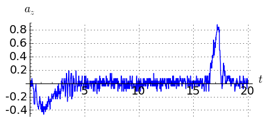
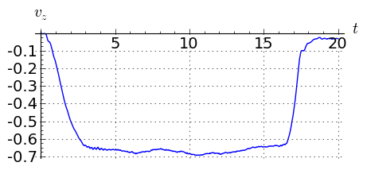
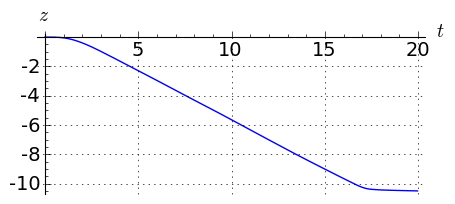

.. -*- coding: utf-8 -*-

Kinematyka
---------- 

Pociąg przebył drogę ze stacji :math:`A` do :math:`B` w ciagu
:math:`10` minut, oblicz średnią prędkość jeśli odległość miedzy
stacjami wynosi :math:`10`km."

Dana jest  droga przebyta w czasie, a chcemy policzyć prędkość i przyśpieszenie. Zadanie to nie wykracza poza materiał ze szkoły średniej. Przypuśćmy jednak, że mamy dane wiecej niż szkolne dwa punkty pomiaru :math:`A` i :math:`B`:

.. code-block:: python

    sage: t=[0, 1, 2, 3, 4, 5, 6, 7]
    sage: x = [0.96, 2.03, 2.88, 3.67, 5.71, 6.66, 8.19, 8.99]

.. end of output

Oblicznamy z drogi przędkośc korzystając ze wzoru na prędkość średnią:  

.. MATH::

    v=\frac{\Delta x}{\Delta t}

.. code-block:: python

    sage: v=[]
    sage: for i in range(0,len(x)-1):
    ...       v.append ((x[i+1]-x[i])/(t[i+1]-t[i]))

.. end of output

.. code-block:: python

    sage: line(zip(t[1:],v),figsize=4)

.. image:: Warsztaty_akcelerometr_media/cell_22_sage0.png
    :align: center

.. end of output

Co nam daje algorytmiczne zautomatywowanie powyższych rachunków?

Zyskiem jest możliwość przetworzenia dowolnej ilości danych. Jednym z fascynujących przykładów jest próba wykorzystania nowoczesnego telefonu jaqko źródła danych. Tak zwane smartfony maja wiele czujników \- między innymi akcelerometr. Weźmy realne dane z pomiaru akcelerometrem z telefonu komórkowego, który leżał na podłodze windy. Doświadczenie to może wykonać każdy student.

Pytanie brzmi: na jaką wysokośc wjechała winda?

.. code-block:: python

    sage: import csv 
    sage: import numpy as np 
    sage: data = csv.reader(open(DATA+'sensorlog_2011082200122729_acc.csv'), delimiter=';')
    sage: waveII=np.array([ [int(row[0])]+map(float,row[1:]) for row in data])

.. end of output

Analizę danych można przeprowadzić korzystając z samodzielnie napisanego, kilkulinijkowego skryptu, który wykorzystując technikę interact umożliwi w wygodny sposób wybranie właściwego podzbioru danych.

.. code-block:: python

    sage: N=waveII.shape[0]
    sage: @interact
    sage: def _(i1=slider(0,N,default=int(N/6)),i2=slider(0,N,default=int(N-N/6))  ):
    ...       l=list_plot( zip( waveII[i1:i2,0]-waveII[0,0],waveII[i1:i2,3] ) ,plotjoined=True,figsize=(7,4),gridlines=True)
    ...       show(l)

.. end of output

Mając wybrane zakresy dokonujemy  przeliczeń:

.. code-block:: python

    sage: t=waveII[1057:2020,0]
    sage: a=waveII[1057:2020,3]
    sage: bg_a=waveII[1214:1839,3].mean()
    sage: a=(a-bg_a)*9.81
    sage: t=t/1000.0
    sage: xc=[]
    sage: vc=[]
    sage: xc.append(0)
    sage: vc.append(0)
    sage: N=a.shape[0]
    sage: for i in range(0,N-1):
    ...       vc.append( vc[i]+a[i]*(t[i+1]-t[i]) )
    sage: for i in range(0,len(vc)-1):
    ...       xc.append( xc[i]+vc[i]*(t[i+1]-t[i]) )

.. end of output

.. code-block:: python

    sage: p1 = list_plot(zip(t-t[0],a),plotjoined=True,gridlines=True,fontsize=14,axes_labels=['$t$','$a_z$'],figsize=[5,2] )
    sage: p2 = list_plot(zip(t-t[0],vc),plotjoined=True,gridlines=True,fontsize=14,axes_labels=['$t$','$v_z$'],figsize=[5,2]) 
    sage: p3 = list_plot(zip(t-t[0],xc),plotjoined=True,gridlines=True,fontsize=14,axes_labels=['$t$','$z$'],figsize=[5,2]) 
    sage: print "Przyśpieszenie"
    sage: show(p1)
    sage: print "Prędkość"
    sage: show(p2)
    sage: print "Droga"
    sage: show(p3)
    Przyśpieszenie
    Prędkość
    Droga

.. end of output

Z ostatniego rysunku widać odpowiedź: winda zjechała w dół na ok. :math:`10`m.

