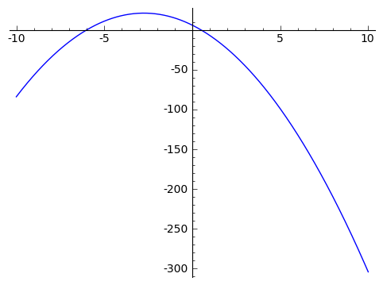
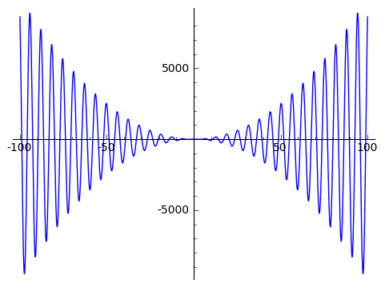

.. -*- coding: utf-8 -*-

Wprowadzenie do SAGE'a -- problem wspólnego dnia urodzin
--------------------------------------------------------

Wprowadzenie do  obliczeń w systemie **SAGE**
+++++++++++++++++++++++++++++++++++++++++++++
   
.. image:: http://www.math.washington.edu/newsletter/2006/Stein.jpg
   :alt: William Stein
   :align: right
   :height: 160
   
.. image:: Warsztaty_iCSE_1_Wprowadzenie_CubeProject_media/sage_logo_new.png
   :alt: William Stein
   :align: right
   :height: 52

**SAGE** jest dosyć młodym przedsięwzięciem -- został udostępniony w 2005 roku. Głównym twórcą tego pakietu jest dr William Stein (na zdjęciu obok) z University of Washington w Seattle. 

**SAGE** to pakiet darmowy i w pełni otwarty nie tylko pod względem kodu, ale i metodologii rozwoju. **SAGE** nie wyważa otwartych drzwi -- korzysta pełnymi garściami 
z tego, co ktoś już kiedyś dobrze wymyślił i co się sprawdziło. Pakiet nie bazuje na własnym języku, lecz wykorzystuje język programowania **Python**. Jest to język 
stosunkowo prosty i umożliwiający wykonywanie **działań symbolicznych**. Możliwe jest jednak używanie wielu innych języków, które można łączyć.

My będziemy pracować w **notatniku SAGE'a**, czyli w wygodnym środowisku o określonych elementach graficznych ułatwiających programowanie.

Komunikacja z pakietem obejmuje 3 typy komórek:

#) **Komórki wejścia** (gdzie wpisujemy nasze komendy, które SAGE będzie wykonywał); żeby otworzyć taką nową komórkę wystarczy przesunąć kursor myszki w odpowiednie miejsce i kliknąć kiedy na ekranie pojawi się długi, poziomy niebieski pasek;

#) **Komórki wyjścia** (gdzie SAGE umieszcza rezultaty wykonania naszych poleceń); żeby nakazać SAGE'owi wykonanie naszych komend/poleceń, należy kliknąć w przycisk ``Wykonaj``, znajdujący się pod komórką wejścia, lub użyć skrótu klawiszowego ``SHIFT`` + ``ENTER`` (przy czym kursor musi znajdować się wewnątrz komórki do wykonania);

#) **Komórki tekstowe** zawierające komentarze (takie jak ten), notatki, uwagi itp.; żeby otworzyć komórkę tekstową należy w wybranym miejscu ruchem kursora myszki wymusić pojawienie się wspomnianego niebieskiego paska, lecz w porównaniu do tworzenia nowej komórki wejścia należy przed kliknięciem w pasek nacisnąć i przytrzymać ``SHIFT``; 

Dodatkowe komentarze w kodzie (w komórkach wejścia) możemy umieszczać za znakiem ``#``.

Zapoznanie z podstawowymi elementami składni programowania oraz sposoby realizowania podstawowych operacji algebraicznych 
=========================================================================================================================

Zapoznanie z działaniem funkcji: ``print``, ``range``, ``len``, ``append``, ``max``, ``min``
~~~~~~~~~~~~~~~~~~~~~~~~~~~~~~~~~~~~~~~~~~~~~~~~~~~~~~~~~~~~~~~~~~~~~~~~~~~~~~~~~~~~~~~~~~~~

Rozpocznijmy przygodę z SAGEm!

Otwieramy w notatniku SAGE'a nowy arkusz i nadajemy mu jakąś własną nazwę. 

SAGE jako kalkulator (na początek)
++++++++++++++++++++++++++++++++++++

W okienku wejścia wpisujemy działanie do wykonania, np.:
 
.. code-block:: python

	sage:	23 + 12 

.. end of output

Jako wynik otrzymujemy oczywiście:

.. code-block:: python

	25 

.. end of output

Spróbujmy jednak czegoś nieco bardziej wymagającego niż dodawanie:

.. code-block:: python

	sage:	38/12
	19/6 

.. end of output

Od razu zwracamy uwagę, że SAGE nie zachowuje się jak zwyczajny kalkulator, gdyż podał dokładną wartość będącą wynikiem dzielenia.

.. note:: UWAGA! SAGE ma wysokie standardy i nie zaokrągla, jeśli tylko nie jest mu to polecone, np.:

.. code-block:: python

	sage:	1/9+5/12
	19/36 

.. end of output

Widać, że SAGE wykonuje obliczenia dokładnie -- sprowadzając do wspólnego mianownika i wypisując wynik w możliwie najprostszej postaci (po skróceniu).

Żeby SAGE pokazał nam przybliżoną wartość w zapisie dziesiętnym, trzeba o to poprosić [używamy odpowiedniej funkcji -- tu funkcji ``n(...)``, która jest odpowiedzialna za obliczenia numeryczne]:

.. code-block:: python

	sage:	n(1/9+5/12)	
	0.527777777777778

.. end of output
 
Możemy SAGE'a zapytać ile dokładnie jest równe :math:`\pi`, a przy okazji zapytajmy również, jaka jest wartość :math:`\pi` z dokładnością do 30 cyfr znaczących. 
Należy zwrócić uwagę, że SAGE wypisuje wynik tylko ostatniej operacji, jeśli kod poleceń zawiera więcej niż jedną linijkę (SAGE wykona wszystkie polecenia, 
ale domyślnie wypisze wynik tylko ostatniej). Żeby wymusić wypisanie wyników pośrednich należy użyć funkcji ``print``:  
    
.. sagecellserver:: 
	
	print(pi)
	print(n(pi, digits=30))

W odpowiedzi SAGE nas poinformował, że dokładna wartość :math:`\pi` jest równa :math:`\pi` :) [trudno go za to winić -- w końcu ma rację]

Możemy, korzystając z znanych SAGE'owi stałych policzyć dokładne wartości funkcji trygonometrycznych:

.. code-block:: python

	sage:	print(cos(pi))
	sage:	print(sin(pi/3))
	-1
	1/2*sqrt(3)

.. end of output
 	
W odpowiedzi na prośbę o obliczenie :math:`\sin\frac{\pi}{3}` SAGE podał wynik dokładny równy :math:`\frac{\sqrt{3}}{2}`. Dowiedzieliśmy się przy okazji, że pierwiastek kwadratowy
realizuje funkcja o nazwie ``sqrt``. Spróbujmy policzyć wartość jakiegoś pierwiastka kwadratowego:

.. code-block:: python

	sage:	print(sqrt(32))
	sage:	print(n(sqrt(32), digits=6))
	4*sqrt(2)
	5.65685

.. end of output

Kolejny raz przekonaliśmy się, że SAGE podaje dokładne wyniki (upraszaczając o ile tylko to możliwe: :math:`\sqrt{32}=4 \, \sqrt{2}`).

.. note:: Chcąc uzyskać szczegółowe informacje nt. działania różnych funkcji w SAGE'u (aby skorzystać z pomocy) wystarczy wpisać nazwę funkcji i znak zapytania

.. code-block:: python

	sage:	sqrt?
	
	File: /usr/lib/sagemath/local/lib/python2.7/site-packages/sage/functions/other.py
	
	Type: <type ‘function’>
	
	Definition: sqrt(x, *args, **kwds)
	
	Docstring:
	
	INPUT:
	
	x - a number
	prec - integer (default: None): if None, returns an exact square root; otherwise returns a numerical square root if necessary, to the given bits of precision.
	extend - bool (default: True); this is a place holder, and is always ignored or passed to the sqrt function for x, since in the symbolic ring everything has a square root.
	all - bool (default: False); if True, return all square roots of self, instead of just one.
	EXAMPLES:
	
	sage: sqrt(-1)
	I
	sage: sqrt(2)
	sqrt(2)
	sage: sqrt(2)^2
	2
	sage: sqrt(4)
	2
	sage: sqrt(4,all=True)
	[2, -2]
	sage: sqrt(x^2)
	sqrt(x^2)
	sage: sqrt(2).n()
	1.41421356237310
	To prevent automatic evaluation, one can use the hold parameter after coercing to the symbolic ring:
	
	sage: sqrt(SR(4),hold=True)
	sqrt(4)
	sage: sqrt(4,hold=True)
	Traceback (click to the left of this block for traceback)
	...
	                                         
.. end of output	

Przy okazji dowiedzieliśmy się z przykładów z dokumentacji, że SAGE potrafi również liczyć pierwiastki z liczb ujemnych, co jest kolejnym elementem wychodzącym poza standardy 
zwykłych kalkulatorów. Żeby zrozumieć wynik  pierwiastkowania liczb ujemnych trzeba znać pojęcie **liczb zespolonych**, jednak nie czas i miejsce, żeby wyjaśniać, 
czym one są. Liczby zespolone są na ogół omawiane w pierwszym semestrze studiów, ale nie jest zabronione poszukanie informacji i zapoznanie się z liczbami zespolonymi wcześniej, 
jeśli tylko ktoś ma ochotę...

Przedstawmy jeszcze tylko dwa inne użyteczne działania na liczbach -- potęgowanie oraz dzielenie z resztą:

.. code-block:: python

	sage:	print(2^3)
	sage:	print(13%5)
	8
	3

.. end of output

Oprócz działań na liczbach możemy wykonywać operacje porównania (operacje logiczne):

.. code-block:: python

	sage:	print(2 == 5)
	sage:	print(2 < 5)
	sage:	print(5 != 10/3)
	sage:	print(6/7 <= 14/17)
	False
	True
	True
	False

.. end of output

SAGE jako narzędzie do operacji na funkcjach, w tym do rysowania wykresów funkcji 
+++++++++++++++++++++++++++++++++++++++++++++++++++++++++++++++++++++++++++++++++

Wykorzystamy tu bardzo ważną cechę SAGE'a, który świetnie radzi sobie z zapisem symbolicznym, przez co możemy się nim posługiwać bardzo podobnie, jak to robimy rozwiązując 
problemy matematyczne na kartce papieru. Na przykład zdefiniowanie funkcji odbywa się niemal tak samo jak na tablicy w szkole:

.. code-block:: python

	sage:	f(x) = -2*x^2-11*x+6
	sage:	plot(f(x), (x,-10,10))
	

.. end of output

Z wykresu widać mniej więcej jakie są miejsca zerowe tego wielomianu, ale na pytanie jak rozwiązać analityczne równanie kwadratowe z wykorzystaniem SAGE'a odpowiemy 
w dalszej części. 

Możemy rysować wykresy nie tylko dla funkcji elementarnych, ale również dla bardziej skomplikowanych funkcji, np.:

.. code-block:: python

	sage:	f(x) = x^2 * cos(x)
	sage:	plot(f(x), (x,-10,10))
	

.. end of output

Alternatywny sposób wywołania wykresu funkcji:

.. code-block:: python

	sage:	f(x).plot(-5, 5)

.. end of output

.. note:: Możemy w łatwy sposób zamieścić wykresy kilku funkcji na jednym rysunku. W SAGE'u realizuje się to w bardzo intuicyjny sposób -- poprzez dodawanie wykresów do siebie (dodawanie ,,plot'ów"). 

Jednocześnie możemy się zastanownić co jeszcze możemy zrobić ze zdefiniowaną funkcją? Można podejrzeć możliwości pisząc ``f.`` i naciskając 
klawisz ``TAB``. Na przykład możemy policzyć pochodną funkcji ``f`` (Ups! ale ze szkoły średniej został wycofany rachunek różniczkowy, więc chyba jeszcze nie wiecie, 
co to jest pochodna... No nic, ale wiedzcie, że SAGE potafi je liczyć).
To może się przydać w przyszłości.

.. sagecellserver:: 

	f(x) = x^2 * cos(x)
	g(x) = -1/2*x - 1
	h(x) = log(x)
	show(plot(f(x), -5, 5) + plot(g(x), -5, 5, color='red') + plot(h(x), 0, 5, color='green'))
	f.diff()
	print(f.diff())
	show(f.diff())		

Przy okazji zaprezentowano różnice między sposobami wypisywania (formatowaniem) wyniku przez ``print`` oraz ``show``.

Mała próbka tworzenia wykresów 3D:

.. code-block:: python

	sage:	var('x,y')
	sage:	plot3d(2^(-(x^2+y^2))*cos(x^2+y^2), (x,-pi,pi), (y,-pi,pi))
	
.. image:: Warsztaty_iCSE_1_Wprowadzenie_CubeProject_media/sage0-size500_jmol.png
    :align: center

.. end of output

SAGE jako ,,maszynka" do rozwiązywania zadań (sprawdzania wyników) 
++++++++++++++++++++++++++++++++++++++++++++++++++++++++++++++++++

Można łatwo rozwiązać równanie lub układ równań:

.. code-block:: python

	sage:	rownanie = -2*x^2-11*x+6==0
	sage:	show(rownanie)
	sage:	rozwiazanie = solve(rownanie, x)
	sage:	print("Rozwiązania powyższego równiania:")
	sage:	show(rozwiazanie)
	
.. MATH::
	-2 \, x^{2} - 11 \, x + 6 = 0
	
	\text{Rozwiązania powyższego równiania:}

	\left[x = \left(-6\right), x = \left(\frac{1}{2}\right)\right]
	
.. end of output

Gdyby ktoś zapomniał jak wygladają wzory na rozwiązania równania kwadratowego, to możemy poprosić SAGE'a o symboliczne rozwiązanie równiania kwadratowego w ogólnej postaci:

.. code-block:: python

	sage:	var('x,a,b,c')
	sage:	rownanie = a*x^2+b*x+c==0
	sage:	show(rownanie)
	sage:	rozwiazanie = solve(rownanie, x)
	sage:	print("Rozwiązania powyższego równiania:")
	sage:	show(rozwiazanie)
	
.. MATH::
	a \, x^{2} + b \, x + c = 0
	
	\text{Rozwiązania powyższego równiania:}

	\left[x = -\frac{b + \sqrt{-4 \, a c + b^{2}}}{2 \, a}, x = -\frac{b - \sqrt{-4 \, a c + b^{2}}}{2 \, a}\right]
	
.. end of output

Podkreślić należy, że powyższe wzory, to nie są informacje wyświetlone z jakiejś bazy danych, tylko SAGE rozwiązał, wykorzystując zapis symboliczny, podane równanie z parametrami.

Oczywiście każdy potrafi w miarę szybko znaleźć pierwiastki trójmianów kwadratowych. Sprawa nie jest już taka prosta kiedy mamy znaleźć pierwiastki wielomianu 
stopnia trzeciego. Dla SAGE'a nie stanowi to problemu, podobnie jak narysowanie wykresu takiego wielomianu, czy rozwiązanie równania przy dodatkowym założeniu, 
np. że interesują nas tylko dodatnie wartości :math:`x>0` [funkcja ``lhs`` w poniższym kodzie zwraca wyrażenie występujące po lewej stronie równiania (lhs = left hand side)]:

.. sagecellserver::
	
	rownanie = x^3-6*x^2-19*x+84 == 0
	show(rownanie)
	rozwiazanie = solve(rownanie, x)
	print("Rozwiązania powyższego równiania:")
	show(rozwiazanie)
	f(x) = rownanie.lhs()
	show(plot(f(x), (x,-10,10)))

	assume(x>0)    # wprowadzamy dodatkowe założenie
	print("Wyznaczamy tylko pierwiastki dodatnie:")
	rozwiazanie = solve(rownanie, x)
	show(rozwiazanie)
	forget()   # anulowanie dodatkowego założenia, które jest aktywne dopóki nie użyjemy 'forget()'

W SAGE'u możemy również szybko rozwiązać układy równań (w tym również układy równań nieliniowych):

.. code-block:: python

	sage:	var('x,y')
	sage:	rozwiazanie_ukladu = solve([3*x+y==3, x^2-2*x-3+y==0], x, y)
	sage:	show(rozwiazanie_ukladu)

.. MATH::
		
	\left[\left[x = 5, y = \left(-12\right)\right], \left[x = 0, y = 3\right]\right]

.. end of output

SAGE jako środowisko do programowania
+++++++++++++++++++++++++++++++++++++

**Listy** to jeden z podstawowych elementów w programowaniu, szczególnie często wykorzystywany przy symulacjach, gdzie iteracyjnie (krok po kroku) wykonujemy pewne 
obliczenia prowadzące do wyniku końcowego. Niezbędna jest umiejętność tworzenia list, odczytywania ich elementów, odwoływania się do odpowiednich elementów oraz 
modyfikowania tych list. Lista to pewien uporządkowany zbiór obiektów. Obiektami mogą być liczby (wtedy lista jest wektorem), ale jest to tylko szczególny przypadek listy.

.. note:: Pojedynczy znak ``=`` to operator przypisania (podstawienia), w odróżnieniu od podwójnego znaku ``==``, który służy do porównania (tak jak w zadaniu znajdowania pierwiastków wielomianu używaliśmy ``==`` przyrównując wielomian do zera).

Możemy utworzyć nową listę złożoną z liczb korzystając z zapisu ``[1..9]``, co tworzy listę kolejnych liczb całkowitych zaczynając od 1 a kończąc na 9. 
 
.. code-block:: python

    sage: print("Lista 'a':")
    sage: a = [1..9]
    sage: print("oto jak wygląda 'a':")
    sage: print(a)
    
    Lista 'a':
    oto jak wygląda 'a':
    [1, 2, 3, 4, 5, 6, 7, 8, 9]

.. end of output

.. note:: UWAGA!!! Elementy listy są w SAGE'u numerowane od wartości 0!

.. code-block:: python

    sage: print("Pierwszy element listy 'a':")
    sage: print(a[0])
    sage: print("Szósty element listy 'a':")
    sage: print(a[5])
    sage: print("Ostatni element listy 'a':")
    sage: print(a[-1])
    sage: print("Przedostatni element listy 'a':")
    sage: print(a[-2])
    sage: print("Liczba elementów listy 'a':")
    sage: print(len(a))
    
    Pierwszy element listy 'a':
    1
    Szósty element listy 'a':
    6
    Ostatni element listy 'a':
    9
    Przedostatni element listy 'a':
    8
    Liczba elementów listy 'a':
    9

.. end of output

W powyższym przykładzie widać jedną z korzyści numerowania list od 0 -- można łatwo odwołać się do ostatniego elementu listy przez ``a[-1]``.

Operacje na listach. Modyfikowanie listy przez dodawanie (doklejanie) nowych elementów
======================================================================================

Wykorzystamy tu również inny, często używany sposób definiowania listy --  funkcję ``range()``, np. ``range(10)`` tworzy listę kolejnych liczb całkowitych 
zaczynając od 0 i lista będzie zawierała 10 elementów, czyli ostatnim elementem będzie 9. 

.. sagecellserver::

	a = [1..9]
	a.append(10)
	print("Liczba elementów listy 'a' po modyfikacji:")
	print(len(a))
	print("Oto jak wygląda 'a' po modyfikacji:")
	print(a)
	print("Lista 'b':")
	b = range(10)
	print("Liczba elementów listy 'b':")
	print(len(b))
	print("Oto jak wygląda 'b':")
	print(b)
	b = b+[20]
	print("Oto jak wygląda 'b' po modyfikacji:")
	print(b)
	print("Inny sposób modyfikacji (doklejania do listy):")
	b += [50]
	print("Oto jak wygląda 'b' po modyfikacji:")
	print(b)
	b += [3,50,-2]
	print("Lista 'b' po kolejnej modyfikacji:")
	print(b)
	print("Dodajemy, tj. doklejamy listy do siebie 'a+b':")
	print(a+b)

.. end of output

Znajdowanie największego elementu listy
=======================================

.. code-block:: python

    sage: print("Maksymalny element listy 'b':")
    sage: print(max(b))

    Maksymalny element listy 'b':
    50

.. end of output

Problem wspólnego dnia urodzin
++++++++++++++++++++++++++++++
Załóżmy, że ktoś nam zaproponował grę, w której możemy wygrać 100 zł, jeśli dobrze obstawimy, albo nic nie wygrać, jeśli źle obstawimy (nie możemy niczego przegrać). 
Zadanie polega na tym, że wchodzimy do pomieszczenia gdzie znajduje się losowo wybrana grupa *N*  osób (liczba *N*  jest nam podana). Naszym zadaniem jest obstawić, 
czy w tej grupie znajdziemy przynajmniej 2 osoby, które obchodzą swoje urodziny tego samego dnia. 

Oczywiście jeśli np. w grupie są zaledwie 4 osoby, 
to pewnie każdy obstawi, że nie ma w tej grupie osób obchodzących urodziny tego samego dnia (wprawdzie może się zdarzyć, że akurat wśród tych 4 osób takie dwie osoby będą, ale jest to mało 
prawdopodobna sytuacja, więc bardziej opłaca się obstawić, że ,,NIE"). Z drugiej strony jeśli grupa liczy 366 osób, to zapewne każdy obstawi, że ,,TAK" 
-- w tej grupie przynajmniej 2 osoby obchodzą swoje urodziny tego samego dnia (bo wydaje się to bardzo pradopodobne -- niemal pewne). Pytanie gdzie jest granica -- 
ile osób musi liczyć grupa żeby bardziej opłacało się obstawić ,,TAK", niż ,,NIE"? Innymi słowy od jakiej liczebności grupy zaczyna być bardziej prawdopodobne, że znajdziemy 
przynajmniej 2 osoby, które obchodzą swoje urodziny tego samego dnia? [prawdopodobieństwo jest zawsze liczbą z przedziału od 0 do 1; prawdopodobieństwo 0,5 oznacza, że szanse 
wygranej i przegranej rozkładają się po równo, czyli po 50%; postawione pytanie można więc sformułować również tak: od jakiej liczebności grupy prawdopodobieństwo, że znajdziemy w niej 
przynajmniej 2 osoby, które obchodzą swoje urodziny tego samego dnia, przekracza wartość 0,5?]

Żeby odpowiedzieć na postawione pytanie najpierw rozwiążemy zadanie obliczenia prawdopodobieństwa, że w danej grupie *N*  osób są przynajmniej dwie takie, 
które obchodzą swoje urodziny tego samego dnia.

**Rozwiązanie:**

Do danego problemu można podejsć przez obliczenie **prawdopodobieństwa zdarzenia przeciwnego**, tj. zdarzenia, że w grupie **nie ma osób, które obchodzą urodziny tego 
samego dnia**, zaś szukane w zadaniu prawdopodobieństwo będzie dopełnieniem do jedynki otrzymanego wyniku.

Jaka jest więc szansa, że w grupie *N*  osób nie ma takich, które obchodzą urodziny tego samego dnia? Na początek rozważmy ten problem dla małych grup, zaczynając od jednoosobowej. 
Załóżmy, że rok ma 365 dni (nie rozważamy lat przestępnych). 

Jeśli *N* =1 (grupa jednoosobowa), to takie prawdopodobieństwo jest równe :math:`1=\frac{365}{365}` (zdarzenie pewne).

Jeśli *N* =2, to druga osoba, skoro ma mieć urodziny w innym dniu, niż pierwsza osoba, to ma 355 możliwości na 365 (czyli z wyłączeniem dnia urodzin pierwszej osoby). 
Oznacza to, że prawdopodobieństwo jest równe:

.. MATH::

    \frac{365}{365}\cdot\frac{364}{365}.

Jeśli *N* =3, to trzecia osoba, skoro ma urodziny w innym dniu niż pierwsza i druga osoba, to (ponieważ dwa dni są już ,,zajęte") ma 354 możliwości na 365 (czyli wszystkie dni 
z wyłączeniem dnia urodzin pierwszej oraz drugiej osoby). To jest jednak warunek tylko dla trzeciej osoby, który musi być połączony z warunkiem dla drugiej osoby. 
Oznacza to, że prawdopodobieństwo jest równe:

.. MATH::

    \frac{365}{365}\cdot\frac{364}{365}\cdot\frac{363}{365}.

    \vdots

Jeśli grupa liczy *N*  osób, to **prawdopodobieństwo, że w grupie nie ma osób, które obchodzą urodziny tego samego dnia** jest równe:

.. MATH::

    \frac{365}{365}\cdot\frac{364}{365}\cdot\frac{363}{365}\cdot\ldots\cdot\frac{365-(N-1)}{365}.

To były obliczenia dla zdarzenia przeciwnego niż to, które nas interesuje. Oznacza to, że **prawdopodobieństwo, że w danej grupie N osób 
są przynajmniej dwie takie, które obchodzą swoje urodziny tego samego dnia** jest równe:

.. MATH::

    1-\frac{365}{365}\cdot\frac{364}{365}\cdot\frac{363}{365}\cdot\ldots\cdot\frac{365-(N-1)}{365}.

Policzmy to prawdopodobieństwo dla *N*  =5 osób:

.. code-block:: python

    sage: print(1-365/365*364/365*363/365*362/365*361/365)
    sage: print(n(1-365/365*364/365*363/365*362/365*361/365, digits=3))

    481626601/17748900625
    0.0271
    
.. end of output

Widzimy, że zgodnie z intuicją, dla pięcioosobowej grupy prawdopodobieństwo, że w takiej grupie osób 
są przynajmniej dwie osoby, które obchodzą swoje urodziny tego samego dnia jest bardzo małe -- około 2,7%.

Gdybyśmy chcieli policzyć to prawdopodobieństwo dla większej grupy np. *N* =40, to mamy do ,,wklepania" w SAGE'a bardzo długie wyrażenie algebraiczne 
(wiele ułamków). Lepiej wykorzystać pętlę.

.. note:: UWAGA! Bardzo ważny sposób zapisu pętli. W SAGE'u bardzo istotne są wcięcia!!! (Wcięcia decydują gdzie pętla się kończy -- to wymusza dyscyplinę zapisu kodu)

.. code-block:: python

    sage: p_przeciwne=1
    sage: for i in range(40):
    ...       p_przeciwne *= (365-i)/365
    ...       
    sage: print("Prawdopodobieństwo, że w danej grupie N=40 osób są przynajmniej dwie takie, 
    ...          które obchodzą swoje urodziny tego samego dnia jest równe:") 
    sage: print(n(1-p_przeciwne, digits=3))

    Prawdopodobieństwo, że w danej grupie N=40 osób są przynajmniej dwie takie, 
    które obchodzą swoje urodziny tego samego dnia jest równe:
    0.891

.. end of output

Tu pierwsze zaskoczenie -- dla grupy czterdziestoosobowej prawdopodobieństwo, że znajdziemy przynajmniej dwie osoby, które obchodzą swoje urodziny tego samego dnia jest 
bardzo duże -- równe ponad 89%, czyli w grupie 40 osobowej zdecydowanie bardziej opłaca się obstawiać na ,,TAK".
 
Zapiszmy powyższe obliczenia w postaci naszej własnej **funkcji** 

.. note:: UWAGA! Przy definiowaniu własnych funkcji również bardzo ważne są wcięcia!

.. sagecellserver::

	def p_wspolnych_urodzin(N):
	    p_przeciwne=1
	    for i in range(N):
	        p_przeciwne *= (365-i)/365
	
	    return 1-p_przeciwne
	
	# Sposób użycia zdefiniowanej przez nas funkcji:
	print("Prawdopodobieństwo, że w danej grupie N=50 osób są przynajmniej dwie takie, które obchodzą swoje urodziny tego samego dnia jest równe:") 
	print(n(p_wspolnych_urodzin(50), digits=3))

Teraz możemy zgrabnie wykorzystać zdefiniowaną funkcję ``p_wspolnych_urodzin``, żeby zobaczyć jak zmienia się to prawdopodobieństwo, kiedy 
liczba osób w grupie rośnie:

.. code-block:: python

    sage: for k in range(101):
    sage: print(k, n(p_wspolnych_urodzin(k), digits=4))

	(0, 0.0000)
	(1, 0.0000)
	(2, 0.002740)
	(3, 0.008204)
	(4, 0.01636)
	(5, 0.02714)
	(6, 0.04046)
	(7, 0.05624)
	(8, 0.07434)
	(9, 0.09462)
	(10, 0.1169)
	(11, 0.1411)
	(12, 0.1670)
	(13, 0.1944)
	(14, 0.2231)
	(15, 0.2529)
	(16, 0.2836)
	(17, 0.3150)
	(18, 0.3469)
	(19, 0.3791)
	(20, 0.4114)
	(21, 0.4437)
	(22, 0.4757)
	(23, 0.5073)
	(24, 0.5383)
	(25, 0.5687)
	(26, 0.5982)
	(27, 0.6269)
	(28, 0.6545)
	(29, 0.6810)
	(30, 0.7063)
	(31, 0.7305)
	(32, 0.7533)
	(33, 0.7750)
	(34, 0.7953)
	(35, 0.8144)
	(36, 0.8322)
	(37, 0.8487)
	(38, 0.8641)
	(39, 0.8782)
	(40, 0.8912)
	(41, 0.9032)
	(42, 0.9140)
	(43, 0.9239)
	(44, 0.9329)
	(45, 0.9410)
	(46, 0.9482)
	(47, 0.9548)
	(48, 0.9606)
	(49, 0.9658)
	(50, 0.9704)
	(51, 0.9744)
	(52, 0.9780)
	(53, 0.9811)
	(54, 0.9839)
	(55, 0.9863)
	(56, 0.9883)
	(57, 0.9901)
	(58, 0.9917)
	(59, 0.9930)
	(60, 0.9941)
	(61, 0.9951)
	(62, 0.9959)
	(63, 0.9966)
	(64, 0.9972)
	(65, 0.9977)
	(66, 0.9981)
	(67, 0.9984)
	(68, 0.9987)
	(69, 0.9990)
	(70, 0.9992)
	(71, 0.9993)
	(72, 0.9995)
	(73, 0.9996)
	(74, 0.9996)
	(75, 0.9997)
	(76, 0.9998)
	(77, 0.9998)
	(78, 0.9999)
	(79, 0.9999)
	(80, 0.9999)
	(81, 0.9999)
	(82, 0.9999)
	(83, 1.000)
	(84, 1.000)
	(85, 1.000)
	(86, 1.000)
	(87, 1.000)
	(88, 1.000)
	(89, 1.000)
	(90, 1.000)
	(91, 1.000)
	(92, 1.000)
	(93, 1.000)
	(94, 1.000)
	(95, 1.000)
	(96, 1.000)
	(97, 1.000)
	(98, 1.000)
	(99, 1.000)
	(100, 1.000)

.. end of output

Otrzymane wyniki możemy również przedstawić na wykresie punktowym: 

.. code-block:: python

    sage: l_osob = 101
    sage: p_dla_N = range(l_osob)
    sage: for n in range(l_osob):
    ...       p_dla_N[n] = p_wspolnych_urodzin(n)
    sage: scatter_plot(zip(range(l_osob), p_dla_N), marker='.', facecolor='blue')

.. image:: Warsztaty_iCSE_1_Wprowadzenie_CubeProject_media/cell_21_sage0.png
    :align: center

.. end of output
    
Wypiszmy tylko te przypadki, kiedy grupa jest na tyle mała, że bardziej prawdopodobne jest, że nie spotkamy dwóch osób obchodzących urodziny tego samego dnia, 
niż że takie osoby w grupie są (wykorzystamy inny rodzaj pętli -- pętlę ``while``):    
    
.. sagecellserver::

    sage: i=1
    sage: while p_wspolnych_urodzin(i)<0.5:
    ...       print i, N(p_wspolnych_urodzin(i), digits=4)
    ...       i += 1
    sage: print i, N(p_wspolnych_urodzin(i), digits=4)

Widać, że już **począwszy od grupy liczącej 23 osoby bardziej prawdopodobne jest to, że natrafimy na przynajmniej dwie osoby, które obchodzą swoje urodziny tego samego dnia**, 
niż że takich osób nie znajdziemy. Nie oznacza to gwarancji wygranej, ale każdy racjonalnie myślący człowiek będzie obstawiał bardziej prawdopodobny wynik. Zaskakujące jest, 
że ta wartość graniczna to zaledwie **23 osoby** a przy grupie liczącej 83 osoby jest niemal pewne, że natrafimy na przynajmniej dwie osoby, które obchodzą swoje urodziny tego 
samego dnia.
