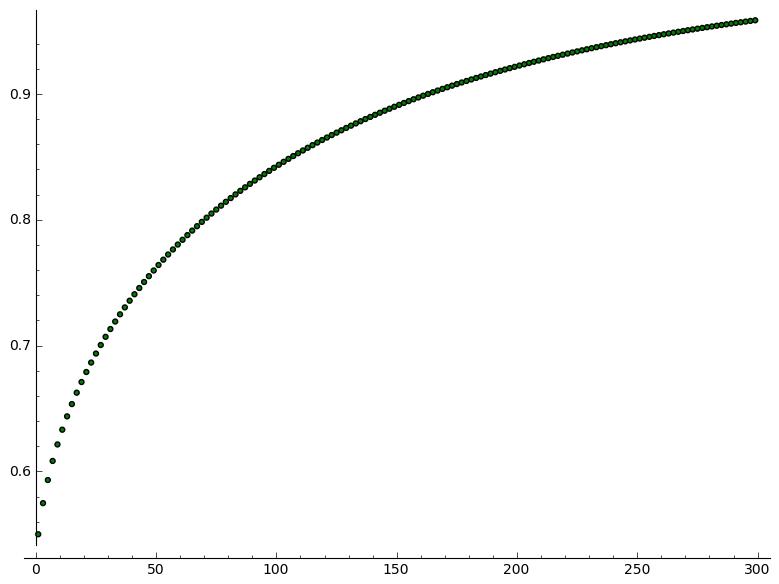

.. -*- coding: utf-8 -*-

Demokracja -- co dwie głowy, to nie jedna
-----------------------------------------

Korzyści ze zbiorowego podejmowania decyzji -- symulacja Monte Carlo
++++++++++++++++++++++++++++++++++++++++++++++++++++++++++++++++++++

Wstęp
=====

W tej części zostanie rozważony problem oszacowania prawdopodobieństwa podjęcia trafnej decyzji przez głosowanie większościowe (jak w demokracji), 
przy założonym poziomie kompetencji osób głosujących.

**Szczegółowy opis zagadnienia:**

Załóżmy, że dany jest problem (decyzyjny), w którym zbiór możliwych decyzji jest dwuelementowy (np. decyzje ,,tak" albo ,,nie", lub ,,jestem za" albo ,,jestem przeciwny") 
oraz że wiadomo, że jedna z tych opcji jest decyzją trafną (właściwą). Ponadto mamy :math:`M` sędziów, o których wiadomo, że każdy z nich podejmuje trafną decyzję 
z prawdopodobieństwem równym :math:`p_i`. To prawdopodobieństwo :math:`p_i` określa kompetencję osoby głosującej do podejmowania decyzji tego rodzaju.

**Podstawowy problem do rozważenia:** jeżeli głosujący podejmują decyzje niezależnie i większością głosów, to jakie jest prawdopodobieństwo podjęcia 
przez nich trafnej decyzji?

Przyjmijmy, że dwa możliwe warianty decyzji oznaczymy liczbami :math:`0` i :math:`1`. Można bez straty ogólności przyjąć, że zawsze przez :math:`1` 
oznaczać będziemy decyzję trafną (prawidłową), przy czym oczywiście głosujący nie wiedzą, która decyzja jest trafna. Spróbujmy napisać kod programu, 
który będzie symulował (wielokrotnie) głosowania poszczególnych posłów i będzie sprawdzał, jak często cała grupa w głosowaniu większościowym wybiera 
trafną decyzję, wiedząc, że każdy pojedynczy poseł podejmuje trafną decyzję z prawdopodobieństwem :math:`p_i`.

Na początek, dla uproszczenia, załóżmy dodatkowo, że głosujący są homogeniczni pod względem kompetencji (tj. że wszyscy z takim samym prawdopodobieństwem 
wybierają trafną decyzję). Dodatkowo dla uproszczenia rozważymy tylko przypadki, kiedy liczba posłów jest nieparzysta (żeby uniknąć problemów 
z podejmowaniem zbiorowej decyzji, kiedy głosy rozkładają się równo po połowie). 

Gdybyśmy kierowli się wynikiem rzutu monetą przy podejmowaniu każdej decyzji na ,,tak" 
czy ,,nie", to w przypadku symetrycznej monety średnio 50 razy na 100 poedjmowalibyśmy właściwą decyzję.
Zakładamy, że poseł jest przynajmniej odrobinę ,,mądrzejszy niż moneta" a dokładniej, że poziom kompetencji każdego głosującego jest równy :math:`p_i=0,55`. 

Symulacja pojedynczego głosowania grupy posłów
============================================== 

Przyjmując założenia przedstawione we Wstępie przechodzimy do kodu programu. Sprawdź ,,wzrokowo", wykonując poniższy kod co najmniej kilkunastokrotnie, 
jak często w wyniku głosowania podejmowana jest (grupowo) właściwa decyzja oznaczona :math:`1`. Sprawdź zmieniając wartość odpowiedniego parametru w kodzie 
i wykonując poniższy kod, jak zmienia się częstość wskazywania decyzji oznaczona :math:`1`, kiedy wzrasta znacząco liczba głosujących posłów.

Wyjaśnijmy jak w poniższym kodzie technicznie rozwiązano zagadnienie zliczania głosów i wskazywania na decyzję większości posłów. Otóż ponieważ głos 
pojedynczego posła został oznaczony przez :math:`1` (oznaczenie trafnej decyzji) lub :math:`0`, to jeśli liczba głosów na :math:`1` jest większa 
niż połowa z liczby posłów, to znaczy, że większością wybrano :math:`1` (czyli podjęto trafną decyzję). W przeciwnym wypadku większość wybiera decyzję :math:`0`. 
Fakt, że drugi wariant głosowania oznaczono przez :math:`0` daje tę możliwość, że aby policzyć ile było :math:`1` wystarczy zsumować wszystkie wartości dla 
wszystkich posłów (suma zer i jedynek da nam liczbę jedynek) a następnie trzeba tę liczbę porównać z połową liczby posłów.        

.. sagecellserver:: 

	liczba_poslow = 31    
	kompetencje = 0.55   
	# l_glosowan = 1       # Na razie zróbmy jednorazowe głosowanie `sejmu`
	
	P = [1-kompetencje, kompetencje]
	X = GeneralDiscreteDistribution(P)
	
	# Teraz każdy poseł głosuje zgodnie ze swoimi kompetencjami:
	glos = range(liczba_poslow)
	for i in range(liczba_poslow):
	    glos[i] = X.get_random_element()
	
	if sum(glos) > 0.5*liczba_poslow:
	    decyzja_wiekszosci = 1
	else:
	    decyzja_wiekszosci = 0
	    
	print("Decyzja większości:")
	print(decyzja_wiekszosci)

W powyższym kodzie wystąpiło wywołanie pewnej czarnej skrzynki  -- tzw. generatora liczb losowych. W powyższym przypadku najpierw zadeklarowano, 
że wykorzystamy ogólny generator dla rozkładów dyskretnych, czyli generator, którego możliwe wyniki tworzą skończony zbiór wariantów. U nas to jest zbiór dwuelementowy, 
gdyż oczekujemy, że generator będzie dla każdego posła zwracał wartość :math:`0` z prawdopodobieństwem równym :math:`1-\text{kompetencje}` oraz wartość :math:`1` 
z prawdopodobieństwem równym wartości :math:`\text{kompetencje}`.

Symulacja dla dużej liczby głosowań
===================================

Zapiszmy powyższy kod realizujący symulację pojedynczego głosowania w postaci ,,funkcji" i wykorzystajmy do napisania kodu symulującego wielokrotne głosowanie, 
by móc się przekonać jak często w wyniku takiej symulacji zostanie podjęta ,,dobra" decyzja: 

.. sagecellserver:: 

	liczba_poslow = 301 
	kompetencje = 0.55
	
	def symuluj_glosowanie(liczba_poslow):
	    # Teraz każdy poseł głosuje zgodnie ze swoimi kompetencjami:
	    glos = range(liczba_poslow)
	    for i in range(liczba_poslow):
	        glos[i] = X.get_random_element() 
	        
	    if sum(glos) > 0.5*liczba_poslow:
	        return 1
	    else:
	        return 0
	
	l_glosowan = 1000 # tu zakładamy, ile chcemy uwględnić głosowań w naszej symulacji
	
	P = [1-kompetencje, kompetencje]
	X = GeneralDiscreteDistribution(P)
	
	ilosc_trafnych = 0
	for i in range(l_glosowan):
	    ilosc_trafnych += symuluj_glosowanie(liczba_poslow)
	
	czestosc_trafnych = ilosc_trafnych/l_glosowan
	
	print("Częstość trafnych głosowań:")
	print(czestosc_trafnych)
	print(n(czestosc_trafnych, digits=3))
	
Skąd się to wzięło? Dlaczego nam wyszło aż około :math:`96\%`? Jak to możliwe, że kompetencje całej grupy wyszły na poziomie około :math:`96\%`, 
skoro kompetencje każdej osoby tworzącej grupę są zaledwie na poziomie :math:`55\%`?

Hmmm...

Powyższe rozważania przeprowadzono dla grupy liczącej 301 osób. Jakie otrzymamy wyniki dla grup o innej liczebności?:

Symulacja dla różnej liczby głosujących i dużej liczby głosowań
===============================================================

.. sagecellserver:: 
	
	czestosc_trafnych = range(liczba_poslow)
	for m in range(liczba_poslow):
	    czestosc_trafnych[m] = 0
	
	for m in range(liczba_poslow):
	    if m%2 == 1:           # W celu ominięcia problemu remisów, rozważamy tylko nieparzyste liczby posłów
	        for i in range(l_glosowan):
	            czestosc_trafnych[m] += symuluj_glosowanie(m)/l_glosowan    
	
	scatter_plot(zip(range(liczba_poslow)[1:liczba_poslow:2], czestosc_trafnych[1:liczba_poslow:2]), marker='.', facecolor='blue')
	

.. image:: http://www.atomicarchive.com/History/hbomb/images/ulam_stanislaw_s.jpg
   :alt: Stanisław Ulam
   :align: right
   :height: 160

W tym miejscu warto wspomnieć, że technika sprawdzania zachowania pewnego zjawiska na drodze sylulacji (poprzez losowy dobór stanu początkowego) 
jest nazywama **METODĄ MONTE CARLO**. Jest to bardzo ważna metoda poznawania i badania otaczającego nas świata. Wspomnieć o niej należy tym bardziej, 
że jej twórcą jest nasz rodak, wybitny matematyk, **Stanisław Ulam** [1909-1984], zaangażowany m. in. w ściśle tajny projekt Manhattan w Los Alamos [1942–1946].

Korzyści ze zbiorowego podejmowania decyzji -- twierdzenie Condorseta
+++++++++++++++++++++++++++++++++++++++++++++++++++++++++++++++++++++
	
Wyniki otrzymane powyżej możemy sprawdzić innymi sposobami -- nie na drodze symulacji, tylko korzystając z wyników prac mądrych ludzi -- z udowodnionego twierdzenia:

.. admonition:: **Twierdzenie Condorceta (1785)** [Condorcet Jury Theorem -- twierdzenie o prawdopodobieństwie podjęcia trafnej decyzji przez grupę sędziów] 

	Załóżmy, że dany jest problem (decyzyjny), w którym zbiór możliwych decyzji jest dwuelementowy (np. decyzje ,,tak" albo ,,nie") oraz że wiadomo, że jedna 
	z tych opcji jest decyzją trafną (właściwą). Ponadto mamy :math:`M` sędziów, o których wiadomo, że każdy z nich podejmuje trafną decyzję z prawdopodobieństwem 
	równym :math:`p_i`. To prawdopodobieństwo :math:`p_i` określa kompetencję osoby głosującej do podejmowania decyzji tego rodzaju. Jeżeli głosujący są podobni 
	do siebie pod względem poziomu kompetencji, tj. :math:`p_1=\ldots=p_M=p` a decyzje podejmują niezależnie i większością głosów, to prawdopodobieństwo podjęcia 
	przez nich trafnej decyzji (:math:`D^\ast`) jest równe:
	
	.. math::
	
	   p(D^\ast)=\sum_{k>\frac{M}{2}}^M {M \choose k}p^k(1-p)^{M-k}.\qquad (\star)
	
	Ponadto, jeżeli :math:`p>0,5`, to 
	
	.. math::
	
	   \lim_{M \to \infty}p(D^\ast)=1,
	
	co oznacza, że im większa liczba głosujących, tym większe prawdopodobieństwo podjęcia trafnej decyzji.
	
	Jeżeli zaś :math:`p<0,5`, to 
	
	.. math::
	
	   \lim_{M \to \infty}p(D^\ast)=0.
	
	Trzeci przypadek dotyczy sytuacji, w której z faktu, że :math:`p=0,5` wynika 
	
	.. math::
	
	   p(D^\ast)=0,5, 
	
	dla dowolnej liczby głosujących :math:`M`.

.. admonition:: Uogólnienie twierdzenia Condorseta

	Udowodniono również (Shapley i Grofman, 1984), że twierdzenie Condorceta jest prawdziwe także wtedy, gdy zostanie uchylone mało realistyczne 
	założenie o homogeniczności kompetencji głosujących sędziów. Można wykazać, że jeśli prawdopodobieństwo :math:`p_i` ma rozkład normalny (lub inny 
	symetryczny względem wartości oczekiwanej), to zamiast :math:`p` do wzoru z twierdzenia Condorceta należy wstawić wartość przeciętną :math:`\bar{p}`.

	Źródło: Gatnar E., *Podejście wielomodelowe w zagadnieniach dyskryminacji i regresji*, Wydawnictwo Naukowe PWN, Warszawa, 2008.

Funkcja licząca wartość daną wzorem :math:`(\star)` ma postać:

.. code-block:: python

	sage: def wzorek_gwiazdka(M, p):
	sage:     p_D_gwiazdka = 0
	sage:     for k in range(int(M/2)+1, M+1):
	...           p_D_gwiazdka += binomial(M,k)*p^k*(1-p)^(M-k)
	sage:        
	sage:     return p_D_gwiazdka
	sage:     
	sage: # Symulacja dla różnej liczby posłów:
	sage:   
	sage: czestosc_trafnych_Condorcet = [0] * liczba_poslow
	sage: for m in range(liczba_poslow):
	...       if m%2 == 1:
	...           czestosc_trafnych_Condorcet[m] = wzorek_gwiazdka(m, kompetencje)
	sage: 
	sage: print("Prawdopodobieństwo trafnego głosowania:")
	sage: scatter_plot(zip(range(liczba_poslow)[1:liczba_poslow:2], czestosc_trafnych_Condorcet[1:liczba_poslow:2]), marker='.', facecolor='green')

.. end of output

Porównaj wykres otrzymany wcześniej na drodze symulacji z (powyższym) wykresem, który ilustruje to samo prawdopodobieństwo, ale z perspektywy pewnego modelu 
matematycznego (nie przez symulację, lecz przez teoretyczny model).

Powrót do symulacji -- usunięcie założenia o homogeniczności kompetencji głosujących
++++++++++++++++++++++++++++++++++++++++++++++++++++++++++++++++++++++++++++++++++++

Powróćmy do naszych symulacji! Spróbujmy rozważyć jeszcze raz to zagadnienie, lecz tym razem odrzucając nierealistyczne założenie, że posłowie są 
*homogeniczni* pod względem kompetencji, czyli że wszyscy z jednakowym prawdopodobieństwem podejmują trafną decyzję (bo przecież jedni mylą się 
częściej, a inni rzadziej -- zapytajcie osoby żyjące w związkach małżeńskich :-) 

Zakładać będziemy jedynie, że kompetencje głosujących rozkładają się symetrycznie względem pewnej jednej wartości (a konkretnie, że te kompetencje 
mają `rozkład normalny <http://pl.wikipedia.org/wiki/Rozk%C5%82ad_normalny>`_). Sytuacja ta jest już zdecydowanie bardziej złożonym przypadkiem tego zagadnienia, 
ale też przez to nasze modelowanie staje się najbardziej realistyczne!

W przeciwieństwie do wcześniejszych rozważań symulacyjnych teraz, jesli przyjmujemy pewien pozio kompetencji głósujących np. na poziomie 0,55, to nie oznacza, 
że wszyscy mają identyczne kompetencje i dobrze głosują 55 razy na 100, tylko, że są do pewnego stopnia zróżnicowani (jedni częściej głosują dobrze 
[np. na poziomie 0,62], ale inni rzadziej [np. na poziomie 0,48]), ale rozkłada się to tak, że **średnio rzecz biorąc** pojedynczy poseł w tej grupie głosuje 
dobrze 55 razy na 100. 

Dla lepszego zrozumienia, co oznacza zmienność kompetencji posłów generowana losowo zgodnie z rozkładem normalnym, przedstawiono poniżej krótki kod 
wypisujący wyniki generowania tych kompetencji dla pierwszych dziesięciu posłów:

.. code-block:: python

	sage: liczba_poslow = 301
	sage: Gauss = RealDistribution('gaussian', 0.05)
	sage: kompetencje_bazowe = 0.55
	sage: P = []
	sage: for m in range(liczba_poslow):
	...      K = kompetencje_bazowe + Gauss.get_random_element()
	...      P.append([1-K, K])
	sage:     
	sage: for i in range(10):
	...      print(n(P[i][0], digits=3), n(P[i][1], digits=3))
    
	(0.396, 0.604)
	(0.441, 0.559)
	(0.503, 0.497)
	(0.440, 0.560)
	(0.382, 0.618)
	(0.409, 0.591)
	(0.355, 0.645)
	(0.498, 0.502)
	(0.401, 0.599)
	(0.395, 0.606)
	
.. end of output	

Teraz przedstawmy kod realizujący symulacje Monte Carlo w tym ostatnim, bardzo ogólnym juz przypadku:

.. sagecellserver:: 
	
	from time import time # Z ciekawości policzymy sobie również czas potrzebny na zrealizowanie symulacji przez komputer
	start = time()
	
	def symuluj_glosowanie(liczba_poslow, kompetencje_poslow):
	    glos = range(liczba_poslow)
	    for m in range(liczba_poslow):
	        X = GeneralDiscreteDistribution(kompetencje_poslow[m])
	        glos[m] = X.get_random_element() 
	    if sum(glos) > 0.5*liczba_poslow:
	        return 1
	    else:
	        return 0
	        	
	liczba_poslow = 301
	l_glosowan = 100
	
	Gauss = RealDistribution('gaussian', 0.05)
	kompetencje_bazowe = 0.55
	P = []
	for m in range(liczba_poslow):
	    K = kompetencje_bazowe + Gauss.get_random_element()
	    P.append([1-K, K])
	    
	czestosc_trafnych = range(liczba_poslow)
	for m in range(liczba_poslow):
	    czestosc_trafnych[m] = 0
	
	for m in range(liczba_poslow):
	    if m%2 == 1:           # W celu ominięcia problemu remisów, rozważamy tylko nieparzyste liczby posłów
	        for i in range(l_glosowan):
	            czestosc_trafnych[m] += symuluj_glosowanie(liczba_poslow=m, kompetencje_poslow=P)/l_glosowan    
	
	show(scatter_plot(zip(range(liczba_poslow)[1:liczba_poslow:2], czestosc_trafnych[1:liczba_poslow:2]), marker='.', facecolor='blue'))
	print("Czas obliczeń:")
	print time()-start
	
Warto się chwilę zastanowić nad wnioskami, które wynikają z wykresu, który otrzymaliśmy. Oznacza to bowiem, że mimo swoich wielu wad, demokratyczny system 
podejmowania decyzji ma własność ,,poprawiania" decyzji w tym sensie, że decyzje podejmowane większością głosów są znacznie częściej lepsze dla wszystkich, niż 
gdyby decydować miała jednoosobowo (jak monarcha absolutny) którakolwiek z osób głosujących. W grupie siła! 
	
Przelicz i przemyśl to sam
++++++++++++++++++++++++++
	
Zmieniając odpowiednie parametry w powyższym kodzie spróbuj odpowiedzieć na pytanie:

1. Co się dzieje z decyzjami kolektywnymi (czyli z decyzjami podejmowanymi przez grupę na drodze głosowania większościowego), jeśli kompetencje 
głosujących są mniejsze od :math:`0,5` (czyli co się dzieje, jeśli wybierzemy posłów głupszych od ,,monety")?

Ponadto zastanów się nad zagadnieniami:

2. W sejmie Rzeczypospolitej Polskiej zasiada 460 posłów. Skomentuj szanse podejmowania trafnych decyzji w kontekście przeprowadzonych symulacji. 
Co oznacza (jakie ma konsekwencje dla prawdopodobieństwa podejmowania trafnych decyzji) wprowadzanie dyscypliny klubowej (wiedząc, że posłowie są 
zrzeszeni w 6 klubach parlamentarnych)?

3. Jakie znaczenie dla trafności podejmowanych decyzji ma zróżnicowanie poglądów posłów oraz pluralizm?
	