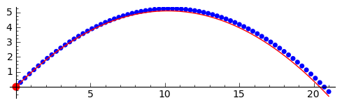
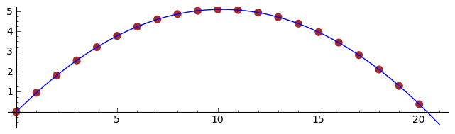
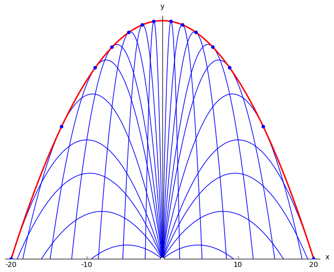

.. -*- coding: utf-8 -*-

Rzut ukośny
===========

.. image:: Warsztaty_Rzut_ukosny_media/data/Screenshot%20from%202012-09-24%2009:07:49.png
    :align: center

Wymagania:

#. Teoria rzutu ukośnego w zakresie fizyki szkoły średniej, wzór na trajektorię ruchu. 

#. Podstawy Sage: wykresy/pęlta/lista 

Rzut ukośny
----------- 

Rozważmy ruch punktu materialnego pod wpływem przyciągania ziemskiego. Zgodnie z  `Drugą Zasadą Dynamiki Newtona  <http://pl.wikipedia.org/wiki/Zasady_dynamiki_Newtona>`_ ruch punktu materialnego pod wpływem siły :math:`\vec F` jest opisywany przez:

.. MATH::

     m\,\vec a  = \vec F

W tym przypadku mamy   :math:` \vec F = m\vec g`,   gdzie  :math:` \vec g `   jest    `przyśpieszeniem ziemskim <http://pl.wikipedia.org/wiki/Przy%C5%9Bpieszenie_ziemskie>`_ .

Aby wyliczyć  `tor ruchu <http://pl.wikipedia.org/wiki/Tor_ruchu>`_  możemy skorzystać ze wzorów na:

- przyśpieszenie::math:`\quad\, \vec a =  \displaystyle \frac{\Delta \vec v}{\Delta t}  = \displaystyle \frac{\vec v-\vec v_0}{\Delta t}` 

- prędkość::math:`\qquad\quad\: \vec v = \displaystyle\frac{ \Delta \vec r}{\Delta t}  =  \displaystyle\frac{\vec r-\vec r_0}{\Delta t}` 

Podstawowe równania ruchu:  

.. MATH::

    \begin{cases}   m  \, \displaystyle \frac{\Delta \vec v}{\Delta t} &=& \vec F \\   \quad\displaystyle \frac{\Delta \vec r}{\Delta t} &=& \vec v\end{cases}

Stan układu jest jednoznacznie zadany przez położenie i prędkość: :math:` \vec r_0,\vec v_0` ,   w chwili początkowej :math:`t_0`.  Aby obliczyć  :math:`\vec r,\vec v`   po czasie :math:`\: \Delta t \;` możemy skorzystać ze wzorów na prędkość i przyśpieszenie:

- nowe położenie: :math:`  \, \vec r  =  \vec r_0  +  \vec v_0  \Delta t` 

- nowa prędkość::math:`\quad \vec v  =  \vec v_0  +  \displaystyle \frac{\vec F}{m}   \Delta t` 

Zakładamy, że ruch odbywa się w płaszczyźnie pionowej wyznaczonej przez wektory prędkości początkowej :math:`\;\vec v_0\;` i przyśpieszenia ziemskiego :math:`\;\vec g\,`.

Niech :math:`\:x\:` i :math:`\:y\;` będą współrzędnymi wektora położenia :math:`\:\vec r\,`, :math:`\:` a :math:`\ \: v_x\:` i :math:`\;v_y\:\ - \ ` współrzędnymi wektora prędkości :math:`\;\vec v\;` w układzie współrzędnych z poziomą osią :math:`Ox` i pionową osią :math:`Oy`.  Układ wielkości   :math:`\,(x,\,y,\,v_x,\,v_y\,)`
   jest matematyczną reprezentacją stanu cząstki.

Równania ruchu można teraz zapisać jako:

.. MATH::

    \begin{cases}\quad\;\displaystyle\frac{\Delta x}{\Delta t} &=& v_x\\\quad\;\displaystyle\frac{\Delta y}{\Delta t} &=& v_y \\\quad\;\displaystyle\frac{\Delta v_x}{\Delta t}&=& 0\\\quad\;\displaystyle\frac{\Delta v_y}{\Delta t} &=& -\:g\end{cases}

Wprowadzając wartości początkowe :math:`\:x_0\:` i :math:`\:y_0\:` dla współrzędnych położenia oraz :math:`\:v_{x0}\:` i :math:`\:v_{y0}\:` dla współrzędnych prędkości, otrzymujemy:

.. MATH::

    \begin{cases}\quad x &=&x_0 \ +\ v_{x0}\:\Delta t\\ \quad y &=&y_0\ +\ v_{y0}\:\Delta t\\ \quad v_x &=&v_{x0}\ +\ 0\:\Delta t\\ \quad v_y &=&v_{y0}\ -\  g\:\Delta t \end{cases}

.. code-block:: python

    sage: x0, y0  = 0.0, 0.0
    sage: vx0,vy0 = 10., 10.
    sage: dt = 0.2
    sage: g = 9.81
    sage: warunek_poczatkowy = x0, y0, vx0, vy0
    sage: punkty = [warunek_poczatkowy]

.. end of output

.. code-block:: python

    sage: vx = vx0 
    sage: vy = vy0 - g * dt
    sage: x  = x0  + vx0 *dt 
    sage: y  = y0  + vy0 *dt
    sage: x0, y0, vx0, vy0 = x, y, vx, vy
    sage: punkty.append( (x, y, vx, vy))
    sage: html.table([('$x$', '$y$','$v_x$','$v_y$')]+punkty,header=True)
    <html>...</html>

.. end of output

.. code-block:: python

    sage: x0,y0=0,0
    sage: vx0,vy0= 10,10
    sage: g=9.81
    sage: dt = 0.03
    sage: wykres = point( [(x0,y0)],pointsize=50,figsize=5,color='red')
    sage: for i in range(int(2.1/dt)):
    ...       x1 = x0 + vx0*dt
    ...       y1 = y0 + vy0*dt
    ...       vx1  = vx0        
    ...       vy1  = vy0 - g*dt 
    ...       x0,y0,vx0,vy0 = x1,y1,vx1,vy1 
    ...       wykres = wykres +  point( [(x1,y1)],pointsize=20,figsize=6)
    sage: var('t')
    sage: wykres + parametric_plot((10*t,10*t-g*t^2/2),(t,0,2.1),color='red')

.. end of output

.. code-block:: python

    sage: var('t')
    sage: @interact
    sage: def _(n=slider(range(10,100)+range(100,1000,100))):
    ...       g=9.81
    ...       x0, y0, vx0, vy0 = [0,0,10,10] 
    ...       dt = 2.1/n
    ...       trajektoria = [ (x0, y0) ]
    ...       
    ...       for i in range(n):
    ...           vx = vx0 
    ...           vy = vy0  - g * dt
    ...           x = x0 + vx0 *dt 
    ...           y = y0 + vy0 *dt 
    ...           if y<0:
    ...               break
    ...           x0, y0,vx0, vy0 = x, y, vx , vy 
    ...           trajektoria.append(( x,y ))
    ...       
    ...       plt1 =  line(trajektoria,figsize=(8,3),marker='o') 
    ...       x0, y0, vx0, vy0 = [0,0,10,10]
    ...       plt2 =  parametric_plot( [x0+vx0*t,y0+vy0*t-g*t^2/2],(t,0,2.1),color='red' )
    ...       (plt1+plt2).show()

.. end of output

Rzut ukośny z wiatrem i oporem powietrza
---------------------------------------- 

.. code-block:: python

    sage: var('t')
    sage: @interact
    sage: def _(Cx=slider(srange(0,1,0.01)),wiatr=slider(srange(-50,50,0.1))):
    ...       n=200
    ...       g=9.81
    ...       x0, y0, vx0, vy0 = [0,0,10,10] 
    ...       dt = 2.1/n
    ...       trajektoria = [ (x0, y0) ]
    ...       
    ...       for i in range(n):
    ...           vx = vx0 - Cx*(vx0-wiatr)*dt
    ...           vy = vy0  - g * dt - Cx*vy0*dt
    ...           x = x0 + vx0 *dt 
    ...           y = y0 + vy0 *dt 
    ...           if y<0:
    ...               break
    ...           x0, y0,vx0, vy0 = x, y, vx , vy 
    ...           trajektoria.append(( x,y ))
    ...       
    ...       plt1 =  line(trajektoria,figsize=(8,3)) 
    ...       x0, y0, vx0, vy0 = [0,0,10,10]
    ...       plt2 =  parametric_plot( [x0+vx0*t,y0+vy0*t-g*t^2/2],(t,0,2.1),color='red' )
    ...       (plt1+plt2).show()

.. end of output

Dla dociekliwych 
----------------- 

Matematycznie, jeśli wziąć granicę :math:`\Delta t \to 0` to otrzymujemy równania różniczkowe:

.. MATH::

    \begin{cases}\displaystyle\frac{d x}{d t} &=& v_x\\\displaystyle\frac{d y}{d t} &=& v_y \\\displaystyle\frac{d v_x}{d t}&=& 0\\\displaystyle\frac{d v_y}{d t} &=&-g\end{cases}

W powyższym  układzie równań różniczkowych zwyczajnych szukanymi są funkcje: 
 

.. MATH::

    x(t),\,y(t),\,v_x(t),\,v_y(t).

Do ich wyznaczenia potrzebne są

- układ równań 

- jeden warunek początkowy określający prędkość i położenie punktu materialnego w chwili :math:`t_0`. 

W systemie Sage istnieje  narzędzie do rozwiązywania takich równań:

.. code-block:: python

    sage: var('x y vx vy')
    sage: g=9.81
    sage: sol=desolve_odeint(vector( [vx,vy,0,-g] ),[0,0,10,10],srange(0,2.1,0.1),[x,y,vx,vy])

.. end of output

.. code-block:: python

    sage: var('t')
    sage: point( sol[:,0:2],color='brown',pointsize=50)+\
    ...    parametric_plot([10*t,10*t-g*t^2/2],(t,0,2.1))

.. end of output

Parabola bezpieczeństwa dla rodziny torów pocisków.
--------------------------------------------------- 

Rozważmy rodzinę torów pocisków wyrzucanych w płaszczyźnie pionowej  :math:`Oxy`  z początku układu współrzędnych 
 z taką samą prędkością początkową  :math:`v_0`,  ale pod różnymi kątami  :math:`\alpha`  względem osi  :math:`Ox` .

Chcemy wyznaczyć obszar bezpieczeństwa,  do którego pociski nie docierają.  Granicą tego obszaru okazuje się obwiednia rodziny torów.   
 W uproszczeniu można ją określić jako krzywą,  która jest styczna do każdego toru rodziny  i  przy tym składa się cała z tych punktów styczności.

Parametryczne równanie toru pocisku ma postać:  :math:`\quad\begin{cases} \  x \;=\; (v_0 \cos \alpha)\ t \\ \  y \;=\; (v_0 \sin \alpha)\ t \,-\, \frac{g}{2} \ t^2 \,. \end{cases}`

Rugując czas  :math:`t`,  otrzymamy równanie toru w postaci jawnej:  :math:`\quad\displaystyle y \ =\ (\text{tg}\,\alpha) \ x \; -\; \frac{g}{2\,v_0^2\cos^2\alpha} \  x^2\,.`

Przy oznaczeniach:  :math:`\qquad p \ =\ \text{tg}\,\alpha`     -     tangens kąta wyrzucenia,

:math:`\qquad\displaystyle h \ =\ \frac{v_0^2}{2g}`     -     wysokość rzutu pionowego z prędkością początkową  :math:`v_0\,,`

równanie toru przyjmuje postać:  :math:`\qquad\qquad\qquad\qquad\displaystyle y \; =\; p\, x \;-\; \frac{1+p^2}{4h} \ x^2\,.`          :math:`(1)`

Załóżmy,  że krzywe pewnej rodziny zadane są równaniem uwikłanym  :math:`F(x,y,p)\, =\, 0 \,,`  gdzie  :math:`p`  jest parametrem charakteryzującym poszczególne krzywe.   
 Jeżeli istnieje obwiednia tej rodziny,  to jej równanie otrzymuje się przez wyrugowanie parametru  :math:`p`  z  układu równań  [1,2]

:math:`\begin{cases} \  F(x,y,p) \  =\;0 \\ \  F_p'(x,y,p) \;=\;0 \,. \end{cases}`          :math:`(2)`

Dla rodziny torów pocisków obwiednia  (parabola bezpieczeństwa)  dana jest równaniem:  :math:`\quad\displaystyle y \; =\; h \,-\, \frac{x^2}{4h}\,.`          :math:`(3)`

Ćwiczenie.
   Wyprowadź równanie  (3)  stosując ogólny wzór  (2)  do przypadku  (1).

**Literatura.**

[1]  Roman Leitner,  Zarys matematyki wyższej,  część I,  WNT Warszawa  (w niniejszym opracowaniu przyjęto oznaczenia z tego podręcznika) 
 [2]  G.M. Fichtenholz,  Rachunek różniczkowy i całkowy,  tom I,  PWN Warszawa

.. code-block:: python

    sage: # Obwiednia (parabola bezpieczeństwa) dla rodziny torów pocisków.
    sage: var('x')
    sage: L = [] # inicjacja listy torów i punktów styczności
    sage: h = 10 # maksymalna wysokość osiągana przez pociski
    sage: # Równanie i wykres obwiedni:
    sage: over(x)  = h-x^2/(4*h)
    sage: envelope = plot(over(x), (x, -20, +20), color='red', thickness=2)
    sage: # Określenie i wypisanie zbioru wartości vals parametru p:
    sage: plus = [0.25, 0.5, 0.75, 1.0, 1.5, 2.25, 3.0, 4.5, 7.5, 17.5]
    sage: minus = [-p for p in plus[::-1]]
    sage: vals = minus + plus
    sage: print "Wartości parametru p:", map(lambda p: round(p,2), vals)
    sage: for p in vals:
    ...       # Równanie i wykres toru dla parametru p:
    ...       throw(x) = p*x-(1+p^2)/(4*h)*x^2 
    ...       plt = plot(throw(x), (x, -20, 20))
    ...       
    ...       # Wyznaczenie punktu styczności Pt toru i obwiedni:
    ...       soln = solve(throw(x)==over(x), x)
    ...       xt = soln[0].rhs(); yt = over(xt)
    ...       Pt = point((xt,yt), color='blue', size=20, zorder=5)  
    ...       
    ...       # Dodanie wykresu toru i punktu styczności do listy:
    ...       L.append(plt + Pt)
    ...       
    sage: P0 = point((0,0), color='white', faceted=True, size=25, zorder=5)
    sage: show(P0 + sum(L) + envelope, axes_labels=['x','y'], figsize=8,
    ...        ticks=[[-20,-10,10,20],[]], xmin=-20, xmax=+20, ymin=0.175)
    Wartości parametru p: [-17.5, -7.5, -4.5, -3.0, -2.25, -1.5, -1.0, -0.75, -0.5, -0.25, 0.25, 0.5, 0.75, 1.0, 1.5, 2.25, 3.0, 4.5, 7.5, 17.5]

.. end of output

Inspekcja poniższego wzoru:

#. Ilustruje poprawnośc warunku na obwiednię rodziny krzywych: ustawiając rysunek tak by os p była wzdłuż lini wzroku. 

#. Pokazuje kąt w którym mamy maksymalny zasięg. 

.. code-block:: python

    sage: var('x p y')
    sage: h  =  10
    sage: implicit_plot3d( p*x-(1+p^2)/(4*h)*x^2-y,(x,-20,20),(y,0,10),(p,-7.7,7.7),plot_points=90) +\
    ...    sum([parametric_plot3d( (x,p0*x-(1+p0^2)/(4*h)*x^2,p0),(x,0,40*p0/(p0^2 + 1)),color='red',thickness=11) for p0 in srange(0.5,6,1)])

.. end of output

